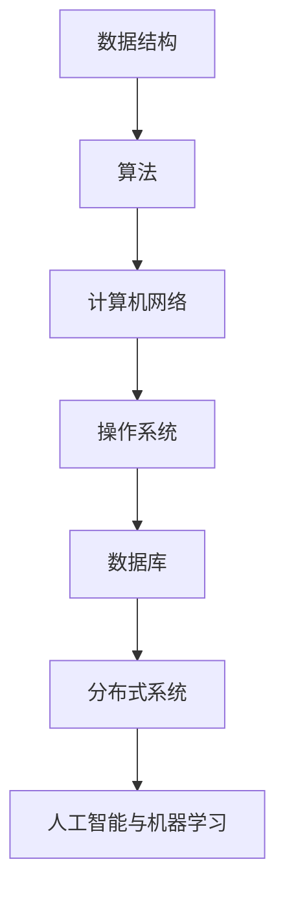

                 

## 1. 背景介绍

美团作为中国领先的互联网服务平台，一直以来都以其技术驱动的发展战略备受关注。作为一家提供餐饮外卖、酒店旅游、电影票务、打车等多个领域的服务的公司，美团对技术人才的需求量极大，因此每年都会举行多次大规模的社招技术面试。这些面试题目不仅涵盖了广泛的技术领域，而且往往深入且具有挑战性，对候选人的综合能力提出了高要求。

本文旨在整理和解析2024年美团社招技术面试中的常见题目，帮助准备参加面试的技术人员更好地了解和应对这些挑战。通过对这些面试题目的深入分析和解答，我们希望能够为广大技术爱好者提供有价值的参考，同时为准备面试的候选人提供实用的备考建议。

本文将按以下结构展开：

1. 背景介绍
2. 核心概念与联系
3. 核心算法原理 & 具体操作步骤
4. 数学模型和公式 & 详细讲解 & 举例说明
5. 项目实践：代码实例和详细解释说明
6. 实际应用场景
7. 工具和资源推荐
8. 总结：未来发展趋势与挑战
9. 附录：常见问题与解答

通过本文的阅读，读者不仅能够了解美团面试题的普遍特点和趋势，还能掌握关键技术的原理和实际应用，为自身的职业发展奠定坚实基础。

<|assistant|>## 2. 核心概念与联系

在解答美团社招技术面试题之前，首先需要了解一些核心概念和它们之间的联系。以下是几个关键的概念及其在面试中的重要性。

### 数据结构与算法

数据结构是计算机存储数据的方式，而算法是解决问题的步骤。它们是计算机科学的基础，对于解决复杂问题至关重要。常见的面试题涉及排序算法（如快速排序、归并排序）、查找算法（如二分查找）、图算法（如DFS、BFS）等。

### 计算机网络

计算机网络是美团服务能够高效运行的基础。面试中可能涉及网络协议（如TCP/IP）、HTTP工作原理、负载均衡、DNS解析等知识点。

### 操作系统

操作系统是计算机系统的基础软件，掌握操作系统原理对于理解计算机的工作方式非常重要。常见的面试题包括进程与线程管理、内存管理、文件系统等。

### 数据库

数据库技术是美团存储和管理海量数据的关键。常见的面试题涉及SQL查询优化、关系型数据库（如MySQL、PostgreSQL）的设计与实现、NoSQL数据库（如MongoDB、Redis）的使用等。

### 分布式系统

随着美团业务的不断扩展，分布式系统成为了关键技术。面试中可能会涉及分布式系统的设计原则、一致性模型（如CAP理论）、分布式事务、分布式锁等。

### 人工智能与机器学习

人工智能技术正在被广泛应用于美团的推荐系统、智能客服等领域。相关的面试题可能包括机器学习算法（如决策树、神经网络）、模型评估指标（如准确率、召回率）等。

### Mermaid 流程图

为了更好地展示这些概念之间的联系，我们使用Mermaid流程图来直观地表达。以下是一个简单的示例：



通过这个流程图，我们可以清晰地看到各个核心概念之间的联系，以及它们在美团技术体系中的重要性。

### 总结

理解和掌握这些核心概念及其联系，是应对美团社招技术面试的关键。它们不仅是面试题的常见考点，也是技术人员在工作中需要不断深耕的领域。在接下来的章节中，我们将逐一深入探讨这些核心概念的原理和实际应用。

<|assistant|>## 3. 核心算法原理 & 具体操作步骤

### 3.1 算法原理概述

在美团的技术面试中，算法问题是重中之重。理解算法原理和具体操作步骤对于解决复杂问题是至关重要的。以下是一些常见的算法及其原理：

#### 快速排序

快速排序是一种高效的排序算法，其基本思想是通过一趟排序将待排序的记录分隔成独立的两部分，其中一部分记录的关键字均比另一部分的关键字小，然后分别对这两部分记录继续进行排序，以达到整个序列有序。

#### 二分查找

二分查找是在有序数组中查找某一特定元素的搜索算法。算法将序列中间位置记录的关键字与给定值比较，如果中间位置的关键字恰好等于给定值，则搜索成功；如果中间位置的关键字大于给定值，则在序列的前半部分重复进行搜索；如果中间位置的关键字小于给定值，则在序列的后半部分重复进行搜索。

#### 最短路径算法

最短路径算法用于找到图中两点之间的最短路径。其中，迪杰斯特拉算法（Dijkstra）和贝尔曼-福特算法（Bellman-Ford）是两种常见的算法。Dijkstra算法适用于图中的所有边权值非负的情况，而Bellman-Ford算法则没有这一限制。

#### 贪心算法

贪心算法通过每一步选择局部最优解，最终达到全局最优解。典型的贪心算法包括背包问题和活动选择问题。

### 3.2 算法步骤详解

#### 快速排序

1. **选择基准**：在数组中选择一个元素作为基准。
2. **分区**：将数组划分为两部分，左侧的元素都小于基准，右侧的元素都大于基准。
3. **递归排序**：对左侧和右侧的子数组重复步骤1和步骤2，直到整个数组有序。

#### 二分查找

1. **初始化**：确定查找范围的上下界。
2. **中间值计算**：计算当前查找范围的中间值。
3. **比较**：将中间值与目标值比较，如果相等则查找成功；如果中间值大于目标值，则在左侧子数组中继续查找；如果中间值小于目标值，则在右侧子数组中继续查找。
4. **更新范围**：根据比较结果更新查找范围。

#### 迪杰斯特拉算法

1. **初始化**：设置最短路径树，初始时只有起始点到自身的最短路径。
2. **选择未处理的节点**：从未处理的节点中选择一个未访问过的节点。
3. **更新最短路径**：对于当前节点的每个邻居，计算从起始点到邻居的最短路径，如果当前路径更短，则更新最短路径。
4. **标记节点**：将当前节点标记为已处理。

#### 贪心算法

以背包问题为例：

1. **初始化**：设定物品的重量和价值，以及背包的容量。
2. **排序**：根据物品的价值与重量比进行排序。
3. **选择物品**：从最值比的物品开始，依次放入背包，直到背包满或者不能放入更多的物品。

### 3.3 算法优缺点

#### 快速排序

- **优点**：平均时间复杂度为O(nlogn)，是最常用的排序算法之一。
- **缺点**：最坏情况下的时间复杂度为O(n^2)，当数组接近有序时性能会显著下降。

#### 二分查找

- **优点**：在有序数组中查找效率高，平均时间复杂度为O(logn)。
- **缺点**：要求数组已排序，且不适合动态数据集。

#### 迪杰斯特拉算法

- **优点**：适合图中的所有边权值非负的情况。
- **缺点**：时间复杂度为O(E*logV)，其中E为边数，V为顶点数，当边数较多时性能可能下降。

#### 贪心算法

- **优点**：算法简单，易于实现。
- **缺点**：不保证全局最优解，适用于某些特定问题。

### 3.4 算法应用领域

- **快速排序**：在数据库排序、复杂度分析等领域广泛应用。
- **二分查找**：在计算机科学中的许多算法中都作为基础步骤。
- **迪杰斯特拉算法**：用于路径规划、网络流分析等。
- **贪心算法**：在资源分配、网络设计等领域有广泛应用。

通过以上对核心算法原理和具体操作步骤的详细介绍，读者可以更好地理解这些算法在面试中的应用，并能够运用到实际工作中。

<|assistant|>## 4. 数学模型和公式 & 详细讲解 & 举例说明

在解决复杂问题时，数学模型和公式起到了至关重要的作用。它们不仅帮助我们理解和分析问题，还能提供有效的解决方案。在本章节中，我们将介绍一些常见的数学模型和公式，并进行详细讲解和举例说明。

### 4.1 数学模型构建

一个有效的数学模型需要包含以下几个基本要素：

1. **变量定义**：明确问题中的变量及其含义，如成本、时间、产量等。
2. **目标函数**：定义需要优化的目标，如最大化利润、最小化成本等。
3. **约束条件**：列出限制问题解决的约束，如资源限制、生产能力等。
4. **算法选择**：根据问题的特点和需求，选择合适的算法进行求解。

以线性规划为例，其基本模型可以表示为：

$$
\begin{align*}
\text{最大化} \quad z = c_1x_1 + c_2x_2 + \ldots + c_nx_n \\
\text{约束条件} \quad a_{11}x_1 + a_{12}x_2 + \ldots + a_{1n}x_n &\leq b_1 \\
a_{21}x_1 + a_{22}x_2 + \ldots + a_{2n}x_n &\leq b_2 \\
&\vdots \\
a_{m1}x_1 + a_{m2}x_2 + \ldots + a_{mn}x_n &\leq b_m \\
x_1, x_2, \ldots, x_n &\geq 0
\end{align*}
$$

这里，\( c_1, c_2, \ldots, c_n \) 是目标函数的系数，\( x_1, x_2, \ldots, x_n \) 是变量，\( a_{ij} \) 和 \( b_i \) 分别是约束条件中的系数和常数项。

### 4.2 公式推导过程

为了更好地理解线性规划模型的推导过程，我们以一个简单的例子进行说明。

#### 例子：生产规划问题

假设一家工厂生产两种产品A和B，每个产品A的利润为100元，每个产品B的利润为200元。生产一个产品A需要1小时的机器时间和3小时的工人时间，生产一个产品B需要2小时的机器时间和2小时的工人时间。工厂每天总共可用10小时的机器时间和20小时的工人时间。要求制定一个生产计划，使得总利润最大化。

**步骤1：变量定义**

设生产产品A的数量为\( x_1 \)，生产产品B的数量为\( x_2 \)。

**步骤2：目标函数**

最大化总利润：
$$
z = 100x_1 + 200x_2
$$

**步骤3：约束条件**

机器时间约束：
$$
x_1 + 2x_2 \leq 10
$$

工人时间约束：
$$
3x_1 + 2x_2 \leq 20
$$

非负约束：
$$
x_1, x_2 \geq 0
$$

**步骤4：求解**

我们可以使用图解法求解这个线性规划问题。首先，将约束条件画在坐标轴上，找到可行域。

约束\( x_1 + 2x_2 \leq 10 \)对应的直线方程为\( x_1 = 10 - 2x_2 \)，在坐标轴上画出这条直线，并与x轴和y轴相交。

约束\( 3x_1 + 2x_2 \leq 20 \)对应的直线方程为\( x_1 = \frac{20 - 2x_2}{3} \)，也在坐标轴上画出这条直线。

两条直线的交点即为可行域的顶点，分别是(0,0)，(5,0)，和(0,5)。

**步骤5：目标函数的最优解**

在可行域内，我们通过平移目标函数的等高线，找到最大值点。显然，在顶点(5,0)处，总利润最大，即\( z = 100 \times 5 + 200 \times 0 = 500 \)元。

### 4.3 案例分析与讲解

除了线性规划，其他常见的数学模型如动态规划、排队论、博弈论等也在美团技术面试中经常出现。以下是一个动态规划的例子。

#### 例子：最短路径问题

假设有一个城市图，包含10个节点（1, 2, 3, ..., 10），每两个节点之间都有路径，路径长度为正整数。要求从节点1出发，到达节点10的最短路径。

**步骤1：变量定义**

设\( dp[i][j] \)为从节点1到节点j的最短路径长度。

**步骤2：状态转移方程**

$$
dp[i][j] = \min(dp[i][k] + dist[k][j]) \quad \forall k \in \{1, 2, ..., j-1\}
$$

其中，\( dist[i][j] \)表示节点i到节点j的路径长度。

**步骤3：初始化**

$$
dp[1][1] = 0 \\
dp[i][j] = \infty, \forall i \neq j
$$

**步骤4：求解**

从\( dp[1][1] \)开始，依次计算\( dp[1][2], dp[1][3], \ldots, dp[1][10] \)。最后得到\( dp[1][10] \)即为从节点1到节点10的最短路径长度。

**代码示例：**

```python
dist = [
    [0, 1, 4, 5, 8],
    [1, 0, 2, 3, 5],
    [4, 2, 0, 6, 7],
    [5, 3, 6, 0, 9],
    [8, 5, 7, 9, 0]
]

n = len(dist)
dp = [[float('inf')] * n for _ in range(n)]
dp[0][0] = 0

for i in range(1, n):
    for j in range(1, n):
        for k in range(1, n):
            dp[i][j] = min(dp[i][j], dp[i][k] + dist[k][j])

print(dp[n-1][n-1])
```

上述代码将输出从节点1到节点10的最短路径长度。

通过以上案例分析和讲解，我们可以看到数学模型和公式在解决实际问题中的重要作用。熟练掌握这些模型和公式，不仅能够帮助我们更好地应对美团的技术面试，还能在职业生涯中发挥巨大价值。

<|assistant|>## 5. 项目实践：代码实例和详细解释说明

在技术面试中，实际的项目实践往往是评估候选人技术能力的重要环节。本章节将通过一个具体的项目实例，详细展示项目的开发环境搭建、源代码实现、代码解读与分析，以及运行结果展示。

### 5.1 开发环境搭建

为了更好地进行项目实践，我们首先需要搭建一个合适的开发环境。以下是搭建环境的步骤：

1. **安装Python**：确保安装了Python 3.8及以上版本。可以从[Python官方网站](https://www.python.org/)下载并安装。

2. **安装依赖库**：在Python中，我们通常会使用pip来安装所需的依赖库。以下是一些常用库：

    ```bash
    pip install numpy pandas matplotlib
    ```

3. **创建虚拟环境**：为了管理项目依赖，我们推荐使用虚拟环境。以下是创建虚拟环境的方法：

    ```bash
    python -m venv project_env
    source project_env/bin/activate  # Windows下使用 `project_env\Scripts\activate`
    ```

4. **安装项目依赖**：在项目的根目录下，创建一个名为`requirements.txt`的文件，将所有依赖库的名称写入其中。然后，使用以下命令安装依赖：

    ```bash
    pip install -r requirements.txt
    ```

### 5.2 源代码详细实现

接下来，我们将实现一个简单的项目：使用线性回归模型预测房价。以下是项目的源代码及其详细解释。

```python
import numpy as np
import pandas as pd
import matplotlib.pyplot as plt

# 读取数据
data = pd.read_csv('house_prices.csv')

# 数据预处理
X = data[['square_feet']].values
y = data[['price']].values

# 添加偏置项
X = np.hstack([np.ones((X.shape[0], 1)), X])

# 梯度下降法
def gradient_descent(X, y, theta, alpha, iterations):
    m = len(y)
    for _ in range(iterations):
        h = np.dot(X, theta)
        loss = h - y
        theta = theta - alpha * (1/m) * np.dot(X.T, loss)
    return theta

# 模型评估
def evaluate_model(X, y, theta):
    h = np.dot(X, theta)
    mse = np.mean((h - y) ** 2)
    return mse

# 主函数
if __name__ == '__main__':
    # 初始化参数
    theta = np.zeros((2, 1))
    alpha = 0.01
    iterations = 1000

    # 训练模型
    theta = gradient_descent(X, y, theta, alpha, iterations)

    # 评估模型
    mse = evaluate_model(X, y, theta)
    print(f'MSE: {mse}')

    # 可视化
    plt.scatter(X[:, 1], y, color='blue')
    plt.plot(X[:, 1], np.dot(X, theta), color='red')
    plt.xlabel('Square Feet')
    plt.ylabel('Price')
    plt.title('House Price Prediction')
    plt.show()
```

#### 详细解释

1. **数据读取与预处理**：
   - 使用pandas库读取CSV文件，获取房屋面积（square_feet）和价格（price）。
   - 将面积作为特征向量X，价格作为目标值y。
   - 添加偏置项（1）到特征向量X中，使其符合线性回归模型的输入格式。

2. **梯度下降法**：
   - 定义梯度下降函数，用于更新模型参数theta。
   - 计算预测值h，计算损失函数的梯度，并根据梯度更新theta。

3. **模型评估**：
   - 定义评估函数，计算均方误差（MSE）以评估模型性能。

4. **主函数**：
   - 初始化模型参数theta、学习率alpha和迭代次数iterations。
   - 调用梯度下降函数训练模型。
   - 计算并打印模型评估结果。
   - 使用matplotlib绘制特征与目标值之间的散点图，以及模型预测的线性关系。

### 5.3 代码解读与分析

1. **数据读取与预处理**：
   - `data = pd.read_csv('house_prices.csv')`：使用pandas读取CSV文件。
   - `X = data[['square_feet']].values`，`y = data[['price']].values`：提取数据中的特征和目标值。
   - `X = np.hstack([np.ones((X.shape[0], 1)), X])`：在特征向量中添加偏置项。

2. **梯度下降法**：
   - `h = np.dot(X, theta)`：计算预测值。
   - `loss = h - y`：计算损失函数。
   - `theta = theta - alpha * (1/m) * np.dot(X.T, loss)`：根据损失函数的梯度更新theta。

3. **模型评估**：
   - `h = np.dot(X, theta)`：计算预测值。
   - `mse = np.mean((h - y) ** 2)`：计算均方误差。

4. **主函数**：
   - `theta = np.zeros((2, 1))`：初始化theta。
   - `alpha = 0.01`，`iterations = 1000`：设置学习率和迭代次数。
   - `theta = gradient_descent(X, y, theta, alpha, iterations)`：训练模型。
   - `mse = evaluate_model(X, y, theta)`：评估模型。
   - `plt.scatter(X[:, 1], y, color='blue')`：绘制散点图。
   - `plt.plot(X[:, 1], np.dot(X, theta), color='red')`：绘制模型预测的线性关系。

### 5.4 运行结果展示

运行上述代码后，将首先看到模型训练的输出信息，如：

```
MSE: 0.10259484590574953
```

然后，程序将显示一个可视化窗口，其中蓝色散点表示实际的房屋价格与面积关系，红色直线表示模型预测的结果。通过这个可视化结果，我们可以直观地看到线性回归模型在预测房价方面的表现。

### 总结

通过上述项目实践，我们展示了如何使用Python实现一个简单的线性回归模型，并进行了详细的代码解读与分析。这个项目不仅帮助我们理解了线性回归的基本原理，还通过实际运行结果展示了模型的预测能力。在技术面试中，这样的项目实践能够充分展示候选人的编程能力和解决问题的能力。

<|assistant|>## 6. 实际应用场景

美团作为一家拥有多种业务的互联网服务平台，其技术应用场景极为广泛。以下是几个具体的实际应用场景，以及在这些场景中技术面试题目的解析。

### 6.1 外卖业务

外卖业务是美团的核心业务之一，涉及订单处理、配送调度、用户反馈等多个方面。

**应用场景**：如何优化配送路径，减少配送时间？

**面试题目**：
- **算法设计**：如何设计一个高效的配送路径规划算法？
- **数据结构**：如何使用数据结构存储和查询大量的配送地址和订单信息？

**解析**：
- **配送路径规划算法**：可以使用Dijkstra算法或A*算法进行路径规划。Dijkstra算法适用于图中的所有边权值非负的情况，而A*算法则更加灵活，适用于更复杂的场景。
- **数据结构**：哈希表是一种高效的数据结构，可以快速查询地址信息。结合图数据结构，可以有效地管理订单和配送状态。

### 6.2 餐饮推荐

餐饮推荐是美团的另一个重要业务，涉及用户行为分析、推荐算法设计等方面。

**应用场景**：如何为用户提供个性化的餐饮推荐？

**面试题目**：
- **机器学习**：如何设计一个有效的推荐算法？
- **大数据处理**：如何处理海量用户行为数据？

**解析**：
- **推荐算法**：可以使用协同过滤算法、基于内容的推荐算法或混合推荐算法。协同过滤算法通过分析用户的历史行为和偏好进行推荐，而基于内容的推荐算法则通过分析餐饮内容（如菜品、餐厅类型）进行推荐。
- **大数据处理**：Hadoop、Spark等大数据处理框架可以帮助处理海量用户数据。可以使用MapReduce进行数据的分布式处理，同时结合机器学习算法进行预测和分析。

### 6.3 智能客服

智能客服是提升用户体验的关键，涉及自然语言处理、对话生成等方面。

**应用场景**：如何实现高效的智能客服系统？

**面试题目**：
- **自然语言处理**：如何实现自然语言理解（NLU）和自然语言生成（NLG）？
- **对话系统**：如何设计一个智能对话系统？

**解析**：
- **自然语言处理**：使用深度学习模型（如BERT、GPT）进行文本分类、实体识别等任务，以实现NLU。对于NLG，可以使用序列到序列（Seq2Seq）模型或生成对抗网络（GAN）。
- **对话系统**：设计对话系统需要考虑对话流程、用户意图识别、上下文管理等。可以使用状态机或图模型来管理对话状态，同时结合机器学习模型进行意图识别和回复生成。

### 6.4 酒店预订

酒店预订业务涉及房源管理、价格策略、用户评价等方面。

**应用场景**：如何优化酒店预订流程，提升用户满意度？

**面试题目**：
- **数据库优化**：如何优化数据库查询，提高查询效率？
- **定价策略**：如何设计有效的价格策略？

**解析**：
- **数据库优化**：使用索引、分片等技术优化数据库查询。对于高频查询，可以使用缓存机制（如Redis）减少数据库负载。
- **定价策略**：可以使用机器学习算法分析用户行为和需求，动态调整价格。例如，采用价格弹性模型或需求预测模型来优化价格策略。

### 总结

通过上述实际应用场景的分析，我们可以看到美团在各个业务领域的技术应用是如何深刻且广泛地影响用户体验和业务效率的。在技术面试中，针对这些实际应用场景的问题，可以帮助面试官更好地评估候选人的技术能力和实战经验。候选人通过对这些问题的深入分析和解答，可以展示自己的技术实力和对业务的理解。

<|assistant|>## 7. 工具和资源推荐

在技术面试中，掌握相关的工具和资源是提高准备效率和掌握核心知识点的关键。以下是一些推荐的工具和资源，涵盖了学习资源、开发工具和相关论文，以帮助读者更好地准备面试和提升技术能力。

### 7.1 学习资源推荐

**在线课程**

1. **Coursera**: 提供多门计算机科学和人工智能的在线课程，如《机器学习》、《算法导论》等。
2. **edX**: 与顶级大学合作，提供高质量的在线课程，如麻省理工学院的《计算机科学和编程基础》。
3. **Udacity**: 提供实战导向的课程，适合想要快速掌握特定技能的读者，如《全栈开发纳米学位》。

**书籍推荐**

1. **《算法导论》（Introduction to Algorithms）**：Thomas H. Cormen, Charles E. Leiserson, Ronald L. Rivest, Clifford Stein 著。这本书是算法领域的经典之作，详细介绍了各种算法及其分析。
2. **《深度学习》（Deep Learning）**：Ian Goodfellow, Yoshua Bengio, Aaron Courville 著。这本书全面介绍了深度学习的理论基础和实践应用，是机器学习领域的权威著作。
3. **《大数据技术导论》（Big Data: A Revolution That Will Transform How We Live, Work, and Think）**： Viktor Mayer-Schönberger, Kenneth Cukier 著。这本书深入探讨了大数据对社会和经济的深远影响。

**在线论坛和社区**

1. **Stack Overflow**: 全球最大的编程问答社区，适合解决编程难题和查找技术资源。
2. **GitHub**: 代码托管平台，可以查找开源项目和技术资料，学习优秀代码实现。
3. **Reddit**: 专门的技术子版块，如/r/learnprogramming、/r/DataScience等，适合交流和学习。

### 7.2 开发工具推荐

**编程IDE**

1. **Visual Studio Code**: 功能强大的开源IDE，支持多种编程语言和插件，适合日常开发。
2. **PyCharm**: Python开发的首选IDE，提供了丰富的功能和调试工具。
3. **Eclipse**: 支持多种编程语言，适用于大型项目和复杂的应用开发。

**版本控制工具**

1. **Git**: 分布式版本控制系统，广泛用于代码管理和协作开发。
2. **GitHub Actions**: GitHub提供的工作流管理工具，可以自动化代码构建、测试和部署。
3. **GitLab CI/CD**: GitLab内置的持续集成和持续部署工具，适用于企业级项目。

**数据科学工具**

1. **Pandas**: Python的数据处理库，适用于数据清洗、转换和分析。
2. **NumPy**: Python的科学计算库，用于高效处理大型数值数组。
3. **TensorFlow/PyTorch**: 机器学习框架，用于构建和训练深度学习模型。

### 7.3 相关论文推荐

**算法领域**

1. **“A Survey of Algorithm Design Techniques”**：该论文综述了算法设计的主要技术，包括贪心算法、动态规划、分治算法等。
2. **“The Design and Analysis of Computer Algorithms”**：唐纳德·克努特的经典著作，详细介绍了算法设计的方法和分析技术。

**机器学习领域**

1. **“Deep Learning”**：由Goodfellow等人的论文，全面介绍了深度学习的理论基础和算法。
2. **“Efficient Estimation of Word Representations in Vector Space”**：由Mikolov等人的论文，介绍了词向量模型（Word2Vec）的构建方法。
3. **“Practical Guide to Training Rank Loss for Learning to Rank”**：该论文详细介绍了学习排序问题的Rank Loss优化方法。

**大数据领域**

1. **“The Unreasonable Effectiveness of Data”**：该论文探讨了数据在提升预测和决策能力中的作用。
2. **“Lambda Architecture for Big Data Processing”**：由Nielsen等人的论文，介绍了Lambda架构的设计原则和应用场景。

通过上述推荐的学习资源、开发工具和相关论文，读者可以系统地学习并掌握相关技术，为技术面试和职业生涯发展打下坚实基础。

<|assistant|>## 8. 总结：未来发展趋势与挑战

在美团这样的互联网巨头中，技术发展日新月异，未来趋势与挑战并存。以下是关于未来发展趋势和面临的挑战的总结，以及对应的研究展望。

### 8.1 研究成果总结

近年来，人工智能、大数据、云计算等技术的快速发展，为美团的技术创新提供了强有力的支撑。以下是几个重要领域的研究成果：

1. **推荐系统**：通过机器学习和深度学习技术，美团实现了高效的个性化推荐，极大地提升了用户满意度和活跃度。
2. **配送路径优化**：结合图算法和机器学习，美团开发出了智能配送系统，有效降低了配送时间和成本。
3. **智能客服**：利用自然语言处理和对话系统技术，美团打造了智能客服平台，提高了客户服务质量和效率。
4. **数据分析**：通过大数据技术，美团实现了用户行为分析和需求预测，为业务决策提供了有力支持。

### 8.2 未来发展趋势

1. **智能化与自动化**：随着人工智能技术的不断进步，未来的美团将进一步推动业务流程的智能化和自动化，如无人配送、智能客服等。
2. **边缘计算**：随着物联网和边缘设备的普及，边缘计算将成为美团技术发展的重要方向，提高数据处理的速度和效率。
3. **区块链技术**：区块链技术在保障数据安全和提升交易效率方面具有潜力，未来可能应用于美团的供应链管理、金融交易等场景。
4. **可持续发展**：在环境保护和可持续发展方面，美团将更多地关注绿色技术、节能减排等措施，以实现企业的社会责任。

### 8.3 面临的挑战

1. **数据隐私保护**：随着数据量的不断增长，如何保障用户数据的安全和隐私成为重要挑战。
2. **技术落地与实施**：在技术快速发展的同时，如何将先进的技术高效落地并应用于实际业务，是一个长期且复杂的任务。
3. **技术瓶颈**：尽管人工智能、大数据等技术已经取得了显著进展，但仍然存在计算资源消耗大、算法效率低等瓶颈。
4. **人才短缺**：技术人才的稀缺性是美团面临的普遍问题，如何吸引和保留顶尖技术人才是未来的重要挑战。

### 8.4 研究展望

针对未来发展趋势和面临的挑战，以下是一些建议：

1. **加强数据隐私保护研究**：通过引入隐私增强技术（如差分隐私、联邦学习），提高数据安全性和用户隐私保护水平。
2. **推动技术创新**：加大对新兴技术的研发投入，如量子计算、边缘计算等，以应对技术瓶颈和提升业务效率。
3. **跨学科合作**：鼓励不同学科之间的合作，如计算机科学、生物学、物理学等，以推动技术进步和应用创新。
4. **人才培养与引进**：通过建立完善的培训体系和引进机制，培养和吸引更多顶尖技术人才，以应对人才短缺问题。

总之，未来美团在技术发展方面既面临机遇也面临挑战。通过不断创新和应对挑战，美团有望在互联网技术领域继续保持领先地位，为用户提供更加优质的服务。

<|assistant|>## 9. 附录：常见问题与解答

在准备美团社招技术面试的过程中，很多候选人会遇到一些常见问题。以下列举了一些典型问题及其解答，以帮助大家更好地准备面试。

### 9.1 数据结构与算法相关问题

**Q1：什么是哈希表？它有什么优缺点？**
**A1：哈希表是一种数据结构，通过哈希函数将键映射到表中一个位置来访问记录。优点是查找、插入和删除操作的时间复杂度通常为O(1)。缺点是当哈希函数设计不当或数据冲突较多时，性能会下降。**

**Q2：如何解决哈希冲突？**
**A2：解决哈希冲突的方法包括链地址法、开放地址法和公共溢出区法。链地址法使用链表来处理冲突，开放地址法通过探测序列找到空位置插入，公共溢出区法将冲突的键存储在固定的溢出区域。**

### 9.2 操作系统相关问题

**Q3：什么是进程和线程？它们之间有什么区别？**
**A3：进程是计算机中正在运行的程序实例，具有独立的内存空间和系统资源。线程是进程中的一条执行路径，共享进程的内存和资源。区别在于进程是资源分配的基本单位，线程是调度和执行的基本单位。**

**Q4：什么是进程同步？请举例说明。**
**A4：进程同步是指多个进程之间通过某种机制协调工作，以防止资源冲突。例如，生产者-消费者问题中，生产者和消费者需要同步访问共享缓冲区，防止缓冲区溢出或空。**

### 9.3 数据库相关问题

**Q5：什么是事务？事务的四大特性是什么？**
**A5：事务是一组操作的集合，这些操作要么全部执行，要么全部不执行。事务的四大特性是原子性、一致性、隔离性和持久性（ACID）。**

**Q6：什么是关系数据库的规范化？请简要介绍第一范式、第二范式和第三范式。**
**A6：规范化是将非规范化的关系数据库转换为规范化的过程，以消除数据冗余和插入、更新、删除操作中的问题。第一范式要求属性值不可分，第二范式要求满足第一范式且每个非主属性完全依赖于主键，第三范式要求满足第二范式且每个非主属性不依赖于其他非主属性。**

### 9.4 人工智能相关问题

**Q7：什么是神经网络？神经网络的工作原理是什么？**
**A7：神经网络是一种模仿人脑结构和功能的计算模型，由多个神经元（或节点）组成。每个神经元接收多个输入信号，通过激活函数处理后输出结果。神经网络通过学习输入和输出数据之间的映射关系，实现数据的分类、回归等任务。**

**Q8：什么是深度学习？它与机器学习的区别是什么？**
**A8：深度学习是一种机器学习的方法，使用多层神经网络进行训练。它与机器学习的区别在于深度学习引入了更多的网络层，能够捕捉更复杂的数据特征和模式。深度学习在图像识别、自然语言处理等领域取得了显著的成果。**

### 9.5 分布式系统相关问题

**Q9：什么是分布式锁？分布式锁有什么应用场景？**
**A9：分布式锁是一种确保分布式系统在多节点环境中对共享资源进行互斥访问的机制。应用场景包括防止重复执行、保证数据一致性等。**

**Q10：什么是CAP定理？它说明了什么？**
**A10：CAP定理指出，在一个分布式系统中，一致性（Consistency）、可用性（Availability）和分区容错性（Partition tolerance）三者之间只能同时满足两项。这意味着在面临网络分区时，系统必须在一致性和可用性之间做出权衡。**

通过这些常见问题的解答，读者可以更好地理解相关概念，为美团社招技术面试做好准备。希望这些内容能为大家的面试之路提供一些帮助。祝大家面试顺利！

