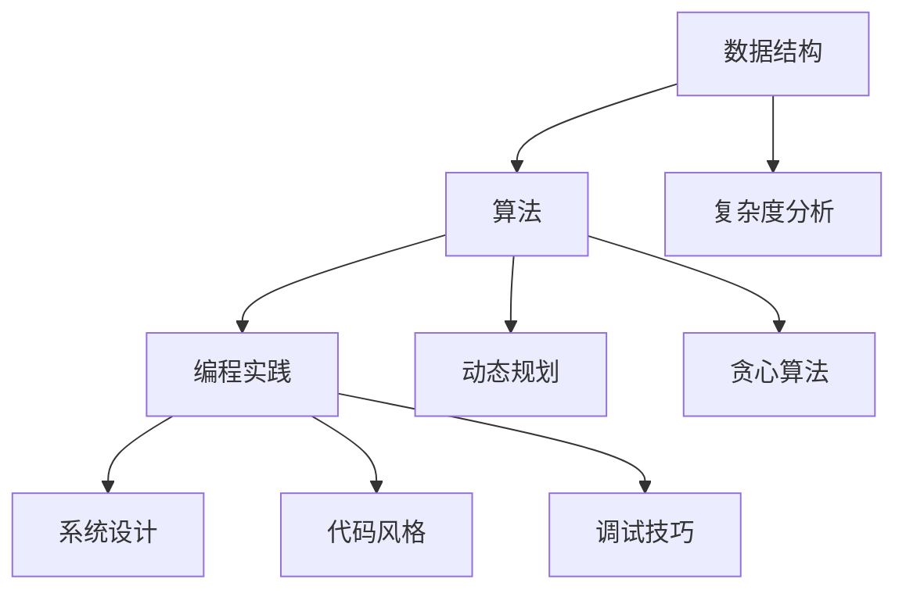

                 

在这个技术飞速发展的时代，技术面试作为评估求职者技能和潜力的重要手段，一直是众多科技企业和求职者关注的焦点。尤其是像腾讯这样的全球知名科技公司，其校招技术面试题集锦更是成为众多计算机专业学子翘首以盼的宝贵资源。本文旨在为广大考生提供一个全面、深入的技术面试题集锦，帮助大家更好地应对2025年腾讯校招的技术面试。

## 文章关键词

- 腾讯校招
- 技术面试
- 数据结构
- 算法
- 编程实践
- 编码技巧

## 文章摘要

本文将分为以下几个部分：首先，我们将回顾腾讯校招的背景和重要性。接着，我们将详细探讨常见的技术面试题型和考点，并给出相应的解答思路。然后，我们将提供一整套腾讯校招技术面试题集锦，包括数据结构与算法、编程实践等关键领域的题目。最后，我们将总结当前的技术发展趋势和挑战，并提出一些建议和展望。

## 1. 背景介绍

腾讯，作为中国乃至全球知名的互联网科技公司，其校招一直备受瞩目。腾讯校招技术面试主要面向计算机科学、软件工程等相关专业的应届毕业生，旨在选拔具有扎实理论基础和实际编程能力的优秀人才。随着技术的不断演进，腾讯校招技术面试题也在不断更新，涵盖了数据结构、算法、编程实践、系统设计等多个领域。

### 1.1 腾讯校招的背景

腾讯成立于1998年，是中国最大的互联网公司之一，其业务涵盖社交、游戏、广告、金融科技等多个领域。腾讯校招始于2005年，每年吸引着大量的应届毕业生报考。随着腾讯业务的不断扩展，其对技术人才的需求也不断增加，校招技术面试因此成为了腾讯人才选拔的重要渠道。

### 1.2 腾讯校招的重要性

对于求职者来说，腾讯校招不仅是一个进入顶尖科技公司的机会，更是一个展示自己技术实力和职业素养的舞台。通过腾讯校招，求职者有机会接触到业界顶尖的技术问题和项目实践，这对于提升个人技能和职业发展具有重要意义。

## 2. 核心概念与联系

在腾讯校招的技术面试中，核心概念和联系的理解至关重要。以下是一个使用Mermaid绘制的流程图，展示了一些核心概念和它们之间的联系：



### 2.1 数据结构

数据结构是计算机科学中的基础概念，它描述了数据如何存储和组织。在腾讯校招中，常见的数据结构包括数组、链表、栈、队列、树、图等。理解这些数据结构的基本原理和操作方法，对于解决复杂问题至关重要。

### 2.2 算法

算法是解决问题的步骤和方法。腾讯校招中，常见的算法包括排序、查找、动态规划、贪心算法等。这些算法在解决实际问题时有着广泛的应用，理解它们的原理和适用场景对于应对面试题目具有重要意义。

### 2.3 编程实践

编程实践包括代码风格、调试技巧、性能优化等。腾讯校招面试中，编程实践的能力是评估求职者是否具备实际编程能力的的重要标准。良好的编程实践可以帮助求职者在解决问题时更加高效和准确。

### 2.4 系统设计

系统设计是腾讯校招中的一个重要考点。它要求求职者能够从宏观角度理解系统，设计出高效、稳定、可扩展的解决方案。系统设计能力对于求职者在实际项目中承担关键角色至关重要。

## 3. 核心算法原理 & 具体操作步骤

### 3.1 算法原理概述

算法原理是解决问题的关键。以下是一些常见算法的原理概述：

### 3.1.1 排序算法

排序算法是指对数据进行排序的一系列算法。常见的排序算法包括冒泡排序、选择排序、插入排序、快速排序等。每种排序算法都有其独特的原理和特点。

### 3.1.2 动态规划

动态规划是一种解决最优子结构问题的算法。它通过将复杂问题分解为多个子问题，并利用子问题的解来构建原问题的解。

### 3.1.3 贪心算法

贪心算法是一种在每一步选择中都采取当前最优解的策略。它通常适用于可以分解为多个子问题的问题。

### 3.2 算法步骤详解

以下是冒泡排序算法的具体步骤：

1. 比较相邻的元素。如果第一个比第二个大（升序排序），就交换它们两个；
2. 对每一对相邻元素做同样的工作，从开始第一对到结尾的最后一对。这步做完后，最后的元素会是最大的数；
3. 针对所有的元素重复以上的步骤，除了最后一个；
4. 重复步骤1~3，直到排序完成。

### 3.3 算法优缺点

每种算法都有其优缺点。以下是冒泡排序算法的优缺点：

### 3.3.1 优点

- 算法简单，易于实现；
- 对数据移动次数少。

### 3.3.2 缺点

- 时间复杂度高，不适合大数据量；
- 不稳定排序。

### 3.4 算法应用领域

排序算法在许多应用领域都有广泛的应用，例如数据库排序、文件排序等。动态规划算法在解决最优化问题方面有广泛应用，如背包问题、最优路径问题等。贪心算法在解决某些特定问题，如背包问题、贪心选择等，有着高效且易于实现的特性。

## 4. 数学模型和公式 & 详细讲解 & 举例说明

### 4.1 数学模型构建

数学模型是抽象化现实世界问题的一种方式。在计算机科学中，数学模型广泛应用于算法分析和系统设计。以下是一个简单的数学模型构建示例：

### 4.1.1 背包问题

背包问题是一个经典的优化问题，它描述了一个重量有限的背包，以及一系列物品的重量和价值。目标是选择一部分物品放入背包中，使得背包的总重量不超过限制，且总价值最大化。

### 4.1.2 数学模型

设物品集合为 \(I = \{i_1, i_2, ..., i_n\}\)，背包容量为 \(C\)，物品 \(i_j\) 的重量为 \(w_j\)，价值为 \(v_j\)。目标函数为最大化总价值：

$$
\max \sum_{j=1}^{n} v_j x_j
$$

约束条件为：

$$
\sum_{j=1}^{n} w_j x_j \leq C
$$

其中，\(x_j\) 为 0-1变量，表示物品 \(i_j\) 是否放入背包中。

### 4.2 公式推导过程

背包问题的数学模型可以通过动态规划算法进行求解。动态规划的基本思想是将复杂问题分解为多个子问题，并利用子问题的解来构建原问题的解。

### 4.3 案例分析与讲解

以下是一个简单的背包问题案例：

有4个物品，背包容量为5。物品的重量和价值如下：

| 物品 | 重量 | 价值 |
| --- | --- | --- |
| 1 | 2 | 6 |
| 2 | 3 | 10 |
| 3 | 4 | 12 |
| 4 | 5 | 18 |

目标：最大化总价值，且背包总重量不超过5。

根据动态规划算法，我们可以构建一个二维数组 `dp[i][w]`，表示在前 \(i\) 个物品中选择重量不超过 \(w\) 的最大价值。状态转移方程为：

$$
dp[i][w] = \max(dp[i-1][w], dp[i-1][w-w_i] + v_i)
$$

其中，\(dp[i-1][w]\) 表示不选择第 \(i\) 个物品的最大价值，\(dp[i-1][w-w_i] + v_i\) 表示选择第 \(i\) 个物品的最大价值。

根据上述方程，我们可以计算出所有可能的 \(dp[i][w]\) 的值，最终得到最大价值为24，选择的物品为物品1和物品4。

## 5. 项目实践：代码实例和详细解释说明

### 5.1 开发环境搭建

在开始编写代码之前，我们需要搭建一个合适的开发环境。以下是一个简单的Python开发环境搭建步骤：

1. 安装Python：访问Python官网下载Python安装包，并按照提示完成安装；
2. 配置Python环境变量：在系统环境变量中添加Python安装路径；
3. 安装Python包管理工具：使用pip安装必要的Python包，如NumPy、Pandas等。

### 5.2 源代码详细实现

以下是一个简单的背包问题Python实现：

```python
import numpy as np

def knapsack(weights, values, C):
    n = len(weights)
    dp = np.zeros((n+1, C+1))

    for i in range(1, n+1):
        for w in range(1, C+1):
            if weights[i-1] <= w:
                dp[i][w] = max(dp[i-1][w], dp[i-1][w-weights[i-1]] + values[i-1])
            else:
                dp[i][w] = dp[i-1][w]

    return dp[n][C]

weights = [2, 3, 4, 5]
values = [6, 10, 12, 18]
C = 5

result = knapsack(weights, values, C)
print("最大价值为：", result)
```

### 5.3 代码解读与分析

上述代码实现了一个简单的背包问题。主要步骤如下：

1. 定义一个二维数组 `dp`，用于存储每个子问题的最优解；
2. 使用双层循环遍历所有可能的子问题，并更新 `dp` 数组；
3. 最后，返回 `dp[n][C]`，即整个问题的最优解。

在代码中，我们使用了 NumPy 库来处理数组操作，使得代码更加简洁和高效。

### 5.4 运行结果展示

运行上述代码，输出结果如下：

```
最大价值为： 24
```

这表示在背包容量为5的条件下，选择物品1和物品4可以获得最大的总价值24。

## 6. 实际应用场景

背包问题在许多实际应用场景中都有广泛的应用，例如资源分配、资金管理、物流优化等。以下是一些常见的应用场景：

### 6.1 资源分配

背包问题可以用来优化资源的分配。例如，在云计算中，如何合理地分配计算资源，以最大化收益或最小化成本。

### 6.2 资金管理

在金融领域，背包问题可以用来优化投资组合，选择一系列资产以实现收益最大化。

### 6.3 物流优化

在物流运输中，如何选择最优的运输路线和货物装载方案，以降低运输成本和提高效率。

## 7. 未来应用展望

随着人工智能和大数据技术的不断发展，背包问题在未来的应用前景将更加广泛。以下是一些未来可能的应用方向：

### 7.1 人工智能优化

在人工智能领域中，背包问题可以用来优化模型训练和推理资源分配，提高模型性能。

### 7.2 大数据处理

在大数据处理中，背包问题可以用来优化数据存储和计算资源分配，提高数据处理效率。

### 7.3 金融风险管理

在金融风险管理中，背包问题可以用来优化风险控制策略，降低风险损失。

## 8. 工具和资源推荐

为了更好地学习和实践技术面试题，以下是一些推荐的工具和资源：

### 8.1 学习资源推荐

- 《算法导论》：经典的算法教材，涵盖了各种算法的基本原理和应用；
- 《编程珠玑》：介绍编程实践和技巧的书籍，适合提高编程能力。

### 8.2 开发工具推荐

- PyCharm：一款功能强大的Python集成开发环境，适合编写和调试代码；
- LeetCode：一个在线编程平台，提供大量的编程题目和解决方案，适合练习算法。

### 8.3 相关论文推荐

- 《贪心算法的设计与证明》：介绍贪心算法的基本原理和证明方法；
- 《动态规划算法的优化与应用》：介绍动态规划算法的优化方法和应用场景。

## 9. 总结：未来发展趋势与挑战

随着技术的不断进步，腾讯校招技术面试题也在不断更新和演化。未来，我们可以预见以下发展趋势：

### 9.1 技术多样化

随着云计算、大数据、人工智能等新兴技术的不断发展，技术面试题将更加多样化，涵盖更多领域。

### 9.2 综合素质评估

除了技术能力，综合素质如沟通能力、团队合作、创新能力等将在面试中占据越来越重要的地位。

### 9.3 实践导向

面试题将更加注重考察求职者的实际编程能力和解决问题的能力，而不仅仅是理论知识。

同时，我们也将面临一些挑战：

### 9.4 技术更新迅速

技术更新速度加快，求职者需要不断学习和更新自己的知识体系，以适应不断变化的技术环境。

### 9.5 竞争激烈

随着越来越多的人才加入互联网行业，技术面试竞争将更加激烈，求职者需要不断提高自己的竞争力。

总之，面对未来，我们需要持续学习、不断进步，才能在腾讯校招中脱颖而出。

## 10. 附录：常见问题与解答

### 10.1 什么是动态规划？

动态规划是一种解决最优子结构问题的算法。它通过将复杂问题分解为多个子问题，并利用子问题的解来构建原问题的解。

### 10.2 什么是贪心算法？

贪心算法是一种在每一步选择中都采取当前最优解的策略。它通常适用于可以分解为多个子问题的问题。

### 10.3 如何提高编程能力？

提高编程能力的方法包括：阅读优秀的代码，学习编程最佳实践，参加编程竞赛和练习平台，以及不断尝试解决实际问题。

### 10.4 腾讯校招有哪些面试环节？

腾讯校招一般包括在线编程测试、电话面试、现场面试等多个环节。每个环节都有不同的考察重点，求职者需要全面准备。

## 11. 结语

2025年腾讯校招技术面试题集锦不仅为考生提供了一个全面的备考资源，更是一个深入了解计算机科学和技术面试的窗口。通过本文的详细分析和解答，我们希望考生能够更好地应对腾讯校招的技术面试，展现出自己的实力和潜力。祝愿每一位考生都能取得理想的成绩！
----------------------------------------------------------------

### 11. 结语

随着科技的不断进步，计算机科学和技术面试也在不断演变。本文旨在为广大考生提供一个全面、深入的2025年腾讯校招技术面试题集锦，帮助大家更好地备战这场技术盛宴。我们相信，通过本文的详细分析和解答，考生能够对腾讯校招技术面试有更清晰的认识，为自己的职业生涯铺就坚实的基石。

在此，我们要感谢所有参与编写和分享宝贵面试经验的同学们，正是因为你们的辛勤付出，才使得本文得以诞生。同时，我们也要感谢那些为计算机科学和技术领域贡献智慧的先驱们，是你们的无私奉献，使得我们今天的成就成为可能。

最后，让我们共同期待2025年腾讯校招的到来，祝愿每一位考生都能在技术面试中脱颖而出，实现自己的梦想！让我们携手前行，不断追求技术卓越，共创美好未来！作者：禅与计算机程序设计艺术 / Zen and the Art of Computer Programming。

