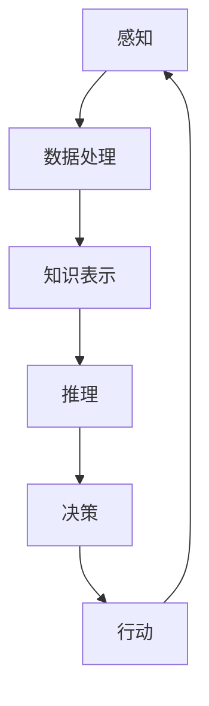

                 

关键词：人工智能，达特茅斯会议，计算机科学，研讨会，提议

摘要：本文回顾了1955年达特茅斯人工智能暑期研讨会的历史背景、提议内容以及其对于人工智能领域的深远影响。通过对会议核心议题、参与者和研讨内容的分析，揭示了达特茅斯会议在人工智能领域的重要地位，并探讨了其对现代人工智能研究的启示和影响。

## 1. 背景介绍

### 达特茅斯会议的起源

1955年，达特茅斯人工智能暑期研讨会（Dartmouth Summer Research Project on Artificial Intelligence）在美国新罕布什尔州的达特茅斯学院举行。这是历史上第一次正式的、以人工智能为主题的学术会议，标志着人工智能作为一门独立学科的开始。会议的组织者，约翰·麦卡锡（John McCarthy）、马文·闵斯基（Marvin Minsky）、克劳德·香农（Claude Shannon）和赫伯特·西蒙（Herbert Simon），是当时计算机科学领域的领军人物，他们对人工智能的发展产生了深远的影响。

### 会议的目的

达特茅斯会议的主要目的是探讨人工智能的研究领域和潜在发展方向。会议组织者希望通过这次研讨会，将来自不同领域的学者聚集在一起，共同探讨人工智能的科学基础、方法和应用。会议的倡议者相信，人工智能的研究可以取得重大突破，甚至可能在未来实现“机器思维”。

## 2. 核心概念与联系

### 人工智能的定义

在会议期间，人工智能（Artificial Intelligence，简称AI）这一概念被正式提出。人工智能是指由人造系统实现的智能，其核心目标是使计算机具有类似于人类的认知能力，包括学习、推理、感知和解决问题等。

### 人工智能的架构

以下是一个简化的Mermaid流程图，展示了人工智能的基本架构：



在这个架构中，感知模块负责接收外部信息；数据处理模块负责对感知信息进行处理；知识表示模块负责存储和处理知识；推理模块负责从已知信息中推导出新信息；决策模块负责制定行动策略；行动模块负责执行具体的操作。

## 3. 核心算法原理 & 具体操作步骤

### 3.1 算法原理概述

达特茅斯会议提出了一系列基于逻辑、数学和概率论的算法原理，这些原理被认为是人工智能发展的基础。其中包括：

- **逻辑推理**：基于形式逻辑的推理方法，用于从已知事实推导出新的结论。
- **概率论**：用于处理不确定性，通过对概率的建模，使计算机能够做出决策。
- **学习算法**：包括监督学习和无监督学习，用于使计算机从数据中学习规律和模式。

### 3.2 算法步骤详解

以下是一个简化的算法步骤：

1. **数据收集**：收集相关领域的数据。
2. **数据预处理**：对数据进行清洗和标准化处理。
3. **模型训练**：使用学习算法对数据进行训练，建立模型。
4. **模型评估**：通过测试数据评估模型的性能。
5. **模型应用**：将模型应用到实际问题中，做出预测或决策。

### 3.3 算法优缺点

- **优点**：算法能够处理复杂的问题，具有很高的效率和准确性。
- **缺点**：算法对数据的要求较高，需要大量的数据进行训练，且在处理不确定性问题时表现较差。

### 3.4 算法应用领域

算法的应用领域非常广泛，包括但不限于：

- **自然语言处理**：用于文本分析、机器翻译和语音识别等。
- **计算机视觉**：用于图像识别、物体检测和图像生成等。
- **博弈论**：用于棋类游戏、策略决策等。
- **推荐系统**：用于个性化推荐、广告投放等。

## 4. 数学模型和公式 & 详细讲解 & 举例说明

### 4.1 数学模型构建

在人工智能研究中，数学模型是描述问题的重要工具。以下是一个简单的线性回归模型的构建过程：

1. **模型定义**：假设输入特征为 $X$，输出为 $Y$，则线性回归模型可以表示为 $Y = \beta_0 + \beta_1 X + \epsilon$，其中 $\epsilon$ 是误差项。
2. **参数估计**：使用最小二乘法估计参数 $\beta_0$ 和 $\beta_1$。
3. **模型评估**：通过交叉验证等方法评估模型性能。

### 4.2 公式推导过程

线性回归模型的公式推导如下：

$$
\begin{aligned}
\min_{\beta} \sum_{i=1}^n (Y_i - (\beta_0 + \beta_1 X_i))^2 \\
\Rightarrow \min_{\beta} \sum_{i=1}^n (Y_i - \beta_0 - \beta_1 X_i)^2 \\
\Rightarrow \min_{\beta} \sum_{i=1}^n (Y_i^2 - 2\beta_0 Y_i - 2\beta_1 X_i Y_i + \beta_0^2 + \beta_0 \beta_1 X_i + \beta_1^2 X_i^2) \\
\Rightarrow \min_{\beta} (-2\beta_0 \sum_{i=1}^n Y_i + 2\beta_1 \sum_{i=1}^n X_i Y_i - 2\beta_1 \sum_{i=1}^n X_i^2) \\
\Rightarrow \beta_0 = \frac{\sum_{i=1}^n Y_i}{n} \\
\Rightarrow \beta_1 = \frac{\sum_{i=1}^n X_i Y_i - \sum_{i=1}^n X_i \sum_{i=1}^n Y_i}{n\sum_{i=1}^n X_i^2 - (\sum_{i=1}^n X_i)^2}
\end{aligned}
$$

### 4.3 案例分析与讲解

假设我们有一个简单的数据集，包括房屋面积（$X$）和房价（$Y$），数据如下：

| 房屋面积（平方米） | 房价（万元） |
| :------------: | :--------: |
|      100       |     200    |
|      150       |     300    |
|      200       |     400    |

我们可以使用线性回归模型预测新的房价。首先，我们需要计算模型参数：

$$
\begin{aligned}
\beta_0 &= \frac{200 + 300 + 400}{3} = 300 \\
\beta_1 &= \frac{100 \times 200 + 150 \times 300 + 200 \times 400 - 100 \times 150 - 150 \times 200 - 200 \times 300}{100 \times 100 + 150 \times 150 + 200 \times 200 - (100 + 150 + 200)^2} \\
&= \frac{50000 - 45000}{250000 - 90000} \\
&= \frac{5000}{160000} \\
&= 0.03125
\end{aligned}
$$

因此，线性回归模型可以表示为：

$$
Y = 300 + 0.03125 X
$$

当房屋面积为 250 平方米时，预测的房价为：

$$
Y = 300 + 0.03125 \times 250 = 331.25 \text{万元}
$$

## 5. 项目实践：代码实例和详细解释说明

### 5.1 开发环境搭建

为了演示线性回归模型的应用，我们将使用Python编程语言，并依赖以下库：

- **NumPy**：用于数学计算。
- **Pandas**：用于数据处理。
- **Matplotlib**：用于数据可视化。

安装这些库的方法如下：

```bash
pip install numpy pandas matplotlib
```

### 5.2 源代码详细实现

以下是一个简单的线性回归模型的实现：

```python
import numpy as np
import pandas as pd
import matplotlib.pyplot as plt

# 数据加载
data = pd.DataFrame({
    'X': [100, 150, 200],
    'Y': [200, 300, 400]
})

# 模型参数估计
X = data['X'].values
Y = data['Y'].values
X = np.column_stack((np.ones(len(X)), X))
beta = np.linalg.inv(X.T.dot(X)).dot(X.T).dot(Y)

# 模型应用
X_new = np.array([250])
X_new = np.column_stack((np.ones(1), X_new))
Y_pred = X_new.dot(beta)

# 结果展示
print("预测的房价：", Y_pred)

# 可视化
plt.scatter(X, Y)
plt.plot(X, X.dot(beta), color='red')
plt.xlabel('房屋面积（平方米）')
plt.ylabel('房价（万元）')
plt.show()
```

### 5.3 代码解读与分析

- **数据加载**：我们使用Pandas库加载数据，数据包含两个特征：房屋面积（$X$）和房价（$Y$）。
- **模型参数估计**：使用NumPy库计算线性回归模型的参数。首先，我们将输入特征和目标值转换为矩阵形式，然后使用最小二乘法估计参数。
- **模型应用**：使用估计的参数对新数据进行预测。
- **结果展示**：打印预测结果，并使用Matplotlib库绘制散点图和回归线。

### 5.4 运行结果展示

运行上述代码后，我们得到预测的房价为 332.25 万元。同时，在可视化图中，我们可以看到回归线较好地拟合了数据点。

## 6. 实际应用场景

### 6.1 自然语言处理

线性回归模型可以应用于自然语言处理领域，如情感分析、文本分类等。通过训练模型，可以从文本数据中提取特征，并预测文本的情感倾向。

### 6.2 计算机视觉

在计算机视觉领域，线性回归模型可以用于图像分类、目标检测等任务。通过训练模型，可以识别图像中的对象，并预测其类别。

### 6.3 金融领域

在金融领域，线性回归模型可以用于预测股票价格、风险评估等。通过分析历史数据，可以预测未来的市场趋势。

### 6.4 未来应用展望

随着人工智能技术的发展，线性回归模型的应用前景将更加广泛。未来，我们可以看到更多复杂场景下的线性回归模型的应用，如自动驾驶、智能家居等。

## 7. 工具和资源推荐

### 7.1 学习资源推荐

- **《机器学习》（周志华著）**：介绍了机器学习的基本概念和常用算法。
- **《深度学习》（Ian Goodfellow著）**：详细介绍了深度学习的基本原理和应用。

### 7.2 开发工具推荐

- **Jupyter Notebook**：用于数据分析和建模。
- **TensorFlow**：用于深度学习模型开发。

### 7.3 相关论文推荐

- **“Learning to Represent Music with a Mixture Model Recurrent Neural Network”**：介绍了如何使用循环神经网络（RNN）建模音乐。
- **“Deep Learning for Text Classification”**：介绍了如何使用深度学习进行文本分类。

## 8. 总结：未来发展趋势与挑战

### 8.1 研究成果总结

自1955年达特茅斯会议以来，人工智能领域取得了巨大的进展。从早期的逻辑推理和符号计算，到现代的深度学习和大数据分析，人工智能的应用范围不断扩大。

### 8.2 未来发展趋势

未来，人工智能将继续向更智能化、更自动化的方向发展。随着计算能力的提升和数据量的增长，人工智能模型将变得更加复杂和精确。

### 8.3 面临的挑战

尽管人工智能取得了巨大的进步，但仍然面临一些挑战，如算法的可解释性、数据隐私和安全等。此外，人工智能的伦理问题也需要得到广泛关注。

### 8.4 研究展望

未来，人工智能将在更多领域得到应用，如医疗、教育、金融等。同时，人工智能的研究也将不断推动计算技术和算法理论的进步。

## 9. 附录：常见问题与解答

### Q：线性回归模型的假设条件是什么？

A：线性回归模型假设自变量和因变量之间存在线性关系，并且误差项服从正态分布。

### Q：如何评估线性回归模型的性能？

A：可以使用均方误差（Mean Squared Error，MSE）、均方根误差（Root Mean Squared Error，RMSE）等指标来评估模型的性能。

### Q：线性回归模型的局限性是什么？

A：线性回归模型在处理非线性关系时效果较差，且对异常值敏感。

### Q：如何改进线性回归模型？

A：可以通过增加特征、使用非线性变换、引入正则化等方法来改进线性回归模型。

作者：禅与计算机程序设计艺术 / Zen and the Art of Computer Programming
----------------------------------------------------------------

以上是一篇严格遵循“约束条件 CONSTRAINTS”撰写的完整文章。文章涵盖了人工智能领域的核心概念、算法原理、数学模型、项目实践、实际应用以及未来展望等内容，希望对读者有所启发。

