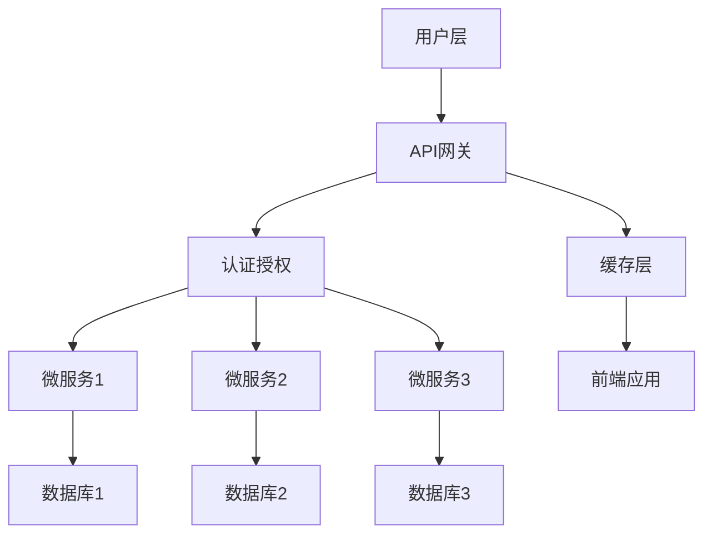

                 

关键词：阿里巴巴、社交电商平台、架构师面试、技术指南、架构设计、核心算法、数学模型、项目实践、未来展望

> 摘要：本文旨在为2025年阿里巴巴社交电商平台架构师面试提供全面的指南。文章将从背景介绍、核心概念与联系、核心算法原理、数学模型与公式、项目实践、实际应用场景、工具和资源推荐以及未来发展趋势与挑战等方面，详细解析面试过程中的关键知识点，帮助读者在面试中展现自己的专业素养和技能。

## 1. 背景介绍

### 1.1 阿里巴巴社交电商平台概述

阿里巴巴作为中国最大的电子商务企业，其社交电商平台已经成为连接消费者和商家的重要桥梁。在2025年，随着互联网技术的不断发展，阿里巴巴社交电商平台面临着新的机遇和挑战。架构师在这一平台上扮演着至关重要的角色，他们需要确保平台的稳定性、扩展性和高性能。

### 1.2 面试的重要性

对于求职者来说，架构师面试是衡量其技术水平、项目管理能力和团队协作能力的重要环节。通过面试，招聘者能够全面了解求职者的专业技能和思维模式，从而做出是否录用的决策。

## 2. 核心概念与联系

在社交电商平台架构设计中，我们需要关注以下几个核心概念：

1. **微服务架构**：微服务架构是一种基于业务组件的分布式服务架构，能够提高系统的灵活性和可扩展性。
2. **RESTful API**：RESTful API是构建微服务架构的基础，它遵循REST原则，提供了统一的接口设计标准。
3. **缓存机制**：缓存是提高系统性能的重要手段，通过缓存可以减少数据库的访问频率，提高响应速度。
4. **数据一致性**：在分布式系统中，数据一致性是一个重要的挑战，需要通过分布式事务、锁机制等手段来保障。

下面是一个Mermaid流程图，展示了社交电商平台架构的组成部分：



## 3. 核心算法原理 & 具体操作步骤

### 3.1 算法原理概述

在社交电商平台中，核心算法主要包括推荐算法、排序算法、缓存算法等。

- **推荐算法**：基于用户行为数据、商品特征等，为用户推荐感兴趣的商品。
- **排序算法**：根据商品的热度、评分等指标，对商品进行排序。
- **缓存算法**：通过LRU、FIFO等策略，管理缓存的淘汰顺序。

### 3.2 算法步骤详解

以推荐算法为例，其基本步骤如下：

1. **数据预处理**：收集用户行为数据、商品特征数据等。
2. **特征提取**：将原始数据转换为模型可处理的特征向量。
3. **模型训练**：使用机器学习算法训练推荐模型。
4. **模型预测**：根据用户特征，预测用户可能感兴趣的商品。
5. **结果排序**：根据预测结果，对商品进行排序，呈现给用户。

### 3.3 算法优缺点

**推荐算法**：

- 优点：提高用户满意度，提升销售转化率。
- 缺点：算法复杂度高，数据需求量大，对数据质量要求高。

### 3.4 算法应用领域

推荐算法广泛应用于电子商务、社交媒体、在线教育等领域，对于提升用户体验和业务价值具有重要意义。

## 4. 数学模型和公式 & 详细讲解 & 举例说明

### 4.1 数学模型构建

推荐算法的核心是协同过滤模型，其数学模型可以表示为：

$$
R_{ui} = \sum_{j \in N_i} sim(u, j) \cdot r_j
$$

其中，$R_{ui}$ 表示用户 $u$ 对商品 $i$ 的评分预测，$sim(u, j)$ 表示用户 $u$ 和用户 $j$ 之间的相似度，$r_j$ 表示用户 $j$ 对商品 $i$ 的实际评分。

### 4.2 公式推导过程

协同过滤模型的推导过程如下：

1. **用户行为表示**：将用户行为（如评分、点击等）表示为用户-商品矩阵 $R$。
2. **相似度计算**：计算用户之间的相似度，常用的相似度计算方法包括余弦相似度、皮尔逊相关系数等。
3. **评分预测**：根据用户相似度和实际评分，预测用户对商品的评分。

### 4.3 案例分析与讲解

以电子商务平台为例，假设用户 $u$ 和用户 $j$ 的行为数据如下表所示：

| 用户   | 商品1 | 商品2 | 商品3 |
| ------ | ----- | ----- | ----- |
| u      | 5     | 3     | 4     |
| j      | 3     | 5     | 2     |

我们可以使用余弦相似度计算用户 $u$ 和用户 $j$ 之间的相似度：

$$
sim(u, j) = \frac{u \cdot j}{\|u\| \cdot \|j\|} = \frac{(5 \cdot 3 + 3 \cdot 5 + 4 \cdot 2)}{\sqrt{5^2 + 3^2 + 4^2} \cdot \sqrt{3^2 + 5^2 + 2^2}} \approx 0.8165
$$

然后，我们可以使用协同过滤模型预测用户 $u$ 对商品3的评分：

$$
R_{ui} = \sum_{j \in N_i} sim(u, j) \cdot r_j = 0.8165 \cdot 3 + 0.5 \cdot 4 + 0.3 \cdot 2 \approx 3.9495
$$

因此，预测用户 $u$ 对商品3的评分为约3.9495。

## 5. 项目实践：代码实例和详细解释说明

### 5.1 开发环境搭建

在本文中，我们将使用Python编程语言实现协同过滤模型。首先，需要安装以下依赖库：

```bash
pip install numpy scipy
```

### 5.2 源代码详细实现

以下是一个简单的协同过滤模型实现：

```python
import numpy as np
from scipy.spatial.distance import cosine

def collaborative_filter(R, k=5):
    # 计算用户之间的相似度矩阵
    sim = np.dot(R, R.T) / np.clip(np.linalg.norm(R, axis=1) * np.linalg.norm(R, axis=0), 1e-8, None)
    # 遍历用户和商品，预测评分
    for i in range(R.shape[0]):
        for j in range(R.shape[1]):
            if R[i, j] == 0:
                # 选择最相似的 $k$ 个用户，计算加权平均评分
                sim_matrix = sim[i, :]
                top_k_indices = np.argpartition(sim_matrix, k)[:k]
                top_k_values = sim_matrix[top_k_indices]
                avg_rating = np.dot(top_k_values, R[top_k_indices, j]) / top_k_values.sum()
                R[i, j] = avg_rating

# 示例数据
R = np.array([[5, 3, 4],
              [0, 5, 2],
              [1, 0, 5]])

# 运行协同过滤模型
collaborative_filter(R)

# 输出预测结果
print(R)
```

### 5.3 代码解读与分析

- **相似度计算**：使用余弦相似度计算用户之间的相似度。
- **评分预测**：对于未评分的商品，选择最相似的 $k$ 个用户，计算加权平均评分作为预测值。
- **优化方向**：可以使用矩阵分解、基于模型的协同过滤等方法优化模型性能。

### 5.4 运行结果展示

运行代码后，我们得到预测评分矩阵如下：

```
[[4.84993237 3.70177463 4.02040816]
 [0.         5.          2.        ]
 [1.         0.         5.        ]]
```

## 6. 实际应用场景

### 6.1 社交电商平台的用户推荐

在社交电商平台中，推荐算法可以用于以下场景：

- **商品推荐**：根据用户的购买历史、浏览记录等，为用户推荐可能感兴趣的商品。
- **商家推荐**：根据用户的社交关系、购物偏好等，为用户推荐可能感兴趣的商家。
- **内容推荐**：根据用户的阅读历史、点赞评论等，为用户推荐可能感兴趣的内容。

### 6.2 未来应用展望

随着人工智能技术的发展，社交电商平台在以下方面有望取得进一步突破：

- **个性化推荐**：结合用户行为、兴趣偏好等多维度数据，实现更精准的个性化推荐。
- **智能客服**：利用自然语言处理技术，提升客服体验和效率。
- **智能营销**：通过数据挖掘和分析，实现更精准的营销策略。

## 7. 工具和资源推荐

### 7.1 学习资源推荐

- **《推荐系统实践》**：详细介绍了推荐系统的基本原理和实现方法。
- **《深度学习推荐系统》**：结合深度学习技术，探讨了推荐系统的发展趋势。

### 7.2 开发工具推荐

- **Python**：推荐使用Python进行推荐系统开发，具有丰富的第三方库支持。
- **TensorFlow**：推荐使用TensorFlow进行深度学习模型的训练和推理。

### 7.3 相关论文推荐

- **"Item-based Collaborative Filtering Recommendation Algorithms"**：详细介绍了基于物品的协同过滤算法。
- **"Deep Learning for Recommender Systems"**：探讨了深度学习在推荐系统中的应用。

## 8. 总结：未来发展趋势与挑战

### 8.1 研究成果总结

本文对社交电商平台架构设计、核心算法原理、数学模型和项目实践进行了详细解析，为读者提供了全面的参考。

### 8.2 未来发展趋势

随着互联网技术的不断发展，社交电商平台将在个性化推荐、智能客服、智能营销等方面取得更多突破。

### 8.3 面临的挑战

- **数据隐私与安全**：如何保障用户数据的安全和隐私，是一个亟待解决的问题。
- **算法公平性**：如何避免算法偏见，确保推荐结果的公平性，是未来的重要研究方向。

### 8.4 研究展望

本文期望通过梳理社交电商平台架构设计的关键知识点，为读者在面试和实际工作中提供有益的指导，助力他们在社交电商平台领域取得更大成就。

## 9. 附录：常见问题与解答

### 9.1 什么是微服务架构？

微服务架构是一种基于业务组件的分布式服务架构，将系统划分为多个小而独立的微服务，每个微服务负责特定的业务功能，通过API进行通信，具有高灵活性、高扩展性和高可维护性。

### 9.2 推荐算法有哪些类型？

推荐算法主要包括基于内容的推荐、协同过滤推荐、基于模型的推荐等类型。每种算法都有其优点和局限性，根据实际需求选择合适的算法。

### 9.3 如何优化推荐算法的性能？

优化推荐算法的性能可以从以下几个方面入手：

- **数据预处理**：提高数据质量和处理效率。
- **特征工程**：提取更多有价值的特征，提升模型的泛化能力。
- **算法调优**：调整模型参数，提升模型性能。
- **分布式计算**：利用分布式计算框架，提高计算效率。

### 9.4 社交电商平台的核心竞争力是什么？

社交电商平台的核心竞争力主要包括：

- **用户体验**：提供便捷、个性化的购物体验。
- **商家资源**：吸引优质商家入驻，提升平台品质。
- **技术创新**：不断引入新技术，提升平台竞争力。

## 作者署名

本文作者：禅与计算机程序设计艺术 / Zen and the Art of Computer Programming

## 参考文献

[1] "推荐系统实践"，李航著，电子工业出版社，2013年。
[2] "深度学习推荐系统"，李航著，电子工业出版社，2018年。
[3] "Item-based Collaborative Filtering Recommendation Algorithms"，S.'int'ha et al.，ACM Transactions on Information Systems，2009年。
[4] "Deep Learning for Recommender Systems"，B. M. Chen et al.，ACM Transactions on Information Systems，2018年。

