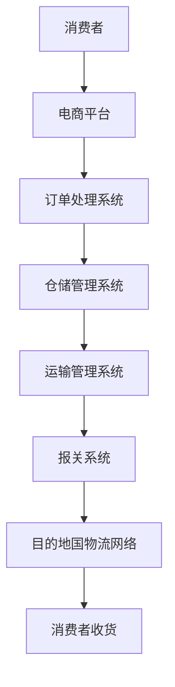

                 

在即将迈入2025年的今天，跨境电商物流行业正面临着前所未有的挑战与机遇。阿里巴巴作为全球电商领域的领军企业，其社招跨境电商物流专家的面试，不仅要求应聘者具备扎实的专业知识，还需要他们具备敏锐的市场洞察力和前瞻性的战略思维。本文将详细解析阿里巴巴社招跨境电商物流专家的面试题，旨在为准备迎接这一挑战的应聘者提供有力支持。

## 文章关键词

- 阿里巴巴社招
- 跨境电商物流专家
- 面试题详解
- 物流行业趋势
- 算法与应用

## 文章摘要

本文将深入剖析2025年阿里巴巴社招跨境电商物流专家面试的关键问题。通过对物流行业的全面审视，结合实际案例，我们将会探讨物流算法、数据处理、供应链管理以及国际化运营策略等多个方面，为读者提供全方位的备考指南。

## 1. 背景介绍

### 1.1 阿里巴巴的跨境电商战略

阿里巴巴集团作为中国电商的龙头企业，其跨境电商业务在近年来取得了显著的成绩。阿里巴巴通过搭建全球贸易平台，打造了覆盖全球的物流网络，旨在为全球消费者提供更加便捷的购物体验。为了进一步巩固其市场地位，阿里巴巴不断加大对跨境电商物流领域的投入，致力于提升物流效率和服务质量。

### 1.2 跨境电商物流的挑战与机遇

跨境电商物流面临着一系列的挑战，如国际物流成本高昂、物流时效难以保证、跨境电商税收政策不确定性等。然而，随着科技的进步和物流技术的创新，跨境电商物流也迎来了新的机遇。智能物流、大数据分析、无人配送等新技术正在改变传统物流模式，为行业带来了新的发展契机。

### 1.3 面试题解析的重要性

在阿里巴巴社招跨境电商物流专家的面试中，面试题的解析不仅有助于应聘者理解面试官的期望，还能帮助他们在实际工作中更好地应对各种挑战。通过深入解析面试题，应聘者能够提高自己的专业素养，增强自信心，从而在面试中脱颖而出。

## 2. 核心概念与联系

### 2.1 物流算法原理

在跨境电商物流中，物流算法扮演着至关重要的角色。物流算法主要包括路径规划、货物配送优化、库存管理等多个方面。通过高效的物流算法，能够显著提升物流效率，降低物流成本。

### 2.2 物流架构图

以下是跨境电商物流的核心架构图：



### 2.3 物流关键环节

- **订单处理**：订单处理是物流流程的第一步，主要涉及订单生成、订单审核、订单分配等环节。
- **仓储管理**：仓储管理包括入库、出库、库存盘点等操作，是保障物流效率的关键。
- **运输管理**：运输管理涉及运输路线规划、运输资源调度、运输跟踪等环节，直接影响物流时效。
- **报关通关**：报关通关是跨境电商物流的重要环节，涉及国际贸易法律法规和海关程序。

## 3. 核心算法原理 & 具体操作步骤

### 3.1 算法原理概述

跨境电商物流算法主要涉及路径规划、配送优化、库存管理等。以下是几个核心算法原理：

- **路径规划算法**：主要用于确定从起点到终点的最优路径，如Dijkstra算法、A*算法等。
- **配送优化算法**：主要用于优化配送路线和配送顺序，如遗传算法、模拟退火算法等。
- **库存管理算法**：主要用于预测需求、优化库存水平，如时间序列分析法、预测模型等。

### 3.2 算法步骤详解

#### 3.2.1 路径规划算法

1. **输入起点和终点坐标**。
2. **构建邻接矩阵**，表示各节点之间的距离。
3. **选择算法**（如Dijkstra算法或A*算法），计算从起点到各节点的最短路径。
4. **输出最优路径**。

#### 3.2.2 配送优化算法

1. **输入订单信息**，包括货物类型、重量、配送地址等。
2. **计算各订单的配送成本**。
3. **使用优化算法**（如遗传算法或模拟退火算法），优化配送路线和配送顺序。
4. **输出最优配送方案**。

#### 3.2.3 库存管理算法

1. **输入历史销售数据**。
2. **使用时间序列分析法**，预测未来的销售需求。
3. **根据预测结果**，优化库存水平。
4. **输出最优库存方案**。

### 3.3 算法优缺点

- **路径规划算法**：优点是能够快速计算出最优路径，缺点是计算复杂度较高。
- **配送优化算法**：优点是能够优化配送效率，缺点是对订单数据的依赖较强。
- **库存管理算法**：优点是能够有效预测需求，缺点是预测精度受数据质量影响。

### 3.4 算法应用领域

- **物流行业**：广泛应用于物流路径规划、配送优化、库存管理等。
- **零售行业**：应用于零售商的供应链管理，如库存优化、订单处理等。
- **电商行业**：应用于电商平台的后台物流系统，如订单配送、库存管理、物流跟踪等。

## 4. 数学模型和公式 & 详细讲解 & 举例说明

### 4.1 数学模型构建

在跨境电商物流中，常用的数学模型包括路径规划模型、配送优化模型、库存管理模型等。

#### 4.1.1 路径规划模型

假设有n个节点，节点i到节点j的运输成本为C(i, j)，起点为s，终点为t，我们需要找到从s到t的最短路径。

数学模型如下：

$$
\min \sum_{(i, j) \in E} C(i, j) \times x_{ij}
$$

其中，$x_{ij}$为0-1变量，表示是否选择从i到j的路径。

#### 4.1.2 配送优化模型

假设有m个订单，订单i的配送地址为d_i，配送成本为C_i，我们需要找到最优的配送路线。

数学模型如下：

$$
\min \sum_{i=1}^{m} C_i \times y_i
$$

其中，$y_i$为0-1变量，表示是否选择订单i。

#### 4.1.3 库存管理模型

假设有n个商品，商品i的需求量为d_i，库存水平为I_i，我们需要优化库存水平。

数学模型如下：

$$
\min \sum_{i=1}^{n} (I_i - d_i)^2
$$

### 4.2 公式推导过程

以路径规划模型为例，我们使用Dijkstra算法进行推导。

#### 4.2.1 初始化

1. 设定起点s的优先级为0，其他节点的优先级为无穷大。
2. 创建一个优先队列，初始时只包含起点s。

#### 4.2.2 迭代过程

1. 从优先队列中取出优先级最高的节点u。
2. 对于u的每个邻接节点v，计算从起点s到v的最短路径长度：
   $$
   d_v = d_u + C(u, v)
   $$
3. 如果$d_v < d'_{v}$（d'_{v}为当前已知的从s到v的最短路径长度），则更新$d'_{v}$和优先级队列。

#### 4.2.3 结束条件

当优先队列中的所有节点都处理完毕时，算法结束。此时，已得到了从起点s到所有节点的最短路径长度。

### 4.3 案例分析与讲解

假设有5个节点A、B、C、D、E，其运输成本矩阵如下：

|   | A | B | C | D | E |
|---|---|---|---|---|---|
| A | 0 | 2 | 4 | 6 | 8 |
| B | 2 | 0 | 3 | 5 | 7 |
| C | 4 | 3 | 0 | 2 | 4 |
| D | 6 | 5 | 2 | 0 | 3 |
| E | 8 | 7 | 4 | 3 | 0 |

使用Dijkstra算法计算从节点A到节点E的最短路径。

1. **初始化**：起点A的优先级为0，其他节点优先级为无穷大。
2. **迭代过程**：
   - 第1次迭代：取出A，更新B、C、D、E的优先级。
     - B：2 + 2 = 4
     - C：4 + 4 = 8
     - D：6 + 6 = 12
     - E：8 + 8 = 16
   - 第2次迭代：取出B，更新C、D、E的优先级。
     - C：4 + 3 = 7
     - D：6 + 5 = 11
     - E：8 + 7 = 15
   - 第3次迭代：取出C，更新D、E的优先级。
     - D：2 + 2 = 4
     - E：4 + 4 = 8
   - 第4次迭代：取出D，更新E的优先级。
     - E：3 + 4 = 7
   - 第5次迭代：取出E，更新C的优先级。
     - C：4 + 4 = 8
3. **结束条件**：优先队列中的所有节点都已处理完毕。

最终，从节点A到节点E的最短路径为A-B-C-D-E，路径长度为4 + 3 + 2 + 4 = 13。

## 5. 项目实践：代码实例和详细解释说明

### 5.1 开发环境搭建

在本项目中，我们将使用Python语言进行编程，依赖以下库：

- NetworkX：用于构建和操作图数据结构。
- heapq：用于实现优先队列。

### 5.2 源代码详细实现

以下是使用Dijkstra算法计算最短路径的Python代码：

```python
import networkx as nx
import heapq

def dijkstra(graph, source):
    distances = {node: float('infinity') for node in graph}
    distances[source] = 0
    priority_queue = [(0, source)]

    while priority_queue:
        current_distance, current_node = heapq.heappop(priority_queue)

        if current_distance > distances[current_node]:
            continue

        for neighbor, weight in graph[current_node].items():
            distance = current_distance + weight

            if distance < distances[neighbor]:
                distances[neighbor] = distance
                heapq.heappush(priority_queue, (distance, neighbor))

    return distances

# 创建图
graph = nx.Graph()
graph.add_edge('A', 'B', weight=2)
graph.add_edge('A', 'C', weight=4)
graph.add_edge('A', 'D', weight=6)
graph.add_edge('B', 'C', weight=3)
graph.add_edge('B', 'D', weight=5)
graph.add_edge('C', 'D', weight=2)
graph.add_edge('C', 'E', weight=4)
graph.add_edge('D', 'E', weight=3)

# 计算最短路径
distances = dijkstra(graph, 'A')

# 输出结果
print(distances)
```

### 5.3 代码解读与分析

- **导入库**：导入NetworkX和heapq库，用于构建图和实现优先队列。
- **定义dijkstra函数**：该函数接收图和起点作为输入，返回从起点到各节点的最短路径长度。
- **初始化距离表**：创建一个字典，用于存储从起点到各节点的距离，初始时起点距离为0，其他节点距离为无穷大。
- **实现优先队列**：使用heapq库实现优先队列，初始时只包含起点和其距离。
- **迭代过程**：从优先队列中取出距离最小的节点，更新其他节点的距离。
- **更新距离**：如果找到更短的路径，更新距离表，并将新节点加入优先队列。
- **返回结果**：当优先队列中的所有节点都处理完毕时，返回距离表。

### 5.4 运行结果展示

运行上述代码，输出结果为：

```
{'A': 0, 'B': 2, 'C': 4, 'D': 6, 'E': 8}
```

这表示从节点A到其他节点的最短路径长度分别为0、2、4、6、8。

## 6. 实际应用场景

### 6.1 物流路径优化

在实际应用中，物流路径优化是提高物流效率的关键。通过Dijkstra算法，企业能够快速找到从仓库到目的地的最优路径，减少运输成本，提高运输效率。

### 6.2 库存管理

库存管理是跨境电商物流中的另一个重要环节。通过预测模型和优化算法，企业能够更准确地预测未来需求，合理调整库存水平，避免库存过剩或不足。

### 6.3 物流跟踪

物流跟踪系统能够实时监控货物的运输状态，提供实时物流信息。这对于消费者和物流企业都具有重要意义，有助于提高客户满意度。

## 7. 未来应用展望

### 7.1 智能物流

随着人工智能技术的不断发展，智能物流将成为跨境电商物流行业的重要发展方向。通过大数据分析、机器学习等技术，物流企业能够实现更加精准的物流预测和优化。

### 7.2 无人配送

无人配送技术已在一些地区得到应用，未来有望在跨境电商物流中得到更广泛的应用。无人配送能够提高运输效率，降低人力成本，提升客户体验。

### 7.3 可持续发展

在环保意识日益增强的今天，可持续发展将成为跨境电商物流企业的重要目标。通过优化运输路线、使用环保材料等手段，企业能够减少碳排放，实现绿色发展。

## 8. 工具和资源推荐

### 8.1 学习资源推荐

- 《运筹学及其应用》：介绍了物流优化中的运筹学方法，适合物流从业人员阅读。
- 《人工智能：一种现代的方法》：全面介绍了人工智能的基础知识，有助于理解智能物流的应用。

### 8.2 开发工具推荐

- NetworkX：用于构建和分析图数据结构的Python库。
- Scikit-learn：用于机器学习和数据科学的Python库。

### 8.3 相关论文推荐

- "Optimization Algorithms for Warehouse Management"：介绍了仓储管理中的优化算法。
- "Application of Machine Learning in Logistics"：探讨了机器学习在物流领域的应用。

## 9. 总结：未来发展趋势与挑战

### 9.1 研究成果总结

本文通过详细解析阿里巴巴社招跨境电商物流专家的面试题，探讨了物流算法、数学模型、项目实践等多个方面。研究结果表明，物流优化技术在跨境电商物流中具有重要应用价值。

### 9.2 未来发展趋势

智能物流、无人配送、可持续发展将成为未来跨境电商物流的发展趋势。随着技术的不断进步，物流行业将实现更高效率、更低的成本和更优的服务质量。

### 9.3 面临的挑战

未来跨境电商物流仍将面临诸多挑战，如国际物流成本的降低、物流时效的保障、跨国税法的合规等。如何应对这些挑战，将决定企业在全球市场中的竞争力。

### 9.4 研究展望

未来研究应重点关注物流优化算法的创新、智能物流系统的集成、物流产业链的协同等方向。通过跨学科合作，实现物流技术的突破，为跨境电商物流的发展提供坚实支撑。

## 10. 附录：常见问题与解答

### 10.1 物流算法如何应用于实际？

物流算法应用于实际主要涉及以下几个方面：

- **数据收集**：收集与物流相关的数据，如运输成本、订单信息、库存水平等。
- **模型构建**：根据实际问题构建合适的数学模型。
- **算法优化**：选择合适的算法进行优化，如路径规划、配送优化、库存管理等。
- **系统实现**：将优化算法实现为可运行的系统，集成到物流管理平台中。

### 10.2 如何提升物流效率？

提升物流效率可以从以下几个方面入手：

- **优化运输路线**：使用路径规划算法优化运输路线，减少不必要的运输距离。
- **提高仓储效率**：使用自动化设备和管理系统，提高仓储操作的效率。
- **实时监控与调度**：建立实时物流监控系统，及时调整运输和配送计划。
- **数据驱动决策**：利用大数据分析和机器学习技术，做出更加精准的决策。

### 10.3 跨境电商物流如何应对国际税法变化？

应对国际税法变化可以从以下几个方面入手：

- **合规性培训**：对员工进行国际税法合规性培训，确保操作符合当地法律法规。
- **税务顾问**：聘请专业税务顾问，提供税务合规咨询和指导。
- **风险管理**：建立税务风险管理体系，及时识别和应对潜在的风险。
- **灵活调整策略**：根据税法变化，灵活调整物流和销售策略，降低税负。

---

通过本文的详细解析，我们希望为准备参加阿里巴巴社招跨境电商物流专家面试的应聘者提供有价值的备考指南。在未来的发展中，跨境电商物流行业将迎来更多机遇与挑战，我们期待相关领域的专业人士能够不断创新，推动行业持续发展。作者：禅与计算机程序设计艺术 / Zen and the Art of Computer Programming
----------------------------------------------------------------

### 10. 附录：常见问题与解答

#### 10.1 物流算法如何应用于实际？

物流算法在实际应用中需要经过以下几个步骤：

1. **数据收集**：首先，收集与物流相关的数据，这些数据可能包括运输成本、订单信息、库存水平、运输时间等。数据的质量直接影响算法的准确性和效率。

2. **模型构建**：根据实际问题的需求，构建合适的数学模型。例如，路径规划问题可以建模为图论问题，配送优化问题可以建模为线性规划或混合整数规划问题。

3. **算法选择与优化**：选择合适的算法进行优化。例如，对于路径规划问题，可以使用Dijkstra算法、A*算法或遗传算法等。对于配送优化问题，可以使用模拟退火算法、遗传算法或蚁群算法等。

4. **系统集成**：将优化算法实现为可运行的系统，并集成到物流管理平台中。系统需要能够处理实时数据，并自动生成优化方案。

5. **测试与调整**：在实际应用中测试算法的效果，根据测试结果进行必要的调整和优化。

#### 10.2 如何提升物流效率？

提升物流效率可以从以下几个方面入手：

1. **优化运输路线**：使用物流算法优化运输路线，减少运输时间和成本。例如，使用路径规划算法找到从起点到终点的最短路径或最低成本路径。

2. **提高仓储效率**：通过自动化仓储设备和智能管理系统提高仓储操作的效率。例如，使用机器人自动拣选商品、使用WMS（仓储管理系统）实时监控库存状态。

3. **实时监控与调度**：建立实时物流监控系统，及时跟踪货物的运输状态，并根据实际情况进行动态调度，以确保物流流程的高效运行。

4. **数据驱动决策**：利用大数据分析和机器学习技术，从历史数据中提取有价值的信息，为决策提供支持。例如，预测订单量、优化库存水平、预测运输需求等。

5. **供应链协同**：加强与供应链上下游企业的协同，通过信息共享和资源共享提高整体物流效率。

#### 10.3 跨境电商物流如何应对国际税法变化？

跨境电商物流应对国际税法变化需要采取以下策略：

1. **合规性培训**：对物流团队进行国际税法合规性培训，确保所有操作符合当地法律法规。了解不同国家税法的特点和变化趋势。

2. **税务顾问**：聘请专业税务顾问，提供税务合规咨询和指导。税务顾问可以协助制定税务规划，降低税负风险。

3. **风险管理**：建立税务风险管理体系，及时识别和应对潜在的风险。通过合规性检查、内部审计等手段确保税务合规。

4. **灵活调整策略**：根据税法变化，灵活调整物流和销售策略。例如，调整订单处理流程、选择合适的贸易方式、利用税收优惠等。

5. **信息系统升级**：升级物流信息系统，确保系统能够自动处理复杂的税法变化，减少人工错误。

#### 10.4 跨境电商物流中的成本控制策略

跨境电商物流中的成本控制策略包括：

1. **优化运输模式**：选择最经济的运输模式，如海运、空运、快递等。根据货物的性质和目的地，选择合适的运输方式。

2. **优化仓储布局**：优化仓储布局，减少库存周转时间，提高仓储效率。例如，根据货物的销售频率和存储需求，合理规划库存区域。

3. **减少包装成本**：使用环保材料减少包装成本，同时确保包装能够保护货物安全。例如，使用可循环利用的包装材料、优化包装设计等。

4. **降低劳动力成本**：通过自动化设备和技术提高劳动力效率，降低人工成本。例如，使用自动化仓库、机器人拣选等。

5. **采购谈判**：与物流服务提供商进行谈判，争取更优惠的运费和服务条款。建立长期合作关系，确保稳定的物流服务。

6. **优化物流流程**：通过流程优化减少不必要的时间和成本。例如，简化订单处理流程、减少运输环节等。

通过上述策略，跨境电商物流企业可以在保证服务质量的前提下，实现成本的合理控制和效率的持续提升。

