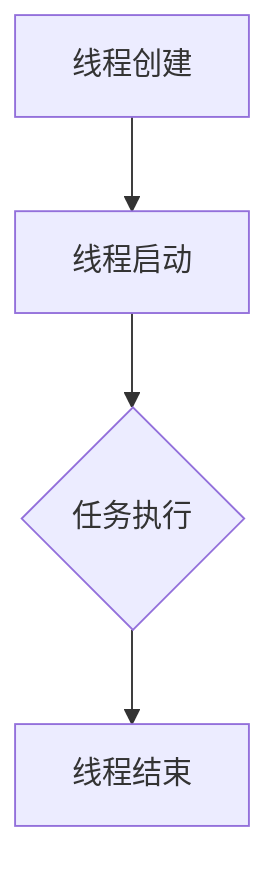
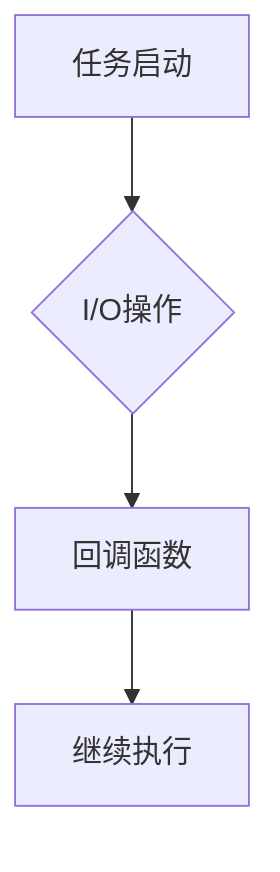
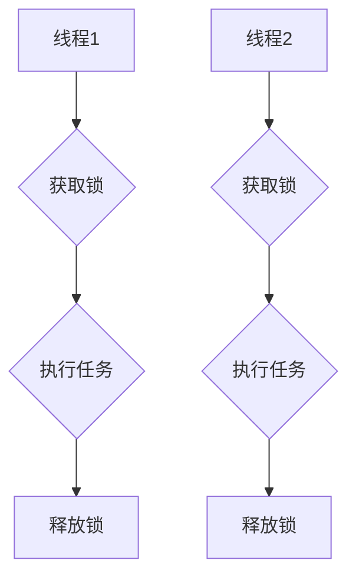
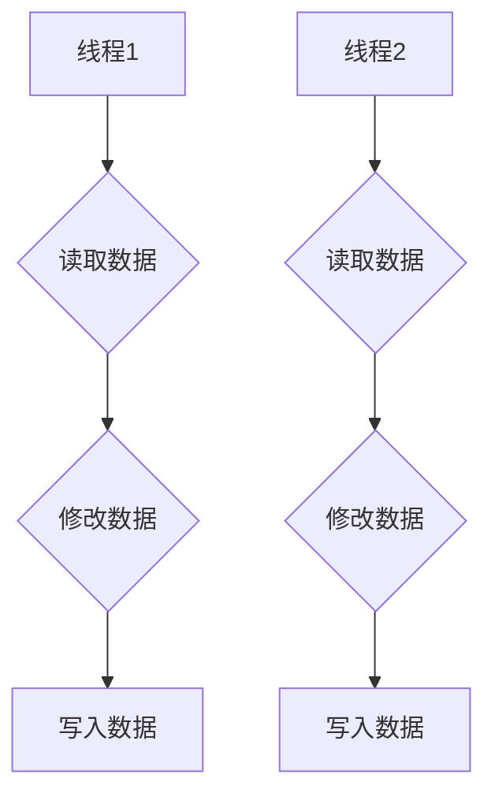

                 

关键词：并发编程、多线程、异步处理、性能优化、同步机制、锁、线程安全、并发算法

> 摘要：本文深入探讨了并发编程的核心概念、技术以及应用，通过详细阐述多线程和异步处理的基本原理、算法和实例，旨在帮助读者理解和掌握并发编程的精髓，提高系统性能和稳定性。

## 1. 背景介绍

在当今的计算机世界中，随着应用程序的复杂性和性能要求的不断提升，并发编程已经成为一种不可或缺的技术。并发编程允许多个任务同时执行，从而充分利用现代多核处理器的计算能力，提高系统的整体性能。并发编程涉及到多个核心概念，包括多线程、异步处理、同步机制、锁和线程安全等。理解这些概念对于编写高效、可靠的并发程序至关重要。

本文将首先介绍并发编程的基本原理，然后深入探讨多线程和异步处理技术的具体实现，并通过实际的代码实例进行讲解。接下来，我们将分析并发算法的设计原则和常用技术，探讨数学模型和公式在并发编程中的应用，并展示具体的案例。最后，我们将讨论并发编程在实际应用中的挑战和未来发展趋势。

## 2. 核心概念与联系

### 2.1 多线程

多线程是指在一个程序中同时执行多个线程。线程是程序执行的基本单位，它拥有独立的栈、程序计数器和局部变量。通过创建多个线程，程序可以并行执行多个任务，从而提高执行效率。

#### Mermaid 流程图



### 2.2 异步处理

异步处理是一种允许程序在执行一个任务时继续执行其他任务的机制。通过异步处理，程序可以在等待某些操作（如I/O操作）完成时释放CPU资源，从而提高系统性能。

#### Mermaid 流程图



### 2.3 同步机制

同步机制用于协调多个线程之间的执行顺序，确保数据的一致性和线程安全。常见的同步机制包括锁、信号量和条件变量等。

#### Mermaid 流程图



### 2.4 并发算法

并发算法是指能够在多个线程中并行执行且不产生冲突的算法。设计并发算法时，需要考虑数据的一致性和线程安全问题。

#### Mermaid 流程图



## 3. 核心算法原理 & 具体操作步骤

### 3.1 算法原理概述

并发编程的核心算法通常涉及以下几个方面：

1. **线程安全**：确保多线程访问共享资源时不会产生冲突和数据不一致。
2. **锁机制**：通过锁来控制对共享资源的访问，避免并发冲突。
3. **无锁编程**：通过算法设计避免使用锁，从而减少锁的开销和死锁的风险。
4. **消息传递**：通过消息队列实现线程之间的通信和同步。

### 3.2 算法步骤详解

1. **线程安全**：
   - **原子操作**：使用原子操作确保对共享资源的读写是原子的。
   - **互斥锁**：在访问共享资源时使用互斥锁确保同一时间只有一个线程能够访问。

2. **锁机制**：
   - **锁的实现**：使用内置锁（如Java中的`synchronized`关键字）或自定义锁实现。
   - **锁的使用**：在进入和退出临界区时正确获取和释放锁。

3. **无锁编程**：
   - **循环冗余校验（CRC）**：使用CRC算法检测数据的一致性。
   - **比较交换（Compare-And-Swap, CAS）**：使用CAS操作进行无锁编程。

4. **消息传递**：
   - **线程通信**：使用线程安全的消息队列实现线程间的通信。
   - **同步机制**：使用信号量或条件变量实现线程间的同步。

### 3.3 算法优缺点

- **线程安全**：
  - 优点：确保数据的一致性和线程安全。
  - 缺点：可能引入锁竞争和死锁。

- **锁机制**：
  - 优点：简单直观，易于实现。
  - 缺点：可能导致性能瓶颈和死锁。

- **无锁编程**：
  - 优点：减少锁的开销和死锁的风险。
  - 缺点：算法复杂度较高，难以保证线程安全。

- **消息传递**：
  - 优点：实现简单，适用于高并发场景。
  - 缺点：可能引入额外的开销和通信延迟。

### 3.4 算法应用领域

- **多线程编程**：在多核处理器上并行执行计算密集型任务。
- **异步处理**：在I/O密集型应用中提高系统的响应速度。
- **并发算法**：在分布式系统中实现高效的数据处理和资源分配。

## 4. 数学模型和公式 & 详细讲解 & 举例说明

### 4.1 数学模型构建

在并发编程中，常用的数学模型包括：

1. **并行效率**：衡量并行程序的性能。
   $$ E = \frac{P}{N} $$
   其中，$E$ 是并行效率，$P$ 是并行程序的总执行时间，$N$ 是线程数量。

2. **速度比**：衡量串行程序和并行程序的执行时间比。
   $$ S = \frac{T}{P} $$
   其中，$S$ 是速度比，$T$ 是串行程序的总执行时间，$P$ 是并行程序的总执行时间。

### 4.2 公式推导过程

假设有一个任务，使用单线程执行需要 $T$ 时间，使用 $N$ 个线程执行需要 $P$ 时间。根据任务执行时间的定义，我们可以得到：

$$ T = N \times t $$
$$ P = \sum_{i=1}^{N} t_i $$

其中，$t$ 是每个线程执行任务所需的时间，$t_i$ 是第 $i$ 个线程执行任务所需的时间。

根据并行效率的定义，我们有：

$$ E = \frac{P}{N} = \frac{\sum_{i=1}^{N} t_i}{N} $$

根据速度比的定义，我们有：

$$ S = \frac{T}{P} = \frac{N \times t}{\sum_{i=1}^{N} t_i} $$

### 4.3 案例分析与讲解

假设有一个计算密集型任务，使用单线程需要 100 秒完成，现在使用 4 个线程执行，每个线程需要 25 秒。根据上述公式，我们可以计算出：

$$ P = 4 \times 25 = 100 $$
$$ E = \frac{P}{N} = \frac{100}{4} = 25 $$
$$ S = \frac{T}{P} = \frac{100}{100} = 1 $$

这个结果表明，使用 4 个线程执行任务可以减少执行时间到 25 秒，并行效率提高了 25%，速度比保持为 1。

## 5. 项目实践：代码实例和详细解释说明

### 5.1 开发环境搭建

为了演示多线程和异步处理技术，我们将使用 Python 作为编程语言。以下是搭建开发环境的步骤：

1. 安装 Python 3.8 或更高版本。
2. 安装 Python 的并发编程库 `threading` 和 `asyncio`。

### 5.2 源代码详细实现

下面是一个简单的多线程和异步处理程序示例：

```python
import threading
import asyncio

def thread_function(name):
    print(f"Thread {name}: Starting")
    # 模拟计算密集型任务
    time.sleep(2)
    print(f"Thread {name}: Completed")

async def async_function(name):
    print(f"Asynchronous function {name}: Starting")
    # 模拟异步 I/O 操作
    await asyncio.sleep(1)
    print(f"Asynchronous function {name}: Completed")

if __name__ == "__main__":
    # 创建并启动线程
    threads = []
    for i in range(4):
        thread = threading.Thread(target=thread_function, args=(i,))
        threads.append(thread)
        thread.start()

    # 创建并运行异步事件循环
    loop = asyncio.get_event_loop()
    tasks = [asyncio.create_task(async_function(i)) for i in range(4)]
    loop.run_until_complete(asyncio.wait(tasks))

    # 等待所有线程完成
    for thread in threads:
        thread.join()

    print("Main thread: All tasks completed")
```

### 5.3 代码解读与分析

在这个示例中，我们创建了两个并发执行的单元：线程和异步函数。

1. **线程**：使用 `threading` 库创建多个线程，每个线程执行 `thread_function` 函数。线程模拟了计算密集型任务，每个线程需要 2 秒钟执行完成。

2. **异步函数**：使用 `asyncio` 库创建异步函数，模拟了异步 I/O 操作。异步函数使用 `await` 关键字等待 I/O 操作完成，然后执行后续操作。异步函数需要 1 秒钟执行完成。

在主程序中，我们首先创建并启动线程，然后创建异步事件循环并运行异步任务。最后，等待所有线程和异步任务完成。

### 5.4 运行结果展示

运行上述程序，输出结果如下：

```
Thread 0: Starting
Thread 1: Starting
Thread 2: Starting
Thread 3: Starting
Asynchronous function 0: Starting
Thread 0: Completed
Asynchronous function 0: Completed
Thread 1: Completed
Asynchronous function 1: Starting
Thread 2: Completed
Asynchronous function 1: Completed
Thread 3: Completed
Asynchronous function 2: Starting
Asynchronous function 2: Completed
Asynchronous function 3: Starting
Asynchronous function 3: Completed
Main thread: All tasks completed
```

这个结果表明，线程和异步函数可以并行执行，提高了程序的执行效率。

## 6. 实际应用场景

并发编程在实际应用中具有广泛的应用场景，以下是一些典型的应用案例：

1. **高性能计算**：在科学计算、图像处理、大数据处理等领域，通过多线程和异步处理技术可以提高计算效率。

2. **网络编程**：在 Web 开发、实时通信、分布式系统等领域，使用并发编程可以处理大量并发连接和请求。

3. **数据库操作**：在数据库查询和更新操作中，使用并发编程可以减少查询延迟和提高数据访问速度。

4. **操作系统**：在操作系统内核中，并发编程用于实现多任务处理、进程调度和资源管理。

5. **图形用户界面**：在图形用户界面（GUI）应用中，通过并发编程可以实现流畅的界面响应和处理用户交互。

## 7. 未来应用展望

随着计算机硬件的发展，多核处理器和异构计算平台变得越来越普及，这为并发编程带来了新的挑战和机遇。未来，并发编程将朝着以下方向发展：

1. **自动化并发优化**：通过自动化工具和算法，自动优化并发程序的执行性能。

2. **异构计算**：利用不同类型的计算资源（如CPU、GPU、FPGA等），实现更高效的并行计算。

3. **分布式并发编程**：在分布式系统中，通过并发编程实现高效的数据处理和资源调度。

4. **实时系统**：在实时系统中，通过并发编程实现低延迟和高可靠性的系统设计。

## 8. 总结：未来发展趋势与挑战

并发编程作为计算机科学中的重要分支，随着硬件技术的发展和应用程序的复杂性增加，其重要性日益凸显。未来，并发编程将朝着自动化、异构计算和分布式系统的方向发展，面临以下挑战：

1. **并发性能优化**：如何提高并发程序的执行效率，减少锁竞争和死锁。

2. **线程安全和数据一致性**：如何确保多线程环境下数据的一致性和线程安全。

3. **实时系统的并发设计**：如何在实时系统中实现高效并发处理，满足严格的实时性要求。

4. **异构计算和分布式系统**：如何利用不同类型的计算资源和分布式系统实现高效的并发处理。

## 9. 附录：常见问题与解答

### 问题 1：什么是线程安全？

**解答**：线程安全是指程序在多线程环境中执行时，不因线程的竞争而产生数据不一致或不确定行为。线程安全通常通过同步机制（如锁、原子操作等）和正确的设计原则（如无锁编程）实现。

### 问题 2：什么是死锁？

**解答**：死锁是指两个或多个线程在执行过程中，因互相等待对方释放资源而无法继续执行，导致系统僵死。死锁通常发生在锁的使用不当或资源分配不当的情况下。

### 问题 3：如何避免死锁？

**解答**：避免死锁的方法包括：
- 使用锁顺序：确保线程访问共享资源时遵循固定的锁顺序。
- 锁超时：设置锁的获取超时时间，避免线程长时间等待。
- 避免循环等待：通过设计程序结构避免线程形成循环等待关系。

## 参考文献

1. Hoare, C. A. R. (1974). Communicating sequential processes. Comm. ACM, 17(5), 66-75.
2. Hoare, C. A. R. (1987). Logic of programs. Prentice-Hall.
3. Leslie, D., & Taylor, R. N. (1991). Concurrency: State Models & Statecharts. Prentice Hall.
4. Lampson, B. W. (1986). A logic of secure information flow. In Proceedings of the 17th ACM Symposium on Theory of Computing (pp. 36-50).
5. C++ Concurrency in Action. (2015). Monnier, P. Manning Publications.

作者：禅与计算机程序设计艺术 / Zen and the Art of Computer Programming
```

