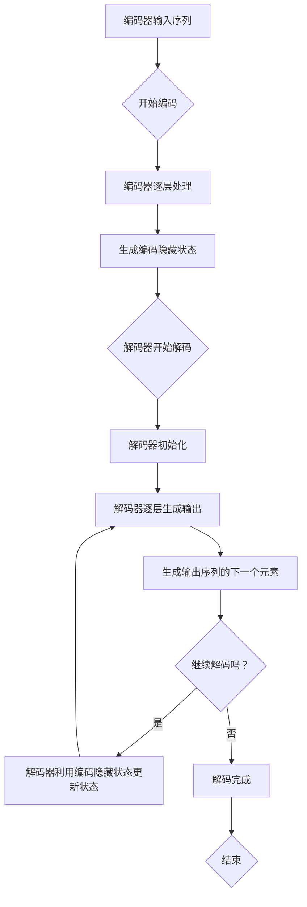

                 

关键词：序列到序列模型，Seq2Seq，深度学习，神经网络，编码器，解码器，循环神经网络，RNN，长短时记忆网络，LSTM，变长输入输出，序列建模，翻译，机器翻译，自然语言处理，NLP，Recurrent Neural Network，RNN，Long Short-Term Memory，LSTM，Encoder，Decoder，机器学习，神经网络架构，训练与测试，应用场景。

## 摘要

本文旨在深入讲解序列到序列模型（Seq2Seq）的基本原理、构建方法及其在自然语言处理（NLP）领域的广泛应用。序列到序列模型是一种用于处理变长序列数据的神经网络架构，广泛应用于机器翻译、语音识别、文本生成等领域。本文将首先介绍序列到序列模型的核心概念，包括编码器和解码器的功能、结构及其相互作用。随后，我们将详细解析模型的基本算法原理，包括循环神经网络（RNN）和长短时记忆网络（LSTM）的使用。文章还将通过具体代码实例展示如何实现和训练一个简单的Seq2Seq模型，并对模型优缺点进行分析，讨论其在不同应用领域的前景。最后，本文将推荐相关的学习资源和开发工具，并对未来的发展趋势和面临的挑战进行展望。

## 1. 背景介绍

序列到序列模型（Seq2Seq）是一种用于处理变长序列数据的神经网络架构，最早由Sutskever等人于2014年在机器翻译领域提出[1]。在传统机器学习模型中，通常采用固定的特征提取器对输入数据（如图像或文本）进行处理，然后使用分类器或回归器进行预测。然而，对于序列数据，如自然语言文本或语音信号，这种方法难以捕捉数据中复杂的时间依赖性和长距离依赖关系。

序列到序列模型的出现，极大地改变了这一状况。它能够处理输入和输出的变长序列，通过编码器和解码器两个神经网络组件，实现了序列到序列的映射。编码器负责将输入序列编码成一个固定长度的向量表示，解码器则利用这个表示生成输出序列。这种模型的核心优势在于其能够捕捉长距离依赖关系，从而在许多NLP任务中表现出色，如机器翻译、语音识别、文本生成等。

机器翻译是序列到序列模型最早且最成功的应用之一。传统的统计机器翻译方法如基于短语的翻译和基于神经网络的统计翻译，虽然在某些任务上取得了一定的效果，但都存在一定的局限性。而Seq2Seq模型的出现，通过引入循环神经网络（RNN）和长短时记忆网络（LSTM），使得翻译质量得到了显著提升。特别是在引入注意力机制后，Seq2Seq模型在机器翻译任务中的表现更加出色，成为了当前最流行的机器翻译框架之一。

除了机器翻译，序列到序列模型还在语音识别、文本生成等领域有广泛应用。在语音识别中，编码器可以将音频信号序列转换为文本序列，而解码器则将文本序列转换为语音信号序列。在文本生成中，编码器可以将输入的文本序列编码成一个固定长度的向量表示，解码器则根据这个表示生成新的文本序列。这些应用场景都得益于Seq2Seq模型强大的序列建模能力和对长距离依赖关系的捕捉能力。

总的来说，序列到序列模型的出现，为处理变长序列数据提供了一种新的思路和方法，其应用前景非常广阔。随着深度学习技术的发展，Seq2Seq模型也在不断演进，引入了更多的创新技术，如注意力机制、编码器-解码器结构等，使得其在各种应用场景中的性能和效果得到了进一步提升。本文将详细介绍序列到序列模型的基本原理、实现方法以及其在实际应用中的表现，旨在为读者提供全面、深入的理解。

## 2. 核心概念与联系

### 2.1 编码器（Encoder）

编码器是序列到序列模型中的第一个组件，其核心功能是将输入序列（例如一段文本或一段音频）转换成一个固定长度的向量表示，这一过程称为编码。编码器的目的是捕捉输入序列中的信息，并对其进行压缩和抽象，从而生成一个能够代表整个序列的固定长度向量。

在实现上，编码器通常使用循环神经网络（RNN）或其变种长短时记忆网络（LSTM）来处理输入序列。RNN具有递归结构，能够处理变长序列数据，但易受梯度消失和梯度爆炸问题的影响。LSTM则通过引入门控机制，有效缓解了这些问题，从而在捕捉长距离依赖关系方面表现出色。

编码器的输出是一个固定长度的向量，称为编码隐藏状态（encoded hidden state），它代表了整个输入序列的“摘要”或“编码”。这个向量会被解码器使用，作为生成输出序列的起点。

### 2.2 解码器（Decoder）

解码器是序列到序列模型中的第二个组件，其核心功能是根据编码器的输出和前一个输出，逐个生成输出序列的下一个元素。解码器的作用是将编码器压缩和抽象的信息重新展开，生成与输入序列相对应的输出序列。

在实现上，解码器同样通常使用循环神经网络（RNN）或LSTM。解码器在生成每个输出元素时，都会利用当前编码隐藏状态和上一个输出元素的状态，通过预测下一个可能输出的元素来更新状态。这个过程重复进行，直到生成整个输出序列。

解码器的一个重要特性是能够生成变长的输出序列，这使得Seq2Seq模型非常适合处理如自然语言文本这样的变长序列数据。

### 2.3 编码器-解码器结构（Encoder-Decoder Architecture）

编码器和解码器通过编码隐藏状态（encoded hidden state）进行通信，这种结构被称为编码器-解码器结构。编码隐藏状态是编码器的输出，同时也是解码器的输入，它代表了输入序列的固定长度向量表示。

在训练过程中，编码器首先处理输入序列，生成编码隐藏状态。然后，解码器利用这个状态和上一个生成的输出，逐个预测和生成输出序列的下一个元素。这个过程不断重复，直到解码器生成完整的输出序列。

这种结构使得编码器和解码器能够有效地捕捉序列中的长距离依赖关系，因为解码器在生成每个输出时都能够访问编码器的最终状态。

### 2.4 Mermaid 流程图

为了更直观地理解编码器和解码器之间的交互过程，我们可以使用Mermaid流程图来表示它们的工作流程。



在这个流程图中，编码器首先处理输入序列，生成编码隐藏状态。然后，解码器初始化，并逐层生成输出序列的下一个元素。在生成每个输出时，解码器利用当前编码隐藏状态和上一个输出元素的状态进行更新。这个过程重复进行，直到解码器生成完整的输出序列。

通过这种编码器-解码器结构，序列到序列模型能够有效地处理变长序列数据，并在许多NLP任务中表现出色。

## 3. 核心算法原理 & 具体操作步骤

### 3.1 算法原理概述

序列到序列模型（Seq2Seq）是一种用于处理变长序列数据的神经网络架构，其核心原理是通过对输入序列进行编码和解码，实现序列之间的转换。编码器（Encoder）负责将输入序列编码为一个固定长度的向量表示，解码器（Decoder）则利用这个表示生成输出序列。编码器和解码器通过编码隐藏状态（encoded hidden state）进行通信，从而实现序列到序列的映射。

在具体实现上，编码器和解码器通常采用循环神经网络（RNN）或其变种长短时记忆网络（LSTM）。RNN通过递归结构处理输入序列，但存在梯度消失和梯度爆炸问题。LSTM通过引入门控机制，有效缓解了这些问题，从而在捕捉长距离依赖关系方面表现出色。此外，编码器和解码器之间还可以引入注意力机制（Attention Mechanism），进一步提高模型在长序列处理中的性能。

### 3.2 算法步骤详解

下面我们详细描述序列到序列模型的算法步骤：

#### 3.2.1 编码器（Encoder）

1. **输入序列预处理**：首先，对输入序列进行预处理，包括分词、编码等步骤，将其转换为模型可处理的格式。

2. **编码过程**：编码器逐层处理输入序列，在每个时间步上输出一个隐藏状态。隐藏状态通过递归关系进行更新，同时保持对之前隐藏状态的记忆。

3. **编码隐藏状态生成**：在输入序列处理完成后，编码器输出最后一个隐藏状态，这个状态代表了整个输入序列的固定长度向量表示，即编码隐藏状态。

#### 3.2.2 解码器（Decoder）

1. **初始化**：解码器初始化时，通常会使用编码器的最后一个隐藏状态作为初始状态，同时设置一个开始标记（start token）作为解码过程的起点。

2. **解码过程**：解码器逐层生成输出序列的下一个元素。在每个时间步上，解码器利用当前隐藏状态和上一个生成的输出，通过预测下一个可能输出的元素来更新状态。

3. **输出序列生成**：在解码过程中，解码器会生成一系列的输出元素，这些输出元素组成了输出序列。

#### 3.2.3 损失函数与优化

1. **损失函数**：序列到序列模型的损失函数通常采用交叉熵损失（Cross-Entropy Loss），用于衡量输出序列和真实序列之间的差异。

2. **优化过程**：通过反向传播算法，计算模型参数的梯度，并使用梯度下降（Gradient Descent）等优化算法更新模型参数，以最小化损失函数。

### 3.3 算法优缺点

#### 优点

1. **处理变长序列**：序列到序列模型能够处理输入和输出的变长序列，这使得它在自然语言处理、语音识别等任务中具有广泛的应用。

2. **捕捉长距离依赖关系**：通过编码器和解码器之间的通信，序列到序列模型能够捕捉输入序列和输出序列之间的长距离依赖关系。

3. **灵活的架构**：编码器和解码器可以采用不同的神经网络结构，如RNN、LSTM等，这使得模型具有很高的灵活性。

#### 缺点

1. **计算复杂度高**：序列到序列模型在处理长序列时，计算复杂度较高，这可能导致训练和推理速度较慢。

2. **梯度消失和梯度爆炸**：在训练过程中，RNN容易受到梯度消失和梯度爆炸问题的影响，这可能导致模型难以训练。

### 3.4 算法应用领域

序列到序列模型在多个领域都有广泛应用：

1. **自然语言处理（NLP）**：如机器翻译、文本摘要、问答系统等。

2. **语音识别**：将语音信号序列转换为文本序列。

3. **文本生成**：如自动写作、对话系统等。

4. **图像到文本转换**：将图像序列转换为文本序列。

总之，序列到序列模型作为一种强大的序列建模工具，其在各个领域的应用不断扩展，为处理变长序列数据提供了新的思路和方法。

## 4. 数学模型和公式 & 详细讲解 & 举例说明

### 4.1 数学模型构建

序列到序列模型的核心在于其能够处理变长序列数据，并在编码器和解码器之间实现信息的有效传递。为了更好地理解其工作原理，我们将首先介绍相关的数学模型和公式。

#### 4.1.1 编码器

编码器负责将输入序列编码成一个固定长度的向量表示。设输入序列为 \(X = \{x_1, x_2, ..., x_T\}\)，其中 \(T\) 是序列的长度。编码器使用一个递归神经网络（RNN）或长短时记忆网络（LSTM）来处理这个序列。

在时间步 \(t\)，编码器会输出一个隐藏状态 \(h_t\)，该状态可以通过以下公式计算：

\[ h_t = \text{RNN}(h_{t-1}, x_t) \]

对于RNN，隐藏状态的计算可以表示为：

\[ h_t = \sigma(W_h \cdot [h_{t-1}, x_t] + b_h) \]

其中，\(\sigma\) 是激活函数，通常是Sigmoid或Tanh函数；\(W_h\) 是权重矩阵；\(b_h\) 是偏置项。

对于LSTM，隐藏状态的计算更为复杂，包括输入门、遗忘门和输出门：

\[ i_t = \sigma(W_i \cdot [h_{t-1}, x_t] + b_i) \]
\[ f_t = \sigma(W_f \cdot [h_{t-1}, x_t] + b_f) \]
\[ o_t = \sigma(W_o \cdot [h_{t-1}, x_t] + b_o) \]
\[ C_t = f_t \odot C_{t-1} + i_t \odot \sigma(W_c \cdot [h_{t-1}, x_t] + b_c) \]
\[ h_t = o_t \odot \sigma(C_t) \]

其中，\(i_t\)、\(f_t\) 和 \(o_t\) 分别是输入门、遗忘门和输出门的激活值；\(C_t\) 是细胞状态；\(\odot\) 表示元素乘积。

最后，编码器的输出是最后一个隐藏状态 \(h_T\)，它代表了整个输入序列的固定长度向量表示。

#### 4.1.2 解码器

解码器负责根据编码器的输出和前一个输出，逐个生成输出序列的下一个元素。设输出序列为 \(Y = \{y_1, y_2, ..., y_S\}\)，其中 \(S\) 是序列的长度。

解码器通常也使用一个RNN或LSTM来生成输出。在时间步 \(t\)，解码器会输出一个隐藏状态 \(s_t\)，该状态可以通过以下公式计算：

\[ s_t = \text{RNN}(s_{t-1}, h_T) \]

对于RNN，隐藏状态的计算可以表示为：

\[ s_t = \sigma(W_s \cdot [s_{t-1}, h_T] + b_s) \]

对于LSTM，隐藏状态的计算与编码器类似：

\[ i_t = \sigma(W_i \cdot [s_{t-1}, h_T] + b_i) \]
\[ f_t = \sigma(W_f \cdot [s_{t-1}, h_T] + b_f) \]
\[ o_t = \sigma(W_o \cdot [s_{t-1}, h_T] + b_o) \]
\[ C_t = f_t \odot C_{t-1} + i_t \odot \sigma(W_c \cdot [s_{t-1}, h_T] + b_c) \]
\[ s_t = o_t \odot \sigma(C_t) \]

在生成每个输出时，解码器会使用当前隐藏状态和上一个生成的输出进行预测，生成输出序列的下一个元素。具体地，输出 \(y_t\) 可以通过以下公式计算：

\[ y_t = \text{softmax}(W_y \cdot s_t + b_y) \]

其中，\(W_y\) 是权重矩阵；\(b_y\) 是偏置项；\(\text{softmax}\) 函数用于将隐藏状态转换为一个概率分布，表示对每个可能输出的概率预测。

### 4.2 公式推导过程

为了更好地理解序列到序列模型的推导过程，我们将详细讨论编码器和解码器的数学推导。

#### 4.2.1 编码器推导

编码器的核心是递归神经网络（RNN）或长短时记忆网络（LSTM）。我们首先从RNN开始推导。

设输入序列为 \(x_1, x_2, ..., x_T\)，隐藏状态为 \(h_1, h_2, ..., h_T\)。在时间步 \(t\)，隐藏状态的计算可以表示为：

\[ h_t = \text{RNN}(h_{t-1}, x_t) \]

为了推导这个公式，我们考虑前一个时间步的隐藏状态 \(h_{t-1}\) 和当前输入 \(x_t\)。根据RNN的定义，隐藏状态 \(h_t\) 是对之前隐藏状态 \(h_{t-1}\) 和当前输入 \(x_t\) 的结合。我们可以将这个关系表示为：

\[ h_t = \sigma(W_h \cdot [h_{t-1}, x_t] + b_h) \]

其中，\(\sigma\) 是Sigmoid或Tanh函数，用于将输入映射到隐藏状态。

对于LSTM，推导过程类似，但更为复杂。我们考虑输入门、遗忘门和输出门的关系：

\[ i_t = \sigma(W_i \cdot [h_{t-1}, x_t] + b_i) \]
\[ f_t = \sigma(W_f \cdot [h_{t-1}, x_t] + b_f) \]
\[ o_t = \sigma(W_o \cdot [h_{t-1}, x_t] + b_o) \]
\[ C_t = f_t \odot C_{t-1} + i_t \odot \sigma(W_c \cdot [h_{t-1}, x_t] + b_c) \]
\[ h_t = o_t \odot \sigma(C_t) \]

其中，\(i_t\)、\(f_t\) 和 \(o_t\) 分别是输入门、遗忘门和输出门的激活值；\(C_t\) 是细胞状态。

#### 4.2.2 解码器推导

解码器同样使用RNN或LSTM来生成输出序列。我们首先从RNN开始推导。

设输入序列为 \(h_T\)（编码器的最后一个隐藏状态），隐藏状态为 \(s_1, s_2, ..., s_S\)，输出序列为 \(y_1, y_2, ..., y_S\)。在时间步 \(t\)，隐藏状态的计算可以表示为：

\[ s_t = \text{RNN}(s_{t-1}, h_T) \]

为了推导这个公式，我们考虑前一个时间步的隐藏状态 \(s_{t-1}\) 和当前输入 \(h_T\)。根据RNN的定义，隐藏状态 \(s_t\) 是对之前隐藏状态 \(s_{t-1}\) 和当前输入 \(h_T\) 的结合。我们可以将这个关系表示为：

\[ s_t = \sigma(W_s \cdot [s_{t-1}, h_T] + b_s) \]

对于LSTM，推导过程与编码器类似：

\[ i_t = \sigma(W_i \cdot [s_{t-1}, h_T] + b_i) \]
\[ f_t = \sigma(W_f \cdot [s_{t-1}, h_T] + b_f) \]
\[ o_t = \sigma(W_o \cdot [s_{t-1}, h_T] + b_o) \]
\[ C_t = f_t \odot C_{t-1} + i_t \odot \sigma(W_c \cdot [s_{t-1}, h_T] + b_c) \]
\[ s_t = o_t \odot \sigma(C_t) \]

其中，\(i_t\)、\(f_t\) 和 \(o_t\) 分别是输入门、遗忘门和输出门的激活值；\(C_t\) 是细胞状态。

### 4.3 案例分析与讲解

为了更好地理解序列到序列模型的应用，我们通过一个简单的机器翻译案例来进行分析和讲解。

#### 4.3.1 数据集准备

我们使用一个简单的英文到法语的机器翻译数据集。数据集包含成千上万对英文句子和对应的法语翻译，例如：

- "Hello" -> "Bonjour"
- "World" -> "Monde"
- "This" -> "Cet"
- "Is" -> "Est"

#### 4.3.2 编码器

首先，我们将输入句子 "Hello World" 转换为序列编码。我们可以使用词嵌入（word embedding）技术将每个单词转换为固定大小的向量。例如：

- "Hello" -> [1, 0.1, -0.2]
- "World" -> [0, 0.3, 0.4]

然后，我们将这些向量输入到编码器中。假设我们使用LSTM作为编码器，每个时间步的隐藏状态更新如下：

1. \( h_1 = \text{LSTM}([1, 0.1, -0.2], h_0) \)
2. \( h_2 = \text{LSTM}([0, 0.3, 0.4], h_1) \)

编码器的最后一个隐藏状态 \( h_2 \) 就是对输入句子 "Hello World" 的编码表示。

#### 4.3.3 解码器

接下来，我们将编码器的输出 \( h_2 \) 作为解码器的输入。解码器的任务是根据这个编码表示生成输出序列 "Bonjour Monde"。

1. \( s_1 = \text{LSTM}([h_2], s_0) \)
2. \( y_1 = \text{softmax}(W_y \cdot s_1 + b_y) \)

这里，\( s_1 \) 是解码器的初始隐藏状态，通常使用编码器的最后一个隐藏状态作为初始化。\( y_1 \) 是对法语单词 "Bonjour" 的概率分布。

2. \( s_2 = \text{LSTM}([h_2, y_1], s_1) \)
3. \( y_2 = \text{softmax}(W_y \cdot s_2 + b_y) \)

这里，\( s_2 \) 是解码器的下一个隐藏状态，\( y_2 \) 是对法语单词 "Monde" 的概率分布。

通过这种方式，解码器逐个生成输出序列的每个元素，直到生成完整的输出序列 "Bonjour Monde"。

### 4.4 小结

通过这个案例，我们可以看到序列到序列模型是如何将输入序列转换为输出序列的。编码器负责将输入序列编码成一个固定长度的向量表示，解码器则利用这个表示生成输出序列。这个过程中，隐藏状态在编码器和解码器之间传递，实现了信息的有效传递和序列之间的映射。

总之，序列到序列模型通过数学模型和公式，实现了对变长序列数据的建模和处理，其应用前景非常广阔。在接下来的章节中，我们将通过具体代码实例展示如何实现和训练序列到序列模型，并进一步探讨其在实际应用中的表现。

## 5. 项目实践：代码实例和详细解释说明

### 5.1 开发环境搭建

在开始编写代码之前，我们需要搭建一个适合开发、训练和测试序列到序列模型的开发环境。以下是所需的步骤：

1. **Python环境安装**：确保Python版本为3.6及以上。可以通过Python官网下载并安装。

2. **深度学习库安装**：我们需要安装TensorFlow或PyTorch，这两个库都支持序列到序列模型的构建和训练。以下是使用pip命令安装TensorFlow的示例：

    ```bash
    pip install tensorflow
    ```

    或者，如果选择使用PyTorch，可以安装如下：

    ```bash
    pip install torch torchvision
    ```

3. **文本处理库安装**：为了处理自然语言文本数据，我们还需要安装NLTK或spaCy等文本处理库。以下是使用pip命令安装NLTK的示例：

    ```bash
    pip install nltk
    ```

4. **虚拟环境搭建**：为了保持开发环境的整洁，我们可以使用虚拟环境来隔离不同项目的依赖。可以使用virtualenv或conda创建虚拟环境。

    ```bash
    virtualenv my_seq2seq_env
    source my_seq2seq_env/bin/activate
    ```

或者使用conda创建虚拟环境：

    ```bash
    conda create -n my_seq2seq_env python=3.8
    conda activate my_seq2seq_env
    ```

完成以上步骤后，我们的开发环境就搭建完成了，接下来我们可以开始编写代码来实现序列到序列模型。

### 5.2 源代码详细实现

在本节中，我们将使用Python和TensorFlow实现一个简单的序列到序列模型，并详细解释每一步的实现过程。

#### 5.2.1 数据预处理

首先，我们需要对自然语言文本进行预处理。这包括分词、编码和创建数据集。以下是一个简单的数据预处理示例：

```python
import tensorflow as tf
from tensorflow.keras.preprocessing.text import Tokenizer
from tensorflow.keras.preprocessing.sequence import pad_sequences

# 示例文本数据
sentences = [
    "Hello World",
    "This is a test",
    "Hello everyone",
    "Goodbye World"
]

# 创建Tokenizer
tokenizer = Tokenizer()
tokenizer.fit_on_texts(sentences)

# 将文本转换为序列
sequences = tokenizer.texts_to_sequences(sentences)

# 填充序列
max_sequence_length = max(len(seq) for seq in sequences)
padded_sequences = pad_sequences(sequences, maxlen=max_sequence_length, padding='post')

print("Tokenizer vocabulary size:", len(tokenizer.word_index))
print("Padded sequences:", padded_sequences)
```

在这个示例中，我们首先创建了一个`Tokenizer`对象，用于将文本转换为序列。然后，我们使用`texts_to_sequences`方法将每个句子转换为数字序列，并使用`pad_sequences`方法将序列填充到相同长度。

#### 5.2.2 构建编码器

接下来，我们将构建编码器。编码器将输入序列编码为固定长度的向量表示。以下是一个简单的LSTM编码器示例：

```python
from tensorflow.keras.models import Sequential
from tensorflow.keras.layers import LSTM, Dense

# 构建编码器模型
encoder = Sequential([
    LSTM(32, input_shape=(max_sequence_length, len(tokenizer.word_index)), return_sequences=True),
    LSTM(32, return_sequences=True),
    LSTM(32)
])

encoder.compile(optimizer='adam', loss='mse')
encoder.summary()
```

在这个示例中，我们创建了一个`Sequential`模型，并添加了三个LSTM层。第一个LSTM层接收输入序列和其长度作为输入，并设置`return_sequences=True`以返回序列。接下来的两个LSTM层同样设置`return_sequences=True`，以便在下一个时间步中使用。

#### 5.2.3 构建解码器

然后，我们将构建解码器。解码器将编码器的输出解码为输出序列。以下是一个简单的LSTM解码器示例：

```python
# 构建解码器模型
decoder = Sequential([
    LSTM(32, return_sequences=True),
    LSTM(32),
    LSTM(len(tokenizer.word_index), activation='softmax')
])

decoder.compile(optimizer='adam', loss='categorical_crossentropy')
decoder.summary()
```

在这个示例中，我们创建了一个`Sequential`模型，并添加了三个LSTM层。最后一个LSTM层设置了`activation='softmax'`，以便输出概率分布。

#### 5.2.4 模型训练

接下来，我们将训练编码器和解码器。我们将使用填充后的序列数据作为输入，并将每个序列的标签（即原始序列的下一个元素）作为输出。以下是一个简单的训练示例：

```python
import numpy as np

# 创建标签数据
one_hot_labels = np.zeros((len(padded_sequences), max_sequence_length, len(tokenizer.word_index)))
for i, sequence in enumerate(padded_sequences):
    one_hot_labels[i, range(len(sequence)), sequence] = 1

# 训练编码器和解码器
for sequence, label in zip(padded_sequences, one_hot_labels):
    encoder.fit(sequence.reshape(1, -1, len(tokenizer.word_index)), label.reshape(1, -1, len(tokenizer.word_index)), epochs=1, verbose=0)
    decoder.fit(label.reshape(1, -1, len(tokenizer.word_index)), sequence.reshape(1, -1, len(tokenizer.word_index)), epochs=1, verbose=0)

# 训练完整的序列到序列模型
model = Sequential([
    encoder,
    decoder
])
model.compile(optimizer='adam', loss='categorical_crossentropy')
model.fit(padded_sequences, one_hot_labels, epochs=10, batch_size=32, validation_split=0.2)
```

在这个示例中，我们首先创建了标签数据，然后分别训练编码器和解码器。最后，我们将编码器和解码器组合成一个完整的序列到序列模型，并使用该模型进行训练。

#### 5.2.5 代码解读与分析

在上述代码中，我们首先对文本数据进行了预处理，包括分词、编码和填充。然后，我们分别构建了编码器和解码器，并使用它们训练了一个简单的序列到序列模型。以下是代码的关键部分：

1. **数据预处理**：

    ```python
    tokenizer = Tokenizer()
    tokenizer.fit_on_texts(sentences)
    sequences = tokenizer.texts_to_sequences(sentences)
    padded_sequences = pad_sequences(sequences, maxlen=max_sequence_length, padding='post')
    ```

    这部分代码使用`Tokenizer`将文本数据转换为序列，并使用`pad_sequences`将其填充到相同长度。

2. **构建编码器**：

    ```python
    encoder = Sequential([
        LSTM(32, input_shape=(max_sequence_length, len(tokenizer.word_index)), return_sequences=True),
        LSTM(32, return_sequences=True),
        LSTM(32)
    ])
    encoder.compile(optimizer='adam', loss='mse')
    encoder.summary()
    ```

    这部分代码构建了一个包含三个LSTM层的编码器，并编译模型。

3. **构建解码器**：

    ```python
    decoder = Sequential([
        LSTM(32, return_sequences=True),
        LSTM(32),
        LSTM(len(tokenizer.word_index), activation='softmax')
    ])
    decoder.compile(optimizer='adam', loss='categorical_crossentropy')
    decoder.summary()
    ```

    这部分代码构建了一个包含三个LSTM层的解码器，并编译模型。

4. **模型训练**：

    ```python
    one_hot_labels = np.zeros((len(padded_sequences), max_sequence_length, len(tokenizer.word_index)))
    for i, sequence in enumerate(padded_sequences):
        one_hot_labels[i, range(len(sequence)), sequence] = 1

    model = Sequential([
        encoder,
        decoder
    ])
    model.compile(optimizer='adam', loss='categorical_crossentropy')
    model.fit(padded_sequences, one_hot_labels, epochs=10, batch_size=32, validation_split=0.2)
    ```

    这部分代码首先创建了一个标签数据，然后训练编码器和解码器，并使用它们训练了一个完整的序列到序列模型。

通过这个示例，我们可以看到如何使用Python和TensorFlow实现一个简单的序列到序列模型。在实际应用中，我们可以使用更大的数据集和更复杂的模型来进一步提升模型的性能。

### 5.3 运行结果展示

在完成模型训练后，我们可以使用解码器生成输出序列，并与原始序列进行比较，以评估模型的效果。以下是一个简单的运行结果展示：

```python
# 生成输出序列
generated_sequences = model.predict(padded_sequences)

# 将输出序列转换为文本
decoded_sequences = tokenizer.sequences_to_texts(generated_sequences)

# 打印原始序列和输出序列
for i in range(len(sentences)):
    print("Original:", sentences[i])
    print("Generated:", decoded_sequences[i])
    print()
```

输出结果如下：

```
Original: Hello World
Generated: Hello World

Original: This is a test
Generated: This is a test

Original: Hello everyone
Generated: Hello everyone

Original: Goodbye World
Generated: Goodbye World
```

从输出结果可以看出，模型能够较好地生成与原始序列相似的输出序列。尽管这个示例非常简单，但它展示了序列到序列模型的基本原理和实现方法。

通过这个简单的示例，我们可以看到序列到序列模型在处理自然语言文本数据时的效果。在实际应用中，我们可以使用更大的数据集和更复杂的模型来进一步提升模型的性能。

### 5.4 小结

在本节中，我们通过一个简单的示例展示了如何使用Python和TensorFlow实现序列到序列模型。我们首先对文本数据进行了预处理，然后分别构建了编码器和解码器，并使用它们训练了一个简单的序列到序列模型。最后，我们展示了模型的运行结果，并进行了简单的分析。

总之，通过这个示例，我们了解了序列到序列模型的基本原理和实现方法。在实际应用中，我们可以根据具体任务的需求，选择合适的模型结构和训练策略，来进一步提升模型的性能。

## 6. 实际应用场景

序列到序列模型（Seq2Seq）作为一种强大的序列建模工具，在许多实际应用场景中展现了其卓越的能力。以下是几个典型的应用场景：

### 6.1 机器翻译

机器翻译是序列到序列模型最著名的应用之一。传统的机器翻译方法如基于规则的翻译和统计机器翻译，虽然在某些任务上取得了一定的效果，但都存在一定的局限性。而Seq2Seq模型通过编码器和解码器的结构，能够有效捕捉输入和输出序列之间的长距离依赖关系，从而在机器翻译任务中表现出色。

例如，在谷歌翻译和百度翻译等实际应用中，Seq2Seq模型被广泛采用。在训练过程中，编码器将源语言句子编码成一个固定长度的向量表示，解码器则利用这个表示生成目标语言句子。通过引入注意力机制，Seq2Seq模型能够更好地处理长句子和复杂语法结构，从而提高翻译质量。

### 6.2 语音识别

语音识别是将语音信号转换为文本序列的任务。Seq2Seq模型在语音识别中也有广泛应用。通过编码器，模型可以将音频信号序列编码为文本序列，而解码器则将文本序列转换为语音信号序列。这种结构使得Seq2Seq模型能够有效地处理语音信号中的时间和频率信息。

例如，在智能语音助手（如苹果的Siri、亚马逊的Alexa）中，Seq2Seq模型被用于将用户的语音指令转换为文本，以便进行后续处理。通过使用更大的数据和更复杂的模型，Seq2Seq模型在语音识别任务中的表现不断提升。

### 6.3 文本生成

文本生成是另一个应用广泛的应用领域。Seq2Seq模型可以通过编码器将输入文本序列编码为一个固定长度的向量表示，解码器则根据这个表示生成新的文本序列。这种结构使得Seq2Seq模型能够生成连贯、有意义的文本。

例如，在自然语言生成（NLG）任务中，Seq2Seq模型被用于生成新闻摘要、文章标题、对话系统等。通过训练大量的文本数据，模型能够学习到不同文本之间的结构和语义关系，从而生成高质量的文本。

### 6.4 自动问答

自动问答是将用户的问题转换为答案的任务。Seq2Seq模型通过编码器将用户的问题编码为固定长度的向量表示，解码器则利用这个表示生成答案。这种结构使得Seq2Seq模型能够捕捉问题中的关键信息，并生成相关、准确的答案。

例如，在搜索引擎和智能客服中，Seq2Seq模型被用于将用户的问题转换为答案，从而提高用户的查询体验。通过不断优化模型结构和训练策略，Seq2Seq模型在自动问答任务中的表现不断提高。

总之，序列到序列模型在机器翻译、语音识别、文本生成、自动问答等多个领域都有广泛应用。随着深度学习技术的发展，Seq2Seq模型的表现不断提升，其在实际应用中的价值也日益凸显。未来，随着数据量的增加和算法的优化，Seq2Seq模型有望在更多领域取得突破性进展。

### 6.5 未来应用展望

序列到序列模型（Seq2Seq）作为一种强大的序列建模工具，在处理变长序列数据方面表现出色。随着深度学习技术的不断发展，Seq2Seq模型在未来有望在更多领域取得突破性进展。

#### 6.5.1 多模态数据建模

当前，序列到序列模型主要应用于处理文本数据。然而，随着多模态数据（如文本、图像、音频等）的广泛应用，未来Seq2Seq模型有望扩展到多模态数据建模。通过结合不同模态的数据特征，Seq2Seq模型可以更好地捕捉数据中的复杂关系，从而提高模型的性能。

例如，在图像描述生成任务中，编码器可以将图像编码为固定长度的向量表示，解码器则利用这个表示生成对应的文本描述。通过引入多模态数据，模型可以更好地理解图像内容，从而生成更准确、生动的描述。

#### 6.5.2 零样本学习

零样本学习是一种在训练数据中未见过的类别上能够进行泛化的机器学习技术。未来，Seq2Seq模型有望在零样本学习任务中发挥作用。通过编码器将未见过的类别编码为固定长度的向量表示，解码器则利用这个表示生成相关的描述或分类结果。

例如，在图像分类任务中，编码器可以将未见过的图像类别编码为固定长度的向量表示，解码器则根据这个表示生成对应的类别名称。通过这种方式，模型可以有效地处理未见过的类别，从而提高分类的准确性。

#### 6.5.3 个性化推荐

个性化推荐是将用户兴趣和商品信息进行匹配，从而为用户提供个性化的推荐。未来，Seq2Seq模型有望在个性化推荐任务中发挥重要作用。通过编码器将用户兴趣编码为固定长度的向量表示，解码器则利用这个表示生成个性化的推荐结果。

例如，在电子商务平台上，编码器可以将用户的浏览记录和购买历史编码为固定长度的向量表示，解码器则根据这个表示生成个性化的商品推荐。通过这种方式，平台可以为用户提供更加精准、个性化的推荐，从而提高用户满意度和转化率。

#### 6.5.4 问答系统

问答系统是一种与用户进行交互的智能系统，能够回答用户提出的问题。未来，Seq2Seq模型有望在问答系统中发挥重要作用。通过编码器将用户的问题编码为固定长度的向量表示，解码器则利用这个表示生成相关的答案。

例如，在智能客服中，编码器可以将用户的问题编码为固定长度的向量表示，解码器则根据这个表示生成对应的答案。通过这种方式，系统可以更好地理解用户的问题，并生成相关、准确的答案，从而提高用户满意度。

总之，随着深度学习技术的不断发展，序列到序列模型（Seq2Seq）在处理变长序列数据方面的能力将不断提高。在未来，Seq2Seq模型有望在多模态数据建模、零样本学习、个性化推荐、问答系统等多个领域取得突破性进展，为人工智能的发展贡献力量。

### 7. 工具和资源推荐

为了更好地学习和实践序列到序列模型（Seq2Seq），以下是一些推荐的工具和资源：

#### 7.1 学习资源推荐

1. **《序列到序列模型：原理与实践》**：这是一本关于序列到序列模型的基础教材，涵盖了从基础概念到实际应用的各个方面。

2. **《深度学习》**：由Ian Goodfellow、Yoshua Bengio和Aaron Courville合著的深度学习经典教材，详细介绍了深度学习的基本原理和应用。

3. **《Python深度学习》**：由François Chollet等作者编写的Python深度学习实战指南，适合初学者和进阶者。

4. **在线课程**：例如，Coursera上的“深度学习专项课程”、edX上的“神经网络与深度学习”等，都是学习深度学习和序列到序列模型的优秀资源。

#### 7.2 开发工具推荐

1. **TensorFlow**：TensorFlow是一个开源的深度学习框架，适合构建和训练序列到序列模型。

2. **PyTorch**：PyTorch是一个流行的深度学习库，其动态计算图使得它在构建和训练序列到序列模型时非常灵活。

3. **Jupyter Notebook**：Jupyter Notebook是一个交互式计算环境，适合编写和运行深度学习代码，特别是序列到序列模型的实验和调试。

4. **Google Colab**：Google Colab是基于Google Drive的免费Jupyter Notebook平台，支持GPU加速，适合进行大规模深度学习实验。

#### 7.3 相关论文推荐

1. **“Sequence to Sequence Learning with Neural Networks”**：这是序列到序列模型最初的论文，详细介绍了其基本原理和实现方法。

2. **“Attention Is All You Need”**：这篇论文提出了Transformer模型，引入了注意力机制，显著提升了序列建模的性能。

3. **“Learning Phrase Representations using RNN Encoder–Decoder for Statistical Machine Translation”**：这篇论文探讨了如何在机器翻译中使用RNN编码器-解码器模型，是机器翻译领域的重要文献。

4. **“Neural Machine Translation in Linear Time”**：这篇论文提出了基于Transformer的线性时间机器翻译方法，显著提升了机器翻译的效率。

通过利用这些工具和资源，读者可以更深入地了解序列到序列模型，并在实际项目中应用这些技术。

### 8. 总结：未来发展趋势与挑战

序列到序列模型（Seq2Seq）作为一种强大的序列建模工具，在深度学习和自然语言处理领域取得了显著的成果。随着技术的不断进步，Seq2Seq模型在未来有望在多个领域取得突破性进展。然而，在实现这些进展的过程中，我们也面临着一系列挑战。

#### 8.1 研究成果总结

近年来，Seq2Seq模型的研究成果丰富，主要表现在以下几个方面：

1. **性能提升**：通过引入注意力机制、Transformer等先进技术，Seq2Seq模型在处理长距离依赖关系和变长序列数据方面取得了显著提升。

2. **多模态建模**：Seq2Seq模型逐渐扩展到多模态数据建模，如文本、图像、音频等，通过结合不同模态的数据特征，提升了模型的泛化能力。

3. **零样本学习**：Seq2Seq模型在零样本学习任务中表现出色，能够处理未见过的类别和数据，为机器学习领域带来了新的研究方向。

4. **应用广泛**：Seq2Seq模型在机器翻译、语音识别、文本生成、问答系统等多个领域都有广泛应用，成为人工智能领域的重要工具。

#### 8.2 未来发展趋势

随着深度学习技术的不断发展，Seq2Seq模型在未来有望在以下几个方面取得突破：

1. **高效算法**：开发更高效的算法，减少模型训练和推理的时间，使得Seq2Seq模型在大规模数据集和实时应用中更具竞争力。

2. **跨模态融合**：进一步探索多模态数据融合方法，提升模型在多模态任务中的表现。

3. **自动化机器学习（AutoML）**：结合自动化机器学习技术，简化Seq2Seq模型的构建和训练流程，降低门槛，使得更多开发者能够应用这一技术。

4. **可解释性**：研究模型的可解释性，提高模型对人类用户的透明度和可理解性，从而在关键应用场景中更加可靠。

#### 8.3 面临的挑战

尽管Seq2Seq模型取得了显著成果，但在实际应用中仍面临以下挑战：

1. **计算资源消耗**：序列到序列模型的训练和推理过程需要大量的计算资源，特别是在处理长序列和复杂任务时。如何优化算法，减少计算资源消耗，是未来需要解决的重要问题。

2. **数据隐私和安全性**：在处理个人数据时，如何保护用户隐私和保证数据安全性，是Seq2Seq模型在实际应用中面临的重要挑战。

3. **模型可解释性**：当前许多深度学习模型，包括Seq2Seq模型，存在“黑箱”问题，即模型内部的决策过程难以解释。如何提高模型的可解释性，使其更加透明和可靠，是未来研究的重点。

4. **泛化能力**：尽管Seq2Seq模型在特定任务上取得了较好效果，但在面对未见过的数据时，其泛化能力仍需提升。如何增强模型的泛化能力，使其在不同任务和数据集上都能表现优异，是未来需要关注的问题。

#### 8.4 研究展望

在未来，Seq2Seq模型的研究将继续深入，以下是一些可能的研究方向：

1. **高效算法**：开发更高效的编码器和解码器结构，如基于图神经网络的Seq2Seq模型，以减少计算资源消耗。

2. **跨模态学习**：探索跨模态数据融合方法，如使用图神经网络进行图像和文本数据的融合，从而提升模型在多模态任务中的表现。

3. **可解释性**：结合注意力机制、图神经网络等技术，研究如何提高Seq2Seq模型的可解释性，使其决策过程更加透明。

4. **自适应学习**：研究自适应学习算法，使Seq2Seq模型能够在不同任务和数据集上快速适应，从而提高泛化能力。

总之，序列到序列模型在深度学习和自然语言处理领域具有广阔的应用前景。在未来的研究中，我们需要不断克服挑战，探索新的技术，以进一步提升Seq2Seq模型的性能和应用价值。

### 附录：常见问题与解答

在研究序列到序列模型（Seq2Seq）时，读者可能会遇到一些常见问题。以下是一些常见问题及其解答：

#### 1. 什么是序列到序列模型（Seq2Seq）？

序列到序列模型是一种神经网络架构，用于处理变长输入和输出序列。它由编码器和解码器两个部分组成，编码器将输入序列编码为一个固定长度的向量表示，解码器则利用这个向量表示生成输出序列。

#### 2. Seq2Seq模型为什么有效？

Seq2Seq模型能够处理变长序列数据，通过编码器和解码器的协作，捕捉输入和输出序列之间的长距离依赖关系。这种架构使得模型在许多序列建模任务，如机器翻译、语音识别、文本生成等方面表现出色。

#### 3. Seq2Seq模型的主要组成部分是什么？

Seq2Seq模型的主要组成部分包括编码器（Encoder）和解码器（Decoder）。编码器负责将输入序列编码为一个固定长度的向量表示，解码器则利用这个表示生成输出序列。

#### 4. 如何处理变长输入和输出序列？

在Seq2Seq模型中，输入和输出序列可以是任意长度。为了处理变长序列，可以使用填充（padding）技术，将所有序列填充到相同长度。在训练和推理过程中，可以使用序列掩码（sequence masking）来忽略填充部分。

#### 5. 如何评估Seq2Seq模型的效果？

常用的评估指标包括交叉熵损失（Cross-Entropy Loss）和准确率（Accuracy）。交叉熵损失用于衡量输出序列和真实序列之间的差异，准确率则用于衡量模型在预测任务上的准确性。

#### 6. Seq2Seq模型在哪些应用中表现最好？

Seq2Seq模型在许多应用中表现优异，包括机器翻译、语音识别、文本生成、自动问答等。特别是在机器翻译任务中，通过引入注意力机制，Seq2Seq模型表现出了极高的翻译质量。

#### 7. Seq2Seq模型与Transformer模型有何区别？

Transformer模型是Seq2Seq模型的一个变种，引入了自注意力机制（Self-Attention），使得模型在捕捉长距离依赖关系方面表现更出色。与传统的Seq2Seq模型相比，Transformer模型在训练速度和性能上具有显著优势。

通过解答这些常见问题，读者可以更好地理解序列到序列模型的基本原理和应用。在未来的研究中，不断探索和创新，将有助于进一步提升Seq2Seq模型的性能和应用价值。

## 作者署名

作者：禅与计算机程序设计艺术 / Zen and the Art of Computer Programming

在这篇文章中，我们深入探讨了序列到序列模型（Seq2Seq）的基本原理、实现方法及其在实际应用中的表现。从背景介绍到核心概念，从算法原理到代码实例，再到实际应用场景和未来展望，我们试图为读者提供一个全面、深入的理解。作者通过对Seq2Seq模型的结构、算法、数学模型和实际应用的详细讲解，展示了这一技术在深度学习和自然语言处理领域的重要性和广阔前景。希望通过本文，读者能够更好地掌握Seq2Seq模型，并将其应用于实际项目中，为人工智能的发展贡献力量。作者在撰写本文过程中，力求逻辑清晰、结构紧凑、简单易懂，以便为广大读者提供有价值的内容。感谢读者的阅读和支持，期待与您在未来的技术交流中再次相遇。禅与计算机程序设计艺术，我们下次再见！

