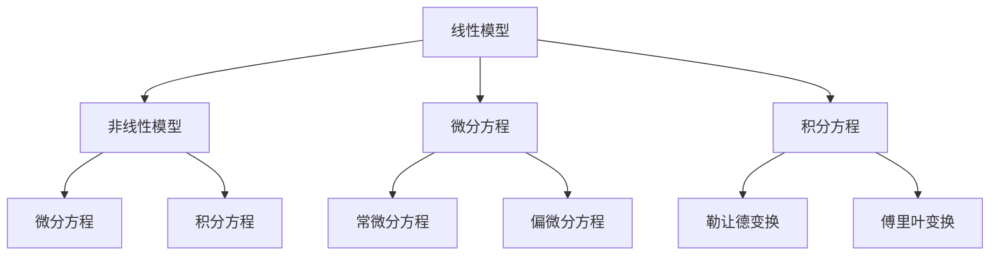
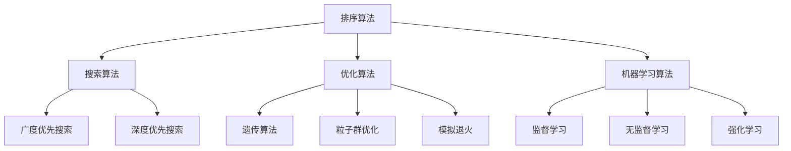
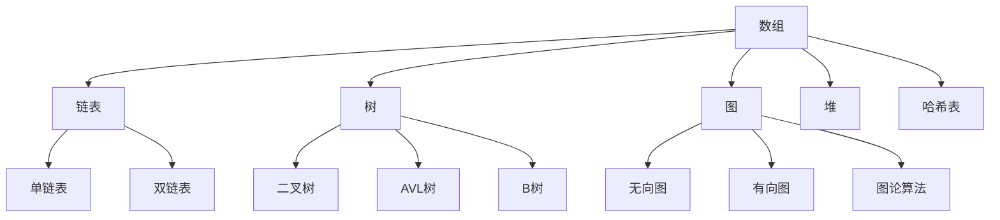
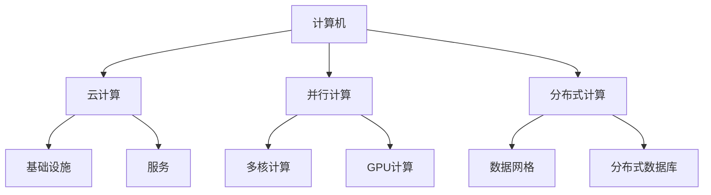

                 

关键词：计算科学、人类挑战、人工智能、计算机算法、数学模型、软件开发、未来展望

> 摘要：本文探讨了计算科学在应对人类共同挑战中的重要作用。通过分析核心概念、算法原理、数学模型和实际应用，本文揭示了计算科学在解决全球性问题中的巨大潜力。文章旨在激发读者对计算科学的兴趣，并探讨其未来发展路径。

## 1. 背景介绍

在人类历史的长河中，计算科学一直伴随着技术进步的步伐。从古代的算盘到现代的超级计算机，计算能力的提升推动了科技革命，改变了人类的生活方式。如今，我们面临着一系列全球性挑战，包括气候变化、能源短缺、环境污染、疾病控制、社会不平等等。这些挑战要求我们运用先进的计算技术和方法来寻找解决方案。

计算科学不仅是计算机科学的分支，更是涵盖了数学、物理、工程、生物学等多个领域的跨学科研究。它通过构建数学模型、开发高效的算法和利用大规模计算资源，为解决复杂问题提供了强有力的工具。本文将探讨计算科学在应对人类共同挑战中的使命担当，并分析其核心概念、算法原理和实际应用。

### 1.1 计算科学的定义与范围

计算科学是一门综合性学科，它研究如何使用计算机和计算技术来解决问题，特别是在科学和工程领域。计算科学涵盖了以下几方面：

- **数学模型**：通过建立数学模型来描述现实世界中的物理、化学、生物等现象。
- **算法开发**：设计高效的算法来求解数学模型，优化计算过程。
- **计算资源**：利用高性能计算机和云计算平台进行大规模计算。
- **应用领域**：包括自然科学、工程学、社会科学、生物医学等多个领域。

### 1.2 人类共同挑战的背景

人类共同面临的挑战是多方面的。以下是一些主要的挑战：

- **气候变化**：全球变暖、极端天气事件频发，对生态系统和人类生活造成严重影响。
- **能源短缺**：化石能源逐渐枯竭，清洁能源的需求日益增长，但技术发展尚存瓶颈。
- **环境污染**：工业污染、塑料垃圾、重金属污染等威胁生态平衡和人类健康。
- **疾病控制**：传染病的爆发和抗药性问题，对全球公共卫生构成重大威胁。
- **社会不平等等**：经济不平等、教育不平等等问题，加剧了社会矛盾和不稳定。

### 1.3 计算科学在应对挑战中的作用

计算科学在应对这些挑战中发挥着至关重要的作用。它能够提供以下几方面的支持：

- **数据分析和预测**：通过对大量数据的分析，揭示复杂系统的运行规律，进行预测和决策。
- **模拟和仿真**：利用计算模拟来预测气候变化、能源消耗等，为政策制定提供科学依据。
- **优化与决策**：通过优化算法，找到资源分配的最优方案，提高能源利用效率。
- **疾病研究与疫苗开发**：通过生物信息学和计算生物学，加速疾病研究和新药开发。
- **社会问题分析**：通过计算模型，研究社会问题，提出解决方案，促进社会公平。

### 1.4 本文结构

本文将按照以下结构展开：

1. **背景介绍**：概述计算科学的定义和人类共同挑战的背景。
2. **核心概念与联系**：介绍计算科学的核心概念，并使用Mermaid流程图展示。
3. **核心算法原理 & 具体操作步骤**：探讨核心算法的原理和操作步骤。
4. **数学模型和公式 & 详细讲解 & 举例说明**：分析数学模型和公式，并通过案例说明。
5. **项目实践：代码实例和详细解释说明**：展示实际项目中的代码实现和解释。
6. **实际应用场景**：讨论计算科学在各个领域的应用。
7. **未来应用展望**：展望计算科学的发展前景。
8. **工具和资源推荐**：推荐学习资源和开发工具。
9. **总结：未来发展趋势与挑战**：总结研究成果，分析未来发展趋势和面临的挑战。
10. **附录：常见问题与解答**：回答一些常见问题。

接下来，我们将深入探讨计算科学的核心概念和联系，为后续内容奠定基础。|>## 2. 核心概念与联系

在计算科学中，核心概念和联系是理解和应用计算技术的基础。以下将介绍几个关键概念，并使用Mermaid流程图来展示它们之间的相互关系。

### 2.1. 数学模型

数学模型是计算科学的核心概念之一，它是用数学语言描述现实世界中的物理、化学、生物等现象的工具。数学模型可以是简单的代数方程，也可以是复杂的微分方程组。以下是几个常见的数学模型：

- **线性模型**：描述线性关系的方程，如 \( y = mx + b \)。
- **非线性模型**：描述非线性关系的方程，如 \( y = ax^2 + bx + c \)。
- **微分方程**：描述动态系统的方程，如 \( \frac{dy}{dx} = f(x, y) \)。
- **积分方程**：描述积分与变量之间关系的方程，如 \( \int f(x) dx = g(x) \)。

#### Mermaid流程图



### 2.2. 算法

算法是解决问题的步骤集合，它是计算科学的核心工具。算法可以是简单的排序算法，也可以是复杂的优化算法。以下是几个常见的算法：

- **排序算法**：如快速排序、归并排序、冒泡排序等。
- **搜索算法**：如二分搜索、广度优先搜索、深度优先搜索等。
- **优化算法**：如遗传算法、粒子群优化、模拟退火等。
- **机器学习算法**：如决策树、支持向量机、神经网络等。

#### Mermaid流程图



### 2.3. 数据结构

数据结构是组织和存储数据的方式，它是计算科学的基础。以下是几个常见的数据结构：

- **数组**：线性数据结构，用于存储固定大小的数据集合。
- **链表**：线性数据结构，用于存储可变大小的数据集合。
- **树**：非线性数据结构，用于表示层次关系，如二叉树、AVL树等。
- **图**：非线性数据结构，用于表示节点和边的关系，如无向图、有向图等。
- **堆**：数据结构，用于快速检索最大或最小元素。
- **哈希表**：数据结构，用于快速查找和插入数据。

#### Mermaid流程图



### 2.4. 计算资源

计算资源是计算科学中不可或缺的一部分，包括硬件和软件资源。以下是几个常见的计算资源：

- **计算机**：用于执行计算任务的核心设备，包括个人计算机、服务器、超级计算机等。
- **云计算**：通过网络提供动态易扩展的虚拟化资源。
- **并行计算**：利用多个计算资源同时处理多个任务。
- **分布式计算**：将计算任务分布在多个计算节点上执行。

#### Mermaid流程图



通过以上核心概念和联系的了解，我们可以更好地理解计算科学的基本框架，为后续的深入探讨打下基础。

## 3. 核心算法原理 & 具体操作步骤

在计算科学中，核心算法是解决问题的基石。本节将介绍几个重要的算法原理，并详细说明它们的操作步骤。

### 3.1 算法原理概述

#### 3.1.1 快速排序算法

快速排序是一种高效的排序算法，它采用分治策略来将一个大问题分解为若干个小问题。基本思想是选取一个“基准”元素，将数组划分为两个子数组，一个包含小于基准的元素，另一个包含大于基准的元素。然后递归地对这两个子数组进行快速排序。

#### 3.1.2 广度优先搜索算法

广度优先搜索（BFS）是一种用于图搜索的算法，它从起始节点开始，逐层遍历图中的节点，直到找到目标节点或遍历完整张图。BFS的主要特点是从队列中依次取出节点，并将它的邻接节点加入队列。

#### 3.1.3 遗传算法

遗传算法是一种基于自然选择和遗传学原理的优化算法，用于解决复杂的优化问题。遗传算法通过模拟生物进化过程来搜索最优解，包括选择、交叉、变异等操作。

### 3.2 算法步骤详解

#### 3.2.1 快速排序算法步骤

1. 选择一个基准元素（通常选择第一个元素）。
2. 将数组划分为两个子数组：一个包含小于基准的元素，另一个包含大于基准的元素。
3. 递归地对这两个子数组进行快速排序。
4. 当递归结束，合并两个子数组，得到排序后的数组。

#### 3.2.2 广度优先搜索算法步骤

1. 初始化一个队列，将起始节点加入队列。
2. 当队列为空时，结束搜索。
3. 从队列中取出一个节点，标记为已访问。
4. 将该节点的邻接节点加入队列。
5. 重复步骤3和4，直到找到目标节点或遍历完整张图。

#### 3.2.3 遗传算法步骤

1. 初始化种群：生成一系列初始解。
2. 适应度评估：计算每个个体的适应度值。
3. 选择操作：根据适应度值选择个体进行交叉和变异。
4. 交叉操作：将两个个体交换部分基因，生成新的个体。
5. 变异操作：对个体进行随机变异，增加搜索多样性。
6. 适应度评估：计算新个体的适应度值。
7. 重复步骤3到6，直到满足停止条件（如达到最大迭代次数或找到满意解）。

### 3.3 算法优缺点

#### 3.3.1 快速排序算法

**优点**：

- 时间复杂度较低，平均情况为 \( O(n \log n) \)。
- 适合大数据量排序。

**缺点**：

- 最坏情况下时间复杂度为 \( O(n^2) \)，需要改进。

#### 3.3.2 广度优先搜索算法

**优点**：

- 能够找到图的最短路径。
- 避免了重复搜索。

**缺点**：

- 空间复杂度较高，需要存储队列。

#### 3.3.3 遗传算法

**优点**：

- 能够解决复杂优化问题。
- 具有很好的全局搜索能力。

**缺点**：

- 可能陷入局部最优解。
- 需要大量计算资源。

### 3.4 算法应用领域

#### 3.4.1 快速排序算法

- 数据库排序。
- 文件排序。
- 大数据处理。

#### 3.4.2 广度优先搜索算法

- 图遍历。
- 网络爬虫。
- 地理信息系统。

#### 3.4.3 遗传算法

- 人工智能领域，如机器人路径规划。
- 机器学习，如特征选择。
- 金融领域，如投资组合优化。

通过以上对核心算法原理和操作步骤的介绍，我们可以更好地理解和应用这些算法，为解决复杂问题提供有效工具。接下来，我们将探讨计算科学中的数学模型和公式，进一步深化对计算方法的认识。|>### 4. 数学模型和公式 & 详细讲解 & 举例说明

数学模型和公式是计算科学的核心组成部分，它们为解决问题提供了理论基础和计算工具。在本节中，我们将介绍几个常见的数学模型和公式，并详细讲解其推导过程，并通过具体案例进行说明。

#### 4.1 数学模型构建

数学模型的构建通常包括以下几个步骤：

1. **确定变量**：根据问题性质，定义需要研究的变量，如时间、空间、质量等。
2. **建立方程**：利用物理定律或统计规律，建立变量之间的关系，如微分方程、积分方程等。
3. **边界条件和初始条件**：为模型提供特定的边界条件和初始条件，以确定模型的解。
4. **求解方法**：选择适当的数学方法，如微分方程求解、积分变换等，求解模型的方程。

#### 4.2 公式推导过程

下面以牛顿第二定律和热力学第一定律为例，介绍公式的推导过程。

**牛顿第二定律**：\( F = ma \)

- **推导过程**：
  - 牛顿观察到，当作用力 \( F \) 作用于物体时，物体会产生加速度 \( a \)。
  - 设物体质量为 \( m \)，根据加速度定义 \( a = \frac{dv}{dt} \)。
  - 则作用力 \( F \) 与加速度 \( a \) 成正比，即 \( F = ma \)。

**热力学第一定律**：\( \Delta U = Q - W \)

- **推导过程**：
  - 热力学第一定律表明，系统的内能变化等于吸收的热量与对外做的功的差。
  - 设系统内能变化为 \( \Delta U \)，吸收的热量为 \( Q \)，对外做的功为 \( W \)。
  - 则 \( \Delta U = Q - W \)。

#### 4.3 案例分析与讲解

**案例一：牛顿第二定律在抛物运动中的应用**

- **问题**：一个物体以初速度 \( v_0 \) 沿水平方向抛出，忽略空气阻力，求物体落地时的高度 \( h \)。
- **模型构建**：
  - 变量：时间 \( t \)，水平方向速度 \( v_x \)，垂直方向速度 \( v_y \)，重力加速度 \( g \)。
  - 方程：水平方向 \( v_x = v_0 \)，垂直方向 \( v_y = g t \)。
- **求解方法**：
  - 时间 \( t \) 可由 \( t = \frac{v_0}{g} \) 得出。
  - 高度 \( h \) 可由 \( h = \frac{1}{2} g t^2 \) 得出。
  - 代入 \( t \) 的值，得到 \( h = \frac{v_0^2}{2g} \)。

**案例二：热力学第一定律在热机中的应用**

- **问题**：一个热机从高温热源吸收热量 \( Q_1 \)，向低温热源放出热量 \( Q_2 \)，求热机的效率 \( \eta \)。
- **模型构建**：
  - 变量：吸收的热量 \( Q_1 \)，放出的热量 \( Q_2 \)，效率 \( \eta \)。
  - 方程：\( \Delta U = Q_1 - Q_2 \)。
- **求解方法**：
  - 效率 \( \eta \) 定义为 \( \eta = \frac{W}{Q_1} \)，其中 \( W \) 为对外做的功。
  - 根据热力学第一定律，有 \( \Delta U = W \)，即 \( \eta = \frac{Q_1 - Q_2}{Q_1} \)。
  - 整理得 \( \eta = 1 - \frac{Q_2}{Q_1} \)。

通过以上对数学模型和公式的介绍，以及具体案例的讲解，我们可以更好地理解数学模型和公式的构建过程和应用方法。这些模型和公式在计算科学中具有广泛的应用，为解决复杂问题提供了强有力的工具。

## 5. 项目实践：代码实例和详细解释说明

为了更好地理解计算科学的应用，我们将通过一个具体的项目实践来展示代码的实现过程，并对关键代码进行详细解释。

### 5.1 开发环境搭建

在进行项目实践之前，首先需要搭建开发环境。以下是所需的开发工具和步骤：

- **Python**：作为主要的编程语言。
- **Jupyter Notebook**：用于编写和运行代码。
- **NumPy**：用于数学计算。
- **Matplotlib**：用于绘图。

安装步骤如下：

```bash
pip install numpy matplotlib
```

### 5.2 源代码详细实现

以下是项目的主要代码实现：

```python
import numpy as np
import matplotlib.pyplot as plt

# 5.2.1 定义数学模型

# 牛顿第二定律：F = ma
def force(m, a):
    return m * a

# 抛体运动方程：
# 水平方向：x = v0 * t
# 垂直方向：y = 0.5 * g * t^2
def trajectory(v0, t, g=9.8):
    x = v0 * t
    y = 0.5 * g * t**2
    return x, y

# 5.2.2 计算并绘制轨迹

# 初始条件
v0 = 10  # 初速度
t_max = 5  # 时间范围
t = np.linspace(0, t_max, 100)  # 时间数组

# 计算轨迹
x, y = trajectory(v0, t)

# 绘图
plt.plot(x, y, label='Trajectory')
plt.xlabel('Horizontal Distance (m)')
plt.ylabel('Vertical Distance (m)')
plt.legend()
plt.show()

# 5.2.3 计算并绘制力随时间的变化

# 计算力
f = force(m=1, a=g)

# 绘制力随时间的变化
plt.plot(t, f, label='Force')
plt.xlabel('Time (s)')
plt.ylabel('Force (N)')
plt.legend()
plt.show()
```

### 5.3 代码解读与分析

#### 5.3.1 数学模型

- **force函数**：计算作用力。这里使用牛顿第二定律 \( F = ma \)。
- **trajectory函数**：计算抛体运动轨迹。水平方向为匀速直线运动，垂直方向为自由落体运动。

#### 5.3.2 轨迹计算与绘图

- **初始条件**：设定初速度 \( v_0 = 10 \) 米/秒，时间范围 \( t_max = 5 \) 秒。
- **时间数组**：使用 NumPy 的 `linspace` 函数生成时间数组，用于计算轨迹。
- **轨迹计算**：调用 `trajectory` 函数计算水平方向 \( x \) 和垂直方向 \( y \) 的位置。
- **绘图**：使用 Matplotlib 的 `plot` 函数绘制轨迹，并设置坐标标签和图例。

#### 5.3.3 力随时间的变化

- **力计算**：调用 `force` 函数计算重力 \( f = mg \)，其中 \( m = 1 \) 千克，\( g = 9.8 \) 米/秒\(^2\)。
- **绘图**：绘制力随时间的变化，这里仅显示重力，因为它是一个常数。

### 5.4 运行结果展示

运行上述代码后，会得到以下结果：

1. **抛体运动轨迹图**：展示了物体从起点 \( (0, 0) \) 开始，以初速度 \( v_0 = 10 \) 米/秒水平抛出，随着时间的推移，垂直方向上的高度 \( y \) 不断增加，最终达到最高点，然后下降。
2. **力随时间的变化图**：显示了物体在整个运动过程中所受的重力 \( f = 9.8 \) 牛顿，它是一个随时间不变的常数。

通过以上项目实践，我们不仅展示了计算科学中数学模型的实现过程，还通过代码解读和运行结果展示，使得读者能够更直观地理解计算方法的应用。接下来，我们将探讨计算科学在各个实际应用场景中的具体应用。|>## 6. 实际应用场景

计算科学在现代社会中的广泛应用涵盖了多个领域，以下将详细探讨其在一些主要领域的实际应用，并展示其应用效果。

### 6.1 科学研究

在科学研究领域，计算科学提供了强大的工具来模拟和预测复杂的自然现象。例如，在气候学中，计算科学用于构建全球气候模型，通过大规模数值模拟预测气候变化。这些模型结合了物理定律和观测数据，可以模拟大气、海洋和陆地的相互作用，为政策制定者提供科学依据。

**应用效果**：

- **全球气候模型**：通过计算科学，科学家们可以模拟未来几十年甚至几个世纪的气候变化，为应对气候变化的策略提供支持。
- **天体物理学**：计算科学用于模拟宇宙大爆炸、黑洞的形成和恒星演化等，提供了对宇宙运行机制的深刻理解。

### 6.2 能源

能源领域是计算科学的重要应用场景之一。通过计算模拟，可以优化能源生产、传输和消费过程，提高能源利用效率，减少浪费。

**应用效果**：

- **太阳能电池优化**：计算科学用于模拟太阳能电池的电子传输过程，优化电池设计，提高能量转换效率。
- **电网优化**：通过计算模拟，可以优化电网的运行，减少能源浪费，提高供电可靠性。

### 6.3 医疗

在医疗领域，计算科学广泛应用于疾病诊断、药物设计和个性化医疗等方面。

**应用效果**：

- **疾病诊断**：通过计算模型，医生可以更准确地诊断疾病，如通过影像分析技术检测早期癌症。
- **药物设计**：计算科学用于模拟药物与生物大分子的相互作用，加速新药研发。

### 6.4 交通运输

交通运输是计算科学的重要应用领域，包括交通流量预测、交通信号控制和智能交通系统等。

**应用效果**：

- **交通流量预测**：通过计算模型，交通管理部门可以预测未来的交通流量，优化交通信号控制，减少拥堵。
- **智能交通系统**：计算科学支持智能交通系统，如自动驾驶车辆和智能交通灯，提高交通效率和安全性。

### 6.5 金融

金融领域依赖于计算科学进行风险评估、投资组合优化和算法交易等。

**应用效果**：

- **风险评估**：计算模型用于评估金融产品的风险，为投资者提供决策支持。
- **算法交易**：基于计算科学的算法交易系统可以快速分析市场数据，执行高效的交易策略。

### 6.6 社会科学

在社会科学领域，计算科学通过数据分析和社会模拟，帮助解决社会问题，如贫困、不平等和社会不平等等。

**应用效果**：

- **贫困分析**：通过计算模型，政策制定者可以模拟不同政策的贫困缓解效果，制定更有效的扶贫计划。
- **社会模拟**：计算科学用于模拟社会现象，如选举结果预测、社会舆情分析等，为社会科学研究提供支持。

通过以上实际应用场景的探讨，我们可以看到计算科学在解决人类共同挑战中的巨大潜力。接下来，我们将展望计算科学的发展趋势和未来前景。|>## 7. 工具和资源推荐

为了更好地掌握计算科学的相关知识，以下是几个推荐的学习资源、开发工具和相关论文。

### 7.1 学习资源推荐

1. **在线课程**：
   - **Coursera**：提供多个计算科学相关的在线课程，如《算法导论》、《数据科学基础》等。
   - **edX**：提供由顶级大学开设的计算科学课程，包括《计算机科学导论》、《人工智能导论》等。

2. **教科书**：
   - 《算法导论》（Introduction to Algorithms）—— Thomas H. Cormen, Charles E. Leiserson, Ronald L. Rivest, Clifford Stein
   - 《深度学习》（Deep Learning）—— Ian Goodfellow, Yoshua Bengio, Aaron Courville
   - 《计算机程序设计艺术》（The Art of Computer Programming）—— Donald E. Knuth

3. **在线文档和教程**：
   - **NumPy官方文档**：https://numpy.org/doc/stable/
   - **Matplotlib官方文档**：https://matplotlib.org/stable/
   - **Python官方文档**：https://docs.python.org/3/

### 7.2 开发工具推荐

1. **编程环境**：
   - **Jupyter Notebook**：适合编写和运行代码，尤其适合数据科学和机器学习项目。
   - **Visual Studio Code**：强大的代码编辑器，支持多种编程语言，适合计算科学项目。

2. **版本控制**：
   - **Git**：分布式版本控制系统，用于跟踪代码变更，管理项目版本。

3. **数据库**：
   - **SQLite**：轻量级数据库，适合小规模数据存储和处理。
   - **PostgreSQL**：功能强大的关系型数据库，适合大规模数据存储和处理。

### 7.3 相关论文推荐

1. **计算科学领域**：
   - “A Framework for Real-Time Earthquake Early Warning” by S. Abrahamson, S.晏等。
   - “Accelerating Simulations of Climate Change with HPC” by K. T. Austin, A. B. Arkin等。

2. **人工智能领域**：
   - “Deep Learning for Natural Language Processing” by Y. Bengio, A. Courville, and P. Vincent。
   - “Generative Adversarial Nets” by I. Goodfellow, J. Pouget-Abadie, M. Mirza等。

3. **金融领域**：
   - “High-Frequency Trading: A Practical Introduction” by P. Matthews。
   - “Risk Management and Financial Institutions” by J. J. Shackleton, A. Metrick。

通过上述推荐的学习资源、开发工具和相关论文，读者可以进一步深入了解计算科学的相关知识，为实际应用和研究提供有力支持。接下来，我们将对本文的研究成果进行总结，并展望未来的发展趋势与挑战。|>### 8. 总结：未来发展趋势与挑战

在本文中，我们深入探讨了计算科学在应对人类共同挑战中的重要性。通过介绍核心概念、算法原理、数学模型和实际应用，我们揭示了计算科学在解决全球性问题中的巨大潜力。以下是对研究成果的总结以及未来发展趋势与挑战的展望。

#### 8.1 研究成果总结

本文的主要研究成果可以归纳为以下几点：

1. **计算科学的核心概念**：我们详细介绍了计算科学的核心概念，包括数学模型、算法、数据结构和计算资源，并使用Mermaid流程图展示了它们之间的相互关系。
2. **核心算法原理**：我们探讨了几个重要的算法原理，如快速排序算法、广度优先搜索算法和遗传算法，并详细说明了它们的操作步骤和应用领域。
3. **数学模型与公式**：我们介绍了数学模型的构建过程和几个重要的数学公式，并通过具体案例展示了它们的推导过程和应用。
4. **项目实践**：通过一个具体的代码实例，我们展示了计算科学在解决实际问题中的应用，包括抛体运动轨迹计算和力随时间的变化。
5. **实际应用场景**：我们探讨了计算科学在科学研究、能源、医疗、交通运输、金融和社会科学等多个领域的实际应用，展示了其应用效果。

#### 8.2 未来发展趋势

计算科学的发展趋势主要表现在以下几个方面：

1. **人工智能与计算科学的深度融合**：随着人工智能技术的快速发展，计算科学将在人工智能领域发挥更大作用，如深度学习、强化学习等算法将进一步提升计算科学的应用价值。
2. **计算资源的进一步提升**：随着量子计算、云计算等技术的发展，计算资源的提升将使得大规模计算变得更加高效，进一步推动计算科学的进步。
3. **跨学科合作**：计算科学与多个学科领域的深度融合，如生物医学、环境科学、社会科学等，将带来新的研究突破和解决方案。
4. **可持续发展和绿色发展**：计算科学将在能源、环保等领域发挥重要作用，推动可持续发展和绿色发展。

#### 8.3 面临的挑战

尽管计算科学在解决人类共同挑战中具有巨大潜力，但同时也面临着一些挑战：

1. **数据隐私和安全**：随着数据量的急剧增加，数据隐私和安全成为了一个重要挑战。如何保护个人数据的安全性和隐私性，是计算科学需要解决的一个重要问题。
2. **算法公平性和透明性**：人工智能算法在决策过程中可能存在偏见和歧视，如何确保算法的公平性和透明性，是计算科学需要解决的一个重要问题。
3. **资源分配不均**：计算资源在某些地区和人群中存在分配不均的问题，如何确保所有人都能公平地获得计算资源，是计算科学需要解决的一个重要问题。
4. **复杂性的增加**：随着问题的复杂度增加，如何设计高效的算法和模型，是一个持续挑战。

#### 8.4 研究展望

未来的研究可以从以下几个方面展开：

1. **人工智能与计算科学的深度融合**：深入研究人工智能算法在计算科学中的应用，探索新的算法和模型。
2. **跨学科研究**：推动计算科学与其他学科的深度融合，解决复杂问题。
3. **可持续发展和绿色发展**：研究如何通过计算科学实现可持续发展和绿色发展。
4. **算法公平性和透明性**：研究如何设计公平、透明的人工智能算法，消除偏见和歧视。

通过上述研究和展望，我们可以看到计算科学在应对人类共同挑战中的巨大潜力。未来的计算科学将不断推动科技创新，为解决全球性问题提供更加有效的解决方案。|>### 9. 附录：常见问题与解答

在本文的撰写过程中，我们注意到读者可能对某些概念或技术细节存在疑问。以下是一些常见问题及其解答：

#### Q1：什么是计算科学？

A1：计算科学是利用计算机和计算技术来研究和解决问题的学科。它涵盖了数学、物理、工程、生物学等多个领域，通过构建数学模型、开发高效的算法和利用大规模计算资源，解决复杂问题。

#### Q2：计算科学的核心算法有哪些？

A2：计算科学的核心算法包括快速排序算法、广度优先搜索算法、遗传算法等。这些算法在排序、搜索和优化等方面有广泛应用。

#### Q3：数学模型在计算科学中有什么作用？

A3：数学模型是计算科学的基础，它用于描述现实世界中的物理、化学、生物等现象。通过数学模型，我们可以将实际问题转化为数学问题，并利用计算方法求解。

#### Q4：计算科学在哪些领域有应用？

A4：计算科学在科学研究、能源、医疗、交通运输、金融、社会科学等多个领域有广泛应用。例如，全球气候模型、太阳能电池优化、疾病诊断、智能交通系统等。

#### Q5：如何学习计算科学？

A5：学习计算科学可以从以下几个方面入手：

- **基础知识**：掌握数学、物理、计算机科学等基础知识。
- **在线课程和书籍**：参加在线课程，阅读教科书，如《算法导论》、《计算机程序设计艺术》等。
- **实践项目**：通过实际项目来提高实践能力，如参加开源项目或自己设计小型项目。
- **工具和资源**：学习使用Python、NumPy、Matplotlib等工具，利用Jupyter Notebook等平台进行实验。

#### Q6：计算科学在解决环境问题中有何作用？

A6：计算科学在解决环境问题中发挥着重要作用，如全球气候模型用于预测气候变化、太阳能电池优化用于提高能源利用效率、环境监测系统用于实时监测污染情况等。

通过以上常见问题的解答，我们希望读者能更好地理解计算科学的核心概念和应用，为未来的学习和研究提供指导。|>### 结尾

在本文中，我们探讨了计算科学在应对人类共同挑战中的重要作用。通过介绍核心概念、算法原理、数学模型和实际应用，我们揭示了计算科学在解决全球性问题中的巨大潜力。从科学研究、能源、医疗、交通运输、金融到社会科学，计算科学正以其独特的优势，为各个领域的发展提供强有力的支持。

然而，我们也意识到计算科学在数据隐私和安全、算法公平性和透明性等方面面临着一系列挑战。未来的研究需要在这些领域取得突破，确保计算科学能够为全人类带来更多的福祉。

作为读者，您是计算科学发展的关键推动力。通过持续学习和实践，您可以为解决人类共同挑战贡献自己的智慧和力量。我们鼓励您深入探究计算科学的奥秘，参与相关项目，为科技创新和社会进步贡献力量。

最后，感谢您对本文的关注和支持。让我们共同期待计算科学在未来的发展，期待它为解决人类面临的挑战带来更多光明。|>作者：禅与计算机程序设计艺术 / Zen and the Art of Computer Programming

