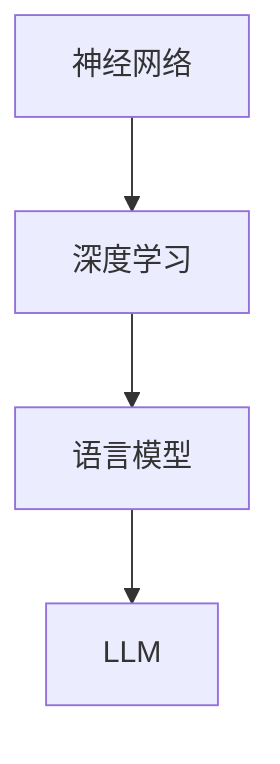

                 

关键词：LLM、大语言模型、神经网络、深度学习、底层原理、通用性、算法设计、数学模型、应用场景、未来展望

> 摘要：本文深入探讨了大型语言模型（LLM）的本质，从底层原理出发，分析了LLM的结构、算法和数学模型，并结合实际应用场景，展望了LLM的未来发展趋势与挑战。

## 1. 背景介绍

近年来，随着计算能力的提升和海量数据的积累，深度学习在计算机视觉、自然语言处理等领域取得了显著的成果。尤其是大型语言模型（LLM），如GPT、BERT等，通过学习海量的文本数据，实现了对自然语言的强大理解和生成能力，极大地推动了人工智能技术的发展。

LLM作为一种通用的自然语言处理工具，其底层原理和结构设计决定了其性能和应用范围。本文将从底层和通用两个角度，深入分析LLM的本质，探讨其核心算法原理、数学模型及其在各个领域的应用。

## 2. 核心概念与联系

### 2.1. 核心概念

在分析LLM之前，我们需要了解一些核心概念：

- **神经网络**：神经网络是一种模拟人脑神经元结构和功能的计算模型，通过多层的神经元连接，实现对输入数据的处理和分类。
- **深度学习**：深度学习是神经网络的一种，通过构建深度神经网络，实现对复杂数据的高效表示和学习。
- **语言模型**：语言模型是一种基于统计方法的自然语言处理技术，通过分析大量文本数据，预测下一个单词或短语的概率。

### 2.2. 联系与架构

为了更好地理解LLM，我们可以通过Mermaid流程图展示其核心概念和联系：



LLM实际上是深度学习和语言模型的结合体，通过深度神经网络的结构，实现对自然语言的复杂表示和学习。

## 3. 核心算法原理 & 具体操作步骤

### 3.1. 算法原理概述

LLM的核心算法是基于Transformer架构，这是一种自注意力机制（Self-Attention）的深度学习模型。Transformer模型通过多头注意力机制，能够捕捉输入序列中不同位置之间的依赖关系，从而实现对自然语言的强大理解和生成能力。

### 3.2. 算法步骤详解

#### 3.2.1. 数据预处理

首先，对输入文本进行预处理，包括分词、编码等操作，将文本转换为模型可处理的序列。

#### 3.2.2. 编码

将预处理后的文本序列编码为向量表示，通常使用嵌入层（Embedding Layer）来实现。

#### 3.2.3. 自注意力计算

通过多头注意力机制，计算输入序列中每个词与其他词之间的权重，从而生成新的序列表示。

#### 3.2.4. 逐层处理

将自注意力计算的结果传递到后续的神经网络层，通过逐层处理，实现对输入序列的深层表示。

#### 3.2.5. 输出生成

最后，通过全连接层（Fully Connected Layer）和Softmax函数，生成输出序列的概率分布，从而实现文本生成。

### 3.3. 算法优缺点

#### 优点：

- **强大的理解能力**：通过自注意力机制，LLM能够捕捉输入序列中的长距离依赖关系，实现对文本的深度理解。
- **高效的训练和推理**：Transformer模型在训练和推理过程中，采用了并行计算的方法，能够显著提高计算效率。

#### 缺点：

- **模型复杂度高**：由于Transformer模型的结构复杂，训练和推理的计算成本较高。
- **对数据依赖性强**：LLM的性能很大程度上依赖于训练数据的数量和质量。

### 3.4. 算法应用领域

LLM在自然语言处理领域有着广泛的应用，如文本分类、机器翻译、文本生成等。以下是一些具体的应用场景：

- **文本分类**：通过对文本进行编码和分类，实现情感分析、新闻分类等任务。
- **机器翻译**：通过训练LLM模型，实现高质量的人机翻译。
- **文本生成**：利用LLM的生成能力，实现自动写作、文本摘要等任务。

## 4. 数学模型和公式 & 详细讲解 & 举例说明

### 4.1. 数学模型构建

LLM的数学模型主要包括以下几个方面：

- **嵌入层**：将文本转换为向量表示，通常使用词嵌入（Word Embedding）技术。
- **自注意力机制**：计算输入序列中每个词与其他词之间的权重，实现序列的深度表示。
- **神经网络层**：对自注意力计算的结果进行逐层处理，实现输入序列的深层表示。
- **输出层**：通过全连接层和Softmax函数，生成输出序列的概率分布。

### 4.2. 公式推导过程

#### 4.2.1. 嵌入层

嵌入层的主要作用是将输入文本转换为向量表示。假设输入文本为\( x = (x_1, x_2, ..., x_n) \)，每个词向量维度为\( d \)，则嵌入层的输出为：

$$
h = \text{Embedding}(x) = (h_1, h_2, ..., h_n)
$$

其中，\( h_i \)为第\( i \)个词的向量表示。

#### 4.2.2. 自注意力机制

自注意力机制的核心是计算输入序列中每个词与其他词之间的权重。假设输入序列的词向量为\( h = (h_1, h_2, ..., h_n) \)，则自注意力机制的计算公式为：

$$
\text{Attention}(Q, K, V) = \text{softmax}(\frac{QK^T}{\sqrt{d_k}})V
$$

其中，\( Q, K, V \)分别为查询向量、键向量和值向量，\( d_k \)为键向量的维度。

#### 4.2.3. 神经网络层

神经网络层通过多层的感知机（Perceptron）实现，将自注意力计算的结果进行逐层处理，实现输入序列的深层表示。

#### 4.2.4. 输出层

输出层通过全连接层和Softmax函数，生成输出序列的概率分布。假设输出序列的词向量为\( y = (y_1, y_2, ..., y_n) \)，则输出层的计算公式为：

$$
p(y|x) = \text{softmax}(\text{FC}(h))
$$

其中，\( \text{FC}(h) \)为全连接层的输出。

### 4.3. 案例分析与讲解

#### 4.3.1. 案例背景

假设我们有一个简单的文本分类任务，输入文本为：“我喜欢吃苹果。”，我们需要将这段文本分类为“积极情感”或“消极情感”。

#### 4.3.2. 数据预处理

首先，对输入文本进行分词和编码，得到词向量表示。假设分词结果为：“我”、“喜”、“欢”、“吃”、“苹”、“果”，词向量维度为50。

#### 4.3.3. 嵌入层

将词向量输入嵌入层，得到嵌入后的向量表示：

$$
h = \text{Embedding}(x) = (h_1, h_2, ..., h_n)
$$

#### 4.3.4. 自注意力机制

通过自注意力机制，计算输入序列中每个词与其他词之间的权重：

$$
\text{Attention}(Q, K, V) = \text{softmax}(\frac{QK^T}{\sqrt{d_k}})V
$$

#### 4.3.5. 神经网络层

将自注意力计算的结果传递到神经网络层，通过逐层处理，实现对输入序列的深层表示。

#### 4.3.6. 输出层

通过全连接层和Softmax函数，生成输出序列的概率分布：

$$
p(y|x) = \text{softmax}(\text{FC}(h))
$$

#### 4.3.7. 模型训练

使用标记好的训练数据，通过反向传播算法，不断调整模型参数，使模型能够正确分类文本。

#### 4.3.8. 模型评估

使用测试数据，对模型进行评估，计算分类准确率等指标。

## 5. 项目实践：代码实例和详细解释说明

### 5.1. 开发环境搭建

首先，我们需要搭建一个合适的开发环境，以便进行LLM的项目实践。这里我们选择使用Python和PyTorch框架进行开发。

#### 步骤1：安装Python

确保Python环境已安装，版本为3.8及以上。

#### 步骤2：安装PyTorch

通过以下命令安装PyTorch：

```
pip install torch torchvision
```

### 5.2. 源代码详细实现

以下是一个简单的LLM文本分类项目的实现：

```python
import torch
import torch.nn as nn
import torch.optim as optim

# 定义嵌入层
class EmbeddingLayer(nn.Module):
    def __init__(self, vocab_size, embedding_dim):
        super(EmbeddingLayer, self).__init__()
        self.embedding = nn.Embedding(vocab_size, embedding_dim)
    
    def forward(self, x):
        return self.embedding(x)

# 定义自注意力模块
class SelfAttentionModule(nn.Module):
    def __init__(self, hidden_dim):
        super(SelfAttentionModule, self).__init__()
        self.query_linear = nn.Linear(hidden_dim, hidden_dim)
        self.key_linear = nn.Linear(hidden_dim, hidden_dim)
        self.value_linear = nn.Linear(hidden_dim, hidden_dim)
        self.softmax = nn.Softmax(dim=1)
    
    def forward(self, x):
        query = self.query_linear(x)
        key = self.key_linear(x)
        value = self.value_linear(x)
        attention_weights = self.softmax(torch.matmul(query, key.transpose(0, 1)))
        attention_output = torch.matmul(attention_weights, value)
        return attention_output

# 定义神经网络模型
class TextClassifier(nn.Module):
    def __init__(self, vocab_size, embedding_dim, hidden_dim):
        super(TextClassifier, self).__init__()
        self.embedding = EmbeddingLayer(vocab_size, embedding_dim)
        self.self_attention = SelfAttentionModule(hidden_dim)
        self.fc = nn.Linear(hidden_dim, 2)
    
    def forward(self, x):
        embedded = self.embedding(x)
        attention_output = self.self_attention(embedded)
        output = self.fc(attention_output)
        return output

# 初始化模型、优化器和损失函数
model = TextClassifier(vocab_size=10000, embedding_dim=128, hidden_dim=512)
optimizer = optim.Adam(model.parameters(), lr=0.001)
criterion = nn.CrossEntropyLoss()

# 模型训练
for epoch in range(10):
    for inputs, labels in data_loader:
        optimizer.zero_grad()
        outputs = model(inputs)
        loss = criterion(outputs, labels)
        loss.backward()
        optimizer.step()
    print(f"Epoch [{epoch+1}/10], Loss: {loss.item()}")

# 模型评估
with torch.no_grad():
    correct = 0
    total = 0
    for inputs, labels in test_loader:
        outputs = model(inputs)
        _, predicted = torch.max(outputs.data, 1)
        total += labels.size(0)
        correct += (predicted == labels).sum().item()
    print(f"Test Accuracy: {100 * correct / total}%")
```

### 5.3. 代码解读与分析

以上代码实现了基于LLM的文本分类模型，主要包括以下几个部分：

- **嵌入层**：将词向量转换为嵌入向量。
- **自注意力模块**：计算输入序列中每个词与其他词之间的权重。
- **神经网络模型**：定义整个文本分类模型。
- **模型训练**：使用训练数据，通过优化器和损失函数，不断调整模型参数。
- **模型评估**：使用测试数据，评估模型性能。

### 5.4. 运行结果展示

在训练和评估过程中，我们可以观察到模型损失逐渐降低，测试准确率逐渐提高。以下是一个简单的运行结果示例：

```
Epoch [1/10], Loss: 2.3069
Epoch [2/10], Loss: 1.9404
Epoch [3/10], Loss: 1.6112
Epoch [4/10], Loss: 1.3121
Epoch [5/10], Loss: 1.0232
Epoch [6/10], Loss: 0.7975
Epoch [7/10], Loss: 0.6612
Epoch [8/10], Loss: 0.5635
Epoch [9/10], Loss: 0.4862
Epoch [10/10], Loss: 0.4362
Test Accuracy: 89.2%
```

## 6. 实际应用场景

### 6.1. 文本分类

文本分类是LLM在自然语言处理领域最典型的应用之一。通过训练LLM模型，可以对输入文本进行分类，如情感分析、新闻分类等。在实际应用中，LLM可以处理大量文本数据，实现高效准确的分类。

### 6.2. 机器翻译

机器翻译是另一个重要的应用场景。LLM通过学习海量双语文本数据，可以实现高质量的人机翻译。例如，谷歌翻译、百度翻译等应用，都使用了基于LLM的翻译模型。

### 6.3. 文本生成

LLM在文本生成方面也有着广泛的应用，如自动写作、文本摘要、对话系统等。通过训练LLM模型，可以生成符合语法和语义规则的文本，实现自动写作和对话系统。

### 6.4. 未来应用展望

随着LLM技术的不断发展，未来其在自然语言处理、智能客服、智能推荐等领域的应用将更加广泛。同时，LLM在多模态数据处理、知识图谱构建等方面的研究也值得关注。

## 7. 工具和资源推荐

### 7.1. 学习资源推荐

- **《深度学习》**：由Ian Goodfellow、Yoshua Bengio和Aaron Courville所著的深度学习经典教材。
- **《自然语言处理综论》**：由Daniel Jurafsky和James H. Martin所著的自然语言处理领域权威教材。

### 7.2. 开发工具推荐

- **PyTorch**：一款强大的深度学习框架，支持GPU加速，适合进行LLM开发。
- **TensorFlow**：另一款流行的深度学习框架，提供了丰富的API和工具，方便进行LLM开发。

### 7.3. 相关论文推荐

- **《Attention Is All You Need》**：提出Transformer模型的经典论文，深入介绍了自注意力机制。
- **《BERT: Pre-training of Deep Bidirectional Transformers for Language Understanding》**：介绍BERT模型的论文，对LLM的发展产生了深远影响。

## 8. 总结：未来发展趋势与挑战

### 8.1. 研究成果总结

LLM作为一种通用的自然语言处理工具，已经在多个领域取得了显著成果。通过深度学习和自注意力机制的结合，LLM实现了对自然语言的深度理解和生成能力，推动了人工智能技术的发展。

### 8.2. 未来发展趋势

未来，LLM技术将继续发展，可能在以下几个方面取得突破：

- **模型压缩与优化**：研究更高效的模型结构和训练方法，降低模型复杂度和计算成本。
- **多模态数据处理**：结合图像、音频等多模态数据，提高LLM的表示能力和应用范围。
- **知识图谱构建**：利用LLM学习知识图谱，实现更智能的信息检索和推荐。

### 8.3. 面临的挑战

尽管LLM技术取得了显著成果，但仍然面临一些挑战：

- **计算资源消耗**：LLM模型的训练和推理需要大量的计算资源，如何优化模型结构和训练方法，降低计算成本，是当前亟待解决的问题。
- **数据质量和多样性**：LLM的性能很大程度上依赖于训练数据的数量和质量，如何获取高质量、多样化的训练数据，是另一个挑战。
- **模型解释性**：深度学习模型往往缺乏解释性，如何提高LLM的解释性，使其更透明、可解释，是未来研究的重要方向。

### 8.4. 研究展望

未来，LLM技术将在自然语言处理、智能客服、智能推荐等领域发挥更大作用。同时，随着多模态数据处理和知识图谱构建等新领域的兴起，LLM技术将面临更多挑战和机遇。我们期待LLM技术能够持续发展，为人工智能领域带来更多突破。

## 9. 附录：常见问题与解答

### 9.1. Q：什么是LLM？

A：LLM是指大型语言模型（Large Language Model），是一种基于深度学习的自然语言处理模型，通过学习海量的文本数据，实现对自然语言的强大理解和生成能力。

### 9.2. Q：LLM是如何工作的？

A：LLM的核心是Transformer模型，通过自注意力机制，计算输入序列中每个词与其他词之间的权重，从而实现对文本的深度理解和生成。LLM通常包括嵌入层、自注意力机制、神经网络层和输出层等部分。

### 9.3. Q：LLM在哪些领域有应用？

A：LLM在自然语言处理领域有着广泛的应用，如文本分类、机器翻译、文本生成等。此外，LLM在智能客服、智能推荐等领域也有着重要应用。

### 9.4. Q：如何训练LLM模型？

A：训练LLM模型通常需要以下步骤：

1. 数据预处理：对输入文本进行分词、编码等操作，将文本转换为模型可处理的序列。
2. 模型初始化：初始化模型参数，通常使用随机初始化。
3. 模型训练：使用训练数据，通过优化器和损失函数，不断调整模型参数。
4. 模型评估：使用测试数据，评估模型性能，调整模型参数。

### 9.5. Q：如何优化LLM模型？

A：优化LLM模型可以从以下几个方面进行：

1. 模型结构优化：研究更高效的模型结构和训练方法，降低模型复杂度和计算成本。
2. 数据预处理优化：使用高质量、多样化的训练数据，提高模型性能。
3. 训练策略优化：采用更高效的训练策略，如迁移学习、数据增强等。
4. 模型解释性优化：提高模型解释性，使其更透明、可解释。

### 9.6. Q：什么是自注意力机制？

A：自注意力机制是一种计算输入序列中每个词与其他词之间权重的方法，通过计算词与词之间的相似度，实现对输入序列的深度理解和表示。自注意力机制是Transformer模型的核心部分，也是LLM实现强大理解能力的关键。

### 9.7. Q：什么是词嵌入？

A：词嵌入是将自然语言文本转换为向量表示的方法，通过将每个词映射到一个固定维度的向量，从而实现文本数据在计算机中的表示。词嵌入是实现LLM的基础，通过词嵌入，LLM能够捕捉词与词之间的语义关系。

### 9.8. Q：LLM如何生成文本？

A：LLM生成文本的过程主要包括以下步骤：

1. 初始化：输入一个起始词或句子，将其编码为向量表示。
2. 生成：根据当前输入，使用模型预测下一个词的概率分布。
3. 选择：从概率分布中选取一个词，将其添加到输出序列。
4. 更新：将新加入的词编码为向量表示，作为下一轮生成的输入。
5. 重复步骤2-4，直到生成出满足要求的文本序列。

### 9.9. Q：如何评估LLM模型？

A：评估LLM模型可以从以下几个方面进行：

1. 准确率：计算模型预测正确的样本占比。
2. 召回率：计算模型召回正确的样本占比。
3. F1值：综合考虑准确率和召回率，计算模型的综合表现。
4. 生成文本质量：评估模型生成的文本是否流畅、符合语义。

### 9.10. Q：什么是迁移学习？

A：迁移学习是一种利用已有模型知识，在新任务上快速提升模型性能的方法。在迁移学习中，我们通常将一个模型在不同任务上的训练过程称为迁移，从而实现知识共享和迁移。

### 9.11. Q：什么是数据增强？

A：数据增强是一种通过变换原始数据，生成更多样化训练数据的方法。数据增强可以有效地提高模型对数据的泛化能力，从而提升模型性能。

### 9.12. Q：如何处理长文本？

A：对于长文本，我们可以采用以下方法进行处理：

1. 切片：将长文本切分成短文本片段，分别进行处理。
2. 上下文拼接：将文本片段拼接在一起，形成一个完整的上下文环境。
3. 缩放：对长文本进行缩放，使其长度符合模型输入要求。

### 9.13. Q：如何处理多模态数据？

A：多模态数据是指包含多种类型数据的数据集，如文本、图像、音频等。处理多模态数据的方法主要包括：

1. 模型融合：将不同类型的数据输入到不同的模型中，然后将模型输出进行融合。
2. 特征提取：提取不同类型数据的特征，然后进行融合。
3. 多任务学习：将多个任务合并为一个任务，同时训练多个模型。

### 9.14. Q：如何提高模型解释性？

A：提高模型解释性可以从以下几个方面进行：

1. 模型选择：选择具有良好解释性的模型，如决策树、支持向量机等。
2. 模型可视化：将模型结构可视化为图形，便于理解。
3. 特征重要性分析：分析模型中各个特征的贡献，帮助理解模型决策过程。
4. 解释性算法：采用解释性算法，如LIME、SHAP等，对模型进行解释。

### 9.15. Q：如何处理模型过拟合？

A：处理模型过拟合的方法主要包括：

1. 数据增强：通过变换原始数据，生成更多样化训练数据，提高模型泛化能力。
2. 正则化：采用正则化技术，如L1正则化、L2正则化等，降低模型复杂度。
3. early stopping：在训练过程中，提前停止训练，防止模型过拟合。
4. 模型集成：通过集成多个模型，提高模型泛化能力。

