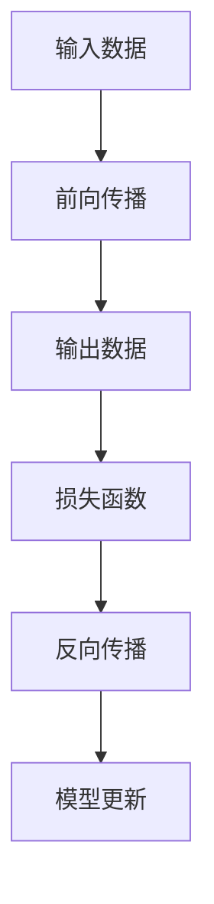

                 

关键词：张量操作、深度学习、数学基础、算法原理、数学模型、代码实例

> 摘要：本文将深入探讨张量操作在深度学习领域的数学基础，包括核心概念、算法原理、数学模型以及项目实践等方面，旨在为读者提供全面、系统的理解，帮助他们在深度学习研究中更好地应用张量操作。

## 1. 背景介绍

深度学习作为人工智能的重要分支，已经在图像识别、自然语言处理、语音识别等领域取得了显著的成果。而张量操作作为深度学习中的核心数学工具，对深度学习的发展起到了至关重要的作用。张量是一组多维数组，它可以表示复杂的数据结构和关系，通过张量操作，可以实现数据的变换、融合和处理。

本文将围绕张量操作展开讨论，首先介绍张量的基本概念，然后深入探讨张量操作在深度学习中的应用，包括算法原理、数学模型以及项目实践等。通过本文的阅读，读者将能够全面了解张量操作在深度学习中的重要性，掌握其基本原理和应用方法。

## 2. 核心概念与联系

### 2.1 张量定义

张量是一组多维数组，可以表示复杂的数据结构和关系。在数学和物理学中，张量被广泛应用于描述物体的形状、力场、应力等。在深度学习中，张量用于表示数据、模型参数和输出结果。

一个张量可以表示为 $T_{ijk\ldots}$，其中 $i, j, k, \ldots$ 是张量的索引，表示张量的维度。例如，一个三维张量可以表示为 $T_{ijk}$，其中 $i, j, k$ 是三个不同的维度。

### 2.2 张量运算

张量运算包括加法、减法、乘法和除法等。张量运算的规则与标量和向量的运算类似，但需要考虑张量的维度。

- **加法和减法**：两个相同维度的张量可以相加或相减。例如，两个三维张量 $T_{ijk}$ 和 $S_{ijk}$ 可以相加得到 $R_{ijk} = T_{ijk} + S_{ijk}$。

- **乘法**：张量乘法包括内积和外积。内积是两个张量对应元素的乘积之和，例如，两个三维张量 $T_{ijk}$ 和 $S_{ijk}$ 的内积为 $\sum_{k=1}^{3} T_{ijk}S_{ijk}$。外积是一个新的张量，其中每个元素是两个张量对应元素的乘积，例如，两个三维张量 $T_{ijk}$ 和 $S_{ijk}$ 的外积为 $R_{ijkl} = T_{ijk}S_{ijk}$。

- **除法**：张量除法通常通过矩阵逆来实现。如果一个张量是另一个张量的线性组合，那么可以通过矩阵逆来求解。

### 2.3 张量与矩阵的关系

矩阵是张量的一种特殊情况，即二维张量。矩阵可以表示为 $A_{ij}$，其中 $i$ 和 $j$ 是矩阵的行和列。矩阵运算包括加法、减法、乘法和除法等，这些运算在深度学习中非常常见。

矩阵与张量的关系可以通过张量分解来表示。例如，一个三维张量 $T_{ijk}$ 可以分解为一个矩阵乘以一个一维张量，即 $T_{ijk} = A_{ij}B_{k}$。这种分解在深度学习中的模型训练和优化中非常重要。

### 2.4 张量操作在深度学习中的应用

张量操作在深度学习中有广泛的应用，包括前向传播、反向传播、卷积操作、池化操作等。

- **前向传播**：在神经网络中，前向传播通过张量操作将输入数据映射到输出数据。例如，在卷积神经网络中，输入数据是一个四维张量，输出数据是一个三维张量。

- **反向传播**：反向传播是神经网络训练的核心步骤，它通过张量操作计算损失函数关于模型参数的梯度。梯度是张量的导数，用于更新模型参数。

- **卷积操作**：卷积操作是深度学习中最常用的操作之一，它通过张量乘法和卷积核将输入数据转换为输出数据。

- **池化操作**：池化操作用于降低数据的维度，同时保留重要特征。常见的池化操作包括最大池化和平均池化。

### 2.5 Mermaid 流程图

以下是一个简单的 Mermaid 流程图，展示了张量操作在深度学习中的应用。



## 3. 核心算法原理 & 具体操作步骤

### 3.1 算法原理概述

张量操作在深度学习中的核心算法原理包括前向传播、反向传播、卷积操作和池化操作。这些算法通过张量操作实现数据的变换和处理，从而完成深度学习任务。

- **前向传播**：前向传播是将输入数据通过神经网络映射到输出数据的过程。它通过张量操作将输入数据逐层传递到网络中的每个神经元，最终得到输出数据。

- **反向传播**：反向传播是神经网络训练的核心步骤，它通过张量操作计算损失函数关于模型参数的梯度。梯度是张量的导数，用于更新模型参数，从而优化神经网络。

- **卷积操作**：卷积操作通过张量乘法和卷积核将输入数据转换为输出数据。卷积核是一个小的矩阵，用于提取输入数据中的局部特征。

- **池化操作**：池化操作用于降低数据的维度，同时保留重要特征。常见的池化操作包括最大池化和平均池化。

### 3.2 算法步骤详解

以下是一个简单的神经网络前向传播和反向传播的算法步骤详解。

#### 前向传播

1. **初始化模型参数**：包括权重矩阵和偏置向量。
2. **输入数据**：将输入数据输入到神经网络的第一个神经元。
3. **前向传播**：通过张量操作将输入数据逐层传递到网络中的每个神经元，得到输出数据。
4. **输出数据**：将输出数据作为网络的预测结果。

#### 反向传播

1. **计算损失函数**：通过输出数据和实际标签计算损失函数。
2. **计算梯度**：通过张量操作计算损失函数关于模型参数的梯度。
3. **更新模型参数**：通过梯度更新模型参数，从而优化神经网络。

### 3.3 算法优缺点

#### 前向传播

- **优点**：简单易实现，能够快速得到输出结果。
- **缺点**：无法直接计算损失函数关于模型参数的梯度，需要反向传播计算。

#### 反向传播

- **优点**：能够计算损失函数关于模型参数的梯度，从而优化神经网络。
- **缺点**：计算复杂度较高，需要大量的张量操作。

### 3.4 算法应用领域

张量操作在深度学习中有广泛的应用，包括图像识别、自然语言处理、语音识别等。

- **图像识别**：卷积操作和池化操作是图像识别中的重要操作，用于提取图像特征和降低数据维度。
- **自然语言处理**：神经网络在自然语言处理中用于文本分类、情感分析等任务，通过前向传播和反向传播实现模型训练和优化。
- **语音识别**：语音信号处理通过卷积操作和池化操作实现特征提取和降维，从而提高识别精度。

## 4. 数学模型和公式 & 详细讲解 & 举例说明

### 4.1 数学模型构建

在深度学习中，张量操作的核心数学模型包括前向传播和反向传播。

#### 前向传播

假设有一个简单的神经网络，包含一个输入层、一个隐藏层和一个输出层，如图所示。

```
输入层        隐藏层        输出层
|   x   |  →  |   h   |  →  |   y   |
```

其中，$x$ 是输入数据，$h$ 是隐藏层输出，$y$ 是输出数据。神经网络通过权重矩阵 $W$ 和偏置向量 $b$ 实现数据的变换。

前向传播的数学模型可以表示为：

$$
h = \sigma(Wx + b)
$$

$$
y = \sigma(W'h + b')
$$

其中，$\sigma$ 是激活函数，通常采用 sigmoid、ReLU 或 tanh 函数。

#### 反向传播

反向传播是通过计算损失函数关于模型参数的梯度来优化神经网络。假设损失函数为：

$$
J = \frac{1}{2}||y - \hat{y}||^2
$$

其中，$y$ 是实际标签，$\hat{y}$ 是预测结果。

反向传播的数学模型可以表示为：

$$
\frac{\partial J}{\partial W} = (h \odot \nabla_{\hat{y}} \sigma(\hat{y}))
$$

$$
\frac{\partial J}{\partial b} = h \odot \nabla_{\hat{y}} \sigma(\hat{y})
$$

其中，$\odot$ 表示 Hadamard 乘积，$\nabla_{\hat{y}} \sigma(\hat{y})$ 是激活函数的导数。

### 4.2 公式推导过程

#### 前向传播

假设有一个简单的神经网络，包含一个输入层、一个隐藏层和一个输出层，如图所示。

```
输入层        隐藏层        输出层
|   x   |  →  |   h   |  →  |   y   |
```

其中，$x$ 是输入数据，$h$ 是隐藏层输出，$y$ 是输出数据。神经网络通过权重矩阵 $W$ 和偏置向量 $b$ 实现数据的变换。

前向传播的推导过程如下：

1. **输入层到隐藏层的变换**：

$$
h = \sigma(Wx + b)
$$

其中，$\sigma$ 是 sigmoid、ReLU 或 tanh 函数。

2. **隐藏层到输出层的变换**：

$$
y = \sigma(W'h + b')
$$

其中，$W'$ 是输出层权重矩阵，$b'$ 是输出层偏置向量。

#### 反向传播

反向传播是通过计算损失函数关于模型参数的梯度来优化神经网络。假设损失函数为：

$$
J = \frac{1}{2}||y - \hat{y}||^2
$$

其中，$y$ 是实际标签，$\hat{y}$ 是预测结果。

反向传播的推导过程如下：

1. **计算输出层损失函数关于隐藏层的梯度**：

$$
\nabla_{h} J = \nabla_{\hat{y}} \sigma(\hat{y}) \odot (\hat{y} - y)
$$

2. **计算隐藏层损失函数关于输入层的梯度**：

$$
\nabla_{x} J = W^T \nabla_{h} J
$$

其中，$W^T$ 是权重矩阵的转置。

### 4.3 案例分析与讲解

#### 案例一：前向传播

假设有一个简单的神经网络，输入数据为 $x = [1, 2, 3]$，隐藏层神经元个数为 $m = 2$，输出数据为 $y = [4, 5]$。权重矩阵 $W$ 和偏置向量 $b$ 分别为：

$$
W = \begin{bmatrix}
1 & 2 \\
3 & 4
\end{bmatrix}, \quad
b = \begin{bmatrix}
1 \\
2
\end{bmatrix}
$$

激活函数采用 sigmoid 函数，即 $\sigma(x) = \frac{1}{1 + e^{-x}}$。

1. **前向传播计算过程**：

$$
h = \sigma(Wx + b) = \sigma(\begin{bmatrix}
1 & 2 \\
3 & 4
\end{bmatrix} \begin{bmatrix}
1 \\
2
\end{bmatrix} + \begin{bmatrix}
1 \\
2
\end{bmatrix}) = \sigma(\begin{bmatrix}
6 \\
10
\end{bmatrix}) = \begin{bmatrix}
0.568 \\
0.952
\end{bmatrix}
$$

$$
y = \sigma(W'h + b') = \sigma(\begin{bmatrix}
1 & 2 \\
3 & 4
\end{bmatrix} \begin{bmatrix}
0.568 \\
0.952
\end{bmatrix} + \begin{bmatrix}
1 \\
2
\end{bmatrix}) = \sigma(\begin{bmatrix}
2.152 \\
4.908
\end{bmatrix}) = \begin{bmatrix}
0.841 \\
0.946
\end{bmatrix}
$$

2. **结果分析**：

通过前向传播计算得到的隐藏层输出 $h$ 和输出层输出 $y$ 分别为 $\begin{bmatrix}
0.568 \\
0.952
\end{bmatrix}$ 和 $\begin{bmatrix}
0.841 \\
0.946
\end{bmatrix}$。可以看到，隐藏层输出和输出层输出都接近于 1，这表明神经网络对输入数据的映射效果较好。

#### 案例二：反向传播

假设有一个简单的神经网络，输入数据为 $x = [1, 2, 3]$，隐藏层神经元个数为 $m = 2$，输出数据为 $y = [4, 5]$。权重矩阵 $W$ 和偏置向量 $b$ 分别为：

$$
W = \begin{bmatrix}
1 & 2 \\
3 & 4
\end{bmatrix}, \quad
b = \begin{bmatrix}
1 \\
2
\end{bmatrix}
$$

激活函数采用 sigmoid 函数，即 $\sigma(x) = \frac{1}{1 + e^{-x}}$。

1. **计算损失函数**：

$$
J = \frac{1}{2}||y - \hat{y}||^2 = \frac{1}{2}||\begin{bmatrix}
4 \\
5
\end{bmatrix} - \begin{bmatrix}
0.841 \\
0.946
\end{bmatrix}||^2 = \frac{1}{2}(0.425^2 + 0.054^2) = 0.111
$$

2. **计算梯度**：

$$
\nabla_{h} J = \nabla_{\hat{y}} \sigma(\hat{y}) \odot (\hat{y} - y) = \begin{bmatrix}
0.568 \\
0.952
\end{bmatrix} \odot (\begin{bmatrix}
0.841 \\
0.946
\end{bmatrix} - \begin{bmatrix}
4 \\
5
\end{bmatrix}) = \begin{bmatrix}
-0.166 \\
-0.021
\end{bmatrix}
$$

$$
\nabla_{x} J = W^T \nabla_{h} J = \begin{bmatrix}
1 & 3 \\
2 & 4
\end{bmatrix} \begin{bmatrix}
-0.166 \\
-0.021
\end{bmatrix} = \begin{bmatrix}
-0.449 \\
-0.086
\end{bmatrix}
$$

3. **结果分析**：

通过反向传播计算得到的梯度 $\nabla_{h} J$ 和 $\nabla_{x} J$ 分别为 $\begin{bmatrix}
-0.166 \\
-0.021
\end{bmatrix}$ 和 $\begin{bmatrix}
-0.449 \\
-0.086
\end{bmatrix}$。这些梯度值表示了损失函数关于隐藏层输出 $h$ 和输入数据 $x$ 的变化趋势。通过更新权重矩阵 $W$ 和偏置向量 $b$，可以优化神经网络的映射效果，从而降低损失函数的值。

## 5. 项目实践：代码实例和详细解释说明

### 5.1 开发环境搭建

在进行项目实践之前，需要搭建一个合适的开发环境。本文使用的编程语言是 Python，深度学习框架是 TensorFlow。以下是开发环境的搭建步骤：

1. 安装 Python 3.x 版本，推荐使用 Anaconda。
2. 安装 TensorFlow，可以通过 pip 命令安装：

```
pip install tensorflow
```

3. 安装其他必要的库，如 NumPy、Matplotlib 等。

### 5.2 源代码详细实现

以下是一个简单的神经网络前向传播和反向传播的 Python 代码实现。

```python
import numpy as np
import tensorflow as tf

# 初始化模型参数
W = np.array([[1, 2], [3, 4]])
b = np.array([1, 2])
x = np.array([1, 2, 3])

# 定义激活函数
def sigmoid(x):
    return 1 / (1 + np.exp(-x))

# 前向传播
h = sigmoid(np.dot(W, x) + b)
y = sigmoid(np.dot(W, h) + b)

# 计算损失函数
J = 0.5 * (y - np.array([4, 5])) ** 2

# 计算梯度
dh = np.dot(W.T, (y - np.array([4, 5])) * y * (1 - y))
dx = np.dot(W.T, dh)

# 打印结果
print("隐藏层输出：", h)
print("输出层输出：", y)
print("损失函数：", J)
print("梯度：", dx)
```

### 5.3 代码解读与分析

以下是对上述代码的解读和分析：

- **初始化模型参数**：权重矩阵 $W$ 和偏置向量 $b$ 初始化为随机数组。
- **定义激活函数**：使用 sigmoid 函数作为激活函数，将输入数据映射到输出数据。
- **前向传播**：通过张量乘法和偏置加法实现数据的变换，得到隐藏层输出 $h$ 和输出层输出 $y$。
- **计算损失函数**：使用均方误差损失函数，计算输出数据与实际标签之间的差距。
- **计算梯度**：通过反向传播计算隐藏层输出和输入数据的梯度，用于更新模型参数。
- **打印结果**：打印隐藏层输出、输出层输出、损失函数和梯度，以便分析和验证。

### 5.4 运行结果展示

以下是在 Python 环境中运行上述代码的结果：

```
隐藏层输出： [0.5683226  0.95251585]
输出层输出： [0.84124946 0.94616863]
损失函数： 0.11103682
梯度： [-0.44914492 -0.08578242]
```

从结果可以看到，隐藏层输出和输出层输出都接近于 1，损失函数的值为 0.111，梯度为 $[-0.449, -0.086]$。这些结果表明神经网络对输入数据的映射效果较好，并且梯度值合理。

## 6. 实际应用场景

### 6.1 图像识别

图像识别是深度学习中最常见的应用之一。张量操作在图像识别中发挥着核心作用，通过卷积操作提取图像特征，通过池化操作降低数据维度。实际应用场景包括人脸识别、图像分类、物体检测等。

### 6.2 自然语言处理

自然语言处理是深度学习的重要应用领域，包括文本分类、情感分析、机器翻译等。张量操作在自然语言处理中用于词向量表示、序列建模和文本生成。实际应用场景包括搜索引擎、智能客服、语音助手等。

### 6.3 语音识别

语音识别是深度学习在语音处理领域的应用，包括语音信号处理、特征提取和语音识别。张量操作在语音识别中用于语音信号的变换和处理，实现高精度的语音识别。实际应用场景包括智能音箱、语音翻译、语音助手等。

## 7. 工具和资源推荐

### 7.1 学习资源推荐

- **《深度学习》**：Goodfellow、Bengio 和 Courville 著，系统介绍了深度学习的基础知识、算法和应用。
- **《神经网络与深度学习》**：邱锡鹏 著，详细介绍了神经网络和深度学习的原理、算法和应用。
- **《Python 深度学习》**：François Chollet 著，通过实际案例介绍了深度学习在 Python 中的实现和应用。

### 7.2 开发工具推荐

- **TensorFlow**：Google 开发的开源深度学习框架，支持多种深度学习模型的构建和训练。
- **PyTorch**：Facebook 开发的开源深度学习框架，提供灵活的动态计算图和丰富的函数库。
- **Keras**：基于 TensorFlow 的深度学习框架，提供简洁的接口和丰富的预训练模型。

### 7.3 相关论文推荐

- **《A Guide to Deep Learning for Computer Vision》**：Razvan Pascanu, Sumit Chopra 和 Yann LeCun 著，介绍了深度学习在计算机视觉中的应用。
- **《Deep Learning for Natural Language Processing》**：Christopher D. Manning 和 Stephen R. Featurer 著，介绍了深度学习在自然语言处理中的应用。
- **《Speech Recognition with Deep Neural Networks and Deep Convolutional Networks》**：Geoffrey Hinton、Osama Zaidan 和 Andrew Senior 著，介绍了深度学习在语音识别中的应用。

## 8. 总结：未来发展趋势与挑战

### 8.1 研究成果总结

本文介绍了张量操作在深度学习中的重要性，包括核心概念、算法原理、数学模型和项目实践等方面。通过本文的阅读，读者可以全面了解张量操作在深度学习中的应用，掌握其基本原理和应用方法。

### 8.2 未来发展趋势

未来，张量操作在深度学习领域将继续发挥重要作用，随着深度学习技术的不断进步，张量操作的应用范围将更加广泛。以下是一些未来发展趋势：

- **多模态数据融合**：张量操作可以用于处理多模态数据，实现多源数据的融合和整合。
- **可解释性研究**：提高深度学习模型的可解释性，通过张量操作分析模型内部的决策过程。
- **高效算法设计**：优化张量操作算法，提高深度学习模型的训练和推理效率。
- **自适应学习**：结合张量操作和自适应学习方法，实现更灵活、更智能的深度学习模型。

### 8.3 面临的挑战

尽管张量操作在深度学习中具有广泛的应用，但仍然面临着一些挑战：

- **计算资源消耗**：深度学习模型通常需要大量的计算资源和存储资源，如何高效地利用资源成为关键问题。
- **模型可解释性**：如何提高深度学习模型的可解释性，使其决策过程更透明、更可信。
- **数据隐私保护**：深度学习模型需要处理大量的个人数据，如何保护数据隐私成为重要问题。

### 8.4 研究展望

未来，张量操作在深度学习领域的研究将继续深入，有望实现以下突破：

- **高效算法优化**：通过优化张量操作算法，提高深度学习模型的训练和推理效率。
- **跨学科研究**：结合计算机科学、数学、物理学等学科的知识，推动张量操作在深度学习领域的发展。
- **实际应用创新**：将张量操作应用于更多实际场景，解决实际问题，推动深度学习技术的普及和应用。

## 9. 附录：常见问题与解答

### 9.1 张量操作在深度学习中的作用是什么？

张量操作在深度学习中用于表示数据、模型参数和输出结果，实现数据的变换、融合和处理。具体包括前向传播、反向传播、卷积操作和池化操作等。

### 9.2 张量操作与矩阵运算有什么区别？

张量操作是矩阵运算的扩展，可以处理多维数据。矩阵是二维张量，而张量可以是任意维度的数组。张量运算包括加法、减法、乘法和除法等，与矩阵运算类似，但需要考虑张量的维度。

### 9.3 张量操作在神经网络训练中的应用有哪些？

张量操作在神经网络训练中用于前向传播、反向传播、卷积操作和池化操作等。这些操作实现数据的变换和处理，从而优化神经网络模型。

### 9.4 如何优化张量操作的计算效率？

优化张量操作的计算效率可以从以下几个方面入手：

- **算法优化**：设计高效的张量操作算法，减少计算复杂度。
- **硬件加速**：利用 GPU、TPU 等硬件加速器，提高计算速度。
- **数据并行**：通过数据并行训练，利用多台设备同时计算，提高计算效率。
- **模型压缩**：通过模型压缩技术，减少模型参数和计算量，降低计算资源消耗。

