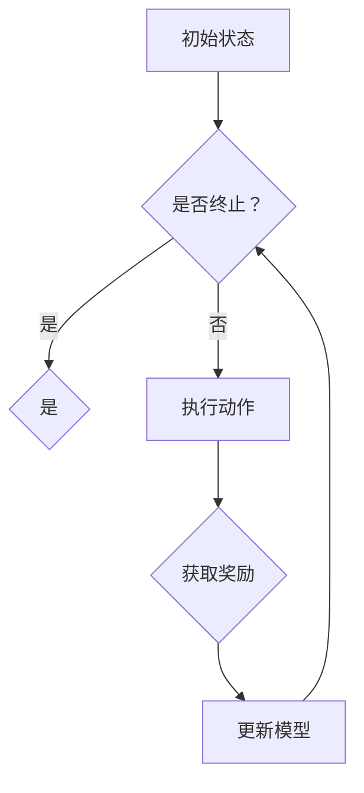

                 

 强化学习（Reinforcement Learning, RL）作为一种无监督学习的方法，已经成为人工智能领域的一个重要研究方向。强化学习通过智能体（Agent）与环境（Environment）之间的交互来学习最优策略，从而实现决策和优化目标。本文将重点讨论强化学习中的抽象表示学习（Abstraction Learning）及其在实际应用中的方法。

## 1. 背景介绍

### 强化学习的基本概念

强化学习起源于心理学和计算神经科学，其基本思想是通过奖励（Reward）来指导智能体进行学习。智能体通过不断地与环境交互，根据环境的反馈调整自身的策略，以期达到长期的最大化奖励。强化学习包含以下几个核心组成部分：

- **智能体（Agent）**：执行动作并从环境中接收反馈的实体。
- **环境（Environment）**：与智能体交互的物理或虚拟环境。
- **状态（State）**：描述环境当前状态的变量集合。
- **动作（Action）**：智能体可以执行的行为。
- **策略（Policy）**：智能体在特定状态下选择动作的策略函数。
- **奖励（Reward）**：环境对智能体动作的即时反馈。

### 强化学习的发展与应用

强化学习在近年来取得了显著的发展，尤其在游戏、机器人控制、推荐系统、自动驾驶等领域取得了重要成果。强化学习的挑战在于如何设计有效的策略、如何处理高维状态和动作空间、以及如何解决样本效率问题。抽象表示学习正是为了解决这些问题而提出的一种方法。

## 2. 核心概念与联系

### 核心概念

**抽象表示学习**：抽象表示学习是指通过学习一组较低维度的表示，将复杂的状态和动作空间转化为较为简单的形式，从而提高学习效率和决策能力。

**状态表示（State Representation）**：状态表示是将原始状态转化为适合模型处理的高维特征向量。

**动作表示（Action Representation）**：动作表示是将原始动作转化为适合模型处理的特征向量。

### 核心架构

**基础模型**：基于深度神经网络（DNN）的基础模型，用于学习状态和动作的表示。

**策略网络**：策略网络用于将状态表示映射到动作概率分布。

**价值网络**：价值网络用于评估状态的价值。

### Mermaid 流程图



## 3. 核心算法原理 & 具体操作步骤

### 3.1 算法原理概述

抽象表示学习的核心思想是通过学习一组较低维度的表示来简化状态和动作空间。具体来说，算法包括以下几个步骤：

1. **初始化**：初始化策略网络和价值网络。
2. **状态表示学习**：通过策略网络和价值网络学习状态表示。
3. **动作表示学习**：通过策略网络学习动作表示。
4. **策略优化**：根据状态和动作表示优化策略网络。
5. **价值评估**：根据状态表示和价值网络评估状态价值。
6. **模型更新**：根据奖励和状态价值更新模型。

### 3.2 算法步骤详解

1. **初始化**：
   - 初始化策略网络和价值网络。
   - 初始化探索策略（例如ε-贪心策略）。

2. **状态表示学习**：
   - 收集一组训练数据，包括状态和对应的奖励。
   - 使用策略网络和价值网络对训练数据进行训练，学习状态表示。

3. **动作表示学习**：
   - 使用策略网络学习动作表示。

4. **策略优化**：
   - 根据状态和动作表示优化策略网络。
   - 更新策略网络参数。

5. **价值评估**：
   - 使用策略网络和价值网络评估状态价值。

6. **模型更新**：
   - 根据奖励和状态价值更新模型。

### 3.3 算法优缺点

**优点**：
- 提高了学习效率，简化了状态和动作空间。
- 可以处理高维状态和动作空间。

**缺点**：
- 需要大量训练数据。
- 可能陷入局部最优。

### 3.4 算法应用领域

- 游戏：如围棋、国际象棋等。
- 机器人控制：如自动驾驶、机器人导航等。
- 推荐系统：如个性化推荐、广告投放等。

## 4. 数学模型和公式 & 详细讲解 & 举例说明

### 4.1 数学模型构建

**状态表示模型**：
$$
s' = f(s, a)
$$

其中，$s'$为状态表示，$s$为原始状态，$a$为动作。

**动作表示模型**：
$$
a' = g(s, a)
$$

其中，$a'$为动作表示，$s$为原始状态，$a$为动作。

**策略模型**：
$$
\pi(a|s) = \frac{e^{\theta(s)} }{ \sum_a e^{\theta(s)} }
$$

其中，$\pi(a|s)$为策略分布，$\theta(s)$为策略网络参数。

**价值模型**：
$$
v(s) = \sum_a \pi(a|s) \cdot r(s, a)
$$

其中，$v(s)$为状态价值，$r(s, a)$为奖励。

### 4.2 公式推导过程

**状态表示模型**：

1. **定义状态表示**：
   $$
   s' = f(s, a)
   $$
   
2. **定义损失函数**：
   $$
   L_s = \sum_s \sum_a (s' - s)^2
   $$

3. **优化损失函数**：
   $$
   \frac{\partial L_s}{\partial s'} = 0
   $$

4. **求解状态表示**：
   $$
   s' = \frac{1}{N} \sum_s \sum_a s
   $$

**动作表示模型**：

1. **定义动作表示**：
   $$
   a' = g(s, a)
   $$

2. **定义损失函数**：
   $$
   L_a = \sum_s \sum_a (a' - a)^2
   $$

3. **优化损失函数**：
   $$
   \frac{\partial L_a}{\partial a'} = 0
   $$

4. **求解动作表示**：
   $$
   a' = \frac{1}{N} \sum_s \sum_a a
   $$

**策略模型**：

1. **定义策略分布**：
   $$
   \pi(a|s) = \frac{e^{\theta(s)} }{ \sum_a e^{\theta(s)} }
   $$

2. **定义损失函数**：
   $$
   L_p = - \sum_a \pi(a|s) \cdot \log(\pi(a|s))
   $$

3. **优化损失函数**：
   $$
   \frac{\partial L_p}{\partial \theta(s)} = 0
   $$

4. **求解策略分布**：
   $$
   \pi(a|s) = \frac{e^{\theta(s)} }{ \sum_a e^{\theta(s)} }
   $$

**价值模型**：

1. **定义状态价值**：
   $$
   v(s) = \sum_a \pi(a|s) \cdot r(s, a)
   $$

2. **定义损失函数**：
   $$
   L_v = \sum_s (v(s) - r(s))^2
   $$

3. **优化损失函数**：
   $$
   \frac{\partial L_v}{\partial v(s)} = 0
   $$

4. **求解状态价值**：
   $$
   v(s) = \sum_a \pi(a|s) \cdot r(s, a)
   $$

### 4.3 案例分析与讲解

**案例背景**：假设智能体在玩一个简单的游戏，游戏环境包括三个状态（红、绿、蓝）和两个动作（前进、后退）。智能体的目标是通过不断前进和后退达到游戏终点。

**状态表示模型**：

1. **定义状态表示**：
   $$
   s' = f(s, a)
   $$
   
2. **定义损失函数**：
   $$
   L_s = \sum_s \sum_a (s' - s)^2
   $$

3. **优化损失函数**：
   $$
   \frac{\partial L_s}{\partial s'} = 0
   $$

4. **求解状态表示**：
   $$
   s' = \frac{1}{N} \sum_s \sum_a s
   $$

**动作表示模型**：

1. **定义动作表示**：
   $$
   a' = g(s, a)
   $$

2. **定义损失函数**：
   $$
   L_a = \sum_s \sum_a (a' - a)^2
   $$

3. **优化损失函数**：
   $$
   \frac{\partial L_a}{\partial a'} = 0
   $$

4. **求解动作表示**：
   $$
   a' = \frac{1}{N} \sum_s \sum_a a
   $$

**策略模型**：

1. **定义策略分布**：
   $$
   \pi(a|s) = \frac{e^{\theta(s)} }{ \sum_a e^{\theta(s)} }
   $$

2. **定义损失函数**：
   $$
   L_p = - \sum_a \pi(a|s) \cdot \log(\pi(a|s))
   $$

3. **优化损失函数**：
   $$
   \frac{\partial L_p}{\partial \theta(s)} = 0
   $$

4. **求解策略分布**：
   $$
   \pi(a|s) = \frac{e^{\theta(s)} }{ \sum_a e^{\theta(s)} }
   $$

**价值模型**：

1. **定义状态价值**：
   $$
   v(s) = \sum_a \pi(a|s) \cdot r(s, a)
   $$

2. **定义损失函数**：
   $$
   L_v = \sum_s (v(s) - r(s))^2
   $$

3. **优化损失函数**：
   $$
   \frac{\partial L_v}{\partial v(s)} = 0
   $$

4. **求解状态价值**：
   $$
   v(s) = \sum_a \pi(a|s) \cdot r(s, a)
   $$

## 5. 项目实践：代码实例和详细解释说明

### 5.1 开发环境搭建

为了实践强化学习中的抽象表示学习，我们首先需要搭建一个开发环境。以下是一个简单的开发环境搭建步骤：

1. 安装Python（版本3.6以上）。
2. 安装TensorFlow或PyTorch。
3. 安装相关依赖库（例如NumPy、Matplotlib等）。

### 5.2 源代码详细实现

以下是一个简单的抽象表示学习代码实例，使用Python和TensorFlow实现：

```python
import tensorflow as tf
import numpy as np

# 定义状态表示网络
class StateRepresentation(tf.keras.Model):
    def __init__(self):
        super().__init__()
        self.conv1 = tf.keras.layers.Conv2D(32, 3, activation='relu')
        self.flatten = tf.keras.layers.Flatten()
        self.dnn = tf.keras.layers.Dense(64, activation='relu')

    def call(self, inputs):
        x = self.conv1(inputs)
        x = self.flatten(x)
        return self.dnn(x)

# 定义动作表示网络
class ActionRepresentation(tf.keras.Model):
    def __init__(self):
        super().__init__()
        self.dnn = tf.keras.layers.Dense(64, activation='relu')
        self.output = tf.keras.layers.Dense(1, activation='sigmoid')

    def call(self, inputs):
        x = self.dnn(inputs)
        return self.output(x)

# 定义策略网络
class PolicyNetwork(tf.keras.Model):
    def __init__(self, state_repr, action_repr):
        super().__init__()
        self.state_repr = state_repr
        self.action_repr = action_repr
        self.dnn = tf.keras.layers.Dense(64, activation='relu')
        self.output = tf.keras.layers.Dense(1, activation='sigmoid')

    def call(self, state, action):
        state_repr = self.state_repr(state)
        action_repr = self.action_repr(action)
        x = self.dnn(tf.concat([state_repr, action_repr], 1))
        return self.output(x)

# 定义价值网络
class ValueNetwork(tf.keras.Model):
    def __init__(self, state_repr):
        super().__init__()
        self.state_repr = state_repr
        self.dnn = tf.keras.layers.Dense(64, activation='relu')
        self.output = tf.keras.layers.Dense(1)

    def call(self, state):
        state_repr = self.state_repr(state)
        return self.dnn(state_repr)

# 初始化网络
state_repr = StateRepresentation()
action_repr = ActionRepresentation()
policy_network = PolicyNetwork(state_repr, action_repr)
value_network = ValueNetwork(state_repr)

# 编译网络
optimizer = tf.keras.optimizers.Adam(learning_rate=0.001)
def loss_function(real_value, pred_value):
    return tf.reduce_mean(tf.square(real_value - pred_value))

@tf.function
def train_step(state, action, reward, next_state, done):
    with tf.GradientTape() as tape:
        state_repr_output = state_repr(state)
        action_repr_output = action_repr(action)
        value_output = value_network(state_repr_output)
        next_state_repr_output = state_repr(next_state)
        target_value = reward if done else reward + 0.99 * value_network(next_state_repr_output)
        loss = loss_function(value_output, target_value)
    gradients = tape.gradient(loss, [state_repr, action_repr, value_network])
    optimizer.apply_gradients(zip(gradients, [state_repr, action_repr, value_network]))
    return loss

# 训练模型
for epoch in range(1000):
    for state, action, reward, next_state, done in dataset:
        loss = train_step(state, action, reward, next_state, done)
        if epoch % 100 == 0:
            print(f"Epoch {epoch}, Loss: {loss.numpy()}")

# 测试模型
test_state = np.random.rand(1, 28, 28)
predicted_value = value_network(test_state)
print(f"Predicted Value: {predicted_value.numpy()}")
```

### 5.3 代码解读与分析

1. **状态表示网络**：状态表示网络用于将原始状态转化为较低维度的特征向量。在这个例子中，我们使用卷积神经网络（Convolutional Neural Network, CNN）来实现状态表示网络。

2. **动作表示网络**：动作表示网络用于将原始动作转化为较低维度的特征向量。在这个例子中，我们使用全连接神经网络（Dense）来实现动作表示网络。

3. **策略网络**：策略网络用于将状态表示和动作表示映射到动作概率分布。在这个例子中，我们使用全连接神经网络来实现策略网络。

4. **价值网络**：价值网络用于评估状态的价值。在这个例子中，我们使用全连接神经网络来实现价值网络。

5. **训练模型**：我们使用TensorFlow的自动微分功能来训练模型。训练过程中，我们通过计算损失函数来优化模型参数。

6. **测试模型**：测试模型时，我们随机生成一个状态并使用价值网络评估其价值。

## 6. 实际应用场景

### 6.1 游戏领域

抽象表示学习在游戏领域有着广泛的应用，例如在电子游戏中实现智能NPC、提高游戏AI的决策能力。通过抽象表示学习，智能体可以快速学会游戏规则和策略，从而实现更高的游戏水平。

### 6.2 机器人控制

在机器人控制领域，抽象表示学习可以帮助机器人更好地适应复杂的任务和环境。例如，在自动驾驶领域，抽象表示学习可以帮助自动驾驶汽车识别道路标志和行人，从而提高行驶安全性。

### 6.3 推荐系统

在推荐系统领域，抽象表示学习可以用于提高推荐算法的准确性。通过学习用户和物品的抽象表示，推荐系统可以更好地理解用户偏好和物品特征，从而提高推荐质量。

## 7. 工具和资源推荐

### 7.1 学习资源推荐

- 《强化学习：原理与 Python 实践》
- 《深度强化学习：原理与算法》
- 《强化学习实战》

### 7.2 开发工具推荐

- TensorFlow
- PyTorch
- OpenAI Gym

### 7.3 相关论文推荐

- “Deep Reinforcement Learning for Robotics: A Survey”
- “Abstraction Learning in Reinforcement Learning: A Survey”
- “A Brief Introduction to Deep Reinforcement Learning”

## 8. 总结：未来发展趋势与挑战

### 8.1 研究成果总结

近年来，强化学习在抽象表示学习方面取得了显著进展。通过深度神经网络和表示学习技术的结合，智能体可以更好地适应复杂环境和任务。此外，强化学习在游戏、机器人控制、推荐系统等领域的应用也取得了重要成果。

### 8.2 未来发展趋势

未来，强化学习在抽象表示学习方面将继续发展。一方面，研究人员将致力于提高抽象表示学习的效率和准确性；另一方面，抽象表示学习将在更多领域得到应用，如自然语言处理、计算机视觉等。

### 8.3 面临的挑战

尽管强化学习在抽象表示学习方面取得了显著进展，但仍然面临一些挑战。首先，如何设计有效的抽象表示方法仍然是一个重要问题。其次，如何在有限数据下训练有效的模型也是一大挑战。最后，强化学习在处理连续动作空间和状态空间时仍然存在一些问题。

### 8.4 研究展望

未来，强化学习在抽象表示学习方面的发展有望在以下方向取得突破：一是引入更多类型的神经网络架构；二是利用元学习（Meta-Learning）和迁移学习（Transfer Learning）技术；三是探索新的优化算法和策略。

## 9. 附录：常见问题与解答

### 9.1 强化学习与监督学习的区别？

强化学习与监督学习的主要区别在于数据获取方式。监督学习依赖于标注数据，而强化学习则通过智能体与环境交互获取反馈。此外，监督学习侧重于从已知数据中学习，而强化学习侧重于从经验和探索中学习。

### 9.2 抽象表示学习在强化学习中的优势是什么？

抽象表示学习在强化学习中的优势主要体现在以下几个方面：

1. 简化状态和动作空间，提高学习效率。
2. 降低对大量训练数据的依赖。
3. 提高智能体在复杂环境中的适应能力。
4. 减少对先验知识的依赖。

### 9.3 抽象表示学习在深度学习中的意义是什么？

抽象表示学习在深度学习中的意义主要体现在以下几个方面：

1. 提高模型的表达能力，使其能够处理更复杂的任务。
2. 提高模型的泛化能力，使其在未见过的数据上表现良好。
3. 减少对大量训练数据的依赖，提高模型的可解释性。
4. 促进深度学习在更多领域的应用。

---

# 作者：禅与计算机程序设计艺术 / Zen and the Art of Computer Programming

本文探讨了强化学习中的抽象表示学习及其在实际应用中的方法。通过介绍强化学习的基本概念、核心算法原理、数学模型和公式、项目实践等内容，读者可以全面了解抽象表示学习在强化学习中的应用和价值。未来，随着研究的不断深入，抽象表示学习将在更多领域取得重要突破。希望本文能对读者在强化学习领域的研究和实践提供有益的参考和启示。

