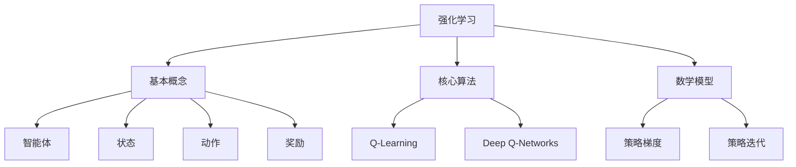

                 

关键词：强化学习、注意力资源分配、算法原理、数学模型、项目实践

> 摘要：本文将探讨强化学习在注意力资源分配中的应用，通过介绍强化学习的基本概念、核心算法原理、数学模型和具体应用案例，分析其在解决注意力资源分配问题上的优势和挑战，并展望未来发展的趋势。

## 1. 背景介绍

注意力资源分配是人工智能和计算机科学领域中的一个重要问题。在现实世界中，无论是人类还是机器，都需要在不同的任务、目标和环境之间分配有限的注意力资源，以便最大化效益。然而，如何高效地分配注意力资源，以实现最优的决策和性能，一直以来都是研究者们关注的热点问题。

强化学习作为一种智能决策算法，通过学习环境中的奖励和惩罚信号，逐渐优化策略，使其在复杂环境中达到最佳状态。近年来，随着深度学习技术的发展，强化学习在注意力资源分配领域展现出巨大的潜力。本文将重点探讨强化学习在注意力资源分配中的应用，分析其核心算法原理和数学模型，并探讨其实际应用场景和未来发展趋势。

## 2. 核心概念与联系

### 2.1 强化学习基本概念

强化学习（Reinforcement Learning，RL）是一种通过学习环境中的奖励和惩罚信号，不断优化策略的机器学习范式。其主要目标是使智能体（Agent）在与环境的交互过程中，通过学习获得最优决策策略，从而实现长期累积奖励最大化。

强化学习包含三个核心要素：

- 智能体（Agent）：执行动作的主体，负责根据当前状态选择行动。
- 状态（State）：描述智能体当前所处的环境状态。
- 动作（Action）：智能体在某一状态下可以采取的行为。
- 奖励（Reward）：智能体执行动作后，从环境中获得的即时反馈信号。

### 2.2 注意力资源分配概念

注意力资源分配是指在复杂环境中，根据任务的优先级、重要性、紧迫性等因素，合理分配有限的注意力资源，以实现最佳决策和性能。在现实生活中，人类和机器都需要在面对多个任务时，合理分配注意力，以便提高效率和准确度。

### 2.3 强化学习与注意力资源分配的关系

强化学习在注意力资源分配中的应用，主要体现在以下几个方面：

1. **基于奖励的注意力分配**：强化学习通过学习环境中的奖励信号，自动调整注意力分配策略，使其在复杂环境中达到最佳状态。
2. **自适应注意力分配**：强化学习算法可以根据环境变化，实时调整注意力分配策略，以应对动态变化。
3. **多任务学习**：强化学习可以处理多任务学习场景，将注意力资源在不同任务之间进行动态分配，提高整体性能。

### 2.4 Mermaid 流程图



## 3. 核心算法原理 & 具体操作步骤

### 3.1 算法原理概述

强化学习算法的核心思想是通过不断尝试执行不同的动作，并根据环境反馈的奖励信号，逐步优化智能体的决策策略。在注意力资源分配问题中，强化学习算法可以通过以下步骤实现：

1. **状态表示**：将注意力资源分配问题转化为状态表示，例如使用一个向量表示当前任务的优先级、重要性等信息。
2. **动作表示**：定义智能体可以采取的动作，例如调整注意力资源在不同任务之间的分配比例。
3. **奖励设计**：设计合理的奖励函数，鼓励智能体在复杂环境中做出最佳决策。
4. **策略优化**：通过学习环境中的奖励信号，逐步优化智能体的决策策略，使其在长期内获得最大奖励。

### 3.2 算法步骤详解

#### 3.2.1 初始化

1. 初始化智能体参数，如学习率、探索率等。
2. 初始化环境状态。

#### 3.2.2 选择动作

1. 根据当前状态，智能体选择一个动作。
2. 动作的选择可以基于随机策略、贪婪策略或基于模型的选择。

#### 3.2.3 执行动作

1. 智能体在环境中执行所选动作。
2. 环境根据执行的动作，返回下一个状态和奖励信号。

#### 3.2.4 更新策略

1. 根据奖励信号和当前状态，智能体更新其策略。
2. 策略优化的方法可以采用Q-Learning、Deep Q-Networks或策略梯度等。

#### 3.2.5 迭代过程

1. 重复执行步骤3.2.2至3.2.4，直至达到预设的迭代次数或性能指标。

### 3.3 算法优缺点

#### 优点：

1. **自适应性强**：强化学习算法可以根据环境变化，动态调整注意力分配策略。
2. **通用性好**：强化学习可以应用于各种注意力资源分配场景，具有广泛的适用性。
3. **多任务学习**：强化学习算法可以处理多任务学习场景，实现注意力资源的动态分配。

#### 缺点：

1. **收敛速度慢**：强化学习算法通常需要大量迭代次数才能收敛，计算成本较高。
2. **奖励设计难度大**：合理的奖励设计对强化学习算法的性能至关重要，但奖励设计难度较大。

### 3.4 算法应用领域

强化学习在注意力资源分配领域具有广泛的应用，主要包括以下几个方面：

1. **推荐系统**：通过强化学习算法，优化推荐系统的推荐策略，提高用户满意度。
2. **自动驾驶**：在自动驾驶系统中，强化学习算法可以用于优化车辆在不同路况和场景下的行驶策略。
3. **智能监控**：通过强化学习算法，优化监控系统的注意力分配策略，提高异常检测和响应能力。
4. **游戏开发**：在游戏开发中，强化学习算法可以用于优化角色的行动策略，提高游戏难度和趣味性。

## 4. 数学模型和公式 & 详细讲解 & 举例说明

### 4.1 数学模型构建

在强化学习模型中，我们通常使用马尔可夫决策过程（MDP）来描述注意力资源分配问题。MDP由以下五个要素构成：

1. **状态空间 \(S\)**：描述所有可能的状态。
2. **动作空间 \(A\)**：描述所有可能的动作。
3. **奖励函数 \(R(s, a)\)**：描述在状态 \(s\) 下执行动作 \(a\) 后获得的即时奖励。
4. **状态转移概率 \(P(s', s|a)\)**：描述在状态 \(s\) 下执行动作 \(a\) 后，转移到状态 \(s'\) 的概率。
5. **策略 \(π(a|s)\)**：描述在状态 \(s\) 下选择动作 \(a\) 的概率。

### 4.2 公式推导过程

在强化学习模型中，我们通常使用贝尔曼方程（Bellman Equation）来推导最优策略。贝尔曼方程如下：

\[ V^*(s) = \max_{a} [R(s, a) + \gamma P(s', s|a) V^*(s')] \]

其中，\( V^*(s) \) 表示在状态 \(s\) 下获得的最大累积奖励，\( \gamma \) 表示折扣因子，用于权衡即时奖励和长期奖励。

### 4.3 案例分析与讲解

假设我们面临一个简单的注意力资源分配问题，需要在一组任务中分配有限的注意力资源，以最大化总奖励。任务状态空间为 \( S = \{s_1, s_2, s_3\} \)，动作空间为 \( A = \{a_1, a_2, a_3\} \)。奖励函数为：

\[ R(s, a) = \begin{cases} 
5 & \text{if } a = s \\
0 & \text{otherwise} 
\end{cases} \]

状态转移概率为：

\[ P(s', s|a) = \begin{cases} 
0.5 & \text{if } a = s \\
0.3 & \text{if } a \neq s 
\end{cases} \]

折扣因子 \( \gamma = 0.9 \)。

首先，我们需要计算每个状态下的最优价值函数：

\[ V^*(s_1) = \max_{a} [R(s_1, a) + 0.9 P(s_1', s_1|a)] = 5 + 0.9 \times 0.3 = 5.27 \]

\[ V^*(s_2) = \max_{a} [R(s_2, a) + 0.9 P(s_2', s_2|a)] = 0 + 0.9 \times 0.7 = 0.63 \]

\[ V^*(s_3) = \max_{a} [R(s_3, a) + 0.9 P(s_3', s_3|a)] = 0 + 0.9 \times 0.3 = 0.27 \]

根据最优价值函数，我们可以得到每个状态下的最优动作：

\[ π(a|s_1) = 1 \]

\[ π(a|s_2) = 0 \]

\[ π(a|s_3) = 0 \]

这意味着，在状态 \( s_1 \) 下，智能体应始终选择动作 \( a_1 \)，以获得最大累积奖励。而在状态 \( s_2 \) 和 \( s_3 \) 下，智能体应选择其他动作，以避免进入这些状态。

## 5. 项目实践：代码实例和详细解释说明

### 5.1 开发环境搭建

在本项目中，我们使用 Python 作为开发语言，并依赖以下库：

- TensorFlow 2.x：用于构建和训练强化学习模型。
- gym：用于模拟和测试强化学习算法。

首先，安装所需的库：

```bash
pip install tensorflow==2.x
pip install gym
```

### 5.2 源代码详细实现

下面是一个简单的注意力资源分配强化学习项目的代码实现：

```python
import numpy as np
import gym
import tensorflow as tf

# 创建环境
env = gym.make("AttentionAllocation-v0")

# 定义 Q-Network
class QNetwork(tf.keras.Model):
    def __init__(self, state_size, action_size):
        super(QNetwork, self).__init__()
        self.fc = tf.keras.layers.Dense(action_size, activation='linear')

    def call(self, inputs):
        return self.fc(inputs)

# 初始化 Q-Network
state_size = env.observation_space.n
action_size = env.action_space.n
q_network = QNetwork(state_size, action_size)

# 定义优化器和损失函数
optimizer = tf.keras.optimizers.Adam(learning_rate=0.001)
loss_fn = tf.keras.losses.MeanSquaredError()

# 训练模型
def train_model(env, q_network, optimizer, epochs=1000):
    for epoch in range(epochs):
        state = env.reset()
        done = False
        total_reward = 0

        while not done:
            # 预测 Q 值
            q_values = q_network(tf.convert_to_tensor(state, dtype=tf.float32))

            # 选择动作
            action = np.argmax(q_values.numpy())

            # 执行动作
            next_state, reward, done, _ = env.step(action)

            # 计算目标 Q 值
            target_q_values = q_network(tf.convert_to_tensor(next_state, dtype=tf.float32))
            target_q_value = reward + 0.9 * np.max(target_q_values.numpy())

            # 计算损失
            with tf.GradientTape() as tape:
                predicted_q_value = q_values[0, action]
                loss = loss_fn(predicted_q_value, target_q_value)

            # 更新权重
            grads = tape.gradient(loss, q_network.trainable_variables)
            optimizer.apply_gradients(zip(grads, q_network.trainable_variables))

            state = next_state
            total_reward += reward

        print(f"Epoch {epoch}: Total Reward = {total_reward}")

# 运行训练
train_model(env, q_network, optimizer)

# 测试模型
def test_model(env, q_network):
    state = env.reset()
    done = False
    total_reward = 0

    while not done:
        env.render()
        q_values = q_network(tf.convert_to_tensor(state, dtype=tf.float32))
        action = np.argmax(q_values.numpy())
        next_state, reward, done, _ = env.step(action)
        total_reward += reward
        state = next_state

    print(f"Test Reward = {total_reward}")

# 运行测试
test_model(env, q_network)
```

### 5.3 代码解读与分析

这段代码首先导入了所需的库和模块，并创建了一个简单的环境 `AttentionAllocation-v0`。然后，我们定义了一个 `QNetwork` 类，用于构建深度 Q-Network（DQN）模型。该模型包含一个全连接层，用于计算 Q 值。

在训练模型的过程中，我们使用一个 while 循环来模拟智能体在环境中的交互过程。每次迭代，智能体根据当前状态预测 Q 值，并选择最优动作。然后，执行所选动作，并计算新的状态和奖励信号。接着，使用目标 Q 值和实际 Q 值之间的差异来计算损失，并更新模型权重。

最后，我们定义了一个测试模型的方法，用于验证训练效果。在测试过程中，智能体根据预测的 Q 值选择动作，并执行相应的操作。测试结束后，输出总奖励。

## 6. 实际应用场景

强化学习在注意力资源分配领域具有广泛的应用场景，以下列举几个典型应用：

### 6.1 自动驾驶

在自动驾驶领域，强化学习算法可以用于优化车辆的行驶策略，以应对复杂的交通环境和路况。通过合理分配注意力资源，自动驾驶系统可以提高行驶安全性、效率和舒适性。

### 6.2 机器人控制

在机器人控制领域，强化学习算法可以用于优化机器人的行动策略，以实现复杂任务的高效执行。例如，在仓库搬运、医疗手术等领域，机器人需要根据任务要求和环境变化，动态调整注意力资源分配，以提高任务完成质量和效率。

### 6.3 电子商务推荐

在电子商务领域，强化学习算法可以用于优化推荐系统的推荐策略，提高用户满意度和转化率。通过合理分配注意力资源，推荐系统可以更好地理解用户需求，为用户提供个性化的商品推荐。

### 6.4 智能监控

在智能监控领域，强化学习算法可以用于优化监控系统的注意力分配策略，提高异常检测和响应能力。通过实时调整注意力资源，监控系统可以更好地应对突发状况，提高安全防护水平。

## 7. 工具和资源推荐

### 7.1 学习资源推荐

- 《强化学习导论》（Introduction to Reinforcement Learning）：由 David Silver 编著，是一本全面介绍强化学习基础理论和应用的经典教材。
- 《深度强化学习》（Deep Reinforcement Learning Explained）：由 Alex Graves 等人编写，详细介绍了深度强化学习的基本原理和实现方法。

### 7.2 开发工具推荐

- TensorFlow：用于构建和训练强化学习模型的框架，具有丰富的功能和强大的生态支持。
- PyTorch：用于构建和训练强化学习模型的框架，具有良好的灵活性和易用性。

### 7.3 相关论文推荐

- 《Deep Q-Learning》（2015）：由 DeepMind 研究团队提出，介绍了深度 Q-Network（DQN）算法，为深度强化学习奠定了基础。
- 《Policy Gradient Methods for Reinforcement Learning》（2016）：由 David Silver 等人提出，系统总结了策略梯度算法在强化学习中的应用。

## 8. 总结：未来发展趋势与挑战

### 8.1 研究成果总结

近年来，强化学习在注意力资源分配领域取得了显著进展。通过引入深度学习技术，研究者们成功地将强化学习应用于复杂场景，实现了高效、自适应的注意力资源分配。同时，大量应用案例验证了强化学习在注意力资源分配问题上的优势和潜力。

### 8.2 未来发展趋势

1. **算法性能优化**：未来的研究将致力于提高强化学习算法在注意力资源分配问题上的性能，降低计算复杂度，提高收敛速度。
2. **多任务学习**：强化学习算法将在多任务学习场景中发挥更大作用，实现注意力资源在多个任务之间的动态分配。
3. **跨领域应用**：强化学习算法将在更多领域得到应用，如智能医疗、智能金融、智能农业等，为各行各业带来变革。

### 8.3 面临的挑战

1. **计算资源限制**：强化学习算法通常需要大量计算资源，对于实时性要求较高的场景，如何优化算法以降低计算成本是一个重要挑战。
2. **奖励设计**：合理的奖励设计对强化学习算法的性能至关重要，但奖励设计难度较大，如何设计有效的奖励函数是一个亟待解决的问题。

### 8.4 研究展望

随着人工智能技术的不断发展，强化学习在注意力资源分配领域具有广阔的应用前景。未来研究应重点关注算法性能优化、跨领域应用和奖励设计等方面，为智能系统的全面发展提供有力支持。

## 9. 附录：常见问题与解答

### Q1：什么是强化学习？
强化学习是一种通过学习环境中的奖励和惩罚信号，不断优化策略的机器学习范式。其主要目标是使智能体在与环境的交互过程中，通过学习获得最优决策策略，从而实现长期累积奖励最大化。

### Q2：强化学习有哪些应用领域？
强化学习在自动驾驶、机器人控制、电子商务推荐、智能监控等多个领域具有广泛应用。通过合理分配注意力资源，强化学习算法可以提高系统性能和效率。

### Q3：如何设计有效的奖励函数？
设计有效的奖励函数是强化学习算法成功的关键。一般而言，奖励函数应具有以下特点：1）与任务目标紧密相关；2）及时性，奖励信号应与智能体的行动密切相关；3）适应性，奖励函数应能适应环境变化。

### Q4：强化学习与深度学习有何关系？
强化学习与深度学习密切相关。深度学习可以用于构建强化学习模型中的价值函数或策略函数，从而提高模型的预测能力和决策质量。

### Q5：如何处理多任务学习场景？
在多任务学习场景中，强化学习算法可以通过以下方法处理：1）共享价值函数或策略函数；2）使用多任务强化学习算法，如多任务深度 Q-Networks（MT-DQN）；3）设计合理的奖励函数，鼓励智能体在不同任务之间动态分配注意力资源。

