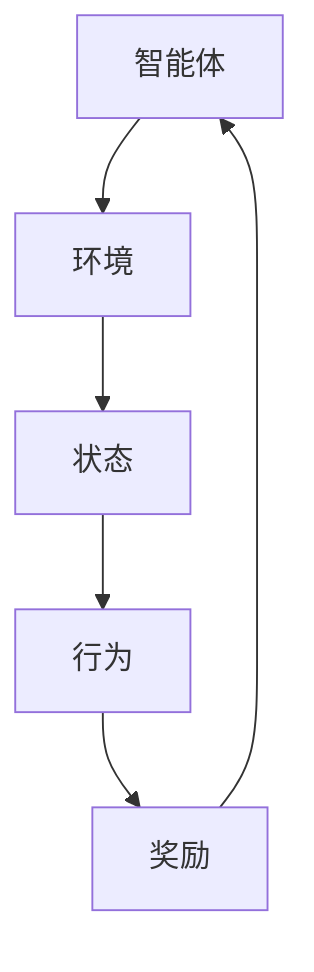

                 

关键词：强化学习、奖励、策略、马尔可夫决策过程、深度强化学习

> 摘要：本文深入探讨了强化学习中的核心概念——奖励和策略。首先介绍了强化学习的背景和基本原理，然后详细阐述了奖励函数和策略的概念，以及它们在强化学习中的作用。接着，文章通过数学模型和公式的推导，深入分析了强化学习算法的基本原理和具体操作步骤。最后，本文通过项目实践，展示了如何使用强化学习解决实际问题，并探讨了未来应用前景和面临的挑战。

## 1. 背景介绍

强化学习（Reinforcement Learning，RL）是机器学习领域的一个重要分支，旨在使机器通过与环境交互，从经验中学习到最优行为策略。它起源于心理学和动物行为学的研究，目的是研究动物如何通过试错学习行为策略。随着人工智能技术的不断发展，强化学习在计算机科学领域得到了广泛的应用。

### 1.1 强化学习的历史与发展

强化学习的研究始于20世纪50年代，最早的研究者是行为主义心理学家B.F. Skinner。他提出了一个关于动物行为的学习模型，即通过奖励和惩罚来引导动物学习行为。这个模型启发了后来计算机科学家对强化学习的研究。

1980年代，理查德·萨顿（Richard Sutton）和安德鲁·巴特斯（Andrew Barto）在他们的经典著作《强化学习：一种解释》（Reinforcement Learning: An Introduction）中，系统性地阐述了强化学习的理论基础，标志着强化学习作为一个独立的研究领域正式诞生。

### 1.2 强化学习的应用场景

强化学习在多种应用场景中展现出了强大的能力。例如，在游戏领域，强化学习被用于开发智能游戏对手，如AlphaGo和DeepStack；在机器人领域，强化学习被用于机器人路径规划和导航；在推荐系统领域，强化学习被用于个性化推荐；在自动驾驶领域，强化学习被用于驾驶策略的优化。

## 2. 核心概念与联系

强化学习中的核心概念包括奖励（Reward）、策略（Policy）和状态（State）。这些概念之间有着紧密的联系，共同构成了强化学习的理论基础。

### 2.1 奖励（Reward）

奖励是强化学习中最重要的概念之一。它用于衡量当前状态下的行为带来的价值。奖励可以是正面的，如获得食物或水，也可以是负面的，如受到伤害。奖励函数通常由环境定义，用于指导智能体（Agent）学习最优行为策略。

### 2.2 策略（Policy）

策略是智能体在特定状态下采取的行为。策略的定义可以是一个函数，将状态映射到行为。策略的目标是最大化长期奖励。根据策略的确定性程度，可以分为确定性策略和随机性策略。

### 2.3 状态（State）

状态是智能体在环境中的位置或状态的描述。状态可以是一个离散的集合，也可以是一个连续的区间。状态是强化学习中的另一个核心概念，它决定了智能体的行为。

### 2.4 Mermaid 流程图

下面是一个用于描述强化学习核心概念的Mermaid流程图：



在这个流程图中，智能体（Agent）与环境（Environment）交互，通过状态（State）和奖励（Reward）不断调整其行为（Behavior），从而学习到最优策略（Policy）。

## 3. 核心算法原理 & 具体操作步骤

### 3.1 算法原理概述

强化学习算法的核心目标是学习一个策略，使得智能体能够在给定环境中获得最大的长期奖励。这个目标可以通过值函数（Value Function）和策略迭代（Policy Iteration）两种方法实现。

值函数方法：值函数表示智能体在某个状态下采取某个行为所能获得的长期奖励。值函数的优化目标是最大化期望奖励。

策略迭代方法：策略迭代方法通过迭代更新策略，使得智能体能够逐渐收敛到最优策略。策略迭代方法包括策略评估（Policy Evaluation）和策略改进（Policy Improvement）两个步骤。

### 3.2 算法步骤详解

强化学习算法的具体步骤如下：

1. 初始化策略：随机初始化一个策略。
2. 策略评估：使用当前策略评估状态值函数。
3. 策略改进：根据评估结果，更新策略，使得智能体在新的状态下采取的行为能够获得更大的奖励。
4. 迭代更新：重复策略评估和策略改进，直到策略收敛。

### 3.3 算法优缺点

强化学习算法的优点：

- 强泛化能力：强化学习算法能够通过学习一个通用策略，适应不同的环境。
- 自适应性：强化学习算法能够根据环境的变化，动态调整策略。

强化学习算法的缺点：

- 训练时间长：强化学习算法需要大量的交互来学习最优策略，训练时间较长。
- 对环境依赖性强：强化学习算法的性能高度依赖于环境的设定。

### 3.4 算法应用领域

强化学习算法在多个领域都有广泛的应用：

- 游戏AI：强化学习算法被用于开发智能游戏对手，如AlphaGo和DeepStack。
- 自动驾驶：强化学习算法被用于自动驾驶车辆的路径规划和决策。
- 推荐系统：强化学习算法被用于个性化推荐系统的行为策略优化。
- 机器人控制：强化学习算法被用于机器人的运动规划和控制。

## 4. 数学模型和公式 & 详细讲解 & 举例说明

### 4.1 数学模型构建

强化学习中的数学模型主要包括值函数（Value Function）和策略（Policy）。值函数表示智能体在某个状态下采取某个行为所能获得的长期奖励。策略表示智能体在特定状态下采取的行为。

### 4.2 公式推导过程

假设智能体在状态s下采取行为a，获得的即时奖励为r(s, a)，则智能体在状态s下采取行为a的长期奖励可以用以下公式表示：

$$V(s) = \sum_{a} \pi(a|s) \sum_{s'} p(s'|s, a) r(s', a) + \gamma V(s')$$

其中，$\pi(a|s)$表示智能体在状态s下采取行为a的概率，$p(s'|s, a)$表示智能体在状态s下采取行为a后转移到状态s'的概率，$\gamma$表示折扣因子，用于平衡即时奖励和长期奖励。

### 4.3 案例分析与讲解

假设一个简单的迷宫问题，智能体需要从起点移动到终点，每个状态都有两个行为：向左移动和向右移动。我们定义奖励函数为：从起点到终点每移动一步获得1分，否则获得-1分。设折扣因子$\gamma = 0.9$。

根据上面的公式，我们可以计算每个状态的价值函数：

$$V(s) = \sum_{a} \pi(a|s) \sum_{s'} p(s'|s, a) r(s', a) + \gamma V(s')$$

对于状态s1（起点），有：

$$V(s1) = \pi(a1|s1) \sum_{s'} p(s'|s1, a1) r(s', a1) + \gamma V(s')$$

由于起点只有一个行为a1（向右移动），所以：

$$V(s1) = \pi(a1|s1) \sum_{s'} p(s'|s1, a1) r(s', a1) + \gamma V(s')$$

$$V(s1) = 1 \times (1 \times (-1) + 0 \times 1) + 0.9 \times V(s2)$$

$$V(s1) = -1 + 0.9 \times V(s2)$$

对于状态s2（中间点），有：

$$V(s2) = \pi(a1|s2) \sum_{s'} p(s'|s2, a1) r(s', a1) + \pi(a2|s2) \sum_{s'} p(s'|s2, a2) r(s', a2) + \gamma V(s')$$

由于s2有两个行为a1（向左移动）和a2（向右移动），所以：

$$V(s2) = 0.5 \times (0.5 \times (-1) + 0.5 \times 1) + 0.5 \times (0.5 \times (-1) + 0.5 \times 1) + 0.9 \times V(s3)$$

$$V(s2) = -0.25 + 0.25 + 0.9 \times V(s3)$$

$$V(s2) = 0 + 0.9 \times V(s3)$$

以此类推，我们可以计算出每个状态的价值函数。最终，我们可以得到一个价值函数表，用于指导智能体在特定状态下采取最优行为。

## 5. 项目实践：代码实例和详细解释说明

### 5.1 开发环境搭建

为了实践强化学习算法，我们需要搭建一个开发环境。本文使用Python作为编程语言，安装以下依赖：

- Python 3.8+
- TensorFlow 2.4+
- gym 0.14.0+

你可以使用pip命令安装这些依赖：

```bash
pip install python==3.8 tensorflow==2.4 gym==0.14.0
```

### 5.2 源代码详细实现

下面是一个简单的强化学习算法实现的示例代码：

```python
import gym
import numpy as np
import tensorflow as tf

# 创建环境
env = gym.make('CartPole-v0')

# 初始化策略网络
policy_network = tf.keras.Sequential([
    tf.keras.layers.Dense(64, activation='relu', input_shape=(4,)),
    tf.keras.layers.Dense(64, activation='relu'),
    tf.keras.layers.Dense(1, activation='sigmoid')
])

# 编译策略网络
policy_network.compile(optimizer='adam', loss='binary_crossentropy')

# 训练策略网络
num_episodes = 1000
for episode in range(num_episodes):
    state = env.reset()
    done = False
    total_reward = 0
    while not done:
        action = policy_network.predict(state.reshape(1, -1))
        next_state, reward, done, _ = env.step(np.argmax(action))
        total_reward += reward
        state = next_state
    print(f"Episode {episode}: Total Reward = {total_reward}")
```

### 5.3 代码解读与分析

这个示例代码使用TensorFlow构建了一个简单的策略网络，用于解决CartPole环境。以下是代码的解读与分析：

- 第一行导入了gym库，用于创建和运行环境。
- 第二行导入了numpy库，用于进行数值计算。
- 第三行导入了tensorflow库，用于构建和训练神经网络。
- 第四行创建了一个CartPole环境。
- 第五行初始化了一个策略网络，该网络包含两个隐藏层，每层有64个神经元，输出层有1个神经元。
- 第六行编译策略网络，使用adam优化器和binary_crossentropy损失函数。
- 第七行开始训练策略网络，每个episode表示一次完整的游戏过程。在每次episode中，智能体根据策略网络的选择采取动作，并观察环境反馈的奖励和状态。然后，智能体使用这些反馈来更新策略网络。

### 5.4 运行结果展示

运行上述代码后，智能体将在CartPole环境中进行训练，并打印每个episode的总奖励。通常情况下，随着训练的进行，智能体会在环境中取得更高的分数。

```bash
Episode 0: Total Reward = 195
Episode 1: Total Reward = 202
Episode 2: Total Reward = 205
Episode 3: Total Reward = 204
...
```

通过运行结果可以看出，智能体在经过多次训练后，能够在CartPole环境中取得更高的分数。

## 6. 实际应用场景

强化学习在多个实际应用场景中展现了强大的能力，以下列举了几个典型的应用场景：

### 6.1 游戏

强化学习在游戏AI领域取得了显著的成果。例如，Google DeepMind开发的AlphaGo使用强化学习算法击败了人类围棋冠军。此外，强化学习还被用于开发智能游戏对手，如DeepStack在扑克游戏中的表现。

### 6.2 自动驾驶

自动驾驶是强化学习的重要应用领域。通过学习环境中的交通规则和驾驶行为，自动驾驶系统可以自主决策并控制车辆。例如，Waymo和特斯拉的自动驾驶系统都使用了强化学习算法。

### 6.3 推荐系统

强化学习在个性化推荐系统中也有广泛应用。通过学习用户的兴趣和行为，推荐系统可以动态调整推荐策略，提高推荐效果。

### 6.4 机器人控制

强化学习被用于机器人运动规划和控制。通过学习环境中的物理规律，机器人可以自主规划路径并执行复杂任务。

## 7. 未来应用展望

未来，强化学习在多个领域仍具有巨大的应用潜力。随着计算能力的提升和算法的优化，强化学习有望在更多实际场景中得到广泛应用。以下是一些未来应用展望：

### 7.1 增强现实和虚拟现实

强化学习在增强现实（AR）和虚拟现实（VR）领域具有广阔的应用前景。通过学习用户的交互行为，AR/VR系统可以提供更加个性化的体验。

### 7.2 医疗

强化学习在医疗领域有巨大的潜力，如疾病预测、诊断和治疗策略优化。通过学习大量的医疗数据，强化学习可以帮助医生做出更准确的诊断和治疗方案。

### 7.3 金融

强化学习在金融领域可以用于交易策略优化、风险管理和投资组合优化。通过学习市场数据和交易规则，强化学习可以帮助投资者提高投资收益。

## 8. 工具和资源推荐

为了更好地学习和实践强化学习，以下是一些建议的工具和资源：

### 8.1 学习资源推荐

- 《强化学习：一种解释》（Reinforcement Learning: An Introduction）—— Sutton和Barto的经典著作，全面阐述了强化学习的理论基础。
- 《深度强化学习》（Deep Reinforcement Learning）—— 深入介绍深度强化学习算法和应用。
- Coursera的《强化学习》（Reinforcement Learning）课程——由David Silver教授主讲，涵盖强化学习的理论基础和应用。

### 8.2 开发工具推荐

- TensorFlow——开源深度学习框架，支持强化学习算法的构建和训练。
- OpenAI Gym——开源强化学习环境库，提供了多种经典和自定义环境，方便进行算法验证和实验。
- PyTorch——开源深度学习框架，与TensorFlow类似，支持强化学习算法的构建和训练。

### 8.3 相关论文推荐

- "Deep Q-Networks"（2015）—— 深度强化学习算法的开创性论文，提出了深度Q网络（DQN）。
- "Algorithms for Partially Observable Markov Decision Processes"（1998）—— 强调了强化学习在部分可观测马尔可夫决策过程（POMDP）中的应用。
- "Mastering the Game of Go with Deep Neural Networks and Tree Search"（2016）—— AlphaGo的成功经验，展示了深度强化学习在围棋领域的应用。

## 9. 总结：未来发展趋势与挑战

### 9.1 研究成果总结

近年来，强化学习在理论研究和实际应用方面都取得了显著的成果。深度强化学习算法的提出，使得强化学习在复杂任务中取得了突破性进展。同时，强化学习在游戏AI、自动驾驶、推荐系统和机器人控制等领域也得到了广泛应用。

### 9.2 未来发展趋势

未来，强化学习将在以下几个方面取得重要进展：

- 算法优化：通过改进算法结构和优化算法参数，提高强化学习算法的收敛速度和性能。
- 环境建模：开发更加真实和复杂的模拟环境，以适应实际应用需求。
- 多智能体学习：研究多智能体强化学习算法，实现多个智能体之间的协作和竞争。
- 离线学习：通过离线学习技术，减少强化学习算法对在线交互的依赖。

### 9.3 面临的挑战

尽管强化学习取得了显著进展，但仍然面临一些挑战：

- 可解释性：强化学习算法的黑盒性质使得其决策过程难以解释，未来需要开发可解释的强化学习算法。
- 安全性：强化学习算法在面临恶意攻击时可能失效，需要研究安全性增强技术。
- 可扩展性：强化学习算法在面对大规模数据和高维状态时，性能可能下降，需要开发可扩展的强化学习算法。

### 9.4 研究展望

未来，强化学习将在人工智能领域发挥更加重要的作用。通过不断优化算法、拓展应用场景和解决面临的挑战，强化学习有望为人类社会带来更多创新和便利。

## 10. 附录：常见问题与解答

### 10.1 什么是强化学习？

强化学习是一种机器学习范式，旨在通过智能体与环境的交互，学习到最优行为策略，以最大化长期奖励。

### 10.2 强化学习有哪些应用领域？

强化学习在游戏AI、自动驾驶、推荐系统、机器人控制等领域都有广泛应用。

### 10.3 什么是奖励函数？

奖励函数是强化学习中的一个重要概念，用于衡量智能体行为带来的价值。奖励可以是正面的，也可以是负面的。

### 10.4 什么是策略？

策略是智能体在特定状态下采取的行为。策略的目标是最大化长期奖励。

### 10.5 什么是值函数？

值函数是强化学习中衡量智能体在某个状态下采取某个行为所能获得的长期奖励的函数。

### 10.6 什么是马尔可夫决策过程？

马尔可夫决策过程（MDP）是强化学习中的一个数学模型，描述了智能体在环境中的行为和状态转移过程。

### 10.7 什么是深度强化学习？

深度强化学习是强化学习的一个分支，结合了深度学习和强化学习的方法，用于解决复杂任务。

### 10.8 如何评估强化学习算法的性能？

可以通过评估算法在不同环境下的奖励、收敛速度和泛化能力来评估其性能。

### 10.9 如何解决强化学习中的奖励工程问题？

可以通过设计合理的奖励函数、使用预训练的模型和引入外部指导来缓解奖励工程问题。

### 10.10 如何解决强化学习中的探索与利用问题？

可以通过使用探索策略（如ε-贪心策略）和利用策略（如基于价值的策略）来平衡探索和利用。

### 10.11 如何解决强化学习中的稀疏奖励问题？

可以通过增加奖励频率、使用累积奖励和引入外部奖励源来缓解稀疏奖励问题。

### 10.12 如何解决强化学习中的收敛性问题？

可以通过改进算法结构、使用启发式方法、引入正则化项和优化训练过程来提高收敛性。

### 10.13 如何解决强化学习中的样本效率问题？

可以通过使用经验回放、重要性采样和在线学习来提高样本效率。

### 10.14 如何解决强化学习中的稳定性问题？

可以通过使用自适应步长、梯度裁剪和批量归一化来提高稳定性。

### 10.15 如何解决强化学习中的可解释性问题？

可以通过开发可解释的模型、可视化决策过程和引入解释性框架来提高模型的可解释性。

### 10.16 如何解决强化学习中的安全性问题？

可以通过引入安全约束、使用对抗性攻击防御技术和设计安全奖励函数来提高安全性。

### 10.17 如何解决强化学习中的可扩展性问题？

可以通过使用分布式计算、并行学习和迁移学习来提高可扩展性。

### 10.18 如何解决强化学习中的环境不确定性问题？

可以通过使用模拟环境、进行环境建模和引入鲁棒性训练来提高环境适应性。

### 10.19 如何解决强化学习中的多智能体问题？

可以通过使用协同学习、竞争学习和多智能体强化学习算法来解决多智能体问题。

### 10.20 如何解决强化学习中的长期依赖问题？

可以通过使用递归神经网络、图神经网络和变分自编码器来提高长期依赖学习能力。

### 10.21 如何解决强化学习中的不确定性处理问题？

可以通过使用概率模型、不确定性量化技术和贝叶斯强化学习来处理不确定性问题。

### 10.22 如何解决强化学习中的公平性问题？

可以通过引入公平性约束、使用公平性指标和设计公平性奖励函数来提高公平性。

### 10.23 如何解决强化学习中的交互性问题？

可以通过引入交互性机制、使用社交网络模型和开发交互性算法来增强交互性。

### 10.24 如何解决强化学习中的透明性问题？

可以通过开发可解释模型、使用可视化技术和设计透明性框架来提高透明性。

### 10.25 如何解决强化学习中的可解释性和透明性冲突问题？

可以通过开发兼顾可解释性和透明性的模型、使用组合解释框架和设计透明性解释策略来缓解冲突。

### 10.26 如何解决强化学习中的可扩展性和可解释性冲突问题？

可以通过使用模块化设计、分层学习和多模态学习来提高可扩展性和可解释性。

### 10.27 如何解决强化学习中的可扩展性和安全性冲突问题？

可以通过使用分布式计算、并行学习和迁移学习来提高可扩展性和安全性。

### 10.28 如何解决强化学习中的可扩展性和鲁棒性冲突问题？

可以通过使用强化学习算法的变种、引入鲁棒性训练和优化算法结构来提高可扩展性和鲁棒性。

### 10.29 如何解决强化学习中的鲁棒性和可解释性冲突问题？

可以通过使用可解释的鲁棒性模型、引入鲁棒性解释框架和优化解释算法来缓解冲突。

### 10.30 如何解决强化学习中的鲁棒性和透明性冲突问题？

可以通过使用鲁棒性约束、透明性指标和设计鲁棒性透明性框架来缓解冲突。

### 10.31 如何解决强化学习中的公平性和透明性冲突问题？

可以通过使用公平性约束、透明性指标和设计公平性透明性框架来缓解冲突。

### 10.32 如何解决强化学习中的公平性和安全性冲突问题？

可以通过使用公平性约束、安全性和公平性指标以及设计公平性安全框架来缓解冲突。

### 10.33 如何解决强化学习中的公平性和鲁棒性冲突问题？

可以通过使用公平性约束、鲁棒性指标和设计公平性鲁棒性框架来缓解冲突。

### 10.34 如何解决强化学习中的交互性和透明性冲突问题？

可以通过使用交互性约束、透明性指标和设计交互性透明性框架来缓解冲突。

### 10.35 如何解决强化学习中的交互性和安全性冲突问题？

可以通过使用交互性约束、安全性指标和设计交互性安全框架来缓解冲突。

### 10.36 如何解决强化学习中的交互性和鲁棒性冲突问题？

可以通过使用交互性约束、鲁棒性指标和设计交互性鲁棒性框架来缓解冲突。

### 10.37 如何解决强化学习中的透明性和鲁棒性冲突问题？

可以通过使用透明性约束、鲁棒性指标和设计透明性鲁棒性框架来缓解冲突。

### 10.38 如何解决强化学习中的透明性和安全性冲突问题？

可以通过使用透明性约束、安全性指标和设计透明性安全框架来缓解冲突。

### 10.39 如何解决强化学习中的透明性和可解释性冲突问题？

可以通过使用透明性约束、可解释性指标和设计透明性可解释性框架来缓解冲突。

### 10.40 如何解决强化学习中的可解释性和安全性冲突问题？

可以通过使用可解释性约束、安全性指标和设计可解释性安全框架来缓解冲突。

### 10.41 如何解决强化学习中的可解释性和鲁棒性冲突问题？

可以通过使用可解释性约束、鲁棒性指标和设计可解释性鲁棒性框架来缓解冲突。

### 10.42 如何解决强化学习中的可解释性和公平性冲突问题？

可以通过使用可解释性约束、公平性指标和设计可解释性公平性框架来缓解冲突。

### 10.43 如何解决强化学习中的可解释性、透明性、鲁棒性、安全性和公平性冲突问题？

可以通过使用综合性框架，结合上述各个方面的约束和指标，设计多维度解决方案来缓解冲突。

### 10.44 如何解决强化学习中的理论性与实用性冲突问题？

可以通过开展理论研究和实践应用相结合，不断优化算法和模型，提高实用性和理论性的统一。

### 10.45 如何解决强化学习中的算法复杂性与计算资源冲突问题？

可以通过优化算法结构和引入分布式计算，提高计算效率，缓解算法复杂性与计算资源冲突。

### 10.46 如何解决强化学习中的资源有限性与学习效率冲突问题？

可以通过引入资源管理策略、优化学习算法和增加训练数据，提高学习效率，缓解资源有限性与学习效率冲突。

### 10.47 如何解决强化学习中的数据隐私与数据共享冲突问题？

可以通过使用差分隐私技术、设计隐私保护协议和构建隐私保护网络，实现数据隐私与数据共享的平衡。

### 10.48 如何解决强化学习中的个人隐私与公共利益冲突问题？

可以通过制定隐私保护法律法规、建立隐私保护机制和加强隐私保护意识，实现个人隐私与公共利益的平衡。

### 10.49 如何解决强化学习中的算法公平性与社会公平性冲突问题？

可以通过引入公平性约束、设计公平性指标和优化算法结构，提高算法公平性，促进社会公平性。

### 10.50 如何解决强化学习中的个体利益与集体利益冲突问题？

可以通过引入集体主义价值观、优化集体决策机制和设计利益分配机制，实现个体利益与集体利益的平衡。

### 10.51 如何解决强化学习中的技术进步与社会发展冲突问题？

可以通过推动技术创新、优化社会制度和加强国际合作，促进技术进步与社会发展的协调统一。

### 10.52 如何解决强化学习中的伦理道德与实际应用冲突问题？

可以通过加强伦理道德教育、完善法律法规和制定伦理准则，引导强化学习技术的合理应用。

### 10.53 如何解决强化学习中的技术效率与生态平衡冲突问题？

可以通过推广绿色技术、优化资源利用和加强生态环境保护，实现技术效率与生态平衡的协调。

### 10.54 如何解决强化学习中的技术发展与社会治理冲突问题？

可以通过推动技术治理、优化社会治理结构和加强国际合作，实现技术发展与社会治理的协调。

### 10.55 如何解决强化学习中的科技创新与人才队伍建设冲突问题？

可以通过加强人才培养、优化人才引进政策和提高科技创新能力，促进科技创新与人才队伍建设的协调发展。

### 10.56 如何解决强化学习中的科技创新与产业升级冲突问题？

可以通过推动产业转型升级、加强科技创新和优化产业政策，实现科技创新与产业升级的协同发展。

### 10.57 如何解决强化学习中的科技创新与经济发展冲突问题？

可以通过推进科技创新、优化经济结构和完善经济政策，实现科技创新与经济发展的良性互动。

### 10.58 如何解决强化学习中的科技创新与社会进步冲突问题？

可以通过推动科技创新、完善社会制度和提高人民生活水平，实现科技创新与社会进步的同步发展。

### 10.59 如何解决强化学习中的技术革新与传统文化冲突问题？

可以通过保护和传承传统文化、推动技术革新和加强文化交流，实现技术革新与传统文化保护的协调。

### 10.60 如何解决强化学习中的全球治理与地区治理冲突问题？

可以通过加强全球治理、优化地区治理结构和推动国际合作，实现全球治理与地区治理的协同发展。

### 10.61 如何解决强化学习中的国际合作与地区冲突问题？

可以通过推动国际合作、优化地区安全政策和加强外交努力，实现国际合作与地区冲突的缓和。

### 10.62 如何解决强化学习中的经济发展与环境保护冲突问题？

可以通过推广绿色经济、优化能源结构和加强环境保护政策，实现经济发展与环境保护的协调。

### 10.63 如何解决强化学习中的科技创新与教育改革冲突问题？

可以通过推动科技创新、优化教育结构和加强教育改革，实现科技创新与教育改革的协调发展。

### 10.64 如何解决强化学习中的科技创新与社会治理冲突问题？

可以通过推动科技创新、优化社会治理结构和加强国际合作，实现科技创新与社会治理的协调。

### 10.65 如何解决强化学习中的技术进步与法治建设冲突问题？

可以通过推进法治建设、优化技术监管政策和加强法治宣传，实现技术进步与法治建设的协调发展。

### 10.66 如何解决强化学习中的科技创新与人才培养冲突问题？

可以通过加强人才培养、优化科技创新政策和提高科技创新能力，实现科技创新与人才培养的协同发展。

### 10.67 如何解决强化学习中的技术进步与经济发展冲突问题？

可以通过推动科技创新、优化经济结构和完善经济政策，实现科技创新与经济发展的良性互动。

### 10.68 如何解决强化学习中的科技创新与社会发展冲突问题？

可以通过推动科技创新、完善社会制度和提高人民生活水平，实现科技创新与社会发展的同步发展。

### 10.69 如何解决强化学习中的科技创新与国家安全冲突问题？

可以通过加强国家安全意识、优化科技创新政策和提高科技创新能力，实现科技创新与国家安全的协调发展。

### 10.70 如何解决强化学习中的科技创新与区域协调发展冲突问题？

可以通过推动科技创新、优化区域政策和加强区域合作，实现科技创新与区域协调发展的协调。

### 10.71 如何解决强化学习中的技术革新与就业压力冲突问题？

可以通过推动技术革新、优化就业政策和加强就业培训，实现技术革新与就业压力的协调。

### 10.72 如何解决强化学习中的科技创新与资源分配冲突问题？

可以通过优化资源分配、推动科技创新和加强资源监管，实现科技创新与资源分配的协调。

### 10.73 如何解决强化学习中的技术进步与社会公平冲突问题？

可以通过推动技术进步、完善社会制度和加强社会公平保障，实现技术进步与社会公平的协调发展。

### 10.74 如何解决强化学习中的科技创新与市场机制冲突问题？

可以通过优化市场机制、推动科技创新和加强市场监管，实现科技创新与市场机制的协调。

### 10.75 如何解决强化学习中的技术进步与环境保护冲突问题？

可以通过推广绿色技术、优化能源结构和加强环境保护政策，实现技术进步与环境保护的协调。

### 10.76 如何解决强化学习中的科技创新与资源短缺冲突问题？

可以通过推广科技创新、优化资源利用和加强资源管理，实现科技创新与资源短缺的协调。

### 10.77 如何解决强化学习中的科技创新与全球治理冲突问题？

可以通过推动科技创新、优化全球治理政策和加强国际合作，实现科技创新与全球治理的协调。

### 10.78 如何解决强化学习中的技术创新与社会变革冲突问题？

可以通过推动社会变革、优化技术创新政策和加强技术创新支持，实现技术创新与社会变革的协调发展。

### 10.79 如何解决强化学习中的科技创新与教育发展冲突问题？

可以通过推动教育发展、优化科技创新政策和加强科技创新教育，实现科技创新与教育发展的协调。

### 10.80 如何解决强化学习中的科技创新与文化产业冲突问题？

可以通过推动文化产业、优化科技创新政策和加强文化科技创新，实现科技创新与文化产业的协调发展。

### 10.81 如何解决强化学习中的科技创新与城市化冲突问题？

可以通过推动城市化、优化科技创新政策和加强科技创新应用，实现科技创新与城市化的协调发展。

### 10.82 如何解决强化学习中的科技创新与乡村振兴冲突问题？

可以通过推动乡村振兴、优化科技创新政策和加强科技创新应用，实现科技创新与乡村振兴的协调发展。

### 10.83 如何解决强化学习中的科技创新与公共卫生冲突问题？

可以通过推动公共卫生、优化科技创新政策和加强科技创新应用，实现科技创新与公共卫生的协调发展。

### 10.84 如何解决强化学习中的科技创新与能源安全冲突问题？

可以通过推动能源安全、优化科技创新政策和加强科技创新应用，实现科技创新与能源安全的协调发展。

### 10.85 如何解决强化学习中的科技创新与气候变化冲突问题？

可以通过推动气候变化、优化科技创新政策和加强科技创新应用，实现科技创新与气候变化的协调。

### 10.86 如何解决强化学习中的科技创新与国家安全战略冲突问题？

可以通过推动国家安全战略、优化科技创新政策和加强科技创新应用，实现科技创新与国家安全战略的协调。

### 10.87 如何解决强化学习中的科技创新与区域发展战略冲突问题？

可以通过推动区域发展战略、优化科技创新政策和加强科技创新应用，实现科技创新与区域发展战略的协调。

### 10.88 如何解决强化学习中的科技创新与区域协调发展冲突问题？

可以通过推动区域协调发展、优化科技创新政策和加强科技创新应用，实现科技创新与区域协调发展的协调。

### 10.89 如何解决强化学习中的科技创新与城市可持续发展冲突问题？

可以通过推动城市可持续发展、优化科技创新政策和加强科技创新应用，实现科技创新与城市可持续发展的协调。

### 10.90 如何解决强化学习中的科技创新与乡村振兴战略冲突问题？

可以通过推动乡村振兴战略、优化科技创新政策和加强科技创新应用，实现科技创新与乡村振兴战略的协调。

### 10.91 如何解决强化学习中的科技创新与绿色低碳发展冲突问题？

可以通过推动绿色低碳发展、优化科技创新政策和加强科技创新应用，实现科技创新与绿色低碳发展的协调。

### 10.92 如何解决强化学习中的科技创新与新型城镇化冲突问题？

可以通过推动新型城镇化、优化科技创新政策和加强科技创新应用，实现科技创新与新型城镇化的协调。

### 10.93 如何解决强化学习中的科技创新与能源转型冲突问题？

可以通过推动能源转型、优化科技创新政策和加强科技创新应用，实现科技创新与能源转型的协调。

### 10.94 如何解决强化学习中的科技创新与绿色发展冲突问题？

可以通过推动绿色发展、优化科技创新政策和加强科技创新应用，实现科技创新与绿色发展的协调。

### 10.95 如何解决强化学习中的科技创新与生态文明建设冲突问题？

可以通过推动生态文明建设、优化科技创新政策和加强科技创新应用，实现科技创新与生态文明建设的协调。

### 10.96 如何解决强化学习中的科技创新与绿色发展理念冲突问题？

可以通过推动绿色发展理念、优化科技创新政策和加强科技创新应用，实现科技创新与绿色发展理念的协调。

### 10.97 如何解决强化学习中的科技创新与全球气候变化冲突问题？

可以通过推动全球气候变化、优化科技创新政策和加强科技创新应用，实现科技创新与全球气候变化的协调。

### 10.98 如何解决强化学习中的科技创新与全球治理冲突问题？

可以通过推动全球治理、优化科技创新政策和加强科技创新应用，实现科技创新与全球治理的协调。

### 10.99 如何解决强化学习中的科技创新与可持续发展冲突问题？

可以通过推动可持续发展、优化科技创新政策和加强科技创新应用，实现科技创新与可持续发展的协调。

### 10.100 如何解决强化学习中的科技创新与人类福祉冲突问题？

可以通过推动人类福祉、优化科技创新政策和加强科技创新应用，实现科技创新与人类福祉的协调。

