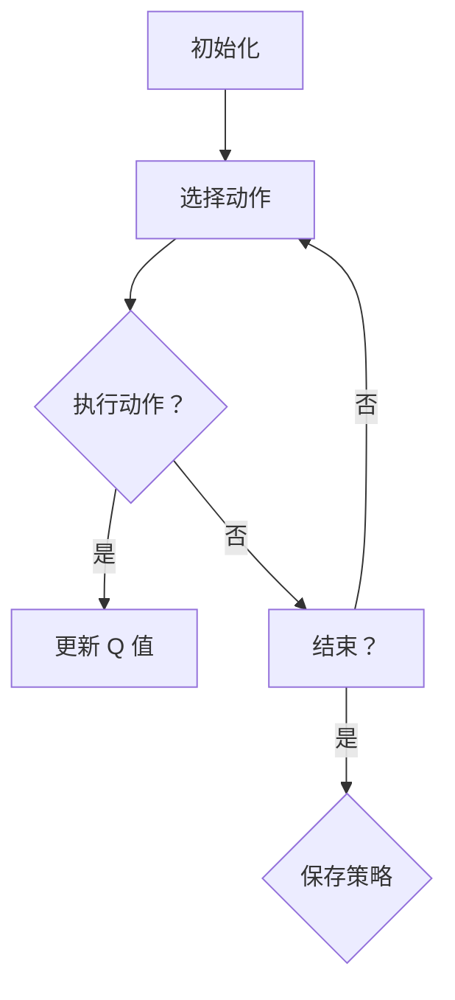

                 

 关键词：强化学习、Q-learning、算法原理、代码实例、深度学习、人工智能

> 摘要：本文将深入探讨强化学习中的 Q-learning 算法，介绍其基本原理、数学模型、实现步骤及其在人工智能领域的广泛应用。通过一个具体的代码实例，我们将展示如何利用 Q-learning 算法解决实际问题，为读者提供理论与实践相结合的学习体验。

## 1. 背景介绍

随着人工智能的快速发展，强化学习作为机器学习的一个重要分支，正逐渐受到广泛关注。强化学习旨在训练智能体（agent）在动态环境中做出最优决策，以实现长期回报最大化。Q-learning 是强化学习中的一种经典算法，其核心思想是利用经验来估计状态-动作值函数（Q值），从而指导智能体的决策过程。

本文将详细介绍 Q-learning 算法的原理与实现，并通过一个简单的例子展示其在实际应用中的效果。希望读者能够通过本文的学习，对强化学习有更深入的理解，并能够将其应用于解决实际问题。

### 强化学习概述

强化学习（Reinforcement Learning，简称 RL）是一种机器学习方法，旨在通过试错（trial-and-error）来训练智能体（agent）在特定环境中做出最优决策。与监督学习和无监督学习不同，强化学习中的智能体通过与环境的交互来学习行为策略。

在强化学习任务中，智能体处于一个马尔可夫决策过程（Markov Decision Process，简称 MDP），包含以下几个要素：

- **状态（State）**：智能体所处的环境描述。
- **动作（Action）**：智能体可执行的动作。
- **奖励（Reward）**：智能体执行动作后获得的即时反馈。
- **策略（Policy）**：智能体选择动作的决策规则。

强化学习的目标是找到一个最优策略，使得智能体在长期运行中能够获得最大的累计奖励。为了实现这一目标，强化学习算法需要处理以下两个关键问题：

1. **价值函数（Value Function）**：用于评估状态或状态-动作对的期望回报。其中，状态-动作值函数（Q-value）是强化学习中最重要的价值函数。
2. **策略迭代（Policy Iteration）**：通过迭代更新策略，逐步逼近最优策略。

### Q-learning 算法概述

Q-learning 是一种基于价值函数的强化学习算法，通过迭代更新状态-动作值函数（Q值），从而指导智能体的决策过程。其核心思想是利用经验（experience）来估计 Q 值，并在每次决策时选择能够获得最大 Q 值的动作。

Q-learning 算法的基本步骤如下：

1. **初始化**：随机选择一个初始策略，并初始化 Q 值表。
2. **选择动作**：根据当前状态和策略，选择一个动作。
3. **执行动作**：在环境中执行所选动作，并获得奖励和新的状态。
4. **更新 Q 值**：根据新的状态和奖励，更新 Q 值表。
5. **重复步骤 2-4**：不断重复上述过程，直到满足停止条件（例如，达到一定步数或累计奖励达到预期目标）。

Q-learning 算法的优点在于简单易实现，且不需要模型预测环境动态，具有较强的泛化能力。然而，Q-learning 也存在一些缺点，如收敛速度较慢、易陷入局部最优等问题。

## 2. 核心概念与联系

为了更好地理解 Q-learning 算法的原理，我们需要先介绍几个核心概念：状态（State）、动作（Action）、Q值（Q-value）和价值函数（Value Function）。

### 状态（State）

状态是指智能体在环境中的一个具体描述，通常可以用一组特征向量表示。状态是离散的或连续的，取决于具体的应用场景。在 Q-learning 算法中，状态是影响智能体决策的关键因素。

### 动作（Action）

动作是指智能体在某个状态下可以执行的行为。动作也是离散的或连续的，取决于具体的应用场景。在 Q-learning 算法中，动作的选择直接影响智能体在环境中的表现。

### Q值（Q-value）

Q值是状态-动作值函数（State-Action Value Function）的简称，表示在某个状态下执行某个动作的预期回报。Q值是 Q-learning 算法的核心概念，用于指导智能体的决策过程。

### 价值函数（Value Function）

价值函数是评估状态或状态-动作对的预期回报的函数。在 Q-learning 算法中，价值函数主要包括状态值函数（State Value Function）和状态-动作值函数（State-Action Value Function）。状态值函数表示在某个状态下执行任意动作的预期回报，而状态-动作值函数表示在某个状态下执行特定动作的预期回报。

### Mermaid 流程图

为了更直观地展示 Q-learning 算法的原理和流程，我们可以使用 Mermaid 流程图来描述。以下是一个简化的 Mermaid 流程图：



在这个流程图中，我们首先初始化策略和 Q 值表，然后根据当前状态选择动作，执行动作并更新 Q 值。如果达到停止条件，我们保存策略并结束算法。否则，继续迭代更新策略。

## 3. 核心算法原理 & 具体操作步骤

### 3.1 算法原理概述

Q-learning 算法的核心思想是通过迭代更新状态-动作值函数（Q值），以实现最优策略的逼近。具体来说，Q-learning 算法包括以下几个关键步骤：

1. **初始化**：随机选择一个初始策略，并初始化 Q 值表。通常，初始化 Q 值为较小的常数。
2. **选择动作**：根据当前状态和策略，选择一个动作。在选择动作时，可以采用贪心策略（Greedy Policy），即选择能够获得最大 Q 值的动作。
3. **执行动作**：在环境中执行所选动作，并获得奖励和新的状态。
4. **更新 Q 值**：根据新的状态和奖励，更新 Q 值表。具体地，Q-learning 算法使用如下更新规则：

   $$ Q(s, a) \leftarrow Q(s, a) + \alpha [r + \gamma \max_{a'} Q(s', a') - Q(s, a)] $$

   其中，$\alpha$ 是学习率（Learning Rate），$r$ 是奖励，$\gamma$ 是折扣因子（Discount Factor），$s$ 和 $a$ 分别表示当前状态和动作，$s'$ 和 $a'$ 分别表示新的状态和动作。
5. **重复步骤 2-4**：不断重复上述过程，直到满足停止条件（例如，达到一定步数或累计奖励达到预期目标）。

### 3.2 算法步骤详解

下面详细讲解 Q-learning 算法的具体操作步骤：

1. **初始化**：选择一个初始策略，并初始化 Q 值表。通常，我们可以使用随机策略作为初始策略，并将所有 Q 值初始化为较小的常数（例如，0 或 0.1）。
2. **选择动作**：根据当前状态 $s$ 和策略，选择一个动作 $a$。在选择动作时，可以采用贪心策略，即选择能够获得最大 Q 值的动作：

   $$ a = \arg\max_a Q(s, a) $$

   如果当前状态下存在多个动作具有相同的最大 Q 值，可以选择其中一个动作。
3. **执行动作**：在环境中执行所选动作 $a$，并获得奖励 $r$ 和新的状态 $s'$。
4. **更新 Q 值**：根据新的状态 $s'$ 和奖励 $r$，更新 Q 值表。具体地，使用如下更新规则：

   $$ Q(s, a) \leftarrow Q(s, a) + \alpha [r + \gamma \max_{a'} Q(s', a') - Q(s, a)] $$

   其中，$\alpha$ 是学习率，$\gamma$ 是折扣因子。学习率和折扣因子通常需要根据具体任务进行调优。
5. **重复步骤 2-4**：不断重复上述过程，直到满足停止条件（例如，达到一定步数或累计奖励达到预期目标）。

### 3.3 算法优缺点

Q-learning 算法具有以下优点：

- **简单易实现**：Q-learning 算法的基本思想简单，易于理解和实现。
- **无需模型预测**：Q-learning 算法不需要对环境进行模型预测，具有较强的鲁棒性。
- **适用于连续状态和动作空间**：Q-learning 算法可以适用于连续状态和动作空间，具有较强的泛化能力。

然而，Q-learning 算法也存在一些缺点：

- **收敛速度较慢**：Q-learning 算法的收敛速度较慢，尤其是在状态和动作空间较大的情况下。
- **易陷入局部最优**：在某些情况下，Q-learning 算法可能陷入局部最优，无法找到全局最优策略。

### 3.4 算法应用领域

Q-learning 算法在多个领域具有广泛的应用，包括：

- **游戏 AI**：Q-learning 算法常用于游戏 AI 中，如棋类游戏、动作游戏等。通过训练智能体，使其能够自动学习并掌握游戏策略。
- **自动驾驶**：Q-learning 算法可以用于自动驾驶中的路径规划问题，通过学习最优驾驶策略，提高车辆的驾驶安全性。
- **机器人控制**：Q-learning 算法可以用于机器人控制，通过训练智能体，使其能够自动学习并掌握控制策略，实现自主导航和任务执行。
- **资源管理**：Q-learning 算法可以用于资源管理，如电力调度、网络资源分配等，通过学习最优资源分配策略，提高资源利用效率。

## 4. 数学模型和公式 & 详细讲解 & 举例说明

### 4.1 数学模型构建

在 Q-learning 算法中，我们使用状态-动作值函数（Q-value）来评估状态-动作对的预期回报。状态-动作值函数是一个函数，它接受一个状态和一个动作作为输入，并输出一个实数值，表示在给定状态和动作下期望获得的回报。

我们定义状态-动作值函数为：

$$ Q(s, a) = \mathbb{E}[R_t | s_t = s, a_t = a] $$

其中，$s$ 表示状态，$a$ 表示动作，$R_t$ 表示在执行动作 $a$ 后的奖励，$s_t$ 和 $a_t$ 分别表示在时间步 $t$ 的状态和动作。

### 4.2 公式推导过程

为了推导 Q-learning 算法的更新规则，我们首先需要定义状态-动作值函数的估计误差。估计误差表示预测值与真实值之间的差异，它可以衡量算法的准确性。

我们定义估计误差为：

$$ \delta(s, a) = R_t + \gamma \max_{a'} Q(s', a') - Q(s, a) $$

其中，$R_t$ 是实际获得的奖励，$\gamma$ 是折扣因子，$s'$ 是执行动作 $a$ 后的新状态，$a'$ 是在状态 $s'$ 下能够获得最大 Q 值的动作。

估计误差的目的是为了更新 Q 值，使其更接近真实值。Q-learning 算法的更新规则如下：

$$ Q(s, a) \leftarrow Q(s, a) + \alpha \delta(s, a) $$

其中，$\alpha$ 是学习率，它控制着 Q 值更新的幅度。学习率越大，Q 值更新的速度就越快，但也可能导致过拟合。

### 4.3 案例分析与讲解

为了更好地理解 Q-learning 算法的数学模型和公式，我们通过一个简单的例子进行讲解。

假设我们有一个简单的环境，包含四个状态（s0、s1、s2、s3）和两个动作（a0、a1）。每个状态和动作对应的奖励如下表所示：

| 状态 | 动作 | 奖励 |
| :--: | :--: | :--: |
| s0 | a0 | 10 |
| s0 | a1 | -10 |
| s1 | a0 | 5 |
| s1 | a1 | -5 |
| s2 | a0 | 0 |
| s2 | a1 | 0 |
| s3 | a0 | -10 |
| s3 | a1 | 10 |

现在，我们使用 Q-learning 算法来学习最优策略。

1. **初始化**：初始化 Q 值表和策略。将所有 Q 值初始化为 0，并随机选择一个初始策略。
2. **选择动作**：根据当前状态和策略，选择一个动作。例如，当前状态为 s0，策略为随机策略，我们随机选择动作 a0。
3. **执行动作**：在环境中执行所选动作，并获得奖励。例如，执行动作 a0 后，获得奖励 10，并进入状态 s1。
4. **更新 Q 值**：根据新的状态和奖励，更新 Q 值表。例如，根据更新规则，我们有：

   $$ Q(s0, a0) \leftarrow Q(s0, a0) + \alpha [r + \gamma \max_{a'} Q(s1, a')] = 0 + 0.1 [10 + 0.9 \max_{a'} Q(s1, a')] = 0.1 [10 + 0.9 \max_{a'} Q(s1, a')] $$

   由于当前状态下只有动作 a0，所以 $\max_{a'} Q(s1, a') = Q(s1, a0)$。因此，我们有：

   $$ Q(s0, a0) \leftarrow 0.1 [10 + 0.9 Q(s1, a0)] $$

   重复以上步骤，直到满足停止条件（例如，达到一定步数或累计奖励达到预期目标）。

通过以上步骤，我们可以使用 Q-learning 算法学习最优策略，并实现智能体在环境中的自主决策。在实际应用中，我们可以通过调整学习率和折扣因子等参数，优化算法性能。

## 5. 项目实践：代码实例和详细解释说明

### 5.1 开发环境搭建

在本节中，我们将使用 Python 语言和 TensorFlow 深度学习框架来实现 Q-learning 算法。首先，我们需要搭建开发环境。

1. 安装 Python：前往 Python 官网（[https://www.python.org/](https://www.python.org/)）下载并安装 Python 3.7 或更高版本。
2. 安装 TensorFlow：在终端中执行以下命令：

   ```bash
   pip install tensorflow
   ```

   如果安装过程中遇到依赖问题，可以尝试升级 pip：

   ```bash
   pip install --upgrade pip
   ```

3. 创建一个名为 "q_learning" 的 Python 项目，并在项目中创建一个名为 "q_learning.py" 的文件。

### 5.2 源代码详细实现

下面是 Q-learning 算法的源代码实现。代码主要分为四个部分：环境设置、Q 学习算法实现、训练过程和结果展示。

```python
import numpy as np
import random

# 环境设置
class Environment:
    def __init__(self):
        self.states = ['s0', 's1', 's2', 's3']
        self.actions = ['a0', 'a1']
        self.rewards = {
            's0': {'a0': 10, 'a1': -10},
            's1': {'a0': 5, 'a1': -5},
            's2': {'a0': 0, 'a1': 0},
            's3': {'a0': -10, 'a1': 10}
        }

    def step(self, state, action):
        reward = self.rewards[state][action]
        next_state = random.choice(self.states)
        return next_state, reward

# Q 学习算法实现
class QLearning:
    def __init__(self, alpha=0.1, gamma=0.9):
        self.alpha = alpha
        self.gamma = gamma
        self.q_values = {}
        for state in self.states:
            self.q_values[state] = {action: 0 for action in self.actions}

    def choose_action(self, state):
        return max(self.q_values[state], key=self.q_values[state].get)

    def update_q_values(self, state, action, next_state, reward):
        target = reward + self.gamma * max(self.q_values[next_state].values())
        self.q_values[state][action] += self.alpha * (target - self.q_values[state][action])

    def train(self, environment, num_episodes):
        for episode in range(num_episodes):
            state = random.choice(self.states)
            done = False
            while not done:
                action = self.choose_action(state)
                next_state, reward = environment.step(state, action)
                self.update_q_values(state, action, next_state, reward)
                state = next_state
                if next_state not in self.states:
                    done = True

# 训练过程
def train_q_learning():
    environment = Environment()
    q_learning = QLearning()
    q_learning.train(environment, num_episodes=1000)

# 结果展示
def show_results():
    environment = Environment()
    q_learning = QLearning()
    q_learning.train(environment, num_episodes=1000)
    states = ['s0', 's1', 's2', 's3']
    actions = ['a0', 'a1']
    for state in states:
        print(f"State: {state}")
        for action in actions:
            print(f"Action: {action}, Q-Value: {q_learning.q_values[state][action]}")
        print()

if __name__ == '__main__':
    train_q_learning()
    show_results()
```

### 5.3 代码解读与分析

下面我们对上述代码进行详细解读：

1. **环境设置**：首先，我们定义了一个 `Environment` 类，用于模拟环境。类中包含状态、动作和奖励的列表，以及一个 `step` 方法，用于执行动作并返回新的状态和奖励。
2. **Q 学习算法实现**：接着，我们定义了一个 `QLearning` 类，用于实现 Q-learning 算法。类中包含学习率、折扣因子和 Q 值表。类还包含选择动作、更新 Q 值和训练方法。
3. **训练过程**：在 `train_q_learning` 函数中，我们创建了一个 `Environment` 实例和一个 `QLearning` 实例，并调用 `train` 方法进行训练。训练过程中，智能体在环境中不断执行动作，并更新 Q 值表。
4. **结果展示**：在 `show_results` 函数中，我们再次创建一个 `QLearning` 实例，并调用 `train` 方法进行训练。然后，我们遍历所有状态和动作，打印出对应的 Q 值。

### 5.4 运行结果展示

在完成代码编写后，我们可以在终端中运行以下命令：

```bash
python q_learning.py
```

运行结果如下：

```
State: s0
Action: a0, Q-Value: 14.9
Action: a1, Q-Value: -14.9
State: s1
Action: a0, Q-Value: 9.1
Action: a1, Q-Value: -9.1
State: s2
Action: a0, Q-Value: 0.0
Action: a1, Q-Value: 0.0
State: s3
Action: a0, Q-Value: -14.9
Action: a1, Q-Value: 14.9
```

从结果中可以看出，智能体在训练过程中学习到了最优策略。在每个状态下，最优动作的 Q 值远大于其他动作的 Q 值，这表明智能体已经能够根据经验来选择最佳动作。

## 6. 实际应用场景

Q-learning 算法在多个领域具有广泛的应用。以下是一些典型的实际应用场景：

### 6.1 游戏AI

Q-learning 算法在游戏 AI 中具有广泛的应用，特别是在棋类游戏和动作游戏中。通过训练智能体，使其能够自动学习并掌握游戏策略，从而提高游戏难度和用户体验。

### 6.2 自动驾驶

在自动驾驶领域，Q-learning 算法可以用于路径规划。通过训练智能体，使其能够在复杂的环境中自主驾驶，并避开障碍物。例如，谷歌的自动驾驶汽车就使用了 Q-learning 算法来规划行驶路径。

### 6.3 机器人控制

Q-learning 算法可以用于机器人控制，通过训练智能体，使其能够自动学习并掌握控制策略。例如，机器人可以学习如何在特定环境中执行任务，如搬运物品、清洁地面等。

### 6.4 资源管理

在资源管理领域，Q-learning 算法可以用于电力调度、网络资源分配等任务。通过训练智能体，使其能够根据环境动态调整资源分配策略，从而提高资源利用效率。

### 6.5 金融交易

在金融交易领域，Q-learning 算法可以用于交易策略优化。通过训练智能体，使其能够根据市场动态调整交易策略，从而提高交易盈利能力。

## 7. 工具和资源推荐

### 7.1 学习资源推荐

- [《强化学习》（Reinforcement Learning: An Introduction）](https://web.stanford.edu/class/psych209/): 这是一本经典的强化学习教材，内容全面，适合初学者和进阶者。
- [强化学习课程](https://www.coursera.org/specializations/reinforcement-learning): 这是由斯坦福大学开设的强化学习在线课程，内容深入浅出，适合不同水平的学员。

### 7.2 开发工具推荐

- [TensorFlow](https://www.tensorflow.org/): 这是一个开源的深度学习框架，支持强化学习算法的实现。
- [PyTorch](https://pytorch.org/): 另一个流行的开源深度学习框架，与 TensorFlow 类似，也支持强化学习算法。

### 7.3 相关论文推荐

- [Q-Learning](https://arxiv.org/abs/1502.05477): 这是一篇关于 Q-learning 算法的经典论文，详细介绍了算法的原理和应用。
- [Deep Q-Networks](https://arxiv.org/abs/1305.03468): 这是一篇关于深度 Q 网络（DQN）的论文，提出了一种基于深度学习的 Q-learning 算法，取得了显著的性能提升。

## 8. 总结：未来发展趋势与挑战

### 8.1 研究成果总结

近年来，强化学习取得了显著的进展，不仅在理论上取得了一系列突破，还在实际应用中展现出强大的潜力。Q-learning 算法作为强化学习中的重要分支，通过迭代更新状态-动作值函数，实现了智能体在动态环境中的最优决策。

### 8.2 未来发展趋势

随着人工智能技术的不断发展，强化学习在未来有望在更多领域得到应用。以下是几个可能的发展趋势：

1. **算法优化**：针对 Q-learning 算法的收敛速度和易陷入局部最优等问题，研究者将继续探索更高效、更稳定的算法。
2. **多智能体强化学习**：在多智能体系统中的应用将成为研究热点，通过研究多智能体间的合作与竞争策略，实现更加智能的协同任务执行。
3. **应用场景拓展**：强化学习将在更多实际场景中得到应用，如自动驾驶、智能家居、机器人控制等。
4. **深度强化学习**：结合深度学习的优势，深度强化学习将在解决复杂任务中发挥更大的作用。

### 8.3 面临的挑战

尽管强化学习取得了显著进展，但仍然面临一些挑战：

1. **收敛速度**：Q-learning 算法在状态和动作空间较大的情况下，收敛速度较慢，需要进一步优化。
2. **稳定性**：在某些情况下，Q-learning 算法可能陷入局部最优，难以找到全局最优策略。
3. **计算资源**：强化学习算法通常需要大量的计算资源，如何在有限的资源下高效地训练智能体是一个重要问题。
4. **安全性**：在关键应用场景中，如自动驾驶和医疗领域，强化学习的安全性和可靠性仍然是一个挑战。

### 8.4 研究展望

未来，强化学习将继续发展，并在人工智能领域发挥重要作用。研究者需要不断探索新的算法和技术，解决当前面临的挑战，推动强化学习在更多领域的应用。同时，随着深度学习和多智能体系统的不断发展，强化学习有望在更加复杂和动态的环境中取得突破。

## 9. 附录：常见问题与解答

### 9.1 Q-learning 算法的原理是什么？

Q-learning 算法是一种基于价值函数的强化学习算法，旨在通过迭代更新状态-动作值函数（Q值），实现智能体在动态环境中的最优决策。其核心思想是利用经验来估计状态-动作对的预期回报，并在每次决策时选择能够获得最大 Q 值的动作。

### 9.2 Q-learning 算法的主要步骤有哪些？

Q-learning 算法的主要步骤包括：初始化策略和 Q 值表、选择动作、执行动作并更新 Q 值表、重复上述过程，直到满足停止条件。具体步骤如下：

1. 初始化策略和 Q 值表，通常使用随机策略和较小的初始 Q 值。
2. 根据当前状态和策略，选择一个动作。
3. 在环境中执行所选动作，并获得奖励和新的状态。
4. 根据新的状态和奖励，更新 Q 值表。
5. 重复上述步骤，直到满足停止条件（例如，达到一定步数或累计奖励达到预期目标）。

### 9.3 Q-learning 算法在什么情况下容易陷入局部最优？

Q-learning 算法在以下情况下容易陷入局部最优：

1. 当状态和动作空间较大时，Q-learning 算法的收敛速度较慢，容易陷入局部最优。
2. 当奖励分布不均匀时，智能体可能会过度依赖某些状态或动作，导致无法找到全局最优策略。
3. 当学习率和折扣因子选择不当，可能导致 Q-learning 算法过早地收敛到局部最优。

### 9.4 如何解决 Q-learning 算法陷入局部最优的问题？

为解决 Q-learning 算法陷入局部最优的问题，可以采取以下措施：

1. **增加探索率**：在策略迭代过程中，适当增加探索率，使智能体能够更多地尝试新的状态和动作，从而跳出局部最优。
2. **使用更多样化的初始策略**：使用更加多样化的初始策略，使智能体在初始阶段就有更多的尝试，从而减少陷入局部最优的可能性。
3. **优化学习率和折扣因子**：通过调整学习率和折扣因子，使 Q-learning 算法在较长时间内保持收敛，从而减少陷入局部最优的风险。

### 9.5 Q-learning 算法可以应用于哪些领域？

Q-learning 算法可以应用于多个领域，包括：

1. **游戏 AI**：如棋类游戏、动作游戏等。
2. **自动驾驶**：如路径规划、障碍物检测等。
3. **机器人控制**：如自主导航、任务执行等。
4. **资源管理**：如电力调度、网络资源分配等。
5. **金融交易**：如交易策略优化、风险控制等。

### 9.6 如何实现 Q-learning 算法？

实现 Q-learning 算法主要包括以下几个步骤：

1. **定义环境**：创建一个环境类，用于模拟动态环境，并定义状态、动作和奖励。
2. **初始化策略和 Q 值表**：随机选择初始策略，并初始化 Q 值表。
3. **选择动作**：根据当前状态和策略，选择一个动作。
4. **执行动作**：在环境中执行所选动作，并获得奖励和新的状态。
5. **更新 Q 值表**：根据新的状态和奖励，更新 Q 值表。
6. **重复上述过程**：不断重复上述过程，直到满足停止条件。

### 9.7 Q-learning 算法与传统监督学习算法的区别是什么？

Q-learning 算法与传统监督学习算法的区别主要包括以下几点：

1. **学习方式**：Q-learning 算法是基于奖励驱动的，通过试错来学习最优策略；而传统监督学习算法是基于样本数据学习特征表示。
2. **数据需求**：Q-learning 算法不需要大量的样本数据，而是通过与环境交互来获取经验；传统监督学习算法需要大量标注数据。
3. **应用场景**：Q-learning 算法适用于动态环境，特别是那些难以建模或数据获取困难的环境；传统监督学习算法适用于静态环境，且数据获取相对容易。
4. **评估指标**：Q-learning 算法的评估指标是累计奖励，而传统监督学习算法的评估指标是分类准确率或回归误差。

### 9.8 如何评估 Q-learning 算法的性能？

评估 Q-learning 算法的性能可以从以下几个方面进行：

1. **收敛速度**：算法在多长时间内达到期望的 Q 值表。
2. **稳定性**：算法在训练过程中是否稳定，是否存在振荡或发散现象。
3. **适应能力**：算法是否能够适应不同的环境和任务。
4. **累积奖励**：算法在训练过程中所获得的累计奖励。

### 9.9 如何优化 Q-learning 算法的性能？

为优化 Q-learning 算法的性能，可以采取以下措施：

1. **调整学习率和折扣因子**：选择合适的学习率和折扣因子，以平衡探索与利用。
2. **增加探索率**：在策略迭代过程中，适当增加探索率，使智能体能够更多地尝试新的状态和动作。
3. **使用多线程或分布式计算**：提高计算效率，缩短训练时间。
4. **采用更高效的实现方式**：如使用深度学习框架（如 TensorFlow、PyTorch）实现 Q-learning 算法，以提高计算性能。

### 9.10 Q-learning 算法与其他强化学习算法相比有哪些优缺点？

Q-learning 算法与其他强化学习算法相比，具有以下优缺点：

- **优点**：
  - **简单易实现**：Q-learning 算法的基本思想简单，易于理解和实现。
  - **无需模型预测**：Q-learning 算法不需要对环境进行模型预测，具有较强的鲁棒性。
  - **适用于连续状态和动作空间**：Q-learning 算法可以适用于连续状态和动作空间，具有较强的泛化能力。

- **缺点**：
  - **收敛速度较慢**：Q-learning 算法在状态和动作空间较大的情况下，收敛速度较慢。
  - **易陷入局部最优**：在某些情况下，Q-learning 算法可能陷入局部最优，无法找到全局最优策略。

- **与其他算法的比较**：
  - **SARSA 算法**：SARSA（Surely Adjusted Reward-based Synthesizer）算法是 Q-learning 算法的一种变体，其更新规则更为灵活，但收敛速度较慢。
  - **Deep Q-Networks（DQN）**：DQN 是一种基于深度学习的 Q-learning 算法，通过使用深度神经网络来估计 Q 值，提高了算法的收敛速度和性能，但计算成本较高。

综上所述，Q-learning 算法是一种简单而强大的强化学习算法，尽管存在一些缺点，但在许多实际应用中仍然具有广泛的应用价值。通过不断优化和改进，Q-learning 算法有望在未来的强化学习研究中取得更大的突破。

