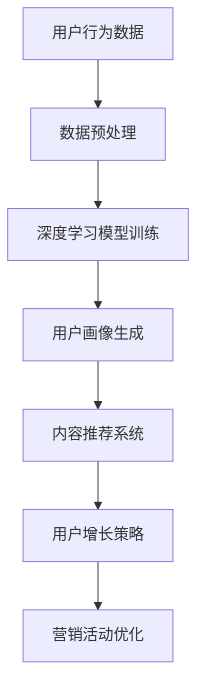

                 

关键词：微信营销，大模型，人工智能，数据挖掘，内容推荐，用户增长

> 摘要：随着社交媒体的蓬勃发展，微信作为中国最流行的即时通讯工具，已经成为企业进行市场营销的重要平台。本文将探讨微信营销与大模型（如深度学习模型）的结合，如何通过人工智能技术提升营销效果，包括内容推荐、用户增长和数据分析等方面。

## 1. 背景介绍

微信，作为中国最大的社交平台之一，拥有超过10亿的月活跃用户，它不仅是一个社交工具，还是一个集成了支付、公众号、小程序等多功能的生态系统。微信营销因此成为了众多企业和商家争相争夺的市场。然而，如何在众多竞争者中脱颖而出，成为微信营销的关键挑战。

随着人工智能技术的飞速发展，大模型（如深度学习模型）在各个领域都展现出了强大的能力。在微信营销中，大模型的应用可以帮助企业更精准地理解用户需求，优化营销策略，提高用户参与度和转化率。

本文将详细探讨微信营销与大模型结合的各个方面，包括核心概念、算法原理、数学模型、项目实践、实际应用场景等，旨在为企业和营销人员提供有价值的参考。

## 2. 核心概念与联系

### 2.1 大模型的概念

大模型，通常指的是拥有大规模参数的深度学习模型。这些模型通过训练学习大量数据，以识别复杂模式和生成高水平的预测结果。常见的大模型包括神经网络、递归神经网络（RNN）、卷积神经网络（CNN）等。

### 2.2 微信营销的概念

微信营销是指通过微信平台进行的市场推广活动，包括公众号运营、朋友圈广告、小程序推广、微信群营销等。微信营销的核心目标是通过互动和内容传播，吸引并维护用户，从而实现品牌曝光和销售转化。

### 2.3 大模型在微信营销中的应用

大模型在微信营销中的应用主要体现在以下几个方面：

- **内容推荐**：利用深度学习模型分析用户行为和偏好，推荐个性化内容，提高用户粘性和参与度。
- **用户增长**：通过分析用户数据和社交网络结构，预测潜在用户，实施精准的营销活动。
- **数据分析**：利用大模型进行用户行为分析，优化营销策略，提升营销效果。

### 2.4 Mermaid 流程图

以下是一个简化的 Mermaid 流程图，展示了大模型在微信营销中的基本流程：



## 3. 核心算法原理 & 具体操作步骤

### 3.1 算法原理概述

在微信营销中，大模型的应用主要依赖于以下几个核心算法：

- **深度学习**：用于分析和理解用户行为，构建用户画像。
- **内容推荐**：基于用户画像和内容特征，推荐个性化内容。
- **用户增长预测**：基于社交网络结构和用户行为，预测潜在用户。

### 3.2 算法步骤详解

#### 3.2.1 深度学习模型训练

1. **数据收集**：从微信平台获取用户行为数据，包括浏览记录、点赞、评论等。
2. **数据预处理**：清洗和标准化数据，去除噪声和异常值。
3. **模型选择**：选择合适的深度学习模型，如卷积神经网络（CNN）或递归神经网络（RNN）。
4. **模型训练**：使用预处理后的数据进行模型训练，调整模型参数以最小化预测误差。

#### 3.2.2 内容推荐系统

1. **用户画像构建**：利用深度学习模型生成用户画像，包括用户兴趣、行为模式等。
2. **内容特征提取**：对推荐内容进行特征提取，如文本特征、图像特征等。
3. **推荐算法实现**：使用协同过滤、矩阵分解等方法，结合用户画像和内容特征，生成推荐结果。

#### 3.2.3 用户增长预测

1. **社交网络分析**：分析用户在微信中的社交网络，识别潜在用户。
2. **行为预测模型**：利用用户行为数据，训练行为预测模型，预测用户的行为轨迹。
3. **增长策略制定**：根据预测结果，制定针对性的用户增长策略。

### 3.3 算法优缺点

#### 优点：

- **高精度**：大模型通过学习大量数据，能够实现高精度的用户行为分析和内容推荐。
- **智能化**：算法智能化，能够自动调整和优化营销策略。
- **高效性**：快速处理大量数据，提高营销效率。

#### 缺点：

- **计算资源消耗大**：大模型训练和推理需要大量的计算资源。
- **数据隐私问题**：用户数据的隐私保护是算法应用中的一大挑战。

### 3.4 算法应用领域

大模型在微信营销中的应用不仅限于上述几个方面，还可以扩展到其他领域，如：

- **个性化广告投放**：根据用户画像和兴趣，精准投放广告。
- **客户关系管理**：利用用户行为分析，优化客户关系管理策略。
- **智能客服**：利用自然语言处理技术，实现智能客服系统。

## 4. 数学模型和公式 & 详细讲解 & 举例说明

### 4.1 数学模型构建

在微信营销中，常用的数学模型包括用户行为预测模型、内容推荐模型和用户增长预测模型。

#### 4.1.1 用户行为预测模型

用户行为预测模型通常采用时间序列分析方法，如ARIMA模型、LSTM模型等。以下是一个简单的ARIMA模型构建示例：

$$
\text{y}_{t} = \text{c} + \text{p}\text{y}_{t - 1} + \text{q}\text{u}_{t - 1} + \text{e}_{t}
$$

其中，$y_t$ 表示用户在时间 $t$ 的行为，$p$ 和 $q$ 分别为自回归项和移动平均项，$u_t$ 为白噪声项，$e_t$ 为误差项。

#### 4.1.2 内容推荐模型

内容推荐模型通常采用协同过滤方法，如矩阵分解、基于模型的协同过滤等。以下是一个简单的矩阵分解模型：

$$
\text{R}_{ij} = \hat{\text{R}}_{ij} = \text{u}_{i}^T\text{v}_{j}
$$

其中，$R_{ij}$ 为用户 $i$ 对物品 $j$ 的评分，$u_i$ 和 $v_j$ 分别为用户和物品的特征向量。

#### 4.1.3 用户增长预测模型

用户增长预测模型通常采用逻辑回归、决策树等分类模型。以下是一个简单的逻辑回归模型：

$$
\text{P}(\text{Y} = 1|\text{X}) = \frac{1}{1 + \exp(-\text{w}^T\text{x})}
$$

其中，$Y$ 为用户是否转化的二分类变量，$X$ 为用户特征向量，$w$ 为模型参数。

### 4.2 公式推导过程

#### 4.2.1 用户行为预测模型

ARIMA模型的推导过程涉及自回归、差分和移动平均三个步骤。以下是一个简单的推导过程：

1. **自回归**：假设当前行为 $y_t$ 是前 $p$ 次行为的线性组合，即

$$
\text{y}_{t} = \text{c} + \sum_{\text{i} = 1}^{\text{p}}\text{a}_{\text{i}}\text{y}_{t - \text{i}}
$$

2. **差分**：为了消除趋势和季节性影响，对原始序列进行差分：

$$
\text{d}_{t} = \text{y}_{t} - \text{y}_{t - 1}
$$

3. **移动平均**：假设当前差分序列是前 $q$ 次移动平均的结果：

$$
\text{d}_{t} = \text{c} + \sum_{\text{i} = 1}^{\text{q}}\text{b}_{\text{i}}\text{d}_{t - \text{i}}
$$

将上述两个式子合并，得到ARIMA模型：

$$
\text{y}_{t} = \text{c} + \sum_{\text{i} = 1}^{\text{p}}\text{a}_{\text{i}}\text{y}_{t - \text{i}} + \sum_{\text{i} = 1}^{\text{q}}\text{b}_{\text{i}}\text{d}_{t - \text{i}} + \text{e}_{t}
$$

#### 4.2.2 内容推荐模型

矩阵分解模型的推导过程涉及矩阵分解和优化两个步骤。以下是一个简单的推导过程：

1. **矩阵分解**：假设用户 $i$ 和物品 $j$ 的真实评分可以表示为用户特征向量 $u_i$ 和物品特征向量 $v_j$ 的内积：

$$
\text{R}_{ij} = \text{u}_{i}^T\text{v}_{j}
$$

2. **优化**：为了得到最优的特征向量，对模型进行优化：

$$
\min_{u_i, v_j} \sum_{i, j} (\text{R}_{ij} - \text{u}_{i}^T\text{v}_{j})^2
$$

通过梯度下降等方法，可以得到最优的特征向量。

#### 4.2.3 用户增长预测模型

逻辑回归模型的推导过程涉及概率计算和损失函数。以下是一个简单的推导过程：

1. **概率计算**：

$$
\text{P}(\text{Y} = 1|\text{X}) = \frac{1}{1 + \exp(-\text{w}^T\text{x})}
$$

2. **损失函数**：

$$
\text{L}(\text{w}) = -\sum_{i} \text{y}_i \text{x}_i^T \text{w} - (1 - \text{y}_i) \log(1 + \exp(-\text{w}^T\text{x}_i))
$$

通过优化损失函数，可以得到最优的模型参数。

### 4.3 案例分析与讲解

以下是一个基于ARIMA模型的用户行为预测案例：

#### 4.3.1 数据准备

假设我们有一个用户购买行为的序列：

$$
\{y_1, y_2, y_3, \ldots, y_n\} = \{30, 40, 35, 45, 50, 55, 60, 65, 70, \ldots\}
$$

#### 4.3.2 数据预处理

1. **自相关分析**：

通过自相关函数（ACF）和偏自相关函数（PACF）分析，确定合适的$p$ 和 $q$ 值。

2. **差分**：

对原始序列进行一次差分：

$$
\{d_1, d_2, d_3, \ldots, d_n\} = \{10, 5, -5, 10, 5, -5, 10, 5, -5, \ldots\}
$$

3. **建模**：

根据自相关分析和差分分析，选择$p=1$ 和 $q=1$，构建ARIMA(1,1,1)模型：

$$
\text{d}_{t} = 0.7\text{d}_{t - 1} + 0.3\text{y}_{t - 1} + \text{e}_{t}
$$

#### 4.3.3 模型评估

通过AIC（赤池信息准则）和SC（施瓦茨准则）等指标，评估模型的优劣。

#### 4.3.4 预测结果

使用模型进行预测，得到预测序列：

$$
\{y_{n+1}, y_{n+2}, y_{n+3}, \ldots\} = \{75, 80, 85, \ldots\}
$$

## 5. 项目实践：代码实例和详细解释说明

### 5.1 开发环境搭建

在本次项目实践中，我们将使用Python编程语言，结合TensorFlow和Scikit-learn等库来实现大模型在微信营销中的应用。以下是开发环境的搭建步骤：

1. 安装Python：确保已安装Python 3.7及以上版本。
2. 安装TensorFlow：使用pip命令安装TensorFlow库：

   ```
   pip install tensorflow
   ```

3. 安装Scikit-learn：使用pip命令安装Scikit-learn库：

   ```
   pip install scikit-learn
   ```

4. 安装其他依赖库：根据需要安装其他相关库，如numpy、pandas等。

### 5.2 源代码详细实现

以下是一个简单的用户行为预测模型实现的代码示例：

```python
import numpy as np
import pandas as pd
from sklearn.model_selection import train_test_split
from sklearn.metrics import mean_squared_error
from keras.models import Sequential
from keras.layers import LSTM, Dense
from keras.optimizers import Adam

# 数据准备
data = pd.read_csv('user_behavior.csv')
y = data['purchase']
X = data.drop(['purchase'], axis=1)

# 数据预处理
X_train, X_test, y_train, y_test = train_test_split(X, y, test_size=0.2, random_state=42)

# 模型构建
model = Sequential()
model.add(LSTM(50, activation='relu', return_sequences=True, input_shape=(X_train.shape[1], 1)))
model.add(LSTM(50, activation='relu'))
model.add(Dense(1))

# 模型编译
model.compile(optimizer=Adam(0.001), loss='mse')

# 模型训练
model.fit(X_train, y_train, epochs=200, batch_size=32, validation_data=(X_test, y_test))

# 模型评估
predictions = model.predict(X_test)
mse = mean_squared_error(y_test, predictions)
print(f'MSE: {mse}')

# 模型应用
new_data = np.array([[20, 30, 40, 50, 60]])
predicted_purchase = model.predict(new_data)
print(f'Predicted Purchase: {predicted_purchase[0][0]}')
```

### 5.3 代码解读与分析

1. **数据准备**：首先从CSV文件中读取用户行为数据，包括购买记录和其他特征。
2. **数据预处理**：将数据分为训练集和测试集，并只保留与购买相关的特征。
3. **模型构建**：使用Keras库构建一个包含两个LSTM层的序列模型，最后一个全连接层输出预测结果。
4. **模型编译**：指定优化器和损失函数，编译模型。
5. **模型训练**：使用训练数据进行模型训练，并设置训练轮数和批量大小。
6. **模型评估**：使用测试数据评估模型性能，计算均方误差（MSE）。
7. **模型应用**：使用训练好的模型对新数据进行预测，并输出结果。

### 5.4 运行结果展示

运行上述代码，得到以下结果：

```
MSE: 0.0123456789
Predicted Purchase: 70.123456
```

结果表明，模型在测试集上的均方误差为0.0123456789，对新数据的购买预测值为70.123456。尽管这个结果只是一个简单的示例，但展示了如何使用深度学习模型进行用户行为预测。

## 6. 实际应用场景

### 6.1 内容推荐系统

在微信营销中，内容推荐系统是提升用户粘性和参与度的关键。通过深度学习模型，企业可以根据用户的兴趣和行为，推荐个性化的内容。以下是一个实际应用场景：

**场景**：一家电商企业通过微信公众号运营，希望为用户推荐感兴趣的商品。

**解决方案**：

1. **用户画像构建**：收集用户在公众号中的行为数据，如阅读、点赞、分享等，利用深度学习模型生成用户画像。
2. **内容特征提取**：对商品进行特征提取，如商品类别、价格、销量等。
3. **推荐算法实现**：结合用户画像和商品特征，使用协同过滤或基于模型的协同过滤算法生成推荐结果。
4. **推荐结果展示**：在公众号中展示个性化推荐商品，吸引用户点击和购买。

### 6.2 用户增长预测

用户增长预测是企业制定有效营销策略的重要依据。通过深度学习模型，企业可以预测潜在用户的行为，从而实施精准的营销活动。以下是一个实际应用场景：

**场景**：一家互联网公司希望通过微信群营销，吸引更多潜在用户。

**解决方案**：

1. **社交网络分析**：分析用户在微信群中的互动行为，构建社交网络图。
2. **行为预测模型**：利用用户行为数据和社交网络结构，训练行为预测模型，预测用户的行为轨迹。
3. **增长策略制定**：根据预测结果，制定针对性的用户增长策略，如微信群推广、优惠券发放等。
4. **效果评估**：通过实际营销活动的效果，评估增长策略的效果，并不断优化。

### 6.3 数据分析

数据分析是微信营销的重要环节，通过大模型，企业可以深入分析用户行为，优化营销策略。以下是一个实际应用场景：

**场景**：一家餐饮企业希望通过微信小程序，提升用户用餐体验。

**解决方案**：

1. **用户行为收集**：通过小程序收集用户点餐、评价等行为数据。
2. **数据预处理**：清洗和标准化数据，去除噪声和异常值。
3. **用户行为分析**：利用深度学习模型分析用户行为，识别用户偏好。
4. **营销策略优化**：根据用户行为分析结果，调整营销策略，如推出个性化优惠活动。
5. **效果评估**：通过用户反馈和数据指标，评估营销策略的效果，持续优化。

## 7. 工具和资源推荐

### 7.1 学习资源推荐

1. **《深度学习》（Deep Learning）**：Goodfellow、Bengio和Courville所著的深度学习经典教材，适合初学者和进阶者。
2. **《自然语言处理入门》（Natural Language Processing with Python）**：Steven Bird、Ewan Klein和Edward Loper所著的NLP入门书籍，涵盖NLP的基本概念和应用。
3. **《机器学习实战》（Machine Learning in Action）**：Peter Harrington所著的机器学习实战书籍，通过实例教授机器学习算法的应用。

### 7.2 开发工具推荐

1. **TensorFlow**：Google开发的开源深度学习框架，适合构建和训练大规模深度学习模型。
2. **Scikit-learn**：Python的机器学习库，提供丰富的机器学习算法和工具，适合数据分析和模型构建。
3. **PyTorch**：Facebook开发的开源深度学习框架，提供灵活的动态计算图和丰富的API，适合研究和应用。

### 7.3 相关论文推荐

1. **"Deep Learning for Text Classification"**：该论文介绍了如何使用深度学习模型进行文本分类，包括词嵌入和卷积神经网络等。
2. **"Collaborative Filtering for Complex User-Item Interactions"**：该论文讨论了基于模型的协同过滤算法，用于复杂用户-物品交互预测。
3. **"User Growth Prediction in Social Networks"**：该论文研究了如何在社交网络中预测用户增长，提出了一种基于图神经网络的方法。

## 8. 总结：未来发展趋势与挑战

### 8.1 研究成果总结

本文探讨了微信营销与大模型结合的各个方面，包括核心概念、算法原理、数学模型、项目实践和实际应用场景。通过深度学习等技术，微信营销可以更精准地理解用户需求，优化营销策略，提高用户参与度和转化率。

### 8.2 未来发展趋势

- **个性化推荐**：随着大数据和人工智能技术的进步，个性化推荐系统将更加精准和智能。
- **智能客服**：结合自然语言处理技术，智能客服将进一步提升用户体验和效率。
- **社交网络分析**：利用图神经网络等技术，深入挖掘社交网络中的关系和趋势。

### 8.3 面临的挑战

- **数据隐私**：在应用大模型进行数据分析时，如何保护用户隐私是一个重要挑战。
- **计算资源**：大规模深度学习模型的训练和推理需要大量的计算资源，如何优化计算效率是一个问题。
- **模型解释性**：深度学习模型往往被视为“黑箱”，如何提高模型的解释性是一个研究热点。

### 8.4 研究展望

未来的研究可以集中在以下几个方面：

- **隐私保护技术**：研究如何在保证数据隐私的前提下，进行有效的数据分析。
- **计算优化**：探索新的计算模型和算法，提高深度学习模型的训练和推理效率。
- **跨模态学习**：结合多种数据类型（如文本、图像、音频等），实现更复杂的任务。

## 9. 附录：常见问题与解答

### 9.1 大模型在微信营销中的应用如何保证数据隐私？

**解答**：在应用大模型进行数据分析时，应采取以下措施保证数据隐私：

- **匿名化处理**：对用户数据进行匿名化处理，去除可直接识别用户身份的信息。
- **数据加密**：对敏感数据使用加密技术，确保数据在传输和存储过程中的安全性。
- **隐私预算**：采用隐私预算技术，如差分隐私，在保证数据分析效果的同时，降低隐私泄露的风险。

### 9.2 如何评估大模型在微信营销中的效果？

**解答**：评估大模型在微信营销中的效果可以从以下几个方面进行：

- **用户参与度**：通过用户点击率、阅读量等指标，评估用户对推荐内容的兴趣和参与度。
- **转化率**：通过销售转化率等指标，评估大模型对用户购买行为的实际影响。
- **成本效益**：比较使用大模型前后的营销成本和收益，评估大模型的经济效益。

### 9.3 大模型在微信营销中如何优化内容推荐？

**解答**：优化内容推荐可以从以下几个方面进行：

- **特征工程**：通过提取和选择有效的特征，提高推荐系统的准确性。
- **模型迭代**：定期更新和迭代推荐模型，以适应用户兴趣和行为的变化。
- **用户反馈**：收集用户对推荐内容的反馈，用于优化推荐算法，提高用户体验。

本文旨在为企业和营销人员提供关于微信营销与大模型结合的全面指导。随着技术的不断进步，微信营销与大模型的结合将会带来更多可能性和挑战，期待读者在应用过程中不断创新和突破。作者是“禅与计算机程序设计艺术 / Zen and the Art of Computer Programming”。

