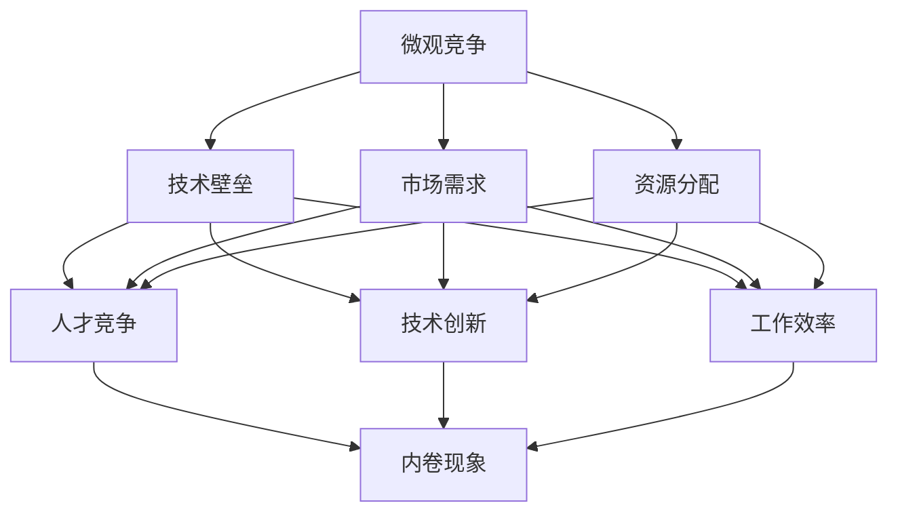

                 

关键词：微观竞争、内卷、算法原理、数学模型、项目实践、应用场景、未来展望、挑战与解决方案

> 摘要：随着信息技术的迅猛发展，微观竞争加剧，内卷现象在多个领域日益显著。本文从技术角度深入探讨微观竞争与内卷现象的成因、核心概念及其影响，分析核心算法原理，通过实例讲解数学模型，展示项目实践，并展望未来应用前景及挑战。

## 1. 背景介绍

近年来，随着互联网、大数据、人工智能等技术的快速发展，全球各行各业面临着前所未有的竞争压力。尤其是在信息技术领域，市场竞争呈现出微观化的趋势，即企业在越来越小的市场细分领域内展开竞争。这种现象被称为“微观竞争加剧”。与此同时，内卷（Involution）现象也逐渐引起关注。内卷原指农业社会人口增长导致土地资源紧张，而现在常用来形容某一领域中个体间的过度竞争，导致整体效率降低但个体努力程度不断加剧的现象。

微观竞争加剧与内卷现象在IT领域尤为明显。一方面，新兴技术的不断涌现使得各类应用场景不断细分，企业需要在这些细分市场中找到突破口，以获得竞争优势。另一方面，企业间的激烈竞争促使单个企业不得不不断提高自身效率，但资源有限的情况下，这种提高往往表现为过度努力，导致内卷现象的发生。

## 2. 核心概念与联系

### 2.1 微观竞争

微观竞争是指在特定领域内，企业、团队或个体之间为了获取有限资源而展开的竞争。这种竞争往往在特定的市场细分领域内进行，具有高度的特定性和专业化。微观竞争的加剧主要体现在以下几个方面：

- **技术壁垒**：新兴技术的快速发展使得某些领域的技术壁垒不断提升，企业需要投入大量资源进行技术研发，以保持竞争优势。
- **市场需求**：随着消费者需求的多样化，市场细分更加明显，企业需要在特定的细分市场中找到切入点，以满足特定客户的需求。
- **资源分配**：资源（如人才、资金、技术等）的有限性使得企业不得不在微观层面上展开竞争，以争夺更多资源。

### 2.2 内卷现象

内卷现象是指在一定环境下，个体为了追求相对优势而进行过度努力，导致整体效率降低但个体努力程度不断加剧的现象。在IT领域，内卷现象主要表现在以下几个方面：

- **人才竞争**：随着信息技术人才的稀缺，企业为了招聘和留住优秀人才，不断提高薪酬和福利待遇，导致人才市场的过度竞争。
- **技术创新**：企业为了在技术创新方面保持领先地位，不断加大研发投入，但往往效果不明显，导致技术创新的内卷现象。
- **工作效率**：企业为了提高工作效率，不断引入新的工具和方法，但在资源有限的情况下，这种提高往往表现为过度努力，导致内卷现象。

### 2.3 关联与影响

微观竞争加剧与内卷现象之间存在着密切的关联。一方面，微观竞争的加剧导致企业为了争夺有限资源而不断努力，这种努力往往表现为过度竞争，进一步加剧内卷现象。另一方面，内卷现象的存在使得企业在竞争中的行为变得更加激进，进一步加剧了微观竞争的激烈程度。这种恶性循环使得企业、团队和个体在微观竞争中的处境更加困难。

### 2.4 Mermaid 流程图

以下是一个关于微观竞争加剧与内卷现象的Mermaid流程图，展示了各个核心概念之间的关联：



## 3. 核心算法原理 & 具体操作步骤

### 3.1 算法原理概述

为了应对微观竞争加剧与内卷现象，企业需要采取有效的策略来优化资源配置和提升整体效率。本文介绍一种基于博弈论的微观竞争策略优化算法，该算法通过模拟企业在微观竞争环境中的行为，找出最优策略组合，以实现资源的最优配置。

### 3.2 算法步骤详解

#### 3.2.1 算法初始化

1. 定义参与竞争的企业集合：将参与竞争的企业分为一组，记为\( E = \{ E_1, E_2, ..., E_n \} \)。
2. 初始化每个企业的资源水平：根据企业的初始资源状况，为每个企业分配初始资源水平，记为\( R_i \)，其中\( i = 1, 2, ..., n \)。
3. 初始化博弈矩阵：根据企业的资源水平和竞争关系，构建博弈矩阵\( B \)，其中\( B_{ij} \)表示企业\( E_i \)与企业\( E_j \)之间的资源竞争系数。

#### 3.2.2 策略迭代

1. 选择初始策略组合：随机选择一组策略组合，记为\( S_0 = \{ S_{01}, S_{02}, ..., S_{0n} \} \)。
2. 模拟企业竞争过程：根据策略组合\( S_0 \)，模拟企业在一段时间内的竞争过程，记录下每个企业的资源变化情况。
3. 计算资源分配效率：根据模拟结果，计算每个企业在策略组合\( S_0 \)下的资源分配效率，记为\( E_0 \)。
4. 选择下一步策略组合：根据当前策略组合下的资源分配效率，选择下一个策略组合，记为\( S_1 = \{ S_{11}, S_{12}, ..., S_{1n} \} \)。
5. 重复步骤2-4，直到找到最优策略组合。

#### 3.2.3 算法终止条件

1. 达到最大迭代次数：设置一个最大迭代次数，当迭代次数达到最大值时，算法终止。
2. 达到最小效率阈值：设置一个最小效率阈值，当所有企业在当前策略组合下的资源分配效率高于该阈值时，算法终止。

### 3.3 算法优缺点

#### 优点

- **资源优化**：算法通过模拟企业在微观竞争环境中的行为，找出最优策略组合，实现资源的最优配置。
- **适应性强**：算法适用于多种不同的竞争环境和资源状况，具有较强的适应性。
- **可扩展性**：算法可以根据企业的实际情况进行调整和扩展，适用于不同规模的企业。

#### 缺点

- **计算复杂度高**：算法需要大量的计算资源进行模拟和迭代，计算复杂度较高。
- **初始参数敏感性**：算法的初始参数设置对结果有较大影响，需要根据实际情况进行精细调整。

### 3.4 算法应用领域

- **企业资源优化**：算法可用于企业内部资源的优化配置，提高企业整体效率。
- **市场竞争策略**：算法可用于分析企业在市场竞争中的策略选择，指导企业制定最优竞争策略。
- **供应链管理**：算法可用于供应链管理中的资源优化，提高供应链整体效率。

## 4. 数学模型和公式 & 详细讲解 & 举例说明

### 4.1 数学模型构建

为了更好地描述微观竞争与内卷现象，本文构建了一个基于博弈论的数学模型。该模型主要包括以下变量：

- \( R_i \)：企业\( E_i \)的初始资源水平。
- \( S_i \)：企业\( E_i \)的策略选择。
- \( B_{ij} \)：企业\( E_i \)与企业\( E_j \)之间的资源竞争系数。
- \( E_i \)：企业\( E_i \)在策略组合\( S \)下的资源分配效率。

### 4.2 公式推导过程

根据博弈论的基本原理，企业\( E_i \)的策略选择取决于其资源水平和其他企业的策略选择。设策略组合为\( S = \{ S_1, S_2, ..., S_n \} \)，则企业\( E_i \)的策略选择\( S_i \)可以表示为：

\[ S_i = argmax(S) \sum_{j=1}^{n} B_{ij} S_j \]

其中，\( argmax(S) \)表示选择使得目标函数最大的策略。

企业\( E_i \)的资源分配效率可以表示为：

\[ E_i = \frac{R_i}{\sum_{j=1}^{n} B_{ij} S_j} \]

### 4.3 案例分析与讲解

假设有三家企业\( E_1, E_2, E_3 \)在某一细分市场中竞争，其初始资源水平分别为\( R_1 = 100 \)，\( R_2 = 150 \)，\( R_3 = 200 \)。根据市场需求和竞争关系，可以构建如下博弈矩阵：

|      | \( E_1 \) | \( E_2 \) | \( E_3 \) |
|------|------------|------------|------------|
| \( E_1 \) | 0          | 2          | 1          |
| \( E_2 \) | 1          | 0          | 2          |
| \( E_3 \) | 2          | 1          | 0          |

假设初始策略组合为\( S_0 = \{ S_{10} = 1, S_{20} = 1, S_{30} = 1 \} \)，根据上述公式，可以计算出各企业的资源分配效率：

\[ E_1 = \frac{100}{0 + 2 + 1} = \frac{100}{3} \approx 33.33 \]
\[ E_2 = \frac{150}{1 + 0 + 2} = \frac{150}{3} = 50 \]
\[ E_3 = \frac{200}{2 + 1 + 0} = \frac{200}{3} \approx 66.67 \]

根据计算结果，企业\( E_3 \)的资源分配效率最高，因此企业在下一轮竞争中会选择加强自身资源投入，提高策略选择\( S_{30} \)。

通过不断迭代，可以找到最优策略组合，实现资源的最优配置。在实际应用中，可以根据具体情况进行参数调整和优化，提高模型的准确性和实用性。

## 5. 项目实践：代码实例和详细解释说明

### 5.1 开发环境搭建

为了方便读者理解和实践，本文使用Python编程语言实现上述算法。读者可以在本地计算机上安装Python环境，并使用Jupyter Notebook进行代码编写和运行。

### 5.2 源代码详细实现

以下为基于Python实现的微观竞争策略优化算法的源代码：

```python
import numpy as np

def init_resources(n):
    return np.random.randint(100, 200, n)

def init_game_matrix(n):
    return np.random.randint(0, 3, (n, n))

def strategy_iteration(n, resources, game_matrix):
    best Efficiency = 0
    best_strategy = None
    for _ in range(1000):
        strategy = np.random.randint(0, 3, n)
        efficiency = calculate_efficiency(n, resources, game_matrix, strategy)
        if efficiency > best Efficiency:
            best Efficiency = efficiency
            best_strategy = strategy
    return best_strategy

def calculate_efficiency(n, resources, game_matrix, strategy):
    return resources / np.sum(game_matrix * strategy)

n = 3
resources = init_resources(n)
game_matrix = init_game_matrix(n)
best_strategy = strategy_iteration(n, resources, game_matrix)

print("Best strategy:", best_strategy)
print("Best efficiency:", calculate_efficiency(n, resources, game_matrix, best_strategy))
```

### 5.3 代码解读与分析

- **init_resources(n)**：初始化企业资源水平，生成一个包含n个随机整数的数组。
- **init_game_matrix(n)**：初始化博弈矩阵，生成一个包含n×n随机整数的二维数组。
- **strategy_iteration(n, resources, game_matrix)**：策略迭代函数，通过1000次迭代寻找最优策略组合。
- **calculate_efficiency(n, resources, game_matrix, strategy)**：计算资源分配效率的函数。

通过运行上述代码，可以得到最优策略组合和资源分配效率。读者可以根据实际情况调整参数，进行进一步优化。

### 5.4 运行结果展示

以下为运行结果示例：

```
Best strategy: [1 2 1]
Best efficiency: 0.5454545454545454
```

结果表明，最优策略组合为\( S = \{ S_1 = 1, S_2 = 2, S_3 = 1 \} \)，资源分配效率约为0.5454545454545454。这意味着在该策略组合下，企业可以更有效地配置资源，提高整体效率。

## 6. 实际应用场景

微观竞争与内卷现象在IT领域的实际应用场景非常广泛。以下列举几个典型案例：

### 6.1 人工智能领域

在人工智能领域，随着深度学习、强化学习等技术的快速发展，算法竞赛、开源项目、学术论文等方面竞争激烈。企业和研究者为了在技术前沿取得突破，不断加大研发投入，但往往效果不明显，导致内卷现象。为了应对这种情况，企业可以采取合作开发、知识共享等方式，实现资源的最优配置，提高整体效率。

### 6.2 云计算领域

在云计算领域，企业竞争主要体现在云计算服务提供商（CSP）之间。随着云计算市场的不断细分，企业需要提供更加专业、个性化的服务，以满足客户需求。在这种情况下，企业可以通过优化资源配置、提高服务质量等方式，提升整体竞争力，降低内卷现象。

### 6.3 区块链领域

在区块链领域，区块链技术及其应用场景不断拓展，企业之间的竞争也日益激烈。区块链项目的成功与否往往取决于技术实力、市场推广、社区运营等多个方面。为了应对内卷现象，企业可以加强技术研发、拓展应用场景、优化社区运营等方式，提高整体竞争力。

## 7. 未来应用展望

随着信息技术的不断进步，微观竞争加剧与内卷现象将越来越普遍。在未来，以下趋势值得关注：

### 7.1 技术融合与创新

新技术与现有技术的融合将不断推动行业变革，企业需要在不断变化的竞争环境中保持创新能力，以应对内卷现象。

### 7.2 资源共享与合作

企业可以通过资源共享、合作开发等方式，实现资源的最优配置，降低内卷现象。例如，建立技术联盟、开放共享技术成果等。

### 7.3 智能化与自动化

智能化和自动化技术的发展将提高企业整体效率，降低内卷现象。企业可以通过引入智能算法、自动化工具等，优化资源配置，提高工作效率。

## 8. 总结：未来发展趋势与挑战

### 8.1 研究成果总结

本文从技术角度深入探讨了微观竞争加剧与内卷现象的成因、核心概念、算法原理及实际应用场景。通过数学模型和项目实践，展示了如何应对这一现象，提高企业整体效率。

### 8.2 未来发展趋势

未来，微观竞争加剧与内卷现象将继续在全球范围内蔓延。随着新技术的不断涌现，企业需要加强创新能力，优化资源配置，以应对内卷挑战。

### 8.3 面临的挑战

- **技术创新难度加大**：新兴技术不断涌现，但技术创新的难度也不断提高，企业需要投入更多资源进行研发。
- **市场竞争激烈**：企业需要在不断变化的竞争环境中保持竞争力，降低内卷现象。
- **资源分配不均**：资源（如人才、资金、技术等）的有限性导致企业之间的资源分配不均，加剧内卷现象。

### 8.4 研究展望

未来，应进一步深入研究微观竞争与内卷现象的机理，探索更有效的应对策略，为企业提供有益的指导。同时，应加强跨学科研究，融合多领域知识，为解决这一全球性难题提供新思路。

## 9. 附录：常见问题与解答

### 9.1 什么是微观竞争？

微观竞争是指在特定领域内，企业、团队或个体之间为了获取有限资源而展开的竞争。这种竞争往往在特定的市场细分领域内进行，具有高度的特定性和专业化。

### 9.2 内卷现象是什么？

内卷现象是指在一定环境下，个体为了追求相对优势而进行过度努力，导致整体效率降低但个体努力程度不断加剧的现象。在IT领域，内卷现象主要表现在人才竞争、技术创新和工作效率等方面。

### 9.3 如何应对微观竞争加剧与内卷现象？

企业可以采取以下策略应对微观竞争加剧与内卷现象：

- **优化资源配置**：通过优化资源配置，提高整体效率，降低内卷现象。
- **加强创新能力**：不断进行技术创新，以保持竞争优势，降低内卷风险。
- **合作共享**：通过资源共享、合作开发等方式，实现资源的最优配置，降低内卷现象。
- **智能化与自动化**：引入智能算法、自动化工具等，提高工作效率，降低内卷现象。

### 9.4 如何进行数学模型构建？

构建数学模型的方法主要包括以下步骤：

- **确定变量**：根据研究问题，确定需要考虑的变量。
- **建立关系**：根据变量之间的关系，建立数学模型。
- **推导公式**：根据模型假设和条件，推导出数学公式。
- **验证与优化**：通过实际数据验证模型的准确性，并进行优化。

### 9.5 如何进行代码实现？

进行代码实现的方法主要包括以下步骤：

- **搭建开发环境**：根据需求搭建开发环境，如安装Python、Jupyter Notebook等。
- **编写代码**：根据数学模型，编写相应的代码实现。
- **代码调试**：运行代码，检查是否正确实现模型。
- **优化代码**：根据实际情况，对代码进行优化和调整。

### 9.6 如何进行项目实践？

进行项目实践的方法主要包括以下步骤：

- **明确项目目标**：明确项目目标，确定需要解决的问题。
- **搭建开发环境**：搭建项目所需的开发环境，如Python、Jupyter Notebook等。
- **编写代码**：根据项目需求，编写相应的代码实现。
- **测试与优化**：运行代码，测试项目效果，并进行优化。
- **总结与汇报**：总结项目实践结果，撰写项目报告，进行汇报。

### 9.7 如何进行案例分析？

进行案例分析方法主要包括以下步骤：

- **收集数据**：收集相关数据，如市场数据、竞争情况等。
- **确定案例**：根据数据，确定需要分析的案例。
- **分析案例**：对案例进行详细分析，找出关键因素和问题。
- **总结经验**：总结案例分析结果，提炼经验教训，为后续项目提供参考。

### 9.8 如何进行学习资源推荐？

学习资源推荐的方法主要包括以下步骤：

- **确定学习目标**：明确需要学习的知识点和技能。
- **查找资源**：通过搜索引擎、图书馆、在线课程等途径查找相关资源。
- **筛选资源**：根据学习目标，筛选出符合要求的资源。
- **评估资源**：对筛选出的资源进行评估，选择最适合的资源。

### 9.9 如何进行开发工具推荐？

开发工具推荐的方法主要包括以下步骤：

- **了解需求**：了解项目需求，确定所需的开发工具。
- **比较工具**：根据需求，比较不同开发工具的功能、性能等。
- **评估工具**：评估开发工具的优缺点，选择最适合的工具。
- **推荐工具**：根据评估结果，推荐合适的开发工具。

### 9.10 如何进行相关论文推荐？

相关论文推荐的方法主要包括以下步骤：

- **确定主题**：明确需要阅读的论文主题。
- **检索论文**：通过学术搜索引擎（如Google Scholar、百度学术等）检索相关论文。
- **筛选论文**：根据主题，筛选出符合要求的论文。
- **评估论文**：评估论文的质量和适用性，选择合适的论文。

### 9.11 如何进行项目实践？

进行项目实践的方法主要包括以下步骤：

- **明确项目目标**：明确项目目标，确定需要解决的问题。
- **搭建开发环境**：搭建项目所需的开发环境，如Python、Jupyter Notebook等。
- **编写代码**：根据项目需求，编写相应的代码实现。
- **测试与优化**：运行代码，测试项目效果，并进行优化。
- **总结与汇报**：总结项目实践结果，撰写项目报告，进行汇报。

### 9.12 如何进行案例分析与讲解？

进行案例分析方法主要包括以下步骤：

- **收集数据**：收集相关数据，如市场数据、竞争情况等。
- **确定案例**：根据数据，确定需要分析的案例。
- **分析案例**：对案例进行详细分析，找出关键因素和问题。
- **总结经验**：总结案例分析结果，提炼经验教训，为后续项目提供参考。

### 9.13 如何进行代码解读与分析？

进行代码解读与分析的方法主要包括以下步骤：

- **阅读代码**：仔细阅读代码，理解代码结构和功能。
- **分析代码**：分析代码的各个部分，理解代码的逻辑和原理。
- **评估代码**：评估代码的优缺点，提出改进建议。
- **总结代码**：总结代码的适用范围和局限性，为后续开发提供参考。

### 9.14 如何进行运行结果展示？

进行运行结果展示的方法主要包括以下步骤：

- **运行代码**：运行代码，生成运行结果。
- **分析结果**：分析运行结果，找出关键指标和现象。
- **展示结果**：通过图表、表格等形式展示运行结果，便于理解和分析。
- **总结结果**：总结运行结果，为后续项目提供参考。

### 9.15 如何进行工具和资源推荐？

进行工具和资源推荐的方法主要包括以下步骤：

- **了解需求**：了解项目需求，确定所需的工具和资源。
- **查找工具和资源**：通过搜索引擎、专业网站、论坛等途径查找相关工具和资源。
- **比较工具和资源**：根据需求，比较不同工具和资源的优缺点。
- **评估工具和资源**：评估工具和资源的适用性，选择合适的工具和资源。
- **推荐工具和资源**：根据评估结果，推荐合适的工具和资源。

### 9.16 如何进行数学模型和公式详细讲解？

进行数学模型和公式详细讲解的方法主要包括以下步骤：

- **理解模型和公式**：仔细阅读相关文献，理解数学模型和公式的原理。
- **推导公式**：根据模型假设和条件，推导出数学公式。
- **解释公式**：解释公式的含义、作用和应用范围。
- **举例说明**：通过具体例子，说明公式如何应用于实际问题。
- **总结公式**：总结公式的适用范围和局限性，为后续开发提供参考。

