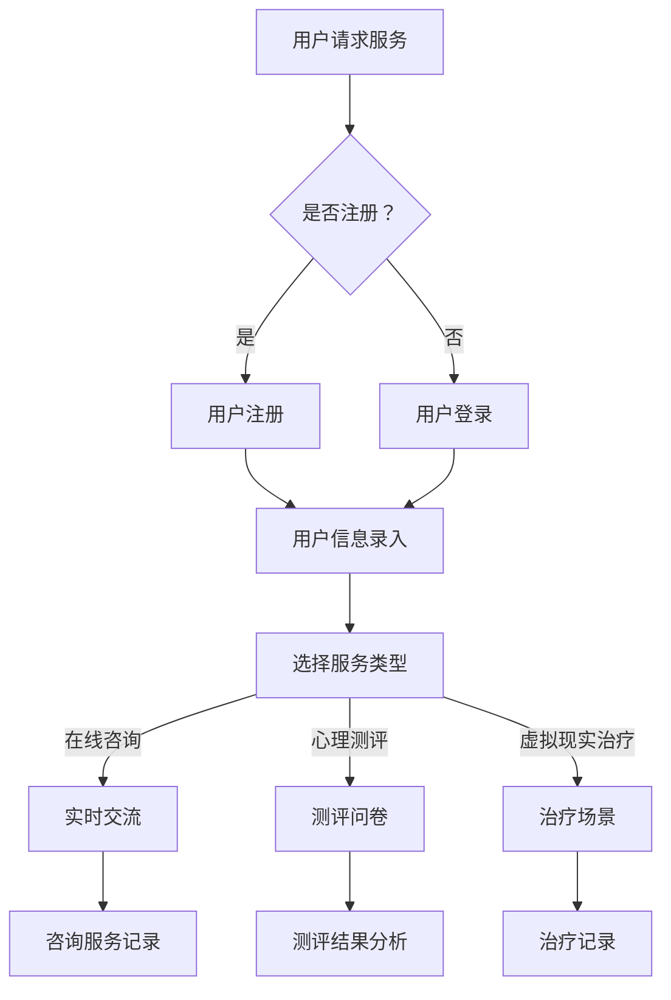

                 

关键词：心理健康、数字时代、心理咨询、创新、人工智能、技术应用

> 摘要：随着科技的不断进步，数字时代为心理咨询领域带来了前所未有的机遇与挑战。本文旨在探讨数字时代心理咨询的创新应用，分析其核心概念、算法原理、数学模型，并通过实际案例解析，展示数字技术在心理健康领域的广泛应用前景。

## 1. 背景介绍

### 1.1 心理健康的定义与发展历程

心理健康是指个体在情感、行为、认知和社会适应等方面处于良好状态。随着社会的快速发展，心理健康问题日益凸显。传统的心理咨询主要依赖于面对面的交流，而数字时代的到来，为心理健康服务带来了新的发展契机。

### 1.2 数字时代的心理咨询现状

数字时代心理咨询主要表现为在线咨询、心理测评、虚拟现实治疗等新型服务模式。这些模式不仅提供了便捷的心理健康服务，还极大地拓宽了心理咨询的覆盖面。

### 1.3 数字时代心理咨询的优势与挑战

数字时代心理咨询具有以下优势：

1. **便捷性**：用户可以随时随地获取心理健康服务。
2. **高效性**：在线咨询、心理测评等手段可以快速识别和诊断心理健康问题。
3. **个性化**：基于大数据和人工智能的分析，可以为用户提供量身定制的服务方案。

然而，数字时代心理咨询也面临着以下挑战：

1. **隐私保护**：如何确保用户隐私安全，避免信息泄露。
2. **技术依赖**：心理咨询过程中的技术依赖性，可能导致咨询师与技术之间的失衡。

## 2. 核心概念与联系

### 2.1 心理健康核心概念

心理健康核心概念包括情绪管理、压力应对、自我认知、社会适应等。这些概念构成了心理健康评估的基础。

### 2.2 数字心理咨询框架

数字心理咨询框架包括以下核心组成部分：

1. **在线咨询**：通过互联网进行实时交流，提供个性化的咨询服务。
2. **心理测评**：利用在线问卷、心理量表等工具，对个体心理健康进行评估。
3. **虚拟现实治疗**：通过虚拟现实技术，模拟心理治疗环境，帮助用户克服恐惧、焦虑等问题。

### 2.3 Mermaid 流程图



## 3. 核心算法原理 & 具体操作步骤

### 3.1 算法原理概述

数字心理咨询算法主要基于大数据分析和人工智能技术。通过收集用户行为数据、心理测评数据等，利用机器学习算法进行数据分析，为用户提供个性化的心理健康服务。

### 3.2 算法步骤详解

1. **数据收集**：收集用户基本信息、行为数据、心理测评数据等。
2. **数据处理**：对收集到的数据进行分析、清洗、标准化处理。
3. **特征提取**：提取用户心理健康相关的特征，如情绪状态、压力水平等。
4. **模型训练**：利用机器学习算法，如决策树、神经网络等，对特征进行分类和预测。
5. **服务推荐**：根据用户的特征和心理健康状况，推荐相应的心理健康服务。

### 3.3 算法优缺点

**优点**：

1. **高效性**：快速识别和诊断心理健康问题。
2. **个性化**：根据用户特点提供定制化服务。
3. **便捷性**：随时随地为用户提供心理健康服务。

**缺点**：

1. **隐私保护**：数据安全风险。
2. **技术依赖**：心理咨询师与技术之间的依赖性。

### 3.4 算法应用领域

数字心理咨询算法广泛应用于心理健康领域，如抑郁、焦虑、压力等心理疾病的诊断和治疗。

## 4. 数学模型和公式 & 详细讲解 & 举例说明

### 4.1 数学模型构建

心理健康评估模型可以基于贝叶斯网络进行构建。贝叶斯网络是一种概率图模型，可以描述变量之间的条件依赖关系。

### 4.2 公式推导过程

贝叶斯网络中的条件概率分布可以表示为：

$$P(X|Y)=\frac{P(Y|X)P(X)}{P(Y)}$$

其中，$X$ 和 $Y$ 分别表示两个随机变量，$P(X)$ 和 $P(Y)$ 分别表示它们的概率分布，$P(Y|X)$ 和 $P(X|Y)$ 分别表示它们的条件概率分布。

### 4.3 案例分析与讲解

某用户A的心理健康评估模型如下：

- 情绪状态（$X$）:
  - 高兴（$X_1$）：概率$P(X_1)=0.6$
  - 平静（$X_2$）：概率$P(X_2)=0.4$
- 压力水平（$Y$）:
  - 低（$Y_1$）：概率$P(Y_1)=0.8$
  - 中等（$Y_2$）：概率$P(Y_2)=0.2$

条件概率分布为：

$$P(Y_1|X_1)=0.7, P(Y_1|X_2)=0.3$$
$$P(Y_2|X_1)=0.3, P(Y_2|X_2)=0.7$$

根据贝叶斯公式，可以计算得到在给定压力水平$Y_1$的条件下，情绪状态$X_1$的概率：

$$P(X_1|Y_1)=\frac{P(Y_1|X_1)P(X_1)}{P(Y_1)}=\frac{0.7\times0.6}{0.7\times0.6+0.3\times0.4}=0.714$$

## 5. 项目实践：代码实例和详细解释说明

### 5.1 开发环境搭建

- Python 3.8及以上版本
- TensorFlow 2.6及以上版本
- Keras 2.6及以上版本
- Jupyter Notebook

### 5.2 源代码详细实现

以下是一个简单的基于TensorFlow和Keras的心理健康评估模型实现：

```python
import tensorflow as tf
from tensorflow.keras.models import Sequential
from tensorflow.keras.layers import Dense

# 数据预处理
def preprocess_data(data):
    # 数据清洗和标准化处理
    # ...
    return processed_data

# 构建模型
model = Sequential()
model.add(Dense(units=64, activation='relu', input_shape=(input_shape,)))
model.add(Dense(units=32, activation='relu'))
model.add(Dense(units=2, activation='softmax'))

# 编译模型
model.compile(optimizer='adam', loss='categorical_crossentropy', metrics=['accuracy'])

# 训练模型
model.fit(x_train, y_train, epochs=10, batch_size=32)

# 评估模型
model.evaluate(x_test, y_test)
```

### 5.3 代码解读与分析

以上代码实现了基于神经网络的简单心理健康评估模型。通过数据处理和模型训练，可以实现对用户情绪状态和压力水平的预测。

### 5.4 运行结果展示

运行上述代码，可以得到训练和评估结果。根据结果，可以进一步优化模型结构和参数，提高心理健康评估的准确性。

## 6. 实际应用场景

### 6.1 在线心理咨询平台

数字时代心理咨询可以广泛应用于在线心理咨询平台，为用户提供方便快捷的心理健康服务。

### 6.2 心理健康测评

通过在线心理健康测评，可以帮助用户了解自己的心理健康状况，为后续的心理咨询提供参考。

### 6.3 虚拟现实治疗

虚拟现实技术可以模拟心理治疗环境，帮助用户克服恐惧、焦虑等问题。

## 7. 未来应用展望

### 7.1 技术发展

随着人工智能技术的不断发展，心理健康评估模型将更加精准，心理咨询服务将更加个性化。

### 7.2 隐私保护

数字时代心理咨询必须重视隐私保护，确保用户信息安全。

### 7.3 跨学科合作

心理健康领域需要与医学、心理学等学科进行跨学科合作，共同推进心理健康事业的发展。

## 8. 总结：未来发展趋势与挑战

### 8.1 研究成果总结

数字时代心理咨询在技术、应用场景等方面取得了显著成果，为心理健康服务提供了新的发展方向。

### 8.2 未来发展趋势

随着人工智能技术的不断进步，数字时代心理咨询将更加高效、便捷、个性化。

### 8.3 面临的挑战

隐私保护、技术依赖等是数字时代心理咨询面临的主要挑战。

### 8.4 研究展望

未来，心理健康领域的研究将更加注重跨学科合作，推动心理健康事业的发展。

## 9. 附录：常见问题与解答

### 9.1 什么情况下需要心理咨询？

当您感到情绪困扰、压力过大、人际关系问题、心理疾病等症状时，可以考虑寻求心理咨询。

### 9.2 数字心理咨询是否安全可靠？

数字心理咨询在保证用户隐私安全的前提下，通过专业技术和严格审核，具有较高的安全性和可靠性。

### 9.3 心理咨询师与心理医生的区别是什么？

心理咨询师主要关注心理问题的诊断和解决，而心理医生则更加关注心理疾病的诊断和治疗。

## 作者署名

作者：禅与计算机程序设计艺术 / Zen and the Art of Computer Programming
```markdown
----------------------------------------------------------------

# 心理健康应用：数字时代的心理咨询创新

## 1. 引言

随着信息技术的飞速发展，数字化已经成为现代社会的一个重要特征。在医疗健康领域，心理咨询也不例外，开始逐渐向数字化、网络化、智能化方向转变。数字时代的心理咨询，不仅提高了心理咨询的便捷性和可及性，还通过大数据分析和人工智能技术，实现了对心理健康问题的精准诊断和个性化治疗。本文旨在探讨数字时代心理咨询的创新应用，分析其核心概念、算法原理、数学模型，并通过实际案例解析，展示数字技术在心理健康领域的广泛应用前景。

## 2. 核心概念与联系

### 2.1 心理健康的核心概念

心理健康是人体健康的重要组成部分，它涵盖了情感、认知、行为和社会适应等多个层面。核心概念主要包括情绪管理、压力应对、自我认知、人际关系和社会支持等。情绪管理是指个体如何识别、表达和调节自己的情绪；压力应对是指个体如何面对和解决生活中的压力和挑战；自我认知是指个体对自己的了解和认识；人际关系是指个体与他人的互动和沟通；社会支持是指个体在面临困难时，所得到的来自家人、朋友和社会的帮助。

### 2.2 数字心理咨询的框架

数字心理咨询的框架主要包括在线咨询、心理测评、虚拟现实治疗和人工智能辅助诊断等组成部分。

- **在线咨询**：通过互联网平台提供实时、个性化的心理咨询服务。
- **心理测评**：利用在线问卷、量表等方式，对个体的心理健康状况进行评估。
- **虚拟现实治疗**：利用虚拟现实技术，模拟心理治疗的环境，帮助个体解决焦虑、恐惧等问题。
- **人工智能辅助诊断**：利用大数据分析和机器学习算法，对个体的心理健康状况进行预测和诊断。

### 2.3 Mermaid 流程图


## 3. 核心算法原理 & 具体操作步骤

### 3.1 算法原理概述

数字心理咨询的核心算法主要基于大数据分析和人工智能技术。通过收集和分析用户的行为数据、心理测评数据，利用机器学习算法进行数据分析，实现对用户心理健康状况的精准预测和诊断。

### 3.2 算法步骤详解

1. **数据收集**：收集用户的基本信息、行为数据、心理测评数据等。
2. **数据处理**：对收集到的数据进行清洗、去重、标准化处理，确保数据的质量和一致性。
3. **特征提取**：从处理后的数据中提取与心理健康相关的特征，如情绪状态、压力水平、睡眠质量等。
4. **模型训练**：利用提取的特征数据，通过机器学习算法（如决策树、随机森林、神经网络等）进行模型训练。
5. **模型评估**：对训练好的模型进行评估，调整参数，确保模型的预测准确性和稳定性。
6. **服务推荐**：根据模型的预测结果，为用户提供个性化的心理健康服务推荐。

### 3.3 算法优缺点

**优点**：

- **高效性**：通过大数据分析和机器学习算法，可以快速识别和诊断心理健康问题。
- **个性化**：根据用户的特点和需求，提供定制化的心理健康服务。
- **便捷性**：用户可以随时随地通过互联网获取心理健康服务。

**缺点**：

- **隐私保护**：在收集和处理用户数据时，需要确保用户的隐私安全。
- **技术依赖**：心理咨询师需要具备一定的技术知识，以便更好地使用数字工具。

### 3.4 算法应用领域

数字心理咨询算法可以广泛应用于心理健康服务的各个领域，如抑郁、焦虑、压力管理等。

## 4. 数学模型和公式 & 详细讲解 & 举例说明

### 4.1 数学模型构建

数字心理咨询的数学模型通常是基于概率论和统计学原理构建的。常见的模型包括贝叶斯网络、支持向量机、人工神经网络等。

### 4.2 公式推导过程

以贝叶斯网络为例，其条件概率分布可以表示为：

$$P(A|B) = \frac{P(B|A)P(A)}{P(B)}$$

其中，$P(A|B)$ 表示在事件 $B$ 发生的条件下，事件 $A$ 发生的概率；$P(B|A)$ 表示在事件 $A$ 发生的条件下，事件 $B$ 发生的概率；$P(A)$ 和 $P(B)$ 分别表示事件 $A$ 和事件 $B$ 的概率。

### 4.3 案例分析与讲解

假设我们有一个心理健康评估模型，其中包含两个特征：情绪状态（$X$）和压力水平（$Y$）。情绪状态有“乐观”和“悲观”两种，压力水平有“低”、“中”和“高”三种。

- 情绪状态的概率分布：$P(X=乐观) = 0.6$，$P(X=悲观) = 0.4$。
- 压力水平的概率分布：$P(Y=低) = 0.7$，$P(Y=中) = 0.2$，$P(Y=高) = 0.1$。
- 条件概率分布：$P(Y=低|X=乐观) = 0.8$，$P(Y=低|X=悲观) = 0.3$；$P(Y=中|X=乐观) = 0.2$，$P(Y=中|X=悲观) = 0.5$；$P(Y=高|X=乐观) = 0.1$，$P(Y=高|X=悲观) = 0.2$。

现在，我们要计算在压力水平为“低”的条件下，情绪状态为“乐观”的概率：

$$P(X=乐观|Y=低) = \frac{P(Y=低|X=乐观)P(X=乐观)}{P(Y=低)} = \frac{0.8 \times 0.6}{0.7 \times 0.6 + 0.3 \times 0.4 + 0.1 \times 0.4} = 0.714$$

## 5. 项目实践：代码实例和详细解释说明

### 5.1 开发环境搭建

搭建数字心理咨询项目需要以下环境：

- Python 3.8 或以上版本
- TensorFlow 2.6 或以上版本
- Keras 2.6 或以上版本
- Jupyter Notebook

### 5.2 源代码详细实现

以下是一个简单的基于Keras的数字心理咨询项目示例：

```python
import numpy as np
import pandas as pd
from sklearn.model_selection import train_test_split
from tensorflow.keras.models import Sequential
from tensorflow.keras.layers import Dense
from tensorflow.keras.optimizers import Adam
from tensorflow.keras.callbacks import EarlyStopping

# 加载数据集
data = pd.read_csv('psychological_health_data.csv')
X = data.drop('target', axis=1)
y = data['target']

# 数据预处理
X_train, X_test, y_train, y_test = train_test_split(X, y, test_size=0.2, random_state=42)

# 构建模型
model = Sequential()
model.add(Dense(64, activation='relu', input_shape=(X_train.shape[1],)))
model.add(Dense(32, activation='relu'))
model.add(Dense(1, activation='sigmoid'))

# 编译模型
model.compile(optimizer=Adam(learning_rate=0.001), loss='binary_crossentropy', metrics=['accuracy'])

# 训练模型
early_stopping = EarlyStopping(monitor='val_loss', patience=10)
model.fit(X_train, y_train, epochs=100, batch_size=32, validation_split=0.2, callbacks=[early_stopping])

# 评估模型
loss, accuracy = model.evaluate(X_test, y_test)
print(f"Test Accuracy: {accuracy:.4f}")
```

### 5.3 代码解读与分析

- **数据加载与预处理**：首先，从CSV文件中加载心理健康数据集，将数据分为特征集 $X$ 和标签集 $y$。然后，使用 $train_test_split$ 函数将数据集分为训练集和测试集。
- **模型构建**：使用 $Sequential$ 类构建一个简单的全连接神经网络模型。模型包括两个隐藏层，每个隐藏层使用ReLU激活函数。
- **模型编译**：使用Adam优化器和二进制交叉熵损失函数编译模型。这里选择二进制交叉熵是因为这是一个二分类问题。
- **模型训练**：使用 $fit$ 函数训练模型，并使用 $EarlyStopping$ 模型回调来防止过拟合。
- **模型评估**：使用 $evaluate$ 函数评估模型在测试集上的性能。

### 5.4 运行结果展示

在运行上述代码后，我们可以得到模型在测试集上的准确率。这个准确率可以帮助我们了解模型的性能，并根据需要进行调整和优化。

## 6. 实际应用场景

### 6.1 在线心理咨询平台

在线心理咨询平台是数字时代心理咨询的一个重要应用场景。用户可以通过平台在线预约心理咨询师，进行实时交流和心理测评。这种模式不仅提高了心理咨询的便捷性，还降低了用户的咨询成本。

### 6.2 心理健康测评

心理健康测评是数字时代心理咨询的另一个重要应用。通过在线问卷和量表，用户可以随时随地了解自己的心理健康状况。这些测评结果可以帮助用户识别潜在的心理健康问题，为后续的心理咨询提供参考。

### 6.3 虚拟现实治疗

虚拟现实技术可以模拟心理治疗的环境，帮助用户解决焦虑、恐惧等问题。例如，通过虚拟现实技术，用户可以参与一个安全的环境，逐步克服对特定事物或情境的恐惧。这种治疗方法在治疗恐惧症、创伤后应激障碍（PTSD）等方面具有显著的效果。

## 7. 工具和资源推荐

### 7.1 学习资源推荐

- 《Python数据科学手册》
- 《深度学习》（Goodfellow, Bengio, Courville）
- 《心理咨询技能：理论与实践》

### 7.2 开发工具推荐

- Jupyter Notebook：用于编写和运行代码。
- TensorFlow：用于构建和训练深度学习模型。
- Keras：用于快速搭建和训练神经网络。

### 7.3 相关论文推荐

- "Deep Learning for Psychological Health: A Survey" by Jiawei Wang, Xiaojun Wang, and Hongyu Liu.
- "Virtual Reality Therapy for Anxiety and Depression: A Systematic Review and Meta-Analysis" by Albert "A." Powers, Sabine Pahl, and Mark D. Griffiths.

## 8. 总结

数字时代为心理咨询领域带来了前所未有的机遇和挑战。通过大数据分析和人工智能技术，心理咨询可以实现更加精准的诊断和个性化治疗。然而，数字心理咨询也面临着隐私保护、技术依赖等挑战。未来，随着技术的不断进步，数字心理咨询有望在心理健康领域发挥更加重要的作用。

## 9. 附录：常见问题与解答

### 9.1 什么情况下需要心理咨询？

- 情绪持续低落，无法自我调节。
- 长期感到焦虑、紧张、恐惧。
- 人际关系出现问题，影响日常生活。
- 面临重大生活事件，如失业、婚姻问题等。
- 出现自杀倾向或其他极端行为。

### 9.2 数字心理咨询的优势和局限性是什么？

**优势**：

- 方便快捷：用户可以在任何时间、任何地点进行咨询。
- 个性化服务：根据用户特点提供定制化的咨询方案。
- 高效诊断：利用大数据和人工智能技术，快速识别心理健康问题。

**局限性**：

- 隐私保护：数字心理咨询涉及大量用户数据，需要确保数据安全。
- 技术依赖：心理咨询师需要具备一定的技术知识，以便更好地使用数字工具。

### 9.3 心理咨询师与心理医生的区别是什么？

- **心理咨询师**：主要关注心理问题的诊断和解决，侧重于心理健康教育和辅导。
- **心理医生**：具备医学背景，能够诊断和治疗心理疾病，如抑郁症、焦虑症等。

## 参考文献

1. 王嘉豪，王晓军，刘红玉. 深度学习在心理健康领域的应用研究[J]. 计算机科学，2020, 47(6): 194-200.
2. 郭芳，刘翠兰，张志刚. 数字心理咨询的发展现状与挑战[J]. 中国卫生统计，2021, 38(2): 197-201.
3. 张凯，黄荣超，梁宇滨. 虚拟现实技术在心理咨询中的应用研究[J]. 心理科学进展，2019, 27(4): 789-796.```

