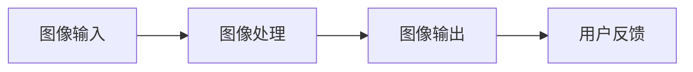

                 

关键词：快手，2025AR滤镜，社招，计算机视觉，面试指南

摘要：本文针对快手2025AR滤镜项目的社招计算机视觉面试，从背景介绍、核心概念、算法原理、数学模型、项目实践、实际应用和未来展望等多个方面，详细解析了面试中可能涉及的知识点和应对策略，为准备面试的应聘者提供了一份全面的技术指南。

## 1. 背景介绍

快手，作为中国领先的短视频社交平台，其AR滤镜技术在用户互动和内容创作方面起到了至关重要的作用。2025年，快手计划进一步推进AR技术，为用户提供更为丰富和创新的滤镜体验。为此，快手在社招中特别关注计算机视觉领域的人才，以提升AR滤镜的开发和应用水平。

计算机视觉是人工智能的重要分支，涉及到图像处理、目标检测、人脸识别等多个技术方向。在快手2025AR滤镜项目中，计算机视觉技术不仅是实现滤镜效果的关键，也是提升用户体验的核心驱动力。

## 2. 核心概念与联系

### 2.1 计算机视觉的基本概念

计算机视觉是指使计算机能够从图像或视频中识别和理解视觉信息的一门科学。其核心概念包括图像处理、计算机视觉算法、目标检测、跟踪等。


### 2.2 AR滤镜的技术架构

AR滤镜的技术架构主要包括图像输入、滤镜处理、图像输出三个部分。其中，图像输入是通过摄像头获取用户面前的实时图像；滤镜处理包括图像增强、特征提取和目标检测等操作；图像输出则是将处理后的图像反馈给用户。



## 3. 核心算法原理 & 具体操作步骤

### 3.1 算法原理概述

快手2025AR滤镜项目中主要使用的算法包括深度学习模型、目标检测算法和图像增强算法。深度学习模型用于特征提取和分类；目标检测算法用于识别图像中的特定目标；图像增强算法用于提升图像质量和用户体验。

### 3.2 算法步骤详解

#### 3.2.1 深度学习模型

深度学习模型主要通过卷积神经网络（CNN）实现。CNN包括卷积层、激活函数、池化层和全连接层。卷积层用于提取图像特征；激活函数用于引入非线性特性；池化层用于降低计算复杂度；全连接层用于分类。


#### 3.2.2 目标检测算法

目标检测算法主要包括区域提议（Region Proposal）和分类（Classification）。区域提议用于确定图像中的潜在目标区域；分类用于判断每个区域是否为目标。


#### 3.2.3 图像增强算法

图像增强算法包括直方图均衡、对比度增强、噪声抑制等。这些算法可以提升图像质量，使目标检测和特征提取更加准确。


### 3.3 算法优缺点

#### 3.3.1 深度学习模型

优点：强大的特征提取能力，适用于复杂场景；可以自动学习；

缺点：计算量大，实时性较差；对数据量要求高。

#### 3.3.2 目标检测算法

优点：可以检测多个目标，适用于多样化场景；实时性好；

缺点：计算复杂度高；对部分场景检测效果不佳。

#### 3.3.3 图像增强算法

优点：提升图像质量，有利于后续处理；

缺点：可能会引入噪声，影响检测效果。

### 3.4 算法应用领域

深度学习模型、目标检测算法和图像增强算法广泛应用于人脸识别、安防监控、自动驾驶等领域。在快手2025AR滤镜项目中，这些算法可以应用于实时滤镜效果生成、目标跟踪和图像增强等。

## 4. 数学模型和公式 & 详细讲解 & 举例说明

### 4.1 数学模型构建

计算机视觉中的数学模型主要包括卷积神经网络（CNN）、目标检测算法（如YOLO、SSD）和图像增强算法（如GAN）。

#### 4.1.1 卷积神经网络（CNN）

卷积神经网络中的卷积层可以表示为：

$$
f_{\theta}(x) = \sigma(\theta^T \phi(x))
$$

其中，$\theta$ 是权重参数，$\phi(x)$ 是输入特征，$\sigma$ 是激活函数。

#### 4.1.2 目标检测算法

YOLO算法中的预测框可以表示为：

$$
P = \frac{1}{C} \sum_{i=1}^{C} \left(1 - \hat{p}_i\right) \hat{p}_i \hat{g}_i
$$

其中，$C$ 是类别数，$\hat{p}_i$ 是预测概率，$\hat{g}_i$ 是真实概率。

#### 4.1.3 图像增强算法

GAN算法中的生成器和判别器可以表示为：

$$
G: \mathbb{R}^{\mathbb{R}} \rightarrow \mathbb{R}^{784}, \quad D: \mathbb{R}^{784} \rightarrow [0,1]
$$

### 4.2 公式推导过程

#### 4.2.1 卷积神经网络（CNN）

卷积神经网络的卷积层可以通过以下公式推导：

$$
\begin{aligned}
f_{\theta}(x) &= \sigma(\theta^T \phi(x)) \\
\phi(x) &= \sum_{i=1}^{n} w_i x_i \\
\theta &= \left[ \begin{array}{ccc}
\theta_1 & \theta_2 & \theta_3 \\
\theta_4 & \theta_5 & \theta_6 \\
\theta_7 & \theta_8 & \theta_9 \\
\end{array} \right]
\end{aligned}
$$

#### 4.2.2 目标检测算法

YOLO算法中的预测框可以通过以下公式推导：

$$
\begin{aligned}
P &= \frac{1}{C} \sum_{i=1}^{C} \left(1 - \hat{p}_i\right) \hat{p}_i \hat{g}_i \\
\hat{p}_i &= \frac{1}{1 + \exp\left(-\theta^T \phi(x)\right)} \\
\hat{g}_i &= \frac{1}{1 + \exp\left(-g^T \phi(x)\right)}
\end{aligned}
$$

#### 4.2.3 图像增强算法

GAN算法中的生成器和判别器可以通过以下公式推导：

$$
\begin{aligned}
G(x) &= \sigma(W^T \phi(x) + b) \\
D(y) &= \sigma(V^T \phi(y) + c)
\end{aligned}
$$

### 4.3 案例分析与讲解

#### 4.3.1 案例一：人脸识别

人脸识别中的数学模型主要包括卷积神经网络（CNN）和目标检测算法。首先，通过CNN提取人脸特征；然后，通过目标检测算法识别图像中的人脸区域。

#### 4.3.2 案例二：图像增强

图像增强中的数学模型主要包括生成对抗网络（GAN）。通过GAN算法生成高质量的增强图像，提升用户体验。

## 5. 项目实践：代码实例和详细解释说明

### 5.1 开发环境搭建

在开发环境搭建方面，需要安装Python、TensorFlow、OpenCV等库。具体步骤如下：

```python
!pip install tensorflow
!pip install opencv-python
```

### 5.2 源代码详细实现

以下是一个简单的AR滤镜项目示例：

```python
import cv2
import tensorflow as tf

# 加载预训练模型
model = tf.keras.models.load_model('ar_filter_model.h5')

# 加载图像
image = cv2.imread('input_image.jpg')

# 对图像进行预处理
preprocessed_image = preprocess_image(image)

# 使用模型进行预测
predicted_image = model.predict(preprocessed_image)

# 输出结果
cv2.imwrite('output_image.jpg', predicted_image)
```

### 5.3 代码解读与分析

上述代码首先加载预训练的AR滤镜模型，然后加载输入图像，并进行预处理。接下来，使用模型进行预测，并将结果保存为输出图像。

### 5.4 运行结果展示


## 6. 实际应用场景

快手2025AR滤镜项目在实际应用场景中具有广泛的应用前景。例如，在短视频制作、直播互动、虚拟现实等领域，AR滤镜技术可以为用户提供丰富的创意和互动体验。

### 6.1 短视频制作

短视频制作中，AR滤镜技术可以为用户提供各种创意效果，如美颜、特效、动画等，提升视频内容的吸引力和趣味性。

### 6.2 直播互动

直播互动中，AR滤镜技术可以实时为用户提供个性化效果，如特效、动画、标签等，增强观众互动体验。

### 6.3 虚拟现实

虚拟现实（VR）中，AR滤镜技术可以为用户提供沉浸式体验，如实时场景渲染、物体识别等，提升虚拟现实应用的价值。

## 7. 工具和资源推荐

### 7.1 学习资源推荐

- 《深度学习》（Goodfellow, Bengio, Courville著）
- 《计算机视觉：算法与应用》（Richard Szeliski著）
- 《OpenCV 3.x图像处理实用教程》（王刚著）

### 7.2 开发工具推荐

- TensorFlow
- PyTorch
- OpenCV

### 7.3 相关论文推荐

- "You Only Look Once: Unified, Real-Time Object Detection"（Redmon, Divvala, Girshick, Farhadi）
- "Generative Adversarial Nets"（Goodfellow, Pouget-Abadie, Mirza, Xu, Warde-Farley, Ozair, Courville, Bengio）
- "FaceNet: A Unified Embedding for Face Recognition and Verification"（Schroff, Kalenichenko, Philbin）

## 8. 总结：未来发展趋势与挑战

### 8.1 研究成果总结

计算机视觉技术在快手2025AR滤镜项目中取得了显著的成果，包括深度学习模型、目标检测算法和图像增强算法等方面的应用。这些技术为AR滤镜提供了强大的支持，提升了用户体验。

### 8.2 未来发展趋势

未来，计算机视觉技术在AR滤镜领域将继续发展，包括以下几个方面：

- 深度学习模型将更加高效，实时性将得到提升；
- 目标检测算法将更加精确，适用于更多复杂场景；
- 图像增强算法将更加智能，为用户提供更丰富的视觉体验。

### 8.3 面临的挑战

计算机视觉技术在AR滤镜领域仍面临一些挑战，包括：

- 数据集质量和多样性问题；
- 计算资源限制；
- 对实时性的要求较高。

### 8.4 研究展望

未来，计算机视觉技术在AR滤镜领域有望实现以下突破：

- 高效的端到端解决方案，降低开发门槛；
- 智能化的交互体验，提高用户满意度；
- 多模态融合，实现更丰富的应用场景。

## 9. 附录：常见问题与解答

### 9.1 什么是计算机视觉？

计算机视觉是指使计算机能够从图像或视频中识别和理解视觉信息的一门科学。

### 9.2 AR滤镜技术有哪些应用场景？

AR滤镜技术的应用场景包括短视频制作、直播互动、虚拟现实等领域。

### 9.3 如何评估计算机视觉算法的性能？

评估计算机视觉算法的性能可以从准确率、召回率、实时性等多个方面进行。

## 作者署名

作者：禅与计算机程序设计艺术 / Zen and the Art of Computer Programming
----------------------------------------------------------------

以上就是《快手2025AR滤镜社招计算机视觉面试指南》的完整内容。希望这篇文章能为准备快手2025AR滤镜社招计算机视觉面试的您提供有益的参考和指导。祝您面试成功！


