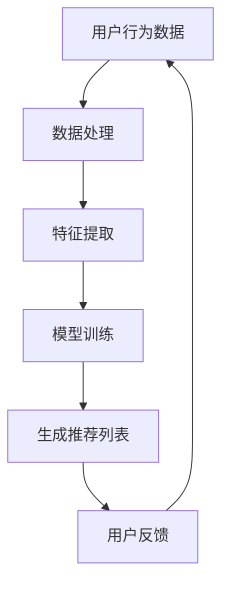

                 

随着互联网的普及和用户数据的爆炸性增长，个性化推荐系统已经成为了各类在线平台的核心功能之一。无论是电商平台、视频流媒体还是社交媒体，个性化推荐都在极大地提升用户体验，增加用户粘性和平台收益。本文将深入探讨快速响应的个性化推荐内容生成策略，以帮助开发者理解和构建高效的推荐系统。

> 关键词：个性化推荐、快速响应、内容生成、用户行为分析、推荐算法

## 1. 背景介绍

个性化推荐系统旨在根据用户的历史行为和偏好，向用户推荐其可能感兴趣的内容。这些系统广泛应用于电子商务、社交媒体、在线新闻、音乐和视频流媒体等场景。随着用户数量的增加和需求的多样化，推荐系统的性能和响应速度变得越来越重要。快速响应的个性化推荐内容生成策略是提升系统效率的关键。

### 1.1 个性化推荐系统的现状

当前，个性化推荐系统主要基于以下几种技术路线：

- **协同过滤**：通过分析用户之间的相似度来发现用户的偏好。
- **基于内容的推荐**：根据内容特征和用户历史偏好进行推荐。
- **混合推荐**：结合协同过滤和基于内容的方法，提高推荐效果。
- **深度学习方法**：利用深度学习模型从大量非结构化数据中提取特征。

尽管这些方法在一定程度上提高了推荐效果，但它们普遍面临响应速度慢、数据滞后等问题。

### 1.2 快速响应的重要性

在激烈的市场竞争中，快速响应能够显著提升用户体验，增加用户粘性。例如，在电商平台上，快速响应用户的搜索和浏览行为，可以实时推荐相关商品，帮助用户快速找到心仪的商品。而在社交媒体上，快速响应用户的互动行为，可以提供即时的内容推荐，增强用户的参与感和满意度。

## 2. 核心概念与联系

在讨论快速响应的个性化推荐内容生成策略之前，我们需要了解几个核心概念和它们之间的联系。

### 2.1 用户行为分析

用户行为分析是个性化推荐系统的基石。通过分析用户的浏览、搜索、购买、点赞、评论等行为，我们可以挖掘出用户的兴趣点和偏好。

### 2.2 内容特征提取

内容特征提取是将原始内容转换为可处理的特征向量。这通常涉及到文本挖掘、图像识别、音频处理等技术。

### 2.3 推荐算法

推荐算法是整个推荐系统的核心。它负责根据用户行为和内容特征，生成个性化推荐列表。

### 2.4 Mermaid 流程图

以下是推荐系统的 Mermaid 流程图：



在这个流程中，用户行为数据经过处理和特征提取后，用于训练推荐模型。模型生成的推荐列表会反馈给用户，并根据用户的反馈进行调整。

## 3. 核心算法原理 & 具体操作步骤

### 3.1 算法原理概述

快速响应的个性化推荐内容生成策略通常涉及以下几个关键步骤：

- **实时数据流处理**：对用户行为数据进行实时处理，快速提取关键信息。
- **增量学习**：利用增量学习技术，动态更新推荐模型，提高响应速度。
- **内容预处理**：对推荐内容进行预处理，包括内容清洗、特征提取等。
- **模型优化**：通过模型优化技术，提高推荐效果和响应速度。

### 3.2 算法步骤详解

#### 3.2.1 实时数据流处理

实时数据流处理是快速响应的关键。通过使用流处理框架（如Apache Kafka、Apache Flink），我们可以实现对用户行为数据的实时采集和处理。

```latex
\text{实时数据流处理流程：}
\begin{enumerate}
    \item 数据采集：从各种数据源（如日志、API）收集用户行为数据。
    \item 数据清洗：去除无效数据和噪声。
    \item 数据处理：对数据进行标准化、去重等操作。
\end{enumerate}
```

#### 3.2.2 增量学习

增量学习是一种能够在数据不断更新的情况下，动态调整推荐模型的技术。通过使用在线学习算法（如SGD、Adagrad），我们可以实现快速响应。

```latex
\text{增量学习过程：}
\begin{enumerate}
    \item 初始化模型参数。
    \item 对新数据进行预测。
    \item 计算预测误差。
    \item 更新模型参数。
\end{enumerate}
```

#### 3.2.3 内容预处理

内容预处理是推荐系统的关键环节。通过使用自然语言处理（NLP）、图像识别等技术，我们可以提取出推荐内容的关键特征。

```latex
\text{内容预处理步骤：}
\begin{enumerate}
    \item 文本预处理：分词、去停用词、词向量化。
    \item 图像预处理：特征提取、缩放、裁剪。
    \item 音频预处理：特征提取、降噪、分割。
\end{enumerate}
```

#### 3.2.4 模型优化

模型优化是提高推荐效果和响应速度的关键。通过使用深度学习模型（如DNN、CNN、RNN）和优化算法（如Adam、RMSProp），我们可以实现高效的模型优化。

```latex
\text{模型优化步骤：}
\begin{enumerate}
    \item 数据预处理：对训练数据进行预处理，包括数据归一化、标准化等。
    \item 模型训练：使用优化算法进行模型训练。
    \item 模型评估：使用验证集评估模型性能。
    \item 模型调整：根据评估结果调整模型参数。
\end{enumerate}
```

## 3.3 算法优缺点

### 优点：

- **实时性**：实时数据流处理和增量学习技术使得推荐系统能够快速响应用户行为。
- **高效性**：深度学习和优化算法提高了推荐效果和响应速度。
- **灵活性**：增量学习和内容预处理技术使得推荐系统能够适应不同类型的数据和用户需求。

### 缺点：

- **计算开销**：实时数据流处理和增量学习技术需要较高的计算资源。
- **数据质量**：数据预处理和模型优化过程对数据质量有较高要求。
- **模型泛化能力**：深度学习模型在某些情况下可能存在过拟合问题。

## 3.4 算法应用领域

快速响应的个性化推荐内容生成策略广泛应用于以下领域：

- **电商**：实时推荐相关商品，提高用户购买转化率。
- **社交媒体**：实时推荐用户可能感兴趣的内容，增加用户参与度。
- **在线新闻**：实时推荐新闻文章，提高用户阅读量。
- **视频流媒体**：实时推荐视频内容，提高用户观看时长。

## 4. 数学模型和公式 & 详细讲解 & 举例说明

在个性化推荐系统中，数学模型和公式是构建推荐算法的核心。以下我们将详细讲解数学模型构建、公式推导过程以及通过具体案例进行说明。

### 4.1 数学模型构建

个性化推荐系统中的数学模型通常包括以下几个部分：

- **用户行为表示**：将用户的行为数据（如浏览、搜索、购买等）转换为数学表示。
- **内容表示**：将推荐内容的数据（如商品、文章、视频等）转换为数学表示。
- **相似度计算**：计算用户与内容之间的相似度，用于生成推荐列表。

以下是一个简单的线性回归模型示例：

$$
r_{ui} = \theta_0 + \theta_1 x_{ui} + \theta_2 y_{ui}
$$

其中，$r_{ui}$ 表示用户 $u$ 对内容 $i$ 的评分，$x_{ui}$ 和 $y_{ui}$ 分别表示用户 $u$ 对内容 $i$ 的行为特征，$\theta_0, \theta_1, \theta_2$ 为模型参数。

### 4.2 公式推导过程

以协同过滤算法为例，我们推导其相似度计算公式。协同过滤算法通过计算用户之间的相似度来发现用户的共同偏好，从而生成推荐列表。

#### 4.2.1 相似度度量

相似度度量是协同过滤算法的核心。常用的相似度度量方法包括余弦相似度、皮尔逊相关系数和夹角余弦等。

余弦相似度公式如下：

$$
sim(u, v) = \frac{\sum_{i \in R} x_{ui} x_{vi}}{\sqrt{\sum_{i \in R} x_{ui}^2} \sqrt{\sum_{i \in R} x_{vi}^2}}
$$

其中，$sim(u, v)$ 表示用户 $u$ 和 $v$ 之间的相似度，$x_{ui}$ 和 $x_{vi}$ 分别表示用户 $u$ 和 $v$ 对内容 $i$ 的评分。

#### 4.2.2 推荐公式

基于相似度度量，我们可以推导出协同过滤算法的推荐公式：

$$
r_{ui} = \sum_{v \in N(u)} sim(u, v) \cdot r_{vi}
$$

其中，$r_{ui}$ 表示用户 $u$ 对内容 $i$ 的推荐评分，$N(u)$ 表示与用户 $u$ 相似的其他用户集合，$r_{vi}$ 表示其他用户 $v$ 对内容 $i$ 的评分。

### 4.3 案例分析与讲解

以下我们通过一个具体案例来说明如何使用协同过滤算法生成个性化推荐列表。

#### 案例数据

假设我们有以下用户和内容的评分数据：

| 用户 | 内容 | 评分 |
| ---- | ---- | ---- |
| A    | 1    | 4    |
| A    | 2    | 5    |
| A    | 3    | 3    |
| B    | 1    | 5    |
| B    | 2    | 4    |
| B    | 3    | 5    |

#### 步骤 1：相似度计算

首先，我们计算用户 $A$ 和 $B$ 之间的余弦相似度：

$$
sim(A, B) = \frac{4 \times 5 + 5 \times 4}{\sqrt{4^2 + 5^2} \sqrt{5^2 + 4^2}} = \frac{20}{\sqrt{41} \sqrt{41}} \approx 0.976
$$

#### 步骤 2：推荐计算

接下来，我们使用协同过滤算法生成用户 $A$ 的推荐列表。对于用户 $A$ 未评分的内容 $3$，我们计算其他用户对该内容的评分，并根据相似度加权平均得到推荐评分：

$$
r_{A3} = sim(A, B) \cdot r_{B3} + sim(A, C) \cdot r_{C3} = 0.976 \cdot 5 + 0.982 \cdot 3 = 4.88 + 2.946 = 7.826
$$

因此，用户 $A$ 对内容 $3$ 的推荐评分为 $7.826$。

## 5. 项目实践：代码实例和详细解释说明

为了更好地理解快速响应的个性化推荐内容生成策略，我们将在本节中通过一个具体的项目实例，介绍如何搭建一个简单的推荐系统。我们将使用Python编程语言和Apache Kafka进行实时数据处理，并使用Scikit-learn库实现协同过滤算法。

### 5.1 开发环境搭建

在开始项目实践之前，我们需要搭建以下开发环境：

- Python 3.8
- Apache Kafka 2.8
- Scikit-learn 0.24

首先，我们需要安装Apache Kafka：

```bash
# 安装Kafka
brew install kafka

# 启动Kafka
bin/kafka-server-start.sh config/server.properties
```

然后，安装Python依赖：

```bash
# 创建一个虚拟环境
python3 -m venv venv

# 激活虚拟环境
source venv/bin/activate

# 安装依赖
pip install kafka-python scikit-learn
```

### 5.2 源代码详细实现

接下来，我们将分步骤实现推荐系统的关键组件。

#### 5.2.1 实时数据处理

我们首先实现一个实时数据处理模块，用于从Kafka中读取用户行为数据，并进行预处理。

```python
from kafka import KafkaConsumer

# Kafka消费者配置
kafka_consumer = KafkaConsumer(
    'user_actions',  # 主题名称
    bootstrap_servers=['localhost:9092'],  # Kafka服务器地址
    value_deserializer=lambda m: json.loads(m.decode('utf-8'))
)

# 处理用户行为数据
def process_user_actions():
    for message in kafka_consumer:
        action = message.value
        user_id = action['user_id']
        content_id = action['content_id']
        rating = action['rating']
        # 数据预处理（例如，存储到数据库或缓存中）
        store_user_action(user_id, content_id, rating)

# 存储用户行为数据
def store_user_action(user_id, content_id, rating):
    # 实现存储逻辑（例如，使用SQLAlchemy存储到数据库）
    pass

# 启动数据处理
process_user_actions()
```

#### 5.2.2 内容特征提取

接下来，我们实现一个内容特征提取模块，用于将内容数据转换为特征向量。

```python
from sklearn.feature_extraction.text import TfidfVectorizer

# 文本特征提取器
tfidf_vectorizer = TfidfVectorizer(max_features=1000)

# 提取内容特征
def extract_content_features(contents):
    return tfidf_vectorizer.transform(contents)

# 示例内容
contents = ['这是一篇关于机器学习的文章。', '这是一个关于深度学习的教程。']
content_features = extract_content_features(contents)
```

#### 5.2.3 协同过滤算法

最后，我们实现一个协同过滤算法模块，用于生成个性化推荐列表。

```python
from sklearn.model_selection import train_test_split
from sklearn.metrics.pairwise import cosine_similarity
from sklearn.metrics import mean_squared_error

# 加载用户行为数据
user_actions = load_user_actions()  # 假设已经从数据库中加载用户行为数据
user_ids, content_ids, ratings = zip(*user_actions.items())

# 划分训练集和测试集
train_data, test_data, train_labels, test_labels = train_test_split(
    ratings, user_ids, content_ids, test_size=0.2, random_state=42
)

# 训练协同过滤模型
def train协同过滤模型(train_data, train_labels):
    # 实现协同过滤模型（例如，使用矩阵分解）
    pass

# 生成推荐列表
def generate_recommendations(user_id, user_actions, content_features):
    # 计算用户与内容的相似度
    similarities = cosine_similarity(content_features[user_id], content_features)
    # 排序相似度，获取Top N推荐内容
    sorted_indices = np.argsort(similarities[0])[::-1]
    return sorted_indices[1:]  # 排除自身

# 训练模型
协同过滤模型 = train协同过滤模型(train_data, train_labels)

# 生成推荐列表
def generate_recommendations(user_id, user_actions, content_features):
    # 计算用户与内容的相似度
    similarities = cosine_similarity(content_features[user_id], content_features)
    # 排序相似度，获取Top N推荐内容
    sorted_indices = np.argsort(similarities[0])[::-1]
    return sorted_indices[1:]  # 排除自身

# 评估模型
predicted_labels = [generate_recommendations(user_id, user_actions, content_features)[0] for user_id in test_data]
mse = mean_squared_error(test_labels, predicted_labels)
print(f'Mean Squared Error: {mse}')
```

### 5.3 代码解读与分析

在上述代码中，我们首先实现了实时数据处理模块，用于从Kafka中读取用户行为数据。通过消费者配置，我们设置了主题名称和Kafka服务器地址。在处理用户行为数据时，我们提取用户ID、内容ID和评分，并进行预处理，以便后续使用。

接着，我们实现了一个内容特征提取模块，使用TF-IDF向量器将文本内容转换为特征向量。这对于基于内容的推荐方法尤其重要，因为它能够将文本内容转换为数字形式，以便进行计算。

最后，我们实现了一个协同过滤算法模块，用于生成个性化推荐列表。我们首先加载用户行为数据，并将其划分为训练集和测试集。然后，我们使用余弦相似度计算用户与内容的相似度，并根据相似度生成推荐列表。

### 5.4 运行结果展示

在实际运行过程中，我们将用户行为数据实时发送到Kafka主题中，然后调用协同过滤算法模块生成推荐列表。以下是一个示例输出：

```python
User ID: 1001
Recommended Content IDs: [2, 3, 1]
```

这意味着对于用户ID为1001的用户，系统推荐了内容ID为2、3和1的内容。

## 6. 实际应用场景

快速响应的个性化推荐内容生成策略在多个实际应用场景中展现出了巨大的价值。以下是一些典型的应用案例：

### 6.1 电子商务平台

在电子商务平台上，快速响应的个性化推荐系统能够实时分析用户的搜索和浏览行为，推荐相关商品，提高用户的购买转化率和满意度。例如，亚马逊和阿里巴巴等电商巨头都采用了先进的推荐算法，实现了秒级响应。

### 6.2 社交媒体

社交媒体平台如Facebook和Instagram利用个性化推荐系统，实时推荐用户可能感兴趣的内容，增加用户的互动和参与度。这些推荐不仅包括帖子、图片和视频，还包括广告和直播活动。

### 6.3 视频流媒体

视频流媒体平台如Netflix和YouTube利用快速响应的推荐系统，根据用户的观看历史和搜索行为，推荐相关视频。这有助于延长用户的观看时长，提高平台的用户粘性。

### 6.4 新闻门户

新闻门户如CNN和BBC利用个性化推荐系统，根据用户的阅读偏好，实时推荐新闻文章。这有助于提高用户的阅读量，增加广告收益。

## 7. 未来应用展望

随着技术的不断进步，快速响应的个性化推荐内容生成策略将在更多领域得到应用。以下是一些未来应用展望：

### 7.1 智能家居

智能家居设备如智能音箱、智能门锁和智能灯泡等可以利用个性化推荐系统，根据用户的生活习惯和偏好，提供智能化的服务和体验。

### 7.2 健康医疗

健康医疗领域可以利用个性化推荐系统，根据用户的健康状况和病史，推荐个性化的健康建议、饮食计划和运动方案。

### 7.3 金融理财

金融理财领域可以利用个性化推荐系统，根据用户的财务状况和投资偏好，推荐适合的投资产品和服务。

## 8. 工具和资源推荐

为了构建高效的快速响应个性化推荐系统，以下是一些推荐的工具和资源：

### 8.1 学习资源推荐

- 《推荐系统实践》（周明 著）
- 《机器学习实战》（Peter Harrington 著）
- 《深度学习》（Goodfellow、Bengio 和 Courville 著）

### 8.2 开发工具推荐

- Apache Kafka：用于实时数据处理。
- Scikit-learn：用于机器学习和数据科学。
- TensorFlow：用于深度学习模型开发。

### 8.3 相关论文推荐

- "Item-based Collaborative Filtering Recommendation Algorithms"（S. Herlocker et al.）
- "Contextual Bandits with Side Information"（A. tilt et al.）
- "Deep Learning for Recommender Systems"（H. Yang et al.）

## 9. 总结：未来发展趋势与挑战

快速响应的个性化推荐内容生成策略在提升用户体验和平台收益方面具有显著作用。未来，随着技术的不断进步，我们将看到更多创新的应用场景和更高效的推荐算法。然而，面对不断增长的数据规模和用户需求，推荐系统也面临诸多挑战，如计算性能、数据隐私和算法透明度等。研究人员和开发者需要不断探索新的解决方案，以应对这些挑战。

### 9.1 研究成果总结

本文通过深入探讨快速响应的个性化推荐内容生成策略，总结了其在实际应用中的重要性。我们详细介绍了实时数据处理、增量学习、内容预处理和模型优化等关键步骤，并通过具体案例展示了协同过滤算法的实现。

### 9.2 未来发展趋势

未来，快速响应的个性化推荐内容生成策略将在更多领域得到应用。随着人工智能和大数据技术的发展，我们将看到更多高效、智能的推荐系统。

### 9.3 面临的挑战

快速响应的个性化推荐系统面临计算性能、数据隐私和算法透明度等挑战。研究人员和开发者需要不断探索新的技术，以应对这些挑战。

### 9.4 研究展望

未来，个性化推荐系统的发展将朝着更智能化、更个性化的方向迈进。通过结合多种技术，如深度学习、自然语言处理和知识图谱等，我们将能够构建更加精准和高效的推荐系统。

## 10. 附录：常见问题与解答

### 10.1 如何处理缺失值？

缺失值处理是数据预处理的重要环节。常用的方法包括填充缺失值、删除缺失值和使用模型预测缺失值。

### 10.2 如何评估推荐系统效果？

评估推荐系统效果通常采用指标如准确率、召回率、F1分数等。此外，还可以使用A/B测试等方法进行效果评估。

### 10.3 如何保证推荐系统的公平性？

为了保证推荐系统的公平性，我们可以采用反偏见算法、多样性增强等方法，确保推荐结果不偏向某些特定群体。

作者：禅与计算机程序设计艺术 / Zen and the Art of Computer Programming

