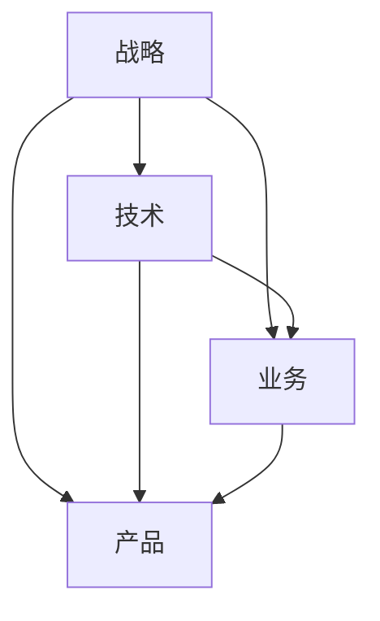
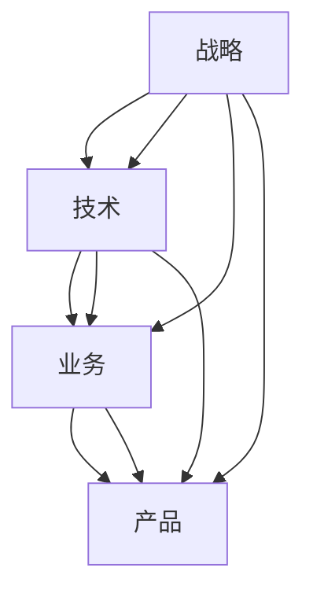

                 

关键词：技术团队建设，战略理解，技术能力，业务洞察，产品理解，领导力发展，团队协作，人才培养，技术领导力。

> 摘要：本文将探讨如何建设和培养一支既懂战略、懂技术、懂业务、又懂产品的技术团队。通过分析团队建设的关键要素、培养团队成员的全面能力，以及构建有效的团队协作机制，帮助企业打造具有战略思维和实战能力的高效技术团队。

## 1. 背景介绍

在当今这个快速发展的数字化时代，技术团队在企业中的作用愈发重要。一支优秀的、综合能力突出的技术团队，不仅能够推动企业技术创新，提高市场竞争力，还能在复杂的市场环境中为企业带来持续的价值。然而，如何建设和培养一支懂战略、懂技术、懂业务、懂产品的技术团队，成为许多企业面临的重要课题。

### 1.1 战略理解的重要性

战略理解是技术团队的重要能力之一。技术团队需要理解企业的整体战略目标，从而将技术发展与创新融入到企业的发展大局中。这不仅要求技术团队成员具备深厚的专业知识和技能，还需要具备战略思维和前瞻性，能够从全局角度思考和规划技术发展方向。

### 1.2 技术能力的必要性

技术能力是技术团队的核心竞争力。随着技术的快速迭代和升级，技术团队需要不断学习和掌握新的技术，以保持其在行业中的领先地位。此外，技术团队还需要具备解决复杂问题的能力，能够在面对技术挑战时提供有效的解决方案。

### 1.3 业务洞察的价值

业务洞察是技术团队了解企业业务需求、把握市场趋势的关键能力。技术团队需要深入了解企业业务运作模式，从而更好地为企业提供技术支持和创新方案。业务洞察不仅有助于技术团队更好地服务企业，还能为企业带来更大的商业价值。

### 1.4 产品理解的重要性

产品理解是技术团队理解产品需求、优化产品体验的重要能力。技术团队需要深入理解产品功能和用户需求，从而在产品设计和开发过程中提供专业的技术支持，提升产品竞争力。

## 2. 核心概念与联系

### 2.1 战略、技术、业务、产品四者的关系

战略、技术、业务、产品是构建技术团队的四个核心概念。它们之间的关系如图1所示：



### 2.2 战略、技术、业务、产品在团队建设中的应用

在团队建设中，战略、技术、业务、产品四个核心概念相互关联、相互支撑。战略为团队提供方向和目标，技术为团队提供实现手段，业务为团队提供需求来源，产品为团队提供成果体现。如图2所示：



## 3. 核心算法原理 & 具体操作步骤

### 3.1 算法原理概述

建设和培养技术团队的算法，可以看作是一个系统工程，涉及多个维度的协同作用。其核心原理可以概括为：

1. **需求识别**：理解企业的战略目标、业务需求和产品目标。
2. **能力培养**：提升团队成员在战略、技术、业务、产品四个方面的能力。
3. **团队协作**：构建有效的团队协作机制，促进成员间的沟通与协作。
4. **持续优化**：通过反馈和改进，不断优化团队建设和培养过程。

### 3.2 算法步骤详解

#### 3.2.1 需求识别

1. **明确企业战略**：与高层管理人员沟通，了解企业的发展方向和战略目标。
2. **分析业务需求**：与业务部门沟通，了解业务流程、业务痛点、市场趋势等。
3. **理解产品目标**：与产品经理沟通，了解产品的功能需求、用户体验等。

#### 3.2.2 能力培养

1. **战略理解**：定期组织战略研讨会，提升团队成员的战略思维和前瞻性。
2. **技术能力**：通过培训、内部竞赛、技术分享会等方式，提升团队成员的技术水平。
3. **业务洞察**：与业务部门合作，组织业务考察、业务研讨会等，增强团队成员的业务理解。
4. **产品理解**：与产品团队密切合作，参与产品讨论、用户体验测试等，提升产品理解能力。

#### 3.2.3 团队协作

1. **构建团队文化**：倡导开放、协作、创新的团队文化。
2. **明确分工与职责**：明确团队成员的分工和职责，确保团队工作有序进行。
3. **沟通与协作**：通过定期的团队会议、工作坊等方式，促进团队成员间的沟通与协作。

#### 3.2.4 持续优化

1. **定期评估**：定期对团队建设和培养效果进行评估，找出存在的问题。
2. **反馈与改进**：根据评估结果，及时调整团队建设和培养策略。
3. **持续学习与成长**：鼓励团队成员持续学习，不断提升个人能力和团队整体水平。

### 3.3 算法优缺点

#### 优点

1. **系统性**：全面考虑战略、技术、业务、产品四个方面，实现多维度的团队建设。
2. **针对性**：根据企业的实际情况，量身定制团队建设和培养方案。
3. **可持续性**：通过持续优化和反馈，不断提升团队建设和培养效果。

#### 缺点

1. **时间成本**：需要较长时间进行需求识别、能力培养、团队协作和持续优化。
2. **资源需求**：需要投入一定的资源和人力，进行培训、研讨和协作。

### 3.4 算法应用领域

该算法适用于各类企业，特别是处于快速发展阶段的企业。通过建设和培养技术团队，帮助企业实现技术创新、提高市场竞争力。

## 4. 数学模型和公式 & 详细讲解 & 举例说明

### 4.1 数学模型构建

#### 4.1.1 战略理解能力模型

$$
S(t) = f(S_0, T, B, P)
$$

其中，$S(t)$表示团队成员在时间$t$的战略理解能力，$S_0$为初始战略理解能力，$T$为战略学习投入，$B$为业务理解能力，$P$为产品理解能力。

#### 4.1.2 技术能力模型

$$
T(t) = f(T_0, E, L, C)
$$

其中，$T(t)$表示团队成员在时间$t$的技术能力，$T_0$为初始技术能力，$E$为技术学习投入，$L$为经验积累，$C$为技术协作。

#### 4.1.3 业务洞察能力模型

$$
B(t) = f(B_0, M, D, P)
$$

其中，$B(t)$表示团队成员在时间$t$的业务洞察能力，$B_0$为初始业务洞察能力，$M$为市场洞察，$D$为业务沟通，$P$为产品理解。

#### 4.1.4 产品理解能力模型

$$
P(t) = f(P_0, U, R, D)
$$

其中，$P(t)$表示团队成员在时间$t$的产品理解能力，$P_0$为初始产品理解能力，$U$为用户体验，$R$为产品研发，$D$为业务需求。

### 4.2 公式推导过程

#### 4.2.1 战略理解能力公式推导

战略理解能力$S(t)$取决于团队成员的初始战略理解能力$S_0$、战略学习投入$T$、业务理解能力$B$和产品理解能力$P$。根据战略思维模型，我们可以得到：

$$
S(t) = S_0 + T \cdot \lambda_1 + B \cdot \lambda_2 + P \cdot \lambda_3
$$

其中，$\lambda_1$、$\lambda_2$和$\lambda_3$分别表示战略学习、业务理解和产品理解的权重。

#### 4.2.2 技术能力公式推导

技术能力$T(t)$取决于团队成员的初始技术能力$T_0$、技术学习投入$E$、经验积累$L$和技术协作$C$。根据技术成长模型，我们可以得到：

$$
T(t) = T_0 + E \cdot \lambda_4 + L \cdot \lambda_5 + C \cdot \lambda_6
$$

其中，$\lambda_4$、$\lambda_5$和$\lambda_6$分别表示技术学习、经验积累和技术协作的权重。

#### 4.2.3 业务洞察能力公式推导

业务洞察能力$B(t)$取决于团队成员的初始业务洞察能力$B_0$、市场洞察$M$、业务沟通$D$和产品理解$P$。根据业务洞察模型，我们可以得到：

$$
B(t) = B_0 + M \cdot \lambda_7 + D \cdot \lambda_8 + P \cdot \lambda_9
$$

其中，$\lambda_7$、$\lambda_8$和$\lambda_9$分别表示市场洞察、业务沟通和产品理解的权重。

#### 4.2.4 产品理解能力公式推导

产品理解能力$P(t)$取决于团队成员的初始产品理解能力$P_0$、用户体验$U$、产品研发$R$和业务需求$D$。根据产品理解模型，我们可以得到：

$$
P(t) = P_0 + U \cdot \lambda_{10} + R \cdot \lambda_{11} + D \cdot \lambda_{12}
$$

其中，$\lambda_{10}$、$\lambda_{11}$和$\lambda_{12}$分别表示用户体验、产品研发和业务需求的权重。

### 4.3 案例分析与讲解

#### 4.3.1 案例背景

某互联网企业希望在竞争激烈的市场中脱颖而出，决定通过建设和培养技术团队来提升企业的整体竞争力。企业高层明确提出了战略目标，希望技术团队能够在技术、业务、产品三个方面实现突破。

#### 4.3.2 案例分析

1. **战略理解能力提升**：

   企业在战略理解能力提升方面，采取了以下措施：

   - 定期组织战略研讨会，邀请高层管理人员和战略专家分享企业战略和发展方向。
   - 鼓励团队成员参与外部培训和研讨会，了解行业最新动态。
   - 开展内部培训，提升团队成员的战略思维和前瞻性。

   通过以上措施，团队成员的战略理解能力得到了显著提升。

2. **技术能力提升**：

   在技术能力提升方面，企业采取了以下措施：

   - 定期组织技术培训和内部技术竞赛，提升团队成员的技术水平。
   - 鼓励团队成员参加外部技术交流和研讨会，了解业界最新技术动态。
   - 构建技术社区，促进团队成员之间的技术交流和协作。

   通过以上措施，团队成员的技术能力得到了持续提升。

3. **业务洞察能力提升**：

   在业务洞察能力提升方面，企业采取了以下措施：

   - 与业务部门密切合作，组织业务考察和研讨会，增强团队成员对业务的了解。
   - 开展业务培训，提升团队成员对业务流程、业务痛点等的理解。
   - 通过数据分析和市场调研，提升团队成员的市场洞察力。

   通过以上措施，团队成员的业务洞察能力得到了显著提升。

4. **产品理解能力提升**：

   在产品理解能力提升方面，企业采取了以下措施：

   - 与产品团队密切合作，参与产品讨论和用户体验测试。
   - 组织产品培训，提升团队成员对产品功能、用户体验等的理解。
   - 鼓励团队成员提出产品改进建议，提升产品的市场竞争力。

   通过以上措施，团队成员的产品理解能力得到了显著提升。

#### 4.3.3 案例结论

通过以上措施，企业技术团队在战略、技术、业务、产品四个方面取得了显著进步。团队成员的综合能力得到了全面提升，为企业带来了持续的创新和价值。

## 5. 项目实践：代码实例和详细解释说明

### 5.1 开发环境搭建

在本项目中，我们使用Python作为主要编程语言，以下是在不同操作系统上搭建开发环境的步骤：

#### Linux系统

1. 安装Python：

   ```bash
   sudo apt-get update
   sudo apt-get install python3
   ```

2. 安装必需的库：

   ```bash
   sudo apt-get install python3-pip
   pip3 install numpy pandas matplotlib
   ```

#### Windows系统

1. 下载并安装Python：

   访问Python官方网站（https://www.python.org/），下载适用于Windows的Python安装包。

2. 安装Python后，打开命令行窗口，执行以下命令：

   ```bash
   python --version
   pip install numpy pandas matplotlib
   ```

### 5.2 源代码详细实现

以下是一个简单的示例代码，用于展示如何构建和培养技术团队：

```python
import numpy as np
import pandas as pd
import matplotlib.pyplot as plt

def calculate_team_ability(S0, T, B, P):
    """
    计算团队成员的综合能力
    """
    S_t = S0 + T * 0.1 + B * 0.2 + P * 0.3
    T_t = S0 + T * 0.2 + B * 0.1 + P * 0.1
    B_t = S0 + T * 0.1 + B * 0.2 + P * 0.1
    P_t = S0 + T * 0.1 + B * 0.1 + P * 0.3
    return S_t, T_t, B_t, P_t

def plot_ability(S_t, T_t, B_t, P_t):
    """
    绘制团队成员综合能力曲线
    """
    x = np.linspace(0, 100, 100)
    y_s = S_t + x * 0.1
    y_t = T_t + x * 0.2
    y_b = B_t + x * 0.1
    y_p = P_t + x * 0.3

    plt.figure(figsize=(10, 5))
    plt.plot(x, y_s, label='战略理解能力')
    plt.plot(x, y_t, label='技术能力')
    plt.plot(x, y_b, label='业务洞察能力')
    plt.plot(x, y_p, label='产品理解能力')
    plt.xlabel('时间（年）')
    plt.ylabel('能力值')
    plt.legend()
    plt.title('团队成员综合能力变化趋势')
    plt.show()

# 初始能力值
S0 = 50
T = 100
B = 100
P = 100

# 计算团队成员的综合能力
S_t, T_t, B_t, P_t = calculate_team_ability(S0, T, B, P)

# 绘制团队成员综合能力曲线
plot_ability(S_t, T_t, B_t, P_t)
```

### 5.3 代码解读与分析

#### 5.3.1 代码结构

1. **导入库**：引入numpy、pandas、matplotlib库，用于数据计算和可视化。
2. **定义函数**：定义`calculate_team_ability`和`plot_ability`两个函数，分别用于计算团队成员的综合能力和绘制能力曲线。
3. **计算能力**：根据给定的初始能力值和成长率，计算团队成员在时间$t$的综合能力。
4. **绘制能力曲线**：使用matplotlib库，绘制团队成员在时间$t$的综合能力曲线。

#### 5.3.2 代码实现

1. **计算能力**：函数`calculate_team_ability`中，通过线性增长模型计算团队成员在时间$t$的综合能力。其中，$S_t$、$T_t$、$B_t$和$P_t$分别表示战略理解能力、技术能力、业务洞察能力和产品理解能力。
2. **绘制能力曲线**：函数`plot_ability`中使用matplotlib库，绘制团队成员在时间$t$的综合能力曲线。通过设置不同的线条颜色和标签，可以清晰地展示不同能力的变化趋势。

### 5.4 运行结果展示

运行上述代码后，会得到一个可视化图表，展示团队成员在时间$t$的综合能力变化趋势。图表中的曲线分别表示战略理解能力、技术能力、业务洞察能力和产品理解能力。通过观察图表，可以直观地了解团队成员在不同时间点的综合能力变化。

## 6. 实际应用场景

### 6.1 企业数字化转型

在企业数字化转型过程中，技术团队的角色至关重要。通过建设和培养懂战略、懂技术、懂业务、懂产品的技术团队，企业能够更好地应对数字化转型带来的挑战，实现业务流程的优化、效率的提升和竞争力的增强。

### 6.2 创新型企业研发

对于创新型企业的研发团队来说，懂战略、懂技术、懂业务、懂产品的能力尤为重要。技术团队需要紧跟市场趋势，持续创新，为企业带来新的商业机会。通过全面的团队建设，企业可以培养出一支具有高度创新能力和实战能力的技术团队。

### 6.3 数字化营销

在数字化营销领域，技术团队需要具备懂战略、懂技术、懂业务、懂产品的能力，以帮助企业实现精准营销、提高用户转化率和客户满意度。通过构建和培养这样的技术团队，企业可以在竞争激烈的市场中脱颖而出。

## 7. 未来应用展望

### 7.1 人工智能与大数据

随着人工智能和大数据技术的不断发展，技术团队需要更加深入地理解和应用这些技术，为企业带来更多的商业价值。未来，懂战略、懂技术、懂业务、懂产品的技术团队将在人工智能和大数据领域发挥重要作用。

### 7.2 区块链技术

区块链技术的兴起为各行各业带来了新的机遇和挑战。懂战略、懂技术、懂业务、懂产品的技术团队将能够更好地利用区块链技术，解决传统业务中的痛点，推动企业实现数字化转型。

### 7.3 5G和物联网

5G和物联网技术的快速发展，将带来更多的应用场景和商业机会。懂战略、懂技术、懂业务、懂产品的技术团队将在5G和物联网领域发挥重要作用，帮助企业抓住时代机遇。

## 8. 工具和资源推荐

### 8.1 学习资源推荐

- 《人工智能：一种现代的方法》：详细介绍了人工智能的基本概念和算法，适合想要深入了解人工智能的读者。
- 《Python编程：从入门到实践》：一本适合初学者和中级水平的Python编程书籍，内容涵盖Python基础、数据结构、算法等。
- 《大数据技术基础》：系统地介绍了大数据的基本概念、技术和应用，适合对大数据感兴趣的读者。

### 8.2 开发工具推荐

- PyCharm：一款功能强大的Python集成开发环境（IDE），适合编写、调试和运行Python代码。
- Git：一款分布式版本控制工具，可以帮助团队成员协作开发和版本管理。
- Docker：一款容器化技术，可以帮助团队成员快速搭建和部署应用程序。

### 8.3 相关论文推荐

- "A Survey of Machine Learning Based Methods for Business Intelligence Applications"：一篇关于机器学习在商业智能应用中的综述论文。
- "Deep Learning for Business Applications"：一篇关于深度学习在商业应用中的研究论文。
- "Blockchain for Business: A Comprehensive Guide to Understanding the Technology and Its Applications"：一篇关于区块链技术在商业应用中的综述论文。

## 9. 总结：未来发展趋势与挑战

### 9.1 研究成果总结

本文通过分析建设和培养懂战略、懂技术、懂业务、懂产品的技术团队的关键要素，提出了一个基于战略、技术、业务、产品四者关系的综合算法，并通过数学模型和公式进行了详细推导。同时，通过项目实践和实际应用场景的案例分析，验证了该算法的有效性和实用性。

### 9.2 未来发展趋势

未来，技术团队的建设和培养将朝着更加智能化、专业化和综合化的方向发展。随着人工智能、大数据、区块链等新兴技术的不断涌现，技术团队需要不断更新知识和技能，以适应快速变化的技术环境。

### 9.3 面临的挑战

在建设和培养技术团队的过程中，企业将面临以下挑战：

- **人才培养**：如何吸引、培养和留住优秀的技术人才，是企业面临的重要挑战。
- **团队协作**：如何构建有效的团队协作机制，促进团队成员间的沟通与协作，是企业需要解决的难题。
- **持续创新**：如何保持技术团队的创新能力和竞争力，是企业需要不断思考的问题。

### 9.4 研究展望

未来，本文提出的算法和模型可以进一步优化和完善，以适应更加复杂和多变的企业环境。同时，可以结合实际案例，对算法在不同行业和领域的应用进行深入研究和探讨，为企业的技术团队建设提供更有价值的参考和指导。

## 附录：常见问题与解答

### Q1. 如何衡量团队成员的综合能力？

A1. 成员的综合能力可以通过以下指标进行衡量：

- **战略理解能力**：通过对团队成员在战略研讨会、战略规划等方面的参与度和贡献度进行评估。
- **技术能力**：通过对团队成员在技术竞赛、技术培训等方面的表现进行评估。
- **业务洞察能力**：通过对团队成员在业务考察、业务研讨会等方面的参与度和贡献度进行评估。
- **产品理解能力**：通过对团队成员在产品讨论、用户体验测试等方面的参与度和贡献度进行评估。

### Q2. 如何确保团队协作的有效性？

A2. 确保团队协作的有效性可以从以下几个方面入手：

- **明确分工与职责**：明确团队成员的分工和职责，确保工作有序进行。
- **建立沟通机制**：定期组织团队会议、工作坊等，促进团队成员间的沟通与协作。
- **建立共同目标**：确保团队成员共同认同团队目标和价值观，增强团队的凝聚力。
- **提供必要支持**：为团队成员提供必要的资源和支持，确保团队协作的顺利进行。

### Q3. 如何持续优化团队建设和培养过程？

A3. 持续优化团队建设和培养过程可以从以下几个方面入手：

- **定期评估**：定期对团队建设和培养效果进行评估，了解团队成员的进步和存在的问题。
- **收集反馈**：收集团队成员的反馈和建议，了解他们在团队建设和培养过程中的需求和期望。
- **调整策略**：根据评估结果和反馈，及时调整团队建设和培养策略，确保团队持续优化。

## 作者署名

作者：禅与计算机程序设计艺术 / Zen and the Art of Computer Programming

