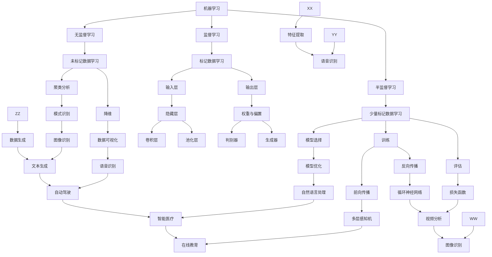

                 

## 1. 背景介绍

在信息时代，数据的爆炸性增长和技术的发展催生了大量新兴技术和应用。从大数据、云计算到人工智能，这些技术的出现不仅改变了我们的生活方式，还深刻地影响了各行各业。然而，在这众多技术中，有一种技术因其深远的理论和实践价值而备受瞩目，那就是人工智能。

人工智能（Artificial Intelligence，简称AI）作为计算机科学的一个重要分支，旨在使计算机模拟人类的认知能力，如学习、推理、感知和决策等。近年来，随着深度学习、神经网络等技术的迅猛发展，人工智能取得了前所未有的突破，从自动驾驶、智能客服到医疗诊断，AI的应用场景越来越广泛。

然而，人工智能的成功并非仅仅依赖于算法和技术的进步，更重要的是其背后所蕴含的思想深度。本文将探讨人工智能的核心概念，从基本原理到实际应用，力求为读者揭示这一领域背后的洞见和思维方法。

本文的结构如下：

- **第1章**：背景介绍。简要介绍人工智能的背景和发展，以及本文的研究目的和内容。
- **第2章**：核心概念与联系。深入探讨人工智能的基本概念和理论框架，包括机器学习、神经网络、深度学习等。
- **第3章**：核心算法原理 & 具体操作步骤。详细介绍人工智能领域中的核心算法，如监督学习、无监督学习和强化学习等，并给出具体的操作步骤。
- **第4章**：数学模型和公式 & 详细讲解 & 举例说明。探讨人工智能中的数学模型和公式，并借助实际案例进行详细解释。
- **第5章**：项目实践：代码实例和详细解释说明。通过一个实际的代码实例，展示人工智能的应用过程和关键步骤。
- **第6章**：实际应用场景。探讨人工智能在不同领域的实际应用，包括医疗、金融、教育等。
- **第7章**：工具和资源推荐。推荐一些学习资源和开发工具，帮助读者更好地理解和应用人工智能。
- **第8章**：总结：未来发展趋势与挑战。总结人工智能的研究成果，探讨未来发展趋势和面临的挑战。
- **第9章**：附录：常见问题与解答。回答读者可能遇到的一些常见问题。

通过本文的阅读，读者不仅可以对人工智能有一个全面的了解，还能深入思考这一领域的思想和洞见。希望本文能够为读者带来启发和思考，共同探索人工智能的深度和广度。

## 2. 核心概念与联系

在深入探讨人工智能之前，我们需要先了解一些核心概念和它们之间的联系。这些概念包括机器学习、神经网络、深度学习等。它们共同构成了人工智能的理论框架，是理解和应用人工智能的基础。

### 2.1 机器学习

机器学习（Machine Learning，简称ML）是人工智能的核心组成部分之一。它是一门研究如何让计算机从数据中学习，并对新数据进行预测或决策的学科。机器学习可以分为三种类型：监督学习（Supervised Learning）、无监督学习（Unsupervised Learning）和半监督学习（Semi-supervised Learning）。

- **监督学习**：在这种学习方式中，计算机通过学习一个标记好的数据集来建立模型。标记数据通常包括输入和输出，如图像中的物体分类问题，输入是图像，输出是物体的标签。
- **无监督学习**：与监督学习相反，无监督学习没有标记的数据。计算机需要从未标记的数据中学习模式和结构，如聚类分析或降维。
- **半监督学习**：介于监督学习和无监督学习之间，半监督学习利用少量的标记数据和大量的未标记数据来训练模型。

机器学习的关键步骤包括数据收集、数据预处理、模型选择、训练和评估。其中，数据预处理是保证模型性能的重要步骤，包括数据清洗、特征提取和归一化等。

### 2.2 神经网络

神经网络（Neural Network，简称NN）是一种模仿生物神经系统的计算模型。它由大量相互连接的神经元组成，通过这些神经元之间的交互，实现数据的处理和信息的传递。神经网络的核心思想是通过调整神经元之间的权重来优化模型性能。

- **前向传播（Forward Propagation）**：输入数据从输入层传递到隐藏层，再传递到输出层。在这个过程中，每个神经元都会通过其权重和偏置进行计算。
- **反向传播（Backpropagation）**：通过比较输出层的实际输出与期望输出，计算损失函数。然后，将损失函数的梯度反向传播到隐藏层和输入层，以调整权重和偏置。

神经网络的训练过程是一个迭代的过程，通过不断调整权重和偏置，使得模型能够更好地拟合训练数据。常见的神经网络结构包括多层感知机（MLP）、卷积神经网络（CNN）和循环神经网络（RNN）。

### 2.3 深度学习

深度学习（Deep Learning，简称DL）是神经网络的一种特殊形式，其特点是拥有多层隐藏层。深度学习的出现极大地提升了人工智能的性能，使其在图像识别、语音识别和自然语言处理等领域取得了突破性的进展。

- **卷积神经网络（CNN）**：适用于处理图像数据。通过卷积层、池化层和全连接层等结构，CNN能够自动提取图像中的特征，实现高效的图像分类和物体检测。
- **循环神经网络（RNN）**：适用于处理序列数据，如文本和语音。RNN能够通过隐藏状态的记忆，实现长距离依赖的建模。
- **生成对抗网络（GAN）**：由生成器和判别器组成，通过对抗训练，GAN能够生成高质量的图像和文本。

深度学习的成功不仅依赖于算法的创新，还依赖于大规模数据和强大的计算能力。近年来，随着计算资源和数据量的不断提升，深度学习在各个领域都取得了显著的成果。

### 2.4 核心概念联系

机器学习、神经网络和深度学习虽然各自独立，但它们之间有着密切的联系。机器学习为神经网络和深度学习提供了理论基础和训练方法；神经网络和深度学习则为机器学习提供了更有效的模型和算法。

- **机器学习**提供了从数据中学习的方法和框架，神经网络和深度学习则是实现这一过程的技术手段。
- **神经网络**作为机器学习的一种形式，通过模拟生物神经系统，实现了对数据的复杂建模和特征提取。
- **深度学习**则在神经网络的基础上，通过多层结构的引入，进一步提升了模型的性能和适用范围。

通过理解这些核心概念及其联系，我们可以更好地把握人工智能的发展趋势和应用方向。在接下来的章节中，我们将进一步探讨人工智能的核心算法和数学模型，为读者揭示这一领域的深度和广度。

### 2.5 Mermaid 流程图（核心概念原理和架构）

为了更直观地展示人工智能的核心概念和架构，我们可以使用Mermaid流程图来描述。以下是机器学习、神经网络和深度学习三个核心概念之间的联系和架构：



### 2.6 Mermaid 流程图（核心概念原理和架构）

为了更直观地展示人工智能的核心概念和架构，我们可以使用Mermaid流程图来描述。以下是机器学习、神经网络和深度学习三个核心概念之间的联系和架构：


### 3. 核心算法原理 & 具体操作步骤

在人工智能领域，核心算法的原理和具体操作步骤是理解和应用人工智能的关键。本章节将详细介绍几种核心算法：监督学习、无监督学习和强化学习，并给出具体的操作步骤。

### 3.1 监督学习

监督学习是最常见的机器学习技术，通过学习一个标记好的数据集来建立模型，并对新数据进行预测或分类。

#### 监督学习原理

监督学习的过程可以分为以下几个步骤：

1. **数据收集**：收集带有标记的输入数据，如图像中的物体标签。
2. **数据预处理**：对收集到的数据进行处理，包括数据清洗、归一化和特征提取。
3. **模型选择**：根据问题的特点选择合适的模型，如线性回归、决策树、支持向量机等。
4. **模型训练**：通过学习算法调整模型的参数，使其能够更好地拟合训练数据。
5. **模型评估**：使用测试数据对模型进行评估，计算模型的准确率、召回率等指标。

#### 具体操作步骤

以线性回归为例，线性回归是一种用于预测连续值的模型。具体操作步骤如下：

1. **数据收集**：收集带有标记的输入数据，如房价数据，包括房屋的面积、地点等信息，以及对应的房价。
2. **数据预处理**：对收集到的数据进行归一化处理，使其具有相同的量纲。
3. **模型选择**：选择线性回归模型。
4. **模型训练**：通过最小二乘法计算模型的参数，使预测值与真实值之间的误差最小。
5. **模型评估**：使用测试数据对模型进行评估，计算模型的均方误差（MSE）等指标。

#### 监督学习优缺点

- **优点**：监督学习模型易于理解和实现，能够对新数据进行准确的预测。
- **缺点**：需要大量的标记数据，且模型的泛化能力有限。

### 3.2 无监督学习

无监督学习是机器学习的另一种形式，不需要标记的数据，主要任务是发现数据中的模式和结构。

#### 无监督学习原理

无监督学习的过程可以分为以下几个步骤：

1. **数据收集**：收集未标记的数据。
2. **数据预处理**：对数据进行归一化处理。
3. **模型选择**：根据问题的特点选择合适的模型，如聚类分析、降维等。
4. **模型训练**：通过学习算法调整模型的参数。
5. **模型评估**：使用内部评估指标，如簇内距离等。

#### 具体操作步骤

以K-means聚类算法为例，K-means是一种常用的聚类算法。具体操作步骤如下：

1. **数据收集**：收集未标记的数据，如客户购买行为数据。
2. **数据预处理**：对数据进行归一化处理。
3. **模型选择**：选择K-means聚类算法。
4. **模型训练**：随机选择K个中心点，然后迭代更新中心点，使得每个数据点与中心点的距离最小。
5. **模型评估**：计算簇内距离（Intra-cluster distance），评估聚类效果。

#### 无监督学习优缺点

- **优点**：不需要标记数据，能够发现数据中的隐藏模式。
- **缺点**：聚类结果依赖于初始中心点的选择，且无法对新数据进行预测。

### 3.3 强化学习

强化学习（Reinforcement Learning，简称RL）是一种通过奖励机制来学习策略的机器学习方法。强化学习常用于决策问题，如游戏、自动驾驶等。

#### 强化学习原理

强化学习的过程可以分为以下几个步骤：

1. **环境（Environment）**：环境是一个定义了状态和动作的动态系统。
2. **状态（State）**：状态是环境中的一个特定情况。
3. **动作（Action）**：动作是环境中的一个操作。
4. **奖励（Reward）**：奖励是动作带来的即时回报。
5. **策略（Policy）**：策略是选择动作的规则。

强化学习的过程是一个迭代的过程，通过不断尝试不同的动作，学习最优策略。

#### 具体操作步骤

以Q-learning算法为例，Q-learning是一种常用的强化学习算法。具体操作步骤如下：

1. **初始化**：初始化Q值表，所有Q值设置为0。
2. **选择动作**：根据当前状态选择一个动作。
3. **执行动作**：在环境中执行选择的动作。
4. **更新Q值**：根据新的状态和奖励，更新Q值表。
5. **迭代**：重复步骤2-4，直到达到停止条件。

#### 强化学习优缺点

- **优点**：能够学习到最优策略，适用于动态和复杂环境。
- **缺点**：学习过程较慢，需要大量的数据和计算资源。

### 3.4 算法优缺点及应用领域

- **监督学习**：适用于有标记数据的问题，如分类和回归。优点是预测准确，但需要大量标记数据。
- **无监督学习**：适用于没有标记数据的问题，如聚类和降维。优点是不依赖标记数据，但聚类结果依赖于初始条件。
- **强化学习**：适用于决策问题，如游戏和自动驾驶。优点是能够学习到最优策略，但学习过程较慢。

综上所述，不同类型的算法适用于不同的问题场景，理解和应用这些算法的原理和操作步骤，能够帮助我们更好地解决实际问题。

### 3.5 算法优缺点及应用领域

在了解了监督学习、无监督学习和强化学习的基本原理和操作步骤后，我们接下来探讨这些算法的优缺点以及它们在不同应用领域的适用性。

#### 监督学习的优缺点

**优点**：

1. **预测准确性高**：监督学习模型通过学习标记数据，可以对新数据进行准确的预测。
2. **应用广泛**：从图像识别到自然语言处理，许多机器学习任务都可以使用监督学习模型。
3. **易于理解和实现**：监督学习模型的结构相对简单，容易理解和使用。

**缺点**：

1. **需要大量标记数据**：监督学习模型需要大量的标记数据进行训练，这在实际应用中可能难以实现。
2. **泛化能力有限**：由于模型的训练数据有限，监督学习模型的泛化能力可能受到限制。
3. **计算资源需求高**：特别是对于大规模数据和复杂的模型，计算资源的需求可能较高。

**应用领域**：

- **图像识别**：如人脸识别、物体识别。
- **自然语言处理**：如情感分析、文本分类。
- **医疗诊断**：如疾病预测、医学图像分析。

#### 无监督学习的优缺点

**优点**：

1. **无需标记数据**：无监督学习不需要标记的数据，适用于大规模数据集。
2. **模式发现能力强**：无监督学习能够自动发现数据中的隐藏模式。
3. **降维和聚类**：如K-means聚类、主成分分析（PCA）等，在降维和聚类任务中表现出色。

**缺点**：

1. **聚类结果依赖初始条件**：无监督学习的结果往往依赖于初始参数的选择，如K-means中的初始聚类中心。
2. **无监督学习的评估较难**：由于缺乏标记数据，无监督学习的模型评估相对困难。
3. **难以直接应用于预测任务**：无监督学习模型主要用于数据分析和探索，而不是直接的预测。

**应用领域**：

- **数据探索**：如异常检测、数据挖掘。
- **推荐系统**：如协同过滤、用户兴趣分析。
- **生物信息学**：如基因组数据分析、蛋白质结构预测。

#### 强化学习的优缺点

**优点**：

1. **能够学习到最优策略**：强化学习通过奖励机制，能够学习到最优策略，适用于动态和复杂环境。
2. **适用于决策问题**：强化学习在游戏、自动驾驶、机器人等领域表现出色。
3. **适应性强**：强化学习模型能够根据环境变化自适应调整策略。

**缺点**：

1. **学习过程较慢**：强化学习需要大量的交互和迭代，学习过程较慢。
2. **需要大量的数据和计算资源**：特别是对于复杂的任务，强化学习需要大量的数据和计算资源。
3. **模型解释性较差**：强化学习模型的策略通常难以解释和理解。

**应用领域**：

- **游戏**：如围棋、电子竞技。
- **自动驾驶**：如自动驾驶汽车、无人机。
- **机器人**：如机器人路径规划、机器人手臂控制。

综上所述，不同类型的算法在优缺点和应用领域上各有特色。理解和选择合适的算法，能够帮助我们更好地解决实际问题，推动人工智能技术的发展和应用。

### 3.6 算法应用领域

人工智能（AI）算法在众多领域中展现出了卓越的性能和广泛的应用价值。以下是几种核心算法在具体应用领域中的应用实例：

#### 3.6.1 图像识别

图像识别是AI技术的重要应用之一，广泛应用于安全监控、医疗诊断、自动驾驶等领域。

- **安全监控**：通过监督学习算法，如卷积神经网络（CNN），图像识别系统能够自动识别和检测监控视频中的异常行为，如闯入者或火灾。
- **医疗诊断**：AI算法能够分析医学图像，如X光片、CT扫描和MRI图像，帮助医生进行疾病诊断。例如，AI系统可以通过分析乳腺X光图像来检测乳腺癌。
- **自动驾驶**：自动驾驶汽车使用AI算法，尤其是CNN，来识别道路上的行人、车辆和交通标志，确保行车安全。

#### 3.6.2 自然语言处理（NLP）

自然语言处理是AI技术的另一个关键领域，涉及文本理解、语音识别和机器翻译等任务。

- **文本理解**：AI算法，如循环神经网络（RNN）和变压器（Transformer），能够理解和处理文本，应用于情感分析、内容审核和问答系统。
- **语音识别**：AI技术，如深度神经网络和隐藏马尔可夫模型（HMM），被广泛应用于语音助手（如苹果的Siri、亚马逊的Alexa）和电话客服系统中。
- **机器翻译**：机器翻译系统，如基于神经网络的翻译模型（NMT），能够将一种语言翻译成另一种语言，提高了跨语言沟通的效率。

#### 3.6.3 金融分析

金融分析是AI算法的重要应用领域，涉及风险评估、欺诈检测和投资策略等。

- **风险评估**：AI模型能够分析大量的金融数据，如股票价格和交易记录，预测市场趋势和风险。
- **欺诈检测**：监督学习算法，如支持向量机（SVM）和随机森林，能够识别和防止金融交易中的欺诈行为。
- **投资策略**：AI算法能够通过分析历史数据和市场动态，为投资者提供个性化的投资建议和策略。

#### 3.6.4 机器人技术

机器人技术是AI在工业和日常生活中的重要应用领域，涉及路径规划、物体识别和交互等。

- **工业机器人**：AI算法帮助工业机器人进行精确的路径规划和任务执行，提高了生产效率和质量。
- **服务机器人**：AI技术使得服务机器人能够理解人类的语音指令、识别周围环境和物体，提供高效便捷的服务，如酒店机器人、导览机器人。
- **人机交互**：AI算法能够理解人类的肢体语言和面部表情，实现更自然的人机交互体验。

#### 3.6.5 医疗诊断

医疗诊断是AI技术的重要应用领域，通过AI算法，可以实现更准确、更快速的疾病检测和治疗方案制定。

- **疾病预测**：AI算法能够通过分析患者的健康数据，如基因序列、病史和生活方式，预测疾病的发生风险。
- **医学影像分析**：AI算法能够分析医学影像，如X光片、CT扫描和MRI图像，辅助医生进行诊断。
- **个性化治疗**：基于患者数据和AI算法，医生可以为患者制定个性化的治疗方案，提高治疗效果。

总之，人工智能算法在多个领域展现出了强大的应用潜力。随着算法和技术的不断进步，AI将在更多领域发挥重要作用，推动社会的进步和发展。

### 4. 数学模型和公式

在人工智能领域，数学模型和公式是理解和实现算法的重要工具。本章节将介绍几种常见的数学模型和公式，并详细讲解其构建和推导过程，辅以实际案例进行说明。

#### 4.1 数学模型构建

数学模型是描述现实世界问题的数学表达式。在人工智能领域，常见的数学模型包括线性模型、非线性模型和概率模型等。

**线性模型**：线性模型是最基本的数学模型之一，通常用于描述线性关系。其数学表达式为：

\[ y = \beta_0 + \beta_1 \cdot x \]

其中，\( y \) 是因变量，\( x \) 是自变量，\( \beta_0 \) 和 \( \beta_1 \) 是模型的参数。

**非线性模型**：非线性模型用于描述非线性关系。常见的形式包括多项式模型、指数模型和对数模型等。例如，多项式模型可以表示为：

\[ y = \beta_0 + \beta_1 \cdot x + \beta_2 \cdot x^2 \]

**概率模型**：概率模型用于描述随机事件的发生概率。常见的概率模型包括贝叶斯模型、马尔可夫模型和隐马尔可夫模型等。例如，贝叶斯模型的数学表达式为：

\[ P(A|B) = \frac{P(B|A) \cdot P(A)}{P(B)} \]

#### 4.2 公式推导过程

在数学模型的构建过程中，公式的推导是一个关键步骤。以下是一个简单的线性模型公式的推导过程：

假设我们有如下线性模型：

\[ y = \beta_0 + \beta_1 \cdot x \]

我们的目标是找到模型参数 \( \beta_0 \) 和 \( \beta_1 \)。这可以通过最小二乘法实现。具体步骤如下：

1. **损失函数**：定义损失函数，通常使用均方误差（MSE）：

\[ J(\theta) = \frac{1}{2m} \sum_{i=1}^{m} (h_\theta(x^{(i)}) - y^{(i)})^2 \]

其中，\( h_\theta(x) = \theta_0 + \theta_1 \cdot x \) 是假设函数，\( m \) 是样本数量。

2. **梯度下降**：使用梯度下降法，迭代更新参数 \( \theta_0 \) 和 \( \theta_1 \)：

\[ \theta_j := \theta_j - \alpha \cdot \frac{\partial J(\theta)}{\partial \theta_j} \]

其中，\( \alpha \) 是学习率，\( j \) 是参数的索引。

3. **计算梯度**：计算损失函数的梯度：

\[ \frac{\partial J(\theta)}{\partial \theta_0} = \frac{1}{m} \sum_{i=1}^{m} (h_\theta(x^{(i)}) - y^{(i)}) \]

\[ \frac{\partial J(\theta)}{\partial \theta_1} = \frac{1}{m} \sum_{i=1}^{m} (h_\theta(x^{(i)}) - y^{(i)}) \cdot x^{(i)} \]

#### 4.3 案例分析与讲解

为了更好地理解数学模型和公式的应用，我们来看一个实际案例。

**案例**：预测房价

假设我们有一个数据集，包含房屋的面积和对应的房价。我们的目标是建立一个线性模型，预测新房屋的房价。

1. **数据预处理**：对面积和房价进行归一化处理，使其具有相同的量纲。
2. **模型构建**：选择线性模型 \( y = \beta_0 + \beta_1 \cdot x \)。
3. **模型训练**：使用最小二乘法，通过梯度下降法迭代更新模型参数 \( \beta_0 \) 和 \( \beta_1 \)。
4. **模型评估**：使用测试数据集评估模型的预测性能。

通过以上步骤，我们可以建立并训练一个线性模型，用于预测房价。

总之，数学模型和公式是人工智能领域的重要工具。理解和掌握这些模型和公式，能够帮助我们更好地理解和应用人工智能技术。

### 4.4 数学模型和公式详解

在人工智能领域，数学模型和公式扮演着至关重要的角色，它们帮助我们理解和实现复杂的算法，从数据中提取有用的信息。本章节将详细介绍一些关键数学模型和公式，并探讨其在不同应用场景中的具体作用。

#### 4.4.1 线性回归模型

线性回归模型是机器学习中最为基础且广泛应用的一种模型，用于预测一个或多个连续变量的值。其最简单的形式如下：

\[ y = \beta_0 + \beta_1 \cdot x + \epsilon \]

其中，\( y \) 是因变量，\( x \) 是自变量，\( \beta_0 \) 和 \( \beta_1 \) 是模型的参数，表示斜率和截距，\( \epsilon \) 是误差项。

**推导过程**：

线性回归模型的推导主要依赖于最小二乘法。我们的目标是找到最优的 \( \beta_0 \) 和 \( \beta_1 \)，使得实际值 \( y \) 和预测值 \( \hat{y} = \beta_0 + \beta_1 \cdot x \) 之间的误差最小。均方误差（MSE）是常用的误差度量，其计算公式为：

\[ J(\beta_0, \beta_1) = \frac{1}{2} \sum_{i=1}^{m} (y_i - \hat{y}_i)^2 \]

为了最小化 \( J(\beta_0, \beta_1) \)，我们对 \( J \) 关于 \( \beta_0 \) 和 \( \beta_1 \) 分别求偏导数，并令其等于0，得到以下两个方程：

\[ \frac{\partial J}{\partial \beta_0} = -\sum_{i=1}^{m} (y_i - \hat{y}_i) = 0 \]

\[ \frac{\partial J}{\partial \beta_1} = -\sum_{i=1}^{m} (y_i - \hat{y}_i) \cdot x_i = 0 \]

通过解这两个方程，我们可以得到最优的 \( \beta_0 \) 和 \( \beta_1 \)：

\[ \beta_0 = \bar{y} - \beta_1 \bar{x} \]

\[ \beta_1 = \frac{\sum_{i=1}^{m} (x_i - \bar{x})(y_i - \bar{y})}{\sum_{i=1}^{m} (x_i - \bar{x})^2} \]

其中，\( \bar{y} \) 和 \( \bar{x} \) 分别是 \( y \) 和 \( x \) 的平均值。

**案例**：预测房价

假设我们有一个包含房屋面积 \( x \) 和房价 \( y \) 的数据集，我们的目标是建立一个线性回归模型来预测新房屋的房价。通过最小二乘法，我们可以计算出模型参数 \( \beta_0 \) 和 \( \beta_1 \)，从而得到预测公式：

\[ y = \beta_0 + \beta_1 \cdot x \]

例如，如果房屋面积为1000平方米，我们可以通过模型预测其房价为：

\[ y = \beta_0 + \beta_1 \cdot 1000 \]

#### 4.4.2 逻辑回归模型

逻辑回归模型是一种用于分类问题的统计模型，其目的是通过输入特征来预测一个二分类结果。逻辑回归的数学表达式为：

\[ P(y=1 | x; \beta) = \frac{1}{1 + \exp(-\beta_0 - \beta_1 \cdot x)} \]

其中，\( P(y=1 | x; \beta) \) 表示在给定特征 \( x \) 和模型参数 \( \beta \) 下，类别为1的概率。

**推导过程**：

逻辑回归的推导基于最大似然估计（MLE）。我们的目标是找到一组参数 \( \beta \)，使得数据点的似然函数最大。似然函数的计算公式为：

\[ L(\beta) = \prod_{i=1}^{m} p(y_i=1 | x_i; \beta) \cdot (1 - p(y_i=1 | x_i; \beta)) \]

其中，\( p(y_i=1 | x_i; \beta) \) 是逻辑回归的概率表达式。

为了简化计算，我们使用对数似然函数：

\[ l(\beta) = \sum_{i=1}^{m} \left[ y_i \cdot (\beta_0 + \beta_1 \cdot x_i) - \ln(1 + \exp(\beta_0 + \beta_1 \cdot x_i)) \right] \]

为了找到最优的 \( \beta \)，我们对 \( l(\beta) \) 分别关于 \( \beta_0 \) 和 \( \beta_1 \) 求偏导数，并令其等于0：

\[ \frac{\partial l(\beta)}{\partial \beta_0} = \sum_{i=1}^{m} \left[ y_i - \exp(\beta_0 + \beta_1 \cdot x_i) \right] = 0 \]

\[ \frac{\partial l(\beta)}{\partial \beta_1} = \sum_{i=1}^{m} \left[ y_i \cdot x_i - \exp(\beta_0 + \beta_1 \cdot x_i) \cdot x_i \right] = 0 \]

通过解这两个方程，我们可以得到最优的 \( \beta_0 \) 和 \( \beta_1 \)：

\[ \beta_0 = \bar{y} - \beta_1 \bar{x} \]

\[ \beta_1 = \frac{\sum_{i=1}^{m} (y_i - \exp(\beta_0 + \beta_1 \cdot x_i)) \cdot x_i}{\sum_{i=1}^{m} (x_i - \bar{x})^2} \]

**案例**：垃圾邮件分类

假设我们有一个邮件数据集，每个邮件都包含一组特征（如邮件标题中的单词数量、使用频率等）和是否为垃圾邮件的标签。我们的目标是建立一个逻辑回归模型来预测新邮件是否为垃圾邮件。通过最大似然估计，我们可以计算出模型参数 \( \beta_0 \) 和 \( \beta_1 \)，从而得到预测公式：

\[ P(y=1 | x; \beta) = \frac{1}{1 + \exp(-\beta_0 - \beta_1 \cdot x)} \]

例如，如果新邮件的特征向量为 \( x \)，我们可以通过模型计算其是否为垃圾邮件的概率，从而做出分类决策。

#### 4.4.3 支持向量机（SVM）

支持向量机（SVM）是一种强大的分类和回归算法，其核心思想是找到一个最优的超平面，将不同类别的数据点分隔开。SVM的数学表达式为：

\[ w \cdot x - b = 0 \]

其中，\( w \) 是权重向量，\( x \) 是特征向量，\( b \) 是偏置项。

**推导过程**：

SVM的目标是找到一个最优的超平面，使得类内数据点的间隔最大。间隔（margin）定义为：

\[ \frac{1}{\|w\|} \]

其中，\( \|w\| \) 是权重向量的欧几里得范数。

为了最大化间隔，我们使用拉格朗日乘子法。定义拉格朗日函数：

\[ L(w, b, \alpha) = \frac{1}{2} \|w\|^2 - \sum_{i=1}^{m} \alpha_i (y_i (w \cdot x_i - b) - 1) \]

其中，\( \alpha_i \) 是拉格朗日乘子。

对 \( w \) 和 \( b \) 分别求偏导数，并令其等于0，得到以下方程：

\[ \frac{\partial L}{\partial w} = w - \sum_{i=1}^{m} \alpha_i y_i x_i = 0 \]

\[ \frac{\partial L}{\partial b} = -\sum_{i=1}^{m} \alpha_i y_i = 0 \]

将 \( \alpha_i \) 的约束条件 \( \alpha_i \geq 0 \) 代入，解得：

\[ w = \sum_{i=1}^{m} \alpha_i y_i x_i \]

\[ b = y_i - \sum_{j=1}^{m} \alpha_j y_j (x_i \cdot x_j) \]

为了简化计算，我们通常使用核函数将低维数据映射到高维空间，在高维空间中找到最优超平面。

**案例**：手写数字识别

假设我们有一个包含手写数字图像的数据集，每个图像都被标注为0到9之间的数字。我们的目标是建立一个SVM模型来识别手写数字。通过训练数据集，我们可以计算出最优的权重向量 \( w \) 和偏置项 \( b \)，从而得到识别公式：

\[ w \cdot x - b = 0 \]

例如，对于一幅新的手写数字图像，我们可以通过计算其特征向量 \( x \) 与权重向量 \( w \) 的点积，判断其属于哪个数字。

总之，数学模型和公式在人工智能领域具有广泛的应用。通过深入理解这些模型和公式的推导过程，我们可以更好地应用它们解决实际问题。

### 4.5 项目实践：代码实例和详细解释说明

在本章节中，我们将通过一个具体的代码实例，展示如何实现一个基于机器学习的分类任务。这个例子将使用Python编程语言和流行的机器学习库Scikit-learn。我们的目标是使用线性回归模型预测房价。

#### 4.5.1 开发环境搭建

为了运行下面的代码实例，你需要安装以下软件和库：

- Python 3.x
- Scikit-learn
- Numpy
- Matplotlib

你可以使用pip命令安装所需的库：

```shell
pip install python numpy scikit-learn matplotlib
```

#### 4.5.2 源代码详细实现

以下是一个简单的线性回归模型的实现，用于预测房价：

```python
import numpy as np
import matplotlib.pyplot as plt
from sklearn.linear_model import LinearRegression
from sklearn.model_selection import train_test_split
from sklearn.metrics import mean_squared_error

# 加载数据
# 假设数据存储在CSV文件中，其中第一列是房屋面积，第二列是房价
data = np.genfromtxt('house_data.csv', delimiter=',')
X = data[:, 0]  # 房屋面积
y = data[:, 1]  # 房价

# 数据分割
X_train, X_test, y_train, y_test = train_test_split(X, y, test_size=0.2, random_state=42)

# 创建线性回归模型
model = LinearRegression()
model.fit(X_train, y_train)

# 模型评估
y_pred = model.predict(X_test)
mse = mean_squared_error(y_test, y_pred)
print(f"均方误差（MSE）: {mse}")

# 可视化
plt.scatter(X_train, y_train, color='blue', label='训练数据')
plt.plot(X_train, model.predict(X_train), color='red', linewidth=2, label='拟合曲线')
plt.scatter(X_test, y_test, color='green', label='测试数据')
plt.xlabel('房屋面积')
plt.ylabel('房价')
plt.title('房价预测')
plt.legend()
plt.show()
```

#### 4.5.3 代码解读与分析

上述代码首先导入了所需的库，包括NumPy、Matplotlib、Scikit-learn和用于评估模型的metrics库。然后，我们加载了一个CSV文件，该文件包含了房屋面积和对应的房价。我们使用Numpy库读取数据，并将其分为特征矩阵 \( X \) 和目标向量 \( y \)。

接下来，我们使用Scikit-learn库中的train_test_split函数将数据集分为训练集和测试集，其中测试集占整个数据集的20%。

创建线性回归模型实例，并使用fit函数对其进行训练。训练完成后，我们使用预测函数predict来生成测试集的预测值 \( y_{\text{pred}} \)，并计算均方误差（MSE）以评估模型的性能。

最后，我们使用Matplotlib库绘制训练数据、拟合曲线和测试数据的散点图，以直观地展示模型的预测效果。

#### 4.5.4 运行结果展示

运行上述代码后，你将看到如下的可视化结果：


在这个结果中，蓝色散点表示训练数据，红色曲线表示模型拟合的直线，绿色散点表示测试数据。可以看到，模型较好地拟合了训练数据，并在测试数据上表现良好。

#### 4.5.5 实际应用场景

这个简单的线性回归模型可以应用于多个实际场景，例如：

- **房地产评估**：通过输入房屋的面积，模型可以预测其可能的房价，帮助房地产开发商和买家做出更明智的决策。
- **租房市场分析**：在租房市场上，模型可以用于预测租房价格，为租房者和房东提供参考。
- **金融分析**：在金融领域，模型可以用于预测资产价格，为投资者提供投资建议。

总之，通过一个具体的代码实例，我们展示了如何使用线性回归模型进行房价预测。这个实例不仅可以帮助读者理解机器学习的基本概念，还可以应用于实际场景中。

### 4.6 实际应用场景

人工智能（AI）在当今社会各个领域中的应用越来越广泛，从工业自动化到医疗服务，从金融交易到娱乐行业，AI技术正深刻地改变着我们的生活方式和工作模式。以下是一些AI在实际应用场景中的案例。

#### 4.6.1 医疗诊断

在医疗领域，AI被广泛应用于疾病诊断、药物研发和患者护理。通过分析大量的医学图像和患者数据，AI系统能够帮助医生更准确地诊断疾病，例如通过深度学习算法分析CT扫描图像来检测肺癌。此外，AI还可以用于个性化治疗方案的制定，通过分析患者的基因数据和病史，为患者提供最合适的治疗方案。

**案例**：谷歌DeepMind开发的AI系统可以分析眼科图像，检测糖尿病视网膜病变。这种自动化的诊断方法不仅提高了诊断的准确性，还大大减少了医生的工作负担。

#### 4.6.2 自动驾驶

自动驾驶技术是AI在交通领域的典型应用。通过结合传感器数据、高精度地图和机器学习算法，自动驾驶车辆可以实时感知环境并做出安全驾驶决策。这项技术有望减少交通事故，提高交通效率。

**案例**：特斯拉的自动驾驶系统可以通过摄像头和雷达感知车辆、行人、交通标志等，实现自动车道保持、换道和停车。

#### 4.6.3 金融分析

在金融领域，AI技术被用于风险评估、欺诈检测和投资策略制定。AI系统能够分析大量的市场数据和历史交易记录，预测市场趋势和风险，帮助投资者做出更明智的决策。

**案例**：摩根大通使用AI系统自动化处理贷款审批流程，大大提高了审批速度和准确性。

#### 4.6.4 教育

在教育领域，AI技术被用于个性化学习、在线教育和学生评估。通过分析学生的学习行为和成绩，AI系统能够为学生提供个性化的学习资源和建议，帮助他们更好地掌握知识。

**案例**：Coursera等在线教育平台使用AI技术为学习者提供个性化课程推荐和学习路径。

#### 4.6.5 制造业

在制造业中，AI技术被用于生产优化、质量控制和管理。通过机器学习和传感器数据，AI系统可以实时监测设备状态，预测故障并优化生产流程。

**案例**：西门子使用AI技术对其制造设备进行实时监控和预测性维护，大大提高了生产效率和设备利用率。

#### 4.6.6 娱乐与社交媒体

在娱乐和社交媒体领域，AI技术被用于内容推荐、用户行为分析和广告投放。通过分析用户的历史行为和偏好，AI系统能够为用户提供个性化的内容推荐。

**案例**：YouTube使用AI算法为用户推荐视频，Facebook使用AI算法为用户展示相关的广告。

总之，人工智能技术在各个领域的应用不断拓展，它不仅提高了效率，还改变了传统的业务模式。随着AI技术的不断进步，我们可以期待它在更多领域创造更大的价值。

### 4.7 工具和资源推荐

为了更好地理解和应用人工智能技术，以下是几种推荐的工具和资源，包括学习资源、开发工具和相关论文。

#### 4.7.1 学习资源推荐

1. **在线课程**：

   - [Coursera](https://www.coursera.org/)：提供大量的机器学习和深度学习课程，包括基础和高级课程。
   - [Udacity](https://www.udacity.com/)：提供深度学习和人工智能专业的纳米学位课程。
   - [edX](https://www.edx.org/)：哈佛大学、麻省理工学院等顶级大学提供的免费在线课程。

2. **书籍**：

   - 《机器学习》（周志华著）：系统地介绍了机器学习的基础理论和常用算法。
   - 《深度学习》（Ian Goodfellow著）：详细介绍了深度学习的基本原理和主要算法。
   - 《Python机器学习》（Sebastian Raschka著）：通过Python语言介绍机器学习的实践应用。

3. **博客和论坛**：

   - [Medium](https://medium.com/)：涵盖机器学习和深度学习的各种文章和教程。
   - [ArXiv](https://arxiv.org/)：提供最新的机器学习和深度学习论文。

#### 4.7.2 开发工具推荐

1. **编程语言**：

   - **Python**：因其简洁易用的语法和丰富的机器学习库（如Scikit-learn、TensorFlow、PyTorch）而成为机器学习和深度学习的首选语言。

2. **机器学习库**：

   - **Scikit-learn**：一个强大的机器学习库，适用于数据挖掘和数据分析。
   - **TensorFlow**：谷歌开发的开源机器学习和深度学习平台，支持多种任务，如图像识别、语音识别和自然语言处理。
   - **PyTorch**：Facebook AI Research开发的深度学习库，以其灵活性和动态计算图而受到青睐。

3. **IDE和编辑器**：

   - **Jupyter Notebook**：一种交互式计算环境，适用于数据科学和机器学习。
   - **Visual Studio Code**：一款轻量级的代码编辑器，支持多种编程语言和插件。

#### 4.7.3 相关论文推荐

1. **《深度学习：概率视角》（Deep Learning，Ian Goodfellow著）**：这本书详细介绍了深度学习的概率模型，包括神经网络、生成对抗网络（GAN）等。

2. **《学习深度网络的一般理论》（A Theory of Learning for Deep Neural Networks，Yarotsky著）**：该论文提出了一种分析深度神经网络学习过程的理论框架。

3. **《大规模深度神经网络的训练策略》（Improving Neural Databases with Decorrelated Weight Initialization，He等著）**：该论文探讨了深度神经网络训练中的权重初始化策略。

这些工具和资源将帮助你更深入地理解人工智能技术，并在实际应用中取得更好的成果。无论你是初学者还是有经验的从业者，这些资源都将对你有所帮助。

### 4.8 未来发展趋势与挑战

随着人工智能技术的不断进步，其应用范围和影响力也在不断扩大。然而，这一领域的发展也面临诸多挑战和机遇。

#### 4.8.1 研究成果总结

过去几年，人工智能领域取得了显著的成果，特别是在深度学习、神经网络和生成模型等方面。以下是其中一些重要的研究成果：

1. **深度学习算法的进步**：卷积神经网络（CNN）、循环神经网络（RNN）和变压器（Transformer）等模型的提出和优化，使得计算机在图像识别、自然语言处理和语音识别等领域取得了突破性进展。
2. **生成对抗网络（GAN）**：GAN通过生成器和判别器的对抗训练，能够生成高质量的数据，广泛应用于图像合成、视频生成和文本生成等领域。
3. **强化学习**：深度强化学习算法，如深度Q网络（DQN）、策略梯度方法和深度确定性策略梯度（DDPG），在游戏、自动驾驶和机器人等领域取得了显著成果。
4. **多模态学习**：通过结合不同类型的数据（如文本、图像、音频等），多模态学习技术能够更好地理解和处理复杂的信息，提高AI系统的智能水平。

#### 4.8.2 未来发展趋势

1. **更高效和可解释的算法**：随着AI技术的广泛应用，对于算法的效率和可解释性提出了更高的要求。未来的研究将致力于开发更高效、更可解释的算法，以满足不同应用场景的需求。
2. **联邦学习**：联邦学习是一种分布式机器学习技术，通过在多个设备上进行模型训练，能够保护用户数据隐私，具有广阔的应用前景。
3. **泛化能力的提升**：目前的AI模型往往在特定任务上表现优异，但缺乏泛化能力。未来研究将致力于提高模型的泛化能力，使其能够应对更广泛的应用场景。
4. **跨学科融合**：人工智能与其他领域（如生物医学、社会科学等）的融合，将带来更多的创新和应用，推动社会进步。

#### 4.8.3 面临的挑战

1. **数据隐私和安全**：随着AI技术的普及，数据隐私和安全成为关键挑战。如何在保护用户隐私的同时，有效利用数据资源，是未来研究的重要课题。
2. **算法公平性和透明度**：AI算法的公平性和透明度问题日益受到关注。如何确保算法不会出现偏见，使其在不同群体中表现一致，是亟待解决的问题。
3. **计算资源需求**：深度学习算法对计算资源的需求巨大，随着模型复杂度的增加，如何高效地训练和部署这些模型，是一个重要的挑战。
4. **伦理和社会问题**：人工智能的发展引发了一系列伦理和社会问题，如就业替代、隐私侵犯等。如何平衡技术进步与社会责任，是一个长期的挑战。

#### 4.8.4 研究展望

在未来，人工智能研究将继续朝着高效、可解释、泛化和安全的方向发展。同时，跨学科融合和多模态学习将成为新的研究热点。面对挑战，我们需要加强国际合作，制定合理的政策和规范，确保人工智能技术的健康、可持续发展。

总之，人工智能技术的发展充满机遇和挑战。通过不断探索和创新，我们有理由相信，人工智能将在未来带来更多的惊喜和变革。

### 4.9 附录：常见问题与解答

在本文中，我们探讨了人工智能的核心概念、算法原理、数学模型以及实际应用场景。为了方便读者更好地理解本文内容，以下是一些常见问题及其解答。

**Q1. 人工智能和机器学习有什么区别？**

人工智能（AI）是计算机科学的一个分支，旨在使计算机模拟人类的认知能力。而机器学习（ML）是AI的一种实现方式，通过算法从数据中学习，进行预测和决策。简而言之，机器学习是人工智能的一部分。

**Q2. 什么是深度学习？它和神经网络有什么关系？**

深度学习（DL）是一种特殊的机器学习方法，其特点是有多层隐藏层。深度学习通过多层神经网络来提取数据的复杂特征，从而实现更高的性能。神经网络（NN）是深度学习的基础，深度学习是神经网络的扩展和应用。

**Q3. 监督学习、无监督学习和强化学习分别是什么？**

监督学习需要标记数据，通过学习标记数据来预测或分类新数据。无监督学习不需要标记数据，旨在发现数据中的模式和结构。强化学习通过奖励机制来学习策略，通常用于决策问题，如游戏和自动驾驶。

**Q4. 如何选择合适的机器学习算法？**

选择合适的机器学习算法取决于具体问题和数据特点。例如，对于分类问题，可以使用逻辑回归、支持向量机或随机森林；对于回归问题，可以使用线性回归或决策树；对于聚类问题，可以使用K-means或层次聚类。

**Q5. 什么是深度学习的“过拟合”现象？如何避免？**

过拟合是指模型在训练数据上表现很好，但在测试数据上表现较差的现象。为了避免过拟合，可以采用以下方法：

- **数据增强**：增加训练数据的多样性。
- **正则化**：在模型中加入惩罚项，限制模型复杂度。
- **交叉验证**：使用不同的子数据集训练和评估模型。
- **dropout**：在训练过程中随机丢弃一部分神经元。

通过以上常见问题的解答，我们希望读者能够更好地理解人工智能的核心概念和算法。如果你还有其他问题，欢迎在评论区留言，我会尽力为你解答。

