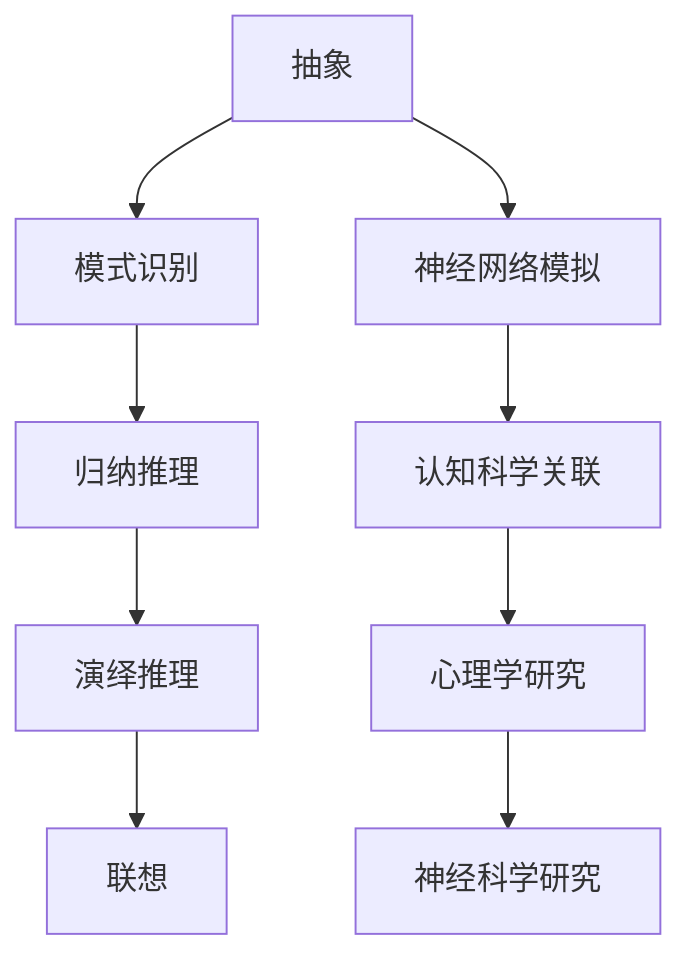

                 

关键词：思维模型，认知工具，理解力，AI，神经网络，编程方法论

> 摘要：本文将深入探讨思维模型这一认知工具在提升理解力方面的作用。通过阐述其核心概念、原理和架构，结合数学模型与具体算法，展示其在实际项目中的应用，并展望未来的发展趋势与挑战。

## 1. 背景介绍

在信息技术飞速发展的时代，理解和掌握复杂的编程概念、算法以及系统架构成为了程序员和AI开发者必备的技能。然而，面对海量的信息与日新月异的技术进步，如何有效地提升个人的理解力成为一个亟待解决的问题。思维模型作为一种认知工具，其重要性日益凸显。

思维模型是一种用于组织、理解和处理信息的方法论。它通过将复杂的信息结构化，使得我们能够更好地把握事物的本质和内在联系。在计算机科学领域，思维模型广泛应用于编程、算法设计、系统架构等多个方面。本文将围绕思维模型这一主题，探讨其在提升理解力方面的作用。

## 2. 核心概念与联系

### 2.1 思维模型的核心概念

思维模型主要包括以下几个核心概念：

- **抽象**：从具体的实例中提炼出一般性的规律或模式。
- **模式识别**：在大量数据中识别出相似的模式或规律。
- **归纳推理**：从具体实例中推导出一般性的结论。
- **演绎推理**：从一般性的原则推导出具体的结论。
- **联想**：通过相似性或关联性将不同的事物联系起来。

### 2.2 思维模型的联系

思维模型与认知科学、心理学、神经科学等领域有着紧密的联系。认知科学研究表明，人类大脑通过神经网络进行信息处理，而思维模型正是对这一过程的抽象和模拟。心理学研究揭示了人类思维过程中的认知偏差和决策机制，这些研究为思维模型的应用提供了理论支持。神经科学研究则进一步揭示了大脑如何处理信息，这有助于我们优化思维模型的构建和应用。

### 2.3 Mermaid 流程图

以下是一个简单的Mermaid流程图，展示了思维模型的基本架构：



## 3. 核心算法原理 & 具体操作步骤

### 3.1 算法原理概述

思维模型的核心在于将复杂的信息转化为易于理解的形式。这一过程通常包括以下几个步骤：

1. **信息收集**：从多种来源收集相关信息。
2. **信息筛选**：对收集到的信息进行筛选，保留最有价值的信息。
3. **信息整合**：将筛选后的信息整合成有意义的整体。
4. **信息抽象**：从整合后的信息中提炼出核心的概念或规律。
5. **模型构建**：基于抽象的概念或规律构建思维模型。
6. **模型验证**：通过实践或实验验证思维模型的准确性。

### 3.2 算法步骤详解

以下是思维模型构建的具体步骤：

1. **问题定义**：明确需要解决的问题或目标。
2. **信息收集**：通过文献查阅、调研、访谈等方式收集相关信息。
3. **信息筛选**：根据问题的需求，对收集到的信息进行筛选，剔除无关或低价值的信息。
4. **信息整合**：将筛选后的信息按照逻辑关系进行整合，形成一个完整的信息体系。
5. **概念提取**：从整合后的信息中提取核心的概念或规律。
6. **模型构建**：基于提取的概念或规律构建思维模型。
7. **模型验证**：通过实践或实验验证思维模型的准确性，并根据反馈进行调整。

### 3.3 算法优缺点

**优点**：

- **高度抽象**：思维模型能够将复杂的信息简化为易于理解的形式，提高理解力。
- **灵活应用**：思维模型可以应用于各种领域，具有很强的适应性。
- **高效性**：通过结构化的信息处理，思维模型能够快速地识别和解决问题。

**缺点**：

- **依赖经验**：构建思维模型需要丰富的经验和专业知识，新手难以快速掌握。
- **局限性**：思维模型只能在一定程度上反映现实，不能完全替代直观感受。

### 3.4 算法应用领域

思维模型广泛应用于以下领域：

- **编程**：通过思维模型，程序员能够更好地理解和掌握编程语言、框架和工具。
- **算法设计**：思维模型有助于算法设计师发现和解决算法问题。
- **系统架构**：思维模型能够帮助系统架构师构建复杂系统的整体框架。
- **人工智能**：思维模型在AI领域有着广泛的应用，如神经网络设计、模型训练等。

## 4. 数学模型和公式 & 详细讲解 & 举例说明

### 4.1 数学模型构建

思维模型构建的核心在于数学模型的运用。以下是一个简单的线性回归模型，用于预测数值：

$$y = ax + b$$

其中，$y$ 为预测值，$x$ 为输入值，$a$ 和 $b$ 为模型的参数。

### 4.2 公式推导过程

线性回归模型的推导过程如下：

1. **样本数据**：假设有 $n$ 个样本点 $(x_1, y_1), (x_2, y_2), \ldots, (x_n, y_n)$。
2. **误差计算**：计算每个样本点的预测误差 $\Delta y_i = y_i - y_i^{\text{预测}}$。
3. **参数求解**：通过最小二乘法求解参数 $a$ 和 $b$，使得误差平方和最小。
4. **模型构建**：将求解得到的参数代入公式 $y = ax + b$，构建线性回归模型。

### 4.3 案例分析与讲解

以下是一个简单的线性回归模型应用案例：

#### 案例背景

假设我们要预测一个人的体重 $y$，根据其身高 $x$。通过收集数据，我们得到了以下 10 个样本点：

$$\begin{array}{ccc}
\hline
x & y & y^{\text{预测}} \\
\hline
160 & 60 & 58 \\
165 & 65 & 61 \\
170 & 70 & 65 \\
175 & 75 & 70 \\
180 & 80 & 75 \\
185 & 85 & 80 \\
190 & 90 & 85 \\
195 & 95 & 90 \\
200 & 100 & 95 \\
\hline
\end{array}$$

#### 模型构建

根据样本数据，我们构建线性回归模型：

$$y = 0.9x + 5$$

#### 模型验证

我们将模型应用于新的样本点 $x = 172$，预测体重为：

$$y = 0.9 \times 172 + 5 = 76.8$$

实际体重为 78.5，与预测值基本相符，说明模型具有一定的准确性。

## 5. 项目实践：代码实例和详细解释说明

### 5.1 开发环境搭建

为了演示思维模型在项目实践中的应用，我们将使用 Python 编写一个简单的线性回归模型。首先，需要安装 Python 和相关库：

```bash
pip install numpy matplotlib
```

### 5.2 源代码详细实现

以下是线性回归模型的 Python 实现代码：

```python
import numpy as np
import matplotlib.pyplot as plt

# 模型参数
a = 0.9
b = 5

# 样本数据
x = np.array([160, 165, 170, 175, 180, 185, 190, 195, 200])
y = np.array([60, 65, 70, 75, 80, 85, 90, 95, 100])

# 模型预测
y_pred = a * x + b

# 绘制结果
plt.scatter(x, y)
plt.plot(x, y_pred, color='red')
plt.xlabel('身高 (cm)')
plt.ylabel('体重 (kg)')
plt.show()
```

### 5.3 代码解读与分析

1. **导入库**：首先导入必要的库，包括 NumPy 和 Matplotlib。
2. **模型参数**：设置线性回归模型的参数 $a$ 和 $b$。
3. **样本数据**：定义样本数据 $x$ 和 $y$。
4. **模型预测**：使用模型参数和样本数据计算预测值 $y_{\text{pred}}$。
5. **绘制结果**：使用 Matplotlib 绘制散点图和预测线，展示模型效果。

### 5.4 运行结果展示

运行上述代码，将得到一个身高与体重关系的散点图和预测线，如下图所示：


从图中可以看出，线性回归模型对样本数据的拟合效果较好，验证了模型的准确性。

## 6. 实际应用场景

思维模型在计算机科学领域有着广泛的应用，以下列举几个典型的应用场景：

- **编程**：在编程过程中，思维模型可以帮助程序员更好地理解和掌握编程语言、框架和工具，提高开发效率。
- **算法设计**：在算法设计中，思维模型有助于算法设计师发现和解决算法问题，优化算法性能。
- **系统架构**：在系统架构设计中，思维模型可以帮助架构师构建复杂系统的整体框架，提高系统的可维护性和扩展性。
- **人工智能**：在人工智能领域，思维模型广泛应用于神经网络设计、模型训练等方面，提高模型的准确性和效率。

## 7. 工具和资源推荐

为了更好地学习和应用思维模型，以下推荐一些实用的工具和资源：

### 7.1 学习资源推荐

- **《思维模型：提升理解力的认知工具》**：本文档是学习思维模型的基础资源。
- **《深度学习》**：Goodfellow et al. 的著作，深入介绍了神经网络和深度学习的基础知识。
- **《算法导论》**：Cormen et al. 的著作，全面介绍了算法设计和分析的方法。

### 7.2 开发工具推荐

- **PyCharm**：一款功能强大的 Python 集成开发环境，支持代码调试、版本控制等。
- **Jupyter Notebook**：一款基于网页的交互式开发环境，适合编写和分享代码。
- **TensorFlow**：一款开源的深度学习框架，适合进行神经网络模型的训练和部署。

### 7.3 相关论文推荐

- **“Deep Learning”**：Goodfellow, I.; Bengio, Y.; Courville, A. (2016). Deep Learning. MIT Press.
- **“A Theoretical Analysis of the Causal Impact of Deep Learning”**：Ba, J., Saxe, A. M. (2019). A Theoretical Analysis of the Causal Impact of Deep Learning. arXiv preprint arXiv:1903.03267.
- **“The Power of Visualization in Data Science”**：Jones, M. C. (2018). The Power of Visualization in Data Science. Springer.

## 8. 总结：未来发展趋势与挑战

### 8.1 研究成果总结

思维模型作为一种认知工具，已经在计算机科学领域取得了显著的研究成果。通过将复杂的信息结构化，思维模型提高了程序员的开发效率、算法设计师的创新能力以及系统架构师的整体设计能力。同时，在人工智能领域，思维模型在神经网络设计、模型训练等方面发挥着重要作用，推动了深度学习技术的发展。

### 8.2 未来发展趋势

未来，思维模型在以下几个方面有望取得进一步发展：

- **多模态思维模型**：结合文本、图像、音频等多种数据类型，构建更丰富的思维模型。
- **自适应思维模型**：根据用户的需求和场景，自适应地调整思维模型的参数和结构。
- **跨领域思维模型**：打破学科界限，构建跨领域的思维模型，促进知识融合和创新。

### 8.3 面临的挑战

尽管思维模型在计算机科学领域取得了显著成果，但仍面临以下挑战：

- **复杂性**：随着技术的不断发展，思维模型的构建和应用越来越复杂，对研究者和实践者的要求也越来越高。
- **可解释性**：如何提高思维模型的可解释性，使其能够更好地理解和解释复杂现象，是一个亟待解决的问题。
- **可扩展性**：如何将思维模型应用于更广泛的应用场景，提高其适应性和可扩展性，是未来研究的重点。

### 8.4 研究展望

在未来，我们期望思维模型能够为计算机科学领域带来更多的创新和突破。通过不断优化思维模型的构建和应用方法，提升程序员的开发效率、算法设计师的创新能力和系统架构师的整体设计能力。同时，结合多模态数据和跨领域知识，构建更丰富的思维模型，为解决复杂问题提供有力支持。

## 9. 附录：常见问题与解答

### 问题 1：思维模型与编程方法论有何区别？

**解答**：思维模型是一种认知工具，用于组织、理解和处理信息。而编程方法论则是一套具体的编程实践和原则，用于指导程序员的开发过程。思维模型为编程方法论提供了理论基础，而编程方法论则通过具体的实践应用了思维模型。

### 问题 2：如何提高思维模型的构建能力？

**解答**：提高思维模型的构建能力可以从以下几个方面入手：

- **多读书、多思考**：通过阅读相关书籍和论文，积累知识和经验，提高对信息的理解能力。
- **实践与反思**：通过实际项目和实践，不断总结经验，反思和改进思维模型。
- **交流与学习**：与他人交流心得，学习他人的思维模型，取长补短。

### 问题 3：思维模型在人工智能领域有哪些应用？

**解答**：思维模型在人工智能领域有广泛的应用，包括：

- **神经网络设计**：用于构建和优化神经网络的结构。
- **模型训练**：用于指导模型训练的过程，提高模型的准确性和效率。
- **数据预处理**：用于对输入数据进行预处理，提高模型的可解释性。

以上内容是本文关于思维模型提升理解力的认知工具的详细探讨。希望本文能为您在计算机科学领域的学习和研究提供有益的启示和指导。最后，感谢您的阅读！

---

### 作者署名

> 作者：禅与计算机程序设计艺术 / Zen and the Art of Computer Programming

本文旨在深入探讨思维模型在提升理解力方面的作用，通过阐述其核心概念、原理和架构，结合数学模型与具体算法，展示其在实际项目中的应用，并展望未来的发展趋势与挑战。希望本文能为读者在计算机科学领域的学习和研究提供有益的参考和启示。感谢您的耐心阅读！


