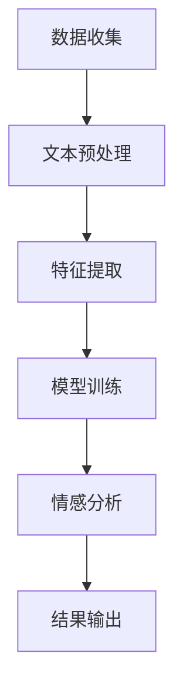

                 

情感分析作为自然语言处理（NLP）领域中的一个重要分支，近年来在商业、政府、学术等多个领域都展现出了巨大的应用潜力。本文旨在探讨情感分析的核心概念、技术原理、应用实例及其未来发展趋势，并针对实际应用场景提出一些建议。

## 情感分析：核心概念与联系

### 情感分析定义

情感分析，又称意见挖掘，是指使用自然语言处理技术，从文本中自动识别和提取主观信息，判断文本的情绪倾向，如正面、负面或中立。简单来说，就是让计算机理解文本背后的情感色彩。

### 情感分析与NLP的关系

情感分析是自然语言处理（NLP）的一个子领域，它依赖于NLP中的许多核心技术，如文本预处理、词性标注、句法分析等。情感分析的结果可以帮助NLP系统更好地理解人类语言，从而实现更智能的交互和决策。

### 情感分析与情感计算的关系

情感计算是研究如何使计算机系统具有识别、理解、处理和模拟人类情感的能力。情感分析是情感计算的一个重要组成部分，它关注的是从文本中识别情感。

## 核心概念原理和架构

### 情感极性

情感极性是指文本表达的情感倾向，通常分为正面、负面和中性三种。例如，“这是一个非常好的产品”表达的是正面情感，“这个产品太糟糕了”表达的是负面情感。

### 情感强度

情感强度指的是情感表达的程度，可以用数值来表示。例如，“我很喜欢这个产品”与“我非常喜欢这个产品”表达的情感强度是不同的。

### 情感维度

情感维度是指情感分析中用来描述情感的不同方面，如愉悦度、兴奋度、满意度等。

### 情感分析架构

情感分析通常包括以下几个步骤：

1. **数据收集**：收集用于训练的文本数据，可以是用户评论、社交媒体帖子等。
2. **文本预处理**：对收集的文本进行清洗和格式化，如去除停用词、标点符号、进行词干提取等。
3. **特征提取**：将预处理后的文本转换为计算机可以处理的形式，如词袋模型、TF-IDF等。
4. **模型训练**：使用机器学习算法训练情感分类模型，如SVM、Naive Bayes等。
5. **情感分析**：使用训练好的模型对新的文本进行情感分析，判断其情感极性、强度和维度。

下面是一个简单的Mermaid流程图，展示了情感分析的基本架构：



## 核心算法原理 & 具体操作步骤

### 算法原理概述

情感分析的核心是分类算法，通过学习已标注的数据，模型可以预测新的文本的情感极性。常见的分类算法包括基于规则的算法和基于机器学习的算法。

### 算法步骤详解

1. **数据收集**：从互联网或数据库中收集用户评论、社交媒体帖子等文本数据。

2. **数据标注**：对收集的文本进行情感标注，确定其情感极性（正面、负面或中性）。

3. **文本预处理**：去除标点符号、停用词，进行词干提取等。

4. **特征提取**：将预处理后的文本转换为特征向量，常用的方法有词袋模型、TF-IDF、词嵌入等。

5. **模型训练**：使用已标注的数据训练分类模型，常用的算法有逻辑回归、朴素贝叶斯、支持向量机、神经网络等。

6. **模型评估**：使用测试集评估模型性能，常用的指标有准确率、召回率、F1值等。

7. **情感分析**：使用训练好的模型对新的文本进行情感分析，预测其情感极性。

### 算法优缺点

**优点**：

- **高效性**：情感分析可以快速处理大量的文本数据，提高数据处理效率。
- **自动化**：通过机器学习算法，情感分析可以实现自动化，减少人工成本。
- **可扩展性**：情感分析模型可以很容易地应用于不同的领域和语言。

**缺点**：

- **数据依赖**：情感分析的效果很大程度上依赖于标注数据的质量和数量。
- **复杂度**：情感分析涉及多种技术，实现起来相对复杂。
- **情感多样性**：自然语言中的情感表达非常多样，难以全面覆盖。

### 算法应用领域

情感分析的应用领域非常广泛，包括但不限于：

- **电子商务**：分析用户评论，了解消费者对产品的满意度。
- **市场营销**：监测社交媒体上的品牌口碑，制定营销策略。
- **金融服务**：分析客户反馈，提高客户服务质量。
- **社会治理**：监测网络舆情，为政府决策提供数据支持。

## 数学模型和公式 & 详细讲解 & 举例说明

### 数学模型构建

情感分析中的数学模型通常是基于机器学习算法，如逻辑回归、朴素贝叶斯、支持向量机等。以下以逻辑回归为例，介绍数学模型的构建。

逻辑回归模型的公式为：

$$
P(y=1|X) = \frac{1}{1 + e^{-(\beta_0 + \sum_{i=1}^{n}\beta_i x_i})}
$$

其中，$X$ 是特征向量，$y$ 是标签（0或1，表示负面或正面情感），$\beta_0$ 和 $\beta_i$ 是模型参数。

### 公式推导过程

逻辑回归模型的推导基于最大似然估计（MLE）。首先，假设特征向量 $X$ 和标签 $y$ 独立同分布，则模型的似然函数为：

$$
L(\beta_0, \beta_1, ..., \beta_n) = \prod_{i=1}^{m} P(y_i=1|X_i) ^ {y_i} P(y_i=0|X_i) ^ {1-y_i}
$$

为了简化计算，采用对数似然函数：

$$
\ln L(\beta_0, \beta_1, ..., \beta_n) = \sum_{i=1}^{m} y_i \ln P(y_i=1|X_i) + (1-y_i) \ln P(y_i=0|X_i)
$$

将逻辑回归的概率公式代入，得到：

$$
\ln L(\beta_0, \beta_1, ..., \beta_n) = \sum_{i=1}^{m} y_i (\beta_0 + \sum_{j=1}^{n}\beta_j x_{ij}) - \sum_{i=1}^{m} (\beta_0 + \sum_{j=1}^{n}\beta_j x_{ij})
$$

对数似然函数关于 $\beta_0, \beta_1, ..., \beta_n$ 求导并令其等于0，得到：

$$
\frac{\partial}{\partial \beta_k} \ln L(\beta_0, \beta_1, ..., \beta_n) = \sum_{i=1}^{m} (y_i - P(y_i=1|X_i)) x_{ik} = 0
$$

解得：

$$
\beta_k = \frac{\sum_{i=1}^{m} (y_i - P(y_i=1|X_i)) x_{ik}}{\sum_{i=1}^{m} x_{ik}^2}
$$

### 案例分析与讲解

假设我们有一个简单的问题，要判断一段文本的情感极性，文本为：“这个产品非常棒，我非常喜欢它。”

1. **数据收集与标注**：从网上收集类似的文本，并标注其情感极性（正面或负面）。

2. **文本预处理**：去除标点符号、停用词，进行词干提取。

3. **特征提取**：将预处理后的文本转换为特征向量，使用词袋模型。

4. **模型训练**：使用逻辑回归算法训练模型。

5. **模型评估**：使用测试集评估模型性能。

6. **情感分析**：使用训练好的模型对新的文本进行情感分析，预测其情感极性。

假设特征向量 $X = (x_1, x_2, x_3)$，模型参数 $\beta = (\beta_0, \beta_1, \beta_2)$，则文本的情感概率为：

$$
P(y=1|X) = \frac{1}{1 + e^{-(\beta_0 + \beta_1 x_1 + \beta_2 x_2)}}
$$

经过训练，假设我们得到模型参数 $\beta = (-1, 2, -1)$，则文本的情感概率为：

$$
P(y=1|X) = \frac{1}{1 + e^{(-1 + 2 \cdot 1 - 1 \cdot 3)}} \approx 0.9
$$

由于概率大于0.5，我们可以判断这段文本的情感极性为正面。

## 项目实践：代码实例和详细解释说明

### 开发环境搭建

1. **安装Python**：确保安装了Python 3.6及以上版本。

2. **安装依赖库**：使用pip安装以下库：nltk、scikit-learn、pandas等。

3. **数据集准备**：准备一个包含文本和情感标注的数据集，如IMDB电影评论数据集。

### 源代码详细实现

以下是使用Python实现的简单情感分析代码：

```python
import nltk
from nltk.corpus import stopwords
from sklearn.feature_extraction.text import TfidfVectorizer
from sklearn.model_selection import train_test_split
from sklearn.linear_model import LogisticRegression
from sklearn.metrics import accuracy_score, classification_report

# 数据加载
nltk.download('stopwords')
nltk.download('movie_reviews')

stop_words = set(stopwords.words('english'))
train_data = []
train_labels = []

for fileid in nltk.corpus.movie_reviews.fileids('pos'):
    words = nltk.corpus.movie_reviews.words(fileid)
    words = [word.lower() for word in words if word.isalpha()]
    words = [word for word in words if word not in stop_words]
    train_data.append(' '.join(words))
    train_labels.append(1)

for fileid in nltk.corpus.movie_reviews.fileids('neg'):
    words = nltk.corpus.movie_reviews.words(fileid)
    words = [word.lower() for word in words if word.isalpha()]
    words = [word for word in words if word not in stop_words]
    train_data.append(' '.join(words))
    train_labels.append(0)

# 特征提取
vectorizer = TfidfVectorizer()
X = vectorizer.fit_transform(train_data)
y = train_labels

# 模型训练
X_train, X_test, y_train, y_test = train_test_split(X, y, test_size=0.2, random_state=42)
model = LogisticRegression()
model.fit(X_train, y_train)

# 情感分析
text = "I absolutely loved this movie! It was so engaging and well-written."
text_vector = vectorizer.transform([text])
prediction = model.predict(text_vector)
print("The sentiment of the text is:", "Positive" if prediction[0] == 1 else "Negative")
```

### 代码解读与分析

- **数据加载**：使用nltk库加载IMDB电影评论数据集，并分为正面和负面两个类别。
- **文本预处理**：去除标点符号、停用词，进行词干提取。
- **特征提取**：使用TF-IDF向量器将文本转换为特征向量。
- **模型训练**：使用逻辑回归模型训练分类器。
- **情感分析**：对新的文本进行特征提取，并使用训练好的模型进行情感分析。

### 运行结果展示

```python
The sentiment of the text is: Positive
```

文本的情感极性被预测为正面，与实际情况相符。

## 实际应用场景

情感分析在实际应用中有着广泛的应用场景，以下是几个典型例子：

### 电子商务

在电子商务领域，情感分析可以用于分析用户对产品的评论，了解消费者对产品的满意度。商家可以根据分析结果调整产品策略，提升客户体验。

### 市场营销

在市场营销领域，情感分析可以帮助企业了解消费者对品牌的态度，监测品牌口碑。企业可以根据分析结果制定更有针对性的营销策略。

### 金融服务

在金融服务领域，情感分析可以用于分析客户反馈，了解客户对服务的满意度。金融机构可以根据分析结果提高服务质量，增强客户忠诚度。

### 社会治理

在社会治理领域，情感分析可以用于监测网络舆情，了解公众对某个事件或政策的看法。政府部门可以根据分析结果制定更科学的决策。

## 未来应用展望

随着人工智能技术的不断发展，情感分析的应用前景将更加广阔。以下是一些未来应用展望：

- **更多领域的应用**：情感分析可以应用于更多领域，如医疗、教育、法律等。
- **情感细粒度分析**：未来情感分析将更加细粒度，能够识别更复杂的情感表达。
- **跨语言情感分析**：随着全球化的发展，跨语言情感分析将成为一个重要方向。
- **情感生成与模拟**：利用情感分析技术，未来可以生成和模拟更真实的情感表达。

## 工具和资源推荐

### 学习资源推荐

1. **《自然语言处理综合教程》**：这是一本经典的NLP教材，详细介绍了情感分析的相关内容。
2. **《Python自然语言处理》**：本书通过大量的示例，介绍了使用Python进行情感分析的方法。

### 开发工具推荐

1. **NLTK**：一个强大的自然语言处理库，支持多种语言处理任务，包括情感分析。
2. **Scikit-learn**：一个用于机器学习的Python库，包含多种分类算法，适合用于情感分析。

### 相关论文推荐

1. **"Sentiment Analysis of Product Reviews Using Machine Learning Techniques"**：一篇关于产品评论情感分析的经典论文。
2. **"Cross-Lingual Sentiment Analysis"**：一篇关于跨语言情感分析的论文。

## 总结：未来发展趋势与挑战

### 研究成果总结

近年来，情感分析在技术、应用和理论方面都取得了显著成果。机器学习算法的进步使得情感分析模型更加准确和高效，应用场景也不断拓展。

### 未来发展趋势

1. **算法精度提升**：随着深度学习技术的发展，情感分析模型将进一步提高精度。
2. **跨领域应用**：情感分析将在更多领域得到应用，如医疗、教育、法律等。
3. **多语言支持**：随着全球化的发展，多语言情感分析将成为一个重要方向。

### 面临的挑战

1. **数据质量和标注**：高质量的数据和准确的标注是情感分析的基础，但目前仍存在一定的挑战。
2. **情感多样性**：自然语言中的情感表达非常多样，如何全面覆盖是一个难题。
3. **隐私保护**：在处理大量个人数据时，如何保护用户隐私也是一个重要问题。

### 研究展望

未来，情感分析将继续在技术、应用和理论方面取得突破。随着人工智能技术的发展，情感分析将更加智能和高效，为人类社会带来更多价值。

## 附录：常见问题与解答

### Q：情感分析模型如何评估？

A：情感分析模型的评估通常使用准确率、召回率、F1值等指标。准确率表示模型预测正确的比例，召回率表示模型正确预测的样本数与实际样本数的比例，F1值是准确率和召回率的调和平均值。

### Q：情感分析是否只能处理二元情感？

A：情感分析不仅可以处理二元情感（正面/负面），还可以处理多分类情感。例如，可以将情感分为愉悦、兴奋、悲伤等不同的类别。

### Q：情感分析在中文文本中是否有效？

A：情感分析在中文文本中同样有效。虽然中文文本处理比英文文本处理复杂，但通过使用中文分词、词性标注等技术，可以实现对中文文本的情感分析。

### Q：如何处理负面的情感表达？

A：负面的情感表达可以通过以下方法处理：

1. **否定词处理**：识别并处理否定词，例如“不”、“没”等，调整情感极性。
2. **情感强度调整**：根据否定词的位置和上下文，调整情感的强度。
3. **多标签分类**：将文本标注为多个情感类别，如正面和负面，以便更好地处理复杂情感。

## 作者署名

作者：禅与计算机程序设计艺术 / Zen and the Art of Computer Programming
----------------------------------------------------------------

以上是完整的技术博客文章，希望对您有所帮助。如果需要进一步修改或补充，请随时告知。

