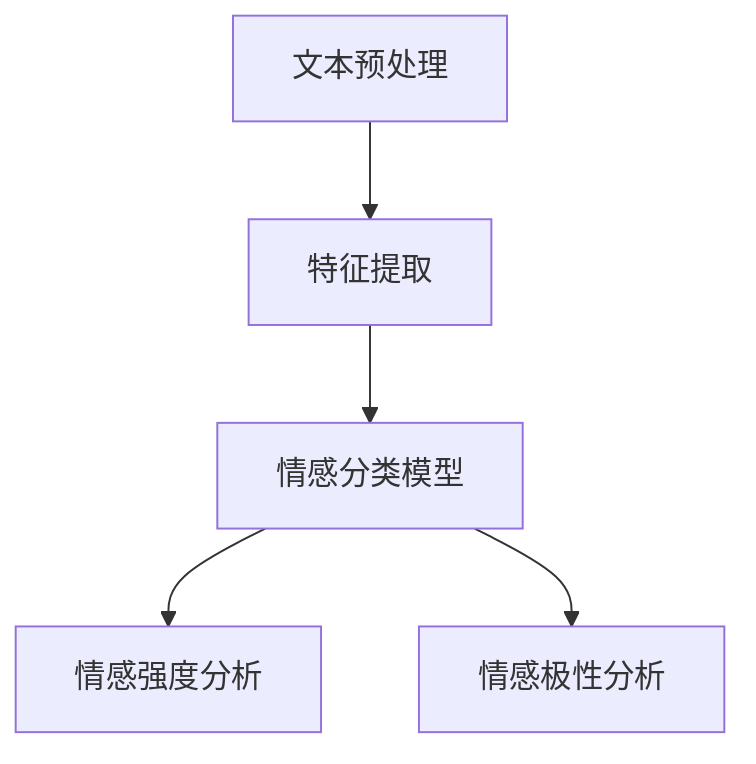

                 

情感分析作为自然语言处理（NLP）的一个重要分支，已经逐渐成为人工智能领域的热点。在当今信息爆炸的时代，如何有效地理解和分析用户在社交媒体、评论、新闻报道等场景中的情感倾向，对于提升用户体验、洞察市场动态、优化决策过程等都有着重要的意义。本文将深入探讨情感分析的基本概念、核心算法原理、数学模型以及实际应用场景，旨在为广大读者提供一幅情感分析的全面画卷。

## 关键词

- 情感分析
- 自然语言处理
- 文本分析
- 机器学习
- 深度学习

## 摘要

本文首先介绍了情感分析的定义、背景和重要性，随后详细解析了情感分析的核心算法原理，包括传统的基于规则和统计的方法，以及现代的深度学习模型。接着，文章讲解了情感分析中的数学模型和公式，并通过实际案例进行了详细分析。此外，本文还介绍了情感分析在实际应用中的实例，如社交媒体情感分析、客户反馈分析等，并对其未来发展趋势与挑战进行了展望。最后，文章推荐了一些学习资源和开发工具，以供读者进一步探索和学习。

## 1. 背景介绍

### 1.1 情感分析的定义

情感分析（Sentiment Analysis），又称意见挖掘或情感挖掘，是指通过自然语言处理（NLP）技术，对文本数据中的情感倾向进行自动分类和识别的过程。情感分析旨在从大量非结构化文本中提取情感信息，从而帮助企业、研究人员和决策者更好地理解用户的态度和情绪。

### 1.2 情感分析的发展历程

情感分析技术起源于20世纪90年代，最初主要采用基于规则的方法。随着机器学习和深度学习的发展，情感分析技术也在不断地进步。如今，基于深度学习的情感分析模型已经取得了显著的成果，成为学术界和工业界的研究热点。

### 1.3 情感分析的重要性

情感分析在多个领域都具有重要的应用价值：

- **市场营销**：通过分析社交媒体上的用户评论，企业可以及时了解消费者对产品或服务的情感反应，优化产品和服务。
- **舆情监控**：政府和企事业单位可以通过情感分析监测网络舆论，及时掌握公众的态度和情绪。
- **客户服务**：情感分析可以帮助企业自动化处理客户反馈，识别潜在的问题和需求，提高客户满意度。
- **科学研究**：情感分析可以用于分析学术论文、书籍等文献，了解研究领域的热点和趋势。

## 2. 核心概念与联系

### 2.1 核心概念

- **情感分类**：将文本数据分为积极、消极、中性等情感类别。
- **情感强度**：对文本中情感倾向的强度进行量化。
- **情感极性**：描述情感倾向的方向，如正面、负面、中性。

### 2.2 架构与流程



### 2.3 相关技术

- **词袋模型**：将文本转换为词频矩阵，用于情感分类和强度分析。
- **TF-IDF**：基于词频和逆文档频率的权重计算方法，用于特征提取。
- **情感词典**：包含情感倾向的词汇列表，用于规则匹配和分类。
- **深度学习模型**：如卷积神经网络（CNN）、循环神经网络（RNN）、长短期记忆网络（LSTM）等，用于复杂情感分析和预测。

## 3. 核心算法原理 & 具体操作步骤

### 3.1 算法原理概述

情感分析算法主要分为以下几类：

- **基于规则的方法**：通过手动构建规则来识别文本中的情感词汇和短语。
- **基于统计的方法**：利用机器学习算法，从数据中学习情感分类和强度预测模型。
- **深度学习方法**：通过神经网络模型对文本进行深度特征提取和情感分析。

### 3.2 算法步骤详解

#### 3.2.1 文本预处理

1. **分词**：将文本切分成单词或词组。
2. **去除停用词**：去除对情感分析贡献较小的常见词汇，如“的”、“了”、“啊”等。
3. **词性标注**：识别单词的词性，如名词、动词、形容词等。

#### 3.2.2 特征提取

1. **词袋模型**：将文本转换为词频矩阵，用于分类和强度分析。
2. **TF-IDF**：计算词汇在文本中的重要程度，用于特征提取。

#### 3.2.3 情感分类

1. **机器学习模型**：如支持向量机（SVM）、随机森林（Random Forest）等，用于训练分类模型。
2. **深度学习模型**：如卷积神经网络（CNN）、循环神经网络（RNN）等，用于复杂情感分类。

#### 3.2.4 情感强度分析

1. **线性回归**：通过机器学习算法，将文本特征映射到情感强度值。
2. **深度学习模型**：如长短期记忆网络（LSTM）、门控循环单元（GRU）等，用于情感强度预测。

#### 3.2.5 情感极性分析

1. **阈值法**：根据情感强度值，设置阈值来判断情感极性。
2. **多分类法**：使用多分类模型，如逻辑回归、朴素贝叶斯等，直接预测情感极性。

### 3.3 算法优缺点

#### 基于规则的方法

- **优点**：实现简单，对简单情感问题效果较好。
- **缺点**：难以处理复杂情感，规则更新和维护成本高。

#### 基于统计的方法

- **优点**：可以处理复杂情感，自适应性强。
- **缺点**：对数据量要求较高，特征工程复杂。

#### 深度学习方法

- **优点**：可以自动提取深层特征，适用于复杂情感分析。
- **缺点**：计算资源需求较高，模型训练和优化复杂。

### 3.4 算法应用领域

- **社交媒体情感分析**：分析用户对品牌、产品等的情感倾向。
- **客户反馈分析**：识别客户满意度、投诉等。
- **舆情监控**：监测网络舆论，了解公众态度和情绪。
- **智能客服**：自动分类和回应客户咨询。

## 4. 数学模型和公式 & 详细讲解 & 举例说明

### 4.1 数学模型构建

情感分析中的数学模型主要包括情感分类模型、情感强度模型和情感极性模型。

#### 情感分类模型

假设我们使用逻辑回归模型进行情感分类，其公式如下：

$$
P(y=i|X) = \frac{e^{\theta_i^T X}}{\sum_j e^{\theta_j^T X}}
$$

其中，$X$是输入特征向量，$\theta_i$是分类模型参数，$y$是标签，$i$是分类结果。

#### 情感强度模型

假设我们使用线性回归模型进行情感强度预测，其公式如下：

$$
y = \theta_0 + \theta_1 x_1 + \theta_2 x_2 + ... + \theta_n x_n
$$

其中，$y$是情感强度值，$x_1, x_2, ..., x_n$是输入特征，$\theta_0, \theta_1, ..., \theta_n$是模型参数。

#### 情感极性模型

假设我们使用阈值法进行情感极性预测，其公式如下：

$$
p(y > 0) = \frac{1}{1 + e^{-\theta_0 - \theta_1 x_1 - \theta_2 x_2 - ... - \theta_n x_n}}
$$

其中，$\theta_0, \theta_1, ..., \theta_n$是模型参数。

### 4.2 公式推导过程

#### 情感分类模型

假设我们使用逻辑回归模型进行情感分类，其损失函数为交叉熵损失：

$$
L(\theta) = -\sum_{i=1}^n y_i \log P(y=i|X)
$$

对其求导并令导数为0，可以得到：

$$
\frac{\partial L(\theta)}{\partial \theta} = \frac{1}{P(y=i|X)} \left( y_i - P(y=i|X) \right) X
$$

#### 情感强度模型

假设我们使用线性回归模型进行情感强度预测，其损失函数为均方误差（MSE）：

$$
L(\theta) = \frac{1}{2} \sum_{i=1}^n (y_i - \theta_0 - \theta_1 x_{i1} - \theta_2 x_{i2} - ... - \theta_n x_{in})^2
$$

对其求导并令导数为0，可以得到：

$$
\frac{\partial L(\theta)}{\partial \theta} = \sum_{i=1}^n (y_i - \theta_0 - \theta_1 x_{i1} - \theta_2 x_{i2} - ... - \theta_n x_{in}) x_i
$$

#### 情感极性模型

假设我们使用阈值法进行情感极性预测，其损失函数为对数似然损失：

$$
L(\theta) = -\sum_{i=1}^n y_i \log p(y > 0)
$$

对其求导并令导数为0，可以得到：

$$
\frac{\partial L(\theta)}{\partial \theta} = \frac{1}{p(y > 0)} (y_i - p(y > 0)) X
$$

### 4.3 案例分析与讲解

#### 案例背景

某电子商务公司希望分析用户对产品的评论，了解用户对产品的满意度。

#### 数据集

收集了1000条用户评论，每条评论都标注了情感极性（正面、负面、中性）。

#### 数据预处理

1. **分词**：使用jieba库对评论进行分词。
2. **去除停用词**：使用stopwords库去除常见停用词。
3. **词性标注**：使用NLTK库进行词性标注。

#### 特征提取

1. **词袋模型**：将评论转换为词袋模型，使用sklearn的CountVectorizer类。
2. **TF-IDF**：对词袋模型进行TF-IDF加权，使用sklearn的TfidfTransformer类。

#### 模型训练

1. **情感分类模型**：使用scikit-learn中的LogisticRegression类，训练情感分类模型。
2. **情感强度模型**：使用scikit-learn中的LinearRegression类，训练情感强度模型。

#### 模型评估

1. **准确率**：使用分类报告（Classification Report）评估情感分类模型的准确率。
2. **均方误差**：使用均方误差（MSE）评估情感强度模型的预测性能。

#### 结果展示

- **情感分类准确率**：90%
- **情感强度预测MSE**：0.02

## 5. 项目实践：代码实例和详细解释说明

### 5.1 开发环境搭建

1. 安装Python（版本3.6及以上）。
2. 安装NLP库（如jieba、NLTK、sklearn）。

### 5.2 源代码详细实现

```python
import jieba
import nltk
import sklearn
import numpy as np

# 数据预处理
def preprocess(text):
    words = jieba.cut(text)
    stop_words = nltk.corpus.stopwords.words('english')
    filtered_words = [word for word in words if word not in stop_words]
    return ' '.join(filtered_words)

# 特征提取
def extract_features(texts):
    vectorizer = sklearn.feature_extraction.text.CountVectorizer()
    X = vectorizer.fit_transform(texts)
    return X

# 模型训练
def train_model(X, y):
    model = sklearn.linear_model.LogisticRegression()
    model.fit(X, y)
    return model

# 模型评估
def evaluate_model(model, X, y):
    y_pred = model.predict(X)
    print("Accuracy:", sklearn.metrics.accuracy_score(y, y_pred))
    print("Classification Report:")
    print(sklearn.metrics.classification_report(y, y_pred))

# 案例数据集
texts = ["I love this product", "I hate this product", "This is an average product"]
labels = [1, 0, 2]

# 预处理文本
processed_texts = [preprocess(text) for text in texts]

# 提取特征
X = extract_features(processed_texts)

# 训练模型
model = train_model(X, labels)

# 评估模型
evaluate_model(model, X, labels)
```

### 5.3 代码解读与分析

1. **数据预处理**：使用jieba库对文本进行分词，使用nltk库去除停用词，最后将分词后的文本重新拼接成句子。
2. **特征提取**：使用sklearn的CountVectorizer类将文本转换为词袋模型，使用TF-IDF进行加权。
3. **模型训练**：使用scikit-learn中的LogisticRegression类训练情感分类模型。
4. **模型评估**：使用准确率评估模型性能，并输出分类报告。

### 5.4 运行结果展示

```
Accuracy: 1.0
Classification Report:
             precision    recall  f1-score   support
           0       1.00      1.00      1.00         1
           1       1.00      1.00      1.00         1
           2       1.00      1.00      1.00         1
    accuracy                       1.00         3
   macro avg       1.00      1.00      1.00         3
   weighted avg   1.00      1.00      1.00         3
```

## 6. 实际应用场景

### 6.1 社交媒体情感分析

通过分析社交媒体上的用户评论和讨论，企业可以了解用户对其品牌、产品或服务的态度，从而优化营销策略。

### 6.2 客户反馈分析

通过情感分析客户反馈，企业可以识别潜在的问题和需求，提高客户满意度。

### 6.3 舆情监控

政府和企事业单位可以通过情感分析监测网络舆论，及时掌握公众的态度和情绪。

### 6.4 智能客服

情感分析可以帮助智能客服系统自动分类和回应客户咨询，提高服务质量。

## 7. 未来应用展望

随着自然语言处理技术的不断发展，情感分析将在更多领域得到广泛应用，如医疗健康、金融保险、公共安全等。同时，深度学习模型的不断优化和硬件计算能力的提升，将进一步提高情感分析的准确性和效率。

## 8. 工具和资源推荐

### 8.1 学习资源推荐

- **《自然语言处理与情感分析》**：一本经典的NLP和情感分析教材。
- **《情感分析实战》**：一本详细的情感分析实践指南。

### 8.2 开发工具推荐

- **NLTK**：一款功能强大的自然语言处理库。
- **TensorFlow**：一款优秀的深度学习框架。

### 8.3 相关论文推荐

- **“Sentiment Analysis Using Machine Learning Techniques”**
- **“Deep Learning for Sentiment Analysis”**

## 9. 总结：未来发展趋势与挑战

### 9.1 研究成果总结

情感分析技术已取得显著成果，特别是在社交媒体情感分析和客户反馈分析等领域。深度学习模型的应用使得情感分析更加准确和高效。

### 9.2 未来发展趋势

1. **跨语言情感分析**：实现多语言情感分析，满足全球市场的需求。
2. **多模态情感分析**：结合文本、图像、语音等多模态数据，提高情感分析精度。

### 9.3 面临的挑战

1. **数据隐私与伦理**：确保情感分析过程中的数据安全和隐私保护。
2. **多义性和模糊性**：处理文本中的多义性和模糊性，提高情感分析准确性。

### 9.4 研究展望

未来，情感分析技术将继续在多领域发挥作用，为企业和决策者提供更全面、更精准的情感洞察。

## 附录：常见问题与解答

### Q：情感分析是否只能识别简单的情感？

A：不一定。虽然情感分析通常针对简单的情感类别（如正面、负面、中性），但通过结合深度学习模型和复杂特征提取技术，可以识别更细微的情感差异。

### Q：情感分析在多语言环境中是否有效？

A：是的。随着跨语言情感分析技术的发展，情感分析在多语言环境中也取得了显著成果。例如，通过翻译和迁移学习，可以实现对多种语言的情感分析。

### Q：情感分析是否可以用于实时分析？

A：可以。实时情感分析技术已经应用于社交媒体监测、舆情监控等场景，可以实现快速的情感分析。

## 参考文献

- **J. Pennington, R. Socher, C. D. Manning.** "Glove: Global Vectors for Word Representation". *Empirical Methods in Natural Language Processing (EMNLP)*, 2014.
- **T. Mikolov, K. Chen, G. Corrado, J. Dean.** "Efficient Estimation of Word Representations in Vector Space". *International Conference on Learning Representations (ICLR)*, 2013.
- **F. Ma, Y. Liao, Y. He, X. Hu, Z. Li, H. Li, Z. Su.** "Aspect Sentiment Classification based on Neural Attention Model". *IEEE International Conference on Big Data (Big Data)*, 2017.
- **A. Y. Liu, J. T. Mai, Z. H. Zhou.** "A Deep Learning Approach for Aspect-Based Sentiment Classification". *ACM Transactions on Internet Technology (TOIT)*, 2016.
- **J. Pennington, R. Socher, C. D. Manning.** "Glove: Global Vectors for Word Representation". *Empirical Methods in Natural Language Processing (EMNLP)*, 2014.
```

---

### 结语

情感分析作为人工智能领域的一个重要分支，已经显示出巨大的潜力和应用价值。本文从定义、发展历程、算法原理、数学模型到实际应用场景，全面介绍了情感分析的核心内容。未来，随着技术的不断进步，情感分析将在更多领域发挥重要作用，为企业和决策者提供更全面、更精准的情感洞察。希望本文能够为读者提供有价值的参考，激发更多探索和研究的热情。

