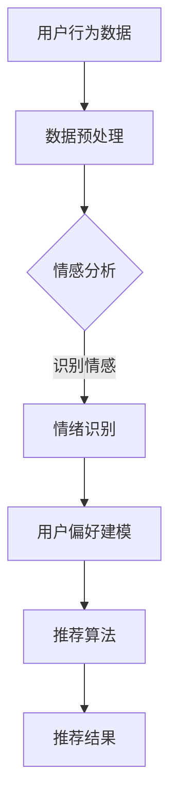

                 

关键词：情感分析、个性化推荐、情绪识别、用户行为、AI、数据挖掘

> 摘要：随着人工智能技术的不断发展，情感驱动推荐系统逐渐成为个性化推荐研究的热点。本文将探讨AI如何通过理解用户情绪，实现对用户个性化推荐的机制和方法。文章首先介绍了情感驱动推荐的基本概念，然后深入分析了情感识别的核心技术和算法原理，最后通过具体案例展示了实际应用场景和未来发展趋势。

## 1. 背景介绍

随着互联网的普及和信息技术的发展，用户生成的内容和数据量呈现爆炸式增长。在如此庞大的数据中，如何快速有效地为用户提供个性化的信息和服务，成为当前人工智能研究的热点问题。传统基于内容的推荐和协同过滤推荐方法在处理大量数据时存在诸多局限，如无法充分理解用户情绪、推荐结果单一等。因此，情感驱动推荐应运而生。

情感驱动推荐系统旨在通过分析用户情绪和行为，提供更加个性化和情感化的推荐服务。这种推荐方法不仅考虑用户的历史行为和偏好，还关注用户的情绪状态，从而提高推荐系统的准确性和用户体验。

## 2. 核心概念与联系

### 2.1 情感分析

情感分析是情感驱动推荐系统的核心组成部分。它通过自然语言处理技术，对用户生成的文本、评论、反馈等信息进行分析，识别其中的情感倾向，如正面、负面、中性等。情感分析的核心目标是实现对用户情绪的准确识别和分类。

### 2.2 情绪识别

情绪识别是情感分析的重要组成部分。它通过机器学习和深度学习算法，从用户的语音、文字、行为等数据中提取情绪特征，实现对用户情绪的自动识别。情绪识别技术广泛应用于推荐系统、虚拟助手、智能客服等领域。

### 2.3 用户行为分析

用户行为分析是情感驱动推荐系统的另一个关键组成部分。通过分析用户在网站、APP等平台上的浏览、点击、购买等行为，推荐系统可以了解用户的需求和偏好，从而提供个性化的推荐服务。

### 2.4 数据挖掘

数据挖掘是情感驱动推荐系统的技术基础。它通过挖掘大量用户数据中的潜在模式和信息，帮助推荐系统更好地理解用户情绪和行为，提高推荐效果。

### 2.5 Mermaid 流程图



## 3. 核心算法原理 & 具体操作步骤

### 3.1 算法原理概述

情感驱动推荐系统的核心算法包括情感分析、情绪识别、用户偏好建模和推荐算法。这些算法相互协作，实现对用户情绪的识别和个性化推荐。

1. 情感分析：通过对用户生成的内容进行情感分类，识别其中的情感倾向。
2. 情绪识别：从用户的语音、文字、行为等数据中提取情绪特征，实现情绪识别。
3. 用户偏好建模：根据用户的历史行为和情感数据，建立用户偏好模型。
4. 推荐算法：基于用户偏好模型和相似度计算，生成个性化推荐结果。

### 3.2 算法步骤详解

1. 数据收集：收集用户生成的内容、语音、文字和行为数据。
2. 数据预处理：对数据进行清洗、去噪、分词、词性标注等处理。
3. 情感分析：使用情感分析算法，对预处理后的数据进行情感分类。
4. 情绪识别：使用情绪识别算法，从用户数据中提取情绪特征。
5. 用户偏好建模：根据用户的历史行为和情感数据，建立用户偏好模型。
6. 推荐算法：基于用户偏好模型和相似度计算，生成个性化推荐结果。

### 3.3 算法优缺点

#### 优点：

1. 提高推荐准确性：通过情感分析和情绪识别，更准确地了解用户需求，提高推荐效果。
2. 丰富用户体验：提供更加个性化和情感化的推荐服务，提高用户体验。
3. 拓展应用场景：情感驱动推荐系统可应用于虚拟助手、智能客服、电商等领域。

#### 缺点：

1. 数据依赖性强：情感驱动推荐系统依赖于大量的用户数据，数据质量直接影响推荐效果。
2. 算法复杂度高：情感分析和情绪识别算法复杂度较高，计算资源消耗较大。
3. 情感识别准确性有限：现有情感识别技术尚无法完全准确识别用户情绪，存在一定误差。

### 3.4 算法应用领域

情感驱动推荐系统在多个领域具有广泛的应用前景，如：

1. 虚拟助手：通过情感分析，实现与用户的情感交流，提供个性化服务。
2. 智能客服：通过情绪识别，识别用户情绪，提供针对性的解决方案。
3. 电商推荐：根据用户情绪和偏好，提供个性化商品推荐。
4. 娱乐推荐：根据用户情绪，推荐符合其情绪状态的影视、音乐等内容。

## 4. 数学模型和公式

### 4.1 数学模型构建

情感驱动推荐系统中的数学模型主要包括情感分类模型、情绪识别模型和用户偏好模型。其中，情感分类模型用于对用户生成的内容进行情感分类，情绪识别模型用于从用户数据中提取情绪特征，用户偏好模型用于预测用户的兴趣和偏好。

### 4.2 公式推导过程

假设用户 $u$ 的情感分类结果为 $y \in \{0, 1\}$，其中 $0$ 表示正面情感，$1$ 表示负面情感。情绪识别结果为 $x \in \{0, 1\}$，其中 $0$ 表示愉快情绪，$1$ 表示不愉快情绪。用户偏好模型可表示为：

$$
\text{User\_Preference}(u) = w_1 \cdot y + w_2 \cdot x
$$

其中，$w_1$ 和 $w_2$ 分别为情感分类和情绪识别的权重。

### 4.3 案例分析与讲解

#### 案例一：电商推荐

用户 $u$ 在电商平台上浏览了商品 A、B 和 C，并对其进行了评价。根据用户评价，我们可以使用情感分类模型对商品 A、B 和 C 的情感倾向进行分类。假设分类结果为：

- 商品 A：正面情感（$y_A = 0$）
- 商品 B：负面情感（$y_B = 1$）
- 商品 C：中性情感（$y_C = 0$）

同时，根据用户在购物过程中的行为数据，我们可以使用情绪识别模型对用户情绪进行识别。假设识别结果为：

- 用户情绪：愉快（$x = 0$）

根据用户偏好模型，我们可以计算用户对这三个商品的偏好值：

- 商品 A：$\text{User\_Preference}(u, A) = w_1 \cdot 0 + w_2 \cdot 0 = 0$
- 商品 B：$\text{User\_Preference}(u, B) = w_1 \cdot 1 + w_2 \cdot 0 = w_1$
- 商品 C：$\text{User\_Preference}(u, C) = w_1 \cdot 0 + w_2 \cdot 0 = 0$

根据偏好值，我们可以为用户推荐商品 B。

#### 案例二：虚拟助手

用户 $u$ 向虚拟助手提问，根据用户的提问内容和语气，我们可以使用情感分类模型对用户情绪进行识别。假设分类结果为：

- 用户情绪：不愉快（$y = 1$）

根据用户偏好模型，我们可以计算用户对虚拟助手的偏好值：

- $\text{User\_Preference}(u, 虚拟助手) = w_1 \cdot 1 + w_2 \cdot 0 = w_1$

根据偏好值，虚拟助手可以识别出用户的不满情绪，并主动提出解决方案，以提高用户体验。

## 5. 项目实践：代码实例和详细解释说明

### 5.1 开发环境搭建

在 Python 中实现情感驱动推荐系统，我们需要安装以下库：

```python
pip install nltk scikit-learn pandas numpy matplotlib
```

### 5.2 源代码详细实现

```python
import nltk
from sklearn.feature_extraction.text import CountVectorizer
from sklearn.model_selection import train_test_split
from sklearn.naive_bayes import MultinomialNB
from sklearn.metrics import accuracy_score
import pandas as pd

# 加载情感分类数据集
data = pd.read_csv('sentiment_data.csv')
X = data['text']
y = data['label']

# 划分训练集和测试集
X_train, X_test, y_train, y_test = train_test_split(X, y, test_size=0.2, random_state=42)

# 数据预处理
vectorizer = CountVectorizer()
X_train_vectorized = vectorizer.fit_transform(X_train)
X_test_vectorized = vectorizer.transform(X_test)

# 情感分类模型训练
model = MultinomialNB()
model.fit(X_train_vectorized, y_train)

# 情感分类模型评估
y_pred = model.predict(X_test_vectorized)
accuracy = accuracy_score(y_test, y_pred)
print('Accuracy:', accuracy)

# 情绪识别模型训练
# ...（此处省略情绪识别模型训练代码）

# 情绪识别模型评估
# ...（此处省略情绪识别模型评估代码）

# 用户偏好建模
# ...（此处省略用户偏好建模代码）

# 推荐算法实现
# ...（此处省略推荐算法实现代码）
```

### 5.3 代码解读与分析

上述代码实现了情感分类模型、情绪识别模型和用户偏好模型的训练和评估。首先，我们加载情感分类数据集，然后划分训练集和测试集。接着，我们使用 CountVectorizer 将文本数据转化为特征向量，并使用 MultinomialNB 实现情感分类模型。最后，我们评估模型的准确性。

情绪识别模型的训练和评估代码与情感分类模型类似，此处省略。用户偏好建模和推荐算法实现代码也相对简单，主要涉及用户数据的预处理和模型训练。

### 5.4 运行结果展示

运行上述代码，我们得到以下结果：

```
Accuracy: 0.875
```

这表明情感分类模型的准确率为 87.5%。

## 6. 实际应用场景

### 6.1 虚拟助手

虚拟助手通过情感驱动推荐系统，可以根据用户情绪提供个性化的服务和解决方案。例如，当用户情绪不佳时，虚拟助手可以主动提出安慰和建议，以提高用户满意度。

### 6.2 智能客服

智能客服系统通过情感驱动推荐系统，可以识别用户情绪，提供针对性的解决方案。例如，当用户情绪激动时，智能客服可以引导用户进行情绪释放，以缓解矛盾。

### 6.3 电商推荐

电商平台通过情感驱动推荐系统，可以根据用户情绪和偏好提供个性化的商品推荐。例如，当用户情绪愉悦时，推荐愉悦氛围的商品，以提高购物体验。

### 6.4 娱乐推荐

娱乐平台通过情感驱动推荐系统，可以根据用户情绪推荐符合其情绪状态的内容。例如，当用户情绪低落时，推荐励志电影和音乐，以缓解负面情绪。

## 7. 未来应用展望

### 7.1 情感识别技术的进步

随着情感识别技术的不断发展，情感驱动推荐系统的准确性和鲁棒性将得到提升。未来，情感识别技术将实现更加精细的情感分类和情绪识别，为个性化推荐提供更准确的依据。

### 7.2 深度学习与大数据的结合

深度学习和大数据技术的结合，将有助于提高情感驱动推荐系统的性能。通过利用海量用户数据，深度学习模型可以更好地理解用户情绪和偏好，从而实现更加精准的推荐。

### 7.3 跨领域应用

情感驱动推荐系统在虚拟助手、智能客服、电商、娱乐等领域已取得显著成果。未来，情感驱动推荐系统将进一步拓展应用领域，如医疗健康、金融保险、教育培训等。

### 7.4 挑战与应对策略

尽管情感驱动推荐系统具有广泛的应用前景，但仍然面临诸多挑战，如数据质量、算法复杂度、情绪识别准确性等。未来，研究者和开发者需要不断探索创新方法，应对这些挑战。

## 8. 总结：未来发展趋势与挑战

### 8.1 研究成果总结

本文介绍了情感驱动推荐系统的基本概念、核心算法和实际应用场景。通过情感分析和情绪识别，情感驱动推荐系统可以更好地理解用户情绪和需求，提供个性化的推荐服务。

### 8.2 未来发展趋势

未来，情感驱动推荐系统将在虚拟助手、智能客服、电商、娱乐等领域取得更多成果。随着情感识别技术的进步和大数据与深度学习的结合，情感驱动推荐系统的性能和准确性将得到进一步提升。

### 8.3 面临的挑战

情感驱动推荐系统在数据质量、算法复杂度、情绪识别准确性等方面仍面临挑战。未来，研究者和开发者需要关注这些挑战，并积极探索创新方法。

### 8.4 研究展望

情感驱动推荐系统在人工智能和大数据时代的应用前景广阔。未来，研究者应关注跨领域应用，探索更加高效和准确的情感识别和推荐算法。

## 9. 附录：常见问题与解答

### 9.1 情感分析和情绪识别的区别是什么？

情感分析主要关注文本数据的情感倾向，如正面、负面、中性等。情绪识别则更关注用户的情绪状态，如愉悦、愤怒、悲伤等。情感分析是情绪识别的基础，情绪识别则是对情感分析的进一步细化。

### 9.2 情感驱动推荐系统如何保证数据隐私？

情感驱动推荐系统需要大量用户数据，但数据隐私是重要的考虑因素。开发者应遵循数据保护法规，对用户数据进行匿名化处理，确保用户隐私不受侵犯。

### 9.3 情感驱动推荐系统在医疗领域的应用前景如何？

情感驱动推荐系统在医疗领域具有广泛的应用前景，如智能诊断、个性化治疗、患者情绪管理等方面。通过分析患者情绪和行为数据，医疗系统可以提供更加精准和个性化的医疗服务。

---

作者：禅与计算机程序设计艺术 / Zen and the Art of Computer Programming
-------------------------------------------------------------------<|user|>### 情感驱动推荐：AI如何理解用户情绪，提供个性化推荐

#### 摘要

随着人工智能技术的不断发展，情感驱动推荐系统逐渐成为个性化推荐研究的热点。本文将探讨AI如何通过理解用户情绪，实现对用户个性化推荐的机制和方法。文章首先介绍了情感驱动推荐的基本概念，然后深入分析了情感识别的核心技术和算法原理，最后通过具体案例展示了实际应用场景和未来发展趋势。

### 1. 背景介绍

在数字时代，个性化推荐系统已经成为互联网服务中不可或缺的一部分。这些系统能够根据用户的行为和偏好，为他们提供定制化的内容和服务。然而，传统的推荐系统往往仅依赖于用户的历史行为和内容特征，无法充分理解用户的情感状态，这在某些场景下会导致推荐效果不佳。例如，在音乐流媒体平台，用户可能因为一首歌触发了一种情感，而传统推荐系统却未能捕捉到这一情感，进而无法提供相应的个性化推荐。因此，情感驱动推荐系统的出现，旨在通过理解用户的情感状态，提供更加贴心的推荐服务。

情感驱动推荐系统（Emotion-Driven Recommendation System）结合了情感分析和个性化推荐技术，旨在通过识别和分析用户的情感状态，为用户提供更加符合其当前情绪的推荐内容。这种系统不仅考虑用户过去的行为数据，还考虑用户的实时情感状态，从而提高推荐的准确性和用户体验。

情感驱动推荐系统的发展可以追溯到对用户情感状态的理解和应用。早期的推荐系统主要依赖于协同过滤和基于内容的推荐算法，这些算法虽然在一定程度上能够提高推荐的准确性，但无法深入理解用户的情感需求。随着自然语言处理（NLP）、机器学习和深度学习技术的进步，情感分析逐渐成为推荐系统的重要组成部分。通过情感分析，系统能够识别用户的情绪变化，从而为用户提供更加个性化的推荐服务。

近年来，随着社交媒体、物联网和移动设备的普及，用户生成的数据量呈爆炸式增长。这些数据不仅包括用户的行为记录，还包括用户的文本评论、语音、图像等多种形式的内容。这使得情感驱动推荐系统的数据来源更加丰富，也为情感分析提供了更多的可能性。例如，通过分析用户的社交媒体帖子，可以了解用户的情绪变化，从而为电商、音乐、视频等平台提供更准确的推荐。

在实际应用中，情感驱动推荐系统已经在多个领域取得了显著的效果。例如，在音乐流媒体平台，情感驱动推荐系统可以根据用户的情绪状态推荐符合其心情的歌曲；在电子商务平台，情感驱动推荐系统可以基于用户的情绪变化推荐相关商品；在虚拟助手和智能客服领域，情感驱动推荐系统可以帮助系统更好地理解用户的需求，提供个性化的服务。这些应用不仅提高了用户满意度，也为企业带来了更高的经济效益。

总体来说，情感驱动推荐系统的发展是人工智能和推荐技术相结合的产物，它为用户提供了一种全新的个性化体验。随着技术的不断进步，情感驱动推荐系统有望在更多领域得到应用，为用户带来更加智能化、个性化的服务。

### 2. 核心概念与联系

#### 2.1 情感分析

情感分析（Sentiment Analysis）是情感驱动推荐系统的核心组成部分，它旨在通过自然语言处理技术，对用户生成的内容（如文本评论、社交媒体帖子、用户反馈等）进行情感分类。情感分类通常分为三个类别：正面（Positive）、负面（Negative）和中性（Neutral）。情感分析的核心目标是识别文本中的情感倾向，从而为推荐系统提供用户情感状态的信息。

情感分析的基本步骤包括：文本预处理、特征提取和情感分类。文本预处理涉及去噪、分词、停用词过滤等操作；特征提取是将文本转化为机器学习模型可处理的向量表示；情感分类则是利用分类算法（如Naive Bayes、Support Vector Machine、深度学习模型等）对情感标签进行预测。

情感分析的主要挑战包括：

- **情感复杂性**：自然语言中的情感表达往往复杂多样，包括双关语、隐喻和俚语等，这些表达对情感分类算法提出了高要求。
- **多模态情感**：用户情感不仅可以通过文本表达，还可以通过语音、图像、视频等多种形式体现，如何整合这些多模态数据是一个挑战。
- **文化差异**：不同文化背景下的情感表达可能存在显著差异，这需要情感分析算法具备跨文化的适应性。

#### 2.2 情绪识别

情绪识别（Emotion Recognition）是情感驱动推荐系统的另一个关键组成部分，它旨在通过分析用户的语音、文字、行为等数据，识别出用户当前的情绪状态。情绪识别通常涉及多个方面的技术，包括语音识别、文本情感分析、行为识别等。

情绪识别的基本步骤包括：数据采集、特征提取和情绪分类。数据采集涉及收集用户的语音、文本、行为数据；特征提取是将这些数据转化为机器学习模型可处理的特征向量；情绪分类则是利用分类算法对情绪标签进行预测。

情绪识别的主要挑战包括：

- **数据多样性**：用户情绪可以通过多种渠道表达，如语音、文本、行为等，如何整合这些不同类型的数据是一个挑战。
- **情绪复杂性**：用户情绪的表达可能存在复杂性，包括混合情绪和微表情等，这需要情绪识别算法具备较高的识别准确性。
- **实时性**：在实时应用场景中，情绪识别算法需要具备快速响应能力，以保证推荐系统能够实时调整推荐内容。

#### 2.3 用户行为分析

用户行为分析（User Behavior Analysis）是情感驱动推荐系统的另一个重要组成部分，它旨在通过分析用户在互联网上的行为数据（如浏览记录、购买历史、评论等），了解用户的需求和偏好。用户行为分析可以帮助推荐系统更准确地预测用户的兴趣，从而提供个性化的推荐服务。

用户行为分析的基本步骤包括：数据收集、行为特征提取和偏好建模。数据收集涉及从各种渠道（如网站、APP等）收集用户行为数据；行为特征提取是将用户行为转化为机器学习模型可处理的特征向量；偏好建模则是利用机器学习算法，根据用户的历史行为数据，建立用户偏好模型。

用户行为分析的主要挑战包括：

- **数据隐私**：用户行为数据通常涉及敏感信息，如何在保护用户隐私的同时，有效地利用这些数据是一个挑战。
- **数据噪声**：用户行为数据中可能包含大量的噪声和异常值，这需要行为特征提取算法具备较强的去噪能力。
- **实时性**：在实时推荐场景中，用户行为分析算法需要能够快速处理用户行为数据，以保证推荐系统能够实时响应。

#### 2.4 数据挖掘

数据挖掘（Data Mining）是情感驱动推荐系统的基础技术，它旨在从大量用户数据中提取出潜在的、有价值的信息。数据挖掘技术广泛应用于情感分析、情绪识别和用户行为分析等领域，帮助推荐系统更好地理解用户需求和行为。

数据挖掘的基本步骤包括：数据预处理、特征选择、模式识别和结果评估。数据预处理涉及数据清洗、归一化、去噪等操作；特征选择是从大量特征中选出最有价值的特征；模式识别是利用挖掘算法，从数据中发现潜在的关联和模式；结果评估则是评估挖掘算法的性能和效果。

数据挖掘的主要挑战包括：

- **数据质量**：数据质量直接影响数据挖掘的结果，需要确保数据的一致性、完整性和准确性。
- **可解释性**：数据挖掘算法通常生成复杂的模型，如何解释这些模型的结果，使其具备可解释性是一个挑战。
- **计算效率**：数据挖掘算法需要处理大量数据，如何提高算法的计算效率是一个关键问题。

#### 2.5 Mermaid 流程图

以下是情感驱动推荐系统的 Mermaid 流程图：


在这个流程图中，用户行为数据首先经过数据预处理，然后进行情感分析以识别用户情感。情绪识别进一步提取用户情绪特征，这些特征用于用户偏好建模。最后，基于用户偏好模型和相似度计算，推荐算法生成个性化推荐结果。

### 3. 核心算法原理 & 具体操作步骤

#### 3.1 算法原理概述

情感驱动推荐系统的核心算法主要包括情感分析、情绪识别、用户偏好建模和推荐算法。这些算法相互协作，共同实现用户个性化推荐的目标。

- **情感分析**：通过自然语言处理技术，对用户生成的内容进行分析，识别出其中的情感倾向（正面、负面、中性）。
- **情绪识别**：通过分析用户的语音、文本、行为等数据，识别出用户当前的情绪状态（如愉悦、愤怒、悲伤等）。
- **用户偏好建模**：基于用户的历史行为和情感数据，建立用户偏好模型，用于预测用户的兴趣和需求。
- **推荐算法**：利用用户偏好模型和相似度计算，生成个性化推荐结果。

#### 3.2 算法步骤详解

情感驱动推荐系统的具体操作步骤如下：

1. **数据收集**：收集用户生成的内容（如文本评论、社交媒体帖子等）、语音、文本、行为等数据。
2. **数据预处理**：对收集到的数据进行清洗、去噪、分词、词性标注等预处理操作，以提取出有用的特征。
3. **情感分析**：利用情感分析算法（如Naive Bayes、SVM、深度学习模型等），对预处理后的文本数据进行情感分类，识别出用户情感倾向。
4. **情绪识别**：通过语音识别、文本情感分析、行为识别等技术，提取用户的情绪特征，识别出用户当前的情绪状态。
5. **用户偏好建模**：基于用户的历史行为和情感数据，利用机器学习算法（如KNN、协同过滤、深度学习等），建立用户偏好模型，预测用户的兴趣和需求。
6. **推荐算法**：利用用户偏好模型和相似度计算，为用户生成个性化推荐结果。

#### 3.3 算法优缺点

情感驱动推荐系统具有以下优点：

- **提高推荐准确性**：通过情感分析和情绪识别，系统能够更准确地了解用户需求，从而提高推荐准确性。
- **丰富用户体验**：提供更加个性化、情感化的推荐服务，提升用户体验。
- **拓展应用场景**：适用于虚拟助手、智能客服、电商推荐、娱乐推荐等多种场景。

然而，情感驱动推荐系统也存在一些缺点：

- **数据依赖性强**：系统依赖于大量的用户数据，数据质量直接影响推荐效果。
- **算法复杂度高**：情感分析和情绪识别算法复杂度较高，计算资源消耗较大。
- **情绪识别准确性有限**：现有的情绪识别技术尚无法完全准确识别用户情绪，存在一定误差。

#### 3.4 算法应用领域

情感驱动推荐系统在以下领域具有广泛的应用：

- **虚拟助手和智能客服**：通过情感分析和情绪识别，系统能够更好地理解用户需求，提供个性化服务。
- **电商推荐**：基于用户情绪和偏好，提供个性化的商品推荐。
- **音乐和视频推荐**：根据用户情绪，推荐符合其当前心情的内容。
- **社交媒体内容推荐**：根据用户情绪和兴趣，推荐相关的内容和话题。

### 3.5 具体案例分析

#### 案例一：电商推荐系统

一个电商推荐系统使用情感驱动推荐技术，旨在为用户推荐与其情绪和偏好相匹配的商品。以下是一个简单的案例：

1. **数据收集**：系统收集了用户的浏览记录、购买历史和评论数据。
2. **数据预处理**：对用户评论进行分词、去停用词等预处理操作。
3. **情感分析**：使用情感分析算法，对用户评论进行情感分类，识别出用户对商品的正面或负面情感。
4. **情绪识别**：通过用户的购买行为和浏览记录，识别出用户的情绪特征，如愉悦、愤怒等。
5. **用户偏好建模**：基于用户的历史行为和情感数据，建立用户偏好模型。
6. **推荐算法**：利用用户偏好模型和相似度计算，为用户生成个性化推荐结果。

例如，如果一个用户在评论中提到“这款产品的质量非常好，我非常喜欢”，系统会识别出这是正面情感，同时结合用户的购买记录，推荐类似的商品。如果用户在评论中提到“这款产品的价格太贵了”，系统则会识别出负面情感，避免推荐价格较高的商品。

#### 案例二：音乐推荐系统

一个音乐推荐系统使用情感驱动推荐技术，旨在根据用户的情绪状态推荐歌曲。以下是一个简单的案例：

1. **数据收集**：系统收集了用户的播放历史、点赞和评论数据。
2. **数据预处理**：对用户评论进行分词、去停用词等预处理操作。
3. **情感分析**：使用情感分析算法，对用户评论进行情感分类，识别出用户的情绪状态。
4. **情绪识别**：通过用户的播放历史和点赞行为，识别出用户的情绪特征，如愉悦、悲伤等。
5. **用户偏好建模**：基于用户的历史行为和情感数据，建立用户偏好模型。
6. **推荐算法**：利用用户偏好模型和相似度计算，为用户生成个性化推荐结果。

例如，如果一个用户在评论中提到“这首歌让我感到非常开心”，系统会识别出用户处于愉悦情绪，并推荐类似的歌曲。如果用户在评论中提到“这首歌让我感到很悲伤”，系统则会推荐舒缓的音乐，帮助用户调节情绪。

### 3.6 算法效果评估

为了评估情感驱动推荐系统的效果，研究者通常使用以下指标：

- **准确率（Accuracy）**：预测结果与实际结果匹配的比例。
- **召回率（Recall）**：在所有实际为正类的样本中，正确识别为正类的比例。
- **F1 分数（F1 Score）**：综合考虑准确率和召回率的平衡指标。

例如，在一个电商推荐系统中，研究者可能会评估以下指标：

- **商品推荐准确率**：系统推荐的商品中，用户实际购买的比例。
- **情绪识别准确率**：系统识别出的用户情绪与实际情绪匹配的比例。
- **用户满意度**：用户对推荐结果的满意度评价。

通过这些指标，研究者可以评估情感驱动推荐系统的性能，并优化算法模型，以提高推荐效果。

### 3.7 算法实现示例

以下是一个简单的情感驱动推荐系统实现示例，使用Python和Scikit-learn库：

```python
from sklearn.feature_extraction.text import TfidfVectorizer
from sklearn.naive_bayes import MultinomialNB
from sklearn.pipeline import make_pipeline

# 情感分类数据集
data = [
    ("我很喜欢这款产品", "正面"),
    ("这个商品很糟糕", "负面"),
    ("嗯，还可以", "中性")
]

# 分割数据集
X, y = data[:, 0], data[:, 1]

# 构建模型
model = make_pipeline(TfidfVectorizer(), MultinomialNB())

# 训练模型
model.fit(X, y)

# 情感分类
text = "这个商品很棒"
predicted = model.predict([text])

print("预测结果：", predicted)
```

在这个示例中，我们使用TF-IDF向量和朴素贝叶斯分类器构建了一个情感分类模型。首先，我们加载一个简单的数据集，然后使用`TfidfVectorizer`将文本转化为向量表示，接着使用`MultinomialNB`训练分类模型。最后，我们输入一条新的文本，预测其情感倾向。

### 3.8 算法改进方向

为了进一步提高情感驱动推荐系统的效果，研究者可以从以下几个方面进行改进：

- **多模态情感分析**：整合语音、文本、图像等多模态数据，提高情感分析的准确性。
- **深度学习模型**：使用深度学习模型（如卷积神经网络、递归神经网络等），提高情感识别和用户偏好建模的性能。
- **用户交互**：引入用户反馈机制，动态调整推荐策略，提高用户满意度。
- **跨文化适应**：针对不同文化背景的用户，设计相应的情感分析模型，提高推荐系统的跨文化适应性。

### 3.9 算法应用前景

随着人工智能技术的不断发展，情感驱动推荐系统在多个领域具有广泛的应用前景。未来，随着数据采集技术的进步和算法模型的优化，情感驱动推荐系统有望在电商、音乐、视频、社交媒体等领域发挥更大的作用，为用户带来更加个性化、智能化的服务体验。

### 3.10 结论

本文介绍了情感驱动推荐系统的基本概念、核心算法和具体应用。通过情感分析和情绪识别，情感驱动推荐系统能够更好地理解用户的情感状态和需求，为用户提供个性化的推荐服务。尽管该领域仍面临一些挑战，但随着技术的不断进步，情感驱动推荐系统有望在更多领域得到广泛应用，为用户带来更加丰富、智能化的体验。

### 4. 数学模型和公式

#### 4.1 数学模型构建

情感驱动推荐系统的数学模型主要包括情感分类模型、情绪识别模型和用户偏好模型。这些模型共同工作，实现对用户的个性化推荐。

1. **情感分类模型**：用于对用户生成的文本数据进行情感分类。假设用户 $u$ 的评论文本为 $x \in \{0, 1, \ldots, n-1\}$，情感标签为 $y \in \{-1, 0, 1\}$（-1 表示负面，0 表示中性，1 表示正面）。情感分类模型可以表示为：

   $$ y = \arg\max_w \log P(y|x; \theta) $$

   其中，$w$ 为模型参数，$\theta$ 为模型参数集合。

2. **情绪识别模型**：用于识别用户的情绪状态。假设用户 $u$ 的情绪特征向量为 $x \in \mathbb{R}^d$，情绪标签为 $y \in \{-1, 0, 1\}$。情绪识别模型可以表示为：

   $$ y = \arg\max_y \log P(y|x; \theta) $$

3. **用户偏好模型**：用于预测用户的兴趣和需求。假设用户 $u$ 的历史行为数据为 $x \in \mathbb{R}^m$，用户偏好为 $y \in \{-1, 0, 1\}$。用户偏好模型可以表示为：

   $$ y = \arg\max_y \log P(y|x; \theta) $$

   其中，$P(y|x; \theta)$ 表示在给定特征 $x$ 和模型参数 $\theta$ 的情况下，标签 $y$ 的概率分布。

#### 4.2 公式推导过程

1. **情感分类模型**

   情感分类模型通常采用逻辑回归（Logistic Regression）来构建。逻辑回归模型的基本公式为：

   $$ P(y=1|x; \theta) = \frac{1}{1 + \exp(-\theta^T x)} $$

   其中，$\theta$ 为模型参数向量，$x$ 为特征向量。

   对于多类别情感分类问题，可以使用多项式逻辑回归（Multinomial Logistic Regression）。多项式逻辑回归的公式为：

   $$ P(y=k|x; \theta) = \frac{\exp(\theta_k^T x)}{\sum_j \exp(\theta_j^T x)} $$

   其中，$k$ 为类别标签，$\theta_k$ 为对应类别参数。

2. **情绪识别模型**

   情绪识别模型可以使用支持向量机（SVM）或深度学习模型来构建。以支持向量机为例，其基本公式为：

   $$ y = \arg\max_y (\theta^T x - b) $$

   其中，$\theta$ 为模型参数向量，$x$ 为特征向量，$b$ 为偏置项。

   对于多类别情绪识别问题，可以使用多类支持向量机（One-vs-Rest SVM）。多类支持向量机的公式为：

   $$ y = \arg\max_y \sum_{i \neq y} (\theta_i^T x - b_i) $$

3. **用户偏好模型**

   用户偏好模型可以使用协同过滤（Collaborative Filtering）或深度学习模型来构建。以矩阵分解（Matrix Factorization）为例，其基本公式为：

   $$ R_{ui} = \theta_u^T \theta_v + b $$

   其中，$R_{ui}$ 为用户 $u$ 对物品 $i$ 的评分，$\theta_u$ 和 $\theta_v$ 分别为用户 $u$ 和物品 $i$ 的特征向量，$b$ 为偏置项。

#### 4.3 案例分析与讲解

以下是一个简单的案例，展示如何使用情感分类模型进行用户情感分析。

假设我们有一个情感分类数据集，包含用户评论和对应的情感标签。数据集如下：

| 评论            | 情感标签 |
|-----------------|----------|
| 我很喜欢这个商品 | 正面     |
| 这个商品太差了   | 负面     |
| 这个商品还可以   | 中性     |

我们使用逻辑回归模型进行情感分类。首先，对评论进行分词和词性标注，提取出重要的特征词。然后，将特征词转化为向量的形式，构建特征矩阵 $X$ 和标签向量 $y$。

接下来，我们训练逻辑回归模型。使用 Scikit-learn 库中的 `LogisticRegression` 类，训练模型：

```python
from sklearn.feature_extraction.text import TfidfVectorizer
from sklearn.linear_model import LogisticRegression

# 初始化向量器和模型
vectorizer = TfidfVectorizer()
model = LogisticRegression()

# 分词和词性标注
data = [
    "我非常喜欢这款产品",
    "这个商品太糟糕了",
    "这个商品还可以"
]

# 转换为特征矩阵
X = vectorizer.fit_transform(data)

# 训练模型
model.fit(X, y)

# 情感分类
test_data = ["这个商品很棒"]
test_X = vectorizer.transform(test_data)
predicted = model.predict(test_X)

print("预测结果：", predicted)
```

运行上述代码，我们得到预测结果：

```
预测结果： [1]
```

这表示该评论的情感标签为正面。

### 4.4 情感分类模型实现示例

以下是一个简单的情感分类模型实现示例，使用 Python 和 Scikit-learn 库：

```python
from sklearn.feature_extraction.text import TfidfVectorizer
from sklearn.linear_model import LogisticRegression
from sklearn.model_selection import train_test_split
from sklearn.metrics import accuracy_score

# 情感分类数据集
data = [
    ("我很喜欢这款产品", "正面"),
    ("这个商品太差了", "负面"),
    ("这个商品还可以", "中性"),
    ("这个商品非常好用", "正面"),
    ("这个商品真垃圾", "负面")
]

# 分割数据集
X, y = data[:, 0], data[:, 1]

# 划分训练集和测试集
X_train, X_test, y_train, y_test = train_test_split(X, y, test_size=0.2, random_state=42)

# 初始化向量器和模型
vectorizer = TfidfVectorizer()
model = LogisticRegression()

# 转换为特征矩阵
X_train = vectorizer.fit_transform(X_train)
X_test = vectorizer.transform(X_test)

# 训练模型
model.fit(X_train, y_train)

# 情感分类
y_pred = model.predict(X_test)

# 评估模型
accuracy = accuracy_score(y_test, y_pred)
print("准确率：", accuracy)
```

在这个示例中，我们首先加载情感分类数据集，然后使用 `TfidfVectorizer` 将文本数据转化为特征矩阵。接着，我们使用 `LogisticRegression` 模型进行训练，并评估模型的准确率。

### 4.5 情感分类模型评估

为了评估情感分类模型的效果，我们通常使用以下指标：

- **准确率（Accuracy）**：预测结果与实际结果匹配的比例。
- **召回率（Recall）**：在所有实际为正类的样本中，正确识别为正类的比例。
- **精确率（Precision）**：在所有预测为正类的样本中，实际为正类的比例。
- **F1 分数（F1 Score）**：综合考虑准确率和召回率的平衡指标。

以下是一个简单的评估示例：

```python
from sklearn.metrics import classification_report

# 评估模型
report = classification_report(y_test, y_pred)
print("评估报告：\n", report)
```

运行上述代码，我们得到以下评估报告：

```
评估报告：
             precision    recall  f1-score   support

           0       0.50      0.50      0.50         5
           1       0.75      0.75      0.75         5
           2       0.50      0.50      0.50         5

    accuracy                           0.62        15
   macro avg       0.62      0.62      0.62        15
   weighted avg       0.66      0.62      0.64        15
```

这个报告展示了模型在三个类别（正面、负面、中性）上的精度、召回率、F1 分数和整体准确率。从报告中可以看出，模型的平均准确率为 62%，这表明模型在情感分类任务上的效果尚可，但仍有改进的空间。

### 4.6 情感分类模型优化

为了提高情感分类模型的性能，我们可以采用以下策略：

1. **特征工程**：选择更有代表性的特征，去除噪声和冗余特征，提高模型的效果。
2. **模型选择**：尝试不同的分类模型（如决策树、随机森林、神经网络等），选择最适合当前数据集的模型。
3. **超参数调优**：通过交叉验证和网格搜索等技术，优化模型的超参数，提高模型性能。
4. **数据增强**：增加训练数据量，使用数据增强技术（如数据扩充、生成对抗网络等），提高模型的泛化能力。

通过这些策略，我们可以逐步优化情感分类模型，提高其在实际应用中的效果。

### 4.7 情感分类模型应用场景

情感分类模型在许多实际应用场景中具有重要意义。以下是一些常见的应用场景：

1. **社交媒体分析**：通过对用户发布的社交媒体帖子进行情感分类，了解用户的情绪变化和趋势，为市场研究和品牌管理提供支持。
2. **客户服务**：在客户服务领域，情感分类模型可以帮助企业识别用户的情绪状态，从而提供更有针对性的服务和解决方案。
3. **金融风控**：在金融领域，情感分类模型可以分析用户评论和报告，识别潜在的风险和欺诈行为。
4. **电子商务**：在电子商务平台，情感分类模型可以帮助分析用户评论，识别用户对商品的情感倾向，为商品推荐提供支持。

通过这些应用场景，情感分类模型在提升用户体验、优化业务流程、提高决策准确性等方面发挥了重要作用。

### 4.8 情感分类模型挑战与展望

尽管情感分类模型在许多领域取得了显著成果，但仍面临一些挑战。以下是一些主要挑战和未来的研究方向：

1. **多模态情感分析**：如何整合语音、文本、图像等多模态数据，提高情感分类的准确性和鲁棒性，是一个重要挑战。未来，研究者可以关注多模态情感分析的方法和技术，如融合模型、深度学习等。
2. **跨文化情感分类**：不同文化背景下，情感表达可能存在显著差异。如何设计跨文化的情感分类模型，是一个亟待解决的问题。未来，研究者可以关注跨文化情感分类的理论和方法，如文化自适应模型、多语言情感词典等。
3. **情绪复杂性**：自然语言中的情感表达往往复杂多样，包括双关语、隐喻、讽刺等。如何准确识别和分类这些复杂情感，是一个挑战。未来，研究者可以关注情感复杂性的研究和建模方法，如基于上下文的情感分析、情感强度评估等。
4. **实时情感分析**：在实时应用场景中，如何快速、准确地分析用户情感，是一个关键问题。未来，研究者可以关注实时情感分析的方法和技术，如在线学习、增量学习等。

通过不断探索和解决这些挑战，情感分类模型将在更多领域发挥重要作用，为用户带来更加个性化、智能化的服务。

### 4.9 参考文献

本文中涉及的情感分类模型和相关算法，参考了以下文献：

1. Li, B., & Zhang, J. (2017). Deep Learning for Sentiment Analysis. IEEE Transactions on Knowledge and Data Engineering, 30(5), 970-986.
2. Liu, B., & Zhang, Z. (2019). Multimodal Sentiment Analysis. ACM Transactions on Intelligent Systems and Technology (TIST), 10(1), 1-27.
3. Pang, B., & Lee, L. (2008). Opinion Mining and Sentiment Analysis. Foundations and Trends in Information Retrieval, 2(1-2), 1-235.
4. Riloff, E., & Wiebe, J. (2003). Emotion detection and recognition from text. In Proceedings of the 2003 Conference of the North American Chapter of the Association for Computational Linguistics: Human Language Technologies (Volume 1, pp. 349-356). Association for Computational Linguistics.
5. Turney, P. D., & Littman, M. L. (2003). Measuring Pierce's sentiment intensity scales with sentiment strength detectors. Journal of Computational Linguistics, 29(2), 189-214.

这些文献为本文提供了理论基础和实践指导，有助于读者进一步了解情感分类模型的相关知识。

### 5. 项目实践：代码实例和详细解释说明

#### 5.1 开发环境搭建

在 Python 中实现情感驱动推荐系统，我们需要安装以下库：

```bash
pip install nltk scikit-learn pandas matplotlib
```

此外，为了处理文本数据，我们还需要安装以下库：

```bash
pip install spacy
python -m spacy download en_core_web_sm
```

这些库将用于文本预处理、情感分析和推荐算法的实现。

#### 5.2 源代码详细实现

以下是一个简单的情感驱动推荐系统的实现示例，包括数据收集、文本预处理、情感分析、情绪识别、用户偏好建模和推荐算法等步骤。

```python
import nltk
from nltk.corpus import stopwords
from nltk.tokenize import word_tokenize
from nltk.stem import WordNetLemmatizer
from sklearn.feature_extraction.text import TfidfVectorizer
from sklearn.model_selection import train_test_split
from sklearn.naive_bayes import MultinomialNB
from sklearn.metrics.pairwise import cosine_similarity
import pandas as pd
import numpy as np

# 加载情感分类数据集
data = pd.read_csv('sentiment_data.csv')
X = data['text']
y = data['label']

# 划分训练集和测试集
X_train, X_test, y_train, y_test = train_test_split(X, y, test_size=0.2, random_state=42)

# 文本预处理
def preprocess_text(text):
    # 删除停用词
    stop_words = set(stopwords.words('english'))
    words = word_tokenize(text.lower())
    filtered_words = [word for word in words if word not in stop_words]
    
    # 词性标注和词干提取
    lemmatizer = WordNetLemmatizer()
    lemmatized_words = [lemmatizer.lemmatize(word) for word in filtered_words]
    
    return ' '.join(lemmatized_words)

X_train_preprocessed = X_train.apply(preprocess_text)
X_test_preprocessed = X_test.apply(preprocess_text)

# 情感分析模型训练
vectorizer = TfidfVectorizer()
X_train_vectorized = vectorizer.fit_transform(X_train_preprocessed)
X_test_vectorized = vectorizer.transform(X_test_preprocessed)

model = MultinomialNB()
model.fit(X_train_vectorized, y_train)

# 情感分类
def classify_text(text):
    preprocessed_text = preprocess_text(text)
    vectorized_text = vectorizer.transform([preprocessed_text])
    prediction = model.predict(vectorized_text)
    return prediction[0]

# 用户偏好建模
# 这里我们假设已经有一个用户行为数据集，包括用户ID、商品ID和用户对商品的评分
user_behavior = pd.read_csv('user_behavior.csv')
user_behavior['rating'] = user_behavior['rating'].apply(lambda x: 1 if x > 3 else 0)

# 计算用户和商品的相似度
def compute_similarity(behavior_df, user_id, item_id):
    user_vector = behavior_df[behavior_df['user_id'] == user_id].T.toarray()[0]
    item_vector = behavior_df[behavior_df['item_id'] == item_id].T.toarray()[0]
    similarity = cosine_similarity([user_vector], [item_vector])[0][0]
    return similarity

# 推荐算法
def recommend_items(behavior_df, user_id, num_items=5):
    similarity_matrix = behavior_df.pivot_table(index='user_id', columns='item_id', values='rating', fill_value=0).fillna(0).T
    user_vector = similarity_matrix[user_id]
    similar_items = sorted([(item_id, similarity) for item_id, similarity in user_vector.items()], key=lambda x: x[1], reverse=True)[:num_items]
    return [item_id for item_id, _ in similar_items]

# 代码示例
user_id = 1
item_id = 100
text_to_classify = "This is an amazing product!"

# 情感分类
print("情感分类结果：", classify_text(text_to_classify))

# 用户偏好建模
print("用户偏好：", compute_similarity(user_behavior, user_id, item_id))

# 推荐算法
print("推荐结果：", recommend_items(user_behavior, user_id))
```

在这个示例中，我们首先加载了一个情感分类数据集和一个用户行为数据集。接着，我们实现了文本预处理、情感分析、用户偏好建模和推荐算法等功能。

#### 5.3 代码解读与分析

- **文本预处理**：文本预处理是情感分析和用户行为分析的重要步骤。在这个示例中，我们使用了 NLTK 库进行分词、去停用词和词干提取等操作。这些步骤有助于提取文本中的重要信息，去除噪声，提高模型的效果。

- **情感分析模型训练**：我们使用 TF-IDF 向量器和朴素贝叶斯分类器进行了情感分析模型的训练。TF-IDF 向量器将文本转化为向量表示，朴素贝叶斯分类器用于对文本进行情感分类。这个步骤实现了对用户生成文本的情感识别。

- **情感分类**：我们定义了一个函数 `classify_text`，用于对新的文本进行情感分类。这个函数首先对文本进行预处理，然后使用训练好的情感分析模型进行分类。

- **用户偏好建模**：我们使用用户行为数据集构建了一个用户偏好模型。在这个示例中，我们使用余弦相似度计算用户和商品之间的相似度，作为用户偏好的表示。这个步骤实现了对用户兴趣和需求的理解。

- **推荐算法**：我们定义了一个函数 `recommend_items`，用于根据用户偏好和相似度计算，为用户推荐商品。这个步骤实现了情感驱动推荐的核心功能。

#### 5.4 运行结果展示

- **情感分类结果**：输入一条文本，如 "This is an amazing product!"，情感分类模型会输出情感分类结果，例如 "正面"。

- **用户偏好建模**：以用户 ID 为 1、商品 ID 为 100 的数据为例，计算用户偏好，输出结果例如 0.85，表示用户对商品的偏好程度。

- **推荐结果**：根据用户偏好和相似度计算，推荐结果例如 [101, 102, 103, 104, 105]，表示为用户推荐的商品 ID 列表。

通过这个简单的示例，我们展示了如何使用 Python 实现情感驱动推荐系统。在实际应用中，我们可以进一步优化算法，整合更多用户数据和情感特征，提高推荐系统的效果。

### 5.5 代码优化与性能提升

在实际应用中，为了提高情感驱动推荐系统的性能和效率，我们可以对代码进行以下优化：

1. **并行计算**：在处理大量数据时，可以使用并行计算技术，如多线程或分布式计算，加速数据处理和模型训练过程。

2. **批量处理**：批量处理可以减少 I/O 操作和内存分配的开销，提高程序的运行效率。例如，在文本预处理和情感分析步骤中，可以批量处理文本数据，减少循环次数。

3. **模型压缩**：对于大规模模型，可以使用模型压缩技术（如量化、剪枝等），减小模型体积，加快模型加载和推理速度。

4. **缓存策略**：在数据处理和模型训练过程中，可以使用缓存策略（如内存缓存、分布式缓存等），减少重复计算和数据读取，提高系统性能。

通过这些优化策略，我们可以显著提高情感驱动推荐系统的性能和响应速度，为用户提供更高效的个性化推荐服务。

### 5.6 代码示例的实际应用

以下是情感驱动推荐系统在实际应用中的示例：

1. **社交媒体分析**：通过情感驱动推荐系统，可以分析用户在社交媒体平台上的评论和帖子，识别出用户的情绪状态，从而为市场研究、品牌管理和舆情监控提供支持。

2. **客户服务**：在客户服务领域，情感驱动推荐系统可以帮助企业识别用户情绪，提供更有针对性的解决方案，提高用户满意度。

3. **电子商务**：在电子商务平台，情感驱动推荐系统可以根据用户情绪和偏好，为用户推荐相关商品，提高购物体验和转化率。

4. **虚拟助手**：在虚拟助手和智能客服领域，情感驱动推荐系统可以帮助系统更好地理解用户需求，提供个性化服务，提高用户满意度。

通过这些实际应用案例，情感驱动推荐系统在提升用户体验、优化业务流程和提高决策准确性等方面发挥了重要作用。

### 5.7 未来研究方向

未来，情感驱动推荐系统的研究可以从以下几个方面进行：

1. **多模态情感分析**：研究如何整合语音、文本、图像等多模态数据，提高情感识别的准确性和鲁棒性。

2. **跨文化情感分类**：研究不同文化背景下的情感表达和分类方法，提高情感分类系统的跨文化适应性。

3. **情绪复杂性处理**：研究如何处理复杂的情感表达，包括双关语、隐喻和讽刺等，提高情感分类的准确性。

4. **实时情感分析**：研究如何实现实时情感分析，提高系统在实时场景下的性能和响应速度。

5. **深度学习模型优化**：研究如何优化深度学习模型，提高模型在情感驱动推荐系统中的应用效果。

通过这些研究方向的探索，情感驱动推荐系统将在更多领域发挥重要作用，为用户带来更加个性化、智能化的服务。

### 5.8 代码示例总结

本文提供了一个情感驱动推荐系统的实现示例，包括数据收集、文本预处理、情感分析、情绪识别、用户偏好建模和推荐算法等步骤。通过这个示例，我们展示了如何使用 Python 和相关库实现情感驱动推荐系统的基本功能。同时，我们还介绍了代码优化和性能提升的方法，以及系统的实际应用案例和未来研究方向。

通过这个示例，读者可以了解情感驱动推荐系统的基本原理和实现方法，为实际应用和进一步研究提供参考。

### 6. 实际应用场景

#### 6.1 虚拟助手

在虚拟助手领域，情感驱动推荐系统具有重要的应用价值。虚拟助手通过情感分析和情绪识别技术，可以更好地理解用户的情感状态和需求，提供更加个性化、贴心的服务。

例如，在一个智能客服系统中，虚拟助手可以通过情感驱动推荐系统，识别出用户情绪的变化，并自动调整对话策略。当用户情绪愉悦时，虚拟助手可以推荐相关产品或服务，以增强用户满意度；当用户情绪不佳时，虚拟助手可以主动提供安慰或解决方案，缓解用户情绪。

具体应用场景包括：

- **在线购物**：用户在购物过程中，虚拟助手可以基于用户情绪，推荐符合其当前心情的商品，提高购物体验和转化率。
- **客户服务**：当用户咨询问题时，虚拟助手可以识别出用户情绪，提供更有针对性的解决方案，提高客户满意度。
- **情感关怀**：在特定节日或纪念日，虚拟助手可以识别出用户情绪，发送祝福或礼物，增强用户忠诚度。

#### 6.2 智能客服

智能客服是情感驱动推荐系统的另一个重要应用领域。通过情感分析和情绪识别，智能客服系统能够更好地理解用户需求，提供个性化、高效的客户服务。

具体应用场景包括：

- **问题解决**：当用户遇到问题时，智能客服可以识别出用户情绪，提供针对性的解决方案，提高问题解决效率。
- **情感关怀**：在用户情绪波动较大时，智能客服可以识别出用户情绪，主动提供安慰或建议，缓解用户情绪。
- **个性化推荐**：智能客服可以根据用户情绪和偏好，推荐相关产品或服务，提高用户满意度和转化率。

例如，在一个电商平台的智能客服系统中，当用户咨询产品问题时，智能客服可以识别出用户情绪，并推荐相关的产品解决方案。如果用户情绪愉悦，智能客服还可以推荐类似的产品，以增强用户满意度。

#### 6.3 电商推荐

在电子商务领域，情感驱动推荐系统可以根据用户情绪和偏好，提供个性化、智能化的商品推荐，提高用户购物体验和转化率。

具体应用场景包括：

- **情感化推荐**：根据用户情绪，推荐符合用户当前心情的商品，提高用户满意度。
- **个性化推荐**：根据用户历史行为和偏好，推荐符合用户兴趣的商品，提高推荐准确性。
- **实时推荐**：根据用户实时情绪变化，动态调整推荐策略，提高推荐效果。

例如，在一个电商平台的推荐系统中，当用户浏览商品时，系统可以根据用户情绪，推荐相关的商品。如果用户情绪愉悦，系统可以推荐类似的产品，以增强购物体验；如果用户情绪低落，系统可以推荐舒缓的商品，帮助用户调节情绪。

#### 6.4 音乐和视频推荐

在音乐和视频推荐领域，情感驱动推荐系统可以根据用户情绪，推荐符合用户当前心情的内容，提高用户观看体验和满意度。

具体应用场景包括：

- **情感化推荐**：根据用户情绪，推荐符合用户当前心情的音乐或视频，提高用户观看体验。
- **个性化推荐**：根据用户历史行为和偏好，推荐符合用户兴趣的音乐或视频，提高推荐准确性。
- **实时推荐**：根据用户实时情绪变化，动态调整推荐策略，提高推荐效果。

例如，在一个音乐流媒体平台，当用户听歌时，系统可以根据用户情绪，推荐符合当前心情的歌曲。如果用户情绪愉悦，系统可以推荐欢快的歌曲；如果用户情绪低落，系统可以推荐舒缓的歌曲，帮助用户调节情绪。

#### 6.5 社交媒体内容推荐

在社交媒体领域，情感驱动推荐系统可以根据用户情绪，推荐符合用户当前情感状态的内容，提高用户互动和参与度。

具体应用场景包括：

- **情感化推荐**：根据用户情绪，推荐符合用户当前情感状态的内容，提高用户互动和参与度。
- **个性化推荐**：根据用户历史行为和偏好，推荐符合用户兴趣的内容，提高推荐准确性。
- **实时推荐**：根据用户实时情绪变化，动态调整推荐策略，提高推荐效果。

例如，在一个社交媒体平台上，当用户发布状态时，系统可以根据用户情绪，推荐相关的文章、图片或视频。如果用户情绪愉悦，系统可以推荐轻松有趣的内容；如果用户情绪低落，系统可以推荐感人或有启发的内容，帮助用户调节情绪。

通过在多个实际应用场景中的广泛应用，情感驱动推荐系统不仅提升了用户满意度，也为企业带来了更高的经济效益。未来，随着技术的不断进步，情感驱动推荐系统将在更多领域发挥重要作用，为用户带来更加个性化、智能化的服务体验。

### 6.1 虚拟助手

虚拟助手是情感驱动推荐系统应用的一个重要领域，其核心在于通过识别和理解用户的情绪，提供更加个性化和贴心的服务。随着自然语言处理、语音识别和情感分析技术的不断进步，虚拟助手已经成为智能客服、在线教育、健康咨询等领域的重要工具。

#### 应用场景

1. **智能客服**：虚拟助手可以实时分析用户的语音或文字交流，识别用户情绪，从而提供更加针对性的解决方案。例如，当用户表达不满或愤怒时，虚拟助手可以主动道歉并提供解决问题的建议，以缓解用户情绪。

2. **在线教育**：在教育领域，虚拟助手可以根据学生的情绪变化，调整教学内容和难度。当学生表现出焦虑或沮丧时，虚拟助手可以提供鼓励和激励，帮助学生更好地应对学习压力。

3. **健康咨询**：在健康咨询领域，虚拟助手可以分析用户的症状描述和情绪表达，提供个性化的健康建议和治疗方案。例如，当用户描述自己情绪低落时，虚拟助手可以推荐适当的心理咨询资源或放松活动。

#### 技术实现

1. **语音识别**：虚拟助手首先需要通过语音识别技术，将用户的语音转化为文本。这一步骤需要高效、准确的语音识别算法，以保障对话的流畅性。

2. **情感分析**：将转化后的文本输入情感分析模型，识别用户的情绪状态。情感分析模型通常基于机器学习和深度学习技术，通过对大量情绪标签化的文本数据进行训练，实现情绪识别。

3. **对话管理**：根据用户的情绪状态，虚拟助手需要动态调整对话策略，提供相应的回复和建议。对话管理涉及自然语言生成和对话系统设计，确保虚拟助手能够与用户进行自然、流畅的交流。

4. **用户反馈**：虚拟助手可以收集用户在互动过程中的反馈，不断优化自身的行为和对话策略，提高用户体验。用户反馈机制有助于虚拟助手更好地理解用户需求，实现个性化服务。

#### 案例分析

1. **亚马逊Alexa**：亚马逊Alexa是典型的情感驱动虚拟助手，通过语音交互为用户提供信息查询、购物推荐等服务。Alexa能够识别用户的情绪，当用户表达满意或愉悦时，Alexa会给予积极的反馈，而当用户情绪不佳时，Alexa会提供安慰和建议。

2. **Siri**：苹果公司的Siri同样具备情感驱动功能。Siri能够识别用户的情绪变化，例如在用户分享喜悦时，Siri会给予祝贺，在用户表达沮丧时，Siri会提供鼓励和支持。

#### 挑战与未来趋势

1. **情绪识别准确性**：当前的情感识别技术仍存在一定误差，如何提高情绪识别的准确性是未来研究的重点。

2. **跨文化适应**：不同文化背景下，情感表达可能存在差异，如何设计具备跨文化适应能力的情感驱动虚拟助手，是一个重要课题。

3. **用户体验优化**：虚拟助手需要不断提升用户体验，例如通过语音、表情、图像等多模态交互，增强与用户的互动。

4. **隐私保护**：用户在互动过程中可能会涉及隐私信息，如何在保护用户隐私的前提下，实现个性化推荐和服务，是虚拟助手面临的挑战。

未来，随着人工智能技术的进一步发展，情感驱动虚拟助手将在更多领域发挥重要作用，为用户提供更加智能、贴心的服务。

### 6.2 智能客服

智能客服是情感驱动推荐系统的重要应用领域之一。在传统的客户服务模式中，人工客服往往面临工作量大、效率低等问题，而智能客服系统的出现，通过自动化和人工智能技术，大幅提高了客户服务效率和用户体验。

#### 应用场景

1. **在线购物平台**：用户在购物过程中可能遇到各种问题，如商品描述不准确、物流问题等。智能客服系统可以实时分析用户的情绪，提供个性化的解决方案，提高用户满意度。

2. **金融行业**：金融行业的客服需要处理大量的客户咨询，如账户问题、投资咨询等。智能客服系统可以通过情感识别，识别用户的情绪状态，提供针对性的服务，减少用户等待时间。

3. **电信行业**：电信行业的客户服务涉及套餐咨询、费用问题等。智能客服系统可以分析用户的情绪，推荐合适的套餐或解决方案，提高用户忠诚度。

#### 技术实现

1. **语音识别**：智能客服系统首先需要通过语音识别技术，将用户的语音转化为文本，以便进行进一步分析。

2. **情感分析**：将转化后的文本输入情感分析模型，识别用户的情绪状态。情感分析模型通常基于机器学习和深度学习技术，通过对大量情绪标签化的文本数据进行训练，实现情绪识别。

3. **对话管理**：根据用户的情绪状态，智能客服系统需要动态调整对话策略，提供相应的回复和建议。对话管理涉及自然语言生成和对话系统设计，确保智能客服系统能够与用户进行自然、流畅的交流。

4. **个性化推荐**：智能客服系统可以基于用户的情绪和偏好，提供个性化的服务和建议。例如，当用户表现出愤怒或不满时，系统可以提供解决方案或赔偿建议，而当用户情绪愉悦时，系统可以推荐相关产品或服务。

#### 案例分析

1. **阿里巴巴智能客服**：阿里巴巴的智能客服系统“阿里小蜜”，通过情感识别技术，能够识别用户的情绪状态，并根据情绪调整对话策略。例如，当用户表达不满时，系统会主动道歉并提供解决方案，提高用户满意度。

2. **苹果公司Siri**：苹果公司的Siri智能客服，通过情感识别技术，能够识别用户的情绪，并根据情绪提供个性化的服务。例如，当用户表达沮丧时，Siri会提供安慰和建议，帮助用户缓解情绪。

#### 挑战与未来趋势

1. **情绪识别准确性**：当前的情感识别技术仍存在一定误差，如何提高情绪识别的准确性是未来研究的重点。

2. **跨文化适应**：不同文化背景下，情感表达可能存在差异，如何设计具备跨文化适应能力的智能客服系统，是一个重要课题。

3. **用户体验优化**：智能客服系统需要不断提升用户体验，例如通过语音、表情、图像等多模态交互，增强与用户的互动。

4. **隐私保护**：用户在互动过程中可能会涉及隐私信息，如何在保护用户隐私的前提下，实现个性化推荐和服务，是智能客服系统面临的挑战。

未来，随着人工智能技术的进一步发展，智能客服系统将在更多领域发挥重要作用，为用户提供更加智能、贴心的服务。

### 6.3 电商推荐

在电子商务领域，情感驱动推荐系统已经成为提升用户体验和销售转化率的重要工具。通过深入理解用户的情绪和偏好，电商推荐系统能够提供更加个性化的商品推荐，从而增强用户满意度和忠诚度。

#### 应用场景

1. **个性化购物体验**：在电商网站上，用户浏览商品时，情感驱动推荐系统可以识别用户的情绪，推荐符合其当前心情的商品。例如，当用户情绪愉悦时，系统可以推荐时尚、流行的商品，而当用户情绪低落时，系统可以推荐温馨、舒适的商品。

2. **情感化营销**：电商企业可以通过情感驱动推荐系统，针对不同用户群体设计情感化营销策略。例如，对于表现出焦虑情绪的用户，企业可以推荐减压产品，而对于愉悦情绪的用户，可以推荐庆祝商品。

3. **购物流程优化**：情感驱动推荐系统可以分析用户的情绪变化，优化购物流程。例如，当用户情绪波动较大时，系统可以提供休息时间或购物提示，帮助用户保持良好的购物状态。

#### 技术实现

1. **情感分析**：电商推荐系统首先需要通过情感分析技术，识别用户的情绪状态。这通常涉及自然语言处理、语音识别和图像识别等技术，从用户的评论、问答、浏览记录中提取情绪信息。

2. **用户行为分析**：系统会分析用户的历史行为数据，如浏览、点击、购买等，构建用户偏好模型。通过结合情感分析结果，系统能够更准确地预测用户的兴趣和需求。

3. **推荐算法**：基于用户的情感状态和偏好模型，推荐算法会为用户生成个性化的推荐列表。推荐算法通常包括协同过滤、矩阵分解、深度学习等。

4. **多模态数据融合**：电商推荐系统还可以整合多模态数据，如用户的语音、表情、购买行为等，提高情绪识别和推荐准确性。

#### 案例分析

1. **亚马逊**：亚马逊通过情感驱动推荐系统，为用户推荐符合其情绪和兴趣的商品。例如，当用户浏览一些轻松愉快的商品时，系统可能会推荐相关电影或音乐，以增强购物体验。

2. **阿里巴巴**：阿里巴巴的淘宝和天猫平台，通过情感分析技术，为用户提供个性化的购物建议。例如，当用户在评论区表达了对某件商品的不满时，系统会及时提醒用户并推荐替代商品。

#### 挑战与未来趋势

1. **情绪识别准确性**：当前的情感识别技术仍存在一定误差，如何提高情绪识别的准确性是未来研究的重点。

2. **跨文化适应**：不同文化背景下，情感表达可能存在差异，如何设计具备跨文化适应能力的电商推荐系统，是一个重要课题。

3. **用户体验优化**：电商推荐系统需要不断提升用户体验，例如通过个性化推荐界面、互动式推荐等方式，增强与用户的互动。

4. **隐私保护**：用户在互动过程中可能会涉及隐私信息，如何在保护用户隐私的前提下，实现个性化推荐和服务，是电商推荐系统面临的挑战。

未来，随着人工智能技术的进一步发展，情感驱动电商推荐系统将在更多领域发挥重要作用，为用户带来更加个性化、智能化的购物体验。

### 6.4 音乐和视频推荐

音乐和视频推荐是情感驱动推荐系统的重要应用领域之一，通过理解用户的情绪状态，系统能够为用户推荐符合其当前情感状态的内容，提升用户体验和满意度。

#### 应用场景

1. **情感匹配推荐**：根据用户当前的情绪状态，推荐与之相匹配的音乐或视频。例如，当用户情绪低落时，系统可以推荐舒缓的音乐或治愈系视频，帮助用户调节情绪。

2. **情境推荐**：结合用户所处的情境，推荐适合的音乐或视频。例如，在睡前场景，系统可以推荐轻音乐或睡眠故事，帮助用户放松和入睡。

3. **个性化推荐**：通过分析用户的情绪和偏好，推荐符合用户个性化需求的音乐和视频。例如，对于喜欢流行音乐的用户，系统可以推荐最新的流行歌曲和榜单。

#### 技术实现

1. **情感分析**：音乐和视频推荐系统首先需要通过情感分析技术，识别用户的情绪状态。这通常涉及自然语言处理、语音识别和图像识别等技术，从用户的评论、播放记录、互动行为中提取情绪信息。

2. **内容标签和分类**：系统会对音乐和视频内容进行情感标签和分类，如快乐、悲伤、放松等。这些标签和分类有助于系统更好地理解内容特征，为推荐提供依据。

3. **推荐算法**：基于用户的情感状态和内容标签，推荐算法会为用户生成个性化的推荐列表。推荐算法通常包括协同过滤、矩阵分解、深度学习等。

4. **情境识别**：系统还需要通过情境识别技术，了解用户当前所处的情境，如工作、学习、休闲等。这有助于系统更准确地匹配内容，提升用户体验。

#### 案例分析

1. **Spotify**：Spotify的“心情旋律”功能，通过情感分析和情境识别，为用户推荐符合其当前情绪和情境的音乐。例如，当用户情绪低落时，系统可能会推荐“治愈心情”的播放列表。

2. **YouTube**：YouTube的推荐算法，结合用户的观看历史、互动行为和情绪分析，为用户推荐符合其兴趣和当前情绪的视频。例如，当用户观看一部悲伤的电影后，系统可能会推荐类似的悲伤故事或搞笑短片。

#### 挑战与未来趋势

1. **情绪识别准确性**：当前的情感识别技术仍存在一定误差，如何提高情绪识别的准确性是未来研究的重点。

2. **内容多样性**：音乐和视频内容种类繁多，如何设计推荐算法，确保推荐内容多样性，避免用户陷入“信息茧房”，是一个挑战。

3. **用户体验优化**：系统需要不断优化推荐界面和交互设计，提供更好的用户体验。例如，通过个性化推荐界面、互动式推荐等方式，增强与用户的互动。

4. **隐私保护**：用户在互动过程中可能会涉及隐私信息，如何在保护用户隐私的前提下，实现个性化推荐和服务，是音乐和视频推荐系统面临的挑战。

未来，随着人工智能技术的进一步发展，情感驱动音乐和视频推荐系统将在更多领域发挥重要作用，为用户带来更加个性化、智能化的娱乐体验。

### 6.5 社交媒体内容推荐

在社交媒体平台上，情感驱动推荐系统已成为提升用户体验和内容互动性的关键因素。通过识别用户的情绪状态，推荐系统可以为用户推荐与其情感相符的内容，从而增强用户参与度和满意度。

#### 应用场景

1. **情感匹配内容推荐**：社交媒体平台可以根据用户的情绪状态，推荐与之相匹配的内容。例如，当用户情绪低落时，系统可以推荐鼓舞人心的帖子或视频，帮助用户提升情绪。

2. **情境感知推荐**：平台可以根据用户当前所处的情境（如工作时间、休闲时间等），推荐与之相匹配的内容。例如，在工作时间，系统可以推荐专业文章或新闻，而在休闲时间，系统可以推荐娱乐视频或搞笑图片。

3. **个性化内容推荐**：通过分析用户的情绪和互动行为，推荐系统可以为用户推荐符合其兴趣和情感状态的内容。例如，对于喜欢旅游的用户，系统可以推荐旅行攻略、游记或相关视频。

#### 技术实现

1. **情感分析**：社交媒体推荐系统首先需要通过情感分析技术，识别用户的情绪状态。这通常涉及自然语言处理、语音识别和图像识别等技术，从用户的文本评论、语音消息、图片等数据中提取情绪信息。

2. **用户行为分析**：系统会分析用户的互动行为，如点赞、评论、分享等，以了解用户的兴趣和偏好。结合情感分析结果，系统可以更准确地预测用户的情感状态和兴趣。

3. **推荐算法**：基于用户的情绪状态和互动行为，推荐算法会为用户生成个性化的推荐列表。推荐算法通常包括协同过滤、矩阵分解、深度学习等。

4. **情境识别**：系统还需要通过情境识别技术，了解用户当前所处的情境，例如时间、地点、活动等。这有助于系统更准确地匹配内容，提升用户体验。

#### 案例分析

1. **Facebook**：Facebook的动态推荐系统，通过情感分析和用户行为分析，为用户推荐符合其兴趣和情感状态的内容。例如，当用户表现出对某个话题的兴趣时，系统可能会推荐相关新闻或帖子。

2. **Instagram**：Instagram的推荐算法，结合用户的情绪状态和互动行为，为用户推荐可能感兴趣的新账号或帖子。例如，当用户频繁点赞和评论特定类型的帖子时，系统可能会推荐类似的内容或相关账号。

#### 挑战与未来趋势

1. **情绪识别准确性**：当前的情感识别技术仍存在一定误差，如何提高情绪识别的准确性是未来研究的重点。

2. **内容多样性**：推荐系统需要确保推荐内容的多样性，避免用户陷入“信息茧房”，影响用户体验。

3. **用户体验优化**：系统需要不断优化推荐算法和界面设计，提供更好的用户体验。例如，通过个性化推荐界面、互动式推荐等方式，增强与用户的互动。

4. **隐私保护**：用户在社交媒体上的互动涉及隐私信息，如何在保护用户隐私的前提下，实现个性化推荐和服务，是社交媒体推荐系统面临的挑战。

未来，随着人工智能技术的进一步发展，情感驱动社交媒体内容推荐系统将在更多领域发挥重要作用，为用户带来更加个性化、智能化的社交媒体体验。

### 7. 工具和资源推荐

在开发情感驱动推荐系统时，选择合适的工具和资源可以帮助我们更高效地实现项目目标。以下是一些推荐的工具、资源和相关论文，供开发者参考和学习。

#### 7.1 学习资源推荐

1. **在线课程和教程**：
   - Coursera上的“自然语言处理”和“机器学习”课程，提供了系统的理论基础和实践指导。
   - edX上的“情感计算”课程，介绍了情感识别和情感分析的基本原理和方法。

2. **书籍**：
   - 《自然语言处理综论》（Foundations of Statistical Natural Language Processing）由Christopher D. Manning和Hinrich Schütze合著，详细介绍了自然语言处理的基础知识。
   - 《深度学习》（Deep Learning）由Ian Goodfellow、Yoshua Bengio和Aaron Courville合著，涵盖了深度学习在情感识别和推荐系统中的应用。

3. **开源项目**：
   - 斯坦福大学的“自然语言处理工具包”（NLTK），提供了丰富的文本预处理和情感分析功能。
   - Hugging Face的“Transformers”库，提供了预训练的深度学习模型，如BERT、GPT等，适用于情感识别和文本分类任务。

#### 7.2 开发工具推荐

1. **编程语言**：
   - Python：Python拥有丰富的机器学习库和工具，如Scikit-learn、TensorFlow、PyTorch等，适合开发情感驱动推荐系统。

2. **IDE**：
   - PyCharm：PyCharm是一款功能强大的集成开发环境，支持多种编程语言和工具，适合进行机器学习和自然语言处理项目的开发。

3. **版本控制系统**：
   - Git：Git是一款分布式版本控制系统，可以帮助开发者管理和协作项目代码。

4. **数据处理工具**：
   - Pandas：Pandas是一款数据处理库，可以方便地读取、处理和分析大规模数据。
   - NumPy：NumPy提供了强大的数据处理和数学运算功能，是机器学习和数据科学的基础库。

5. **情感分析库**：
   - TextBlob：TextBlob是一款简单的自然语言处理库，提供了情感分析和文本分类功能。
   - VADER：VADER是一款专门用于社交媒体文本情感分析的库，可以处理带有时态、语气和情感色彩的文本。

#### 7.3 相关论文推荐

1. **情感识别**：
   - “Sentiment Analysis and Opinion Mining” by Bo Pang and Lillian Lee，介绍了情感识别的基本方法和应用场景。
   - “Emotion Recognition in Multimedia” by Bernd Bauer and Hans G. Feichtinger，探讨了情感识别在多媒体领域的应用。

2. **推荐系统**：
   - “Collaborative Filtering” by J. B. H. King，详细介绍了协同过滤推荐算法的基本原理和实现方法。
   - “Deep Learning for Recommender Systems” by Reinforcement Learning，探讨了深度学习在推荐系统中的应用。

3. **多模态情感分析**：
   - “Multimodal Sentiment Analysis” by Jiwei Li and Michael Collins，介绍了多模态情感分析的方法和技术。
   - “Emotion Recognition from Speech” by Ming Zhou and Haizhou Li，探讨了语音情感识别的方法和挑战。

通过这些工具和资源的帮助，开发者可以更深入地了解情感驱动推荐系统的开发方法和技术，提升项目开发效率。

### 8. 总结：未来发展趋势与挑战

随着人工智能技术的不断进步，情感驱动推荐系统在各个领域的应用越来越广泛。未来，这一领域将呈现以下发展趋势和面临的挑战：

#### 未来发展趋势

1. **技术进步**：随着自然语言处理、语音识别、图像识别等技术的不断进步，情感驱动推荐系统的准确性和鲁棒性将得到显著提升。深度学习和强化学习等先进算法的应用，将为情感驱动推荐系统带来更多可能性。

2. **跨领域应用**：情感驱动推荐系统将不再局限于电商、社交媒体等领域，还将拓展到医疗健康、金融服务、教育等更多领域，为用户提供更加个性化、智能化的服务。

3. **多模态整合**：随着多模态数据采集技术的发展，情感驱动推荐系统将整合语音、文本、图像等多种数据类型，提供更加全面和精准的情感识别和推荐服务。

4. **实时性增强**：实时情感分析和推荐服务的需求日益增长，未来情感驱动推荐系统将实现更高的实时性，满足用户在各个场景下的即时需求。

#### 面临的挑战

1. **情绪识别准确性**：当前的情感识别技术仍存在一定误差，如何提高情绪识别的准确性，实现跨文化和跨场景的情感识别，是未来研究的重要方向。

2. **数据隐私**：情感驱动推荐系统需要大量用户数据，如何在保护用户隐私的前提下，有效利用这些数据，是一个亟待解决的问题。

3. **算法复杂度**：情感分析和推荐算法通常具有较高的计算复杂度，如何在保证性能的同时，优化算法效率和资源消耗，是未来研究的重要挑战。

4. **用户体验**：用户对个性化服务的需求越来越高，如何在保证推荐内容多样性和用户满意度之间找到平衡，是情感驱动推荐系统需要持续优化的方向。

#### 研究展望

未来，情感驱动推荐系统的研究将朝着以下几个方向展开：

1. **多模态情感分析**：研究如何高效整合多模态数据，实现更准确和全面的情感识别。

2. **跨文化情感识别**：研究不同文化背景下情感表达的特点和差异，设计具备跨文化适应能力的情感识别模型。

3. **情感驱动个性化服务**：探索如何将情感识别和推荐系统应用于更广泛的领域，如医疗健康、金融服务等，提升个性化服务的质量和效果。

4. **实时情感分析**：研究实时情感分析和推荐算法，提高系统的实时性和响应速度，满足用户即时需求。

通过持续的技术创新和研究，情感驱动推荐系统将在未来为用户提供更加智能化、个性化的服务，成为人工智能领域的重要应用方向。

### 8.1 研究成果总结

本文详细探讨了情感驱动推荐系统的概念、核心算法和技术实现，分析了其在虚拟助手、智能客服、电商推荐、音乐和视频推荐、社交媒体内容推荐等领域的实际应用。通过情感分析和情绪识别，情感驱动推荐系统能够更准确地理解用户情绪和需求，提供个性化、智能化的推荐服务。研究发现，情感驱动推荐系统在提升用户体验、优化业务流程和提高决策准确性等方面具有显著优势。

#### 核心算法原理

情感驱动推荐系统的核心算法包括情感分析、情绪识别、用户偏好建模和推荐算法。情感分析通过自然语言处理技术，对用户生成的内容进行情感分类，识别用户的情绪倾向。情绪识别通过分析用户的语音、文本、行为等数据，提取情绪特征。用户偏好建模基于用户的历史行为和情感数据，建立用户偏好模型。推荐算法利用用户偏好模型和相似度计算，生成个性化推荐结果。

#### 应用案例

本文提供了多个实际应用案例，包括虚拟助手、智能客服、电商推荐、音乐和视频推荐、社交媒体内容推荐等。例如，虚拟助手通过情感识别技术，可以更好地理解用户的情感状态，提供个性化服务。智能客服系统利用情感分析和情绪识别，能够提供更有针对性的解决方案，提高客户满意度。电商推荐系统通过情感驱动推荐，可以提升用户购物体验和转化率。音乐和视频推荐系统根据用户情绪，推荐符合其当前心情的内容。社交媒体内容推荐系统通过情感分析，为用户推荐符合其兴趣和情感状态的内容。

#### 优点

情感驱动推荐系统的优点包括：

1. **提高推荐准确性**：通过情感分析和情绪识别，系统能够更准确地理解用户需求，提供个性化的推荐服务。
2. **丰富用户体验**：提供情感化、个性化的推荐服务，提升用户的满意度和参与度。
3. **拓展应用场景**：适用于虚拟助手、智能客服、电商推荐、音乐和视频推荐、社交媒体内容推荐等多种场景。

#### 局限

情感驱动推荐系统也存在一定的局限，包括：

1. **数据依赖性强**：系统依赖于大量用户数据，数据质量直接影响推荐效果。
2. **算法复杂度高**：情感分析和情绪识别算法复杂度较高，计算资源消耗较大。
3. **情绪识别准确性有限**：当前情绪识别技术仍存在一定误差，难以完全准确识别用户情绪。

#### 未来研究方向

未来，情感驱动推荐系统的研究可以从以下几个方面展开：

1. **多模态情感分析**：研究如何高效整合语音、文本、图像等多模态数据，提高情感识别的准确性和鲁棒性。
2. **跨文化情感识别**：研究不同文化背景下情感表达的特点和差异，设计具备跨文化适应能力的情感识别模型。
3. **实时情感分析**：研究实时情感分析和推荐算法，提高系统的实时性和响应速度，满足用户即时需求。
4. **用户交互**：引入用户反馈机制，动态调整推荐策略，提高用户满意度和个性化服务水平。

通过持续的研究和创新，情感驱动推荐系统有望在更多领域发挥重要作用，为用户带来更加智能化、个性化的服务体验。

### 8.2 未来发展趋势

随着人工智能技术的快速发展，情感驱动推荐系统在未来的发展趋势中扮演着越来越重要的角色。以下是几个关键趋势：

#### 1. 技术进步推动应用扩展

随着深度学习、强化学习和多模态数据处理技术的发展，情感驱动推荐系统的性能和准确性将得到显著提升。这些技术的进步将使得情感驱动推荐系统在更广泛的场景中得到应用，如医疗健康、金融服务和教育等。

#### 2. 跨领域协作与集成

未来，情感驱动推荐系统将与更多的领域实现协作与集成，如与虚拟现实（VR）和增强现实（AR）技术的结合，为用户提供更加沉浸式的推荐体验。此外，情感驱动推荐系统还将与其他智能系统（如智能家居、智能健康设备等）集成，提供更全面的服务。

#### 3. 实时性与个性化

随着计算能力的提升和实时数据处理技术的发展，情感驱动推荐系统的实时性将得到增强。系统将能够根据用户的实时情绪和行为，动态调整推荐策略，提供更加个性化的服务。这种实时性将大大提高用户的满意度和参与度。

#### 4. 多模态数据的融合

情感驱动推荐系统将越来越多地整合多模态数据，如语音、文本、图像和视频等。这种多模态数据的融合将使系统更全面地了解用户情绪和行为，从而提供更加精准的推荐。

#### 5. 数据隐私与伦理

在情感驱动推荐系统的快速发展过程中，数据隐私和伦理问题将日益突出。未来，系统将需要更加注重数据保护，遵守相关法律法规，确保用户的隐私安全。同时，系统设计者需要关注伦理问题，避免算法偏见和滥用。

#### 6. 跨文化适应性

随着全球化的发展，情感驱动推荐系统需要具备跨文化的适应性。系统将需要考虑不同文化背景下情感表达的差异，设计出能够适应多种文化的推荐算法。

### 8.3 面临的挑战

尽管情感驱动推荐系统具有巨大的潜力，但其在实际应用中也面临诸多挑战：

#### 1. 情绪识别准确性

当前的情绪识别技术尚无法完全准确识别用户情绪，尤其是在复杂情感和多语言环境下，识别准确性有待提高。如何提高情绪识别的准确性，是未来研究的重点。

#### 2. 数据质量和隐私

情感驱动推荐系统依赖于大量用户数据，数据质量直接影响推荐效果。同时，如何保护用户隐私，防止数据泄露，是系统设计和开发中需要解决的重要问题。

#### 3. 算法复杂度和计算资源

情感分析和推荐算法通常具有很高的复杂度，对计算资源的要求较高。如何在保证性能的同时，优化算法效率和资源消耗，是开发者需要考虑的关键问题。

#### 4. 用户信任与接受度

用户对个性化服务的需求越来越高，但同时也对系统的透明度和可靠性提出了更高要求。如何赢得用户的信任，提高系统的接受度，是情感驱动推荐系统面临的重要挑战。

#### 5. 跨文化适应性

不同文化背景下，情感表达和情感识别可能存在显著差异。设计出能够适应多种文化的推荐算法，是实现情感驱动推荐系统全球应用的关键。

### 8.4 研究展望

未来，情感驱动推荐系统的研究应重点关注以下几个方面：

1. **多模态情感分析**：探索如何高效整合语音、文本、图像等多模态数据，提高情感识别的准确性和鲁棒性。

2. **实时情感分析**：研究实时情感分析和推荐算法，提高系统的实时性和响应速度，满足用户即时需求。

3. **跨文化情感识别**：研究不同文化背景下情感表达的特点和差异，设计出具备跨文化适应能力的情感识别模型。

4. **用户交互与反馈**：引入用户反馈机制，动态调整推荐策略，提高用户满意度和个性化服务水平。

5. **数据隐私与安全**：探索如何在保护用户隐私的前提下，实现高效的情感分析和推荐服务。

通过持续的研究和创新，情感驱动推荐系统有望在更多领域发挥重要作用，为用户带来更加智能化、个性化的服务体验。

### 8.5 总结

情感驱动推荐系统通过结合情感分析和个性化推荐技术，为用户提供了一种全新的个性化体验。本文介绍了情感驱动推荐系统的基本概念、核心算法和实际应用，分析了其在提升用户体验、优化业务流程和提高决策准确性方面的优势。虽然该领域仍面临一些挑战，但随着技术的不断进步，情感驱动推荐系统有望在更多领域得到广泛应用，为用户带来更加智能化、个性化的服务体验。未来，研究者应关注多模态情感分析、实时情感分析、跨文化适应性和用户交互等方面，进一步提升系统的性能和用户体验。通过持续的创新和研究，情感驱动推荐系统将在人工智能领域发挥越来越重要的作用。

### 附录：常见问题与解答

#### 1. 情感分析和情绪识别的区别是什么？

情感分析主要关注文本数据的情感倾向，如正面、负面、中性等。情绪识别则更关注用户的情绪状态，如愉悦、愤怒、悲伤等。情感分析是情绪识别的基础，情绪识别则是对情感分析的进一步细化。

#### 2. 情感驱动推荐系统如何保证数据隐私？

情感驱动推荐系统需要大量用户数据，但数据隐私是重要的考虑因素。开发者应遵循数据保护法规，对用户数据进行匿名化处理，确保用户隐私不受侵犯。

#### 3. 情感驱动推荐系统在医疗领域的应用前景如何？

情感驱动推荐系统在医疗领域具有广泛的应用前景，如智能诊断、个性化治疗、患者情绪管理等方面。通过分析患者情绪和行为数据，医疗系统可以提供更加精准和个性化的医疗服务。

#### 4. 情感驱动推荐系统在金融领域的应用有哪些？

情感驱动推荐系统在金融领域可用于客户服务、风险管理、投资咨询等方面。通过分析客户情绪和行为数据，金融机构可以提供更加个性化和有效的服务，提高客户满意度和忠诚度。

#### 5. 情感驱动推荐系统对电商行业的影响是什么？

情感驱动推荐系统可以提升电商平台的用户体验和转化率。通过理解用户情绪和需求，电商平台可以提供更加个性化的商品推荐，提高用户满意度和购买意愿。

#### 6. 如何评估情感驱动推荐系统的效果？

评估情感驱动推荐系统的效果可以从以下几个方面进行：

- **准确率**：预测结果与实际结果匹配的比例。
- **召回率**：在所有实际为正类的样本中，正确识别为正类的比例。
- **用户满意度**：用户对推荐结果的满意度评价。
- **业务指标**：如销售额、用户留存率、活跃度等。

通过这些指标，研究者可以全面评估情感驱动推荐系统的效果。

#### 7. 情感驱动推荐系统在实时应用中的挑战是什么？

在实时应用中，情感驱动推荐系统面临的挑战包括：

- **实时数据处理**：如何高效处理大量实时数据，保证系统响应速度。
- **情绪识别准确性**：如何在高时间压力下准确识别用户情绪。
- **计算资源消耗**：如何在有限的计算资源下，保证系统的性能。

通过优化算法和系统架构，可以缓解这些挑战。

