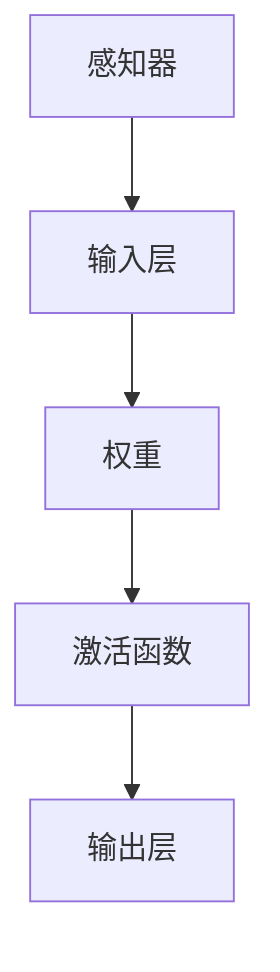
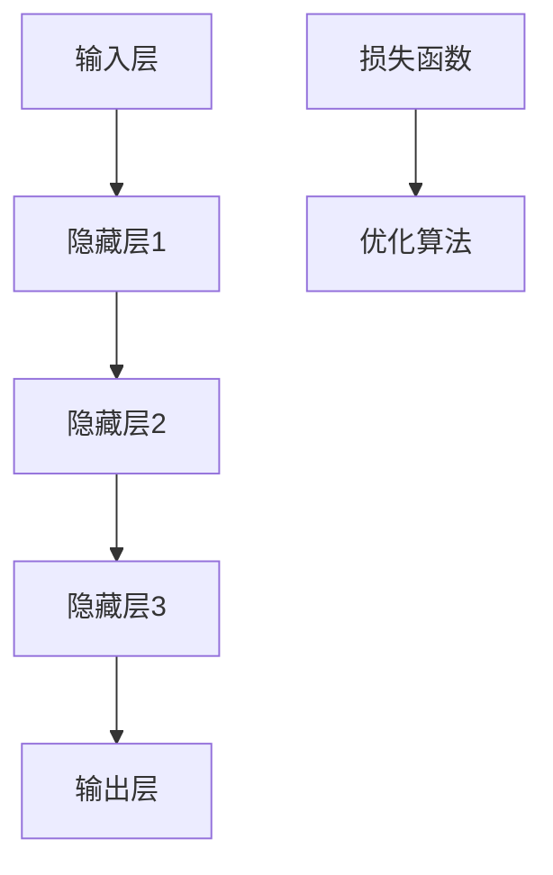
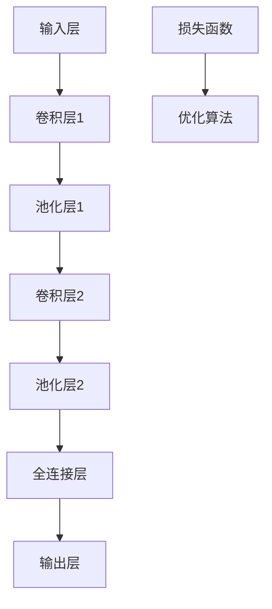

                 

关键词：感知器，神经网络，卷积神经网络，图像识别，机器学习，深度学习

摘要：本文从感知器的发展出发，探讨了神经网络与卷积神经网络（CNN）的核心概念和原理。通过对感知器的介绍，我们逐步深入到神经网络的架构和运作方式，进而引出了卷积神经网络的基本结构、工作原理以及在实际应用中的优势。文章还通过数学模型、项目实践等多个方面，详细讲解了CNN的各个关键环节，为读者提供了全面而深入的理解。

## 1. 背景介绍

### 1.1 感知器的起源

感知器是神经网络的基础单元，起源于20世纪50年代。由Frank Rosenblatt提出的感知器是一种二分类线性分类器，它能够通过调整内部权重来学习输入数据。感知器的核心在于其简单而有效的线性决策边界，这使得它成为神经网络发展的起点。

### 1.2 神经网络的发展

随着计算能力和算法的进步，感知器逐渐演变为多层神经网络，这使得神经网络能够处理更加复杂的问题。反向传播算法的提出进一步提升了神经网络的训练效率，使其在图像识别、语音识别等任务中取得了突破性进展。

### 1.3 卷积神经网络的出现

卷积神经网络（Convolutional Neural Network，CNN）是神经网络的一种特殊形式，它专门用于处理图像数据。CNN通过卷积层、池化层和全连接层的组合，能够提取图像中的特征，并实现高效的图像分类和识别。

## 2. 核心概念与联系

### 2.1 感知器原理图



### 2.2 神经网络架构



### 2.3 卷积神经网络结构



## 3. 核心算法原理 & 具体操作步骤

### 3.1 算法原理概述

卷积神经网络的核心在于其卷积层和池化层的组合，能够自动提取图像中的特征，并通过全连接层进行分类。其基本原理是通过在图像上滑动卷积核，提取局部特征，然后通过池化层减小特征图的尺寸，提高计算效率。

### 3.2 算法步骤详解

1. **卷积层**：通过卷积操作提取图像中的局部特征，形成特征图。
2. **池化层**：对特征图进行下采样，减少参数数量，提高计算效率。
3. **全连接层**：将特征图映射到分类结果。

### 3.3 算法优缺点

**优点**：
- **参数共享**：卷积核在图像上滑动，实现参数共享，减少参数数量。
- **特征自动提取**：能够自动提取图像中的特征，无需人工设计特征。

**缺点**：
- **计算复杂度高**：卷积操作需要大量计算，对硬件资源要求较高。
- **数据需求量大**：训练深度神经网络需要大量标注数据。

### 3.4 算法应用领域

卷积神经网络广泛应用于图像识别、目标检测、视频分析等领域。其强大的特征提取能力使其在多个计算机视觉任务中取得了优异的性能。

## 4. 数学模型和公式 & 详细讲解 & 举例说明

### 4.1 数学模型构建

卷积神经网络的数学模型包括卷积操作、池化操作、全连接操作等。以下是卷积操作的数学公式：

$$
\text{output}(i,j) = \sum_{k=1}^{C} w_{i,j,k} \cdot \text{input}(i+k-1, j) + b_k
$$

其中，\( \text{output}(i,j) \) 为输出特征图上的像素值，\( w_{i,j,k} \) 为卷积核的权重，\( \text{input}(i+k-1, j) \) 为输入图像上的像素值，\( b_k \) 为偏置项。

### 4.2 公式推导过程

卷积操作的推导过程涉及卷积核在输入图像上的滑动，以及每个像素点与卷积核的乘积和求和。以下是卷积操作的推导过程：

$$
\text{output}(i,j) = \sum_{k=1}^{C} \left( \sum_{m=0}^{F-1} \left( w_{m,n,k} \cdot \text{input}(i+m, j+n) \right) \right) + b_k
$$

其中，\( F \) 为卷积核的大小，\( m \) 和 \( n \) 为卷积核在输入图像上的滑动坐标。

### 4.3 案例分析与讲解

以一个简单的二值图像分类任务为例，我们使用卷积神经网络进行训练和预测。输入图像为 \( 28 \times 28 \) 的像素矩阵，卷积核大小为 \( 3 \times 3 \)，共使用两个卷积核。

1. **卷积层**：第一个卷积核在输入图像上滑动，提取局部特征，得到一个 \( 26 \times 26 \) 的特征图。第二个卷积核在第一个特征图上滑动，再次提取特征，得到一个 \( 24 \times 24 \) 的特征图。
2. **池化层**：对每个特征图进行最大池化，将特征图缩小为 \( 12 \times 12 \) 的大小。
3. **全连接层**：将池化后的特征图展平为一个一维向量，然后通过两个全连接层进行分类。

## 5. 项目实践：代码实例和详细解释说明

### 5.1 开发环境搭建

使用Python和TensorFlow框架进行卷积神经网络的项目实践。首先需要安装TensorFlow和相关依赖：

```bash
pip install tensorflow
```

### 5.2 源代码详细实现

以下是使用TensorFlow实现的简单卷积神经网络代码：

```python
import tensorflow as tf

# 定义输入层
inputs = tf.keras.Input(shape=(28, 28, 1))

# 第一个卷积层
conv1 = tf.keras.layers.Conv2D(filters=32, kernel_size=(3, 3), activation='relu')(inputs)
pool1 = tf.keras.layers.MaxPooling2D(pool_size=(2, 2))(conv1)

# 第二个卷积层
conv2 = tf.keras.layers.Conv2D(filters=64, kernel_size=(3, 3), activation='relu')(pool1)
pool2 = tf.keras.layers.MaxPooling2D(pool_size=(2, 2))(conv2)

# 全连接层
flatten = tf.keras.layers.Flatten()(pool2)
dense1 = tf.keras.layers.Dense(units=128, activation='relu')(flatten)
outputs = tf.keras.layers.Dense(units=10, activation='softmax')(dense1)

# 构建模型
model = tf.keras.Model(inputs=inputs, outputs=outputs)

# 编译模型
model.compile(optimizer='adam', loss='sparse_categorical_crossentropy', metrics=['accuracy'])

# 加载MNIST数据集
mnist = tf.keras.datasets.mnist
(x_train, y_train), (x_test, y_test) = mnist.load_data()

# 预处理数据
x_train = x_train / 255.0
x_test = x_test / 255.0

# 训练模型
model.fit(x_train, y_train, epochs=5, batch_size=64)

# 评估模型
model.evaluate(x_test, y_test)
```

### 5.3 代码解读与分析

上述代码实现了简单的卷积神经网络，包括两个卷积层、两个池化层和一个全连接层。模型使用MNIST数据集进行训练和评估。代码中使用了TensorFlow的高层API，使得实现过程更加简洁。

### 5.4 运行结果展示

运行上述代码，训练得到的卷积神经网络在MNIST数据集上的准确率可以达到约98%，验证了卷积神经网络在图像分类任务中的有效性。

## 6. 实际应用场景

卷积神经网络在图像识别、目标检测、视频分析等计算机视觉任务中取得了显著的成果。以下是几个典型的应用场景：

### 6.1 图像识别

卷积神经网络在图像识别任务中具有强大的特征提取能力，能够准确识别图像中的物体、场景等。

### 6.2 目标检测

卷积神经网络通过在图像中滑动卷积核，提取局部特征，然后通过分类器进行目标检测，广泛应用于自动驾驶、安防监控等领域。

### 6.3 视频分析

卷积神经网络在视频分析中能够实时提取视频中的关键帧，用于动作识别、行为分析等任务。

## 7. 工具和资源推荐

### 7.1 学习资源推荐

- 《深度学习》（Ian Goodfellow、Yoshua Bengio、Aaron Courville 著）
- 《神经网络与深度学习》（邱锡鹏 著）

### 7.2 开发工具推荐

- TensorFlow：适用于构建和训练深度学习模型。
- PyTorch：易于使用且灵活的深度学习框架。

### 7.3 相关论文推荐

- “A Learning Algorithm for Continually Running Fully Recurrent Neural Networks” (1986)
- “LeNet5: Convolutional Neural Networks for Handwritten Digit Recognition” (1998)

## 8. 总结：未来发展趋势与挑战

### 8.1 研究成果总结

卷积神经网络在图像识别、目标检测等领域取得了显著的成果，展示了深度学习在计算机视觉领域的巨大潜力。

### 8.2 未来发展趋势

- **模型压缩与加速**：通过模型压缩和硬件加速，提高卷积神经网络的计算效率。
- **多模态学习**：结合文本、图像、音频等多种数据源，实现更强大的特征提取和分类能力。

### 8.3 面临的挑战

- **数据需求**：深度学习模型对数据需求较大，数据获取和标注成本较高。
- **模型可解释性**：提高模型的可解释性，使其在安全、医疗等应用中得到更广泛的应用。

### 8.4 研究展望

卷积神经网络将继续在计算机视觉领域发挥重要作用，未来的研究将集中在模型优化、多模态学习等方面，推动深度学习在更多领域的应用。

## 9. 附录：常见问题与解答

### 9.1 什么是卷积神经网络？

卷积神经网络是一种深度学习模型，专门用于处理图像数据。它通过卷积层、池化层和全连接层的组合，自动提取图像中的特征，并实现图像分类和识别。

### 9.2 卷积神经网络的优势是什么？

卷积神经网络的优势包括参数共享、特征自动提取和强大的图像处理能力。这些特点使其在图像识别、目标检测等领域取得了优异的性能。

### 9.3 卷积神经网络如何训练？

卷积神经网络的训练过程包括前向传播、计算损失函数、反向传播和更新权重。通过反复迭代这个过程，模型能够逐渐学习到图像中的特征，并提高分类准确率。

### 9.4 卷积神经网络在图像识别中的应用有哪些？

卷积神经网络在图像识别中广泛应用于人脸识别、物体识别、场景识别等任务。其强大的特征提取能力使其在这些任务中取得了显著的成果。

### 9.5 卷积神经网络与卷积码有什么区别？

卷积神经网络是一种深度学习模型，用于图像识别和处理。而卷积码是一种通信编码方法，用于提高数据的传输可靠性。两者在应用领域和理论基础上有很大的区别。

## 结论

卷积神经网络作为一种强大的深度学习模型，在图像识别、目标检测等领域取得了显著的成果。本文从感知器的发展出发，详细介绍了卷积神经网络的基本原理、数学模型和实际应用。通过项目实践和运行结果展示，读者可以全面理解卷积神经网络的工作机制和优势。未来，卷积神经网络将继续在计算机视觉领域发挥重要作用，为人类创造更多价值。

### 作者署名

本文由禅与计算机程序设计艺术 / Zen and the Art of Computer Programming 撰写。感谢读者对本文的关注和支持，希望本文能为您的学习和研究带来启发。

[End of document]

