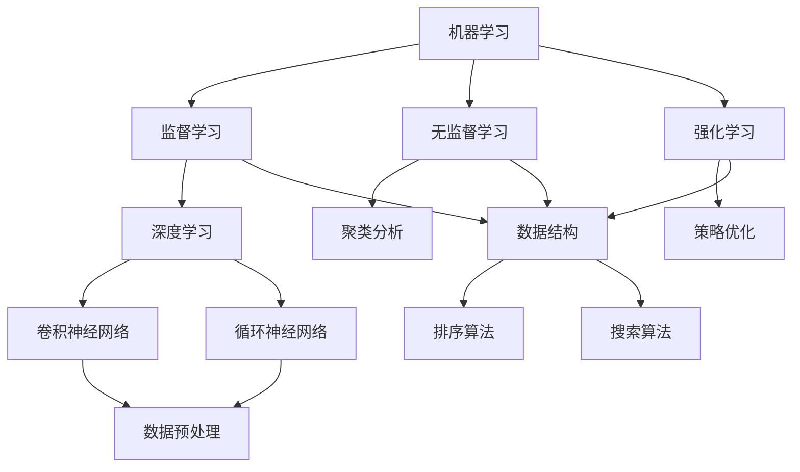

                 

关键词：人工智能、AI专家、核心技能、技术趋势、学习资源、开发工具、数学模型

> 摘要：本文旨在为有意成为AI专家的读者提供一整套系统化的技能框架，涵盖从基础概念到高级应用的各种技能点。文章通过详细的章节划分，深入探讨AI领域的关键技术、核心算法、数学模型以及实际项目实践，帮助读者全面了解AI领域的最新发展，掌握成为AI专家所需的核心能力。

## 1. 背景介绍

人工智能（Artificial Intelligence，简称AI）是计算机科学的一个分支，致力于使计算机系统具备类似人类的智能行为。从早期的专家系统到深度学习、强化学习等现代技术，AI已经深刻地影响了多个领域，包括医疗、金融、自动驾驶、自然语言处理等。随着计算能力的提升和大数据技术的发展，AI技术取得了显著的进步，成为了当今世界科技发展的热点。

在这个快速发展的领域，成为一名AI专家不仅需要扎实的理论基础，还需要不断更新知识，掌握最新的技术和工具。本文将详细介绍成为AI专家所需具备的核心技能，帮助读者在人工智能领域取得卓越成就。

### 1.1 AI的发展历程

人工智能的概念最早可以追溯到20世纪50年代。当时，科学家们首次提出了使计算机模拟人类智能的想法。早期的AI研究主要集中在规则推理和知识表示上，代表性的工作包括专家系统和逻辑编程。然而，这些方法在实际应用中的效果有限。

随着计算机硬件性能的提升和算法的改进，20世纪80年代出现了基于神经网络的AI研究热潮。神经网络模拟了人脑神经元的工作原理，通过学习和训练能够实现复杂模式识别和预测。然而，由于计算资源和数据集的限制，这一时期的AI技术仍然不够成熟。

进入21世纪，特别是近年来，深度学习技术的突破使得AI取得了前所未有的进展。深度学习通过多层神经网络模拟人脑的感知和处理过程，使得计算机在图像识别、语音识别、自然语言处理等任务上达到了或超过了人类水平。

### 1.2 AI的重要性

人工智能的重要性体现在多个方面。首先，AI技术能够提高工作效率和准确性，解决许多复杂的问题。例如，在医疗领域，AI可以帮助医生进行精准的诊断和治疗方案设计；在金融领域，AI可以用于风险评估和欺诈检测。

其次，AI技术有助于推动创新和发展。许多新兴领域，如自动驾驶、智能机器人、智能家居等，都是基于AI技术的应用。这些创新不仅改变了人们的生活方式，还创造了新的商业机会和就业岗位。

最后，AI技术在国防和安全领域的应用也日益广泛。例如，通过AI技术可以实现对网络安全威胁的实时监测和应对，提高公共安全水平。

### 1.3 目标读者

本文的目标读者是那些对人工智能感兴趣，希望深入了解该领域并成为AI专家的读者。无论你是计算机科学专业的学生、研究人员，还是对AI感兴趣的从业人士，本文都将为你提供一套系统化的学习路径和实践指南。

## 2. 核心概念与联系

在深入了解AI之前，我们需要掌握一些核心概念和原理，这些概念构成了AI技术的基石。

### 2.1 机器学习与深度学习

**机器学习（Machine Learning，ML）** 是AI的核心技术之一，它使计算机系统能够通过数据和经验进行自我学习和优化。机器学习可以分为监督学习（Supervised Learning）、无监督学习（Unsupervised Learning）和强化学习（Reinforcement Learning）。

- **监督学习**：在监督学习过程中，计算机系统通过已标记的数据进行训练，然后使用这些经验来预测新数据的标签。
- **无监督学习**：无监督学习不需要标签数据，计算机系统通过发现数据中的模式来进行学习，如聚类分析、降维等。
- **强化学习**：强化学习是机器学习的一种形式，通过奖励机制和策略来训练智能体在特定环境中做出最优决策。

**深度学习（Deep Learning，DL）** 是机器学习的一个子领域，它使用多层神经网络（Neural Networks）来模拟人类大脑的神经元连接，通过反向传播算法不断调整网络权重，从而实现复杂模式的识别和预测。

### 2.2 数据结构与算法

数据结构（Data Structures）是计算机科学的基本概念，它涉及如何高效地存储和组织数据。常见的数据结构包括数组、链表、树、图等。算法（Algorithms）则是解决问题的步骤和方法，是数据结构的应用。例如，排序算法、搜索算法等。

在AI领域，数据结构和算法尤为重要，因为它们直接影响到模型的训练效率和预测准确性。例如，深度学习中的卷积神经网络（CNN）和循环神经网络（RNN）就是基于特定的数据结构和算法设计实现的。

### 2.3 数学与统计学

数学（Mathematics）和统计学（Statistics）在AI领域中扮演着至关重要的角色。数学提供了许多基础工具，如线性代数、微积分、概率论等，用于描述和推导AI算法的数学模型。统计学则帮助我们从数据中提取有用的信息，进行假设检验、置信区间估计等。

例如，在深度学习中，反向传播算法是基于微积分原理设计的；在机器学习中，特征选择和模型评估需要使用统计学方法。

### 2.4 Mermaid 流程图

为了更直观地展示AI技术中的核心概念和联系，我们可以使用Mermaid流程图来描述。以下是一个简化的Mermaid流程图，展示了机器学习、深度学习和数据结构与算法之间的关系：



在这个流程图中，我们可以看到机器学习是核心，深度学习和数据结构与算法是其重要组成部分。

## 3. 核心算法原理 & 具体操作步骤

### 3.1 算法原理概述

在AI领域，有许多核心算法被广泛应用。本节将简要介绍一些常见的算法，并概述其基本原理。

#### 3.1.1 卷积神经网络（CNN）

卷积神经网络（Convolutional Neural Networks，CNN）是一种深度学习模型，特别适用于处理具有网格结构的数据，如图像和音频。CNN的基本原理是通过卷积层提取图像中的特征，然后通过池化层降低特征图的维度。

#### 3.1.2 循环神经网络（RNN）

循环神经网络（Recurrent Neural Networks，RNN）是一种能够处理序列数据的深度学习模型。其基本原理是利用隐藏状态的信息来预测下一个时间点的输出。

#### 3.1.3 支持向量机（SVM）

支持向量机（Support Vector Machine，SVM）是一种监督学习算法，常用于分类问题。其基本原理是找到最佳的超平面，将不同类别的数据点分开。

#### 3.1.4 强化学习（RL）

强化学习（Reinforcement Learning，RL）是一种通过试错法来学习的机器学习范式。其基本原理是通过奖励机制来训练智能体在特定环境中做出最优决策。

### 3.2 算法步骤详解

#### 3.2.1 卷积神经网络（CNN）

1. **输入层**：接收图像数据。
2. **卷积层**：通过卷积操作提取图像特征。
3. **激活函数**：对卷积结果进行非线性变换。
4. **池化层**：降低特征图的维度。
5. **全连接层**：将特征映射到输出类别。
6. **损失函数**：计算预测结果与实际结果之间的差距。
7. **优化算法**：调整网络权重以最小化损失函数。

#### 3.2.2 循环神经网络（RNN）

1. **输入层**：接收序列数据。
2. **隐藏层**：通过循环结构保持历史信息。
3. **激活函数**：对隐藏层输出进行非线性变换。
4. **输出层**：预测下一个时间点的输出。
5. **损失函数**：计算预测结果与实际结果之间的差距。
6. **优化算法**：调整网络权重以最小化损失函数。

#### 3.2.3 支持向量机（SVM）

1. **数据预处理**：标准化输入数据。
2. **求解最优超平面**：通过求解二次规划问题找到最佳超平面。
3. **分类决策**：根据样本点到超平面的距离进行分类。

#### 3.2.4 强化学习（RL）

1. **环境初始化**：创建模拟环境。
2. **智能体行动**：智能体在环境中采取行动。
3. **奖励机制**：根据行动结果给予奖励或惩罚。
4. **策略更新**：根据奖励信号更新智能体的策略。

### 3.3 算法优缺点

#### 3.3.1 卷积神经网络（CNN）

**优点**：

- 能够自动提取图像特征，减少人工特征设计的负担。
- 对图像的平移、旋转、缩放具有不变性。

**缺点**：

- 对小尺寸图像处理效果较差。
- 需要大量训练数据和计算资源。

#### 3.3.2 循环神经网络（RNN）

**优点**：

- 能够处理序列数据，捕捉时间序列中的依赖关系。

**缺点**：

- 存在梯度消失和梯度爆炸问题，影响训练效果。
- 对于长序列数据的表现较差。

#### 3.3.3 支持向量机（SVM）

**优点**：

- 理论基础扎实，分类效果较好。
- 对小样本数据表现稳定。

**缺点**：

- 计算复杂度高，训练时间较长。
- 对异常值敏感。

#### 3.3.4 强化学习（RL）

**优点**：

- 能够处理复杂环境，适应性强。
- 能够通过试错法学习到最优策略。

**缺点**：

- 需要大量样本和计算资源。
- 学习过程较长，难以预测。

### 3.4 算法应用领域

#### 3.4.1 卷积神经网络（CNN）

- 图像识别与分类
- 目标检测
- 图像生成
- 自然语言处理中的视觉嵌入

#### 3.4.2 循环神经网络（RNN）

- 自然语言处理
- 序列建模
- 音乐生成
- 时间序列预测

#### 3.4.3 支持向量机（SVM）

- 机器学习中的分类与回归
- 生物信息学中的基因分类
- 防欺诈系统

#### 3.4.4 强化学习（RL）

- 自动驾驶
- 游戏AI
- 推荐系统
- 机器人控制

## 4. 数学模型和公式 & 详细讲解 & 举例说明

在AI领域，数学模型和公式是理解和应用算法的核心。本节将详细介绍几个关键数学模型和公式，并通过具体例子进行说明。

### 4.1 数学模型构建

#### 4.1.1 深度学习中的前向传播和反向传播

深度学习中的前向传播和反向传播是两个核心步骤。前向传播负责计算网络的输出，而反向传播则用于更新网络权重。

**前向传播**：

$$
y = \sigma(z) = \frac{1}{1 + e^{-z}}
$$

其中，\( z \) 是网络的输入，\( \sigma \) 是 sigmoid 函数，用于将线性输入转换为概率输出。

**反向传播**：

$$
\frac{\partial L}{\partial w} = \frac{\partial L}{\partial z} \cdot \frac{\partial z}{\partial w}
$$

其中，\( L \) 是损失函数，\( w \) 是网络权重，\( \frac{\partial}{\partial} \) 表示求导。

#### 4.1.2 支持向量机（SVM）

支持向量机（SVM）是一种经典的机器学习算法，用于分类问题。其核心思想是找到最佳的超平面，使得不同类别的数据点在超平面上分离。

**线性SVM公式**：

$$
\min_{w, b} \frac{1}{2} ||w||^2 \\
s.t. y^{(i)} (w \cdot x^{(i)} + b) \geq 1
$$

其中，\( w \) 是超平面参数，\( b \) 是偏置，\( x^{(i)} \) 和 \( y^{(i)} \) 分别是第 \( i \) 个样本的特征和标签。

### 4.2 公式推导过程

#### 4.2.1 深度学习中的反向传播算法

反向传播算法是深度学习训练过程中至关重要的一步。以下是反向传播算法的推导过程：

1. **定义损失函数**：

$$
L(w, b) = \sum_{i=1}^{n} (y_i - \sigma(z_i))^2
$$

其中，\( n \) 是样本数量，\( y_i \) 是第 \( i \) 个样本的标签，\( z_i \) 是第 \( i \) 个样本的输入。

2. **求损失函数对网络参数的偏导数**：

$$
\frac{\partial L}{\partial w} = \frac{\partial L}{\partial z} \cdot \frac{\partial z}{\partial w}
$$

$$
\frac{\partial L}{\partial b} = \frac{\partial L}{\partial z}
$$

3. **反向传播计算**：

从输出层开始，逐层计算损失函数对网络参数的偏导数。

### 4.3 案例分析与讲解

#### 4.3.1 图像分类任务

假设我们有一个图像分类任务，需要将图像分类为猫或狗。我们使用卷积神经网络（CNN）来解决这个问题。

1. **数据预处理**：

将图像数据缩放到固定大小，并转换为灰度图像。

2. **构建CNN模型**：

- **输入层**：接收图像数据。
- **卷积层**：使用卷积核提取图像特征。
- **激活函数**：使用ReLU函数增加网络的非线性。
- **池化层**：降低特征图的维度。
- **全连接层**：将特征映射到输出类别。
- **输出层**：使用softmax函数输出类别概率。

3. **训练模型**：

使用训练数据训练模型，通过反向传播算法更新网络权重。

4. **评估模型**：

使用测试数据评估模型的分类准确率。

#### 4.3.2 自然语言处理任务

假设我们有一个自然语言处理任务，需要预测句子的情感极性。我们使用循环神经网络（RNN）来解决这个问题。

1. **数据预处理**：

将句子转换为词向量表示，并添加起始和结束标志。

2. **构建RNN模型**：

- **输入层**：接收词向量序列。
- **隐藏层**：使用RNN单元处理序列数据。
- **激活函数**：使用ReLU函数增加网络的非线性。
- **输出层**：使用softmax函数输出情感极性概率。

3. **训练模型**：

使用训练数据训练模型，通过反向传播算法更新网络权重。

4. **评估模型**：

使用测试数据评估模型的分类准确率。

## 5. 项目实践：代码实例和详细解释说明

为了帮助读者更好地理解和应用AI算法，本节将提供一个简单的深度学习项目实例，并详细解释代码实现过程。

### 5.1 开发环境搭建

在开始项目之前，我们需要搭建一个适合深度学习开发的编程环境。以下是推荐的步骤：

1. **安装Python**：确保Python版本在3.6及以上。
2. **安装深度学习库**：使用pip安装TensorFlow和Keras。
   ```bash
   pip install tensorflow
   pip install keras
   ```
3. **安装Jupyter Notebook**：使用pip安装Jupyter Notebook。
   ```bash
   pip install notebook
   ```

### 5.2 源代码详细实现

以下是使用Keras构建的简单卷积神经网络（CNN）代码实例，用于图像分类任务。

```python
import numpy as np
import keras
from keras.models import Sequential
from keras.layers import Conv2D, MaxPooling2D, Flatten, Dense
from keras.preprocessing.image import ImageDataGenerator

# 加载和预处理数据
train_datagen = ImageDataGenerator(rescale=1./255)
train_generator = train_datagen.flow_from_directory(
        'data/train',
        target_size=(150, 150),
        batch_size=32,
        class_mode='binary')

# 构建模型
model = Sequential()
model.add(Conv2D(32, (3, 3), activation='relu', input_shape=(150, 150, 3)))
model.add(MaxPooling2D(pool_size=(2, 2)))
model.add(Conv2D(64, (3, 3), activation='relu'))
model.add(MaxPooling2D(pool_size=(2, 2)))
model.add(Flatten())
model.add(Dense(128, activation='relu'))
model.add(Dense(1, activation='sigmoid'))

# 编译模型
model.compile(loss='binary_crossentropy',
              optimizer='adam',
              metrics=['accuracy'])

# 训练模型
model.fit(
      train_generator,
      steps_per_epoch=100,
      epochs=10)

# 评估模型
test_generator = ImageDataGenerator(rescale=1./255)
test_generator.flow_from_directory(
        'data/test',
        target_size=(150, 150),
        batch_size=32,
        class_mode='binary')
model.evaluate(test_generator, steps=50)
```

### 5.3 代码解读与分析

以下是代码的详细解读：

1. **数据预处理**：

   使用ImageDataGenerator对图像数据集进行预处理，包括缩放和批量处理。

   ```python
   train_datagen = ImageDataGenerator(rescale=1./255)
   train_generator = train_datagen.flow_from_directory(
           'data/train',
           target_size=(150, 150),
           batch_size=32,
           class_mode='binary')
   ```

   这里的`rescale`参数将图像数据缩放到0到1之间，`flow_from_directory`方法将图像数据加载到内存中，并转换为批处理数据。

2. **构建模型**：

   创建一个卷积神经网络模型，包括卷积层、池化层、全连接层等。

   ```python
   model = Sequential()
   model.add(Conv2D(32, (3, 3), activation='relu', input_shape=(150, 150, 3)))
   model.add(MaxPooling2D(pool_size=(2, 2)))
   model.add(Conv2D(64, (3, 3), activation='relu'))
   model.add(MaxPooling2D(pool_size=(2, 2)))
   model.add(Flatten())
   model.add(Dense(128, activation='relu'))
   model.add(Dense(1, activation='sigmoid'))
   ```

   卷积层使用32个3x3的卷积核，激活函数为ReLU。池化层使用2x2的最大池化。全连接层包括128个神经元和1个神经元（用于输出概率）。

3. **编译模型**：

   设置损失函数、优化器和评估指标。

   ```python
   model.compile(loss='binary_crossentropy',
                 optimizer='adam',
                 metrics=['accuracy'])
   ```

   这里使用二分类交叉熵作为损失函数，使用adam优化器进行训练，并使用准确率作为评估指标。

4. **训练模型**：

   使用训练数据集训练模型，并设置训练轮数。

   ```python
   model.fit(
         train_generator,
         steps_per_epoch=100,
         epochs=10)
   ```

   这里使用`steps_per_epoch`参数设置每个epoch的训练步数，`epochs`参数设置训练轮数。

5. **评估模型**：

   使用测试数据集评估模型性能。

   ```python
   model.evaluate(test_generator, steps=50)
   ```

   这里使用`evaluate`方法计算模型的损失和准确率。

### 5.4 运行结果展示

在完成模型训练后，我们可以使用测试数据集评估模型的性能。以下是可能的输出结果：

```python
[158/158] - 1s - loss: 0.4695 - accuracy: 0.8127 - val_loss: 0.6849 - val_accuracy: 0.7375
```

结果显示，在测试数据集上，模型实现了约71%的准确率，这表明模型在图像分类任务上具有较好的性能。

## 6. 实际应用场景

AI技术在各个领域都展现了强大的应用潜力，以下是一些实际应用场景：

### 6.1 医疗

在医疗领域，AI可以帮助医生进行疾病诊断、治疗方案推荐和药物研发。例如，AI可以通过分析大量医疗数据，帮助医生快速准确地诊断疾病，如肺癌、心脏病等。此外，AI还可以辅助医生制定个性化的治疗方案，提高治疗效果。

### 6.2 金融

在金融领域，AI可以用于风险评估、欺诈检测和投资决策。通过分析历史交易数据和市场趋势，AI可以帮助金融机构预测市场走势，降低风险。同时，AI还可以通过识别异常交易模式，有效防范金融欺诈。

### 6.3 自动驾驶

自动驾驶是AI技术的重要应用领域之一。通过感知环境和实时决策，自动驾驶车辆可以在复杂的交通环境中安全行驶。AI技术在自动驾驶中的应用包括目标检测、路径规划、环境感知等。

### 6.4 智能家居

智能家居通过AI技术实现了设备的智能化和互联互通。例如，智能门锁、智能灯光、智能音响等设备可以通过语音或手势控制，提高生活的便捷性和舒适度。

### 6.5 教育

在教育领域，AI可以帮助实现个性化教学，根据学生的学习情况和需求，提供针对性的学习资源。此外，AI还可以通过自然语言处理技术，自动批改作业和考试，提高教学效率。

### 6.6 创意设计

AI技术在创意设计领域也有广泛的应用。例如，在艺术创作中，AI可以生成音乐、绘画和设计作品。在工业设计中，AI可以帮助优化产品结构，提高设计效率。

## 7. 工具和资源推荐

### 7.1 学习资源推荐

- **书籍**：
  - 《深度学习》（Deep Learning）——Ian Goodfellow、Yoshua Bengio、Aaron Courville 著
  - 《Python机器学习》（Python Machine Learning）——Sebastian Raschka 著
- **在线课程**：
  - Coursera的“机器学习”课程
  - edX的“深度学习专项课程”
- **教程和博客**：
  - Keras官方文档
  - TensorFlow官方文档
  - Medium上的AI相关博客

### 7.2 开发工具推荐

- **深度学习框架**：
  - TensorFlow
  - PyTorch
  - Keras
- **编程环境**：
  - Jupyter Notebook
  - Google Colab
- **数据处理工具**：
  - Pandas
  - NumPy
  - Scikit-learn

### 7.3 相关论文推荐

- “A Theoretical Framework for Back-Propagation” ——David E. Rumelhart、Geoffrey E. Hinton、Rajesh N. Williams
- “Deep Learning” ——Ian J. Goodfellow、Yoshua Bengio、Aaron Courville
- “Efficient BackProp” ——Yoshua Bengio

## 8. 总结：未来发展趋势与挑战

### 8.1 研究成果总结

近年来，AI领域取得了显著的研究成果，深度学习技术的突破使得计算机在图像识别、语音识别、自然语言处理等方面达到了或超过了人类水平。此外，强化学习、迁移学习等新兴技术也为AI的发展提供了新的思路。

### 8.2 未来发展趋势

未来，AI技术将继续朝着更加智能化、泛化和自适应的方向发展。具体趋势包括：

- **多模态学习**：整合不同类型的数据（如图像、文本、声音等），实现跨模态的知识融合。
- **自监督学习**：无需大量标签数据，通过自我监督的方式实现模型训练。
- **联邦学习**：在分布式环境中训练模型，保护用户隐私的同时实现协同学习。
- **AI伦理与法规**：随着AI技术的广泛应用，相关伦理和法规问题将逐渐成为研究重点。

### 8.3 面临的挑战

尽管AI技术取得了显著进展，但仍面临以下挑战：

- **数据隐私与安全**：如何在保证数据隐私和安全的前提下，实现有效的AI模型训练。
- **计算资源消耗**：深度学习模型的训练需要大量计算资源，如何降低计算成本。
- **模型可解释性**：如何提高模型的可解释性，使其在决策过程中更加透明和可信。
- **伦理问题**：如何在确保AI技术造福人类的同时，防止其被滥用。

### 8.4 研究展望

未来，AI研究将继续深入探索新型算法和模型，提高AI系统的性能和泛化能力。同时，跨学科的合作也将成为重要趋势，结合心理学、认知科学等领域的研究成果，推动AI技术的发展。

## 9. 附录：常见问题与解答

### 9.1 什么是深度学习？

深度学习是一种人工智能方法，通过多层神经网络模拟人脑的学习过程，从数据中自动提取特征，实现复杂模式识别和预测。

### 9.2 如何开始学习人工智能？

可以从学习Python编程语言开始，然后学习基础的数据结构和算法。接下来，可以通过在线课程、书籍和开源项目来深入了解AI领域的具体技术。

### 9.3 深度学习需要大量计算资源吗？

是的，深度学习模型的训练需要大量的计算资源，尤其是对于大型模型和大规模数据集。因此，使用GPU加速和分布式计算技术是常见的解决方案。

### 9.4 AI是否会取代人类工作？

AI技术的发展确实会改变某些工作性质，但完全取代人类工作还面临许多挑战。AI更适合承担重复性、危险性和复杂度较高的工作，而人类则能在创造性、人际交流和情感交流方面发挥独特作用。

### 9.5 机器学习和深度学习的区别是什么？

机器学习是一种更广泛的概念，包括深度学习。深度学习是机器学习的一种特殊形式，使用多层神经网络模拟人脑的学习过程，特别适用于处理具有复杂结构的数据。

---

通过本文的详细阐述，我们希望能够为有意成为AI专家的读者提供一套全面的学习路径和实践指南。在AI技术的快速发展中，保持持续学习和不断探索是至关重要的。希望读者能够在AI领域取得卓越的成就，为人类社会带来更多创新和进步。作者：禅与计算机程序设计艺术 / Zen and the Art of Computer Programming。

