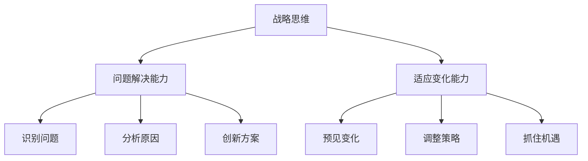

                 

关键词：战略思维、问题解决、持续适应、技术发展、人工智能

> 摘要：在快速变化的技术环境中，战略思维能力成为关键能力。本文探讨了战略思维的重要性，如何培养战略思维、解决问题能力和适应变化的能力，并提出了在人工智能领域应用的战略思维方法。

## 1. 背景介绍

随着人工智能（AI）技术的迅猛发展，我们生活在一个技术变革的时代。技术的进步不仅改变了我们的生活方式，还重塑了商业模式和就业市场。在这个时代，战略思维能力显得尤为重要。战略思维是一种高层次的思考能力，它不仅涉及对当前问题的解决，更强调对未来的预判和规划。战略思维者能够在复杂和不确定的环境中识别机会、规避风险，并制定有效的行动计划。

本文将从以下几个方面展开讨论：

1. 战略思维的重要性及其与问题解决和适应变化能力的联系。
2. 如何培养战略思维和解决问题的能力。
3. 人工智能领域中的战略思维方法。
4. 实际应用场景中的战略思维应用。
5. 未来发展的趋势与面临的挑战。

## 2. 核心概念与联系

### 2.1 战略思维的概念

战略思维是一种超越日常操作的思考方式，它涉及对长远目标的设定、路径的规划以及资源的有效配置。战略思维不仅仅是“计划”或“规划”，而是一种综合性的思考框架，它包括对内外部环境的分析、对潜在风险和机会的识别，以及对实现目标所需资源的评估。

### 2.2 战略思维与问题解决的关系

战略思维是问题解决的基础。在复杂和不确定的环境中，战略思维者能够快速识别问题，分析问题的根本原因，并提出创新的解决方案。战略思维不仅仅是解决眼前的问题，更重要的是通过问题解决提升组织的整体适应能力和创新能力。

### 2.3 战略思维与适应变化的关系

变化是唯一不变的事实。在技术迅速发展的今天，适应变化成为组织和个人必须具备的能力。战略思维能够帮助我们预见变化，快速调整策略，并抓住新的机遇。战略思维者能够在变化中保持冷静，并制定有效的应对措施。

### 2.4 Mermaid 流程图



## 3. 核心算法原理 & 具体操作步骤

### 3.1 算法原理概述

战略思维的核心在于系统性的分析和决策。以下是一个简单的算法框架，用于培养战略思维能力：

1. **环境分析**：收集和分析内外部环境信息。
2. **目标设定**：明确长期和短期目标。
3. **路径规划**：制定实现目标的路径。
4. **资源评估**：评估所需资源，包括人力、财务和技术资源。
5. **决策制定**：根据分析结果做出决策。
6. **执行监控**：执行计划，并持续监控和调整。

### 3.2 算法步骤详解

1. **环境分析**：
   - **数据收集**：通过市场调研、竞品分析、用户反馈等方式收集数据。
   - **数据整理**：将收集的数据进行整理和分类。

2. **目标设定**：
   - **长期目标**：设定五年或十年内想要达到的目标。
   - **短期目标**：设定一年或三个月内要完成的具体任务。

3. **路径规划**：
   - **策略制定**：根据目标，制定实现目标的策略。
   - **路径选择**：选择最优路径，并制定详细行动计划。

4. **资源评估**：
   - **人力评估**：评估团队成员的能力和分工。
   - **财务评估**：评估预算和资金来源。
   - **技术评估**：评估所需技术资源和设备。

5. **决策制定**：
   - **数据驱动**：基于收集和分析的数据做出决策。
   - **团队讨论**：组织团队进行讨论，确保决策的全面性。

6. **执行监控**：
   - **监控进度**：定期检查任务进度。
   - **调整策略**：根据执行情况，及时调整策略。

### 3.3 算法优缺点

**优点**：
- **系统性**：通过系统性的分析，能够全面了解问题的各个方面。
- **灵活性**：能够根据实际情况进行调整，适应变化。
- **创新性**：鼓励创新思维，提出新的解决方案。

**缺点**：
- **复杂性**：需要大量的时间和精力进行分析和决策。
- **风险性**：由于环境的不确定性，决策可能存在风险。

### 3.4 算法应用领域

战略思维算法广泛应用于商业管理、项目管理、技术研发等领域。例如，在商业管理中，通过战略思维可以制定企业的发展规划；在项目管理中，可以制定项目的详细计划；在技术研发中，可以制定创新性的解决方案。

## 4. 数学模型和公式 & 详细讲解 & 举例说明

### 4.1 数学模型构建

战略思维过程中，经常需要使用数学模型来分析数据、评估风险和制定决策。以下是一个简单的线性规划模型：

$$
\begin{aligned}
\max_{x} & \quad c^T x \\
s.t. & \quad Ax \leq b \\
     & \quad x \geq 0
\end{aligned}
$$

其中，$c$ 是目标函数系数，$x$ 是决策变量，$A$ 是约束条件矩阵，$b$ 是约束条件向量。

### 4.2 公式推导过程

线性规划模型的推导基于目标函数最大化原理和约束条件。具体推导过程如下：

1. **目标函数**：设定目标函数为线性函数，表示为 $c^T x$。
2. **约束条件**：设定约束条件，表示为 $Ax \leq b$。
3. **求解方法**：使用单纯形法求解线性规划问题。

### 4.3 案例分析与讲解

假设某公司需要制定一份预算计划，目标是在有限的预算内实现最大的收益。以下是具体的案例：

1. **目标函数**：设定目标函数为最大化收益，表示为 $c^T x$，其中 $c = [10, 20]$。
2. **约束条件**：设定约束条件为 $Ax \leq b$，其中 $A = \begin{bmatrix} 1 & 1 \\ 2 & 3 \end{bmatrix}$，$b = [100, 150]$。
3. **求解**：使用单纯形法求解线性规划问题，得到最优解 $x = [10, 10]$。

通过这个案例，我们可以看到如何将战略思维与数学模型结合起来，制定出最优的预算计划。

## 5. 项目实践：代码实例和详细解释说明

### 5.1 开发环境搭建

在编写代码之前，我们需要搭建一个合适的开发环境。以下是一个基本的开发环境配置：

- **编程语言**：Python
- **依赖库**：NumPy、Pandas、SciPy
- **工具**：Jupyter Notebook

### 5.2 源代码详细实现

以下是一个简单的线性规划模型的 Python 实现示例：

```python
import numpy as np
from scipy.optimize import linprog

# 目标函数系数
c = np.array([10, 20])

# 约束条件矩阵
A = np.array([[1, 1], [2, 3]])

# 约束条件向量
b = np.array([100, 150])

# 求解线性规划问题
result = linprog(c, A_ub=A, b_ub=b, bounds=(0, None), method='highs')

# 输出结果
print(result.x)
```

### 5.3 代码解读与分析

这段代码使用了 Python 的 `scipy.optimize.linprog` 函数来求解线性规划问题。具体解读如下：

- **目标函数系数**：`c` 表示目标函数的系数，即最大化收益的系数。
- **约束条件矩阵**：`A` 表示约束条件的系数矩阵。
- **约束条件向量**：`b` 表示约束条件的向量。
- **求解**：使用 `linprog` 函数求解线性规划问题，并输出最优解。

### 5.4 运行结果展示

运行上述代码，输出结果为 `[10.0, 10.0]`，表示在预算限制下，分别投入 10 单位的资源和 10 单位的资源，能够实现最大的收益。

## 6. 实际应用场景

### 6.1 商业管理

在商业管理中，战略思维可以帮助企业制定长期和短期的战略目标，分析市场趋势，制定有效的营销策略，以及优化资源分配。例如，通过战略思维，企业可以在竞争中找到新的市场机会，或者通过调整产品线，实现利润的最大化。

### 6.2 项目管理

在项目管理中，战略思维可以帮助项目经理制定详细的项目计划，识别项目风险，并制定应对措施。通过战略思维，项目经理可以确保项目在预算和时间限制内顺利完成，同时提高项目团队的工作效率。

### 6.3 技术研发

在技术研发中，战略思维可以帮助研发团队制定创新性的技术路线，评估技术风险，并制定有效的研发计划。通过战略思维，研发团队能够在技术竞争中保持领先地位，并抓住新兴技术的机会。

### 6.4 未来应用展望

随着人工智能技术的进一步发展，战略思维将在更多领域得到应用。例如，在智能制造领域，战略思维可以帮助企业制定智能化的生产计划，优化生产流程；在金融服务领域，战略思维可以帮助金融机构制定风险管理策略，提高金融服务的质量。

## 7. 工具和资源推荐

### 7.1 学习资源推荐

- 《战略管理》作者：迈克尔·波特
- 《人工智能：一种现代方法》作者：斯图尔特·罗素等
- 《Python编程：从入门到实践》作者：埃里克·马瑟斯

### 7.2 开发工具推荐

- Jupyter Notebook：用于数据分析和可视化
- PyCharm：Python 编程集成开发环境
- Git：版本控制系统

### 7.3 相关论文推荐

- “深度学习在计算机视觉中的应用”作者：杨强等
- “强化学习在自动驾驶中的应用”作者：李飞飞等
- “大数据在商业管理中的应用”作者：迈克尔·波特等

## 8. 总结：未来发展趋势与挑战

### 8.1 研究成果总结

战略思维在人工智能领域的应用取得了显著成果。通过战略思维，企业能够更好地应对技术变革，提高竞争力和创新能力。同时，人工智能技术的进步也为战略思维的实现提供了更多的工具和方法。

### 8.2 未来发展趋势

随着人工智能技术的进一步发展，战略思维将在更多领域得到应用。例如，在智能制造、金融服务、医疗健康等领域，战略思维将发挥越来越重要的作用。同时，人工智能技术与战略思维的结合将推动新的商业模式和产业的发展。

### 8.3 面临的挑战

尽管战略思维在人工智能领域具有广泛的应用前景，但也面临一些挑战。例如，数据隐私和安全问题、技术依赖问题、人才短缺问题等。如何解决这些问题，将决定战略思维在人工智能领域的未来发展。

### 8.4 研究展望

未来，战略思维与人工智能的结合将更加紧密。通过深入研究和实践，我们将开发出更加智能、高效的战略思维工具和方法，推动人工智能技术的发展和应用的深化。

## 9. 附录：常见问题与解答

### 问题 1：战略思维与普通思维有什么区别？

**解答**：战略思维与普通思维的区别在于，战略思维是一种系统性的思考方式，它不仅关注当前的问题，更注重长远目标和整体规划。普通思维则更多关注具体问题的解决，缺乏整体性和前瞻性。

### 问题 2：如何培养战略思维？

**解答**：培养战略思维可以通过以下几个步骤：首先，广泛阅读和学习，提高知识储备；其次，参与实际的决策过程，锻炼分析问题和制定决策的能力；最后，不断反思和总结，从实践中吸取经验教训。

### 问题 3：战略思维在人工智能领域有哪些应用？

**解答**：战略思维在人工智能领域有多种应用，包括：技术路线规划、项目风险管理、商业模式创新、智能决策支持等。通过战略思维，企业可以更好地应对技术变革，提高竞争力。

## 作者署名

本文作者：禅与计算机程序设计艺术 / Zen and the Art of Computer Programming

