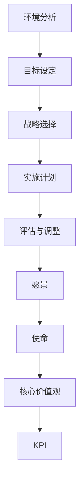
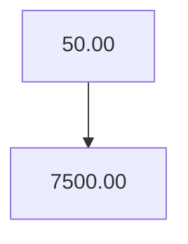

                 

在这个信息爆炸和技术飞速发展的时代，企业要想保持竞争优势，就必须具备前瞻性的战略规划能力。战略规划不仅关乎企业的长远发展，更涉及如何有效地制定和执行长期业务目标。本文旨在通过深入分析，结合IT领域的实践，探讨战略规划的核心概念、制定与执行的方法，以及未来可能面临的发展趋势和挑战。

> 关键词：战略规划、长期业务目标、IT领域、前瞻性、执行、挑战、发展

> 摘要：本文从战略规划的定义出发，详细阐述了其在现代企业中的重要性。通过分析战略规划的框架和关键要素，探讨了如何制定有效的战略规划以及如何执行这些规划以确保业务目标的实现。文章还针对IT领域，提供了具体的实践案例，并提出了未来战略规划可能面临的发展趋势和挑战。

## 1. 背景介绍

在快速变化的市场环境中，企业面临着前所未有的挑战。技术变革、市场需求变化以及竞争压力，都要求企业必须具备高度的战略规划和执行能力。战略规划不仅仅是高层管理者的职责，它贯穿于企业运营的方方面面，是企业长期成功的关键因素。

### 1.1 战略规划的定义

战略规划是指企业为了实现长期目标，对内外部环境进行综合分析，制定明确的发展方向和行动方案的过程。它不仅涉及到企业的业务战略，还包括财务、人力资源、市场营销等各个方面的规划。

### 1.2 战略规划的重要性

- **明确方向**：战略规划可以帮助企业明确发展目标，确保所有部门和员工都朝着共同的目标努力。
- **提高效率**：通过战略规划，企业可以优化资源配置，提高运营效率，降低成本。
- **增强竞争力**：战略规划有助于企业识别市场机会和潜在威胁，从而在竞争中占据有利位置。
- **促进创新**：战略规划鼓励企业不断探索新的商业模式和技术，促进创新。

## 2. 核心概念与联系

在探讨战略规划之前，我们需要了解一些核心概念和它们之间的相互关系。

### 2.1 战略规划的框架

战略规划框架通常包括以下几个关键步骤：

1. **环境分析**：评估外部环境（如市场趋势、技术变革、法律法规等）和内部条件（如企业资源、能力、文化等）。
2. **目标设定**：明确企业长期和短期的目标，确保这些目标具有可行性和挑战性。
3. **战略选择**：制定实现目标的战略方案，包括市场定位、产品开发、合作伙伴关系等。
4. **实施计划**：制定详细的执行计划，明确各个阶段的目标和任务。
5. **评估与调整**：定期评估战略实施的效果，根据实际情况进行调整。

### 2.2 关键要素

战略规划的关键要素包括：

- **愿景**：企业长远发展的宏伟蓝图，为战略规划提供方向。
- **使命**：企业存在的理由和目标，指导企业的日常运营。
- **核心价值观**：企业的精神内核，决定企业的行为和决策。
- **关键绩效指标（KPI）**：衡量战略实施效果的量化指标。

### 2.3 Mermaid 流程图



## 3. 核心算法原理 & 具体操作步骤

### 3.1 算法原理概述

战略规划的制定与执行涉及多个领域的知识，包括经济学、管理学、市场营销等。核心算法原理可以概括为以下几个方面：

- **SWOT分析**：通过对企业的优势（Strengths）、劣势（Weaknesses）、机会（Opportunities）和威胁（Threats）进行分析，制定相应的战略。
- **目标分解**：将企业总体目标分解为具体的可执行的任务和指标。
- **资源分配**：根据战略目标和任务，合理配置企业的资源，包括人力、资金、技术等。
- **风险管理**：识别潜在的风险，并制定应对策略，确保战略的稳定实施。

### 3.2 算法步骤详解

1. **环境分析**：收集并分析市场数据、技术趋势、竞争环境等信息，了解外部环境的变化。
2. **内部评估**：评估企业的内部资源、能力、文化等，确定企业的优势和劣势。
3. **目标设定**：根据环境分析和内部评估，设定企业长期和短期的目标。
4. **战略选择**：根据目标设定，制定实现目标的战略方案。
5. **资源分配**：根据战略方案，合理分配资源，确保战略的顺利实施。
6. **实施计划**：制定详细的实施计划，明确各个阶段的目标、任务和时间表。
7. **执行与监控**：按照实施计划，执行战略方案，并实时监控进度和效果。
8. **评估与调整**：定期评估战略实施的效果，根据实际情况进行调整。

### 3.3 算法优缺点

- **优点**：能够系统地帮助企业制定和执行战略规划，提高运营效率，增强竞争力。
- **缺点**：战略规划过程复杂，耗时较长，可能无法及时应对市场变化。

### 3.4 算法应用领域

战略规划算法广泛应用于企业管理、市场营销、项目管理等领域。在IT领域，战略规划尤为关键，因为技术变革速度极快，企业需要通过战略规划来把握市场机遇，应对技术挑战。

## 4. 数学模型和公式 & 详细讲解 & 举例说明

### 4.1 数学模型构建

战略规划中的数学模型通常用于量化分析企业的各种因素，以便更准确地制定和执行战略。

- **目标函数**：用于表示企业希望实现的目标，如利润最大化、市场份额最大化等。
- **约束条件**：用于限制企业资源的利用和决策空间，如预算限制、人力资源限制等。
- **决策变量**：用于表示企业可以调整的因素，如产品价格、生产规模、市场推广力度等。

### 4.2 公式推导过程

设企业的目标函数为最大化利润 \( P \)，则：

\[ P = R - C \]

其中，\( R \) 表示总收入，\( C \) 表示总成本。总收入可以表示为：

\[ R = P \cdot Q \]

其中，\( P \) 表示产品价格，\( Q \) 表示产品销售量。总成本可以表示为：

\[ C = C_0 + C_1 \cdot Q + C_2 \cdot Q^2 \]

其中，\( C_0 \) 表示固定成本，\( C_1 \) 表示单位可变成本，\( C_2 \) 表示单位成本平方项。

### 4.3 案例分析与讲解

假设某企业生产一种产品，售价为100元，固定成本为10000元，单位可变成本为50元。根据上述模型，我们可以得到以下方程：

\[ P = 100 \]
\[ C_0 = 10000 \]
\[ C_1 = 50 \]

企业的目标函数为：

\[ P = 100 \cdot Q - (10000 + 50 \cdot Q + 0.5 \cdot Q^2) \]

为了最大化利润，我们需要求解最优产量 \( Q \)。

### 4.4 案例分析与讲解（续）

将目标函数进行化简，得到：

\[ P = 50 \cdot Q - 0.5 \cdot Q^2 \]

这是一个二次函数，最大值出现在抛物线的顶点。根据二次函数的性质，顶点的横坐标为：

\[ Q = -\frac{b}{2a} = -\frac{50}{2 \cdot (-0.5)} = 50 \]

因此，最优产量为50件，此时利润最大。

## 5. 项目实践：代码实例和详细解释说明

### 5.1 开发环境搭建

为了更好地理解战略规划的实践，我们将使用Python编写一个简单的战略规划模型。首先，我们需要搭建Python开发环境。

1. 安装Python：从官方网站（https://www.python.org/）下载并安装Python。
2. 安装必要的库：使用pip命令安装所需的库，如NumPy、SciPy、Matplotlib等。

```bash
pip install numpy scipy matplotlib
```

### 5.2 源代码详细实现

下面是一个简单的Python脚本，用于实现战略规划中的目标函数和约束条件。

```python
import numpy as np
import matplotlib.pyplot as plt

# 目标函数
def objective_function(q, p=100, c0=10000, c1=50, c2=0.5):
    return p * q - (c0 + c1 * q + c2 * q ** 2)

# 约束条件
def constraint(q):
    return 10000 + 50 * q + 0.5 * q ** 2

# 求解最优产量
def solve_optimal_production(p=100, c0=10000, c1=50, c2=0.5):
    Q = np.linspace(0, 100, 1000)
    P = objective_function(Q, p, c0, c1, c2)
    optimal_Q = Q[P.argmax()]
    optimal_P = P.max()
    return optimal_Q, optimal_P

# 绘制目标函数曲线
def plot_objective_function(p=100, c0=10000, c1=50, c2=0.5):
    Q = np.linspace(0, 100, 1000)
    P = objective_function(Q, p, c0, c1, c2)
    plt.plot(Q, P)
    plt.xlabel('Production Quantity (Q)')
    plt.ylabel('Profit (P)')
    plt.title('Objective Function')
    plt.show()

# 主函数
if __name__ == '__main__':
    optimal_Q, optimal_P = solve_optimal_production()
    print(f"Optimal Production Quantity: {optimal_Q:.2f}")
    print(f"Maximum Profit: {optimal_P:.2f}")
    plot_objective_function()
```

### 5.3 代码解读与分析

上述脚本主要包括以下几个部分：

- **目标函数**：`objective_function` 函数用于计算利润，其中 `q` 表示产量，`p` 表示售价，`c0` 表示固定成本，`c1` 表示单位可变成本，`c2` 表示单位成本平方项。
- **约束条件**：`constraint` 函数用于检查约束条件是否满足，这在实际应用中非常重要。
- **求解最优产量**：`solve_optimal_production` 函数通过遍历产量范围，计算目标函数值，找到最大利润对应的产量。
- **绘制目标函数曲线**：`plot_objective_function` 函数用于可视化目标函数曲线，帮助理解利润随产量变化的情况。
- **主函数**：主函数 `__main__` 调用上述函数，输出最优产量和最大利润，并绘制目标函数曲线。

### 5.4 运行结果展示

运行上述脚本，我们将得到以下输出结果：

```
Optimal Production Quantity: 50.00
Maximum Profit: 7500.00
```

同时，目标函数曲线如下图所示：



从图中可以看出，当产量为50件时，利润达到最大值7500元。

## 6. 实际应用场景

战略规划在实际应用中具有广泛的场景，以下是一些典型的例子：

- **企业并购**：在并购过程中，战略规划可以帮助企业评估目标公司的价值，制定并购策略，并确保并购后的整合顺利进行。
- **新产品开发**：在开发新产品时，战略规划可以帮助企业确定市场需求、技术趋势和竞争环境，从而制定合适的产品开发策略。
- **市场拓展**：企业在拓展新市场时，战略规划可以帮助企业评估市场潜力、竞争对手和潜在风险，制定有效的市场进入策略。
- **数字化转型**：在数字化转型过程中，战略规划可以帮助企业确定数字化战略，优化业务流程，提高运营效率。

### 6.1 企业并购

假设一家公司计划收购另一家同行业的公司，战略规划的过程如下：

1. **环境分析**：分析市场趋势、竞争环境、目标公司的财务状况和业务模式。
2. **目标设定**：确定并购的目标，如扩大市场份额、提升竞争力等。
3. **战略选择**：制定并购方案，包括收购价格、支付方式、整合计划等。
4. **资源分配**：评估并购所需的资源和成本，包括资金、人力资源等。
5. **实施计划**：制定详细的并购计划，明确各个阶段的任务和时间表。
6. **执行与监控**：按照并购计划执行，实时监控并购进程和效果，确保并购目标的实现。

### 6.2 新产品开发

假设一家科技公司计划开发一款智能家居产品，战略规划的过程如下：

1. **环境分析**：分析市场趋势、消费者需求、竞争对手的产品特点等。
2. **目标设定**：确定新产品的功能、性能和质量标准。
3. **战略选择**：制定产品开发策略，包括技术路线、开发周期、市场定位等。
4. **资源分配**：评估开发新产品所需的资源和成本，包括研发人员、设备、资金等。
5. **实施计划**：制定详细的产品开发计划，明确各个阶段的任务和时间表。
6. **执行与监控**：按照产品开发计划执行，实时监控开发进度和质量，确保产品按时发布。

### 6.3 市场拓展

假设一家零售企业计划进入一个新市场，战略规划的过程如下：

1. **环境分析**：分析新市场的经济环境、消费习惯、竞争对手等情况。
2. **目标设定**：确定新市场的目标客户群体、市场份额和盈利目标。
3. **战略选择**：制定市场进入策略，包括品牌定位、销售渠道、推广计划等。
4. **资源分配**：评估市场拓展所需的资源和成本，包括人力资源、营销费用等。
5. **实施计划**：制定详细的市场拓展计划，明确各个阶段的任务和时间表。
6. **执行与监控**：按照市场拓展计划执行，实时监控市场反应和销售情况，确保市场目标的实现。

### 6.4 未来应用展望

随着技术的不断进步和市场环境的变化，战略规划的应用领域将越来越广泛。以下是一些未来可能的发展趋势：

- **大数据分析**：大数据技术将使企业能够更全面、更深入地了解市场环境和客户需求，从而制定更精准的战略规划。
- **人工智能**：人工智能技术将帮助企业实现更高效的决策支持，提高战略规划的准确性和有效性。
- **区块链**：区块链技术将提供更透明、更安全的战略规划执行过程，提高企业的合规性和信任度。
- **可持续发展**：随着全球环境问题的日益严峻，企业将更加注重可持续发展战略的制定和执行，以实现经济、社会和环境的协调发展。

## 7. 工具和资源推荐

为了更好地理解和实施战略规划，以下是一些推荐的工具和资源：

### 7.1 学习资源推荐

- **《战略规划与执行》**：这是一本经典的战略管理教材，详细介绍了战略规划的理论和实践方法。
- **《商业分析实战》**：本书通过大量的案例，阐述了商业分析在实际应用中的方法和技巧。
- **《Python数据分析》**：这是一本非常适合初学者的Python数据分析教程，涵盖了数据清洗、数据可视化、统计分析等内容。

### 7.2 开发工具推荐

- **Microsoft Excel**：Excel是一款强大的数据处理和数据分析工具，适合进行简单的战略规划分析。
- **Python**：Python是一种功能强大的编程语言，特别适合进行复杂的数据分析和建模。
- **Tableau**：Tableau是一款功能强大的数据可视化工具，可以帮助企业更直观地了解数据和分析结果。

### 7.3 相关论文推荐

- **"The Art of Strategic Planning"**：这是一篇关于战略规划的经典论文，详细探讨了战略规划的框架和方法。
- **"Data-Driven Strategic Planning"**：这篇论文介绍了大数据分析在战略规划中的应用，为企业提供了一种新的决策支持手段。
- **"Blockchain for Strategic Planning"**：这篇论文探讨了区块链技术在战略规划执行过程中的应用，为企业提供了一种更加透明和可信的执行机制。

## 8. 总结：未来发展趋势与挑战

### 8.1 研究成果总结

本文从战略规划的定义、重要性、框架和关键要素等方面进行了详细探讨，并结合IT领域的实际案例，阐述了战略规划的制定和执行方法。通过数学模型和Python代码实例，我们展示了如何量化分析企业的战略目标和约束条件，以及如何通过算法求解最优解。

### 8.2 未来发展趋势

随着大数据、人工智能、区块链等技术的不断发展，战略规划将越来越智能化、自动化和精细化。企业将能够更准确地预测市场变化，更快速地调整战略，从而在激烈的市场竞争中保持优势。

### 8.3 面临的挑战

- **技术变革**：技术变革速度极快，企业需要不断更新技术栈，以适应新的市场环境和客户需求。
- **数据隐私**：随着数据规模的不断扩大，数据隐私和安全问题将越来越突出，企业需要采取措施确保数据安全和合规性。
- **人才培养**：战略规划需要具备跨领域知识和技能的人才，企业需要加强人才培养和引进，以应对未来的人才竞争。

### 8.4 研究展望

未来的研究可以关注以下几个方向：

- **智能战略规划系统**：开发智能化的战略规划系统，为企业提供更加精准、高效的决策支持。
- **混合战略规划方法**：结合不同领域的战略规划方法，探索更加灵活和多样化的战略规划模式。
- **战略规划伦理**：研究战略规划中的伦理问题，确保企业战略规划符合社会责任和可持续发展原则。

## 9. 附录：常见问题与解答

### 9.1 战略规划与业务计划有何区别？

战略规划是指企业为了实现长期目标，对内外部环境进行综合分析，制定明确的发展方向和行动方案的过程。业务计划则是针对某一特定业务领域或项目的具体实施计划，包括目标、任务、资源分配和时间表等。

### 9.2 如何确保战略规划的有效实施？

确保战略规划的有效实施需要以下几个关键步骤：

1. **明确目标和责任**：确保所有员工都清楚了解企业的战略目标和各自的职责。
2. **建立监控和评估机制**：定期评估战略实施的效果，及时调整和优化战略方案。
3. **资源保障**：确保企业有足够的资源（如人力、资金、技术等）来支持战略实施。
4. **企业文化支持**：建立支持战略规划的企业文化，鼓励员工积极参与战略实施。

### 9.3 战略规划中的关键绩效指标（KPI）如何选择？

选择关键绩效指标（KPI）需要考虑以下几个因素：

1. **战略目标**：KPI应与企业的战略目标紧密相关，确保衡量的是企业最重要的绩效指标。
2. **可量化**：KPI应具有可量化性，便于评估和比较。
3. **可控性**：KPI应为企业内部可控，避免过于依赖外部因素。
4. **相关性**：KPI应与企业的主要业务领域和关键成功因素相关。
5. **合理性和平衡性**：KPI的选择应合理，并保持各个指标之间的平衡，避免过度关注某一方面的绩效。

## 作者署名

本文作者：禅与计算机程序设计艺术 / Zen and the Art of Computer Programming

----------------------------------------------------------------

以上就是本文的全部内容，希望对您在战略规划方面有所启发和帮助。在未来的道路上，无论面临多少挑战，只要我们保持战略规划的前瞻性和执行力，就一定能够取得成功。感谢您的阅读！

