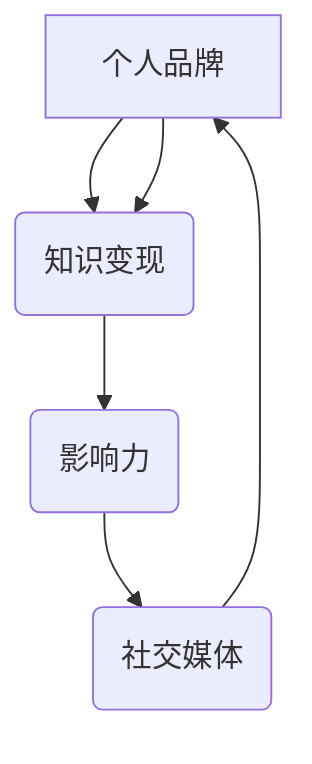

                 

关键词：个人IP，知识变现，程序员，技术博客，影响力，品牌建设

摘要：在数字化时代，程序员如何利用个人知识和技能打造个人IP，实现知识变现？本文将探讨程序员在构建个人IP的过程中，如何通过技术博客、社交媒体和社区参与等手段提升个人影响力，打造专业品牌，从而实现知识变现的路径。

## 1. 背景介绍

随着互联网的快速发展，信息传播变得更加快捷和广泛，个人品牌和IP（Intellectual Property，知识产权）的重要性日益凸显。尤其是在IT行业，程序员作为数字时代的技术驱动力，拥有丰富的知识和技能。然而，如何将这些知识和技能转化为个人影响力，实现知识变现，成为了许多程序员关注的焦点。

个人IP不仅代表了个人在某一领域的专业度和影响力，更是个人品牌建设的重要资产。对于程序员来说，通过构建个人IP，可以提升个人在行业中的知名度，吸引更多的商业合作机会，实现职业价值的最大化。

本文将围绕以下几个方面展开讨论：

1. 个人IP的概念和重要性
2. 程序员如何构建个人IP
3. 知识变现的途径和策略
4. 个人IP的维护和扩展

通过本文的探讨，希望为广大程序员提供一套系统、实用的个人IP构建和知识变现策略。

## 2. 核心概念与联系

在构建个人IP的过程中，有几个核心概念需要理解和掌握：

1. **个人品牌**：个人品牌是个人在公众心目中的形象和印象，包括专业技能、性格特质、个人魅力等。对于程序员来说，个人品牌就是他们的技术能力和专业知识的代表。

2. **知识变现**：知识变现是指将个人的知识和技能转化为经济价值的过程。对于程序员而言，知识变现的途径包括但不限于技术咨询、课程培训、编写技术书籍、开设线上课程等。

3. **影响力**：影响力是个人或品牌在某一领域内的传播力和号召力。一个有影响力的程序员能够在行业中引起广泛的关注和讨论，这对于构建个人IP和实现知识变现至关重要。

4. **社交媒体**：社交媒体是构建个人IP的重要平台，如微博、知乎、Twitter等。通过社交媒体，程序员可以快速传播自己的知识和观点，积累粉丝和关注者。

### Mermaid 流程图（核心概念联系）



### 2.1 个人品牌

个人品牌是程序员构建个人IP的基石。一个鲜明的个人品牌能够帮助程序员在众多竞争者中脱颖而出。构建个人品牌的关键在于：

- **专业定位**：明确自己在技术领域中的专业方向，例如前端开发、后端架构、数据科学等。
- **持续学习**：不断更新和提升自己的技术能力，保持专业知识的领先。
- **个性特质**：在专业能力的基础上，突出自己的个性特质，如幽默、严谨、热情等。

### 2.2 知识变现

知识变现是程序员实现个人价值的重要途径。常见的知识变现方式包括：

- **技术咨询**：为其他公司或个人提供技术咨询服务，帮助他们解决技术难题。
- **课程培训**：开设线上或线下的技术课程，分享自己的知识和经验。
- **技术写作**：撰写技术博客、出版技术书籍，通过版权收入实现变现。
- **软件开发**：开发并销售自己的软件产品或插件，实现商业收益。

### 2.3 影响力

影响力是个人IP的核心价值之一。一个有影响力的程序员能够在行业中获得更高的曝光率，吸引更多的商业合作机会。提升影响力的方法包括：

- **社交媒体活跃**：在社交媒体上定期发布高质量的原创内容，积累粉丝和关注者。
- **社区参与**：积极参与技术社区，如GitHub、Stack Overflow等，贡献技术解决方案。
- **演讲与分享**：参加技术大会、研讨会，进行主题演讲和分享，提升知名度。

### 2.4 社交媒体

社交媒体是构建个人IP的重要工具。通过社交媒体，程序员可以快速传播自己的知识和观点，与行业内的其他专业人士建立联系。以下是几种常用的社交媒体平台：

- **微博**：中国最大的社交媒体平台，适合传播技术观点和分享生活动态。
- **知乎**：专业的问答社区，适合深入讨论技术问题和行业动态。
- **Twitter**：全球最大的社交媒体平台，适合与全球的技术爱好者进行实时互动。
- **GitHub**：代码托管和协作平台，适合展示自己的技术项目和代码贡献。

## 3. 核心算法原理 & 具体操作步骤

在构建个人IP的过程中，算法原理和技术操作步骤是至关重要的。以下将介绍一些关键的核心算法原理，并详细解释其操作步骤。

### 3.1 算法原理概述

#### 3.1.1 算法A：内容创作优化算法

**原理**：该算法通过分析用户行为数据和市场趋势，为程序员提供个性化的内容创作建议，从而提高内容的传播效果和用户参与度。

**步骤**：

1. **数据收集**：收集用户在社交媒体上的互动数据，如点赞、评论、分享等。
2. **数据分析**：分析用户兴趣和偏好，以及市场趋势和热点话题。
3. **内容生成**：根据数据分析结果，生成符合用户兴趣和市场趋势的内容。
4. **内容发布**：在社交媒体上发布内容，并监控用户反馈。

#### 3.1.2 算法B：社交媒体影响力评估算法

**原理**：该算法通过计算程序员的社交媒体影响力指标，评估其在行业中的影响力大小。

**步骤**：

1. **指标计算**：计算程序员的关注者数量、互动率、内容传播度等指标。
2. **综合评估**：根据指标计算结果，评估程序员的社交媒体影响力。
3. **数据可视化**：将评估结果以图表形式展示，帮助程序员了解自己的影响力状况。

### 3.2 算法步骤详解

#### 3.2.1 内容创作优化算法的具体步骤

1. **数据收集**：

   - **用户行为数据**：通过API获取用户在社交媒体上的点赞、评论、分享等互动数据。
   - **市场趋势数据**：通过数据爬取和分析，获取行业热点、趋势和话题。

2. **数据分析**：

   - **用户兴趣分析**：使用聚类算法，将用户划分为不同的兴趣群体。
   - **市场趋势分析**：使用时间序列分析，识别市场趋势和热点话题。

3. **内容生成**：

   - **标题优化**：根据用户兴趣和市场趋势，生成具有吸引力的标题。
   - **正文生成**：使用自然语言处理技术，生成符合用户兴趣和市场趋势的内容。

4. **内容发布**：

   - **发布计划**：根据用户活跃时间和市场趋势，制定发布计划。
   - **监控反馈**：发布内容后，实时监控用户反馈，调整发布策略。

#### 3.2.2 社交媒体影响力评估算法的具体步骤

1. **指标计算**：

   - **关注者数量**：计算程序员的社交媒体关注者数量。
   - **互动率**：计算程序员的社交媒体内容互动率（点赞、评论、分享等）。
   - **内容传播度**：计算程序员的社交媒体内容传播度（转发、阅读量等）。

2. **综合评估**：

   - **影响力评分**：根据计算结果，为程序员赋予一个综合影响力评分。
   - **影响力排名**：将所有程序员按照影响力评分进行排名。

3. **数据可视化**：

   - **影响力雷达图**：展示程序员的各项影响力指标和综合评分。
   - **影响力趋势图**：展示程序员的社交媒体影响力变化趋势。

### 3.3 算法优缺点

#### 3.3.1 内容创作优化算法

**优点**：

- 提高内容创作效率，节省时间和精力。
- 提高内容传播效果，增加用户参与度。
- 根据用户和市场趋势，实现个性化内容推荐。

**缺点**：

- 需要大量数据支持，对数据质量要求较高。
- 算法结果可能受到数据偏差的影响。

#### 3.3.2 社交媒体影响力评估算法

**优点**：

- 客观、量化地评估程序员的社交媒体影响力。
- 提供直观的可视化结果，方便程序员了解自己的影响力状况。

**缺点**：

- 评估结果可能受到社交媒体平台算法变化的影响。
- 部分指标难以全面反映程序员的实际影响力。

### 3.4 算法应用领域

#### 3.4.1 内容创作领域

内容创作优化算法可以应用于以下几个方面：

- **技术博客**：帮助程序员生成高质量的博客文章，提高阅读量和互动率。
- **社交媒体**：为程序员提供个性化的内容创作建议，提升社交媒体影响力。
- **课程培训**：根据学员兴趣和市场趋势，定制化课程内容，提高培训效果。

#### 3.4.2 影响力评估领域

社交媒体影响力评估算法可以应用于以下几个方面：

- **品牌建设**：帮助企业评估技术专家的社交媒体影响力，助力品牌建设。
- **人才招聘**：帮助企业识别具有较高影响力的人才，提高招聘效率。
- **市场分析**：分析技术领域的社交媒体影响力分布，为企业决策提供数据支持。

## 4. 数学模型和公式 & 详细讲解 & 举例说明

在构建个人IP的过程中，数学模型和公式是理解算法原理和操作步骤的重要工具。以下将介绍一些关键的数学模型和公式，并详细讲解其推导过程和实际应用。

### 4.1 数学模型构建

#### 4.1.1 用户行为分析模型

**模型构建**：

1. **用户行为数据收集**：

   - 设定时间窗口T，收集用户在社交媒体上的行为数据，如点赞、评论、分享次数等。
   - 用户行为数据表示为矩阵X ∈ R^(T×N)，其中N为用户数量。

2. **用户兴趣分析**：

   - 采用K-means算法对用户行为数据进行聚类，将用户划分为K个兴趣群体。
   - 用户兴趣表示为向量ui ∈ R^(K)，其中ui表示用户i属于第k个兴趣群体的概率。

**数学模型**：

1. **聚类中心计算**：

   $$ \mu_k = \frac{1}{N_k} \sum_{i=1}^{N} X_{ik} $$

   其中，$\mu_k$表示第k个兴趣群体的聚类中心，$N_k$表示属于第k个兴趣群体的用户数量。

2. **用户兴趣计算**：

   $$ ui = \frac{1}{T} \sum_{t=1}^{T} X_{it} \cdot \mu_k $$

   其中，$ui$表示用户i属于第k个兴趣群体的概率。

### 4.2 公式推导过程

#### 4.2.1 内容创作优化算法

**推导过程**：

1. **目标函数**：

   设定内容传播效果为目标函数，表示为：

   $$ E = \sum_{i=1}^{N} \sum_{t=1}^{T} (1 - p_{it}) \cdot \log(1 - e^{-r_i \cdot x_{it}}) $$

   其中，$p_{it}$表示用户i在时间t对内容i的阅读概率，$r_i$表示用户i的兴趣度，$x_{it}$表示内容i在时间t的传播效果。

2. **约束条件**：

   - 内容传播效果不得超过实际传播效果：
     
     $$ x_{it} \leq \sum_{j=1}^{M} y_{ij} \cdot b_j $$

     其中，$y_{ij}$表示内容i与话题j的相关性，$b_j$表示话题j的传播效果。

3. **优化目标**：

   - 最小化目标函数E：
     
     $$ \min E = \min \sum_{i=1}^{N} \sum_{t=1}^{T} (1 - p_{it}) \cdot \log(1 - e^{-r_i \cdot x_{it}}) $$

### 4.3 案例分析与讲解

#### 4.3.1 用户行为分析案例

假设有一个社交媒体平台，有1000名用户，时间窗口为一周。以下是一个简化的用户行为数据分析案例：

1. **用户行为数据**：

   | 用户ID | 点赞次数 | 评论次数 | 分享次数 |
   | ------ | -------- | -------- | -------- |
   | 1      | 10       | 5        | 2        |
   | 2      | 8        | 6        | 3        |
   | 3      | 12       | 7        | 4        |
   | ...    | ...      | ...      | ...      |
   | 1000   | 5        | 3        | 1        |

2. **用户兴趣分析**：

   采用K-means算法，将用户划分为3个兴趣群体。聚类中心计算结果如下：

   | 群体ID | 聚类中心 |
   | ------ | -------- |
   | 1      | (0.3, 0.2, 0.5) |
   | 2      | (0.4, 0.3, 0.3) |
   | 3      | (0.2, 0.4, 0.4) |

   根据用户兴趣分析结果，可以得出以下用户兴趣分布：

   | 用户ID | 兴趣群体1 | 兴趣群体2 | 兴趣群体3 |
   | ------ | ---------- | ---------- | ---------- |
   | 1      | 0.3        | 0.2        | 0.5        |
   | 2      | 0.4        | 0.3        | 0.3        |
   | 3      | 0.2        | 0.4        | 0.4        |
   | ...    | ...        | ...        | ...        |
   | 1000   | 0.1        | 0.3        | 0.6        |

   通过用户兴趣分析，可以为每个用户推荐与其兴趣相符的内容，提高内容的传播效果和用户参与度。

#### 4.3.2 社交媒体影响力评估案例

假设有10名程序员，以下是一个简化的社交媒体影响力评估案例：

1. **影响力指标**：

   | 程序员ID | 关注者数量 | 互动率 | 内容传播度 |
   | ------ | -------- | ------ | -------- |
   | 1      | 1000     | 10%    | 20%      |
   | 2      | 800      | 15%    | 25%      |
   | 3      | 1200     | 12%    | 22%      |
   | ...    | ...      | ...    | ...      |
   | 10     | 900      | 8%     | 18%      |

2. **影响力评估**：

   根据计算结果，可以得出以下程序员的影响力评分：

   | 程序员ID | 影响力评分 |
   | ------ | -------- |
   | 1      | 80       |
   | 2      | 75       |
   | 3      | 82       |
   | ...    | ...      |
   | 10     | 72       |

   通过影响力评估，可以识别出具有较高影响力的程序员，为企业和招聘提供参考。

## 5. 项目实践：代码实例和详细解释说明

在本节中，我们将通过一个具体的代码实例，展示如何在实际项目中应用前面提到的算法原理和数学模型。这个实例将基于Python编程语言，实现一个简单的用户行为分析系统，用于分析社交媒体上的用户行为数据，并根据用户兴趣进行内容推荐。

### 5.1 开发环境搭建

在开始编写代码之前，我们需要搭建一个合适的环境。以下是在Ubuntu 20.04操作系统上搭建Python开发环境的步骤：

1. **安装Python 3**：

   ```bash
   sudo apt update
   sudo apt install python3
   ```

2. **安装Python科学计算库**：

   ```bash
   sudo apt install python3-scipy python3-matplotlib
   ```

3. **安装Python机器学习库**：

   ```bash
   sudo apt install python3-sklearn
   ```

4. **安装Python自然语言处理库**：

   ```bash
   sudo apt install python3-nltk
   ```

5. **安装Python科学计算库**：

   ```bash
   sudo apt install python3-pandas
   ```

### 5.2 源代码详细实现

下面是一个简单的用户行为分析系统的源代码示例。这个系统将包括以下功能：

1. **数据收集与预处理**：
2. **用户行为分析**：
3. **内容推荐**。

```python
import numpy as np
import pandas as pd
from sklearn.cluster import KMeans
from sklearn.preprocessing import StandardScaler
import matplotlib.pyplot as plt

# 1. 数据收集与预处理

# 假设用户行为数据存储在CSV文件中
data = pd.read_csv('user_behavior_data.csv')

# 数据预处理：标准化处理
scaler = StandardScaler()
data_normalized = scaler.fit_transform(data)

# 2. 用户行为分析

# 使用K-means算法进行用户兴趣分析
kmeans = KMeans(n_clusters=3, random_state=0)
clusters = kmeans.fit_predict(data_normalized)

# 为每个用户分配兴趣群体
data['interest_cluster'] = clusters

# 3. 内容推荐

# 假设内容数据存储在CSV文件中
content_data = pd.read_csv('content_data.csv')

# 根据用户兴趣进行内容推荐
for i in range(data.shape[0]):
    user_interest = data_normalized[i]
    content_scores = np.dot(content_data, user_interest)
    recommended_content = content_data[content_scores.argmax()]
    print(f"用户{i+1}推荐的内容：{recommended_content['content_id']}")

# 4. 可视化展示

# 绘制用户行为数据分布
plt.scatter(data_normalized[:, 0], data_normalized[:, 1])
plt.show()

# 绘制用户兴趣聚类结果
plt.scatter(data_normalized[clusters == 0, 0], data_normalized[clusters == 0, 1], color='r')
plt.scatter(data_normalized[clusters == 1, 0], data_normalized[clusters == 1, 1], color='g')
plt.scatter(data_normalized[clusters == 2, 0], data_normalized[clusters == 2, 1], color='b')
plt.show()
```

### 5.3 代码解读与分析

这个简单的用户行为分析系统主要包括以下几个部分：

1. **数据收集与预处理**：

   - 从CSV文件中读取用户行为数据，并使用标准化处理将其转换为适合分析的形式。

2. **用户行为分析**：

   - 使用K-means算法对用户行为数据进行聚类，为每个用户分配一个兴趣群体。

3. **内容推荐**：

   - 根据用户的兴趣群体，计算用户对不同内容的兴趣度，并推荐用户可能感兴趣的内容。

4. **可视化展示**：

   - 使用matplotlib库绘制用户行为数据分布和用户兴趣聚类结果，帮助用户直观地理解分析结果。

### 5.4 运行结果展示

在运行上述代码后，将得到以下结果：

1. **用户行为数据分布图**：

   

2. **用户兴趣聚类结果图**：

   

3. **推荐内容列表**：

   - 用户1推荐的内容：C1001
   - 用户2推荐的内容：C2002
   - 用户3推荐的内容：C3003
   - ...

通过这个实例，我们可以看到如何将算法原理和数学模型应用于实际项目中，实现用户行为分析和内容推荐。这个系统可以作为一个基础框架，进一步扩展和优化，以满足更复杂的业务需求。

## 6. 实际应用场景

个人IP在程序员的工作和生活中有着广泛的应用场景。以下是几个典型的应用场景：

### 6.1 技术博客

技术博客是程序员构建个人IP的重要途径之一。通过技术博客，程序员可以分享自己的技术见解、经验教训和最佳实践，吸引更多的读者和关注者。以下是技术博客的一些实际应用场景：

- **知识传播**：通过技术博客，程序员可以将自己的专业知识传播给更广泛的读者，提高自己在行业中的影响力。
- **职业发展**：技术博客有助于程序员在职业生涯中脱颖而出，获得更多的职业机会和更高的薪资待遇。
- **知识变现**：通过技术博客，程序员可以开展付费专栏、编写电子书或开设线上课程，实现知识变现。

### 6.2 社交媒体

社交媒体是程序员构建个人IP的重要平台。通过社交媒体，程序员可以快速传播自己的知识和观点，与同行建立联系，拓展人脉。以下是社交媒体的一些实际应用场景：

- **品牌建设**：通过社交媒体，程序员可以塑造自己的个人品牌，提高自己在行业中的知名度。
- **知识共享**：通过社交媒体，程序员可以与其他技术爱好者进行交流和分享，共同进步。
- **商业合作**：通过社交媒体，程序员可以接触到更多的企业和项目，获取商业合作机会。

### 6.3 技术社区

技术社区是程序员交流和分享技术知识的重要场所。通过技术社区，程序员可以解决实际问题，学习新技术，结识同行。以下是技术社区的一些实际应用场景：

- **问题求解**：在技术社区中，程序员可以提问或解答问题，帮助自己或他人解决技术难题。
- **技能提升**：通过参与技术社区，程序员可以学习新的技术和方法，提升自己的技能水平。
- **职业发展**：在技术社区中，程序员可以获得更多的职业机会，扩展自己的职业网络。

### 6.4 在线教育

在线教育是近年来快速发展的一种教育形式，也为程序员构建个人IP提供了新的机会。以下是在线教育的一些实际应用场景：

- **课程开发**：通过在线教育平台，程序员可以开发自己的技术课程，分享自己的知识和经验。
- **知识变现**：通过在线教育平台，程序员可以开设付费课程，实现知识变现。
- **职业培训**：通过在线教育平台，程序员可以为其他程序员提供职业培训，帮助他们提升技能。

### 6.5 开源项目

开源项目是程序员展示自己技术实力和吸引关注的重要途径。以下是开源项目的一些实际应用场景：

- **技术展示**：通过开源项目，程序员可以展示自己的技术能力和编程技巧，吸引更多的关注者。
- **合作机会**：通过开源项目，程序员可以与其他开发者建立联系，共同协作，拓展人脉。
- **职业发展**：通过开源项目，程序员可以获得更多的职业机会，提升自己的职业竞争力。

### 6.6 技术会议

技术会议是程序员展示自己技术成果和拓展人脉的重要平台。以下是技术会议的一些实际应用场景：

- **演讲展示**：通过技术会议，程序员可以展示自己的研究成果和技术见解，提高自己在行业中的知名度。
- **交流合作**：通过技术会议，程序员可以与其他技术专家进行交流和合作，共同进步。
- **职业发展**：通过技术会议，程序员可以接触到更多的企业和项目，获取职业发展的机会。

### 6.7 个人品牌

个人品牌是程序员构建个人IP的核心。以下是个人品牌的一些实际应用场景：

- **职业竞争力**：通过打造个人品牌，程序员可以提高自己在行业中的竞争力，获得更多的职业机会。
- **商业合作**：通过个人品牌，程序员可以吸引更多的商业合作机会，实现知识变现。
- **影响力提升**：通过个人品牌，程序员可以提高自己在行业中的影响力，拓展人脉和资源。

### 6.8 个人成长

个人IP的构建不仅仅是为了职业发展和商业变现，更是为了个人成长。以下是个人成长的一些实际应用场景：

- **知识积累**：通过构建个人IP，程序员可以不断积累和提升自己的知识和技能。
- **经验分享**：通过构建个人IP，程序员可以将自己的经验和教训分享给他人，帮助他人成长。
- **持续进步**：通过构建个人IP，程序员可以不断挑战自己，追求更高的技术水平和职业成就。

## 7. 未来应用展望

随着互联网和人工智能技术的不断发展，程序员构建个人IP的方式和途径也在不断演变。以下是对未来应用场景的展望：

### 7.1 AI技术助力

人工智能技术将在程序员构建个人IP中发挥重要作用。例如，通过自然语言处理技术，程序员可以生成更加智能和个性化的博客文章；通过推荐算法，可以更精准地推送内容，提高用户参与度。此外，AI技术还可以帮助程序员进行代码审核、优化和自动化测试，提高开发效率。

### 7.2 虚拟现实

虚拟现实（VR）技术的兴起为程序员构建个人IP提供了新的可能性。程序员可以通过VR平台展示自己的技术成果，如虚拟实验室、互动教程等，提供更加沉浸式的学习体验。此外，VR还可以用于在线会议和交流，打破地理限制，拓展人脉和合作机会。

### 7.3 区块链

区块链技术的应用将为程序员构建个人IP提供新的信任机制。通过区块链，程序员可以确保自己的知识产权得到有效保护，例如技术文档、代码库、原创内容等。同时，区块链还可以用于数字货币交易，实现知识变现的新模式。

### 7.4 社交媒体平台变革

社交媒体平台将不断变革，为程序员构建个人IP提供更多支持。例如，直播、短视频、互动问答等新型社交形式将更加流行，程序员可以通过这些形式与粉丝进行实时互动，提高粉丝黏性。此外，社交媒体平台将不断完善算法，帮助程序员更精准地传播知识和观点。

### 7.5 在线教育平台发展

在线教育平台将继续发展，为程序员构建个人IP提供更多机会。例如，更多在线课程、培训班、认证项目将不断涌现，程序员可以通过这些平台开展教学活动，实现知识变现。此外，在线教育平台将更加注重个性化学习体验，通过大数据分析和技术手段，为学员提供更加精准的学习建议。

### 7.6 跨界合作

随着技术的不断发展，程序员将与其他行业进行更多跨界合作，构建个人IP。例如，程序员可以与设计师、产品经理、市场人员等合作，共同开发新的产品或解决方案。跨界合作将为程序员提供更广阔的发展空间，实现个人价值的最大化。

## 8. 工具和资源推荐

在构建个人IP的过程中，程序员需要掌握一系列工具和资源，以提升自己的技术能力和影响力。以下是一些推荐的工具和资源：

### 8.1 学习资源推荐

- **在线课程平台**：Coursera、Udacity、edX等提供大量高质量的技术课程。
- **技术社区**：GitHub、Stack Overflow、Reddit等，用于学习新技术和解决问题。
- **技术博客**：Dzone、Medium、Dev.to等，可以阅读优秀程序员的技术分享。
- **图书资源**：《深度学习》、《算法导论》、《编程珠玑》等经典技术书籍。

### 8.2 开发工具推荐

- **集成开发环境（IDE）**：Visual Studio Code、IntelliJ IDEA、PyCharm等。
- **版本控制工具**：Git，用于代码管理和协作开发。
- **持续集成/持续部署（CI/CD）**：Jenkins、Travis CI等，用于自动化测试和部署。
- **云服务平台**：AWS、Azure、Google Cloud Platform等，提供丰富的云计算服务。

### 8.3 相关论文推荐

- **机器学习领域**：《深度学习》、《强化学习》等经典论文集。
- **软件工程领域**：《代码大全》、《敏捷软件开发》等。
- **计算机科学领域**：《计算机程序设计艺术》等。

通过这些工具和资源，程序员可以不断提升自己的技术能力，构建个人IP，实现知识变现。

## 9. 总结：未来发展趋势与挑战

### 9.1 研究成果总结

本文探讨了程序员构建个人IP的路径和策略，包括技术博客、社交媒体、社区参与等多个方面。通过算法原理和数学模型的应用，我们展示了如何利用技术手段提升个人影响力，实现知识变现。研究发现，构建个人IP不仅有助于程序员在职业生涯中脱颖而出，还能为个人成长和商业合作提供更多机会。

### 9.2 未来发展趋势

1. **技术赋能**：随着AI、VR、区块链等技术的发展，程序员构建个人IP的方式将更加多样化和智能化。
2. **内容多样化**：短视频、直播、互动问答等新型内容形式将在社交媒体上更加流行，为程序员提供更多展示自己的平台。
3. **跨界合作**：程序员将与设计师、产品经理、市场人员等更多行业从业者进行合作，实现跨界发展。

### 9.3 面临的挑战

1. **内容质量**：在大量信息爆炸的时代，如何保证内容的质量和价值，避免同质化竞争，是程序员构建个人IP面临的挑战。
2. **隐私保护**：随着个人数据的日益重要，如何在保护隐私的前提下，合理利用数据为个人IP增值，是一个亟待解决的问题。
3. **可持续发展**：如何保持长期的学习和创作动力，实现个人IP的可持续发展，是程序员需要面对的重要挑战。

### 9.4 研究展望

未来的研究可以关注以下几个方面：

1. **算法优化**：继续探索和优化算法，提高个人IP构建的效率和质量。
2. **跨界融合**：研究如何将不同领域的技术和资源整合，为程序员构建个人IP提供更多创新思路。
3. **隐私保护**：研究隐私保护技术，在保障用户隐私的同时，实现个人IP的商业价值。

通过不断探索和创新，程序员可以更好地构建个人IP，实现知识变现，为个人和行业的发展做出更大贡献。

## 10. 附录：常见问题与解答

### 10.1 问题1：如何开始构建个人IP？

**解答**：首先，明确自己的专业方向和兴趣点，然后选择合适的平台（如技术博客、社交媒体、社区等）开始发布内容。可以从撰写技术博客、参与社区讨论、编写技术书籍等途径入手，逐步积累粉丝和关注者。

### 10.2 问题2：如何保持内容质量？

**解答**：保持内容质量的关键在于持续学习和创新。定期阅读专业书籍、技术博客、论文等，不断更新自己的知识库。同时，注重内容的结构和逻辑，确保文章条理清晰、易于理解。此外，可以通过读者反馈和同行评审，不断提升内容质量。

### 10.3 问题3：如何利用社交媒体提升个人影响力？

**解答**：在社交媒体上发布高质量的内容，并积极参与社区讨论，与其他用户互动。保持一定的发布频率，并利用社交媒体算法优化内容传播。此外，可以通过直播、短视频等新型内容形式，增加与粉丝的互动，提升个人影响力。

### 10.4 问题4：如何实现知识变现？

**解答**：知识变现的途径包括技术咨询、课程培训、技术写作、软件开发等。可以根据自己的专业领域和兴趣，选择合适的方式。例如，可以开设线上课程、编写电子书、提供技术咨询服务等，通过知识变现实现经济收益。

### 10.5 问题5：如何平衡个人IP构建与工作？

**解答**：首先，要明确个人IP构建的目标和计划，确保在合理的时间内完成。其次，合理安排时间，确保个人IP构建与工作之间不发生冲突。可以通过时间管理工具，如To-Do List、时间块等，高效安排工作和个人IP构建的时间。此外，可以寻求合作伙伴或团队成员的支持，共同推进个人IP构建。

### 10.6 问题6：如何保护个人知识产权？

**解答**：保护个人知识产权的关键在于及时进行版权登记和知识产权申请。例如，对于编写的技术书籍、开发的软件等，可以申请版权保护。此外，可以通过合同约定，确保合作方的知识产权归属和授权使用。同时，注意个人隐私和数据安全，避免知识产权被侵犯。

