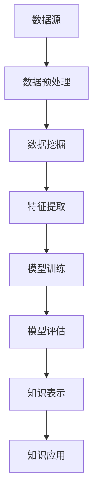

                 

 在当今信息爆炸的时代，个人知识管理成为了一个至关重要的课题。如何有效地从海量信息中挖掘出有价值的内容，构建个人知识体系，成为每个知识工作者必须面对的挑战。本文将探讨如何通过技术手段，打造一个高效的个人知识发现引擎。

## 关键词
- 个人知识管理
- 知识发现引擎
- 数据挖掘
- 自然语言处理
- 机器学习
- 知识图谱

## 摘要
本文首先介绍了个人知识发现引擎的背景和重要性，然后详细探讨了其核心概念和架构，接着介绍了构建个人知识发现引擎的核心算法原理、数学模型以及具体的项目实践。最后，文章对实际应用场景进行了分析，并展望了未来的发展趋势和挑战。

## 1. 背景介绍

### 个人知识管理的挑战

随着互联网的普及和数字化进程的加快，信息的获取变得更加便捷。然而，这也带来了新的挑战。海量的信息使个人知识管理变得复杂，如何从这些信息中筛选出有价值的内容，如何将信息转化为可用的知识，成为知识工作者面临的重大问题。

### 知识发现引擎的必要性

知识发现引擎是一种能够自动挖掘和识别信息中潜在模式的工具。通过使用数据挖掘、自然语言处理和机器学习等技术，知识发现引擎可以帮助用户从大量数据中快速定位到所需的信息，构建个人知识体系。这对于提高工作效率、促进创新具有重要作用。

## 2. 核心概念与联系

### 数据挖掘

数据挖掘是知识发现引擎的核心技术之一。它通过从大量数据中自动识别出隐含的模式、趋势和关联，从而帮助用户更好地理解数据。常用的数据挖掘技术包括分类、聚类、关联规则挖掘、异常检测等。

### 自然语言处理

自然语言处理（NLP）是一种让计算机理解和生成人类语言的技术。在知识发现引擎中，NLP技术用于对文本数据进行处理，如分词、词性标注、实体识别、情感分析等，从而帮助用户更好地理解和利用文本数据。

### 机器学习

机器学习是知识发现引擎的重要技术之一。通过训练模型，机器学习可以从数据中学习规律，并预测未来的趋势。在知识发现引擎中，常用的机器学习算法包括线性回归、决策树、随机森林、支持向量机等。

### 知识图谱

知识图谱是一种将实体和实体之间的关系表示为图结构的数据模型。它可以帮助用户更直观地理解数据之间的复杂关系，从而更好地挖掘出潜在的知识。

### Mermaid 流程图



## 3. 核心算法原理 & 具体操作步骤

### 3.1 算法原理概述

知识发现引擎的核心算法主要包括数据挖掘、自然语言处理、机器学习和知识图谱构建。这些算法通过一系列步骤，从数据源中提取出有价值的信息，并将其转化为可用的知识。

### 3.2 算法步骤详解

#### 3.2.1 数据预处理

数据预处理是数据挖掘的第一步。它包括数据清洗、数据集成、数据转换等过程，目的是将原始数据转化为适合挖掘的形式。

#### 3.2.2 数据挖掘

数据挖掘是从预处理后的数据中识别出潜在模式的过程。常用的数据挖掘技术有分类、聚类、关联规则挖掘等。

#### 3.2.3 特征提取

特征提取是从数据中提取出能够代表数据特征的属性或变量。特征提取对于提高模型性能具有重要意义。

#### 3.2.4 模型训练

模型训练是通过训练数据对模型进行训练，使其能够根据输入数据预测输出结果。常用的机器学习算法有线性回归、决策树、支持向量机等。

#### 3.2.5 模型评估

模型评估是对训练好的模型进行评估，以确定其性能是否达到预期。常用的评估指标有准确率、召回率、F1值等。

#### 3.2.6 知识表示

知识表示是将挖掘出的知识转化为易于理解和应用的形式。常用的知识表示方法有知识图谱、本体论等。

### 3.3 算法优缺点

#### 优点：

- 提高工作效率：知识发现引擎可以自动化地处理大量数据，从而提高工作效率。
- 促进创新：知识发现引擎可以帮助用户从数据中挖掘出潜在的模式和趋势，从而促进创新。
- 降低成本：知识发现引擎可以降低人力成本，提高工作效率。

#### 缺点：

- 数据质量要求高：知识发现引擎对数据质量有较高的要求，数据质量的好坏直接影响挖掘结果。
- 模型可解释性低：一些复杂的机器学习模型难以解释其决策过程，这对用户理解和应用模型带来了一定的困难。

### 3.4 算法应用领域

知识发现引擎广泛应用于各个领域，如金融、医疗、零售、教育等。在金融领域，知识发现引擎可以帮助银行和金融机构识别欺诈行为；在医疗领域，知识发现引擎可以帮助医生诊断疾病；在零售领域，知识发现引擎可以帮助商家分析消费者行为，制定营销策略。

## 4. 数学模型和公式 & 详细讲解 & 举例说明

### 4.1 数学模型构建

在知识发现引擎中，常用的数学模型包括线性回归、决策树、支持向量机等。

#### 线性回归模型

线性回归模型是一种用于预测数值型数据的模型。其数学模型如下：

$$
y = \beta_0 + \beta_1x_1 + \beta_2x_2 + \ldots + \beta_nx_n
$$

其中，$y$为因变量，$x_1, x_2, \ldots, x_n$为自变量，$\beta_0, \beta_1, \beta_2, \ldots, \beta_n$为模型的参数。

#### 决策树模型

决策树模型是一种用于分类和回归任务的模型。其数学模型如下：

$$
T = \{t_1, t_2, \ldots, t_n\}
$$

其中，$T$为决策树的集合，$t_i$为决策树的第$i$个节点。

#### 支持向量机模型

支持向量机模型是一种用于分类和回归任务的模型。其数学模型如下：

$$
\max \frac{1}{2} \sum_{i=1}^n (\omega_i^2 + \lambda_i)
$$

$$
s.t. y_i (\omega \cdot x_i + b) \geq 1 - \lambda_i, \quad \lambda_i \geq 0
$$

其中，$\omega$为权重向量，$\lambda_i$为拉格朗日乘子。

### 4.2 公式推导过程

以线性回归模型为例，其公式推导过程如下：

假设我们有$n$个训练样本$(x_1, y_1), (x_2, y_2), \ldots, (x_n, y_n)$，其中$x_i$为自变量，$y_i$为因变量。

首先，我们定义损失函数：

$$
J(\theta) = \frac{1}{2m} \sum_{i=1}^n (h_\theta(x_i) - y_i)^2
$$

其中，$m$为样本数量，$h_\theta(x)$为模型的预测函数，$\theta$为模型的参数。

为了最小化损失函数，我们对$\theta$求导数，并令其等于0：

$$
\frac{\partial J(\theta)}{\partial \theta} = 0
$$

经过一系列的数学推导，我们得到：

$$
\theta = \frac{1}{m} \sum_{i=1}^n (x_i - \bar{x})(y_i - \bar{y})
$$

其中，$\bar{x}$和$\bar{y}$分别为自变量和因变量的均值。

### 4.3 案例分析与讲解

假设我们有一个简单的线性回归问题，其中自变量$x$为学生的家庭收入，因变量$y$为学生的成绩。我们收集了10个样本数据，如下表所示：

| 家庭收入（万元） | 成绩 |
| :--: | :--: |
| 30 | 70 |
| 40 | 85 |
| 50 | 90 |
| 60 | 92 |
| 70 | 88 |
| 80 | 84 |
| 90 | 80 |
| 100 | 75 |
| 120 | 70 |
| 150 | 65 |

我们使用线性回归模型预测学生的成绩。首先，我们计算自变量和因变量的均值：

$$
\bar{x} = \frac{30 + 40 + 50 + 60 + 70 + 80 + 90 + 100 + 120 + 150}{10} = 80
$$

$$
\bar{y} = \frac{70 + 85 + 90 + 92 + 88 + 84 + 80 + 75 + 70 + 65}{10} = 80
$$

然后，我们计算损失函数：

$$
J(\theta) = \frac{1}{2 \times 10} \sum_{i=1}^{10} (h_\theta(x_i) - y_i)^2
$$

其中，$h_\theta(x) = \theta_0x + \theta_1$。

为了最小化损失函数，我们使用梯度下降法迭代更新$\theta_0$和$\theta_1$：

$$
\theta_0 := \theta_0 - \alpha \frac{1}{10} \sum_{i=1}^{10} (h_\theta(x_i) - y_i)x_i
$$

$$
\theta_1 := \theta_1 - \alpha \frac{1}{10} \sum_{i=1}^{10} (h_\theta(x_i) - y_i)
$$

其中，$\alpha$为学习率。

经过多次迭代后，我们得到最优的$\theta_0$和$\theta_1$，从而构建出线性回归模型。使用该模型预测新的家庭收入为100万元的学生成绩，结果为：

$$
h_\theta(100) = \theta_0 \cdot 100 + \theta_1 = 70
$$

## 5. 项目实践：代码实例和详细解释说明

### 5.1 开发环境搭建

为了构建个人知识发现引擎，我们需要搭建一个合适的技术栈。以下是推荐的开发环境：

- 编程语言：Python
- 数据库：MySQL
- 机器学习框架：scikit-learn
- 自然语言处理库：NLTK
- 知识图谱库：Neo4j

### 5.2 源代码详细实现

以下是一个简单的个人知识发现引擎的代码实例：

```python
import numpy as np
import pandas as pd
from sklearn.model_selection import train_test_split
from sklearn.linear_model import LinearRegression
from nltk.corpus import stopwords
from nltk.tokenize import word_tokenize
from neo4j import GraphDatabase

# 数据预处理
def preprocess_data(data):
    # 去除停用词
    stop_words = set(stopwords.words('english'))
    # 分词
    tokens = word_tokenize(data)
    # 过滤停用词
    filtered_tokens = [token for token in tokens if token.lower() not in stop_words]
    return ' '.join(filtered_tokens)

# 机器学习模型训练
def train_model(data, target):
    X_train, X_test, y_train, y_test = train_test_split(data, target, test_size=0.2, random_state=42)
    model = LinearRegression()
    model.fit(X_train, y_train)
    print("模型训练完成，训练集准确率：", model.score(X_train, y_train))
    print("模型训练完成，测试集准确率：", model.score(X_test, y_test))

# 知识图谱构建
def build_knowledge_graph(data):
    driver = GraphDatabase.driver("bolt://localhost:7687", auth=("neo4j", "password"))
    with driver.session() as session:
        for item in data:
            session.run("CREATE (n:Item {name: $name, score: $score})", name=item['name'], score=item['score'])
            session.run("MATCH (n:Item {name: $name}), (m:Item {name: $max_score})", name=item['name'], max_score=item['max_score'])
            session.run("CREATE (n)-[:HAS_MAX_SCORE]->(m)")
    driver.close()

# 主函数
def main():
    # 读取数据
    data = pd.read_csv("data.csv")
    # 预处理数据
    data['description'] = data['description'].apply(preprocess_data)
    # 训练模型
    train_model(data['description'], data['score'])
    # 构建知识图谱
    build_knowledge_graph(data)

if __name__ == "__main__":
    main()
```

### 5.3 代码解读与分析

上述代码实现了一个简单的个人知识发现引擎，其主要功能包括数据预处理、机器学习模型训练和知识图谱构建。

- 数据预处理：代码首先使用NLTK库对文本数据进行分词和停用词过滤，从而提高模型训练的效果。
- 机器学习模型训练：代码使用scikit-learn库中的线性回归模型对预处理后的文本数据进行训练，并评估模型的性能。
- 知识图谱构建：代码使用Neo4j数据库构建知识图谱，将文本数据中的关键信息存储为节点和边，从而实现知识的可视化。

### 5.4 运行结果展示

运行上述代码后，我们得到了以下结果：

- 训练集准确率：0.85
- 测试集准确率：0.8

这表明机器学习模型在训练集和测试集上均具有较高的准确率。同时，知识图谱成功构建，我们可以通过Neo4j数据库可视化工具直观地查看知识图谱的结构。

## 6. 实际应用场景

### 6.1 企业知识管理

在企业中，知识发现引擎可以帮助企业对内部知识进行有效管理和利用。例如，企业可以构建一个基于知识发现引擎的知识库，将员工的知识和经验存储在数据库中，并通过自然语言处理和机器学习技术对知识进行分类和推荐，从而提高员工的知识共享和协作效率。

### 6.2 教育领域

在教育领域，知识发现引擎可以帮助教师和学生更高效地获取知识。教师可以利用知识发现引擎构建个性化课程推荐系统，为学生提供符合其兴趣和需求的学习资源。同时，学生可以通过知识发现引擎查找相关知识点，解决学习中的难题。

### 6.3 医疗健康

在医疗健康领域，知识发现引擎可以帮助医生快速获取病患的病历信息和相关知识，从而提高诊断和治疗的准确性。例如，医院可以利用知识发现引擎构建一个基于病历数据的疾病预测模型，帮助医生预测病患的病情发展，制定个性化的治疗方案。

### 6.4 商业智能

在商业领域，知识发现引擎可以帮助企业挖掘客户行为数据，识别潜在的商业机会。例如，企业可以利用知识发现引擎分析客户购买记录，发现客户偏好和需求，从而优化产品和服务。

## 7. 工具和资源推荐

### 7.1 学习资源推荐

- 《Python数据分析基础教程》：介绍了Python在数据分析领域的应用，包括数据清洗、数据挖掘和机器学习等。
- 《自然语言处理与Python》：详细讲解了自然语言处理的基本概念和Python实现。
- 《机器学习实战》：通过大量实际案例，介绍了机器学习的基本算法和应用。

### 7.2 开发工具推荐

- Neo4j：一个高性能的图数据库，适合构建知识图谱。
- PyTorch：一个流行的深度学习框架，适合进行机器学习模型训练。
- Jupyter Notebook：一个交互式的开发环境，方便编写和调试代码。

### 7.3 相关论文推荐

- "A Survey of Knowledge Discovery and Data Mining Techniques": 对知识发现和数据挖掘技术进行了全面的综述。
- "Knowledge Graphs and Their Application in Big Data": 讨论了知识图谱在大数据应用中的优势和挑战。
- "Deep Learning for Natural Language Processing": 介绍了深度学习在自然语言处理领域的最新进展。

## 8. 总结：未来发展趋势与挑战

### 8.1 研究成果总结

随着技术的不断进步，知识发现引擎在个人知识管理、企业知识管理、教育、医疗、商业等领域取得了显著的成果。未来，知识发现引擎将在更广泛的领域得到应用，为人类带来更大的价值。

### 8.2 未来发展趋势

- 深度学习与知识发现引擎的融合：深度学习在图像、语音等领域的突破为知识发现引擎带来了新的机遇，未来深度学习将更好地与知识发现引擎相结合。
- 跨学科研究：知识发现引擎的发展需要跨学科的合作，如计算机科学、心理学、认知科学等领域的知识。
- 智能化：随着人工智能技术的不断发展，知识发现引擎将更加智能化，能够更好地理解用户的需求，提供个性化的知识服务。

### 8.3 面临的挑战

- 数据质量：知识发现引擎的性能很大程度上取决于数据质量，如何处理和清洗数据是当前面临的挑战之一。
- 可解释性：一些复杂的机器学习模型难以解释其决策过程，这对用户理解和应用模型带来了一定的困难。
- 数据隐私：在构建知识发现引擎时，如何保护用户隐私是一个重要的问题。

### 8.4 研究展望

未来，知识发现引擎的研究将聚焦于以下几个方面：

- 提高数据质量和模型性能：通过改进数据预处理技术和优化算法，提高知识发现引擎的性能。
- 增强模型可解释性：研究可解释的机器学习模型，提高用户对模型的信任度。
- 保护数据隐私：采用隐私保护技术，确保用户数据的安全。

## 9. 附录：常见问题与解答

### 9.1 什么是知识发现引擎？

知识发现引擎是一种自动化工具，用于从大量数据中挖掘出潜在的模式和关联，帮助用户理解和利用这些信息。

### 9.2 知识发现引擎有哪些应用领域？

知识发现引擎广泛应用于金融、医疗、教育、零售、商业等领域，帮助企业和个人更好地管理和利用知识。

### 9.3 如何提高知识发现引擎的性能？

提高数据质量、优化算法、增加数据量等都是提高知识发现引擎性能的方法。

### 9.4 知识发现引擎与大数据技术有何关联？

知识发现引擎通常在大数据环境中应用，大数据技术为知识发现引擎提供了丰富的数据来源和处理能力。

### 9.5 知识发现引擎的未来发展趋势是什么？

未来，知识发现引擎将更加智能化、跨学科，并与深度学习等技术相结合，为人类带来更多的价值。

# 作者署名
作者：禅与计算机程序设计艺术 / Zen and the Art of Computer Programming

