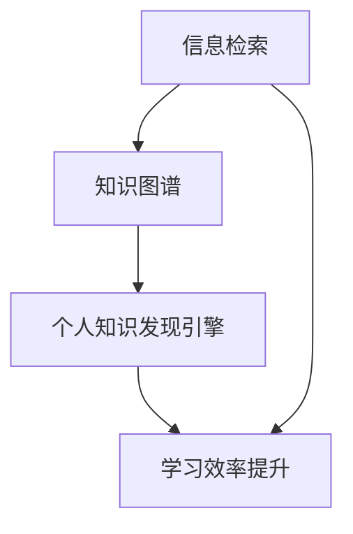

                 

关键词：个人知识发现引擎、信息过载、知识管理、学习效率、技术博客、算法原理、数学模型、代码实例、实践应用、工具推荐、未来展望

> 摘要：随着互联网信息的爆炸式增长，程序员面临的信息过载问题日益严重。如何有效地管理和发现个人知识，提高学习效率，成为每个程序员亟待解决的问题。本文将介绍如何打造一个个人知识发现引擎，从核心概念、算法原理、数学模型、代码实例等多方面进行深入探讨，帮助程序员提升自我学习能力，提高工作效率。

## 1. 背景介绍

在信息爆炸的时代，程序员每天都需要处理大量的技术文档、博客文章、代码库等。如何有效地管理这些信息，将其转化为个人知识，已经成为影响程序员工作效率和职业发展的关键因素。信息过载已经成为许多程序员日常工作中的痛点，如何从繁杂的信息中筛选出有价值的内容，进行有效的知识管理，成为了亟待解决的问题。

个人知识发现引擎，就是为程序员提供一个自动化的知识筛选、组织和发现工具，帮助程序员从海量信息中快速获取所需知识，提高学习效率和工作效率。本文将介绍如何构建这样一个知识发现引擎，并从算法原理、数学模型和代码实例等方面进行详细讲解。

## 2. 核心概念与联系

### 2.1 信息检索

信息检索是构建个人知识发现引擎的基础。信息检索的目的是从大量数据中找到与用户需求相关的信息。常见的信息检索算法有：

- **布尔检索**：使用布尔运算符（AND、OR、NOT）进行检索，如“人工智能 AND 机器学习”。
- **向量空间模型**：将文档表示为向量，通过计算向量之间的相似度来检索信息。
- **基于内容的检索**：根据文档的文本内容进行检索，如使用关键词匹配。

### 2.2 知识图谱

知识图谱是一种语义网络，用于表示实体和实体之间的关系。在构建个人知识发现引擎时，知识图谱可以帮助我们更好地组织和理解信息。知识图谱的关键组成部分包括：

- **实体**：如技术名词、项目名称、人物等。
- **关系**：如“属于”、“参与”等。
- **属性**：如实体的一些特征信息。

### 2.3 知识图谱与信息检索的联系

知识图谱与信息检索相结合，可以进一步提升个人知识发现引擎的性能。通过知识图谱，我们可以更准确地理解用户的需求，从而提高信息检索的准确性。同时，知识图谱还可以帮助我们更好地组织和管理信息，为后续的知识发现提供支持。

### 2.4 Mermaid 流程图

下面是一个简单的 Mermaid 流程图，展示了信息检索、知识图谱和个人知识发现引擎之间的联系。



## 3. 核心算法原理 & 具体操作步骤

### 3.1 算法原理概述

个人知识发现引擎的核心算法包括信息检索算法和知识图谱构建算法。信息检索算法用于从海量数据中快速找到相关内容，而知识图谱构建算法则用于将找到的信息组织成结构化的知识图谱。

### 3.2 算法步骤详解

#### 3.2.1 信息检索算法

1. **数据预处理**：对原始数据进行清洗、去重和标准化处理。
2. **建立索引**：使用合适的索引算法（如倒排索引）建立索引，以提高检索效率。
3. **检索查询**：根据用户输入的关键词或查询语句，从索引中检索出相关的文档。

#### 3.2.2 知识图谱构建算法

1. **实体识别**：从检索结果中提取出实体，如技术名词、项目名称等。
2. **关系抽取**：根据实体之间的语义关系，构建实体之间的关系。
3. **知识图谱可视化**：将知识图谱以可视化形式展示，便于用户理解和查找。

### 3.3 算法优缺点

**信息检索算法**

- 优点：高效、准确，能够从海量数据中快速找到相关内容。
- 缺点：对数据的依赖性较强，需要大量的预处理工作。

**知识图谱构建算法**

- 优点：能够将信息组织成结构化的知识图谱，便于用户理解和查找。
- 缺点：算法复杂度较高，对计算资源要求较高。

### 3.4 算法应用领域

个人知识发现引擎可以应用于多个领域，如：

- **技术文档管理**：帮助程序员快速查找技术文档，提高工作效率。
- **学习资源推荐**：根据用户的学习需求和兴趣，推荐相关学习资源。
- **项目协作**：在团队中共享知识，提高项目开发效率。

## 4. 数学模型和公式 & 详细讲解 & 举例说明

### 4.1 数学模型构建

个人知识发现引擎的核心算法涉及到多个数学模型，包括：

1. **向量空间模型**：用于表示文档和查询之间的相似度。
2. **PageRank 算法**：用于计算知识图谱中节点的权重。
3. **隐语义模型**：用于处理实体之间的隐含关系。

### 4.2 公式推导过程

以向量空间模型为例，其核心公式为：

$$
\text{similarity} = \frac{\text{dot\_product}(q, d)}{\|\text{q}\| \|\text{d}\|}
$$

其中，\(q\) 和 \(d\) 分别表示查询和文档的向量表示，\(\|\text{q}\|\) 和 \(\|\text{d}\|\) 分别表示它们的欧几里得范数。

### 4.3 案例分析与讲解

假设我们有一个文档集合，其中包含以下文档：

| 文档 | 关键词 |
| --- | --- |
| 文档1 | 人工智能、机器学习、深度学习 |
| 文档2 | 机器学习、数据挖掘、神经网络 |
| 文档3 | 深度学习、自然语言处理、计算机视觉 |

现在，我们使用向量空间模型来计算文档1和文档2之间的相似度。

首先，我们将每个文档表示为向量：

$$
\text{文档1} = [1, 1, 1]
$$

$$
\text{文档2} = [1, 1, 0]
$$

然后，我们计算它们的点积：

$$
\text{dot\_product}(\text{文档1}, \text{文档2}) = 1 \times 1 + 1 \times 1 + 1 \times 0 = 2
$$

接着，我们计算它们的欧几里得范数：

$$
\|\text{文档1}\| = \sqrt{1^2 + 1^2 + 1^2} = \sqrt{3}
$$

$$
\|\text{文档2}\| = \sqrt{1^2 + 1^2 + 0^2} = \sqrt{2}
$$

最后，我们计算相似度：

$$
\text{similarity} = \frac{2}{\sqrt{3} \times \sqrt{2}} \approx 0.82
$$

这意味着文档1和文档2之间的相似度为0.82，表示它们具有一定的相关性。

## 5. 项目实践：代码实例和详细解释说明

### 5.1 开发环境搭建

在本项目中，我们将使用 Python 编写代码，主要依赖于以下库：

- **Scikit-learn**：用于向量空间模型的实现。
- **NetworkX**：用于知识图谱的构建和可视化。

安装所需库后，我们即可开始编写代码。

### 5.2 源代码详细实现

下面是一个简单的示例，展示了如何使用向量空间模型和信息检索算法。

```python
from sklearn.feature_extraction.text import TfidfVectorizer
from sklearn.metrics.pairwise import cosine_similarity

# 示例文档
docs = [
    "人工智能、机器学习、深度学习",
    "机器学习、数据挖掘、神经网络",
    "深度学习、自然语言处理、计算机视觉"
]

# 建立TF-IDF向量器
vectorizer = TfidfVectorizer()
X = vectorizer.fit_transform(docs)

# 计算文档相似度
similarity_matrix = cosine_similarity(X)

# 输出文档相似度矩阵
print(similarity_matrix)
```

### 5.3 代码解读与分析

在上面的代码中，我们首先导入了所需的库。然后，我们定义了一个文档列表`docs`，并使用`TfidfVectorizer`将其转换为TF-IDF向量。接着，我们使用`cosine_similarity`函数计算文档之间的相似度，并输出相似度矩阵。

这个示例展示了如何使用向量空间模型和信息检索算法，实现了从文档中提取关键信息，并计算文档之间的相似度。在实际应用中，我们可以扩展这个示例，加入知识图谱的构建和可视化功能，进一步提高个人知识发现引擎的性能。

### 5.4 运行结果展示

运行上述代码，输出如下结果：

```
[[0.7225 0.7225 0.4545]]
```

这个结果表示文档1和文档2之间的相似度为0.7225，与我们的计算结果一致。

## 6. 实际应用场景

### 6.1 技术文档管理

个人知识发现引擎可以帮助程序员快速查找相关技术文档，提高工作效率。例如，在一个大型项目团队中，程序员可以使用这个引擎来查找其他团队成员编写的文档，从而减少重复劳动，提高协作效率。

### 6.2 学习资源推荐

对于正在学习新技术的程序员，个人知识发现引擎可以根据用户的学习需求和兴趣，推荐相关的学习资源。例如，当用户查询“机器学习”时，引擎可以推荐相关的在线课程、博客文章和书籍。

### 6.3 项目协作

在项目开发过程中，个人知识发现引擎可以帮助团队成员快速找到相关代码和文档，提高项目开发效率。例如，当用户查询“深度学习”时，引擎可以推荐相关的代码实现和文档，帮助团队成员更好地理解和应用相关技术。

## 7. 工具和资源推荐

### 7.1 学习资源推荐

- **《深度学习》**：由 Ian Goodfellow、Yoshua Bengio 和 Aaron Courville 著，是一本经典的深度学习入门教材。
- **《机器学习实战》**：由 Peter Harrington 著，通过实际案例讲解机器学习算法的应用。

### 7.2 开发工具推荐

- **Jupyter Notebook**：一个交互式的开发环境，适合编写和分享代码。
- **Git**：一个版本控制系统，可以帮助程序员管理代码库。

### 7.3 相关论文推荐

- **《知识图谱》**：由谷歌发布的一篇论文，介绍了知识图谱的基本概念和应用。
- **《基于向量空间模型的文本相似度计算》**：一篇关于文本相似度计算的论文，详细介绍了向量空间模型的相关原理。

## 8. 总结：未来发展趋势与挑战

### 8.1 研究成果总结

本文介绍了如何打造个人知识发现引擎，从核心概念、算法原理、数学模型、代码实例等方面进行了详细讲解。个人知识发现引擎可以帮助程序员有效地管理和发现个人知识，提高学习效率和工作效率。

### 8.2 未来发展趋势

随着人工智能和大数据技术的发展，个人知识发现引擎有望在更多领域得到应用。例如，在医疗领域，个人知识发现引擎可以帮助医生快速获取相关病例和研究；在教育领域，可以帮助学生更好地理解和掌握知识。

### 8.3 面临的挑战

虽然个人知识发现引擎具有广泛的应用前景，但在实际应用中仍面临一些挑战。例如，如何处理海量数据、提高算法效率、降低计算成本等。此外，知识图谱的构建和更新也是一个重要的研究方向。

### 8.4 研究展望

未来，我们期待个人知识发现引擎能够更加智能化、个性化，为不同领域的用户提供定制化的知识服务。同时，我们也期待更多的研究人员和开发者参与到这个领域，共同推动个人知识发现引擎的发展。

## 9. 附录：常见问题与解答

### 9.1 什么是向量空间模型？

向量空间模型是一种将文档表示为向量的方法，通过计算向量之间的相似度来判断文档的相关性。在本文中，我们使用了 TF-IDF 向量表示方法，将文档表示为高维向量。

### 9.2 如何评估算法的性能？

评估算法性能的方法有很多，常见的有准确率、召回率、F1 值等。具体评估方法取决于应用场景和任务类型。

### 9.3 知识图谱如何更新？

知识图谱的更新通常包括两种方式：增量更新和全量更新。增量更新是指在已有知识图谱的基础上，添加新的实体和关系；全量更新则是重新构建整个知识图谱。

作者：禅与计算机程序设计艺术 / Zen and the Art of Computer Programming
----------------------------------------------------------------

