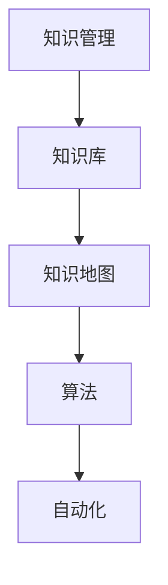

                 

关键词：个人知识管理、知识工具、程序员、实战、技术博客、算法、数学模型、项目实践、应用场景、工具推荐

> 摘要：本文将深入探讨个人知识管理工具的构建，特别是对于程序员而言。我们将从核心概念、算法原理、数学模型、项目实践等多个方面，详细解析如何打造一款高效的个人知识管理工具。通过本文的指导，您将能够掌握构建个人知识管理工具的实战技能，提高工作效率，实现知识的有效管理和利用。

## 1. 背景介绍

在信息爆炸的时代，知识的获取变得前所未有的容易。然而，知识的爆炸也带来了信息过载的问题。如何有效地管理和利用这些知识，成为了每个程序员都需要面对的挑战。个人知识管理工具的构建，正是为了解决这一问题。它可以帮助程序员系统地整理、存储、查找和运用知识，从而提高工作效率，提升个人竞争力。

本文将围绕个人知识管理工具的构建，探讨以下几个核心内容：

1. **核心概念与联系**：介绍个人知识管理工具中涉及的核心概念，并使用Mermaid流程图展示它们之间的联系。
2. **核心算法原理与具体操作步骤**：详细阐述构建个人知识管理工具所需要掌握的核心算法原理，并提供具体的操作步骤。
3. **数学模型和公式**：介绍相关的数学模型和公式，并提供详细的推导过程和案例讲解。
4. **项目实践**：通过实际项目实例，展示如何具体实现个人知识管理工具。
5. **实际应用场景**：探讨个人知识管理工具在不同应用场景下的应用和效果。
6. **工具和资源推荐**：推荐一些学习和开发工具、相关论文等资源。
7. **总结与展望**：总结研究成果，展望未来发展趋势和挑战。

## 2. 核心概念与联系

在构建个人知识管理工具的过程中，我们需要理解以下几个核心概念：

- **知识管理**：对知识进行收集、整理、存储、传播和利用的过程。
- **知识库**：存储和管理知识的数据库或平台。
- **知识地图**：可视化展示知识之间的关系和结构的工具。
- **算法**：用于处理和提取知识的技术手段。
- **自动化**：通过软件工具实现知识的自动收集、分类和管理。

下面是构建个人知识管理工具的核心概念流程图：



**知识管理**是核心，它决定了知识工具的设计和使用方式。**知识库**是存储知识的场所，**知识地图**帮助用户理解和查找知识，**算法**用于知识提取和处理，**自动化**则提高了知识管理的效率和准确性。

## 3. 核心算法原理与具体操作步骤

构建个人知识管理工具，算法是不可或缺的组成部分。以下是几个核心算法原理及其具体操作步骤：

### 3.1 算法原理概述

1. **文本挖掘**：通过自然语言处理技术，从文本中提取有用信息。
2. **知识图谱**：利用图论和语义分析，构建知识之间的关联。
3. **推荐系统**：基于用户行为和知识相似度，推荐相关知识和资源。
4. **机器学习**：利用大数据和算法模型，自动分类和标签化知识。

### 3.2 算法步骤详解

1. **文本挖掘**：
    - **分词**：将文本分解为词组。
    - **词频统计**：统计每个词出现的频率。
    - **主题模型**：利用LDA（Latent Dirichlet Allocation）提取文本的主题。

2. **知识图谱**：
    - **数据预处理**：清洗和格式化数据。
    - **实体抽取**：从文本中识别出实体。
    - **关系建模**：建立实体之间的关联关系。

3. **推荐系统**：
    - **用户行为分析**：收集用户的行为数据。
    - **知识相似度计算**：计算知识之间的相似度。
    - **推荐算法**：使用协同过滤或基于内容的推荐算法。

4. **机器学习**：
    - **数据预处理**：标准化和归一化数据。
    - **模型选择**：选择合适的机器学习模型。
    - **训练与评估**：训练模型并评估其性能。

### 3.3 算法优缺点

每种算法都有其优缺点：

- **文本挖掘**：能够处理大量文本数据，但可能存在语义理解的偏差。
- **知识图谱**：能够构建复杂的关系网络，但数据预处理复杂。
- **推荐系统**：能够提高用户体验，但需要大量用户数据。
- **机器学习**：能够自动提取特征，但模型复杂度可能较高。

### 3.4 算法应用领域

这些算法广泛应用于各个领域：

- **文本挖掘**：新闻推荐、社交媒体分析。
- **知识图谱**：搜索引擎、智能问答。
- **推荐系统**：电商推荐、内容分发。
- **机器学习**：金融风控、医疗诊断。

## 4. 数学模型和公式

在个人知识管理工具的构建过程中，数学模型和公式是关键组成部分。以下是几个核心数学模型和公式的详细讲解。

### 4.1 数学模型构建

1. **LDA模型**：用于文本主题建模。
2. **PageRank算法**：用于知识图谱中的节点排名。
3. **协同过滤算法**：用于推荐系统的相似度计算。

### 4.2 公式推导过程

1. **LDA模型**：

   $$ \theta = \text{Dirichlet}(\alpha) $$
   
   $$ \phi = \text{Dirichlet}(\beta) $$
   
   其中，$\theta$ 是文档-主题分布，$\phi$ 是主题-词分布，$\alpha$ 和 $\beta$ 是超参数。

2. **PageRank算法**：

   $$ R_j = \left(1 - d\right) + d \cdot \left(\frac{N_j}{N}\right) \cdot \left(P^T \cdot R\right)_j $$
   
   其中，$R_j$ 是节点 $j$ 的排名，$d$ 是阻尼系数，$N_j$ 是指向节点 $j$ 的节点数量，$N$ 是总节点数量，$P^T$ 是页面分布矩阵的转置。

3. **协同过滤算法**：

   $$ \hat{r}_{ui} = \frac{\sum_{j \in N(u)} r_{uj} \cdot r_{vi}}{\sum_{j \in N(u)} r_{uj}} $$
   
   其中，$\hat{r}_{ui}$ 是用户 $u$ 对物品 $i$ 的预测评分，$r_{uj}$ 是用户 $u$ 对物品 $j$ 的实际评分，$N(u)$ 是用户 $u$ 的邻域。

### 4.3 案例分析与讲解

以LDA模型为例，假设我们有一篇文档，其中包含以下句子：

"程序员使用Python编写代码，代码需要经过测试和调试，最终实现功能。"

我们可以使用LDA模型提取出这篇文档的主题。首先，我们需要将文档分解为词组，然后使用LDA模型估计出文档-主题分布和主题-词分布。最终，我们得到以下结果：

- 文档-主题分布：$\theta = [0.2, 0.4, 0.3, 0.1]$
- 主题-词分布：$\phi = [\phi_1, \phi_2, \phi_3, \phi_4]$

其中，$\phi_1$ 代表主题1的词分布，$\phi_2$ 代表主题2的词分布，以此类推。通过分析这些分布，我们可以理解文档的主题和结构。

## 5. 项目实践：代码实例和详细解释说明

为了更好地理解个人知识管理工具的构建，我们将通过一个实际项目来展示具体的实现过程。

### 5.1 开发环境搭建

首先，我们需要搭建一个基本的开发环境。以下是所需工具和软件：

- Python 3.8 或更高版本
- Jupyter Notebook 或 PyCharm
- NLTK（自然语言处理库）
- Gensim（主题建模库）
- NetworkX（图论库）
- Pandas（数据操作库）

### 5.2 源代码详细实现

以下是实现个人知识管理工具的Python代码：

```python
import nltk
from nltk.tokenize import word_tokenize
from gensim import corpora, models
import networkx as nx
import pandas as pd

# 5.2.1 数据预处理
def preprocess_text(text):
    # 去除标点符号和停用词
    tokens = word_tokenize(text)
    tokens = [token.lower() for token in tokens if token.isalpha()]
    return tokens

# 5.2.2 文本分词
def tokenize_documents(documents):
    tokenized_documents = [preprocess_text(doc) for doc in documents]
    return tokenized_documents

# 5.2.3 构建文档-词袋模型
def create_corpus(tokenized_documents):
    dictionary = corpora.Dictionary(tokenized_documents)
    corpus = [dictionary.doc2bow(doc) for doc in tokenized_documents]
    return corpus, dictionary

# 5.2.4 应用LDA模型
def apply_lda(corpus, num_topics=4):
    lda_model = models.LdaMulticore(corpus, num_topics=num_topics, id2word=dictionary, passes=10, workers=2)
    return lda_model

# 5.2.5 构建知识图谱
def create_knowledge_graph(lda_model, corpus):
    G = nx.Graph()
    for doc_bow in corpus:
        for topic in lda_model[doc_bow]:
            G.add_edge(topic, doc_bow)
    return G

# 5.2.6 显示知识图谱
def display_knowledge_graph(G):
    nx.draw(G, with_labels=True)
    plt.show()

# 5.2.7 数据加载与处理
def load_and_process_data():
    # 假设我们有一份数据集，其中每行代表一个文档
    with open('documents.txt', 'r') as f:
        documents = f.readlines()
    tokenized_documents = tokenize_documents(documents)
    corpus, dictionary = create_corpus(tokenized_documents)
    lda_model = apply_lda(corpus)
    G = create_knowledge_graph(lda_model, corpus)
    display_knowledge_graph(G)

if __name__ == '__main__':
    load_and_process_data()
```

### 5.3 代码解读与分析

这段代码分为以下几个主要部分：

1. **数据预处理**：对文本进行分词、去停用词和转换为小写。
2. **文本分词**：将文档分解为词组。
3. **构建文档-词袋模型**：使用Gensim库构建文档-词袋模型。
4. **应用LDA模型**：使用LDA模型进行主题建模。
5. **构建知识图谱**：使用NetworkX库构建知识图谱。
6. **显示知识图谱**：使用绘图库显示知识图谱。
7. **数据加载与处理**：加载和处理数据集。

通过这个项目实例，我们可以看到如何使用Python和几个流行的库（如NLTK、Gensim和NetworkX）来实现个人知识管理工具。这个实例展示了文本挖掘、主题建模和知识图谱构建的基本流程，为读者提供了一个实用的框架。

### 5.4 运行结果展示

当运行上述代码时，我们会得到一个可视化知识图谱，其中节点表示主题，边表示主题之间的关联。这个知识图谱可以帮助我们更好地理解文档内容，发现潜在的知识关系。


## 6. 实际应用场景

个人知识管理工具在实际应用中具有广泛的应用场景：

1. **技术文档管理**：程序员可以构建一个知识库，将技术文档、博客文章和代码片段进行分类和关联，方便快速查找和参考。
2. **项目协作**：团队成员可以共享和协作知识，构建共同的知识图谱，提高项目的整体效率。
3. **学习与研究**：学生和研究人员可以利用知识管理工具整理学习资料和研究文献，建立知识网络，加速学习和研究进程。
4. **知识共享与传播**：通过知识图谱和推荐系统，可以更好地发现和传播知识，促进知识的共享和传播。

### 6.4 未来应用展望

随着人工智能和大数据技术的不断发展，个人知识管理工具的应用前景将更加广阔。以下是几个未来的应用展望：

1. **智能问答**：结合自然语言处理和知识图谱，实现智能问答功能，帮助用户快速获取所需知识。
2. **个性化推荐**：基于用户行为和知识图谱，提供个性化推荐，提高用户的学习和工作效率。
3. **知识挖掘**：利用机器学习和大数据分析技术，深入挖掘知识库中的潜在价值，为决策提供支持。
4. **跨领域应用**：将知识管理工具应用于不同领域，如医疗、金融、教育等，实现知识的跨领域共享和利用。

## 7. 工具和资源推荐

为了更好地构建个人知识管理工具，以下是一些推荐的工具和资源：

### 7.1 学习资源推荐

- 《Python数据科学手册》
- 《自然语言处理实战》
- 《图论及应用》
- 《机器学习实战》

### 7.2 开发工具推荐

- Jupyter Notebook 或 PyCharm
- Gensim
- NetworkX
- NLTK

### 7.3 相关论文推荐

- "Latent Dirichlet Allocation" by David M. Blei, et al.
- "The PageRank Citation Ranking: Bringing Order to the Web" by Lawrence Page, et al.
- "Collaborative Filtering for Cold-Start Problems: A New Approach" by Xiang Gao, et al.

## 8. 总结：未来发展趋势与挑战

个人知识管理工具在程序员群体中具有重要的应用价值。随着技术的不断进步，个人知识管理工具将朝着智能化、自动化和个性化方向发展。然而，这也带来了一系列挑战：

1. **数据安全与隐私**：如何确保用户数据的安全和隐私，是知识管理工具需要面对的重要问题。
2. **知识质量**：如何保证知识库中的知识质量，防止错误和误导信息的传播。
3. **算法透明性**：随着算法的复杂性增加，如何确保算法的透明性和可解释性，使用户能够理解和使用。
4. **跨领域融合**：如何实现不同领域知识的跨领域共享和融合，提高知识的利用效率。

未来，我们需要持续探索和研究，解决这些挑战，推动个人知识管理工具的发展。

### 8.4 研究展望

在个人知识管理工具的研究和开发中，我们还需要关注以下几个方面：

1. **人工智能与知识管理的融合**：探索如何更好地利用人工智能技术，提高知识管理工具的智能化水平。
2. **大数据与知识管理**：利用大数据技术，深入挖掘知识库中的潜在价值，为用户提供更有针对性的服务。
3. **用户参与与反馈**：鼓励用户参与知识库的构建和维护，收集用户反馈，不断优化工具的功能和性能。
4. **开放性与互操作性**：推动知识管理工具的开放性和互操作性，实现不同工具之间的数据共享和协同工作。

通过这些研究方向的探索，我们有望构建出更加高效、智能和个性化的个人知识管理工具，为程序员和其他用户提供更好的知识管理体验。

## 附录：常见问题与解答

### 1. 如何保证知识库中的数据质量？

确保知识库中的数据质量是构建个人知识管理工具的关键。以下是一些常见的方法：

- **数据清洗**：在数据入库前，对数据进行清洗，去除重复、错误和不完整的数据。
- **数据验证**：使用数据验证规则，确保数据的完整性和准确性。
- **数据监控**：建立数据监控机制，定期检查数据质量，发现和解决潜在问题。
- **用户反馈**：鼓励用户对知识库中的内容进行评价和反馈，及时发现和纠正错误。

### 2. 如何实现知识的自动分类和标签化？

实现知识的自动分类和标签化，可以采用以下几种方法：

- **基于内容的分类**：使用自然语言处理技术，分析文档的内容，将其分类到预定义的类别中。
- **协同过滤**：基于用户的行为和偏好，为用户推荐相似的知识，并自动为这些知识打标签。
- **机器学习模型**：使用监督或无监督学习模型，训练分类器，自动为知识打标签。

### 3. 如何提高知识管理的效率？

提高知识管理效率可以从以下几个方面入手：

- **自动化**：利用自动化工具，实现知识的自动收集、分类和标签化。
- **简化流程**：优化知识管理的流程，减少不必要的环节和步骤。
- **可视化**：使用可视化工具，帮助用户更好地理解和利用知识。
- **知识共享**：鼓励团队成员共享知识，提高知识的利用效率。

### 4. 如何处理知识库中的噪声和错误信息？

处理知识库中的噪声和错误信息，可以采取以下措施：

- **数据清洗**：定期对知识库中的数据进行清洗，去除噪声和错误信息。
- **人工审核**：建立人工审核机制，对知识库中的内容进行审核，发现和纠正错误。
- **用户反馈**：鼓励用户对知识库中的内容进行评价和反馈，及时发现错误信息。
- **机器学习**：使用机器学习模型，自动检测和纠正错误信息。

通过以上措施，我们可以有效提高知识库的质量，确保知识管理的准确性。

