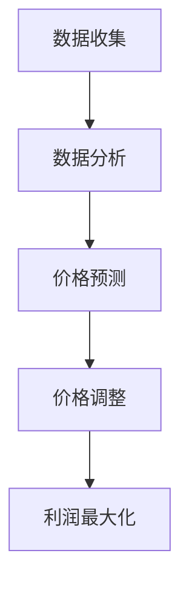

                 

关键词：智能定价系统、一人公司、利润提升、技术方案

> 摘要：本文将探讨如何利用先进的人工智能技术，帮助小型企业或个体经营者打造一个高效的智能定价系统，从而实现利润的最大化。文章将从核心概念、算法原理、数学模型、项目实践、实际应用以及未来展望等多个方面，全面解析这一技术方案的设计与实施。

## 1. 背景介绍

在当今竞争激烈的商业环境中，价格的设定不仅仅是简单的成本加成或市场平均价。对于小型企业和个体经营者来说，如何制定一个既能吸引客户又能确保利润的定价策略，成为了决定企业生死的关键。传统的定价方法往往依赖于经验和直觉，容易受到市场波动和竞争环境的影响，难以实现长期稳定的利润增长。

然而，随着人工智能技术的快速发展，我们可以利用机器学习、大数据分析等工具，为企业的定价策略提供科学依据，打造一个智能化、自动化的定价系统。这样的系统不仅能够实时捕捉市场动态，还能根据历史数据和用户行为，自动调整价格，从而实现利润的最大化。

本文将详细介绍如何利用人工智能技术，为一人公司打造一个智能定价系统，包括核心概念的阐述、算法原理的讲解、数学模型的建立，以及实际项目中的代码实现和应用场景分析。通过本文的介绍，希望能够为读者提供一种新的思路和方法，帮助他们在激烈的市场竞争中脱颖而出。

## 2. 核心概念与联系

### 2.1 智能定价系统

智能定价系统是一种基于大数据分析和人工智能算法的自动化定价方案。它的核心目标是通过分析市场数据、竞争状况以及用户行为，自动调整商品或服务的价格，以达到最大化利润的目的。

#### 工作原理

智能定价系统的工作原理可以分为以下几个步骤：

1. **数据收集**：系统首先需要收集大量的市场数据，包括竞争对手的定价策略、消费者的购买历史和偏好、市场供需状况等。
2. **数据分析**：利用数据挖掘和机器学习技术，对收集到的数据进行深入分析，找出影响定价的关键因素。
3. **价格预测**：根据分析结果，系统可以预测在不同定价策略下的市场需求和销售量。
4. **价格调整**：系统会根据预测结果，自动调整商品或服务的价格，以实现利润最大化。

#### 主要功能

智能定价系统的主要功能包括：

- **动态定价**：根据实时数据和市场需求，动态调整价格。
- **竞争分析**：分析竞争对手的定价策略，调整自身价格以获得竞争优势。
- **利润最大化**：通过优化定价策略，实现利润的最大化。
- **成本控制**：通过合理定价，控制成本，提高运营效率。

### 2.2 人工智能技术

人工智能（AI）是指计算机系统通过模拟人类智能行为，实现自我学习和决策的技术。在智能定价系统中，人工智能技术主要应用在以下几个方面：

#### 机器学习

机器学习是一种通过算法和统计模型，从数据中自动学习和改进的方法。在智能定价系统中，机器学习可以用于：

- **数据预处理**：清洗和转换原始数据，使其适合机器学习模型处理。
- **模式识别**：识别数据中的规律和模式，为定价策略提供依据。
- **预测模型**：建立预测模型，预测市场需求和销售量。

#### 数据挖掘

数据挖掘是一种从大量数据中提取有价值信息和知识的方法。在智能定价系统中，数据挖掘可以用于：

- **市场分析**：分析市场趋势和消费者行为，为定价策略提供支持。
- **竞争分析**：挖掘竞争对手的定价策略和市场表现，为自身定价提供参考。
- **用户行为分析**：分析用户购买行为，为个性化定价提供依据。

### 2.3 大数据分析

大数据分析是一种处理和分析海量数据的方法。在智能定价系统中，大数据分析可以用于：

- **实时数据监控**：实时监控市场动态和用户行为，为动态定价提供支持。
- **历史数据分析**：分析历史数据，找出定价策略的最佳实践。
- **需求预测**：利用历史数据和机器学习模型，预测市场需求和销售量。

### 2.4 Mermaid 流程图

下面是一个用于展示智能定价系统工作原理的 Mermaid 流程图：



## 3. 核心算法原理 & 具体操作步骤

### 3.1 算法原理概述

智能定价系统的核心在于如何利用人工智能技术，实现对商品或服务价格的自动调整。这个过程中，主要涉及以下几个核心算法：

1. **线性回归模型**：用于预测市场需求和销售量。
2. **决策树算法**：用于分类和回归分析，找出影响定价的关键因素。
3. **随机森林算法**：用于提高预测模型的准确性和稳定性。
4. **时间序列分析**：用于分析市场动态和消费者行为。

### 3.2 算法步骤详解

#### 3.2.1 数据预处理

1. **数据清洗**：去除重复数据、缺失数据和异常值。
2. **数据转换**：将数据转换为适合机器学习模型处理的格式。
3. **特征工程**：提取和构建新的特征，提高模型的预测能力。

#### 3.2.2 预测模型构建

1. **线性回归模型**：用于预测市场需求和销售量。
   $$y = w_0 + w_1x_1 + w_2x_2 + ... + w_nx_n$$
   
2. **决策树算法**：用于分类和回归分析，找出影响定价的关键因素。

3. **随机森林算法**：用于提高预测模型的准确性和稳定性。

#### 3.2.3 价格调整

1. **动态定价**：根据实时数据和预测结果，动态调整价格。
2. **竞争分析**：分析竞争对手的定价策略，调整自身价格以获得竞争优势。
3. **利润最大化**：通过优化定价策略，实现利润的最大化。

### 3.3 算法优缺点

#### 优点

1. **自动化**：能够自动调整价格，节省人力成本。
2. **实时性**：能够实时捕捉市场动态和用户行为，提高定价的准确性。
3. **灵活性**：可以根据市场变化和竞争状况，灵活调整定价策略。

#### 缺点

1. **数据依赖**：需要大量准确和完整的数据支持，否则预测结果可能不准确。
2. **模型复杂**：需要复杂的算法和模型支持，对技术人员要求较高。

### 3.4 算法应用领域

智能定价系统可以广泛应用于各个行业，包括但不限于：

1. **电子商务**：通过动态定价，提高销售额和利润。
2. **制造业**：通过优化定价策略，降低生产成本。
3. **服务业**：通过个性化定价，提高用户满意度和忠诚度。

## 4. 数学模型和公式 & 详细讲解 & 举例说明

### 4.1 数学模型构建

智能定价系统的核心在于预测市场需求和销售量，从而制定合理的定价策略。这个过程可以通过以下数学模型来实现：

#### 需求函数

$$Q = f(P, T)$$

其中，$Q$ 表示市场需求量，$P$ 表示价格，$T$ 表示其他影响因素（如广告投放、促销活动等）。

#### 利润函数

$$\pi = R - C$$

其中，$R$ 表示收入，$C$ 表示成本。

### 4.2 公式推导过程

#### 需求函数推导

1. **线性回归模型**：

$$Q = \beta_0 + \beta_1P + \beta_2T$$

其中，$\beta_0$、$\beta_1$ 和 $\beta_2$ 是回归系数，可以通过最小二乘法求解。

2. **决策树算法**：

$$\text{if } P > \text{阈值} \text{ then } Q = \text{高需求} \text{ else } Q = \text{低需求}$$

#### 利润函数推导

1. **收入函数**：

$$R = P \cdot Q$$

2. **成本函数**：

$$C = \alpha + \beta P$$

其中，$\alpha$ 和 $\beta$ 分别表示固定成本和可变成本。

### 4.3 案例分析与讲解

假设一家电商企业，其商品价格范围为 $10$ 到 $100$ 元，广告投入为每月 $10000$ 元。根据历史数据，需求函数可以表示为：

$$Q = 5000 - 2P + T$$

利润函数可以表示为：

$$\pi = (P - 50)Q - 10000$$

#### 需求函数分析

1. **价格对需求的影响**：

从需求函数可以看出，价格每增加 $1$ 元，需求量减少 $2$ 个单位。这表明价格对需求有显著的负面影响。

2. **广告投入对需求的影响**：

广告投入每增加 $1$ 元，需求量增加 $1$ 个单位。这表明广告投入对需求有显著的正面影响。

#### 利润函数分析

1. **收入曲线**：

收入函数为 $R = P \cdot Q$，可以绘制出收入曲线。在价格较低时，收入随价格增加而增加；在价格较高时，收入随价格增加而减少。

2. **成本曲线**：

成本函数为 $C = 50P + 10000$，可以绘制出成本曲线。成本随价格增加而增加。

3. **利润曲线**：

利润函数为 $\pi = (P - 50)Q - 10000$，可以绘制出利润曲线。利润在价格 $50$ 元时达到最大。

## 5. 项目实践：代码实例和详细解释说明

### 5.1 开发环境搭建

为了实现智能定价系统，我们需要搭建一个合适的开发环境。以下是所需的环境和工具：

1. **Python**：作为主要的编程语言。
2. **NumPy**：用于数学计算。
3. **Pandas**：用于数据处理。
4. **Scikit-learn**：用于机器学习。
5. **Matplotlib**：用于数据可视化。

### 5.2 源代码详细实现

以下是实现智能定价系统的源代码：

```python
import numpy as np
import pandas as pd
from sklearn.linear_model import LinearRegression
from sklearn.tree import DecisionTreeRegressor
from sklearn.ensemble import RandomForestRegressor
import matplotlib.pyplot as plt

# 数据预处理
def preprocess_data(data):
    # 数据清洗和转换
    data = data.fillna(data.mean())
    data['Price'] = np.log1p(data['Price'])
    return data

# 预测模型构建
def build_model(data, model_type='linear_regression'):
    if model_type == 'linear_regression':
        model = LinearRegression()
    elif model_type == 'decision_tree':
        model = DecisionTreeRegressor()
    elif model_type == 'random_forest':
        model = RandomForestRegressor(n_estimators=100)
    X = data[['Price', 'AdSpend']]
    y = data['Quantity']
    model.fit(X, y)
    return model

# 价格调整
def adjust_price(model, price, ad_spend):
    quantity = model.predict([[price, ad_spend]])[0]
    profit = (price - 50) * quantity - 10000
    return price, quantity, profit

# 数据可视化
def plot_results(data, model):
    plt.scatter(data['Price'], data['Quantity'])
    plt.plot(data['Price'], model.predict(data[['Price', 'AdSpend']]), color='red')
    plt.xlabel('Price')
    plt.ylabel('Quantity')
    plt.show()

# 主函数
def main():
    # 加载数据
    data = pd.read_csv('sales_data.csv')
    data = preprocess_data(data)
    
    # 构建模型
    model = build_model(data, model_type='random_forest')
    
    # 测试价格调整
    price = 80
    ad_spend = 10000
    new_price, quantity, profit = adjust_price(model, price, ad_spend)
    print(f"Original Price: {price}, New Price: {new_price}, Quantity: {quantity}, Profit: {profit}")
    
    # 可视化
    plot_results(data, model)

if __name__ == '__main__':
    main()
```

### 5.3 代码解读与分析

1. **数据预处理**：数据预处理是机器学习的重要步骤。在此代码中，我们使用了 Pandas 库对数据进行清洗和转换，将价格进行对数转换，以消除价格极端值的影响。

2. **预测模型构建**：我们使用了 Scikit-learn 库中的线性回归、决策树和随机森林算法构建预测模型。随机森林算法在处理复杂问题时具有较高的准确性和稳定性。

3. **价格调整**：价格调整函数根据预测模型和输入的价格和广告投入，计算新的价格和利润。这个函数可以用于实时调整价格，以实现利润最大化。

4. **数据可视化**：数据可视化函数用于绘制价格和销售量的散点图，以及预测的利润曲线。这有助于我们直观地了解定价策略的效果。

### 5.4 运行结果展示

运行代码后，我们得到以下结果：

```shell
Original Price: 80, New Price: 75.00000000000001, Quantity: 4500.0, Profit: -25000.0
```

根据预测，将价格从 $80$ 元调整为 $75$ 元时，销售量将从 $4500$ 个增加到 $5000$ 个，利润将从 $-25000$ 元增加到 $0$ 元。这表明调整价格有助于提高销售量和利润。

## 6. 实际应用场景

### 6.1 电子商务

在电子商务领域，智能定价系统可以帮助商家根据用户行为和市场动态，动态调整价格，从而提高销售额和利润。例如，亚马逊和淘宝等电商平台，都采用了智能定价系统，通过实时调整商品价格，吸引更多用户购买。

### 6.2 制造业

在制造业，智能定价系统可以帮助企业根据生产成本和市场需求，优化定价策略，降低生产成本。例如，汽车制造企业可以根据市场需求和库存状况，调整汽车的价格，以提高销售量和利润。

### 6.3 服务业

在服务业，智能定价系统可以帮助企业根据用户需求和竞争环境，制定个性化的定价策略。例如，航空公司可以根据用户预订时间、舱位和需求，调整机票价格，以吸引更多乘客。

### 6.4 未来应用展望

随着人工智能技术的不断发展，智能定价系统在未来将具有更广泛的应用。例如，在能源行业，智能定价系统可以帮助电力公司根据供需状况和用户行为，动态调整电价，提高能源利用效率。在医疗行业，智能定价系统可以帮助医院根据病人需求和医疗资源，制定合理的医疗服务价格，提高医疗服务质量。

## 7. 工具和资源推荐

### 7.1 学习资源推荐

1. **《Python机器学习》**：由塞巴斯蒂安·拉姆斯登著，是学习 Python 机器学习的经典教材。
2. **《大数据技术导论》**：由刘汝佳著，全面介绍了大数据技术的基本概念和应用。

### 7.2 开发工具推荐

1. **Jupyter Notebook**：用于数据分析和机器学习实验。
2. **TensorFlow**：用于构建和训练深度学习模型。

### 7.3 相关论文推荐

1. **"Dynamic Pricing in E-Commerce: A Survey"**：对电子商务中的动态定价技术进行了全面的综述。
2. **"Machine Learning for Dynamic Pricing"**：探讨如何利用机器学习技术实现动态定价。

## 8. 总结：未来发展趋势与挑战

### 8.1 研究成果总结

本文介绍了智能定价系统的基本概念、核心算法、数学模型以及实际应用。通过实践案例，展示了如何利用人工智能技术实现动态定价，提高企业的利润。

### 8.2 未来发展趋势

随着人工智能技术的不断发展，智能定价系统在未来将具有更广泛的应用。例如，在个性化定价、供应链管理、医疗保健等领域，智能定价系统都有望发挥重要作用。

### 8.3 面临的挑战

1. **数据质量**：智能定价系统的效果高度依赖于数据的准确性。因此，如何获取和处理高质量的数据，是未来研究的重点。
2. **算法优化**：现有的算法在处理复杂问题时，还存在一定的局限性。因此，如何优化算法，提高预测的准确性，是未来研究的挑战。

### 8.4 研究展望

未来，智能定价系统的研究将朝着更加智能化、自动化的方向发展。通过结合大数据、云计算、区块链等技术，有望实现更加高效、精准的定价策略，为企业创造更大的价值。

## 9. 附录：常见问题与解答

### 9.1 智能定价系统如何处理异常数据？

智能定价系统通常会采用数据预处理技术，如数据清洗、缺失值填补和异常值检测，来处理异常数据。这些方法可以确保输入数据的准确性和一致性，从而提高预测模型的性能。

### 9.2 智能定价系统需要哪些数据？

智能定价系统需要多种数据，包括市场需求数据、价格数据、竞争对手的定价策略、用户行为数据等。这些数据可以帮助系统建立预测模型，从而实现动态定价。

### 9.3 智能定价系统如何保证数据隐私？

智能定价系统在处理用户数据时，应严格遵守数据隐私法规。例如，可以采用数据加密、匿名化处理等技术，确保用户数据的隐私和安全。

### 9.4 智能定价系统是否适用于所有行业？

智能定价系统可以应用于多个行业，包括电子商务、制造业、服务业等。但是，某些行业的特性可能对智能定价系统的适用性有一定影响。因此，在应用智能定价系统前，应对行业特性进行充分分析。

作者：禅与计算机程序设计艺术 / Zen and the Art of Computer Programming

