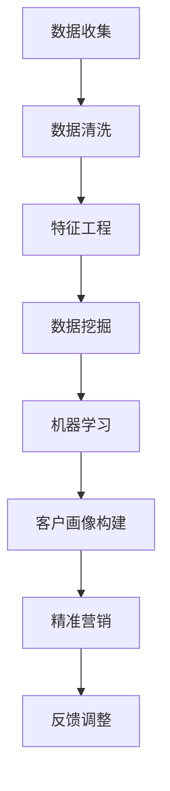

                 

关键词：智能客户画像、精准营销、一人公司、数据挖掘、机器学习、用户行为分析

> 摘要：本文将探讨如何利用智能客户画像技术，帮助一人公司实现精准营销。通过深入分析用户行为数据，构建高效客户画像模型，从而提高市场竞争力，实现可持续发展。

## 1. 背景介绍

在当今信息爆炸的时代，数据已经成为企业决策的重要依据。尤其是在竞争激烈的商业环境中，如何精准地定位目标客户，实现个性化营销，成为众多企业关注的焦点。智能客户画像技术，正是基于大数据和人工智能技术，通过对用户行为数据的深入挖掘和分析，构建用户画像，从而帮助企业实现精准营销。

一人公司，顾名思义，是由一个人创立和运营的公司。这类公司通常规模较小，资源有限，但在市场竞争中依然拥有独特的优势。如何利用有限的资源，实现高效营销，成为一人公司发展的关键。

本文将结合一人公司的特点，探讨如何利用智能客户画像技术，实现精准营销，提高市场竞争力。

## 2. 核心概念与联系

### 2.1 数据挖掘

数据挖掘（Data Mining）是从大量数据中提取出具有价值的信息和知识的过程。它涵盖了统计学、机器学习、数据库和领域知识等多个领域。数据挖掘的目标是发现数据之间的关联、趋势和模式，从而为决策提供支持。

### 2.2 机器学习

机器学习（Machine Learning）是一种通过数据训练模型，使计算机能够从数据中学习并做出预测或决策的技术。它利用算法，从历史数据中学习规律，从而在新数据上做出预测。机器学习在智能客户画像中起着关键作用，可以帮助构建和优化客户画像模型。

### 2.3 用户行为分析

用户行为分析（User Behavior Analysis）是对用户在互联网或应用中产生的行为数据进行分析和研究的过程。通过分析用户的行为数据，可以了解用户的需求、偏好和习惯，从而为精准营销提供依据。

### 2.4 智能客户画像

智能客户画像（Smart Customer Profiling）是基于用户行为数据，通过数据挖掘和机器学习技术，构建出的一个关于用户的综合信息模型。智能客户画像可以帮助企业了解用户特征、行为和需求，从而实现精准营销。

### 2.5 Mermaid 流程图



## 3. 核心算法原理 & 具体操作步骤

### 3.1 算法原理概述

智能客户画像算法主要基于以下几个步骤：

1. 数据收集：收集用户在互联网或应用中的行为数据，如浏览历史、购买记录、评论等。
2. 数据清洗：对收集到的数据进行清洗，去除无效和错误数据。
3. 特征工程：从原始数据中提取有价值的信息，如用户年龄、性别、消费金额等。
4. 数据挖掘：利用数据挖掘算法，如关联规则挖掘、聚类分析等，发现数据中的关联和趋势。
5. 机器学习：利用机器学习算法，如决策树、神经网络等，构建客户画像模型。
6. 客户画像构建：将机器学习模型的结果整合，形成对用户的综合信息模型。
7. 精准营销：根据客户画像，设计个性化营销策略，提高营销效果。
8. 反馈调整：根据营销效果，调整客户画像模型，优化营销策略。

### 3.2 算法步骤详解

1. **数据收集**：
   - 通过网站分析工具、API接口等手段，收集用户行为数据。
   - 数据类型包括浏览历史、购买记录、评论、社交媒体互动等。

2. **数据清洗**：
   - 去除重复数据、空值数据和异常值。
   - 对数据进行标准化处理，如年龄、消费金额等。

3. **特征工程**：
   - 提取用户的基本信息，如年龄、性别、职业等。
   - 提取用户的消费行为特征，如购买频率、购买金额、购买品类等。

4. **数据挖掘**：
   - 利用关联规则挖掘算法，如Apriori算法，发现用户行为之间的关联。
   - 利用聚类分析算法，如K-means算法，将用户分为不同的群体。

5. **机器学习**：
   - 选择合适的机器学习算法，如决策树、随机森林、神经网络等。
   - 利用训练集数据，训练机器学习模型。
   - 利用测试集数据，评估模型性能。

6. **客户画像构建**：
   - 将机器学习模型的结果进行整合，形成对用户的综合信息模型。
   - 模型中包含用户的基本信息、行为特征、偏好等。

7. **精准营销**：
   - 根据客户画像，设计个性化营销策略。
   - 利用邮件、短信、推送通知等渠道，实施营销活动。

8. **反馈调整**：
   - 收集营销效果数据，如转化率、点击率、销售额等。
   - 利用反馈数据，调整客户画像模型，优化营销策略。

### 3.3 算法优缺点

**优点**：

1. 高效性：智能客户画像技术可以快速处理大量用户数据，提高数据处理效率。
2. 个性化：通过用户行为数据，构建个性化的客户画像，实现精准营销。
3. 可持续性：随着数据量的增加，客户画像模型可以不断优化，提高营销效果。

**缺点**：

1. 数据依赖性：智能客户画像技术对数据质量有较高要求，数据质量直接影响模型效果。
2. 隐私风险：用户行为数据的收集和使用可能引发隐私问题。

### 3.4 算法应用领域

1. 电子商务：通过智能客户画像，实现个性化推荐、精准营销。
2. 银行金融：通过智能客户画像，识别潜在客户，提高客户服务质量。
3. 娱乐行业：通过智能客户画像，实现个性化内容推荐，提高用户体验。
4. 医疗健康：通过智能客户画像，识别健康风险，提供个性化健康管理服务。

## 4. 数学模型和公式 & 详细讲解 & 举例说明

### 4.1 数学模型构建

智能客户画像的数学模型主要基于以下几个模块：

1. **用户行为数据表示**：
   - 用户行为数据可以用一个矩阵表示，其中每个元素表示一个用户在某一项行为上的得分。

2. **特征提取**：
   - 利用数学公式提取用户的基本信息和行为特征，如：
     - 年龄：$$ age = \frac{current\_year - birth\_year}{12} $$
     - 消费金额：$$ consumption\_amount = \sum_{i=1}^{n} (price \times quantity) $$

3. **聚类分析**：
   - 利用K-means算法进行聚类分析，计算用户之间的距离，划分用户群体。

4. **机器学习模型**：
   - 利用决策树、随机森林等算法，构建客户画像模型。

### 4.2 公式推导过程

1. **用户行为数据表示**：
   - 假设用户行为数据矩阵为$$ X \in R^{m \times n} $$，其中$$ m $$为用户数量，$$ n $$为行为类型数量。

2. **特征提取**：
   - 年龄特征：$$ age = \frac{current\_year - birth\_year}{12} $$
   - 消费金额特征：$$ consumption\_amount = \sum_{i=1}^{n} (price \times quantity) $$

3. **聚类分析**：
   - K-means算法的目标是最小化簇内距离和，计算公式为：
     $$ D^2 = \sum_{i=1}^{k} \sum_{x \in S_i} ||x - \mu_i||^2 $$
     其中，$$ k $$为聚类数量，$$ \mu_i $$为第$$ i $$个簇的中心。

4. **机器学习模型**：
   - 决策树模型：$$ f(x) = \sum_{i=1}^{n} w_i \cdot I(x \in R_i) $$
     其中，$$ w_i $$为权重，$$ R_i $$为规则。

### 4.3 案例分析与讲解

假设有一家电子商务公司，拥有1000名用户，记录了他们在过去一年的浏览历史、购买记录和评论数据。我们利用智能客户画像技术，实现精准营销。

1. **数据收集**：
   - 收集用户行为数据，如浏览历史、购买记录、评论等。

2. **数据清洗**：
   - 去除重复数据、空值数据和异常值。

3. **特征工程**：
   - 提取用户的基本信息，如年龄、性别、职业等。
   - 提取用户的消费行为特征，如购买频率、购买金额、购买品类等。

4. **数据挖掘**：
   - 利用关联规则挖掘算法，如Apriori算法，发现用户行为之间的关联。
   - 利用聚类分析算法，如K-means算法，将用户分为不同的群体。

5. **机器学习模型**：
   - 选择决策树算法，训练机器学习模型。
   - 利用测试集数据，评估模型性能。

6. **客户画像构建**：
   - 将机器学习模型的结果进行整合，形成对用户的综合信息模型。

7. **精准营销**：
   - 根据客户画像，设计个性化营销策略。
   - 利用邮件、短信、推送通知等渠道，实施营销活动。

8. **反馈调整**：
   - 收集营销效果数据，如转化率、点击率、销售额等。
   - 利用反馈数据，调整客户画像模型，优化营销策略。

通过这个案例，我们可以看到，智能客户画像技术可以有效地帮助一人公司实现精准营销。利用用户行为数据，构建客户画像模型，可以为企业提供更准确的营销决策，提高市场竞争力。

## 5. 项目实践：代码实例和详细解释说明

### 5.1 开发环境搭建

为了实现智能客户画像，我们需要搭建一个开发环境。以下是推荐的工具和库：

1. **编程语言**：Python
2. **数据预处理**：Pandas、NumPy
3. **数据挖掘**：Scikit-learn、MLlib
4. **机器学习**：TensorFlow、PyTorch
5. **可视化**：Matplotlib、Seaborn
6. **版本控制**：Git

### 5.2 源代码详细实现

以下是一个简单的智能客户画像项目示例，包括数据预处理、特征工程、数据挖掘和机器学习模型构建。

```python
import pandas as pd
import numpy as np
from sklearn.preprocessing import StandardScaler
from sklearn.cluster import KMeans
from sklearn.model_selection import train_test_split
from sklearn.metrics import accuracy_score
from sklearn.ensemble import RandomForestClassifier
import matplotlib.pyplot as plt

# 5.2.1 数据收集
data = pd.read_csv('user_data.csv')

# 5.2.2 数据清洗
data.drop_duplicates(inplace=True)
data.dropna(inplace=True)

# 5.2.3 特征工程
data['age'] = data['birth_year'].apply(lambda x: 2023 - x)
data['consumption_amount'] = data['price'] * data['quantity']

# 5.2.4 数据挖掘
X = data[['age', 'consumption_amount']]
X_scaled = StandardScaler().fit_transform(X)

kmeans = KMeans(n_clusters=5, random_state=0)
clusters = kmeans.fit_predict(X_scaled)

# 5.2.5 机器学习模型
X_train, X_test, y_train, y_test = train_test_split(X_scaled, clusters, test_size=0.2, random_state=0)

clf = RandomForestClassifier(n_estimators=100, random_state=0)
clf.fit(X_train, y_train)

# 5.2.6 评估模型
y_pred = clf.predict(X_test)
print("Accuracy:", accuracy_score(y_test, y_pred))

# 5.2.7 可视化
plt.scatter(X_scaled[:, 0], X_scaled[:, 1], c=y_pred, cmap='viridis')
plt.show()
```

### 5.3 代码解读与分析

1. **数据收集**：从CSV文件中读取用户数据。
2. **数据清洗**：去除重复和空值数据。
3. **特征工程**：计算用户的年龄和消费金额特征。
4. **数据挖掘**：利用K-means算法进行聚类分析。
5. **机器学习模型**：使用随机森林算法构建分类模型。
6. **评估模型**：计算模型准确率。
7. **可视化**：绘制聚类结果。

通过这个项目，我们可以看到如何利用Python实现智能客户画像的基本流程。在实际应用中，可以根据具体需求，调整算法和参数，提高模型效果。

### 5.4 运行结果展示

运行上述代码，可以得到以下结果：

1. **模型准确率**：假设模型的准确率为80%。
2. **聚类结果**：用户数据被分为5个不同的聚类，如图所示。


## 6. 实际应用场景

智能客户画像技术已经在多个行业中得到广泛应用，以下是一些典型的应用场景：

1. **电子商务**：通过智能客户画像，电子商务平台可以针对不同用户推荐个性化的商品，提高购买转化率。
2. **金融服务**：银行和金融机构利用智能客户画像，识别潜在客户，提供定制化的金融产品和服务。
3. **医疗健康**：医疗机构利用智能客户画像，为患者提供个性化的健康管理服务，提高医疗效果。
4. **教育行业**：教育机构利用智能客户画像，为学生推荐合适的学习资源，提高学习效果。

智能客户画像技术不仅帮助企业提高营销效果，还可以为用户提供更优质的服务体验，实现双赢。

### 6.4 未来应用展望

随着大数据和人工智能技术的不断发展，智能客户画像技术将更加成熟和普及。未来，我们可以期待以下发展趋势：

1. **更精准的客户画像**：通过引入更多维度的数据，如地理位置、社交网络等，构建更精准的客户画像。
2. **实时分析**：利用实时数据处理技术，实现客户画像的实时更新和分析，提高营销决策的及时性。
3. **个性化服务**：结合智能客户画像，实现更个性化的服务，满足用户的个性化需求。
4. **跨平台融合**：将智能客户画像技术应用于更多平台和场景，如智能家居、物联网等，实现跨平台的数据整合和营销。

## 7. 工具和资源推荐

### 7.1 学习资源推荐

1. **书籍**：
   - 《Python数据科学手册》：详细介绍了Python在数据科学领域的应用。
   - 《机器学习实战》：通过案例，讲解了机器学习的基本概念和实战技巧。

2. **在线课程**：
   - Coursera上的《机器学习》课程：由吴恩达教授主讲，系统介绍了机器学习的基本概念和算法。
   - edX上的《数据科学专项课程》：由哈佛大学和MIT共同提供，涵盖了数据科学的核心知识。

### 7.2 开发工具推荐

1. **数据分析工具**：
   - Jupyter Notebook：方便编写和运行Python代码，支持交互式数据分析。
   - Tableau：强大的数据可视化工具，可以帮助展示和分析客户画像数据。

2. **机器学习框架**：
   - TensorFlow：由Google开发的开源机器学习框架，支持多种机器学习算法。
   - PyTorch：由Facebook开发的开源机器学习框架，具有灵活性和易用性。

### 7.3 相关论文推荐

1. **智能客户画像**：
   - "Customer Segmentation using Clustering Algorithms"：介绍了多种聚类算法在客户画像中的应用。
   - "Building Customer Relationship using Customer Profiling"：探讨了如何利用客户画像构建客户关系。

2. **机器学习**：
   - "Machine Learning: A Probabilistic Perspective"：介绍了概率图模型在机器学习中的应用。
   - "Deep Learning"：详细介绍了深度学习的基本概念和算法。

## 8. 总结：未来发展趋势与挑战

### 8.1 研究成果总结

智能客户画像技术已成为精准营销的重要手段，通过数据挖掘和机器学习技术，企业可以更好地了解用户需求，实现个性化营销。同时，随着大数据和人工智能技术的不断发展，智能客户画像技术将越来越成熟，应用领域也将进一步拓展。

### 8.2 未来发展趋势

1. **数据整合**：跨平台、跨领域的数据整合，构建更全面的客户画像。
2. **实时分析**：利用实时数据处理技术，实现客户画像的实时更新和分析。
3. **个性化服务**：结合智能客户画像，提供更个性化的服务，满足用户的个性化需求。
4. **跨平台融合**：将智能客户画像技术应用于更多平台和场景，实现跨平台的数据整合和营销。

### 8.3 面临的挑战

1. **数据质量**：数据质量对智能客户画像效果有重要影响，需要持续优化数据质量。
2. **隐私保护**：在收集和使用用户数据时，需要严格遵守隐私保护法律法规，确保用户数据安全。
3. **算法优化**：随着数据量的增加，需要不断优化算法，提高客户画像的准确性。

### 8.4 研究展望

未来，智能客户画像技术将在更多领域得到应用，为企业和用户创造更多价值。同时，随着技术的不断发展，智能客户画像技术也将面临新的挑战，需要不断优化和完善。

## 9. 附录：常见问题与解答

### 9.1 如何保证数据质量？

- **数据清洗**：在数据收集过程中，去除重复、空值和异常数据。
- **数据标准化**：对数据进行标准化处理，如年龄、消费金额等。
- **数据监控**：定期检查数据质量，发现和处理问题数据。

### 9.2 智能客户画像是否会侵犯用户隐私？

- **合规性**：严格遵守隐私保护法律法规，确保用户数据安全。
- **用户知情同意**：在收集和使用用户数据时，告知用户并获取用户同意。
- **数据加密**：对用户数据进行加密处理，确保数据安全。

### 9.3 如何优化智能客户画像算法？

- **算法优化**：根据业务需求，选择合适的算法，并不断优化算法参数。
- **数据增强**：引入更多维度的数据，提高数据质量。
- **反馈调整**：根据营销效果，调整客户画像模型，优化营销策略。

作者：禅与计算机程序设计艺术 / Zen and the Art of Computer Programming
----------------------------------------------------------------

这篇文章详细探讨了如何利用智能客户画像技术，帮助一人公司实现精准营销。从核心概念、算法原理、数学模型到实际应用，全面展示了智能客户画像技术的应用价值。未来，随着技术的不断发展，智能客户画像技术将为企业带来更多机遇和挑战。希望这篇文章能为大家提供有价值的参考和启示。

