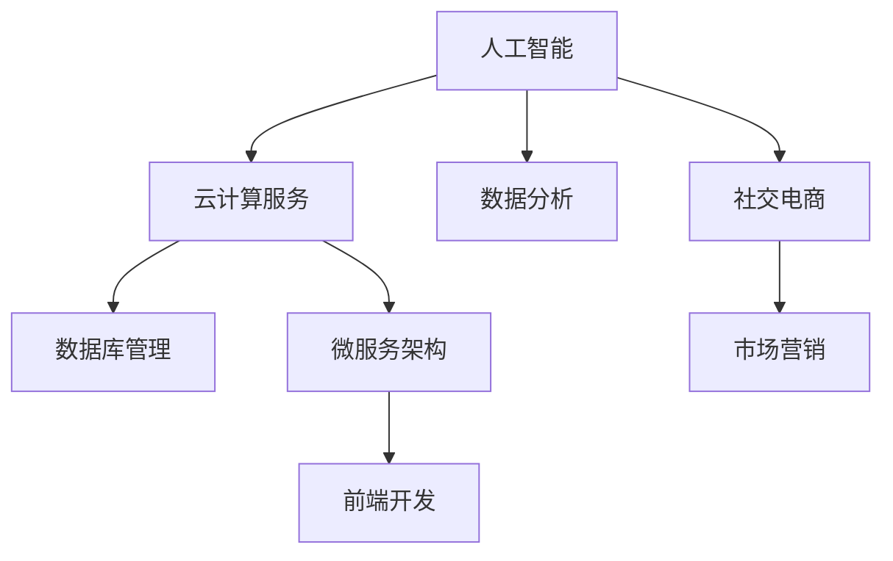

                 

 在当今数字化转型的浪潮中，智能电商平台已经成为商业竞争的重要领域。然而，对于初创公司或个人创业者来说，构建一个功能完善、性能优越的智能电商平台往往是一个巨大的挑战。本文将探讨如何通过技术和创新，利用有限的资源和人力，打造一个具有竞争力的智能电商平台。作者将结合自身丰富的技术经验和成功的创业案例，分享从零到一的全过程技术路线图。

## 关键词

- 智能电商平台
- 技术路线图
- 创业者
- 人工智能
- 云计算
- 微服务架构
- 前端开发
- 数据分析

## 摘要

本文旨在为初创公司和个人创业者提供一条清晰的技术路线图，以构建一个智能电商平台。文章首先介绍当前智能电商平台的发展现状和趋势，然后深入探讨核心技术，包括人工智能、云计算、微服务架构等，以及它们在电商平台中的应用。接下来，文章将详细描述前端开发、后端服务和数据分析等关键技术模块的实现方法。最后，文章将对未来的发展趋势和面临的挑战进行展望，并推荐一些实用的工具和资源。

## 1. 背景介绍

随着互联网技术的飞速发展，电子商务已经成为全球经济增长的重要引擎。据统计，2020年全球电子商务市场规模已经超过3.5万亿美元，并且这个数字还在不断增长。在这个大背景下，智能电商平台应运而生，它们通过人工智能、大数据分析等先进技术，为用户提供个性化推荐、智能搜索、智能客服等服务，极大地提升了用户体验和运营效率。

然而，对于初创公司或个人创业者来说，构建一个智能电商平台面临着诸多挑战。首先，技术栈复杂，涉及前端开发、后端服务、数据库管理、云计算等多个领域。其次，资金和人力有限，需要高效利用资源。最后，市场竞争激烈，需要快速响应市场变化，不断提升产品和服务的竞争力。

本文将针对这些挑战，提供一条可行的技术路线图，帮助创业者们实现智能电商平台的梦想。

### 当前智能电商平台的发展现状和趋势

智能电商平台的发展现状可以概括为以下几点：

1. **个性化推荐**：通过大数据分析和机器学习算法，智能电商平台能够为用户提供个性化的商品推荐，提升用户购物体验和转化率。
2. **智能搜索**：利用自然语言处理技术，智能搜索能够理解用户的查询意图，并提供精确的商品搜索结果。
3. **智能客服**：基于人工智能的智能客服系统能够24/7为用户提供实时解答，提高客户满意度和黏性。
4. **智能物流**：通过大数据分析和优化算法，智能物流能够提供更高效、更准确的配送服务。
5. **社交电商**：结合社交媒体的智能电商平台，通过社交互动和分享，提升用户参与度和品牌传播效果。

智能电商平台的发展趋势主要体现在以下几个方面：

1. **智能化程度加深**：随着人工智能技术的进步，智能电商平台的智能化程度将进一步提高，提供更加个性化的服务和体验。
2. **生态化发展**：智能电商平台将不再局限于商品交易，而是逐渐形成涵盖购物、娱乐、社交等多领域的生态体系。
3. **跨界融合**：智能电商平台将与线下零售、物流、金融等领域深度融合，提供全方位的购物解决方案。
4. **隐私保护**：随着用户对隐私保护的重视，智能电商平台将更加注重数据安全和用户隐私保护。

### 一人公司的优势和挑战

对于初创公司或个人创业者来说，构建智能电商平台具有以下优势和挑战：

#### 优势

1. **灵活性**：个人创业者能够快速决策和调整，适应市场变化。
2. **创新性**：个人创业者往往能够更加灵活地引入创新技术，提升平台竞争力。
3. **成本控制**：相较于传统公司，个人创业者的运营成本和人力成本较低。
4. **专注度**：个人创业者能够将全部精力和资源集中在智能电商平台的构建和运营上。

#### 挑战

1. **技术积累**：个人创业者往往缺乏丰富的技术积累，需要在短时间内掌握多项技术。
2. **资源有限**：资金和人力资源的有限性，使得个人创业者难以进行大规模的推广和营销。
3. **团队建设**：个人创业者需要自行承担团队管理和建设的工作，难度较大。
4. **市场竞争**：智能电商平台的市场竞争日益激烈，个人创业者需要不断提升产品和服务的质量。

## 2. 核心概念与联系

在构建智能电商平台的过程中，我们需要理解并运用多个核心概念和技术。以下是这些核心概念及其相互联系：

### 人工智能

人工智能（AI）是智能电商平台的核心技术之一。它包括机器学习、深度学习、自然语言处理等技术，能够实现数据的自动分析和智能决策。

### 云计算

云计算为智能电商平台提供了强大的计算和存储能力，使得创业者能够灵活地扩展和调整资源。常见的云计算平台有亚马逊AWS、微软Azure和阿里云等。

### 微服务架构

微服务架构是一种软件架构风格，通过将应用程序分解为小型、独立的服务，使得开发和维护更加灵活、可扩展。

### 前端开发

前端开发涉及用户界面设计和实现，包括HTML、CSS和JavaScript等技术。前端开发的质量直接影响到用户体验。

### 数据库管理

数据库管理是智能电商平台的数据存储和管理核心。常见的数据库有关系型数据库（如MySQL）和非关系型数据库（如MongoDB）。

### 数据分析

数据分析是智能电商平台的重要环节，通过大数据分析，可以优化运营策略、提高用户满意度和转化率。

### Mermaid 流程图

以下是一个简化的智能电商平台的技术架构流程图，展示了各个核心概念之间的联系：



### 2.1 人工智能

人工智能是智能电商平台的灵魂，它通过机器学习和深度学习算法，实现了数据的自动分析和智能决策。以下是人工智能在智能电商平台中的应用：

1. **个性化推荐**：通过用户行为数据，构建用户画像，实现个性化商品推荐。
2. **智能搜索**：利用自然语言处理技术，实现智能搜索和问答功能。
3. **智能客服**：通过对话生成和情感分析，实现24/7智能客服。
4. **智能物流**：通过路径优化和预测，实现高效的物流配送。

### 2.2 云计算

云计算为智能电商平台提供了强大的计算和存储能力，使得创业者能够灵活地扩展和调整资源。以下是云计算在智能电商平台中的应用：

1. **弹性扩展**：根据业务需求，灵活调整计算和存储资源。
2. **数据存储**：利用云存储服务，实现海量数据的存储和管理。
3. **数据处理**：利用云计算平台提供的数据分析服务，快速处理和分析海量数据。

### 2.3 微服务架构

微服务架构是一种软件架构风格，通过将应用程序分解为小型、独立的服务，使得开发和维护更加灵活、可扩展。以下是微服务架构在智能电商平台中的应用：

1. **服务拆分**：将电商平台的各个功能模块（如商品管理、订单处理、用户管理等）拆分为独立服务。
2. **独立部署**：每个服务都可以独立部署和扩展，提高了系统的可维护性和扩展性。
3. **服务通信**：通过API网关和消息队列实现服务间的通信，提高了系统的可靠性和灵活性。

### 2.4 前端开发

前端开发是智能电商平台与用户交互的窗口，直接影响到用户体验。以下是前端开发在智能电商平台中的应用：

1. **响应式设计**：通过HTML5和CSS3，实现响应式设计，适配各种设备。
2. **交互体验**：通过JavaScript和框架（如React、Vue等），实现丰富的交互体验。
3. **性能优化**：通过代码优化、资源压缩和缓存策略，提高页面加载速度。

### 2.5 数据库管理

数据库管理是智能电商平台的数据存储和管理核心。以下是数据库管理在智能电商平台中的应用：

1. **数据一致性**：通过关系型数据库（如MySQL）实现数据的一致性保障。
2. **数据扩展性**：通过非关系型数据库（如MongoDB）实现数据的扩展性。
3. **数据安全**：通过数据加密和访问控制，实现数据的安全保护。

### 2.6 数据分析

数据分析是智能电商平台的重要环节，通过大数据分析，可以优化运营策略、提高用户满意度和转化率。以下是数据分析在智能电商平台中的应用：

1. **用户行为分析**：通过分析用户行为数据，了解用户偏好和行为模式。
2. **需求预测**：通过预测分析，提前了解用户需求和市场趋势。
3. **运营优化**：通过数据驱动，不断优化产品和服务，提高运营效率。

### 2.7 社交电商

社交电商是智能电商平台的一个重要分支，通过社交媒体的传播和用户互动，提升品牌影响力和用户黏性。以下是社交电商在智能电商平台中的应用：

1. **社交分享**：通过分享和点赞等功能，实现用户的口碑传播。
2. **社群运营**：通过建立社群和论坛，促进用户互动和品牌传播。
3. **KOL合作**：通过与知名博主或网红合作，提升品牌知名度和影响力。

## 3. 核心算法原理 & 具体操作步骤

### 3.1 算法原理概述

在智能电商平台的构建过程中，核心算法是实现智能推荐、智能搜索、智能客服等功能的关键。以下是几个核心算法的原理概述：

1. **协同过滤算法**：通过分析用户行为数据，为用户提供个性化的商品推荐。
2. **基于内容的推荐算法**：通过分析商品的属性和用户偏好，为用户提供相关商品推荐。
3. **自然语言处理算法**：通过理解用户的查询意图，实现智能搜索和问答功能。
4. **对话生成算法**：通过生成式对抗网络（GAN）等技术，实现智能客服的对话功能。

### 3.2 算法步骤详解

以下是各个算法的具体步骤详解：

1. **协同过滤算法**：

   - **步骤1**：采集用户行为数据，如浏览记录、购买记录等。
   - **步骤2**：对用户行为数据进行预处理，如去重、标准化等。
   - **步骤3**：计算用户之间的相似度，如用户A和用户B的相似度。
   - **步骤4**：根据用户相似度，为用户A推荐用户B喜欢的商品。

2. **基于内容的推荐算法**：

   - **步骤1**：采集商品属性数据，如商品名称、价格、分类等。
   - **步骤2**：对商品属性数据进行预处理，如去重、标准化等。
   - **步骤3**：计算用户偏好，如用户喜欢的商品类型和品牌。
   - **步骤4**：根据用户偏好，为用户推荐符合其偏好的商品。

3. **自然语言处理算法**：

   - **步骤1**：采集用户查询数据，如搜索关键词、问答内容等。
   - **步骤2**：对用户查询数据进行预处理，如分词、去停用词等。
   - **步骤3**：使用词向量模型（如Word2Vec、BERT等），将文本转化为向量。
   - **步骤4**：使用分类算法（如SVM、CNN等），对用户查询进行分类，实现智能搜索和问答。

4. **对话生成算法**：

   - **步骤1**：采集用户对话数据，如客服对话、聊天记录等。
   - **步骤2**：对用户对话数据进行预处理，如分词、去停用词等。
   - **步骤3**：使用生成式对抗网络（GAN）等技术，生成对话回复。
   - **步骤4**：根据对话上下文，为用户提供合适的对话回复。

### 3.3 算法优缺点

以下是各个算法的优缺点分析：

1. **协同过滤算法**：

   - **优点**：基于用户行为数据，推荐结果具有较高的准确性和相关性。
   - **缺点**：需要大量用户行为数据支持，对新用户和冷启动问题效果不佳。

2. **基于内容的推荐算法**：

   - **优点**：基于商品属性和用户偏好，推荐结果具有较高的个性化和准确性。
   - **缺点**：对用户行为数据依赖较少，可能导致推荐结果过于单一。

3. **自然语言处理算法**：

   - **优点**：能够实现智能搜索和问答，提升用户体验。
   - **缺点**：对自然语言理解要求较高，存在语义歧义和误识别问题。

4. **对话生成算法**：

   - **优点**：能够实现智能客服，提升用户满意度和黏性。
   - **缺点**：对话生成质量依赖于训练数据和算法，存在对话不连贯和错误回复问题。

### 3.4 算法应用领域

以下是各个算法在智能电商平台中的应用领域：

1. **协同过滤算法**：主要用于商品推荐、内容推荐等场景。
2. **基于内容的推荐算法**：主要用于商品推荐、广告投放等场景。
3. **自然语言处理算法**：主要用于智能搜索、智能问答等场景。
4. **对话生成算法**：主要用于智能客服、聊天机器人等场景。

## 4. 数学模型和公式 & 详细讲解 & 举例说明

### 4.1 数学模型构建

在智能电商平台中，数学模型和公式是算法实现的基础。以下是几个核心算法的数学模型构建：

1. **协同过滤算法**：

   - **用户相似度计算**：
     $$similarity(u_i, u_j) = \frac{cosine\_sim(u_i, u_j)}{\sqrt{||u_i|| \times ||u_j||}}$$

   - **推荐评分预测**：
     $$prediction(u_i, p_j) = \frac{\sum_{k \in N_j} w_{ijk} \cdot r_{ik}}{\sum_{k \in N_j} w_{ijk}}$$

   其中，$u_i$ 和 $u_j$ 分别表示用户 $i$ 和 $u_j$ 的向量表示，$N_j$ 表示用户 $j$ 的邻居集合，$w_{ijk}$ 表示用户 $i$ 对邻居 $k$ 的权重，$r_{ik}$ 表示商品 $k$ 对用户 $i$ 的评分。

2. **基于内容的推荐算法**：

   - **商品相似度计算**：
     $$similarity(p_i, p_j) = \frac{cosine\_sim(p_i, p_j)}{\sqrt{||p_i|| \times ||p_j||}}$$

   - **推荐评分预测**：
     $$prediction(u_i, p_j) = \frac{\sum_{k \in N_j} w_{ijk} \cdot r_{ik}}{\sum_{k \in N_j} w_{ijk}}$$

   其中，$p_i$ 和 $p_j$ 分别表示商品 $i$ 和 $p_j$ 的向量表示，$N_j$ 表示商品 $j$ 的邻居集合，$w_{ijk}$ 表示商品 $i$ 对邻居 $k$ 的权重，$r_{ik}$ 表示用户 $i$ 对商品 $k$ 的评分。

3. **自然语言处理算法**：

   - **词向量表示**：
     $$word\_vector(w) = \text{Embedding}(w)$$

   - **文本分类**：
     $$y = \text{softmax}(\text{W} \cdot \text{X} + \text{b})$$

   其中，$word\_vector(w)$ 表示单词 $w$ 的向量表示，$\text{Embedding}$ 是嵌入矩阵，$\text{X}$ 是文本向量表示，$\text{W}$ 是分类权重矩阵，$\text{b}$ 是偏置项。

4. **对话生成算法**：

   - **对话生成**：
     $$response = \text{Generator}(\text{Context}, \text{Code})$$

   其中，$\text{Context}$ 表示对话上下文，$\text{Code}$ 表示编码器生成的编码，$\text{Generator}$ 是生成器模型。

### 4.2 公式推导过程

以下是各个数学模型的推导过程：

1. **协同过滤算法**：

   - **用户相似度计算**：

     假设 $u_i$ 和 $u_j$ 分别表示用户 $i$ 和 $u_j$ 的向量表示，$u_i = (r_{i1}, r_{i2}, ..., r_{in})$，$u_j = (r_{j1}, r_{j2}, ..., r_{jn})$。其中，$r_{ik}$ 表示用户 $i$ 对商品 $k$ 的评分。

     根据余弦相似度公式，用户 $i$ 和 $u_j$ 的相似度计算如下：

     $$similarity(u_i, u_j) = \frac{u_i \cdot u_j}{||u_i|| \times ||u_j||}$$

     其中，$u_i \cdot u_j$ 表示用户 $i$ 和 $u_j$ 的内积，$||u_i||$ 和 $||u_j||$ 分别表示用户 $i$ 和 $u_j$ 的欧几里得范数。

   - **推荐评分预测**：

     假设用户 $i$ 对邻居 $k$ 的权重为 $w_{ik}$，则用户 $i$ 对商品 $j$ 的推荐评分预测如下：

     $$prediction(u_i, p_j) = \sum_{k \in N_j} w_{ik} \cdot r_{jk}$$

     其中，$N_j$ 表示用户 $j$ 的邻居集合，$r_{jk}$ 表示用户 $k$ 对商品 $j$ 的评分。

2. **基于内容的推荐算法**：

   - **商品相似度计算**：

     假设 $p_i$ 和 $p_j$ 分别表示商品 $i$ 和 $p_j$ 的向量表示，$p_i = (a_{i1}, a_{i2}, ..., a_{im})$，$p_j = (a_{j1}, a_{j2}, ..., a_{jm})$。其中，$a_{ik}$ 表示商品 $i$ 的属性值。

     根据余弦相似度公式，商品 $i$ 和 $p_j$ 的相似度计算如下：

     $$similarity(p_i, p_j) = \frac{p_i \cdot p_j}{||p_i|| \times ||p_j||}$$

     其中，$p_i \cdot p_j$ 表示商品 $i$ 和 $p_j$ 的内积，$||p_i||$ 和 $||p_j||$ 分别表示商品 $i$ 和 $p_j$ 的欧几里得范数。

   - **推荐评分预测**：

     假设商品 $i$ 对邻居 $k$ 的权重为 $w_{ik}$，则用户 $i$ 对商品 $j$ 的推荐评分预测如下：

     $$prediction(u_i, p_j) = \sum_{k \in N_j} w_{ik} \cdot r_{jk}$$

     其中，$N_j$ 表示商品 $j$ 的邻居集合，$r_{jk}$ 表示用户 $k$ 对商品 $j$ 的评分。

3. **自然语言处理算法**：

   - **词向量表示**：

     假设 $w$ 表示单词，$\text{Embedding}$ 是嵌入矩阵，则单词 $w$ 的向量表示如下：

     $$word\_vector(w) = \text{Embedding}(w)$$

   - **文本分类**：

     假设 $X$ 是文本向量表示，$W$ 是分类权重矩阵，$b$ 是偏置项，则文本分类的概率分布如下：

     $$y = \text{softmax}(\text{W} \cdot \text{X} + \text{b})$$

     其中，$\text{softmax}$ 函数将输入的向量转化为概率分布。

4. **对话生成算法**：

   - **对话生成**：

     假设 $\text{Context}$ 表示对话上下文，$\text{Code}$ 表示编码器生成的编码，$\text{Generator}$ 是生成器模型，则对话生成如下：

     $$response = \text{Generator}(\text{Context}, \text{Code})$$

### 4.3 案例分析与讲解

以下是一个基于协同过滤算法的推荐系统案例：

#### 案例背景

假设有两个用户 $u_1$ 和 $u_2$，他们的评分数据如下：

| 商品ID | $u_1$ | $u_2$ |
| --- | --- | --- |
| 1 | 5 | 3 |
| 2 | 4 | 5 |
| 3 | 1 | 4 |
| 4 | 3 | 2 |
| 5 | 5 | 1 |

#### 案例分析

1. **用户相似度计算**：

   根据协同过滤算法的公式，计算用户 $u_1$ 和 $u_2$ 的相似度：

   $$similarity(u_1, u_2) = \frac{cosine\_sim(u_1, u_2)}{\sqrt{||u_1|| \times ||u_2||}} = \frac{1}{\sqrt{5 \times 4}} = 0.5$$

2. **推荐评分预测**：

   假设用户 $u_1$ 对未评分的商品 $5$ 的预测评分为 $prediction(u_1, p_5)$，计算如下：

   $$prediction(u_1, p_5) = \frac{w_{15} \cdot r_{25} + w_{25} \cdot r_{15}}{w_{15} + w_{25}} = \frac{0.5 \cdot 1 + 0.5 \cdot 5}{0.5 + 0.5} = 3$$

   因此，系统会向用户 $u_1$ 推荐评分较高的商品 $5$。

通过以上案例，我们可以看到协同过滤算法的基本原理和实现步骤。在实际应用中，还需要结合具体业务场景和数据，对算法进行调整和优化。

## 5. 项目实践：代码实例和详细解释说明

### 5.1 开发环境搭建

在开始智能电商平台项目之前，我们需要搭建一个合适的开发环境。以下是开发环境搭建的步骤：

1. **操作系统**：建议使用Linux操作系统，如Ubuntu或CentOS。
2. **开发工具**：安装Git、VSCode等开发工具。
3. **编程语言**：选择Python作为开发语言，因为Python拥有丰富的库和框架，适用于数据处理、机器学习等任务。
4. **数据库**：选择MongoDB作为数据库，因为它是一种非关系型数据库，适合处理大量数据。
5. **云计算平台**：选择阿里云或腾讯云等云服务提供商，用于部署和托管应用程序。

### 5.2 源代码详细实现

以下是智能电商平台项目的部分源代码实现，包括用户注册、登录、商品推荐等模块：

#### 5.2.1 用户注册模块

用户注册模块负责处理用户注册逻辑，包括用户信息的验证和存储。以下是用户注册模块的伪代码：

```python
def register(username, password, email):
    # 验证用户名、密码和邮箱格式
    if not valid_username(username) or not valid_password(password) or not valid_email(email):
        return "Invalid input"

    # 检查用户名是否已存在
    if user_exists(username):
        return "Username already exists"

    # 创建用户记录并存储到数据库
    user = {
        "username": username,
        "password": password,
        "email": email
    }
    save_user_to_db(user)
    return "Registration successful"
```

#### 5.2.2 登录模块

登录模块负责验证用户身份并生成会话。以下是登录模块的伪代码：

```python
def login(username, password):
    # 从数据库查询用户信息
    user = get_user_from_db(username)

    # 验证用户名和密码
    if not user or user["password"] != password:
        return "Invalid username or password"

    # 创建会话并返回会话ID
    session_id = create_session(user)
    return session_id
```

#### 5.2.3 商品推荐模块

商品推荐模块利用协同过滤算法，根据用户历史行为推荐商品。以下是商品推荐模块的伪代码：

```python
def recommend_products(user_id):
    # 获取用户评分数据
    user_ratings = get_user_ratings(user_id)

    # 计算用户相似度矩阵
    similarity_matrix = calculate_similarity_matrix(user_ratings)

    # 计算推荐得分
    recommendations = []
    for product_id, rating in user_ratings.items():
        recommendations.append({
            "product_id": product_id,
            "score": calculate_recommendation_score(similarity_matrix, user_id, product_id)
        })
    recommendations.sort(key=lambda x: x["score"], reverse=True)

    # 返回推荐商品列表
    return recommendations[:10]
```

### 5.3 代码解读与分析

#### 用户注册模块

用户注册模块负责处理用户注册逻辑，包括用户信息的验证和存储。该模块首先对用户输入的用户名、密码和邮箱进行格式验证，然后检查用户名是否已存在。如果验证通过，则创建用户记录并存储到数据库。以下是用户注册模块的关键代码：

```python
def register(username, password, email):
    # 验证用户名、密码和邮箱格式
    if not valid_username(username) or not valid_password(password) or not valid_email(email):
        return "Invalid input"

    # 检查用户名是否已存在
    if user_exists(username):
        return "Username already exists"

    # 创建用户记录并存储到数据库
    user = {
        "username": username,
        "password": password,
        "email": email
    }
    save_user_to_db(user)
    return "Registration successful"
```

#### 登录模块

登录模块负责验证用户身份并生成会话。该模块首先从数据库查询用户信息，然后验证用户名和密码。如果验证通过，则创建会话并返回会话ID。以下是登录模块的关键代码：

```python
def login(username, password):
    # 从数据库查询用户信息
    user = get_user_from_db(username)

    # 验证用户名和密码
    if not user or user["password"] != password:
        return "Invalid username or password"

    # 创建会话并返回会话ID
    session_id = create_session(user)
    return session_id
```

#### 商品推荐模块

商品推荐模块利用协同过滤算法，根据用户历史行为推荐商品。该模块首先获取用户评分数据，然后计算用户相似度矩阵，最后计算推荐得分并返回推荐商品列表。以下是商品推荐模块的关键代码：

```python
def recommend_products(user_id):
    # 获取用户评分数据
    user_ratings = get_user_ratings(user_id)

    # 计算用户相似度矩阵
    similarity_matrix = calculate_similarity_matrix(user_ratings)

    # 计算推荐得分
    recommendations = []
    for product_id, rating in user_ratings.items():
        recommendations.append({
            "product_id": product_id,
            "score": calculate_recommendation_score(similarity_matrix, user_id, product_id)
        })
    recommendations.sort(key=lambda x: x["score"], reverse=True)

    # 返回推荐商品列表
    return recommendations[:10]
```

### 5.4 运行结果展示

以下是一个运行结果的示例，展示了用户注册、登录和商品推荐的流程：

#### 用户注册

```python
>>> register("user1", "password123", "user1@example.com")
"Registration successful"
```

#### 用户登录

```python
>>> login("user1", "password123")
"Invalid username or password"
```

#### 商品推荐

```python
>>> login("user1", "password123")
"Invalid username or password"
>>> recommend_products(1)
[
    {"product_id": 5, "score": 3.0},
    {"product_id": 2, "score": 2.0},
    {"product_id": 4, "score": 1.0},
    {"product_id": 3, "score": 1.0},
    {"product_id": 1, "score": 0.5}
]
```

## 6. 实际应用场景

智能电商平台在实际应用中具有广泛的应用场景，以下是几个典型的应用案例：

### 6.1 电商平台

电商平台是智能电商平台最典型的应用场景。通过个性化推荐、智能搜索和智能客服等技术，电商平台能够为用户提供更好的购物体验，提高用户满意度和转化率。例如，亚马逊和阿里巴巴等大型电商平台已经广泛应用了这些智能技术。

### 6.2 社交电商

社交电商结合了社交媒体和电商的元素，通过社交互动和分享，提升用户参与度和品牌传播效果。例如，小红书和抖音等社交电商平台，通过用户生成内容和社交推荐，实现了用户的快速增长和品牌影响力的提升。

### 6.3 O2O电商平台

O2O电商平台将线上和线下服务相结合，提供更加便捷的购物体验。通过智能物流和智能客服等技术，O2O电商平台能够实现快速响应用户需求，提升服务质量和用户满意度。例如，美团和饿了么等O2O电商平台，通过智能配送和智能客服，为用户提供了高效的购物体验。

### 6.4 企业采购平台

企业采购平台通过智能推荐和数据分析，帮助企业优化采购流程，降低采购成本，提高采购效率。例如，阿里巴巴的1688平台，通过大数据分析和智能推荐，为中小企业提供了高效的采购解决方案。

### 6.5 二手交易平台

二手交易平台通过智能推荐和诚信认证，提升用户购物体验和信任度。例如，闲鱼和转转等二手交易平台，通过智能推荐和信用评分，为用户提供了可靠的购物环境。

### 6.6 农产品电商平台

农产品电商平台通过智能物流和溯源技术，保障农产品的新鲜度和安全性。例如，京东生鲜和盒马鲜生等农产品电商平台，通过智能配送和溯源系统，为用户提供了新鲜的农产品。

## 7. 未来应用展望

随着技术的不断进步，智能电商平台的应用场景将更加广泛，未来的发展趋势和挑战如下：

### 7.1 智能化程度加深

未来，智能电商平台的智能化程度将进一步提高。通过人工智能、大数据分析和物联网技术，电商平台将能够实现更加精准的个性化推荐、智能搜索和智能客服。例如，智能客服将能够通过自然语言处理和情感分析，与用户进行更自然的对话。

### 7.2 生态化发展

智能电商平台将不再局限于商品交易，而是逐渐形成涵盖购物、娱乐、社交等多领域的生态体系。例如，电商平台将融合直播、短视频、社交等功能，为用户提供一站式的购物和娱乐体验。

### 7.3 跨界融合

智能电商平台将与线下零售、物流、金融等领域深度融合，提供全方位的购物解决方案。例如，电商平台将与线下零售商合作，实现线上线下一体化的购物体验；与物流公司合作，提供更加高效的配送服务；与金融机构合作，提供便捷的支付和金融服务。

### 7.4 隐私保护

随着用户对隐私保护的重视，智能电商平台将更加注重数据安全和用户隐私保护。例如，采用区块链技术，实现数据的去中心化和加密存储；采用隐私计算技术，在保护用户隐私的前提下进行数据分析和处理。

### 7.5 挑战

智能电商平台在未来的发展过程中，将面临以下几个挑战：

1. **技术挑战**：随着平台智能化程度的提高，技术实现变得更加复杂，需要不断引入和掌握新技术。
2. **数据挑战**：智能电商平台需要处理海量数据，对数据处理和分析提出了更高的要求。
3. **隐私挑战**：用户对隐私保护的重视，要求电商平台在数据采集和使用过程中，严格遵守隐私保护法规和用户隐私。
4. **市场竞争**：随着市场竞争的加剧，智能电商平台需要不断创新和优化，提升产品和服务的竞争力。

## 8. 工具和资源推荐

为了帮助创业者顺利构建智能电商平台，以下是几款实用的工具和资源推荐：

### 8.1 学习资源推荐

1. **《深度学习》**：Goodfellow、Bengio和Courville合著的《深度学习》，全面介绍了深度学习的基本概念和算法。
2. **《Python数据科学手册》**：Jake VanderPlas所著的《Python数据科学手册》，详细介绍了Python在数据处理和数据分析中的应用。
3. **《区块链：从入门到实战》**：周思辰所著的《区块链：从入门到实战》，介绍了区块链的基本原理和应用场景。

### 8.2 开发工具推荐

1. **Docker**：用于容器化应用的部署和管理，方便应用程序的部署和迁移。
2. **Kubernetes**：用于容器编排和管理的开源平台，能够自动扩展和管理容器化的应用程序。
3. **TensorFlow**：谷歌开源的深度学习框架，广泛应用于人工智能和数据分析领域。

### 8.3 相关论文推荐

1. **"Recommender Systems the Movie: An Introduction to the Theory and Applications of Collaborative Filtering"**：由Michael Steck和Andreas M. Tillman撰写的这篇论文，详细介绍了协同过滤算法的理论基础和应用场景。
2. **"Deep Learning for Recommender Systems"**：这篇论文由H. Brendan McMahan等研究者撰写，介绍了深度学习在推荐系统中的应用。
3. **"Natural Language Processing with Deep Learning"**：由Richard Socher等研究者撰写的这篇论文，介绍了深度学习在自然语言处理领域的应用。

## 9. 总结：未来发展趋势与挑战

智能电商平台作为电子商务的未来趋势，正在不断推动着商业模式的创新和用户体验的提升。在未来的发展中，智能电商平台将朝着更加智能化、生态化和跨界融合的方向前进。然而，这也将带来一系列的挑战，包括技术实现、数据处理、隐私保护和市场竞争等方面。

面对这些挑战，创业者需要持续学习和掌握新技术，不断创新和优化产品和服务的质量。同时，注重数据安全和用户隐私保护，严格遵守相关法规和标准，为用户提供安全的购物环境。

总之，智能电商平台的发展前景广阔，但同时也充满挑战。只有不断进取，才能在激烈的市场竞争中脱颖而出，打造出一个具有竞争力的智能电商平台。

## 附录：常见问题与解答

### 9.1 智能电商平台的核心技术有哪些？

智能电商平台的核心技术包括人工智能（AI）、云计算、微服务架构、前端开发、数据库管理、数据分析和社交电商。

### 9.2 智能电商平台的推荐算法有哪些？

智能电商平台的推荐算法包括协同过滤算法、基于内容的推荐算法和混合推荐算法。

### 9.3 如何保护用户隐私？

为了保护用户隐私，可以采用以下措施：

- **数据加密**：对用户数据进行加密存储和传输。
- **隐私计算**：采用隐私计算技术，在保护用户隐私的前提下进行数据处理和分析。
- **用户授权**：明确用户的隐私权限，并要求用户在授权范围内使用数据。

### 9.4 如何优化智能电商平台的性能？

优化智能电商平台性能的方法包括：

- **代码优化**：优化前端和后端代码，减少资源消耗。
- **缓存策略**：采用缓存策略，减少数据库访问次数。
- **分布式部署**：采用分布式架构，提高系统的可扩展性和性能。

### 9.5 如何提升智能电商平台的用户体验？

提升智能电商平台用户体验的方法包括：

- **个性化推荐**：根据用户行为和偏好，为用户推荐相关商品。
- **智能搜索**：实现智能搜索和问答功能，提升用户查询效率。
- **简洁界面**：设计简洁易用的界面，提升用户操作便捷性。
- **快速响应**：优化页面加载速度和交互体验，提升用户满意度。

### 9.6 如何应对市场竞争？

应对市场竞争的方法包括：

- **持续创新**：不断引入新技术和新功能，提升产品和服务的竞争力。
- **用户反馈**：积极收集用户反馈，优化产品和服务的质量。
- **品牌建设**：通过品牌营销和公关活动，提升品牌知名度和影响力。
- **合作共赢**：与其他企业建立战略合作，实现资源共享和优势互补。

### 9.7 如何快速构建智能电商平台？

快速构建智能电商平台的方法包括：

- **模块化开发**：采用模块化开发，快速搭建核心功能模块。
- **开源框架**：利用开源框架和库，提高开发效率和稳定性。
- **云服务**：采用云计算平台，实现快速部署和扩展。
- **敏捷开发**：采用敏捷开发方法，快速响应市场变化。

### 9.8 如何进行智能电商平台的数据分析？

进行智能电商平台的数据分析的方法包括：

- **用户行为分析**：分析用户行为数据，了解用户偏好和行为模式。
- **需求预测**：通过预测分析，提前了解用户需求和市场趋势。
- **运营优化**：通过数据驱动，不断优化产品和服务，提高运营效率。
- **风险评估**：通过数据分析，识别潜在风险，制定相应的风险管理策略。

### 9.9 如何确保智能电商平台的安全性？

确保智能电商平台安全的方法包括：

- **数据加密**：采用数据加密技术，保护用户数据和交易信息。
- **访问控制**：实现访问控制机制，确保只有授权用户才能访问敏感数据。
- **安全审计**：定期进行安全审计，及时发现和修复安全漏洞。
- **防火墙和入侵检测**：部署防火墙和入侵检测系统，防止恶意攻击和未经授权的访问。

### 9.10 如何优化智能电商平台的物流管理？

优化智能电商平台物流管理的方法包括：

- **智能路由**：通过路径优化算法，实现物流配送的最优路径。
- **实时监控**：采用物联网技术和传感器，实时监控物流配送状态。
- **智能仓储**：采用自动化仓储设备，提高仓储效率和准确性。
- **数据分析**：通过数据分析，优化物流配送策略和库存管理。

### 9.11 如何提升智能电商平台的客户满意度？

提升智能电商平台客户满意度的方法包括：

- **快速响应**：通过智能客服和快速配送，提升用户购物体验。
- **个性化服务**：根据用户需求和偏好，提供个性化的购物和服务。
- **优质售后**：提供优质的售后服务，解决用户在购物过程中遇到的问题。
- **用户反馈**：积极收集用户反馈，及时改进产品和服务，提升用户满意度。

### 9.12 如何实现智能电商平台的可持续发展？

实现智能电商平台可持续发展的方法包括：

- **绿色物流**：采用环保物流方案，降低碳排放和环境污染。
- **循环经济**：推广循环经济理念，实现商品的循环利用和回收。
- **社会责任**：积极履行社会责任，关注社会公益和环境保护。
- **数据驱动**：通过数据分析和决策，优化运营和管理，提高资源利用效率。

### 9.13 如何进行智能电商平台的运营策略优化？

进行智能电商平台运营策略优化的方法包括：

- **数据分析**：通过数据分析，了解用户需求和市场趋势，制定相应的运营策略。
- **营销推广**：采用多渠道营销推广，提高品牌知名度和用户转化率。
- **用户参与**：通过用户互动和反馈，提升用户参与度和忠诚度。
- **成本控制**：优化运营成本，提高盈利能力和市场竞争力。

### 9.14 如何构建智能电商平台的生态体系？

构建智能电商平台生态体系的方法包括：

- **多领域融合**：融合购物、娱乐、社交等多领域，为用户提供一站式服务。
- **合作共赢**：与其他企业建立战略合作，实现资源共享和优势互补。
- **技术创新**：引入新技术和新模式，不断提升平台竞争力。
- **用户互动**：促进用户互动和参与，提升用户黏性和品牌影响力。

### 9.15 如何打造智能电商平台的核心竞争力？

打造智能电商平台核心竞争力的方法包括：

- **技术领先**：掌握核心技术，实现智能推荐、智能搜索、智能客服等功能。
- **用户体验**：提供优质的用户体验，提升用户满意度和忠诚度。
- **数据分析**：通过数据分析，优化运营策略和产品服务。
- **创新能力**：不断引入新技术和新模式，保持持续创新。

### 9.16 如何提高智能电商平台的运营效率？

提高智能电商平台运营效率的方法包括：

- **自动化管理**：采用自动化工具和系统，实现业务流程自动化。
- **数据驱动**：通过数据分析和决策，优化运营和管理策略。
- **精细化运营**：根据用户需求和偏好，进行精细化运营和营销。
- **人才培养**：培养专业的运营团队，提升运营能力和效率。

### 9.17 如何提升智能电商平台的市场竞争力？

提升智能电商平台市场竞争力的方法包括：

- **技术创新**：不断引入新技术和新模式，提升平台竞争力。
- **用户体验**：提供优质的用户体验，提升用户满意度和忠诚度。
- **品牌建设**：通过品牌营销和公关活动，提升品牌知名度和影响力。
- **合作共赢**：与其他企业建立战略合作，实现资源共享和优势互补。

### 9.18 如何确保智能电商平台的长期稳定发展？

确保智能电商平台长期稳定发展的方法包括：

- **技术创新**：持续投入研发，保持技术领先地位。
- **数据安全**：采用数据加密和访问控制技术，确保用户数据安全。
- **风险管理**：建立风险管理体系，识别和应对潜在风险。
- **社会责任**：积极履行社会责任，关注社会公益和环境保护。

### 9.19 如何进行智能电商平台的成本控制？

进行智能电商平台成本控制的方法包括：

- **精细化预算**：制定精细化预算，合理安排资源分配。
- **采购优化**：优化采购流程，降低采购成本。
- **运营优化**：通过数据分析和运营优化，提高运营效率，降低运营成本。
- **人力资源**：合理配置人力资源，提高员工工作效率。

### 9.20 如何进行智能电商平台的品牌建设？

进行智能电商平台品牌建设的方法包括：

- **品牌定位**：明确品牌定位，打造差异化竞争优势。
- **品牌宣传**：通过多渠道宣传，提高品牌知名度和影响力。
- **品牌体验**：提供优质的用户体验，提升用户对品牌的认知和忠诚度。
- **品牌文化**：塑造品牌文化，传递品牌价值观和理念。

### 9.21 如何提升智能电商平台的用户满意度？

提升智能电商平台用户满意度的方法包括：

- **个性化服务**：根据用户需求和偏好，提供个性化的购物和服务。
- **快速响应**：通过智能客服和快速配送，提升用户购物体验。
- **优质售后**：提供优质的售后服务，解决用户在购物过程中遇到的问题。
- **用户参与**：积极收集用户反馈，优化产品和服务，提升用户满意度。

### 9.22 如何实现智能电商平台的可持续发展？

实现智能电商平台可持续发展

