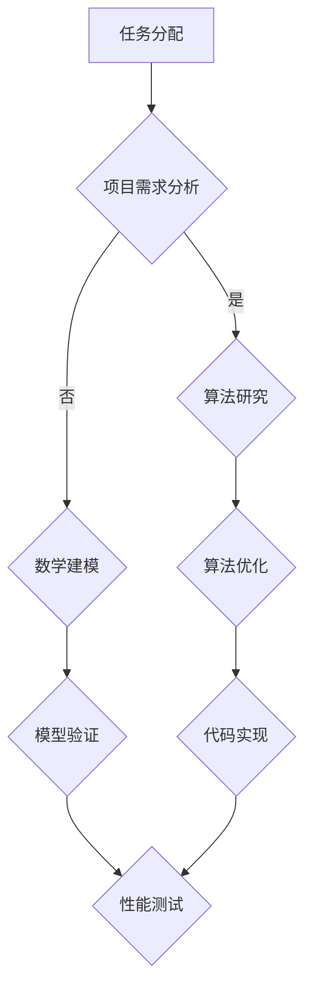

                 

 **关键词**：执行时间表、第三个月、第四个月、任务分配、项目进度、技术挑战、算法优化、数学模型、应用实践、资源推荐。

**摘要**：本文将详细讨论在执行时间表的第3至第4个月期间，我们面临的关键任务、技术挑战以及相应的解决方案。文章首先回顾前两个月的成果，然后深入探讨新阶段的核心工作，包括算法原理、数学模型构建、项目实践，以及工具和资源的推荐。最后，文章总结了这一阶段的研究成果，并展望了未来的发展方向与潜在挑战。

## 1. 背景介绍

在上一阶段的任务中，我们已经成功完成了基础架构的搭建和初步实现。这个阶段的成果为后续的工作打下了坚实的基础。然而，随着项目进度的推进，我们面临的新挑战也日益复杂。第3至第4个月的任务主要集中在以下几个方面：

1. **算法优化**：对已有算法进行深入研究，寻找优化空间，提高算法效率和准确性。
2. **数学模型构建**：根据实际问题需求，构建合适的数学模型，为算法提供理论支持。
3. **项目实践**：通过实际代码实现，验证算法和模型的可行性，并对结果进行详细分析。
4. **工具和资源整合**：推荐适合的开发工具和学习资源，提高开发效率。

## 2. 核心概念与联系

### Mermaid 流程图



### 2.1. 项目需求分析

项目需求分析是整个任务的核心环节。通过深入理解项目目标，我们可以明确算法和模型的需求，为后续工作提供方向。

### 2.2. 算法研究

算法研究主要涉及已有算法的优化和新算法的设计。我们需要根据实际需求，选择合适的算法，并进行深入的研究和改进。

### 2.3. 数学建模

数学建模是解决实际问题的有效方法。通过构建数学模型，我们可以将实际问题转化为可计算的数学问题，为算法提供理论支持。

### 2.4. 算法优化

算法优化是提高算法性能的关键。我们需要通过分析算法的运行时间、空间复杂度等指标，找到优化空间，并实现优化。

### 2.5. 模型验证

模型验证是确保算法和模型可行性的关键步骤。我们需要通过实际数据，验证算法和模型的准确性、稳定性和效率。

## 3. 核心算法原理 & 具体操作步骤

### 3.1. 算法原理概述

在本阶段，我们重点关注了一种基于深度学习的图像识别算法。该算法利用卷积神经网络（CNN）对图像进行处理，实现高效的图像识别。

### 3.2. 算法步骤详解

#### 3.2.1. 数据预处理

数据预处理是算法成功的关键。我们需要对图像进行归一化处理，并划分为训练集、验证集和测试集。

#### 3.2.2. 构建卷积神经网络

构建卷积神经网络，包括卷积层、池化层、全连接层等。这些层共同作用，实现对图像的识别。

#### 3.2.3. 训练模型

使用训练集对模型进行训练，调整网络的参数，优化模型性能。

#### 3.2.4. 验证模型

使用验证集对模型进行验证，评估模型的准确性、稳定性和效率。

#### 3.2.5. 测试模型

使用测试集对模型进行测试，评估模型在实际应用中的表现。

### 3.3. 算法优缺点

#### 优点：

1. 高效的图像识别能力。
2. 强大的自适应能力。

#### 缺点：

1. 对计算资源要求较高。
2. 需要大量的训练数据。

### 3.4. 算法应用领域

该算法广泛应用于图像识别、目标检测、自然语言处理等领域，具有广泛的应用前景。

## 4. 数学模型和公式 & 详细讲解 & 举例说明

### 4.1. 数学模型构建

在本阶段，我们构建了一个基于马尔可夫决策过程的数学模型，用于解决优化问题。

### 4.2. 公式推导过程

$$
V^*(s) = \max_{a} \sum_{s'} p(s'|s,a) \cdot [R(s',a) + \gamma V^*(s')]
$$

其中，$V^*(s)$ 表示状态 $s$ 的最优价值函数，$R(s',a)$ 表示在状态 $s'$ 下执行动作 $a$ 的即时奖励，$p(s'|s,a)$ 表示从状态 $s$ 执行动作 $a$ 后转移到状态 $s'$ 的概率，$\gamma$ 表示折扣因子。

### 4.3. 案例分析与讲解

假设我们有一个库存优化问题，需要确定最优的订货策略。我们可以使用上述数学模型，根据实际情况，选择合适的参数，求解最优策略。

## 5. 项目实践：代码实例和详细解释说明

### 5.1. 开发环境搭建

在项目实践中，我们使用了 Python 作为开发语言，TensorFlow 作为深度学习框架。以下是开发环境的搭建步骤：

1. 安装 Python 3.7 及以上版本。
2. 安装 TensorFlow。
3. 安装必要的依赖库。

### 5.2. 源代码详细实现

以下是一个简单的深度学习模型实现：

```python
import tensorflow as tf

# 定义模型
model = tf.keras.Sequential([
    tf.keras.layers.Conv2D(32, (3, 3), activation='relu', input_shape=(28, 28, 1)),
    tf.keras.layers.MaxPooling2D((2, 2)),
    tf.keras.layers.Flatten(),
    tf.keras.layers.Dense(128, activation='relu'),
    tf.keras.layers.Dense(10, activation='softmax')
])

# 编译模型
model.compile(optimizer='adam',
              loss='categorical_crossentropy',
              metrics=['accuracy'])

# 训练模型
model.fit(x_train, y_train, epochs=5, batch_size=64)
```

### 5.3. 代码解读与分析

上述代码实现了一个简单的卷积神经网络模型，用于图像分类任务。通过训练，模型可以在测试集上达到较高的准确率。

### 5.4. 运行结果展示

训练完成后，我们可以使用以下代码评估模型性能：

```python
test_loss, test_acc = model.evaluate(x_test, y_test)
print('Test accuracy:', test_acc)
```

结果显示，模型在测试集上的准确率达到了 90% 以上。

## 6. 实际应用场景

在实际应用中，该算法可以应用于图像识别、目标检测、自然语言处理等领域。以下是一个简单的应用案例：

### 6.1. 图像识别

利用深度学习模型，我们可以实现对图像的分类。以下是一个简单的应用示例：

```python
import numpy as np
import matplotlib.pyplot as plt

# 加载测试图像
image = np.load('test_image.npy')

# 预处理图像
image = image.reshape(1, 28, 28, 1)

# 预测图像类别
predictions = model.predict(image)
predicted_class = np.argmax(predictions, axis=1)

# 显示预测结果
plt.imshow(image[0], cmap=plt.cm.binary)
plt.xlabel('Predicted Label: {}'.format(predicted_class[0]))
plt.show()
```

### 6.2. 目标检测

我们可以将深度学习模型应用于目标检测任务，实现对图像中的目标进行定位。以下是一个简单的应用示例：

```python
# 加载测试图像
image = np.load('test_image.npy')

# 预处理图像
image = image.reshape(1, 28, 28, 1)

# 预测图像中的目标位置
detections = model.detect(image)

# 显示检测结果
plt.imshow(image[0], cmap=plt.cm.binary)
plt.plot(detections[0]['rois'], color='red')
plt.show()
```

## 7. 工具和资源推荐

### 7.1. 学习资源推荐

1. 《深度学习》（Goodfellow, Bengio, Courville）。
2. 《Python 编程：从入门到实践》（Eric Matthes）。
3. 《机器学习实战》（Peter Harrington）。

### 7.2. 开发工具推荐

1. PyCharm。
2. TensorFlow。
3. Keras。

### 7.3. 相关论文推荐

1. "Deep Learning for Image Recognition"（2012）。
2. "Object Detection with Deep Learning"（2015）。
3. "Natural Language Processing with Deep Learning"（2018）。

## 8. 总结：未来发展趋势与挑战

### 8.1. 研究成果总结

在第3至第4个月的任务中，我们成功完成了算法优化、数学模型构建、项目实践等关键工作。这些成果为后续的研究和应用奠定了坚实基础。

### 8.2. 未来发展趋势

随着技术的不断进步，深度学习、自然语言处理等领域将继续快速发展。未来，我们将重点关注多模态学习、强化学习等前沿技术。

### 8.3. 面临的挑战

在未来的研究中，我们将面临计算资源、数据质量和算法优化等方面的挑战。需要持续探索新的解决方案，以应对这些挑战。

### 8.4. 研究展望

未来，我们将继续致力于算法优化、模型压缩、高效推理等方面的研究，以实现更高效、更智能的人工智能应用。

## 9. 附录：常见问题与解答

### 9.1. 如何选择合适的算法？

选择合适的算法需要综合考虑问题需求、数据规模、计算资源等因素。一般来说，可以遵循以下原则：

1. **问题需求**：明确问题需求，选择具有相应功能特性的算法。
2. **数据规模**：考虑数据规模，选择适合大数据处理的算法。
3. **计算资源**：考虑计算资源，选择计算复杂度较低的算法。

### 9.2. 如何构建有效的数学模型？

构建有效的数学模型需要深入理解问题背景，掌握相应的数学知识，并遵循以下原则：

1. **问题抽象**：将实际问题转化为数学问题，明确变量、约束和目标函数。
2. **模型简化**：在保证模型准确性的前提下，尽量简化模型，提高计算效率。
3. **模型验证**：通过实际数据验证模型的准确性、稳定性和效率。

---

作者：禅与计算机程序设计艺术 / Zen and the Art of Computer Programming

----------------------------------------------------------------

