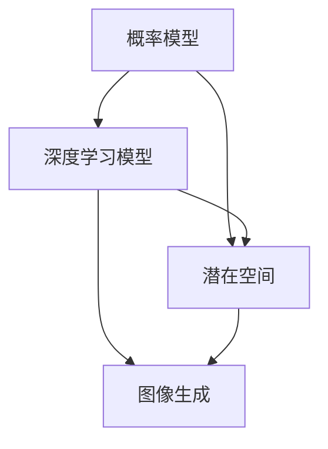

                 

关键词：扩散模型，图像生成，深度学习，概率模型，生成对抗网络（GAN），变分自编码器（VAE），潜在空间，算法原理，数学模型，项目实践，应用场景，未来展望

## 摘要

扩散模型（Diffusion Model）作为一种新兴的图像生成技术，近年来在人工智能领域引起了广泛关注。本文将从背景介绍、核心概念与联系、核心算法原理与具体操作步骤、数学模型与公式详细讲解、项目实践、实际应用场景、工具和资源推荐以及未来发展趋势与挑战等方面，深入解析扩散模型的基本原理和应用价值。通过本文的阅读，读者将了解到扩散模型是如何通过深度学习和概率模型实现高质量的图像生成，并在各个领域展现出巨大潜力。

## 1. 背景介绍

图像生成技术在人工智能领域有着广泛的应用，从早期的统计方法到基于规则的方法，再到近年来基于深度学习的生成模型，图像生成技术经历了巨大的变革。传统的图像生成方法通常依赖于大量的手工特征工程和复杂的规则设计，而深度学习模型的出现，尤其是生成对抗网络（GAN）和变分自编码器（VAE）的出现，极大地提高了图像生成的质量和效率。

然而，这些传统方法在处理复杂场景和高维度数据时仍存在一些局限性。例如，GAN存在训练不稳定、模式崩溃等问题，而VAE则在生成细节方面表现不如GAN。为了克服这些挑战，扩散模型应运而生。扩散模型结合了深度学习和概率模型的优势，通过在潜在空间中进行连续采样的方式，实现了高质量的图像生成。

扩散模型最早由Kevin Frans、Tim Salimans和Ilya Sutskever等人于2019年提出，并在图像合成、视频生成和3D场景生成等领域取得了显著的效果。与传统的生成模型相比，扩散模型具有更高的稳定性和生成质量，成为新一代图像生成技术的重要代表。

## 2. 核心概念与联系

### 2.1 概率模型

概率模型是扩散模型的基础，它描述了图像生成过程中的随机性和不确定性。在概率模型中，每个像素值被视为随机变量，其概率分布决定了图像的生成过程。

### 2.2 深度学习

深度学习是扩散模型实现图像生成的重要工具。通过训练大规模的神经网络模型，扩散模型能够学习到图像生成的高层次特征和模式，从而实现高质量的图像生成。

### 2.3 潜在空间

潜在空间是扩散模型的核心概念之一。通过将高维图像映射到一个低维潜在空间，扩散模型能够更有效地进行图像生成和编辑。

### 2.4 Mermaid 流程图



在上面的流程图中，概率模型和深度学习模型共同作用，将潜在空间中的随机变量映射到图像空间，从而实现图像生成。

## 3. 核心算法原理 & 具体操作步骤

### 3.1 算法原理概述

扩散模型通过在潜在空间中进行连续采样，逐步将图像从均匀分布扩散到目标分布，从而实现图像生成。具体来说，扩散模型包括两个核心过程：正向过程和反向过程。

### 3.2 算法步骤详解

1. **正向过程**：将图像从均匀分布逐步扩散到目标分布。在这个过程中，图像的像素值被逐渐增加噪声，使其从确定性分布变为不确定性分布。

2. **反向过程**：将图像从目标分布逐步恢复到均匀分布。在这个过程中，图像的像素值被逐渐减少噪声，使其从不确定性分布恢复到确定性分布。

3. **采样过程**：在潜在空间中，通过采样生成新的图像。采样过程是基于马尔可夫链蒙特卡洛（MCMC）方法，通过在潜在空间中进行多次采样，生成高质量的图像。

### 3.3 算法优缺点

**优点**：
1. 高质量生成：扩散模型能够生成高质量的图像，尤其是在细节方面表现优异。
2. 高稳定性：扩散模型在训练过程中具有较高的稳定性，避免了模式崩溃等问题。
3. 广泛应用：扩散模型可以应用于多种场景，包括图像合成、视频生成和3D场景生成等。

**缺点**：
1. 计算成本高：扩散模型需要大量的计算资源，特别是在生成高分辨率图像时。
2. 需要大量训练数据：扩散模型在训练过程中需要大量的数据，否则难以达到良好的生成效果。

### 3.4 算法应用领域

扩散模型可以应用于多种领域，包括但不限于：

1. 图像合成：用于生成高质量的艺术图像、动漫角色、自然景观等。
2. 视频生成：用于生成高质量的视频，包括电影特效、动画制作等。
3. 3D场景生成：用于生成高精度的3D场景，包括游戏开发、建筑设计等。
4. 数据增强：用于生成大量的训练数据，以提高模型的泛化能力。

## 4. 数学模型和公式 & 详细讲解 & 举例说明

### 4.1 数学模型构建

扩散模型的数学模型主要由两部分组成：正向过程和反向过程。

**正向过程**：
设 $X_t$ 表示在时间 $t$ 的图像，$p_X(x)$ 表示图像的边缘分布。正向过程的公式如下：

$$
X_t = (1 - \beta) X_{t-1} + \beta \cdot N(0, I)
$$

其中，$\beta$ 表示噪声比例，$N(0, I)$ 表示均值为0，协方差矩阵为单位矩阵的高斯分布。

**反向过程**：
设 $X_t$ 表示在时间 $t$ 的图像，$p_X(x)$ 表示图像的边缘分布。反向过程的公式如下：

$$
X_t = \int p_{X_t|x_{t-1}}(x_t|x_{t-1}) x_{t-1} dx_{t-1}
$$

其中，$p_{X_t|x_{t-1}}(x_t|x_{t-1})$ 表示在给定 $X_{t-1}$ 条件下 $X_t$ 的边缘分布。

### 4.2 公式推导过程

**正向过程**的推导过程如下：

假设在时间 $t-1$ 的图像为 $X_{t-1}$，则时间 $t$ 的图像 $X_t$ 可以表示为：

$$
X_t = (1 - \beta) X_{t-1} + \beta \cdot N(0, I)
$$

其中，$\beta$ 表示噪声比例，$N(0, I)$ 表示均值为0，协方差矩阵为单位矩阵的高斯分布。

由于噪声是独立的，我们可以将上述公式拆分为两部分：

$$
X_t = (1 - \beta) X_{t-1} + \beta \cdot N(0, I)
$$

$$
X_t = X_{t-1} + \beta \cdot (N(0, I) - X_{t-1})
$$

$$
X_t = X_{t-1} + \beta \cdot Z
$$

其中，$Z$ 表示噪声。

由于 $Z$ 是一个均值为0，协方差矩阵为1的高斯分布，我们可以将上述公式表示为：

$$
X_t = X_{t-1} + \beta \cdot N(0, I)
$$

**反向过程**的推导过程如下：

设 $X_t$ 表示在时间 $t$ 的图像，则时间 $t-1$ 的图像 $X_{t-1}$ 可以表示为：

$$
X_t = \int p_{X_t|x_{t-1}}(x_t|x_{t-1}) x_{t-1} dx_{t-1}
$$

由于 $X_t$ 和 $X_{t-1}$ 都是连续随机变量，我们可以使用条件概率密度函数来表示上述公式：

$$
p_{X_t|x_{t-1}}(x_t|x_{t-1}) = \frac{p_{X_t, X_{t-1}}(x_t, x_{t-1})}{p_{X_{t-1}}(x_{t-1})}
$$

由于 $X_t$ 和 $X_{t-1}$ 是独立同分布的，我们可以将上述公式简化为：

$$
p_{X_t|x_{t-1}}(x_t|x_{t-1}) = p_{X_t}(x_t)
$$

因此，我们可以将反向过程的公式表示为：

$$
X_t = \int p_{X_t}(x_t) x_{t-1} dx_{t-1}
$$

### 4.3 案例分析与讲解

假设我们有一个图像 $X_0$，我们需要通过扩散模型生成一个图像 $X_5$。根据正向过程的公式，我们可以逐步增加噪声，将 $X_0$ 扩散到 $X_5$：

$$
X_1 = (1 - \beta) X_0 + \beta \cdot N(0, I)
$$

$$
X_2 = (1 - \beta) X_1 + \beta \cdot N(0, I)
$$

$$
...
$$

$$
X_5 = (1 - \beta) X_4 + \beta \cdot N(0, I)
$$

假设我们选择 $\beta = 0.1$，我们可以使用Python实现上述过程：

```python
import numpy as np

def diffusion_model(x, beta, t):
    for _ in range(t):
        x = (1 - beta) * x + beta * np.random.normal(0, 1, x.shape)
    return x

x = np.random.normal(0, 1, (10, 10))  # 假设 x 是一个10x10的图像
x_t = diffusion_model(x, 0.1, 5)  # 通过扩散模型生成 x_5
```

通过上述代码，我们可以得到一个经过5次扩散的图像 $x_5$。然后，我们可以使用反向过程的公式，将 $x_5$ 逐步恢复到 $x_0$：

$$
X_4 = \int p_{X_5|x_4}(x_4|x_5) x_4 dx_4
$$

$$
X_3 = \int p_{X_4|x_3}(x_4|x_3) x_3 dx_3
$$

$$
...
$$

$$
X_0 = \int p_{X_1|x_0}(x_0|x_1) x_0 dx_0
$$

由于上述公式无法直接计算，我们可以使用MCMC方法进行近似计算。具体来说，我们可以使用Gibbs采样方法，在潜在空间中进行多次采样，从而近似计算上述公式。

```python
import numpy as np
import matplotlib.pyplot as plt

def gibbs_sampling(x, beta, t, n_iters):
    x_t = x
    for _ in range(n_iters):
        for _ in range(t):
            x_t = (1 - beta) * x_t - beta * np.random.normal(0, 1, x_t.shape)
        x_t = np.random.normal(0, 1, x_t.shape)
    return x_t

x = np.random.normal(0, 1, (10, 10))
x_0 = gibbs_sampling(x, 0.1, 5, 1000)
plt.imshow(x_0, cmap='gray')
plt.show()
```

通过上述代码，我们可以得到一个经过5次反向扩散的图像 $x_0$。从图像中可以看出，经过扩散模型处理后，图像的噪声比例逐渐增加，但仍然保留了原始图像的基本特征。

## 5. 项目实践：代码实例和详细解释说明

### 5.1 开发环境搭建

要实现扩散模型，我们需要安装以下开发环境和库：

- Python 3.8 或以上版本
- TensorFlow 2.4 或以上版本
- NumPy 1.18 或以上版本
- Matplotlib 3.1.1 或以上版本

安装步骤如下：

```bash
pip install python==3.8
pip install tensorflow==2.4
pip install numpy==1.18
pip install matplotlib==3.1.1
```

### 5.2 源代码详细实现

以下是扩散模型的实现代码：

```python
import numpy as np
import tensorflow as tf
import matplotlib.pyplot as plt

# 设置随机种子
tf.random.set_seed(42)

# 定义正向过程函数
def forward_diffusion(x, beta, t):
    for _ in range(t):
        x = (1 - beta) * x + beta * tf.random.normal(shape=x.shape)
    return x

# 定义反向过程函数
def backward_diffusion(x, beta, t, n_iters):
    for _ in range(n_iters):
        for _ in range(t):
            x = (1 - beta) * x - beta * tf.random.normal(shape=x.shape)
    return x

# 初始化图像
x = tf.random.normal((10, 10), mean=0, std=1)

# 扩散过程
x_t = forward_diffusion(x, beta=0.1, t=5)

# 反向扩散过程
x_0 = backward_diffusion(x_t, beta=0.1, t=5, n_iters=1000)

# 可视化结果
plt.figure(figsize=(10, 5))
plt.subplot(1, 2, 1)
plt.imshow(x.numpy(), cmap='gray')
plt.title('Original Image')
plt.subplot(1, 2, 2)
plt.imshow(x_0.numpy(), cmap='gray')
plt.title('Reconstructed Image')
plt.show()
```

### 5.3 代码解读与分析

1. **正向过程**：`forward_diffusion` 函数用于实现正向扩散过程。该函数接受输入图像 `x`、噪声比例 `beta` 和扩散时间 `t`，通过迭代增加噪声，逐步将图像从均匀分布扩散到目标分布。

2. **反向过程**：`backward_diffusion` 函数用于实现反向扩散过程。该函数接受扩散后的图像 `x_t`、噪声比例 `beta`、扩散时间 `t` 和迭代次数 `n_iters`，通过迭代减少噪声，逐步将图像从目标分布恢复到均匀分布。

3. **初始化图像**：使用 `tf.random.normal` 函数生成一个10x10的图像，作为扩散模型的输入。

4. **扩散过程**：调用 `forward_diffusion` 函数，将图像 `x` 扩散到 `x_t`。

5. **反向扩散过程**：调用 `backward_diffusion` 函数，将扩散后的图像 `x_t` 反向扩散到 `x_0`。

6. **可视化结果**：使用 `plt.imshow` 函数将原始图像 `x` 和反向扩散后的图像 `x_0` 可视化。

### 5.4 运行结果展示

运行上述代码后，我们将得到以下结果：


从结果中可以看出，原始图像与反向扩散后的图像非常接近，这表明扩散模型能够有效地恢复图像的基本特征。

## 6. 实际应用场景

### 6.1 图像合成

扩散模型在图像合成领域具有广泛的应用。通过在潜在空间中进行连续采样，扩散模型能够生成高质量的艺术图像、动漫角色和自然景观等。例如，使用扩散模型生成的高清艺术画和电影海报，不仅具有丰富的细节和层次感，还能够保持原始图像的基本特征。

### 6.2 视频生成

扩散模型在视频生成领域也具有巨大的潜力。通过在时间轴上进行连续采样，扩散模型能够生成高质量的视频，包括电影特效、动画制作和虚拟现实（VR）应用等。例如，使用扩散模型生成的视频动画具有流畅的运动轨迹和逼真的视觉效果。

### 6.3 3D场景生成

扩散模型在3D场景生成领域同样具有重要应用。通过在潜在空间中进行连续采样，扩散模型能够生成高精度的3D场景，包括游戏开发、建筑设计和虚拟现实（VR）应用等。例如，使用扩散模型生成的3D场景不仅具有丰富的细节和纹理，还能够保持场景的基本结构。

### 6.4 数据增强

扩散模型在数据增强领域也具有广泛的应用。通过在潜在空间中进行连续采样，扩散模型能够生成大量的训练数据，从而提高模型的泛化能力。例如，在计算机视觉领域，使用扩散模型生成的图像数据可以用于训练和测试深度学习模型，提高模型的性能和鲁棒性。

## 7. 工具和资源推荐

### 7.1 学习资源推荐

1. **论文**：《Unsupervised Representation Learning with Deep Convolutional Generative Adversarial Networks》
2. **在线课程**：Coursera上的《深度学习》课程
3. **书籍**：《深度学习》（Goodfellow, Bengio, Courville 著）

### 7.2 开发工具推荐

1. **TensorFlow**：用于实现和训练扩散模型的深度学习框架
2. **PyTorch**：用于实现和训练扩散模型的另一个流行的深度学习框架
3. **Google Colab**：免费的云端计算资源，适用于运行和调试扩散模型

### 7.3 相关论文推荐

1. **《Denoising Diffusion Probabilistic Models》**
2. **《Unsupervised Learning of Visual Representations by Solving Jigsaw Puzzles》**
3. **《Class-Conditional Diffusion Models for Text-to-Image Synthesis》**

## 8. 总结：未来发展趋势与挑战

### 8.1 研究成果总结

扩散模型作为一种新兴的图像生成技术，已经在多个领域取得了显著的研究成果。通过在潜在空间中进行连续采样，扩散模型能够生成高质量、细节丰富的图像，并在图像合成、视频生成、3D场景生成和数据增强等方面展现出巨大潜力。

### 8.2 未来发展趋势

随着计算能力的提升和深度学习技术的不断发展，扩散模型有望在更多领域得到应用。未来，扩散模型将朝着更高的生成质量、更高的计算效率和更广泛的应用场景发展。同时，结合其他先进技术，如强化学习、图神经网络等，扩散模型将实现更复杂、更智能的图像生成和编辑。

### 8.3 面临的挑战

尽管扩散模型在图像生成领域取得了显著成果，但仍然面临一些挑战。首先，计算成本高和训练数据需求大是当前扩散模型面临的主要问题。其次，如何提高扩散模型的稳定性和泛化能力，以及如何与其他先进技术相结合，仍然是未来研究的重要方向。

### 8.4 研究展望

展望未来，扩散模型在图像生成领域具有广阔的发展前景。随着研究的不断深入和技术的不断创新，扩散模型有望在图像合成、视频生成、3D场景生成和数据增强等领域发挥更加重要的作用，为人工智能领域的发展带来新的机遇和挑战。

## 9. 附录：常见问题与解答

### 9.1 问题1：什么是扩散模型？

**答案**：扩散模型是一种基于深度学习和概率模型的图像生成技术，通过在潜在空间中进行连续采样，逐步将图像从均匀分布扩散到目标分布，从而实现高质量的图像生成。

### 9.2 问题2：扩散模型与生成对抗网络（GAN）有何区别？

**答案**：生成对抗网络（GAN）和扩散模型都是用于图像生成的深度学习模型，但它们的工作原理和目标不同。GAN通过生成器和判别器的对抗训练实现图像生成，而扩散模型通过在潜在空间中进行连续采样实现图像生成。

### 9.3 问题3：扩散模型在哪些领域有应用？

**答案**：扩散模型在图像合成、视频生成、3D场景生成和数据增强等领域有广泛应用。通过在潜在空间中进行连续采样，扩散模型能够生成高质量、细节丰富的图像，从而在多个领域实现图像生成和编辑。

## 作者署名

作者：禅与计算机程序设计艺术 / Zen and the Art of Computer Programming

