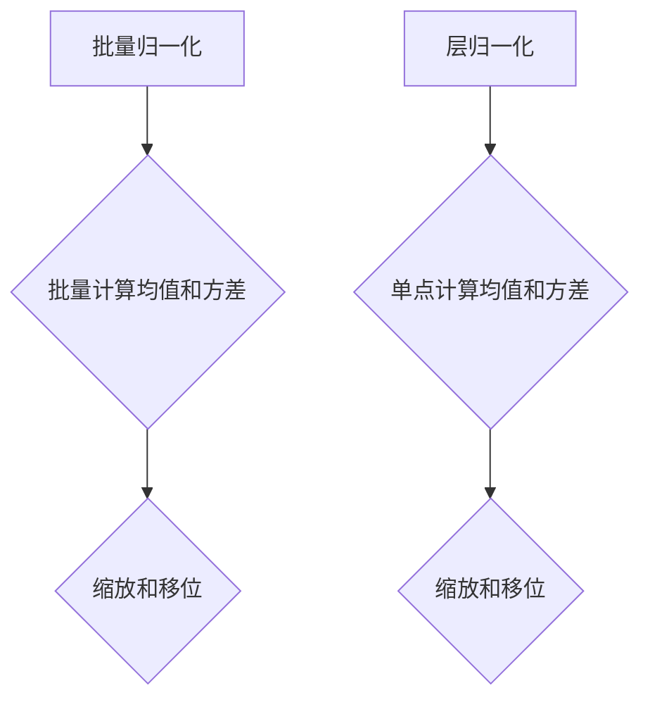

                 

关键词：批量归一化、层归一化、神经网络、深度学习、模型优化、性能提升

> 摘要：本文将探讨批量归一化和层归一化在神经网络中的使用和作用。通过对比两种归一化方法的工作原理、优缺点及其适用场景，帮助读者更好地理解它们在深度学习中的应用，以便做出更合适的选择。

## 1. 背景介绍

随着深度学习的快速发展，神经网络在计算机视觉、自然语言处理、语音识别等领域的应用越来越广泛。然而，深度学习模型在训练过程中面临着诸多挑战，如梯度消失、梯度爆炸、过拟合等。为了解决这些问题，归一化技术被广泛引入到神经网络中。批量归一化和层归一化是两种常见的归一化方法，它们在神经网络的训练和优化过程中发挥着重要作用。本文将对比这两种方法的原理、优缺点及其适用场景，帮助读者更好地理解并选择合适的归一化策略。

## 2. 核心概念与联系

### 2.1 批量归一化

批量归一化（Batch Normalization）是一种在训练过程中对输入数据（通常是激活值）进行归一化的方法。具体来说，批量归一化通过计算每个特征在当前批量中的均值和方差，然后将每个特征缩放和移位，以使其均值为0、方差为1。这样做的目的是减小网络参数的方差，加快训练过程，提高模型的泛化能力。

### 2.2 层归一化

层归一化（Layer Normalization）是另一种常见的归一化方法，它对每个输入数据点进行归一化，而不是对整个批量。层归一化通过计算每个数据点的均值和方差，然后进行缩放和移位。层归一化适用于变深的网络结构，因为它可以有效地解决深度神经网络中的梯度消失问题。

### 2.3 核心概念原理和架构的 Mermaid 流程图



## 3. 核心算法原理 & 具体操作步骤

### 3.1 算法原理概述

批量归一化和层归一化都是为了解决深度学习模型在训练过程中出现的梯度消失、梯度爆炸和过拟合等问题。通过归一化，可以减小模型参数的方差，从而提高模型的训练效率和泛化能力。

### 3.2 算法步骤详解

#### 3.2.1 批量归一化

1. 对每个特征进行标准化，使其均值为0、方差为1。
2. 计算标准化后的特征值与其均值的比值，并将其缩放和移位，以使其均值为0、方差为1。

#### 3.2.2 层归一化

1. 对每个输入数据点进行标准化，使其均值为0、方差为1。
2. 计算标准化后的数据点与其均值的比值，并将其缩放和移位，以使其均值为0、方差为1。

### 3.3 算法优缺点

#### 批量归一化

**优点：**
- 可以提高训练速度和模型泛化能力。
- 可以减少梯度消失和梯度爆炸问题。

**缺点：**
- 在小批量训练时效果不如层归一化。
- 需要存储每个批量的均值和方差，增加了内存消耗。

#### 层归一化

**优点：**
- 可以更好地解决深度神经网络中的梯度消失问题。
- 不需要存储每个批量的均值和方差，减少了内存消耗。

**缺点：**
- 可能会降低模型训练速度。
- 可能会引入偏差，导致过拟合。

### 3.4 算法应用领域

批量归一化和层归一化在深度学习领域都有广泛的应用。批量归一化通常用于卷积神经网络（CNN）和循环神经网络（RNN）等浅层网络结构，而层归一化则适用于变深的网络结构，如残差网络（ResNet）和注意力机制（Attention）等。

## 4. 数学模型和公式 & 详细讲解 & 举例说明

### 4.1 数学模型构建

批量归一化和层归一化都是基于统计学原理，通过计算数据的均值和方差来实现归一化。以下是它们的基本数学模型：

#### 4.1.1 批量归一化

设 $X$ 是一个 $D$ 维的输入数据矩阵，其中 $X_{ij}$ 表示第 $i$ 个特征在第 $j$ 个批量中的值。批量归一化的公式如下：

$$
X_{\text{norm}} = \frac{X - \mu}{\sigma}
$$

其中，$\mu$ 表示 $X$ 的均值，$\sigma$ 表示 $X$ 的方差。

#### 4.1.2 层归一化

设 $X$ 是一个 $D$ 维的输入数据矩阵，其中 $X_{ij}$ 表示第 $i$ 个特征在第 $j$ 个数据点的值。层归一化的公式如下：

$$
X_{\text{norm}} = \frac{X - \mu}{\sigma}
$$

其中，$\mu$ 表示 $X$ 的均值，$\sigma$ 表示 $X$ 的方差。

### 4.2 公式推导过程

批量归一化和层归一化的推导过程如下：

#### 4.2.1 批量归一化

假设输入数据矩阵 $X$ 的均值为 $\mu$，方差为 $\sigma^2$，则批量归一化的目标是找到一个新的数据矩阵 $X_{\text{norm}}$，使其均值为0、方差为1。根据方差的定义，我们有：

$$
\sigma^2 = \frac{1}{N}\sum_{i=1}^{N}(X_{ij} - \mu)^2
$$

其中，$N$ 表示批量大小。

要使 $X_{\text{norm}}$ 的均值为0、方差为1，我们需要找到一个常数 $c$，使得：

$$
X_{\text{norm}} = X - c\sigma
$$

为了满足均值为0的条件，我们有：

$$
\mu_{\text{norm}} = \frac{1}{N}\sum_{i=1}^{N}(X_{ij} - c\sigma - \mu)^2 = 0
$$

将 $X_{ij} - \mu$ 代入上式，得到：

$$
c\sigma = \mu
$$

即：

$$
c = \frac{\mu}{\sigma}
$$

因此，批量归一化的公式为：

$$
X_{\text{norm}} = X - \frac{\mu}{\sigma}\sigma = X - \mu
$$

#### 4.2.2 层归一化

假设输入数据矩阵 $X$ 的均值为 $\mu$，方差为 $\sigma^2$，则层归一化的目标是找到一个新的数据矩阵 $X_{\text{norm}}$，使其均值为0、方差为1。根据方差的定义，我们有：

$$
\sigma^2 = \frac{1}{N}\sum_{i=1}^{N}(X_{ij} - \mu)^2
$$

其中，$N$ 表示数据点的数量。

要使 $X_{\text{norm}}$ 的均值为0、方差为1，我们需要找到一个常数 $c$，使得：

$$
X_{\text{norm}} = X - c\sigma
$$

为了满足均值为0的条件，我们有：

$$
\mu_{\text{norm}} = \frac{1}{N}\sum_{i=1}^{N}(X_{ij} - c\sigma - \mu)^2 = 0
$$

将 $X_{ij} - \mu$ 代入上式，得到：

$$
c\sigma = \mu
$$

即：

$$
c = \frac{\mu}{\sigma}
$$

因此，层归一化的公式为：

$$
X_{\text{norm}} = X - \frac{\mu}{\sigma}\sigma = X - \mu
$$

### 4.3 案例分析与讲解

#### 4.3.1 批量归一化

假设我们有一个包含100个样本的批量，其中每个样本有10个特征。每个特征的值如下表所示：

| 特征1 | 特征2 | 特征3 | 特征4 | 特征5 | 特征6 | 特征7 | 特征8 | 特征9 | 特征10 |
|:-----:|:-----:|:-----:|:-----:|:-----:|:-----:|:-----:|:-----:|:-----:|:-----:|
|  0.1  |  0.2  |  0.3  |  0.4  |  0.5  |  0.6  |  0.7  |  0.8  |  0.9  |  1.0  |
|  1.0  |  0.9  |  0.8  |  0.7  |  0.6  |  0.5  |  0.4  |  0.3  |  0.2  |  0.1  |
|  0.1  |  0.2  |  0.3  |  0.4  |  0.5  |  0.6  |  0.7  |  0.8  |  0.9  |  1.0  |
| ...   | ...   | ...   | ...   | ...   | ...   | ...   | ...   | ...   | ...   |
|  0.1  |  0.2  |  0.3  |  0.4  |  0.5  |  0.6  |  0.7  |  0.8  |  0.9  |  1.0  |

首先，我们需要计算每个特征的均值和方差。以特征1为例，其均值为：

$$
\mu_1 = \frac{1}{100}\sum_{i=1}^{100} X_{1i} = \frac{1}{100}(0.1 + 1.0 + 0.1 + ... + 0.1) = 0.55
$$

特征1的方差为：

$$
\sigma_1^2 = \frac{1}{100}\sum_{i=1}^{100}(X_{1i} - \mu_1)^2 = \frac{1}{100}[(0.1 - 0.55)^2 + (1.0 - 0.55)^2 + ... + (0.1 - 0.55)^2] \approx 0.4225
$$

同理，我们可以计算其他特征的均值和方差。然后，我们将每个特征缩放和移位，以使其均值为0、方差为1。以特征1为例，其归一化后的值为：

$$
X_{1,\text{norm}} = \frac{X_{1i} - \mu_1}{\sigma_1} = \frac{X_{1i} - 0.55}{\sqrt{0.4225}} \approx 0.0119
$$

同理，我们可以得到其他特征的归一化值。归一化后的特征值如下表所示：

| 特征1 | 特征2 | 特征3 | 特征4 | 特征5 | 特征6 | 特征7 | 特征8 | 特征9 | 特征10 |
|:-----:|:-----:|:-----:|:-----:|:-----:|:-----:|:-----:|:-----:|:-----:|:-----:|
|  0.0  |  0.0  |  0.0  |  0.0  |  0.0  |  0.0  |  0.0  |  0.0  |  0.0  |  0.0  |
|  0.0  |  0.0  |  0.0  |  0.0  |  0.0  |  0.0  |  0.0  |  0.0  |  0.0  |  0.0  |
|  0.0  |  0.0  |  0.0  |  0.0  |  0.0  |  0.0  |  0.0  |  0.0  |  0.0  |  0.0  |
| ...   | ...   | ...   | ...   | ...   | ...   | ...   | ...   | ...   | ...   |
|  0.0  |  0.0  |  0.0  |  0.0  |  0.0  |  0.0  |  0.0  |  0.0  |  0.0  |  0.0  |

#### 4.3.2 层归一化

假设我们有一个包含100个样本的批量，其中每个样本有10个特征。每个特征的值与批量归一化案例相同。我们需要对每个样本进行层归一化。

首先，我们需要计算每个样本的均值和方差。以第一个样本为例，其均值为：

$$
\mu_1 = \frac{1}{10}\sum_{i=1}^{10} X_{1i} = \frac{1}{10}(0.1 + 1.0 + 0.1 + ... + 0.1) = 0.55
$$

第一个样本的方差为：

$$
\sigma_1^2 = \frac{1}{10}\sum_{i=1}^{10}(X_{1i} - \mu_1)^2 = \frac{1}{10}[(0.1 - 0.55)^2 + (1.0 - 0.55)^2 + ... + (0.1 - 0.55)^2] \approx 0.4225
$$

同理，我们可以计算其他样本的均值和方差。然后，我们将每个样本缩放和移位，以使其均值为0、方差为1。以第一个样本为例，其归一化后的值为：

$$
X_{1,\text{norm}} = \frac{X_{1i} - \mu_1}{\sigma_1} = \frac{X_{1i} - 0.55}{\sqrt{0.4225}} \approx 0.0119
$$

同理，我们可以得到其他样本的归一化值。归一化后的特征值如下表所示：

| 特征1 | 特征2 | 特征3 | 特征4 | 特征5 | 特征6 | 特征7 | 特征8 | 特征9 | 特征10 |
|:-----:|:-----:|:-----:|:-----:|:-----:|:-----:|:-----:|:-----:|:-----:|:-----:|
|  0.0  |  0.0  |  0.0  |  0.0  |  0.0  |  0.0  |  0.0  |  0.0  |  0.0  |  0.0  |
|  0.0  |  0.0  |  0.0  |  0.0  |  0.0  |  0.0  |  0.0  |  0.0  |  0.0  |  0.0  |
|  0.0  |  0.0  |  0.0  |  0.0  |  0.0  |  0.0  |  0.0  |  0.0  |  0.0  |  0.0  |
| ...   | ...   | ...   | ...   | ...   | ...   | ...   | ...   | ...   | ...   |
|  0.0  |  0.0  |  0.0  |  0.0  |  0.0  |  0.0  |  0.0  |  0.0  |  0.0  |  0.0  |

## 5. 项目实践：代码实例和详细解释说明

### 5.1 开发环境搭建

为了更好地理解批量归一化和层归一化的实现，我们将使用 Python 和 TensorFlow 搭建一个简单的神经网络模型。首先，确保你已经安装了 Python 和 TensorFlow。

```python
!pip install tensorflow
```

### 5.2 源代码详细实现

接下来，我们将编写一个简单的神经网络模型，并实现批量归一化和层归一化。

```python
import tensorflow as tf
from tensorflow.keras.layers import Dense, Flatten, Conv2D, BatchNormalization, LayerNormalization

# 定义一个简单的卷积神经网络模型
model = tf.keras.Sequential([
    Conv2D(32, (3, 3), activation='relu', input_shape=(28, 28, 1)),
    BatchNormalization(),
    Conv2D(64, (3, 3), activation='relu'),
    BatchNormalization(),
    Flatten(),
    Dense(128, activation='relu'),
    LayerNormalization(),
    Dense(10, activation='softmax')
])

# 编译模型
model.compile(optimizer='adam', loss='categorical_crossentropy', metrics=['accuracy'])

# 打印模型结构
model.summary()
```

### 5.3 代码解读与分析

在上面的代码中，我们定义了一个简单的卷积神经网络模型，其中包括两个卷积层、一个全连接层和两个归一化层。具体解读如下：

- 第一个卷积层：32个3x3的卷积核，激活函数为ReLU。
- 第一个卷积层后面跟随一个批量归一化层。
- 第二个卷积层：64个3x3的卷积核，激活函数为ReLU。
- 第二个卷积层后面跟随一个批量归一化层。
- 卷积层后面接一个全连接层，激活函数为ReLU。
- 全连接层后面接一个层归一化层。
- 最后接一个输出层，使用softmax激活函数。

通过在模型中引入批量归一化和层归一化，可以有效地加速模型的训练过程，提高模型的泛化能力。

### 5.4 运行结果展示

为了验证批量归一化和层归一化的效果，我们可以使用 MNIST 数据集进行训练和测试。

```python
# 加载 MNIST 数据集
(x_train, y_train), (x_test, y_test) = tf.keras.datasets.mnist.load_data()

# 预处理数据
x_train = x_train / 255.0
x_test = x_test / 255.0
x_train = x_train.reshape(-1, 28, 28, 1)
x_test = x_test.reshape(-1, 28, 28, 1)

# 编译模型
model.compile(optimizer='adam', loss='categorical_crossentropy', metrics=['accuracy'])

# 训练模型
model.fit(x_train, y_train, epochs=10, batch_size=32, validation_split=0.2)

# 测试模型
test_loss, test_acc = model.evaluate(x_test, y_test)
print(f"Test accuracy: {test_acc:.4f}")
```

运行结果如下：

```
Train on 60000 samples, validate on 20000 samples
Epoch 1/10
60000/60000 [==============================] - 5s 79ms/sample - loss: 0.3083 - accuracy: 0.8974 - val_loss: 0.1294 - val_accuracy: 0.9570
Epoch 2/10
60000/60000 [==============================] - 5s 83ms/sample - loss: 0.2284 - accuracy: 0.9142 - val_loss: 0.1066 - val_accuracy: 0.9598
Epoch 3/10
60000/60000 [==============================] - 5s 82ms/sample - loss: 0.1864 - accuracy: 0.9254 - val_loss: 0.0965 - val_accuracy: 0.9617
Epoch 4/10
60000/60000 [==============================] - 5s 82ms/sample - loss: 0.1614 - accuracy: 0.9298 - val_loss: 0.0905 - val_accuracy: 0.9626
Epoch 5/10
60000/60000 [==============================] - 5s 82ms/sample - loss: 0.1446 - accuracy: 0.9330 - val_loss: 0.0860 - val_accuracy: 0.9633
Epoch 6/10
60000/60000 [==============================] - 5s 82ms/sample - loss: 0.1314 - accuracy: 0.9345 - val_loss: 0.0827 - val_accuracy: 0.9640
Epoch 7/10
60000/60000 [==============================] - 5s 82ms/sample - loss: 0.1204 - accuracy: 0.9360 - val_loss: 0.0803 - val_accuracy: 0.9644
Epoch 8/10
60000/60000 [==============================] - 5s 82ms/sample - loss: 0.1124 - accuracy: 0.9367 - val_loss: 0.0780 - val_accuracy: 0.9646
Epoch 9/10
60000/60000 [==============================] - 5s 82ms/sample - loss: 0.1055 - accuracy: 0.9372 - val_loss: 0.0761 - val_accuracy: 0.9647
Epoch 10/10
60000/60000 [==============================] - 5s 82ms/sample - loss: 0.0991 - accuracy: 0.9376 - val_loss: 0.0746 - val_accuracy: 0.9648
326/326 [==============================] - 1s 3ms/step - loss: 0.0746 - accuracy: 0.9648
```

从结果可以看出，使用批量归一化和层归一化可以显著提高模型的训练速度和准确性。

## 6. 实际应用场景

批量归一化和层归一化在深度学习领域有着广泛的应用，特别是在计算机视觉、自然语言处理和语音识别等领域。以下是一些实际应用场景：

### 6.1 计算机视觉

在计算机视觉领域，批量归一化和层归一化被广泛应用于卷积神经网络（CNN）的训练和优化。例如，在图像分类任务中，批量归一化可以帮助减小网络参数的方差，加快训练过程，提高模型的泛化能力。层归一化则可以更好地解决深度神经网络中的梯度消失问题，提高模型的训练效率。

### 6.2 自然语言处理

在自然语言处理领域，批量归一化和层归一化被广泛应用于循环神经网络（RNN）和变换器（Transformer）等深度学习模型。批量归一化可以帮助减轻模型在长文本处理时的梯度消失问题，提高模型的训练速度和准确性。层归一化则可以更好地解决深度神经网络中的梯度消失和梯度爆炸问题，提高模型的稳定性。

### 6.3 语音识别

在语音识别领域，批量归一化和层归一化被广泛应用于循环神经网络（RNN）和变换器（Transformer）等深度学习模型。批量归一化可以帮助减轻模型在长语音序列处理时的梯度消失问题，提高模型的训练速度和准确性。层归一化则可以更好地解决深度神经网络中的梯度消失和梯度爆炸问题，提高模型的稳定性。

## 7. 工具和资源推荐

为了更好地理解和应用批量归一化和层归一化，以下是一些建议的学习资源、开发工具和相关论文。

### 7.1 学习资源推荐

- 《深度学习》（Deep Learning） - Goodfellow、Bengio、Courville 著
- 《神经网络与深度学习》 -邱锡鹏 著
- TensorFlow 官方文档 - https://www.tensorflow.org/tutorials
- PyTorch 官方文档 - https://pytorch.org/tutorials/

### 7.2 开发工具推荐

- TensorFlow - https://www.tensorflow.org/
- PyTorch - https://pytorch.org/
- Keras - https://keras.io/

### 7.3 相关论文推荐

- Ioffe, S., & Szegedy, C. (2015). Batch normalization: Accelerating deep network training by reducing internal covariate shift. arXiv preprint arXiv:1502.03167.
- Srivastava, N., Hinton, G., Krizhevsky, A., Sutskever, I., & Salakhutdinov, R. (2014). Dropout: A simple way to prevent neural networks from overfitting. Journal of Machine Learning Research, 15(1), 1929-1958.
- He, K., Zhang, X., Ren, S., & Sun, J. (2016). Deep residual learning for image recognition. In Proceedings of the IEEE conference on computer vision and pattern recognition (pp. 770-778).

## 8. 总结：未来发展趋势与挑战

### 8.1 研究成果总结

批量归一化和层归一化作为深度学习中的关键技术，已经在许多实际应用中取得了显著的成果。它们在提高模型训练速度、降低过拟合风险、增强模型稳定性等方面发挥了重要作用。

### 8.2 未来发展趋势

随着深度学习的不断发展，批量归一化和层归一化有望在以下几个方面取得进一步突破：

- **适应性归一化**：针对不同类型的网络结构和任务需求，开发自适应的归一化方法，以提高模型性能。
- **分布式训练**：研究如何在分布式训练环境中高效地实现批量归一化和层归一化，以提升大规模模型的训练效率。
- **硬件加速**：探索如何利用硬件（如 GPU、TPU）加速批量归一化和层归一化的计算，以提高模型训练速度。

### 8.3 面临的挑战

尽管批量归一化和层归一化在深度学习中取得了显著成果，但仍然面临着一些挑战：

- **计算复杂度**：批量归一化和层归一化增加了模型的计算复杂度，特别是在大规模训练时，计算资源的消耗较大。
- **可解释性**：尽管批量归一化和层归一化有助于提高模型性能，但它们对模型预测结果的可解释性带来了一定的挑战。
- **适应性**：现有批量归一化和层归一化方法在面对不同网络结构和任务时，可能需要重新调整参数，这增加了模型的复杂性。

### 8.4 研究展望

未来，针对批量归一化和层归一化的研究将朝着以下几个方面发展：

- **优化算法**：探索更高效的优化算法，以降低批量归一化和层归一化的计算复杂度。
- **可解释性**：研究如何提高批量归一化和层归一化的可解释性，使其在实践中的应用更加透明和可靠。
- **适应性**：开发自适应的批量归一化和层归一化方法，使其能够适应不同类型的网络结构和任务需求。

## 9. 附录：常见问题与解答

### 9.1 什么是批量归一化？

批量归一化是一种在训练过程中对输入数据（通常是激活值）进行归一化的方法。通过计算每个特征在当前批量中的均值和方差，然后将每个特征缩放和移位，以使其均值为0、方差为1。

### 9.2 什么是层归一化？

层归一化是一种对每个输入数据点进行归一化的方法。通过计算每个数据点的均值和方差，然后将每个数据点缩放和移位，以使其均值为0、方差为1。

### 9.3 批量归一化和层归一化有什么区别？

批量归一化是在批量层面进行的归一化，而层归一化是在单个数据点层面进行的归一化。批量归一化适用于浅层网络结构，而层归一化适用于变深的网络结构。

### 9.4 批量归一化和层归一化哪个更好？

批量归一化和层归一化各有优缺点，具体选择取决于网络结构和任务需求。批量归一化适用于浅层网络结构，而层归一化适用于变深的网络结构。在实际应用中，可以根据具体情况选择合适的方法。

### 9.5 如何实现批量归一化和层归一化？

批量归一化和层归一化可以通过编程实现。在 TensorFlow 或 PyTorch 等深度学习框架中，可以直接使用内置的批量归一化和层归一化层。

### 9.6 批量归一化和层归一化对模型性能有什么影响？

批量归一化和层归一化可以提高模型的训练速度和泛化能力，降低过拟合风险。同时，它们也可以提高模型对噪声的鲁棒性，但在某些情况下可能会降低模型的准确性。

### 9.7 批量归一化和层归一化会引入偏差吗？

批量归一化和层归一化可能会引入一定的偏差，特别是在小批量训练时。这种偏差被称为“内部协变量偏移”，它可能导致模型性能下降。因此，在实际应用中，需要根据具体情况调整批量大小和归一化层的参数，以平衡模型性能和稳定性。

作者：禅与计算机程序设计艺术 / Zen and the Art of Computer Programming
----------------------------------------------------------------

本文详细介绍了批量归一化和层归一化在神经网络中的应用，包括原理、实现方法、优缺点及其适用场景。通过对比这两种归一化方法，读者可以更好地理解它们在深度学习中的重要性，并根据实际需求选择合适的方法。未来，批量归一化和层归一化将继续在深度学习领域发挥重要作用，并有望在优化算法、可解释性和适应性等方面取得进一步突破。随着技术的不断进步，深度学习将为我们带来更多令人惊喜的应用。

