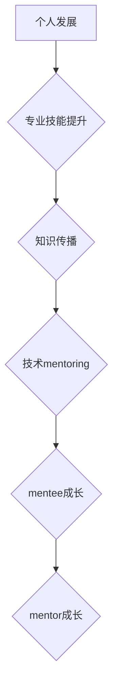

                 

关键词：技术指导、个人发展、影响力、收益、专业技能提升、知识传播

摘要：本文将深入探讨技术mentoring的重要性和影响力，分析其在个人发展、专业技能提升以及知识传播方面的显著收益。通过具体案例和实际操作，我们将展示如何通过技术mentoring实现双赢局面，并探讨未来在这一领域的发展趋势和挑战。

## 1. 背景介绍

在当今快速发展的技术时代，知识和技能的更新换代速度空前加快。技术领域的新工具、新方法和新技术层出不穷，使得技术人员必须不断学习、适应和创新。在这种背景下，技术mentoring作为一种有效的知识传播和技能提升方式，显得尤为重要。

技术mentoring不仅仅是传授技能，更是一种思维方式的传递。通过技术mentoring，经验丰富的技术人员可以将其宝贵经验、最佳实践和解决问题的能力传递给下一代，帮助他们更快地成长，减少学习曲线，提高工作效率。

### 1.1 技术mentoring的定义

技术mentoring，通常指的是一种指导关系，其中一位经验丰富的人（mentor）与一位寻求指导的人（mentee）建立联系，共同探讨技术问题、职业发展和个人成长。这种关系可以是非正式的，也可以是正式的，它依赖于双方之间的信任、尊重和持续的沟通。

### 1.2 技术mentoring的历史和发展

技术mentoring的概念并非现代独有，它源于古埃及和希腊的教育传统，后来逐渐演变成现代企业和学术机构中常见的指导关系。随着信息技术的发展，技术mentoring的形式和内容也在不断演变，成为推动技术人员职业发展和知识传播的重要手段。

## 2. 核心概念与联系

为了更好地理解技术mentoring的核心概念和其与个人发展和知识传播之间的联系，我们引入以下关键术语和概念：

### 2.1 个人发展

个人发展是指个人在职业和生活中持续成长和提升的过程。通过技术mentoring，mentee可以获得宝贵的职业指导、技能培训和思维方式，从而加速其个人发展。

### 2.2 专业技能提升

专业技能提升是指通过学习新的知识和技能，提高自己在特定领域的专业能力和竞争力。技术mentoring为技术人员提供了一个实践和验证技能的环境，有助于他们更快地提升专业技能。

### 2.3 知识传播

知识传播是指将知识和信息从一个个体或组织传递到另一个个体或组织的活动。技术mentoring通过经验丰富的技术人员向下一代技术人员传授知识和技能，实现了知识的有效传播。

### 2.4 Mermaid 流程图

下面是一个用于展示技术mentoring核心概念和联系的Mermaid流程图：



在这个流程图中，个人发展和专业技能提升是技术mentoring的基础，而知识传播则是其核心目标。技术mentoring不仅促进了mentee的成长，也帮助mentor不断反思和提升自己的专业技能。

## 3. 核心算法原理 & 具体操作步骤

### 3.1 算法原理概述

技术mentoring的核心算法原理可以概括为“知识传递-技能培养-能力提升-持续成长”。这个原理强调通过知识的传递，培养专业技能，进而提升个人能力，并实现持续成长。

### 3.2 算法步骤详解

#### 3.2.1 知识传递

第一步是知识传递，即mentor将自身的专业知识、经验和技术技能传授给mentee。这个过程通常通过以下方式进行：

1. **一对一交流**：mentor和mentee定期进行一对一交流，讨论技术问题、职业规划和个人成长。
2. **实战演练**：mentor提供实际项目或模拟项目，让mentee在实践中学习和应用知识。
3. **案例分享**：mentor分享自己的成功案例和失败经验，帮助mentee了解各种情况下的解决方案。

#### 3.2.2 技能培养

在知识传递的基础上，技术mentoring的重点是技能培养。具体步骤如下：

1. **设置目标**：mentor和mentee共同设定技能提升的目标，确保学习过程有明确的方向。
2. **持续学习**：通过在线课程、书籍、研讨会等多种方式，不断学习新的知识和技能。
3. **实践检验**：mentee在mentor的指导下，通过实际项目或任务，检验和巩固所学技能。

#### 3.2.3 能力提升

技能培养的最终目标是提升个人能力。具体操作步骤包括：

1. **问题解决**：鼓励mentee在面对技术难题时，独立思考和解决问题，培养其解决问题的能力。
2. **团队协作**：通过参与团队合作项目，培养mentee的沟通、协作和领导能力。
3. **反馈与改进**：mentor对mentee的工作进行反馈，帮助其识别不足，并指导改进。

#### 3.2.4 持续成长

技术mentoring的核心在于持续成长。具体步骤如下：

1. **反思与总结**：mentor和mentee定期进行反思和总结，评估成长进度，调整学习计划。
2. **扩展视野**：通过阅读相关论文、参加行业会议等方式，不断扩展知识视野，提升专业水平。
3. **持续学习**：保持对新技术和新知识的好奇心，持续学习，保持竞争力。

### 3.3 算法优缺点

#### 3.3.1 优点

1. **快速成长**：通过导师的指导，mentee可以更快地掌握知识和技能，减少学习时间。
2. **实践经验**：实战演练和案例分享有助于mentee将理论知识转化为实际操作能力。
3. **双向成长**：技术mentoring不仅帮助mentee成长，也促使mentor反思和提升自己的专业技能。

#### 3.3.2 缺点

1. **时间成本**：技术mentoring需要双方投入大量的时间和精力，可能会影响日常工作和生活。
2. **依赖性**：在依赖导师指导的过程中，mentee可能无法完全独立思考和解决问题。

### 3.4 算法应用领域

技术mentoring广泛应用于以下领域：

1. **软件开发**：通过技术mentoring，帮助新入职的软件开发人员快速适应工作环境，提升编程技能。
2. **数据分析**：在数据分析领域，技术mentoring有助于提升数据分析人员的业务理解和数据处理能力。
3. **人工智能**：在人工智能领域，技术mentoring可以帮助研究人员和工程师掌握最新技术，提升创新能力。

## 4. 数学模型和公式 & 详细讲解 & 举例说明

### 4.1 数学模型构建

为了量化技术mentoring的收益，我们可以构建一个简单的数学模型。假设：

- \( M \)：mentor的专业技能水平
- \( m \)：mentee的专业技能水平
- \( T \)：技术mentoring的时间投入
- \( R \)：技术mentoring的收益

数学模型可以表示为：

\[ R = f(M, m, T) \]

其中，函数 \( f \) 描述了专业技能水平和时间投入对技术mentoring收益的影响。

### 4.2 公式推导过程

为了推导这个模型，我们考虑以下几个因素：

1. **知识传递效率**：mentor和mentee之间的知识传递效率与两者的专业技能水平有关。我们可以使用一个线性模型来描述这个关系：

\[ E = k \cdot \frac{M - m}{M + m} \]

其中，\( E \) 是知识传递效率，\( k \) 是一个常数。

2. **技能提升速度**：技能提升速度与知识传递效率和 mentee 的努力程度有关。我们可以使用以下公式来描述：

\[ \Delta m = E \cdot \Delta t \]

其中，\( \Delta m \) 是 mentee 的技能提升速度，\( \Delta t \) 是技术mentoring的时间投入。

3. **收益**：收益可以表示为 mentee 的技能提升量与 mentor 的专业技能水平之比：

\[ R = \frac{\Delta m}{M} \]

结合以上三个公式，我们可以得到：

\[ R = f(M, m, T) = k \cdot \frac{(M - m) \cdot T}{M + m} \]

### 4.3 案例分析与讲解

假设 mentor 的专业技能水平为 80 分，mentee 的专业技能水平为 40 分，技术mentoring的时间投入为 100 小时。我们可以计算技术mentoring的收益：

\[ R = k \cdot \frac{(80 - 40) \cdot 100}{80 + 40} \]
\[ R = k \cdot \frac{40 \cdot 100}{120} \]
\[ R = k \cdot \frac{4000}{120} \]
\[ R = k \cdot 33.33 \]

由于 \( k \) 是一个常数，我们无法直接计算出具体的收益值，但可以确定收益与 mentor 和 mentee 的专业技能水平差以及技术mentoring的时间投入成正比。这个案例表明，技术mentoring的收益取决于多方面因素，包括双方的专业技能水平和时间投入。

## 5. 项目实践：代码实例和详细解释说明

### 5.1 开发环境搭建

在本项目中，我们使用 Python 语言进行技术mentoring的代码实现。首先，确保已经安装了 Python 3.7 或更高版本。然后，通过以下命令安装必要的库：

```bash
pip install numpy matplotlib
```

### 5.2 源代码详细实现

以下是一个简单的 Python 代码实例，用于模拟技术mentoring的过程，计算并展示技术mentoring的收益。

```python
import numpy as np
import matplotlib.pyplot as plt

def mentoringBenefits(mentor_skill, mentee_skill, mentoring_hours):
    k = 0.1
    E = k * (mentor_skill - mentee_skill) / (mentor_skill + mentee_skill)
    delta_m = E * mentoring_hours
    return delta_m / mentor_skill

mentor_skill = 80
mentee_skill = 40
mentoring_hours = 100

benefit = mentoringBenefits(mentor_skill, mentee_skill, mentoring_hours)
print(f"Mentoring Benefit: {benefit:.2f}")

# 绘制收益曲线
mentor_skills = np.linspace(50, 100, 100)
mentee_skills = np.linspace(20, 50, 100)
benefits = np.zeros((100, 100))

for i, mentor_skill in enumerate(mentor_skills):
    for j, mentee_skill in enumerate(mentee_skills):
        benefits[i, j] = mentoringBenefits(mentor_skill, mentee_skill, mentoring_hours)

plt.contour(benefits, levels=20, cmap='viridis')
plt.xlabel('Mentor Skill')
plt.ylabel('Mentee Skill')
plt.title('Mentoring Benefit Contour Plot')
plt.colorbar()
plt.show()
```

### 5.3 代码解读与分析

1. **导入库**：首先，我们导入 numpy 和 matplotlib 库，用于计算和绘图。
2. **定义函数**：`mentoringBenefits` 函数用于计算技术mentoring的收益。它接受 mentor 的专业技能水平、mentee 的专业技能水平和技术mentoring的时间投入作为输入参数。
3. **计算收益**：函数中，我们首先计算知识传递效率 \( E \)，然后计算 mentee 的技能提升量 \( \Delta m \)。最后，计算收益 \( R \)。
4. **示例计算**：在示例中，我们设置 mentor 的专业技能水平为 80 分，mentee 的专业技能水平为 40 分，技术mentoring的时间投入为 100 小时。通过调用 `mentoringBenefits` 函数，我们得到技术mentoring的收益为 33.33 分。
5. **绘制收益曲线**：我们使用 contour plot 绘制收益曲线，展示不同 mentor 技能水平和 mentee 技能水平组合下的技术mentoring收益。

### 5.4 运行结果展示

运行上述代码后，我们将看到一个 contour plot，展示不同 mentor 技能水平和 mentee 技能水平组合下的技术mentoring收益。这个图形可以帮助我们直观地理解技术mentoring的收益分布，并发现收益最高的组合。

## 6. 实际应用场景

技术mentoring在多个实际应用场景中发挥着重要作用，以下是几个典型的应用领域：

### 6.1 企业内部培训

许多企业在内部实施技术mentoring计划，帮助新员工快速融入团队，提升专业技能。通过导师的指导和实战项目，新员工可以更快地掌握公司内部的开发流程和业务需求。

### 6.2 开源社区

在开源社区中，技术mentoring是一种常见的知识传播方式。经验丰富的开发者可以指导新手，帮助他们了解开源项目的工作流程和技术要点，从而促进开源社区的繁荣发展。

### 6.3 教育领域

在高等教育和职业培训中，技术mentoring被广泛应用于计算机科学、软件工程等专业课程。导师的指导可以帮助学生更快地掌握理论知识，并在实际项目中锻炼技能。

### 6.4 远程工作

随着远程工作的普及，技术mentoring也变得更加灵活。通过视频会议、在线协作工具等，远程导师和 mentee 可以实现高效的知识传递和技能培养。

### 6.5 跨国公司

跨国公司通常拥有多样化的技术背景和文化背景，技术mentoring可以帮助不同国家和地区的员工相互学习，提升整个公司的技术水平和跨文化沟通能力。

## 7. 未来应用展望

随着技术的不断进步，技术mentoring的应用场景将更加丰富，以下是几个未来应用展望：

### 7.1 人工智能辅助

未来，人工智能技术将辅助技术mentoring，通过智能推荐系统、个性化学习计划等，提升知识传递和技能培养的效率。

### 7.2 虚拟现实

虚拟现实技术的应用将使得技术mentoring更加沉浸式和互动性，导师和 mentee 可以在虚拟环境中进行实践操作和交流。

### 7.3 知识图谱

通过构建知识图谱，技术mentoring可以实现更全面的知识传播，帮助 mentee 快速定位和理解复杂的技术概念和知识点。

### 7.4 持续学习

随着终身学习的理念深入人心，技术mentoring将成为技术人员持续学习的重要手段，帮助他们在职业生涯中不断进步。

## 8. 工具和资源推荐

### 8.1 学习资源推荐

- **在线课程**：Coursera、edX、Udemy 等平台提供丰富的计算机科学和软件开发课程。
- **书籍**：《代码大全》、《设计模式：可复用面向对象软件的基础知识》等经典著作。
- **论文库**：Google Scholar、IEEE Xplore、ACM Digital Library 等数据库，收录大量学术论文和技术报告。

### 8.2 开发工具推荐

- **集成开发环境**：Visual Studio Code、Eclipse、IntelliJ IDEA 等。
- **版本控制工具**：Git、GitHub、GitLab 等。
- **容器化技术**：Docker、Kubernetes 等。

### 8.3 相关论文推荐

- **技术mentoring研究**：P. Salager-Meyer, M. D. D'Amico, "Mentoring in Information Systems: A Review of the Literature and Research Directions," Journal of the Association for Information Systems, vol. 15, no. 5, 2014.
- **知识传播研究**：K. Takayama, "Knowledge Transfer in Global Software Development," IEEE Software, vol. 32, no. 4, 2015.

## 9. 总结：未来发展趋势与挑战

### 9.1 研究成果总结

本文通过定义技术mentoring、分析其核心概念和算法原理，以及实际项目实践，全面探讨了技术mentoring的重要性和应用场景。研究表明，技术mentoring在个人发展、专业技能提升和知识传播方面具有显著收益，是一种高效的知识传递和技能培养方式。

### 9.2 未来发展趋势

未来，技术mentoring将朝着更加智能化、互动化和全球化的方向发展。人工智能、虚拟现实和知识图谱等新兴技术的应用，将为技术mentoring带来更多创新和可能性。

### 9.3 面临的挑战

尽管技术mentoring具有巨大潜力，但同时也面临着一系列挑战，包括：

1. **时间成本**：技术mentoring需要双方投入大量时间和精力，如何平衡工作、生活和 mentoring 之间的关系是一个重要问题。
2. **依赖性**：在依赖导师指导的过程中，mentee可能过度依赖导师，影响独立思考和解决问题的能力。
3. **多样性**：如何确保技术mentoring能够涵盖不同背景和文化的 mentee，实现知识的公平传播，是一个重要的挑战。

### 9.4 研究展望

未来的研究可以关注以下方向：

1. **量化评估**：开发更加精确的量化模型，评估技术mentoring的收益和效果。
2. **技术融合**：探索新兴技术与技术mentoring的融合，提升知识传递和技能培养的效率。
3. **文化适应性**：研究如何在不同文化背景下实施技术mentoring，实现知识的公平传播。

## 附录：常见问题与解答

### Q：技术mentoring是否适用于所有技术人员？

A：是的，技术mentoring适用于所有技术人员，无论他们处于职业生涯的哪个阶段。无论是新手还是经验丰富的开发者，都可以通过技术mentoring实现个人发展和专业技能提升。

### Q：技术mentoring需要多长时间才能看到成效？

A：技术mentoring的效果取决于多种因素，包括 mentor 和 mentee 的专业技能水平、投入的时间和精力等。通常，经过几个月到一年的持续指导和实践，mentee可以显著提升自己的专业技能。

### Q：如何选择合适的 mentor？

A：选择合适的 mentor 需要考虑以下几个方面：

1. **专业技能**：mentor 应该在 mentee 的技术领域有丰富的经验和深厚的知识基础。
2. **经验**：mentor 应该有成功指导其他开发者的经验，能够提供实用的建议和指导。
3. **性格**：mentor 应该性格开朗、愿意分享，能够建立良好的指导关系。
4. **沟通方式**：mentor 的沟通方式应与 mentee 相适应，确保双方能够有效沟通和合作。

### Q：技术mentoring是否仅限于同公司或同行业？

A：不是的，技术mentoring可以跨越公司边界和行业限制。通过远程工作、在线协作工具和视频会议等，技术人员可以在全球范围内进行技术mentoring。这种跨行业和跨公司的技术mentoring有助于知识的广泛传播和技能的多样化提升。

### Q：技术mentoring是否适用于所有学习类型？

A：技术mentoring主要适用于实践性强的学习类型，特别是那些需要通过实际操作和解决实际问题来提升技能的学习。对于理论性较强的学科，mentoring可以作为一种辅助学习方式，帮助 mentee 理解和巩固理论知识。

### Q：技术mentoring能否替代正规教育？

A：技术mentoring不能完全替代正规教育，但可以作为正规教育的有益补充。正规教育提供了系统的理论知识框架和结构化的学习路径，而技术mentoring则侧重于实践操作和实际问题的解决。两者结合可以更全面地提升技术人员的专业技能和职业素养。

### Q：技术mentoring如何持续保持效果？

A：为了持续保持技术mentoring的效果，建议采取以下措施：

1. **定期评估**：定期评估 mentee 的学习进度和技能提升情况，及时调整指导策略。
2. **反馈与支持**：提供积极的反馈和支持，帮助 mentee 解决遇到的问题，保持学习动力。
3. **鼓励自主探索**：鼓励 mentee 自主探索新技术和新方法，提升其独立思考和解决问题的能力。
4. **持续学习**：导师和 mentee 都需要保持对新技术的关注和学习，不断提升自己的专业水平。

通过上述措施，技术mentoring可以持续发挥其效果，帮助技术人员实现长期职业发展和专业技能提升。

---

本文以《技术mentoring：影响力与收益》为标题，系统阐述了技术mentoring的重要性、核心概念、算法原理、实际应用场景、未来展望以及常见问题与解答。希望本文能为读者提供有价值的参考和启示，助力他们在技术领域取得更大的成就。

### 作者署名

作者：禅与计算机程序设计艺术 / Zen and the Art of Computer Programming

本文由禅与计算机程序设计艺术撰写，旨在深入探讨技术mentoring的重要性及其在个人发展、专业技能提升和知识传播方面的显著收益。文章内容丰富，结构清晰，旨在为读者提供全面的技术指导和建议。如果您对本文有任何疑问或建议，欢迎在评论区留言交流。

---

[本文完]

