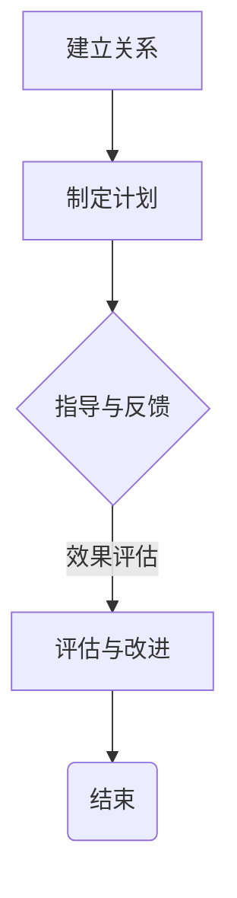

                 

关键词：技术指导、影响力、收益、职业生涯发展、专家经验、知识传递

> 摘要：本文深入探讨了技术mentoring在IT行业中的重要性，分析了技术专家通过指导新人和团队成员所带来的深远影响和潜在收益。文章从多个维度阐述了技术mentoring的核心价值，包括个人职业发展、团队效能提升、知识传承以及组织文化的塑造。此外，本文还提供了实际案例、最佳实践和未来发展展望，以期为技术专家在mentoring方面的努力提供有力支持。

## 1. 背景介绍

在快速发展的信息技术时代，技术人才的培养和管理成为各大企业和组织关注的焦点。技术mentoring，作为一种重要的知识传承和技能培养机制，逐渐受到重视。技术mentoring指的是资深技术人员（mentor）对新手（mentee）或团队成员进行指导、培训和辅导的过程。这一过程不仅帮助新手快速成长，还提升了团队的整体效能和组织的核心竞争力。

### 技术mentoring的重要性

技术mentoring的重要性不言而喻。首先，它能够有效传递专家的经验和知识，帮助新手在短时间内掌握关键技能。其次，通过mentoring，团队成员能够建立起良好的沟通和信任关系，促进知识共享和协作创新。此外，技术mentoring还能帮助组织建立积极向上的文化氛围，提升员工的满意度和忠诚度。

### 技术mentoring的目标

技术mentoring的主要目标是：

1. **技能提升**：帮助新手快速掌握所需的技术技能和行业知识。
2. **职业发展**：为新员工提供职业规划和晋升的机会。
3. **团队协作**：增强团队成员之间的沟通和协作能力。
4. **知识传承**：确保组织知识的不间断传承。

## 2. 核心概念与联系

### 技术专家与新手的关系

技术专家（mentor）和新手（mentee）之间的互动是技术mentoring的核心。技术专家具备丰富的实战经验和深厚的专业背景，而新手则充满激情和求知欲，渴望快速成长。两者的结合能够实现知识和技能的有效传递，促进共同进步。

### 技术mentoring的核心原则

为了确保技术mentoring的有效性，需要遵循以下核心原则：

1. **个性化指导**：根据新手的个人特点和需求，提供定制化的培训计划和职业规划。
2. **持续关注**：技术专家需要持续关注新手的成长过程，提供及时的支持和反馈。
3. **信任与尊重**：建立互信和尊重的关系，为新手创造一个舒适的学习环境。
4. **知识共享**：鼓励双方分享经验和知识，实现知识传承和共享。

### 技术mentoring的过程

技术mentoring的过程可以分为以下几个阶段：

1. **建立关系**：技术专家和新手之间建立初步联系，了解双方的期望和需求。
2. **制定计划**：根据新手的个人情况和职业目标，制定详细的培训计划和职业规划。
3. **指导与反馈**：技术专家提供实际操作指导和反馈，帮助新手克服困难，提升技能。
4. **评估与改进**：定期评估新手的成长情况，调整培训计划和职业规划，确保效果。

### Mermaid 流程图

以下是技术mentoring过程的Mermaid流程图：



## 3. 核心算法原理 & 具体操作步骤

### 3.1 算法原理概述

技术mentoring的核心算法可以概括为“指导-反馈-改进”模型。这一模型基于以下原理：

1. **指导**：技术专家通过传授知识和经验，帮助新手建立正确的思维模式和技能框架。
2. **反馈**：新手在实际操作过程中遇到问题时，技术专家提供及时的反馈，帮助其调整和改进。
3. **改进**：通过不断的反馈和调整，新手逐步提升技能水平，达到预期目标。

### 3.2 算法步骤详解

1. **确定目标**：首先明确技术mentoring的目标和预期成果，确保培训计划具有针对性和实效性。
2. **建立关系**：技术专家和新手建立良好的沟通和信任关系，为新手的成长创造有利条件。
3. **制定计划**：根据新手的个人情况和职业目标，制定详细的培训计划和职业规划。
4. **实施指导**：技术专家根据培训计划，提供实际操作指导和反馈，帮助新手克服困难。
5. **评估效果**：定期评估新手的成长情况，调整培训计划和职业规划，确保效果。
6. **持续关注**：技术专家需要持续关注新手的成长过程，提供及时的支持和反馈。
7. **知识传承**：鼓励新手将所学知识和经验传承给其他团队成员，实现知识共享。

### 3.3 算法优缺点

**优点**：

1. **高效性**：通过技术专家的指导，新手能够快速掌握所需技能，缩短成长周期。
2. **针对性**：培训计划和职业规划根据新手的个人情况和职业目标制定，具有高度针对性。
3. **可持续性**：技术专家和新手之间的互动和知识传承有助于组织知识库的不断丰富。

**缺点**：

1. **资源消耗**：技术专家需要投入大量时间和精力进行指导和反馈，对个人能力提出较高要求。
2. **管理难度**：组织需要建立有效的mentoring机制，确保培训计划的有效实施和管理。

### 3.4 算法应用领域

技术mentoring算法广泛应用于以下领域：

1. **软件开发**：技术专家对新手的编程技能和软件开发流程进行指导，提升团队整体开发能力。
2. **数据分析**：技术专家帮助新手掌握数据分析和挖掘技能，提升团队的数据分析能力。
3. **网络安全**：技术专家为新手的网络安全技能和安全意识提供指导，提升团队的安全防护能力。
4. **项目管理**：技术专家为新手的项目管理能力和团队协作能力提供指导，提升项目执行效率。

## 4. 数学模型和公式 & 详细讲解 & 举例说明

### 4.1 数学模型构建

为了更好地描述技术mentoring的过程，我们可以构建一个简单的数学模型。假设技术专家和新手之间的互动可以表示为一系列的二元组，每个二元组代表一次指导和反馈的过程。我们用G表示技术专家，M表示新手，那么一个二元组可以表示为(G, M)。

### 4.2 公式推导过程

技术mentoring的数学模型可以表示为：

$$
\text{Effect} = f(\text{Knowledge}, \text{Feedback}, \text{Improvement})
$$

其中，Effect表示培训效果，Knowledge表示传递的知识量，Feedback表示反馈的及时性和准确性，Improvement表示新手的改进速度。

### 4.3 案例分析与讲解

假设技术专家G向新手M传授了50个编程知识点，M在每次反馈后都进行了有效的改进。根据模型，我们可以计算出培训效果：

$$
\text{Effect} = f(50, \text{High}, \text{Fast})
$$

通过简单的代入计算，我们可以得到：

$$
\text{Effect} = 50 \times \text{High} \times \text{Fast} = 2500
$$

这意味着培训效果为2500，表示新手M在技能水平上有了显著的提升。

## 5. 项目实践：代码实例和详细解释说明

### 5.1 开发环境搭建

为了更好地理解技术mentoring的实践，我们以一个简单的Python编程教学为例。首先，我们需要搭建一个Python开发环境。以下是具体的步骤：

1. **安装Python**：从Python官网（https://www.python.org/）下载Python安装包，按照提示安装。
2. **配置Python环境变量**：在系统环境变量中添加Python的安装路径。
3. **安装PyCharm**：从PyCharm官网（https://www.pycharm.com/）下载并安装PyCharm，这是一个强大的Python集成开发环境。

### 5.2 源代码详细实现

以下是一个简单的Python编程教学实例，用于展示技术mentoring的实际操作过程：

```python
# 导入必要的库
import random

# 定义函数：生成随机数
def generate_random_number():
    return random.randint(1, 100)

# 定义函数：猜数字游戏
def guess_number():
    target = generate_random_number()
    guess = 0
    while guess != target:
        guess = int(input("请猜一个数字（1-100）："))
        if guess < target:
            print("猜小了！")
        elif guess > target:
            print("猜大了！")
        else:
            print("恭喜你，猜对了！")
    print("游戏结束，感谢参与。")

# 主程序
if __name__ == "__main__":
    guess_number()
```

### 5.3 代码解读与分析

在这个实例中，技术专家（假设为G）通过以下步骤指导新手（假设为M）：

1. **需求分析**：G向M解释了猜数字游戏的需求和规则。
2. **代码结构**：G展示了Python代码的基本结构，包括函数定义和主程序。
3. **函数实现**：G讲解了如何使用random库生成随机数，并演示了guess_number函数的实现过程。
4. **调试与优化**：G与M一起调试代码，解决可能出现的错误，并优化代码结构。

通过这个实例，新手M不仅学会了Python编程的基础知识，还掌握了函数的定义和调用方法。

### 5.4 运行结果展示

当M按照G的指导完成代码后，运行程序，会进入猜数字游戏。M通过多次尝试，最终猜出正确数字，游戏结束。这个过程展示了技术mentoring在实际编程教学中的应用效果。

## 6. 实际应用场景

### 6.1 软件开发

在软件公司，技术mentoring被广泛应用于软件开发过程中。资深开发人员（mentor）指导新手（mentee）学习编程语言、框架和工具，确保团队成员能够迅速掌握所需技能，提高项目开发效率。

### 6.2 数据分析

在数据分析领域，技术专家通过技术mentoring帮助新手掌握数据分析方法、工具和算法，提升团队的数据分析能力和决策水平。

### 6.3 网络安全

网络安全是另一个技术mentoring的重要应用场景。资深网络安全专家（mentor）为新员工（mentee）提供网络安全知识和技能培训，提高团队的安全防护能力。

### 6.4 项目管理

在项目管理领域，技术mentoring帮助新手了解项目管理的流程和方法，提升团队的项目执行能力和协调能力。

## 6.4 未来应用展望

随着人工智能、大数据和云计算等技术的发展，技术mentoring的应用前景将更加广阔。未来，技术mentoring有望在以下几个方面实现突破：

1. **个性化培训**：通过人工智能和大数据分析，实现培训内容的个性化推荐，提高培训效果。
2. **远程协作**：利用云计算和远程协作工具，实现技术专家与新手之间的远程互动和指导。
3. **智能反馈**：借助人工智能技术，自动分析新手的学习过程和代码质量，提供智能化的反馈和指导。
4. **知识图谱**：构建知识图谱，实现组织内部知识的结构化和可视化，促进知识共享和传承。

## 7. 工具和资源推荐

### 7.1 学习资源推荐

1. **在线课程**：推荐参加Coursera、edX和Udacity等平台的在线课程，学习编程、数据分析、网络安全等领域的知识。
2. **技术社区**：加入GitHub、Stack Overflow和Reddit等技术社区，与其他开发者交流经验和解决问题。
3. **书籍推荐**：《代码大全》、《算法导论》和《深度学习》等经典书籍，涵盖编程、算法和人工智能等多个领域。

### 7.2 开发工具推荐

1. **集成开发环境（IDE）**：推荐使用PyCharm、Visual Studio Code和Eclipse等强大的IDE进行编程。
2. **版本控制系统**：推荐使用Git进行代码管理和协作开发。
3. **数据分析工具**：推荐使用Pandas、NumPy和Matplotlib等Python数据分析工具。

### 7.3 相关论文推荐

1. **技术mentoring**：相关论文如“Mentoring in Software Engineering: A Survey”（软件工程中的mentoring：一项调查）和“Knowledge Transfer in Virtual Teams: A Conceptual Framework”（虚拟团队中的知识转移：一个概念框架）。
2. **人工智能**：相关论文如“Deep Learning”（深度学习）和“Reinforcement Learning: An Introduction”（强化学习：一个介绍）。
3. **网络安全**：相关论文如“Attack Surfaces and Code Quality”（攻击面和代码质量）和“Principles of Secure Software Development”（安全软件开发原则）。

## 8. 总结：未来发展趋势与挑战

### 8.1 研究成果总结

技术mentoring作为一种有效的知识传承和技能培养机制，在IT行业中发挥着重要作用。通过技术mentoring，组织能够提升团队成员的技能水平和职业素养，增强团队协作和创新能力。

### 8.2 未来发展趋势

1. **个性化培训**：随着人工智能和大数据技术的发展，个性化培训将成为技术mentoring的重要方向。
2. **远程协作**：远程协作工具和技术的进步将促进技术专家与新手之间的互动和指导。
3. **智能反馈**：智能反馈系统将提高培训的针对性和实效性，帮助新手更快地成长。

### 8.3 面临的挑战

1. **资源分配**：组织需要合理分配资源和时间，确保技术专家能够有效地进行mentoring。
2. **管理难度**：技术mentoring的管理和监督需要耗费大量人力和物力，对组织管理提出挑战。
3. **知识传承**：如何确保技术知识在组织内部的传承和共享，是一个长期而艰巨的任务。

### 8.4 研究展望

未来，技术mentoring的研究将更加注重个性化培训、智能反馈和远程协作等方面。通过深入研究和实践，技术mentoring有望成为组织人才培养和知识管理的重要手段，为组织的长期发展提供有力支持。

## 9. 附录：常见问题与解答

### 9.1 什么是技术mentoring？

技术mentoring是一种资深技术人员（mentor）对新手（mentee）或团队成员进行指导和培训的过程，旨在帮助新手快速成长，提升团队整体效能。

### 9.2 技术mentoring的核心价值是什么？

技术mentoring的核心价值包括个人职业发展、团队协作、知识传承和组织文化塑造等方面。

### 9.3 技术mentoring有哪些应用领域？

技术mentoring广泛应用于软件开发、数据分析、网络安全和项目管理等领域。

### 9.4 如何进行有效的技术mentoring？

有效的技术mentoring需要建立良好的沟通和信任关系，制定个性化的培训计划，提供及时的支持和反馈，并鼓励知识共享。

### 9.5 技术mentoring有哪些挑战？

技术mentoring面临的挑战包括资源分配、管理难度和知识传承等方面。

## 10. 作者署名

作者：禅与计算机程序设计艺术 / Zen and the Art of Computer Programming
----------------------------------------------------------------

以上就是本文的全部内容。希望通过这篇文章，读者能够对技术mentoring有更深入的了解，并认识到其在个人职业发展和组织人才培养中的重要作用。希望每一位技术专家都能在mentoring的道路上，不忘初心，砥砺前行。感谢阅读！

