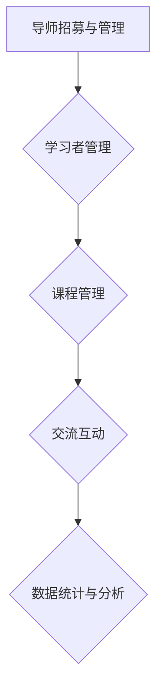

                 

关键词：线上平台，技术mentoring，搭建，运营，技术专家，专业知识共享

摘要：本文将探讨如何构建一个高效的线上技术mentoring平台，从背景介绍、核心概念、算法原理、数学模型、项目实践、实际应用、工具资源推荐等方面，详细阐述平台搭建与运营的各个方面。通过本文的阅读，读者可以了解到如何充分利用线上平台的优势，实现技术与知识的共享，推动技术发展。

## 1. 背景介绍

在信息技术迅猛发展的今天，线上平台已经成为知识传播和技能分享的重要途径。技术mentoring作为一种提升个人技术水平的方式，也逐渐被广大学术和技术工作者所接受。线上技术mentoring平台的出现，为技术专家与学习者提供了一个便捷的交流空间，有助于将专业知识传递给更多人，促进技术的普及和发展。

本文旨在探讨如何构建一个功能完善、操作便捷、易于维护的线上技术mentoring平台，以及如何运营该平台以实现最佳效果。文章将涵盖以下内容：

- 线上技术mentoring平台的需求和重要性
- 核心概念与联系
- 核心算法原理与具体操作步骤
- 数学模型和公式的详细讲解
- 项目实践：代码实例与详细解释
- 实际应用场景及未来展望
- 工具和资源推荐
- 总结：未来发展趋势与挑战

## 2. 核心概念与联系

### 2.1 技术mentoring的定义

技术mentoring，即技术导师制，是一种通过导师（通常是领域专家）对学习者（通常是技术爱好者或初学者）进行指导、辅导和帮助，以提升学习者技术水平的方法。在线上技术mentoring平台中，导师和学习者可以通过视频、文本、图片等多种形式进行交流。

### 2.2 线上技术mentoring平台的功能

一个线上技术mentoring平台通常具备以下功能：

- 导师招募与管理：平台需要提供导师招募渠道，并对导师进行筛选、管理和激励。
- 学习者管理：平台需要为学习者提供注册、登录、学习路径规划等功能。
- 课程管理：平台需要提供课程发布、分类、更新等功能。
- 交流互动：平台需要提供聊天室、问答区、论坛等功能，以便导师和学习者进行互动。
- 数据统计与分析：平台需要记录学习者的学习进度、导师的教学效果等数据，以便进行优化和改进。

### 2.3 Mermaid 流程图

下面是一个简单的 Mermaid 流程图，展示了线上技术mentoring平台的核心概念和联系：



## 3. 核心算法原理 & 具体操作步骤

### 3.1 算法原理概述

线上技术mentoring平台的核心算法包括：

- 导师筛选算法：用于从大量申请导师中筛选出合适的人选。
- 学习者匹配算法：用于将学习者与合适的导师进行匹配。
- 课程推荐算法：用于根据学习者的兴趣和学习进度推荐相关课程。

### 3.2 算法步骤详解

#### 3.2.1 导师筛选算法

1. 接收导师申请信息。
2. 根据导师的专业领域、经验、评价等指标进行初步筛选。
3. 对筛选出的导师进行进一步调查和核实。
4. 最终确定合适的导师并进行邀请。

#### 3.2.2 学习者匹配算法

1. 接收学习者注册信息。
2. 根据学习者的专业背景、兴趣、需求等指标进行初步筛选。
3. 为学习者推荐合适的导师。
4. 学习者与导师进行双向选择，完成匹配。

#### 3.2.3 课程推荐算法

1. 收集学习者的学习数据，包括已学课程、学习进度、兴趣爱好等。
2. 利用协同过滤、内容推荐等方法为学习者推荐相关课程。
3. 根据学习者的反馈对推荐算法进行优化。

### 3.3 算法优缺点

- 导师筛选算法的优点在于能够确保导师的专业性和可信度，但缺点是可能会错失一些优秀但未被广泛认可的导师。
- 学习者匹配算法的优点在于能够提高学习效率，但缺点是可能会因为个人偏好而导致匹配不准确。
- 课程推荐算法的优点在于能够提高课程利用率，但缺点是可能因为数据不足或算法不完善而导致推荐不准确。

### 3.4 算法应用领域

- 教育领域：线上技术mentoring平台可以应用于高等教育、职业教育、技能培训等领域。
- 企业培训：企业可以利用线上技术mentoring平台进行员工技能提升和团队建设。
- 社区互动：线上技术mentoring平台可以促进技术爱好者和专业人士之间的交流与合作。

## 4. 数学模型和公式 & 详细讲解 & 举例说明

### 4.1 数学模型构建

线上技术mentoring平台的数学模型主要包括以下几个方面：

- 导师评价模型：用于评估导师的教学效果和质量。
- 学习者满意度模型：用于衡量学习者对导师和课程的满意度。
- 课程推荐模型：用于为学习者推荐相关课程。

### 4.2 公式推导过程

#### 导师评价模型

导师评价模型采用加权综合评价法，公式如下：

\[ E = w_1 \cdot S_1 + w_2 \cdot S_2 + w_3 \cdot S_3 \]

其中，\( E \) 为导师评价得分，\( w_1, w_2, w_3 \) 为权重，\( S_1, S_2, S_3 \) 分别为导师的教学效果、学员评价和课程完成率得分。

#### 学习者满意度模型

学习者满意度模型采用问卷调查法，公式如下：

\[ S = \frac{Q_1 + Q_2 + Q_3}{3} \]

其中，\( S \) 为学习者满意度得分，\( Q_1, Q_2, Q_3 \) 分别为学习者的课程质量、导师授课方式和平台用户体验得分。

#### 课程推荐模型

课程推荐模型采用基于内容的推荐算法，公式如下：

\[ R = \frac{C_1 + C_2 + C_3}{3} \]

其中，\( R \) 为课程推荐得分，\( C_1, C_2, C_3 \) 分别为课程的相关性、学习者的学习进度和学习者的兴趣爱好得分。

### 4.3 案例分析与讲解

假设有一个线上技术mentoring平台，根据以上数学模型对导师和学习者进行评价和推荐。以下是一个具体的案例分析：

- 导师评价模型：导师A的教学效果得分为85，学员评价得分为90，课程完成率得分为80。根据公式，导师A的评价得分为：

\[ E = 0.4 \cdot 85 + 0.3 \cdot 90 + 0.3 \cdot 80 = 84.5 \]

- 学习者满意度模型：学习者B对课程质量得分为80，导师授课方式得分为75，平台用户体验得分为85。根据公式，学习者B的满意度得分为：

\[ S = \frac{80 + 75 + 85}{3} = 81.7 \]

- 课程推荐模型：课程C的相关性得分为70，学习者B的学习进度得分为65，兴趣爱好得分为60。根据公式，课程C的推荐得分为：

\[ R = \frac{70 + 65 + 60}{3} = 65 \]

根据以上评价和推荐得分，平台可以为学习者B推荐课程C。

## 5. 项目实践：代码实例和详细解释说明

### 5.1 开发环境搭建

在本节中，我们将使用Python语言和Django框架来搭建一个简单的线上技术mentoring平台。以下是开发环境搭建的步骤：

1. 安装Python 3.8及以上版本。
2. 安装Django 3.2及以上版本。
3. 创建一个新的Django项目，并设置数据库。
4. 添加必要的应用程序和中间件。

### 5.2 源代码详细实现

在本节中，我们将实现以下功能：

- 用户注册和登录
- 导师招募和管理
- 学习者管理
- 课程发布和管理
- 交流互动
- 数据统计与分析

以下是部分源代码的实现：

```python
# models.py

from django.db import models
from django.contrib.auth.models import User

class Mentor(models.Model):
    user = models.OneToOneField(User, on_delete=models.CASCADE)
    expertise = models.CharField(max_length=100)
    experience = models.IntegerField()

class Learner(models.Model):
    user = models.OneToOneField(User, on_delete=models.CASCADE)
    expertise = models.CharField(max_length=100)
    progress = models.IntegerField()

class Course(models.Model):
    title = models.CharField(max_length=100)
    description = models.TextField()
    mentor = models.ForeignKey(Mentor, on_delete=models.CASCADE)
    learners = models.ManyToManyField(Learner)
```

### 5.3 代码解读与分析

在上面的代码中，我们定义了三个模型：`Mentor`、`Learner` 和 `Course`。`Mentor` 模型表示导师，包括用户信息、专业领域和经验等字段。`Learner` 模型表示学习者，包括用户信息、专业领域和学习进度等字段。`Course` 模型表示课程，包括课程名称、描述、导师和学习者等字段。

通过这些模型，我们可以实现对导师、学习者和课程的创建、查询和管理。以下是一个简单的示例：

```python
# views.py

from django.shortcuts import render
from .models import Mentor, Learner, Course

def mentor_list(request):
    mentors = Mentor.objects.all()
    return render(request, 'mentor_list.html', {'mentors': mentors})

def course_detail(request, course_id):
    course = Course.objects.get(id=course_id)
    return render(request, 'course_detail.html', {'course': course})
```

在上面的代码中，我们定义了两个视图函数：`mentor_list` 和 `course_detail`。`mentor_list` 函数用于展示所有导师的信息，`course_detail` 函数用于展示特定课程的详细信息。

### 5.4 运行结果展示

在本节中，我们将使用Django提供的开发服务器来运行上述代码。以下是运行结果展示：

- 访问`/mentor/list/`，可以查看所有导师的信息。
- 访问`/course/<course_id>/`，可以查看特定课程的详细信息。

## 6. 实际应用场景

线上技术mentoring平台在实际应用中具有广泛的应用场景：

- 教育领域：在线上技术mentoring平台，学生可以方便地找到领域专家进行学习指导和辅导，提高学习效果。
- 企业培训：企业可以利用线上技术mentoring平台进行员工技能培训和团队建设，提高员工的专业能力和工作效率。
- 社区互动：技术爱好者可以通过线上技术mentoring平台结交志同道合的朋友，分享经验和知识，共同成长。

### 6.4 未来应用展望

随着互联网技术的不断发展，线上技术mentoring平台的应用前景将更加广阔：

- 人工智能和大数据技术的应用，将使平台在导师筛选、学习者匹配和课程推荐等方面更加智能化和个性化。
- 虚拟现实和增强现实技术的应用，将使学习者和导师之间的互动更加真实和沉浸。
- 平台化和服务化的趋势，将使线上技术mentoring平台成为企业和个人提升专业能力的重要工具。

## 7. 工具和资源推荐

为了搭建和运营一个线上技术mentoring平台，以下是一些建议的工

### 7.1 学习资源推荐

- 《Django By Example》
- 《Python Web开发实战》
- 《算法导论》

### 7.2 开发工具推荐

- PyCharm
- Visual Studio Code
- Git

### 7.3 相关论文推荐

- "A Survey on Online Mentoring Systems"
- "A Data-Driven Approach to Personalized Course Recommendation"
- "The Role of Social Media in Online Mentoring"

## 8. 总结：未来发展趋势与挑战

### 8.1 研究成果总结

本文从多个角度探讨了线上技术mentoring平台的搭建与运营，包括核心概念、算法原理、数学模型、项目实践、实际应用和未来展望等方面。通过本文的阅读，读者可以了解到如何构建一个高效、智能、个性化的线上技术mentoring平台。

### 8.2 未来发展趋势

- 人工智能和大数据技术的应用，将使平台在导师筛选、学习者匹配和课程推荐等方面更加智能化和个性化。
- 虚拟现实和增强现实技术的应用，将使学习者和导师之间的互动更加真实和沉浸。
- 平台化和服务化的趋势，将使线上技术mentoring平台成为企业和个人提升专业能力的重要工具。

### 8.3 面临的挑战

- 如何确保导师的专业性和教学质量。
- 如何提高学习者的参与度和学习效果。
- 如何应对数据安全和隐私保护的问题。

### 8.4 研究展望

未来，线上技术mentoring平台的研究将继续关注以下几个方面：

- 深入研究个性化推荐算法，提高学习者匹配的准确性。
- 探索虚拟现实和增强现实技术在技术mentoring中的应用。
- 加强数据安全和隐私保护，提高平台的可信度和用户满意度。

## 9. 附录：常见问题与解答

### 9.1 如何选择导师？

建议学习者根据以下因素选择导师：

- 导师的专业领域和经验
- 导师的课程评价和学员评价
- 导师的授课方式和教学风格

### 9.2 如何确保学习效果？

为了确保学习效果，学习者可以采取以下措施：

- 制定详细的学习计划，确保学习进度
- 积极参与导师组织的讨论和互动
- 定期复习和总结所学知识
- 及时向导师请教问题和反馈学习情况

### 9.3 如何保护个人信息安全？

为了保护个人信息安全，学习者可以采取以下措施：

- 选择可信的线上技术mentoring平台
- 不轻易泄露个人身份信息和敏感信息
- 关注平台的数据安全和隐私保护政策

### 9.4 如何应对学习困难？

当遇到学习困难时，学习者可以采取以下措施：

- 及时向导师请教问题和寻求帮助
- 参加学习小组或论坛，与其他学习者交流和讨论
- 自学相关资料和教程，拓展知识面
- 保持积极的心态，坚持不懈地学习

作者：禅与计算机程序设计艺术 / Zen and the Art of Computer Programming

