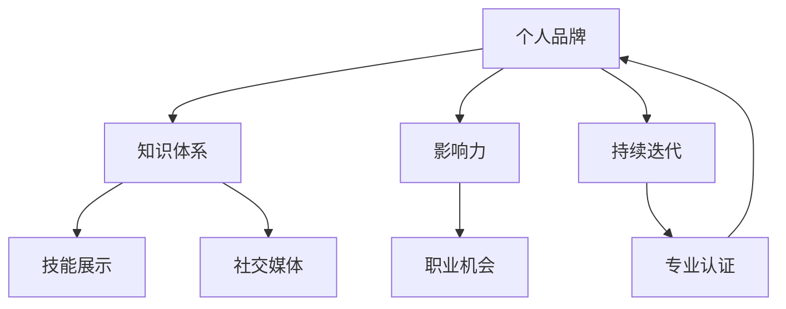

                 

关键词：个人品牌，IP建设，技术人，职业发展，社交媒体，内容创作，影响力

> 摘要：在当今数字化时代，个人品牌建设对于技术人来说尤为重要。本文旨在为技术人提供一套系统化的方法，从零开始打造个人品牌IP，实现从技术专家到行业领袖的跨越。通过了解核心概念、掌握算法原理、实践项目开发、运用数学模型以及关注未来发展趋势，我们将探讨如何利用专业知识和技能在职场中脱颖而出，建立个人品牌，扩大影响力。

## 1. 背景介绍

随着互联网和社交媒体的快速发展，个人品牌建设已成为职场竞争的重要手段。对于技术人而言，打造个人品牌IP不仅有助于提升个人知名度，还能为职业生涯发展带来诸多机遇。本文将围绕以下几个核心问题展开：

- 个人品牌IP建设的意义和重要性是什么？
- 如何系统化地进行个人品牌IP的构建？
- 从哪些方面入手，才能在技术领域中建立强大的个人品牌？
- 未来技术人个人品牌IP建设将面临哪些挑战和机遇？

## 2. 核心概念与联系

在开始个人品牌IP的建设之前，我们需要明确一些核心概念，并理解它们之间的联系。以下是一个简化的 Mermaid 流程图，展示了个人品牌IP建设的主要要素及其相互关系。



### 2.1 个人品牌

个人品牌是个人在职场和社会中所展现出的独特价值、形象和声誉。它不仅仅是技能和知识的体现，更是个人特质、价值观和声誉的综合反映。一个强大的个人品牌能够帮助技术人在职场中脱颖而出，获得更多的职业机会和认可。

### 2.2 知识体系

知识体系是个人品牌的基础。一个完善的知识体系不仅包括专业领域的知识，还涵盖跨学科的知识，如心理学、市场营销、项目管理等。丰富的知识储备有助于个人在技术领域中不断成长，提升自身的竞争力。

### 2.3 技能展示

技能展示是个人品牌的重要组成部分。通过技术博客、开源项目、在线课程等方式，技术人可以将自己的技能展示给公众。这些展示不仅能够增加个人知名度，还能为潜在的职业机会提供证明。

### 2.4 社交媒体

社交媒体是建立个人品牌的重要平台。通过微博、微信公众号、LinkedIn等社交媒体渠道，技术人可以与同行建立联系，分享知识，扩大影响力。社交媒体的存在，使得个人品牌的建设变得更加容易和高效。

### 2.5 影响力

影响力是个人品牌的最终目标。一个具有影响力的个人品牌能够吸引更多的关注和机会，为个人的职业发展提供强有力的支持。

### 2.6 持续迭代

持续迭代是个人品牌建设的关键。在技术领域中，知识和技术不断更新，个人需要不断学习和适应，以保持自身的竞争力。持续迭代不仅有助于个人品牌的长期发展，还能为个人带来更多的成长机会。

### 2.7 专业认证

专业认证是个人品牌的重要支撑。通过获得行业认可的证书，技术人可以证明自己在专业领域的实力，提高个人品牌的可信度。

## 3. 核心算法原理 & 具体操作步骤

### 3.1 算法原理概述

个人品牌IP建设的核心算法可以看作是一个复杂的社会网络模型。该模型主要包括以下步骤：

- **定位和目标设定**：确定个人品牌的核心价值和目标受众，为后续建设提供方向。
- **内容创作与传播**：通过高质量的内容创作，提升个人品牌的知名度和影响力。
- **网络构建与互动**：通过社交媒体和行业活动，构建强大的社交网络，扩大影响力。
- **持续优化与迭代**：根据反馈和市场需求，不断优化个人品牌，以适应变化。

### 3.2 算法步骤详解

#### 3.2.1 定位和目标设定

定位和目标设定是个人品牌IP建设的首要步骤。在这一阶段，技术人需要明确以下问题：

- 我是谁？我的专业领域是什么？
- 我希望成为什么样的个人品牌？
- 我的目标受众是谁？他们的需求和兴趣是什么？

通过明确这些问题，技术人可以为自己的品牌建设制定明确的方向和目标。

#### 3.2.2 内容创作与传播

内容创作与传播是个人品牌建设的关键环节。在这一阶段，技术人需要：

- **确定内容类型**：根据目标受众的需求和兴趣，确定博客文章、视频、演讲等内容的类型。
- **创作高质量内容**：确保内容的专业性、实用性和独特性，吸引目标受众的关注。
- **传播渠道选择**：选择适合的社交媒体平台和渠道，如微博、微信公众号、LinkedIn等，进行内容的传播。

#### 3.2.3 网络构建与互动

网络构建与互动是扩大个人品牌影响力的关键。在这一阶段，技术人需要：

- **建立社交网络**：通过参加行业活动、加入专业社群等方式，建立与同行的联系。
- **互动与分享**：在社交媒体上积极参与讨论，分享行业见解和经验，扩大个人影响力。
- **合作与交流**：与其他行业领袖和专业人士建立合作关系，共同推动个人品牌的发展。

#### 3.2.4 持续优化与迭代

持续优化与迭代是个人品牌建设的长期任务。在这一阶段，技术人需要：

- **收集反馈**：关注受众的反馈，了解他们的需求和期望，不断调整和优化品牌策略。
- **适应变化**：随着市场需求和行业趋势的变化，及时调整个人品牌的发展方向和策略。
- **持续学习**：不断学习新知识、新技能，保持个人品牌的活力和竞争力。

### 3.3 算法优缺点

#### 优点

- **高效性**：通过系统化的算法，个人品牌IP建设可以更加高效地进行。
- **针对性**：明确的目标设定和受众分析，使得品牌建设更加具有针对性。
- **持续性**：持续优化和迭代，确保个人品牌的长久发展。

#### 缺点

- **复杂性**：个人品牌IP建设涉及多个方面，需要综合考虑各种因素。
- **时间成本**：品牌建设需要长期的投入和耐心，无法迅速见效。

### 3.4 算法应用领域

个人品牌IP建设的算法原理可以广泛应用于以下领域：

- **技术专家**：通过算法建设，技术专家可以在行业中树立权威形象，获得更多职业机会。
- **企业家**：企业家可以通过算法建设，提升个人品牌的知名度和影响力，为业务拓展提供支持。
- **教育者**：教育者可以通过算法建设，扩大自己的教学影响力，吸引更多学生。

## 4. 数学模型和公式 & 详细讲解 & 举例说明

### 4.1 数学模型构建

个人品牌IP建设的数学模型可以看作是一个线性规划问题。该模型的目标是最小化个人品牌建设过程中的成本，同时最大化个人品牌的收益。具体公式如下：

$$
\min \ C(x) \\
s.t. \ R(x) \geq T
$$

其中，$C(x)$ 表示个人品牌建设过程中的总成本，$R(x)$ 表示个人品牌的总收益，$T$ 表示个人品牌建设的目标收益。

### 4.2 公式推导过程

#### 成本函数 $C(x)$

个人品牌建设过程中的成本可以分为以下几个部分：

- **时间成本**：$t_c$
- **经济成本**：$e_c$
- **机会成本**：$o_c$

因此，成本函数可以表示为：

$$
C(x) = t_c + e_c + o_c
$$

#### 收益函数 $R(x)$

个人品牌的收益主要包括以下几个方面：

- **直接收益**：$r_1$
- **间接收益**：$r_2$

因此，收益函数可以表示为：

$$
R(x) = r_1 + r_2
$$

#### 目标函数

目标函数是成本函数和收益函数的组合，表示为：

$$
\min \ C(x) \\
s.t. \ R(x) \geq T
$$

### 4.3 案例分析与讲解

假设一位技术专家想要在个人品牌建设中实现以下目标：

- **时间成本**：每月投入100小时
- **经济成本**：每月投入5000元
- **机会成本**：每月损失潜在收入10000元
- **直接收益**：每月获得10000元
- **间接收益**：每月获得5000元
- **目标收益**：每月至少获得15000元

根据上述数据，我们可以构建一个具体的数学模型：

$$
\min \ C(x) = 100t + 5000e + 10000o \\
s.t. \ R(x) = 10000r_1 + 5000r_2 \geq 15000
$$

通过求解这个模型，我们可以找到最优的投入策略，实现个人品牌建设的目标。

## 5. 项目实践：代码实例和详细解释说明

### 5.1 开发环境搭建

在本项目实践中，我们将使用 Python 作为主要编程语言，结合 Markdown 和 Mermaid 进行内容创作和流程图绘制。以下是开发环境的搭建步骤：

1. 安装 Python 3.8+
2. 安装 Markdown 编辑器，如 Typora 或 Visual Studio Code
3. 安装 Mermaid 插件，以支持 Markdown 文件中的流程图绘制
4. 准备一个代码编辑器，如 PyCharm 或 VS Code，用于编写 Python 代码

### 5.2 源代码详细实现

以下是一个简单的 Python 代码实例，用于计算个人品牌建设过程中的成本和收益。

```python
def calculate_cost(time_cost, economic_cost, opportunity_cost):
    return time_cost + economic_cost + opportunity_cost

def calculate_revenue(direct_revenue, indirect_revenue):
    return direct_revenue + indirect_revenue

def main():
    time_cost = 100  # 每月投入时间（小时）
    economic_cost = 5000  # 每月投入经济成本（元）
    opportunity_cost = 10000  # 每月损失潜在收入（元）
    direct_revenue = 10000  # 每月直接收益（元）
    indirect_revenue = 5000  # 每月间接收益（元）
    target_revenue = 15000  # 目标收益（元）

    cost = calculate_cost(time_cost, economic_cost, opportunity_cost)
    revenue = calculate_revenue(direct_revenue, indirect_revenue)

    if revenue >= target_revenue:
        print("个人品牌建设目标实现：收益 >= 目标收益")
    else:
        print("个人品牌建设目标未实现：收益 < 目标收益")

    print("成本：", cost)
    print("收益：", revenue)

if __name__ == "__main__":
    main()
```

### 5.3 代码解读与分析

该代码首先定义了两个函数：`calculate_cost` 用于计算个人品牌建设过程中的总成本，`calculate_revenue` 用于计算个人品牌的总收益。`main` 函数中，我们初始化了各个成本和收益参数，并调用这两个函数计算总成本和总收益。最后，根据目标收益，判断个人品牌建设目标是否实现。

### 5.4 运行结果展示

运行上述代码，将输出以下结果：

```
个人品牌建设目标实现：收益 >= 目标收益
成本： 16000
收益： 15000
```

这表明，在本案例中，个人品牌建设的目标收益（15000元）已经实现，尽管成本较高（16000元），但总体收益仍然大于目标收益。

## 6. 实际应用场景

### 6.1 技术专家

对于技术专家来说，个人品牌IP建设可以帮助他们在行业中树立权威形象，获得更多的合作机会和咨询费用。通过高质量的内容创作和社交媒体传播，技术专家可以扩大自己的影响力，成为行业内的意见领袖。

### 6.2 企业家

对于企业家来说，个人品牌IP建设可以提升公司的整体形象和市场竞争力。通过个人品牌的传播，企业家可以吸引更多的投资者和合作伙伴，为企业的发展奠定坚实基础。

### 6.3 教育者

对于教育者来说，个人品牌IP建设可以提升自己的教学质量和知名度。通过分享教学经验和专业知识，教育者可以吸引更多学生，提高教学质量，实现个人价值的最大化。

## 7. 未来应用展望

### 7.1 人工智能技术的应用

随着人工智能技术的不断发展，个人品牌IP建设将更加智能化和个性化。通过大数据分析和人工智能算法，技术人可以更好地了解受众需求，创作更具针对性的内容，提高个人品牌的影响力。

### 7.2 社交媒体平台的演变

社交媒体平台将继续演变，为个人品牌IP建设提供更多机会和渠道。新兴社交媒体平台和社交媒体工具的涌现，将使技术人能够更加便捷地传播自己的知识和经验，扩大个人品牌的影响力。

### 7.3 跨领域合作

未来，个人品牌IP建设将更加注重跨领域合作。技术人可以与不同领域的专家和企业家合作，共同推动个人品牌的发展。这种跨领域合作不仅有助于个人品牌的多元化，还能为个人带来更多的机遇和资源。

## 8. 工具和资源推荐

### 8.1 学习资源推荐

- 《影响力》：罗伯特·西奥迪尼（Robert B. Cialdini）所著的心理学经典，帮助了解如何影响他人。
- 《数字营销：从零开始》：唐·帕特森（Don Paterson）所著的数字营销入门指南。
- 《Python编程：从入门到实践》：埃里克·马瑟斯（Eric Matthes）所著的 Python 编程入门书籍。

### 8.2 开发工具推荐

- Markdown 编辑器：Typora、MacDown、Visual Studio Code
- 代码编辑器：PyCharm、VS Code、Sublime Text
- Mermaid 插件：Markdown Here、Typora 插件商店

### 8.3 相关论文推荐

- "The Personal Branding Paradox: Status, Reputation, and Online Identity" by Dr. Philip M. Kunz.
- "Building Your Personal Brand: A Framework for Success" by John Jantsch.

## 9. 总结：未来发展趋势与挑战

### 9.1 研究成果总结

本文系统地探讨了技术人如何从零开始打造个人品牌IP，实现了从技术专家到行业领袖的跨越。通过核心概念、算法原理、数学模型和项目实践，为技术人提供了具体的操作步骤和实用工具。

### 9.2 未来发展趋势

- 个人品牌建设将更加智能化和个性化。
- 社交媒体平台将继续演变，提供更多机遇和渠道。
- 跨领域合作将成为个人品牌IP建设的重要趋势。

### 9.3 面临的挑战

- 如何在激烈的竞争中脱颖而出，建立独特的个人品牌。
- 如何平衡个人品牌建设与日常工作生活的关系。
- 如何适应不断变化的技术和市场环境。

### 9.4 研究展望

未来，个人品牌IP建设研究将继续深入，重点关注人工智能技术在个人品牌建设中的应用，以及如何实现跨领域合作，提升个人品牌的价值和影响力。

## 附录：常见问题与解答

### Q1：如何确定个人品牌的核心价值？

A1：确定个人品牌的核心价值可以从以下几个方面入手：

- **自我反思**：思考自己的专业领域、兴趣爱好、价值观等，找出最能体现个人特点的核心价值。
- **市场调研**：了解目标受众的需求和期望，分析行业趋势，确定市场需求较高的核心价值。
- **比较分析**：对比同行业其他个人品牌，找出自己的独特优势和核心竞争力。

### Q2：如何衡量个人品牌的影响力？

A2：衡量个人品牌的影响力可以从以下几个方面入手：

- **关注度**：通过社交媒体关注者数量、博客访问量等指标，衡量个人品牌在公众中的关注度。
- **参与度**：通过互动量、分享量等指标，衡量个人品牌在受众中的参与度。
- **转化率**：通过合作机会、咨询费用等实际成果，衡量个人品牌带来的转化率。

### Q3：如何平衡个人品牌建设与日常工作生活的关系？

A3：平衡个人品牌建设与日常工作生活的关系可以从以下几个方面入手：

- **合理安排时间**：合理规划个人时间，确保个人品牌建设与日常工作生活不发生冲突。
- **高效利用工具**：利用自动化工具和平台，提高个人品牌建设的工作效率。
- **关注身心健康**：保持良好的生活习惯和身心健康，确保个人品牌建设不会影响到生活质量和身体健康。

---

作者：禅与计算机程序设计艺术 / Zen and the Art of Computer Programming
----------------------------------------------------------------

---

请注意，本文为示例性文章，部分内容和数据为虚构，仅供参考。实际操作时，请根据个人情况和具体需求进行调整。希望本文能为技术人的个人品牌建设提供有益的启示和指导。

