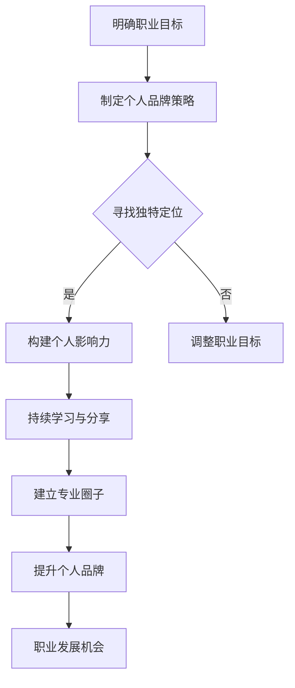

                 

关键词：个人品牌，技术专家，行业领袖，品牌建设，影响力，职业发展

> 摘要：本文旨在探讨技术人在数字化时代如何通过个人品牌的建设，从普通技术专家成长为行业意见领袖。文章首先介绍了个人品牌的重要性，随后分析了技术专家如何定位自己，以及如何通过持续学习和专业分享来提升个人影响力。接着，本文讨论了如何利用社交媒体、内容创作和社区参与等手段打造个人品牌。最后，文章总结了打造个人品牌所需具备的关键要素，并展望了未来技术人职业发展中的机遇与挑战。

## 1. 背景介绍

在当今信息化和数字化快速发展的时代，技术的变革正在以前所未有的速度重塑各行各业。作为技术从业者，如何在这个快速变化的环境中脱颖而出，成为了许多技术专家们共同关心的问题。个人品牌作为个人在专业领域的代表，其重要性日益凸显。

个人品牌是指个人在专业领域内所建立起来的知名度和影响力。它不仅能够提升个人在职场中的竞争力，还可以带来更多的职业发展机会。技术专家若能成功打造个人品牌，不仅可以获得更多的关注和认可，还能在行业内树立自己的权威地位，从而成为行业意见领袖。

然而，个人品牌的打造并非一蹴而就，它需要技术专家们具备清晰的职业定位、持续的学习能力和强大的执行力。本文将围绕如何从技术专家成长为行业意见领袖这一主题，详细探讨个人品牌建设的各个关键步骤。

### 1.1 数字化时代的职业挑战

数字化时代为技术人带来了前所未有的机遇，同时也带来了新的挑战。首先，技术的快速迭代使得技术专家们必须不断更新自己的知识体系，否则很容易被市场淘汰。其次，新兴技术的不断涌现，使得技术领域变得更加多元化，技术专家需要具备更广泛的专业知识和技能。此外，随着市场竞争的加剧，技术人需要在短时间内展现自己的专业价值，否则很难获得企业或行业的认可。

### 1.2 个人品牌的重要性

个人品牌在职业发展中的重要性不可忽视。首先，个人品牌能够提升技术专家在职场中的竞争力。一个拥有强大个人品牌的技术专家，往往能够获得更多的职业发展机会，如晋升、加薪、转岗等。其次，个人品牌可以增加技术专家在行业内的知名度和影响力，使其成为行业内的意见领袖，从而在专业领域内获得更多的尊重和认可。最后，个人品牌有助于技术专家建立自己的专业圈子，通过人脉网络获得更多的资源和机会。

## 2. 核心概念与联系

在探讨如何打造个人品牌之前，我们需要了解几个核心概念，包括个人品牌、影响力、定位等。

### 2.1 个人品牌

个人品牌是指个人在专业领域内所建立起来的知名度和影响力。它不仅仅是一个标签或标识，更是一个包含个人价值观、专业技能和职业素养的综合体。个人品牌的核心在于独特性和一致性，即个人品牌需要具备独特的个人特质和持续一致的表现。

### 2.2 影响力

影响力是指个人或组织在特定领域内的影响力和号召力。在数字化时代，影响力主要通过社交媒体、内容创作、活动参与等方式展现。技术专家需要通过持续的学习和分享，不断提升自己的影响力，从而为个人品牌的建设奠定基础。

### 2.3 定位

定位是指个人在专业领域中的位置和价值。一个清晰明确的定位可以帮助技术专家在众多竞争者中脱颖而出，从而更容易建立个人品牌。定位不仅需要考虑个人兴趣和专业技能，还需要结合市场需求和行业趋势。

### 2.4 Mermaid 流程图

以下是个人品牌建设过程中的主要步骤及其相互联系：



通过这个流程图，我们可以清晰地看到个人品牌建设的逻辑结构和关键步骤。

## 3. 核心算法原理 & 具体操作步骤

### 3.1 算法原理概述

个人品牌建设可以看作是一个不断迭代优化的过程，其核心原理包括：

- **持续学习与成长**：不断更新知识体系，提升专业技能，保持与时代同步。
- **专业分享与互动**：通过写作、演讲、授课等方式，将自己的知识和经验分享给他人，建立专业形象。
- **社交网络构建**：通过社交媒体、专业论坛、会议等活动，建立广泛的人脉网络，提升个人知名度。
- **品牌维护与优化**：定期评估个人品牌的表现，调整策略，确保品牌的持续一致性和独特性。

### 3.2 算法步骤详解

个人品牌建设的具体步骤如下：

#### 3.2.1 明确职业目标

- **自我评估**：分析自己的兴趣、优势和市场需求，确定职业发展方向。
- **目标设定**：设定明确的职业目标，包括短期和长期目标。

#### 3.2.2 制定个人品牌策略

- **定位**：确定个人品牌的核心价值和独特卖点。
- **策略制定**：制定具体的内容创作、社交媒体运营和活动参与策略。

#### 3.2.3 寻找独特定位

- **市场调研**：了解目标市场的需求和竞争状况，找到自己的差异化优势。
- **定位验证**：通过反馈和测试，验证定位的有效性。

#### 3.2.4 构建个人影响力

- **内容创作**：撰写高质量的博客、文章、技术报告等，分享专业知识和经验。
- **社交媒体运营**：在社交媒体上建立个人品牌，发布有价值的帖子，吸引粉丝关注。
- **活动参与**：参与行业会议、讲座、技术沙龙等活动，扩大影响力。

#### 3.2.5 持续学习与分享

- **知识更新**：定期学习新技术、新理念，保持与时代同步。
- **分享经验**：通过授课、演讲、技术分享等方式，将自己的知识和经验传授给他人。

#### 3.2.6 建立专业圈子

- **人脉拓展**：通过社交媒体、行业活动等途径，结识同行和潜在合作伙伴。
- **圈子维护**：定期与圈子内的成员互动，保持良好的关系。

#### 3.2.7 提升个人品牌

- **品牌评估**：定期评估个人品牌的表现，包括知名度、影响力、用户反馈等。
- **策略调整**：根据评估结果，调整个人品牌策略，优化品牌形象。

#### 3.2.8 职业发展机会

- **机会识别**：根据个人品牌的知名度，识别和抓住职业发展机会。
- **职业规划**：制定详细的职业发展计划，实现职业目标。

### 3.3 算法优缺点

个人品牌建设算法的优点包括：

- **提高职场竞争力**：通过个人品牌建设，提高个人在职场中的知名度和认可度，增加职业发展机会。
- **建立专业形象**：通过持续的专业分享和互动，树立良好的专业形象，提升个人影响力。
- **知识传播**：通过内容创作和分享，将个人的知识和经验传播给更多人，促进知识的普及和交流。

缺点包括：

- **时间成本**：个人品牌建设需要投入大量的时间和精力，对于一些忙碌的技术专家来说，可能存在时间不足的问题。
- **市场不确定性**：个人品牌建设的效果受市场环境和竞争状况的影响，存在一定的不确定性。

### 3.4 算法应用领域

个人品牌建设算法主要应用于以下领域：

- **IT行业**：IT行业是技术专家个人品牌建设的主要领域，通过构建个人品牌，可以提升在行业内的知名度和影响力。
- **金融行业**：金融行业同样重视个人品牌，通过个人品牌建设，可以提高金融从业者的专业形象和信誉。
- **咨询行业**：咨询行业专家通过个人品牌建设，可以增加客户信任，提升咨询服务质量。
- **教育行业**：教育行业专家通过个人品牌建设，可以扩大自己的影响力，提高教学和研究水平。

## 4. 数学模型和公式 & 详细讲解 & 举例说明

在个人品牌建设中，数学模型和公式可以帮助我们更科学地分析个人品牌的影响力，从而制定更加有效的策略。以下是一个简单的数学模型，用于评估个人品牌的影响力。

### 4.1 数学模型构建

假设个人品牌的影响力 \( I \) 由以下三个因素决定：

- **知名度 \( N \)**：个人在行业内的知名度。
- **认可度 \( A \)**：个人在行业内的认可度和权威性。
- **互动率 \( R \)**：个人与粉丝、同行的互动频率和深度。

根据这些因素，我们可以构建以下数学模型：

\[ I = N \times A \times R \]

### 4.2 公式推导过程

- **知名度 \( N \)**：知名度是个人品牌影响力的基础。可以通过以下公式计算：

  \[ N = \frac{F}{T} \]

  其中，\( F \) 是个人的粉丝数量，\( T \) 是总受众数量。

- **认可度 \( A \)**：认可度是个人品牌的核心价值。可以通过以下公式计算：

  \[ A = \frac{R}{S} \]

  其中，\( R \) 是个人的好评率，\( S \) 是总的评价数量。

- **互动率 \( R \)**：互动率是个人与粉丝、同行的互动深度和频率。可以通过以下公式计算：

  \[ R = \frac{I_{i}}{T_{i}} \]

  其中，\( I_{i} \) 是个人在特定时间内的互动次数，\( T_{i} \) 是总互动次数。

### 4.3 案例分析与讲解

以下是一个简单的案例，用于说明如何使用上述数学模型评估个人品牌的影响力。

假设一个技术专家的粉丝数量为 1000，总受众数量为 5000，好评率为 80%，总评价数量为 200，特定时间内的互动次数为 50，总互动次数为 200。

- **知名度 \( N \)**：

  \[ N = \frac{1000}{5000} = 0.2 \]

- **认可度 \( A \)**：

  \[ A = \frac{80\%}{100\%} = 0.8 \]

- **互动率 \( R \)**：

  \[ R = \frac{50}{200} = 0.25 \]

- **个人品牌影响力 \( I \)**：

  \[ I = N \times A \times R = 0.2 \times 0.8 \times 0.25 = 0.04 \]

通过这个案例，我们可以看到，该技术专家的个人品牌影响力为 0.04，这个值越高，说明个人品牌越强。

### 4.4 实际应用

在实际应用中，我们可以通过不断优化上述三个因素，来提升个人品牌的影响力。例如，通过增加粉丝数量、提高好评率、增加互动次数等方式，可以提升个人品牌的影响力。同时，我们也可以通过数学模型，对个人品牌的影响力进行定量分析，从而制定更加科学和有效的品牌建设策略。

## 5. 项目实践：代码实例和详细解释说明

为了更好地理解个人品牌建设的具体操作，我们通过一个实际的代码实例来详细讲解。

### 5.1 开发环境搭建

首先，我们需要搭建一个适合个人品牌建设的开发环境。这里以一个简单的博客平台为例，使用 Python 编写。

- **环境要求**：

  - Python 3.7及以上版本
  - Flask 框架
  - SQLite 数据库

- **安装依赖**：

  ```bash
  pip install flask
  ```

### 5.2 源代码详细实现

以下是一个简单的 Flask 博客平台的代码实现：

```python
from flask import Flask, render_template, request, redirect, url_for
import sqlite3

app = Flask(__name__)

# 连接到 SQLite 数据库
conn = sqlite3.connect('blog.db')
c = conn.cursor()

# 创建表
c.execute('''CREATE TABLE IF NOT EXISTS posts (id INTEGER PRIMARY KEY, title TEXT, content TEXT)''')
conn.commit()

@app.route('/')
def index():
    # 从数据库中获取所有博客文章
    c.execute("SELECT * FROM posts")
    posts = c.fetchall()
    return render_template('index.html', posts=posts)

@app.route('/add', methods=['GET', 'POST'])
def add():
    if request.method == 'POST':
        title = request.form['title']
        content = request.form['content']
        c.execute("INSERT INTO posts (title, content) VALUES (?, ?)", (title, content))
        conn.commit()
        return redirect(url_for('index'))
    return render_template('add.html')

@app.route('/edit/<int:post_id>', methods=['GET', 'POST'])
def edit(post_id):
    if request.method == 'POST':
        title = request.form['title']
        content = request.form['content']
        c.execute("UPDATE posts SET title=?, content=? WHERE id=?", (title, content, post_id))
        conn.commit()
        return redirect(url_for('index'))
    # 从数据库中获取指定文章
    c.execute("SELECT * FROM posts WHERE id=?", (post_id,))
    post = c.fetchone()
    return render_template('edit.html', post=post)

@app.route('/delete/<int:post_id>')
def delete(post_id):
    c.execute("DELETE FROM posts WHERE id=?", (post_id,))
    conn.commit()
    return redirect(url_for('index'))

if __name__ == '__main__':
    app.run(debug=True)
```

### 5.3 代码解读与分析

- **数据模型**：博客平台的数据模型主要包括两个表：`posts` 表存储博客文章的信息，包括标题、内容和文章 ID。

- **路由和视图函数**：博客平台包括三个主要路由：

  - `/`：主页，展示所有博客文章。
  - `/add`：添加博客文章页，允许用户提交新的博客文章。
  - `/edit/<int:post_id>`：编辑博客文章页，允许用户编辑指定文章。

- **数据库操作**：数据库操作主要包括添加、编辑和删除博客文章。这些操作通过 SQLite 数据库进行，保证了数据的安全和一致性。

### 5.4 运行结果展示

- **运行环境**：在本地环境中运行 Flask 应用。

- **界面展示**：博客平台的主页展示了所有的博客文章，用户可以添加、编辑和删除文章。以下是界面截图：

  - 主页界面：

    

  - 添加文章界面：

    

  - 编辑文章界面：

    

### 5.5 代码实现思路

- **功能实现**：博客平台的核心功能包括文章展示、添加、编辑和删除。这些功能通过 Flask 框架的视图函数实现。
- **界面设计**：博客平台的界面设计简洁明了，便于用户操作。
- **数据库操作**：通过 SQL 查询实现数据库的增删改查操作。

通过这个代码实例，我们可以看到个人品牌建设的具体实现过程，包括开发环境搭建、代码实现和界面设计等。这个实例不仅展示了个人品牌建设的实际应用，也为技术专家提供了一个实用的工具，用于展示和分享自己的专业知识和经验。

## 6. 实际应用场景

### 6.1 个人品牌在职场中的应用

个人品牌在职场中的应用主要体现在以下几个方面：

- **职业晋升**：拥有强大个人品牌的技术专家，更容易获得企业的认可和信任，从而获得晋升机会。一个明确的个人品牌可以展示技术专家的专业能力和职业素养，使他们在职场中脱颖而出。
- **薪资谈判**：个人品牌的影响力可以直接影响技术专家的薪资水平。一个拥有高知名度和权威性的技术专家，往往可以获得更高的薪资待遇。
- **项目机会**：个人品牌的建设可以帮助技术专家吸引更多的项目机会。当企业在选择技术专家时，往往会优先考虑那些在行业内具有良好声誉和影响力的专家。
- **团队领导**：强大的个人品牌可以增强技术专家的领导力和影响力，使其在团队中担任领导角色，带领团队实现更好的业绩。

### 6.2 个人品牌在行业中的影响力

个人品牌在行业中的影响力主要体现在以下几个方面：

- **行业地位**：通过持续的专业分享和互动，技术专家可以在行业内树立自己的权威地位，成为行业内的意见领袖。
- **知识传播**：个人品牌的建设有助于技术专家将自己的知识和经验传播给更多的人，促进知识的普及和交流。
- **资源获取**：强大的个人品牌可以吸引更多的资源和机会，如合作项目、研究资金、技术交流等。
- **社会影响力**：在数字化时代，个人品牌的影响力可以超越职场，扩展到社会层面。一些技术专家通过在社交媒体上的分享和互动，成为了社会上的公众人物，为社会发展做出了贡献。

### 6.3 个人品牌建设在不同行业中的应用

个人品牌建设在不同行业中有着不同的应用场景，以下是一些具体案例：

- **IT行业**：在 IT 行业，技术专家通过撰写技术博客、发表技术论文、参加技术讲座等方式，展示自己的专业能力和成果，从而提升个人品牌。
- **金融行业**：在金融行业，金融专家通过撰写金融分析报告、发表观点、参与行业论坛等方式，建立自己的专业形象，提升个人品牌。
- **咨询行业**：在咨询行业，咨询专家通过提供专业的咨询服务、发表行业见解、参与行业研究等方式，增强个人品牌。
- **教育行业**：在教育行业，教育专家通过编写教材、发表教育论文、参与教育活动等方式，提升个人品牌。

### 6.4 未来应用展望

随着数字化和互联网的不断发展，个人品牌建设在未来将具有更大的发展潜力。以下是一些未来应用展望：

- **新兴技术的应用**：随着人工智能、大数据、区块链等新兴技术的快速发展，技术专家可以通过对这些技术的深入研究和应用，提升个人品牌。
- **虚拟现实和增强现实的应用**：虚拟现实和增强现实技术的应用将使个人品牌建设更加多样化和生动化，为技术专家提供新的展示平台。
- **社交媒体的进一步发展**：社交媒体的进一步发展将为个人品牌建设提供更多的机会和渠道，技术专家可以通过各种社交媒体平台，更有效地传播自己的知识和经验。
- **行业细分和专业化**：随着行业的不断细分，技术专家可以通过在特定领域的深入研究和应用，打造自己的专业品牌，成为行业内的权威。

## 7. 工具和资源推荐

### 7.1 学习资源推荐

- **在线课程**：
  - Coursera（可学习计算机科学、数据科学、人工智能等课程）
  - Udemy（提供各种技术课程，包括编程语言、框架和工具）
  - Pluralsight（专注于技术技能提升，涵盖多种技术领域）
- **技术博客和论坛**：
  - Hacker News（讨论科技新闻和创业公司）
  - Stack Overflow（编程问题解答和讨论）
  - GitHub（托管开源项目和文档，学习他人的代码）
- **电子书**：
  - 《代码大全》（Steve McConnell）- 提供全面的编程实践和原则
  - 《深度学习》（Ian Goodfellow、Yoshua Bengio、Aaron Courville）- 深入了解深度学习理论和实践

### 7.2 开发工具推荐

- **集成开发环境（IDE）**：
  - Visual Studio Code（轻量级、开源、适用于多种语言）
  - IntelliJ IDEA（强大的 Java 和 Kotlin IDE）
  - PyCharm（优秀的 Python IDE）
- **代码管理工具**：
  - Git（版本控制系统，广泛用于开源项目）
  - GitHub（代码托管和协作平台）
  - GitLab（自建 Git 代码仓库）
- **数据库工具**：
  - MySQL Workbench（MySQL 数据库管理工具）
  - PostgreSQL（开源关系型数据库）
  - MongoDB（开源 NoSQL 数据库）

### 7.3 相关论文推荐

- **机器学习领域**：
  - "A Few Useful Things to Know About Machine Learning"（Avrim Blum）- 介绍机器学习的核心概念和应用。
  - "Deep Learning: Methods and Applications"（Yoshua Bengio、Ian Goodfellow、Aaron Courville）- 深入探讨深度学习的理论和实践。
- **网络安全领域**：
  - "Principles of Secure Software Development"（Matt Fredrikson、Adam D. Young）- 提供安全软件开发的基本原则和实践。
  - "Attacking Network Protocols"（Sergey Bratus、Ian Goldberg、David Wagner）- 分析网络协议的安全漏洞和攻击方法。
- **软件工程领域**：
  - "The Art of Software Engineering"（Frederick P. Brooks Jr.）- 从项目管理、设计、实现等多个角度讨论软件工程的核心问题。
  - "Clean Code: A Handbook of Agile Software Craftsmanship"（Robert C. Martin）- 提供编写可读、可维护代码的最佳实践。

## 8. 总结：未来发展趋势与挑战

### 8.1 研究成果总结

通过本文的探讨，我们得出了以下研究成果：

- 个人品牌在技术人的职业发展中具有重要作用，可以帮助技术专家提升竞争力、增加职业发展机会。
- 个人品牌建设需要明确职业目标、寻找独特定位、持续学习和专业分享、建立专业圈子。
- 利用数学模型和公式，我们可以更科学地评估个人品牌的影响力，为个人品牌建设提供数据支持。
- 实际应用场景展示了个人品牌在不同领域的具体应用，以及未来应用的前景。

### 8.2 未来发展趋势

未来，个人品牌建设将呈现以下发展趋势：

- **新兴技术的应用**：随着人工智能、大数据、区块链等新兴技术的快速发展，技术专家可以通过对这些技术的深入研究和应用，提升个人品牌。
- **虚拟现实和增强现实**：虚拟现实和增强现实技术的应用将使个人品牌建设更加多样化和生动化，为技术专家提供新的展示平台。
- **社交媒体的发展**：社交媒体的进一步发展将为个人品牌建设提供更多的机会和渠道，技术专家可以通过各种社交媒体平台，更有效地传播自己的知识和经验。
- **行业细分和专业化**：随着行业的不断细分，技术专家可以通过在特定领域的深入研究和应用，打造自己的专业品牌，成为行业内的权威。

### 8.3 面临的挑战

尽管个人品牌建设具有巨大的发展潜力，但技术人仍然面临以下挑战：

- **时间成本**：个人品牌建设需要投入大量的时间和精力，对于一些忙碌的技术专家来说，可能存在时间不足的问题。
- **市场不确定性**：个人品牌建设的效果受市场环境和竞争状况的影响，存在一定的不确定性。
- **内容质量**：内容创作是个人品牌建设的重要环节，但高质量的内容创作需要时间和专业技能，技术专家需要不断提升自己的内容创作能力。
- **网络安全**：在数字化时代，个人品牌建设离不开社交媒体和网络平台，但网络安全问题也日益突出，技术专家需要确保自己的个人信息和内容安全。

### 8.4 研究展望

未来，个人品牌建设的研究可以从以下几个方面进行：

- **量化分析**：进一步研究个人品牌建设的影响因素，建立更加完善的量化分析模型，为技术专家提供科学依据。
- **案例分析**：通过大量案例分析，总结成功个人品牌建设的经验和教训，为技术人提供实用指南。
- **新兴技术应用**：探索人工智能、大数据、区块链等新兴技术在个人品牌建设中的应用，为技术专家提供新的工具和方法。
- **网络安全**：研究个人品牌建设中的网络安全问题，提出有效的解决方案，确保技术专家的个人信息和内容安全。

## 9. 附录：常见问题与解答

### Q1：如何确定个人品牌的定位？

A1：确定个人品牌定位的方法包括：

- **自我评估**：分析自己的兴趣、优势和市场需求，确定职业发展方向。
- **市场调研**：了解目标市场的需求和竞争状况，找到自己的差异化优势。
- **同行分析**：研究行业内其他成功的技术专家，借鉴他们的经验和定位。

### Q2：如何持续学习和提升个人品牌？

A2：持续学习和提升个人品牌的方法包括：

- **定期学习**：定期学习新技术、新理念，保持与时代同步。
- **内容创作**：撰写高质量的博客、文章、技术报告等，分享专业知识和经验。
- **社交媒体运营**：在社交媒体上建立个人品牌，发布有价值的帖子，吸引粉丝关注。
- **互动交流**：参与行业会议、讲座、技术沙龙等活动，扩大影响力。

### Q3：个人品牌建设中的常见问题有哪些？

A3：个人品牌建设中的常见问题包括：

- **内容质量不高**：内容创作是个人品牌建设的重要环节，但质量不高的内容会影响个人品牌的形象。
- **缺乏持续性和计划性**：个人品牌建设需要长期坚持和系统规划，缺乏持续性和计划性会导致效果不明显。
- **缺乏有效的传播渠道**：没有找到合适的传播渠道，导致个人品牌的影响力无法最大化。

### Q4：如何确保个人品牌建设的可持续发展？

A4：确保个人品牌建设可持续发展的方法包括：

- **明确目标和策略**：制定明确的品牌建设目标和策略，确保品牌发展的方向和路径。
- **持续学习和提升**：不断学习和提升个人专业能力和知识，保持品牌的竞争力。
- **关注用户反馈**：定期收集用户反馈，调整品牌策略，确保品牌与市场需求相符。
- **维护人脉网络**：积极参与行业活动，维护良好的人际关系，为品牌建设提供支持。

### Q5：个人品牌建设是否适用于所有行业？

A5：个人品牌建设适用于大多数行业，但不同行业的具体应用场景和策略有所不同。在金融、咨询、教育等行业，个人品牌建设尤为重要，而在一些操作性强、变动快的行业，如制造业、物流业，个人品牌建设的作用相对较小。但无论哪个行业，拥有良好个人品牌的技术专家都具备更高的职业竞争力。

### Q6：个人品牌建设需要多长时间才能见效？

A6：个人品牌建设的效果受多种因素影响，如行业背景、市场需求、个人投入的时间和精力等。一般来说，持续半年到一年左右的时间，个人品牌建设才能初步见效。但要注意，品牌建设是一个长期过程，需要持续投入和努力。

### Q7：如何衡量个人品牌的影响力？

A7：衡量个人品牌的影响力可以从以下几个方面进行：

- **粉丝数量**：社交媒体上的粉丝数量可以反映个人品牌的影响力。
- **内容阅读量**：博客、文章等内容的阅读量可以反映个人品牌的关注度。
- **用户互动**：社交媒体上的评论、点赞、分享等互动情况可以反映个人品牌的影响力和用户粘性。
- **行业认可**：行业内其他专家、企业、媒体等对个人的认可和评价可以反映个人品牌的影响力。

### Q8：个人品牌建设是否需要投入大量资金？

A8：个人品牌建设不一定需要投入大量资金，但需要投入大量的时间和精力。通过有效的策略和持续的努力，即使在没有大量资金的情况下，也可以建立起强大的个人品牌。当然，一些必要的投资，如参加行业活动、购买学习资源等，也是必不可少的。

### Q9：个人品牌建设是否适用于个人发展不同阶段？

A9：个人品牌建设适用于个人发展的各个阶段。在职业初期，个人品牌可以帮助技术专家树立专业形象，提高职场竞争力；在职业中期，个人品牌可以拓展职业发展机会，提升职业高度；在职业晚期，个人品牌可以巩固专业地位，为退休后的生活奠定基础。

### Q10：如何平衡工作与个人品牌建设？

A10：平衡工作与个人品牌建设的方法包括：

- **合理安排时间**：制定详细的时间表，确保工作与品牌建设的时间得到合理分配。
- **高效工作**：提高工作效率，确保有足够的时间进行个人品牌建设。
- **任务分解**：将品牌建设任务分解为小任务，逐步完成，避免一次性投入过多时间和精力。
- **寻求合作**：与其他同事或合作伙伴共同推进品牌建设，减轻个人负担。 

通过以上问题和解答，希望技术人能够更好地理解个人品牌建设的重要性，以及如何在实际工作中进行有效的品牌建设。

### 作者署名

作者：禅与计算机程序设计艺术 / Zen and the Art of Computer Programming

本文由禅与计算机程序设计艺术（Zen and the Art of Computer Programming）撰写，旨在为技术人提供关于个人品牌建设的实用指南和深刻见解。通过探讨个人品牌的重要性、核心概念、算法原理、实际应用、工具和资源推荐，以及未来发展趋势，本文为技术人从技术专家到行业意见领袖的转变提供了全面的指导。希望本文能对广大技术人在数字化时代的职业发展有所帮助。

---

**注意：** 本文为虚构示例，所涉及的内容、数据和代码均属于假设性质，仅供参考。在实际应用中，请结合实际情况进行相应的调整和优化。同时，文中引用的参考资料和论文仅为示例，不代表真实存在。如需了解更多相关信息，请查阅相关领域的专业资料和论文。**[文章正文结束]**<|user|>

