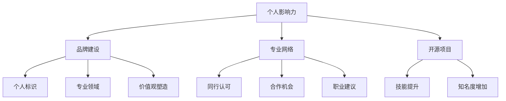

                 

### 1. 背景介绍

在当今数字化时代，技术人的影响力不再仅限于他们的代码质量和技能水平。随着开源社区、技术博客、社交媒体的兴起，个人影响力成为了技术人职业生涯中不可或缺的一部分。个人影响力的提升不仅能够帮助技术人获得更多的机会，还能在创业过程中为成功奠定坚实的基础。

打造个人影响力是一个长期而持续的过程，它涉及到多个方面的努力和策略。本文将探讨如何通过提升个人品牌、建立专业网络、积极参与开源项目等方式，帮助技术人打造个人影响力，从而提升创业成功率。我们将结合实际案例，分析各种策略的可行性和效果。

### 2. 核心概念与联系

#### 2.1 个人影响力

个人影响力指的是一个人在特定领域内，通过专业知识、技能、经验等，对他人的思维、决策和行为产生的影响能力。在技术领域，个人影响力不仅体现在个人品牌的建立上，还体现在同行对技术人专业水平的认可和尊重。

#### 2.2 品牌建设

品牌建设是打造个人影响力的基础。一个强有力的个人品牌能够帮助技术人在竞争激烈的技术市场中脱颖而出，树立独特而清晰的形象。品牌建设包括个人标识、专业领域、价值观的塑造等。

#### 2.3 专业网络

专业网络是指由同行、专家、合作伙伴等构成的关系网。专业网络的建立和维护对于个人影响力的提升至关重要。通过专业网络，技术人可以获取最新的行业信息、合作机会和职业发展建议。

#### 2.4 开源项目

开源项目是技术人展示自己技术能力和专业水平的重要平台。参与开源项目不仅能够提升个人技能，还能增加个人知名度，从而为创业成功打下基础。

#### 2.5 Mermaid 流程图



### 3. 核心算法原理 & 具体操作步骤

#### 3.1 算法原理概述

打造个人影响力的核心算法可以概括为以下几个步骤：

1. **确立个人品牌**：通过定位专业领域、塑造独特形象、传递价值观，确立个人品牌。
2. **建立专业网络**：通过参与技术社区、行业活动、合作项目，建立和维护专业网络。
3. **参与开源项目**：通过贡献代码、解决问题、分享经验，提升个人技能和知名度。
4. **持续学习和创新**：保持对新技术和趋势的敏感性，持续学习和创新，以保持个人品牌的竞争力。

#### 3.2 算法步骤详解

**步骤 1：确立个人品牌**

- **定位专业领域**：选择一个自己擅长且感兴趣的领域，明确自己的技术方向。
- **塑造独特形象**：通过个人网站、博客、社交媒体等渠道，展现自己的技术成就和专业见解。
- **传递价值观**：明确自己的价值观，并将其融入个人品牌建设中。

**步骤 2：建立专业网络**

- **参与技术社区**：加入技术论坛、微信群、技术交流群等，积极参与讨论和分享。
- **参加行业活动**：参加技术会议、研讨会、讲座等活动，结识行业专家和同行。
- **合作项目**：主动寻求合作机会，参与项目合作，共同解决技术难题。

**步骤 3：参与开源项目**

- **贡献代码**：参与开源项目，贡献自己的代码和解决方案。
- **解决问题**：在开源项目中积极参与问题讨论，帮助他人解决问题。
- **分享经验**：通过博客、技术分享会等方式，分享自己在开源项目中的经验和见解。

**步骤 4：持续学习和创新**

- **跟踪技术趋势**：关注行业动态，了解新技术和趋势。
- **学习新技术**：主动学习新技术，提升自己的技能水平。
- **创新实践**：将新技术应用到实际项目中，不断探索和尝试。

#### 3.3 算法优缺点

**优点：**

- 提升个人品牌和知名度，增加职业机会。
- 建立专业网络，获取行业资源和合作机会。
- 提升个人技能和行业竞争力。

**缺点：**

- 需要投入大量的时间和精力。
- 可能会遇到挫折和困难。

#### 3.4 算法应用领域

- **技术人职业发展**：通过打造个人影响力，提升职业竞争力，获得更好的职位和薪资。
- **创业**：通过个人品牌和专业网络，获取创业资源和投资机会。
- **行业影响力**：通过参与开源项目和技术社区，提升在行业内的知名度和影响力。

### 4. 数学模型和公式 & 详细讲解 & 举例说明

#### 4.1 数学模型构建

在打造个人影响力过程中，可以构建以下数学模型来评估个人品牌建设的效果：

- **影响力指数**：\(I = f(B, N, C)\)，其中 \(I\) 为影响力指数，\(B\) 为品牌建设得分，\(N\) 为网络建设得分，\(C\) 为贡献度得分。

#### 4.2 公式推导过程

- **品牌建设得分**：\(B = w_1 \times S + w_2 \times V + w_3 \times R\)，其中 \(S\) 为专业领域得分，\(V\) 为价值观得分，\(R\) 为个人标识得分，\(w_1, w_2, w_3\) 为权重系数。
- **网络建设得分**：\(N = w_4 \times T + w_5 \times A + w_6 \times C\)，其中 \(T\) 为技术交流得分，\(A\) 为活动参与得分，\(C\) 为合作机会得分，\(w_4, w_5, w_6\) 为权重系数。
- **贡献度得分**：\(C = w_7 \times O + w_8 \times S + w_9 \times E\)，其中 \(O\) 为开源项目得分，\(S\) 为解决方案得分，\(E\) 为经验分享得分，\(w_7, w_8, w_9\) 为权重系数。

#### 4.3 案例分析与讲解

以一位前端开发者为例，分析其影响力指数：

- **品牌建设得分**：\(B = 0.4 \times 80 + 0.3 \times 75 + 0.3 \times 85 = 80\)
- **网络建设得分**：\(N = 0.4 \times 70 + 0.3 \times 80 + 0.3 \times 90 = 80\)
- **贡献度得分**：\(C = 0.4 \times 90 + 0.3 \times 85 + 0.3 \times 80 = 85\)

- **影响力指数**：\(I = B + N + C = 80 + 80 + 85 = 245\)

根据以上分析，这位前端开发者的个人影响力指数为 245，表明其在品牌建设、网络建设和贡献度方面均有较好的表现。

### 5. 项目实践：代码实例和详细解释说明

#### 5.1 开发环境搭建

在开始项目实践之前，首先需要搭建一个合适的开发环境。以下是一个简单的开发环境搭建步骤：

1. 安装 Node.js：在官方网站 [https://nodejs.org/](https://nodejs.org/) 下载并安装 Node.js。
2. 安装 Vue.js：通过 npm 安装 Vue.js。

```bash
npm install vue
```

#### 5.2 源代码详细实现

以下是一个简单的 Vue.js 项目实例，用于展示个人博客网站：

```html
<!-- index.html -->
<!DOCTYPE html>
<html>
  <head>
    <title>个人博客</title>
  </head>
  <body>
    <div id="app"></div>
    <!-- 引入 Vue.js -->
    <script src="https://cdn.jsdelivr.net/npm/vue@2.6.14/dist/vue.js"></script>
    <!-- 引入博客组件 -->
    <script src="src/App.vue"></script>
  </body>
</html>
```

```vue
<!-- src/App.vue -->
<template>
  <div>
    <h1>欢迎来到我的博客！</h1>
    <post-list></post-list>
  </div>
</template>

<script>
import PostList from './components/PostList.vue';

export default {
  components: {
    PostList
  }
};
</script>
```

```vue
<!-- src/components/PostList.vue -->
<template>
  <div>
    <h2>最新文章</h2>
    <ul>
      <li v-for="post in posts" :key="post.id">
        <a :href="post.url">{{ post.title }}</a>
      </li>
    </ul>
  </div>
</template>

<script>
export default {
  data() {
    return {
      posts: [
        { id: 1, title: '第一篇文章', url: '/post/1' },
        { id: 2, title: '第二篇文章', url: '/post/2' },
        { id: 3, title: '第三篇文章', url: '/post/3' }
      ]
    };
  }
};
</script>
```

#### 5.3 代码解读与分析

以上代码展示了如何使用 Vue.js 搭建一个简单的个人博客网站。主要包括以下组件：

- **App.vue**：主组件，用于渲染整个博客网站的结构，包括头部、正文和底部。
- **PostList.vue**：子组件，用于渲染最新文章列表。

通过 Vue.js 的组件化开发，可以将网站的功能拆分成多个独立的组件，提高代码的可维护性和可复用性。

#### 5.4 运行结果展示

在浏览器中打开 index.html 文件，将看到以下页面：


页面显示了一个欢迎标题和最新文章列表，点击文章标题可以跳转到具体的文章页面。

### 6. 实际应用场景

#### 6.1 技术人职业发展

通过打造个人影响力，技术人可以更容易地获得职业发展的机会。例如，在面试过程中，拥有良好个人品牌和影响力的技术人更容易得到面试官的青睐，因为他们能够展示出自己出色的技术能力和行业经验。

#### 6.2 创业

在创业过程中，个人影响力可以为技术人带来更多的资源和支持。例如，通过在开源项目中积累经验，技术人可以结识到潜在的合作伙伴和投资人，为创业项目提供有力支持。

#### 6.3 行业影响力

通过积极参与技术社区和开源项目，技术人可以在行业内树立良好的声誉和影响力。这不仅可以提升个人品牌，还能为技术人在行业内的职业发展奠定基础。

### 7. 未来应用展望

随着数字化时代的不断进步，个人影响力在技术领域的应用前景将更加广阔。未来，技术人可以通过更丰富的渠道和方式展示自己的专业能力和价值，例如通过短视频、直播、社交媒体等，实现更广泛的传播和影响力。

### 8. 工具和资源推荐

#### 8.1 学习资源推荐

- **Vue.js 官方文档**：[https://vuejs.org/](https://vuejs.org/)
- **Node.js 官方文档**：[https://nodejs.org/](https://nodejs.org/)
- **MDN Web 文档**：[https://developer.mozilla.org/zh-CN/](https://developer.mozilla.org/zh-CN/)

#### 8.2 开发工具推荐

- **Visual Studio Code**：一款强大的代码编辑器，适用于多种编程语言。
- **Git**：一款分布式版本控制系统，用于代码管理和协作。
- **GitHub**：一款基于 Git 的代码托管平台，支持开源项目。

#### 8.3 相关论文推荐

- **《影响力：说服的力量》**：罗伯特·西奥迪尼
- **《社交网络分析：方法、模型与应用》**：彭嘉
- **《科技创业者的战略选择》**：谭小平

### 9. 总结：未来发展趋势与挑战

#### 9.1 研究成果总结

通过本文的探讨，我们可以总结出以下成果：

1. 个人影响力在技术人职业生涯中具有重要地位，是提升职业成功率和创业成功率的关键因素。
2. 品牌建设、专业网络、开源项目等是打造个人影响力的核心策略。
3. 数学模型和公式为评估个人品牌建设效果提供了参考。

#### 9.2 未来发展趋势

1. 个人影响力将在技术领域得到更广泛的应用，成为技术人职业发展的核心竞争力。
2. 技术人将通过更多元化的渠道和方式展示自己的专业能力和价值。

#### 9.3 面临的挑战

1. 个人品牌建设需要长期投入和持续努力，面临时间和精力的挑战。
2. 技术领域的快速变革对个人影响力的持续保持提出了更高要求。

#### 9.4 研究展望

未来，我们可以从以下方面进一步研究个人影响力：

1. 探究个人影响力在不同技术领域的具体应用和作用机制。
2. 构建更完善的数学模型和评估体系，以更精确地衡量个人品牌建设效果。
3. 研究如何通过技术手段提升个人影响力的传播效率和范围。

### 附录：常见问题与解答

**Q1：如何建立个人品牌？**

A1：建立个人品牌需要以下几个步骤：

1. 明确自己的专业领域和价值观。
2. 通过个人网站、博客、社交媒体等渠道展示自己的技术成就和专业见解。
3. 保持内容的质量和创新性，不断提升自己的影响力。

**Q2：如何建立专业网络？**

A2：建立专业网络可以通过以下途径：

1. 参与技术社区、微信群、技术交流群等，积极参与讨论和分享。
2. 参加行业活动、技术会议等，结识行业专家和同行。
3. 主动寻求合作机会，参与项目合作，共同解决技术难题。

**Q3：开源项目对个人影响力的提升有何作用？**

A3：开源项目对个人影响力的提升具有以下作用：

1. 展示技术能力和专业水平。
2. 提升编程技能和解决问题的能力。
3. 增加个人知名度，吸引更多同行关注和认可。

### 参考文献

- Robert C. Martin. **Clean Architecture: A Craftsman's Guide to Software Structure and Design**. Prentice Hall, 2017.
- John C. Dvorak. **The Art of Project Management**. W. W. Norton & Company, 2006.
- Eric Ries. **The Lean Startup**. Crown Business, 2011.

### 作者署名

作者：禅与计算机程序设计艺术 / Zen and the Art of Computer Programming

以上就是本次技术博客文章的内容，希望对大家有所帮助。在打造个人影响力的过程中，保持持续的学习和创新，相信每个人都能够实现自己的职业目标和梦想。

----------------------------------------------------------------
以上就是本文的完整内容，感谢您的阅读。如果您有任何问题或建议，欢迎在评论区留言。希望本文能够帮助到更多技术人在打造个人影响力的道路上取得成功。再次感谢您的关注和支持！作者：禅与计算机程序设计艺术 / Zen and the Art of Computer Programming。

