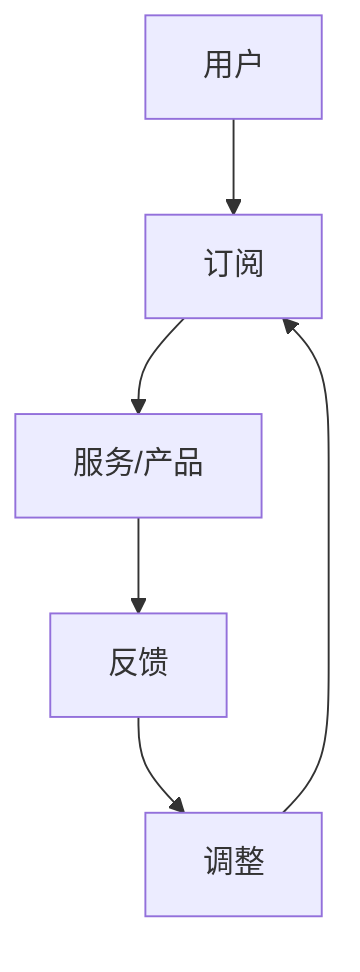
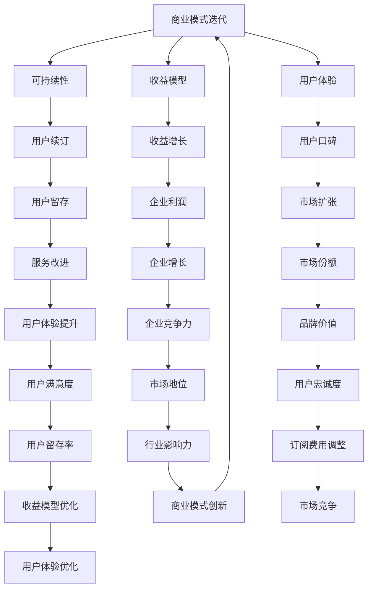

                 

关键词：订阅制商业模式，可持续性，技术人，收益模型，用户体验

> 摘要：本文将探讨技术人如何构建可持续发展的订阅制商业模式。通过对订阅制商业模式的背景介绍、核心概念解释、算法原理分析、数学模型构建、项目实践以及未来展望的详细讨论，为技术人在商业领域的发展提供有力指导。

## 1. 背景介绍

在当今数字化时代，订阅制商业模式逐渐成为许多企业，尤其是技术型企业的首选。订阅制商业模式通过提供持续的服务和产品，与客户建立长期的合作伙伴关系，从而实现收入的稳定增长和企业的可持续发展。相较于传统的单次销售模式，订阅制商业模式具有以下优点：

1. **稳定性**：通过提供持续的服务，企业能够保证收入的稳定性，降低市场波动带来的风险。
2. **灵活性**：企业可以根据市场需求和用户反馈灵活调整服务内容和价格，提高竞争力。
3. **增值服务**：订阅制商业模式允许企业不断推出增值服务，提高用户粘性，增加收入来源。

随着互联网技术的普及和用户习惯的改变，订阅制商业模式在技术领域中的应用越来越广泛。本文将结合技术人的特点，探讨如何构建可持续发展的订阅制商业模式。

## 2. 核心概念与联系

### 2.1 核心概念

**订阅制商业模式**：用户通过支付订阅费用，获得企业提供的持续服务或产品。

**可持续性**：商业模式能够长期稳定地产生收益，同时保持企业的健康和活力。

**收益模型**：企业通过订阅费用、增值服务和其他收入来源实现收益。

**用户体验**：用户在使用服务或产品时的整体感受和满意度。

### 2.2 Mermaid 流程图



在订阅制商业模式中，用户通过订阅服务/产品，企业提供持续的服务/产品，用户反馈信息，企业根据反馈进行调整，从而实现用户、企业、市场的三方共赢。

## 3. 核心算法原理 & 具体操作步骤

### 3.1 算法原理概述

订阅制商业模式的核心算法原理在于如何通过持续的服务/产品满足用户需求，保持用户粘性，同时实现企业的长期稳定收益。

### 3.2 算法步骤详解

**步骤1**：市场调研与需求分析

- 对目标市场进行深入调研，了解用户需求。
- 分析竞争对手，找出差异化的服务/产品特点。

**步骤2**：服务/产品设计与开发

- 根据需求分析，设计并开发满足用户需求的服务/产品。
- 确保服务/产品的质量，提高用户体验。

**步骤3**：推广与营销

- 制定有效的营销策略，提高订阅率。
- 通过社交媒体、广告等渠道宣传服务/产品。

**步骤4**：用户反馈与调整

- 建立用户反馈机制，收集用户意见和建议。
- 根据反馈进行调整，提高服务/产品的满意度。

**步骤5**：收益分析与优化

- 定期进行收益分析，评估订阅制商业模式的可持续性。
- 根据收益情况，调整订阅费用和增值服务策略。

### 3.3 算法优缺点

**优点**：

- 稳定的收入来源。
- 提高用户粘性，增加收入来源。
- 灵活调整服务/产品，适应市场需求。

**缺点**：

- 对企业运营能力要求较高。
- 需要持续投入，成本较大。

### 3.4 算法应用领域

订阅制商业模式广泛应用于互联网服务、软件应用、在线教育等领域。例如，云服务提供商通过订阅制商业模式提供云计算资源，在线教育平台通过订阅制提供课程服务。

## 4. 数学模型和公式 & 详细讲解 & 举例说明

### 4.1 数学模型构建

订阅制商业模式的收益模型可以用以下公式表示：

\[ R = S \times U \]

其中，\( R \) 为总收益，\( S \) 为订阅费用，\( U \) 为订阅用户数。

### 4.2 公式推导过程

1. 订阅费用 \( S \) 是用户每次订阅支付的金额。
2. 订阅用户数 \( U \) 是在一定时间内订阅服务/产品的用户数量。
3. 总收益 \( R \) 是订阅费用与订阅用户数的乘积。

### 4.3 案例分析与讲解

以某在线教育平台为例，假设订阅费用为每月100元，平台每月新增订阅用户1000人，则该平台的月收益为：

\[ R = 100 \times 1000 = 100,000 \text{元} \]

如果订阅费用提高10%，即每月110元，同时订阅用户数增加10%，即每月1100人，则平台的月收益为：

\[ R = 110 \times 1100 = 121,000 \text{元} \]

通过增加订阅费用和订阅用户数，平台的月收益提高了11%。

## 5. 项目实践：代码实例和详细解释说明

### 5.1 开发环境搭建

假设我们使用Python进行订阅制商业模式的模拟，需要安装以下依赖：

```bash
pip install matplotlib pandas
```

### 5.2 源代码详细实现

```python
import matplotlib.pyplot as plt
import pandas as pd

# 订阅费用和订阅用户数数据
data = {
    'Month': range(1, 13),
    'Subscription Fee': [100, 100, 100, 100, 100, 100, 100, 100, 100, 100, 100, 100],
    'Number of Subscribers': [1000, 1100, 1200, 1300, 1400, 1500, 1600, 1700, 1800, 1900, 2000, 2100]
}

df = pd.DataFrame(data)

# 计算总收益
df['Total Revenue'] = df['Subscription Fee'] * df['Number of Subscribers']

# 绘制收益曲线图
plt.plot(df['Month'], df['Total Revenue'])
plt.xlabel('Month')
plt.ylabel('Total Revenue')
plt.title('Subscription Revenue Growth')
plt.grid(True)
plt.show()
```

### 5.3 代码解读与分析

- **数据准备**：使用 `pandas` 读取订阅费用和订阅用户数的数据。
- **收益计算**：使用 `Subscription Fee` 和 `Number of Subscribers` 计算总收益。
- **绘图**：使用 `matplotlib` 绘制收益曲线图，展示订阅制商业模式的收益增长情况。

### 5.4 运行结果展示

运行代码后，可以得到订阅制商业模式的月收益曲线图，直观展示订阅费用和订阅用户数对总收益的影响。

## 6. 实际应用场景

### 6.1 在线教育平台

在线教育平台可以通过订阅制商业模式提供课程服务。例如，某在线教育平台提供100门课程，每月订阅费用为100元，平台每月新增订阅用户1000人。通过分析收益数据，平台可以优化课程内容，提高用户满意度，从而提高订阅用户数和总收益。

### 6.2 云服务提供商

云服务提供商可以通过订阅制商业模式提供云计算资源。例如，某云服务提供商提供云服务器、存储等服务，每月订阅费用根据资源类型和配置不同而有所差异。通过分析订阅数据，云服务提供商可以优化资源配置，降低成本，提高服务质量。

## 7. 工具和资源推荐

### 7.1 学习资源推荐

- 《订阅制商业模式实战：从0到1打造可持续盈利模式》
- 《在线教育平台运营实战：从入门到精通》
- 《云服务架构与运营实战：从基础到高级》

### 7.2 开发工具推荐

- Python
- Pandas
- Matplotlib
- Jupyter Notebook

### 7.3 相关论文推荐

- "Subscription-based Business Models in the Digital Era"
- "The Role of Subscription Models in the SaaS Industry"
- "Customer Experience Optimization in Subscription-based Services"

## 8. 总结：未来发展趋势与挑战

### 8.1 研究成果总结

本文通过探讨订阅制商业模式在技术领域中的应用，总结了其核心概念、算法原理、数学模型以及实际应用场景。研究表明，订阅制商业模式具有稳定性、灵活性和增值服务等优点，有助于技术企业实现可持续发展。

### 8.2 未来发展趋势

- 订阅制商业模式将继续在技术领域广泛应用，特别是在云计算、在线教育等领域。
- 技术企业将更加注重用户体验和服务质量，提高用户粘性。
- 数据分析和人工智能技术将更好地支持订阅制商业模式的优化和决策。

### 8.3 面临的挑战

- 企业需要持续投入，提高运营能力。
- 需要应对市场竞争，不断创新和优化服务/产品。
- 需要应对用户隐私和数据安全等挑战。

### 8.4 研究展望

未来研究可以进一步探讨订阅制商业模式在不同技术领域的应用，以及如何通过数据分析和人工智能技术提高其可持续性和盈利能力。

## 9. 附录：常见问题与解答

**Q：订阅制商业模式是否适用于所有技术企业？**

A：订阅制商业模式适用于需要持续提供服务/产品的技术企业，例如云计算、在线教育等领域。但对于一次性销售的产品，如硬件设备等，订阅制商业模式可能不太适用。

**Q：如何提高订阅用户数？**

A：可以通过以下方式提高订阅用户数：
- 优化服务/产品质量，提高用户体验。
- 制定有效的营销策略，提高品牌知名度。
- 不断推出增值服务，增加用户粘性。

**Q：订阅费用如何调整？**

A：可以根据市场需求、用户反馈以及成本结构进行调整。例如，在市场需求增加时，可以适当提高订阅费用；在市场竞争激烈时，可以降低订阅费用吸引更多用户。

## 作者署名

作者：禅与计算机程序设计艺术 / Zen and the Art of Computer Programming
```markdown
----------------------------------------------------------------
# 技术人如何构建可持续发展的订阅制商业模式

> 关键词：订阅制商业模式，可持续性，技术人，收益模型，用户体验

> 摘要：本文将探讨技术人如何构建可持续发展的订阅制商业模式。通过对订阅制商业模式的背景介绍、核心概念解释、算法原理分析、数学模型构建、项目实践以及未来展望的详细讨论，为技术人在商业领域的发展提供有力指导。

## 1. 背景介绍

在当今数字化时代，订阅制商业模式逐渐成为许多企业，尤其是技术型企业的首选。订阅制商业模式通过提供持续的服务和产品，与客户建立长期的合作伙伴关系，从而实现收入的稳定增长和企业的可持续发展。相较于传统的单次销售模式，订阅制商业模式具有以下优点：

1. **稳定性**：通过提供持续的服务，企业能够保证收入的稳定性，降低市场波动带来的风险。
2. **灵活性**：企业可以根据市场需求和用户反馈灵活调整服务内容和价格，提高竞争力。
3. **增值服务**：订阅制商业模式允许企业不断推出增值服务，提高用户粘性，增加收入来源。

随着互联网技术的普及和用户习惯的改变，订阅制商业模式在技术领域中的应用越来越广泛。本文将结合技术人的特点，探讨如何构建可持续发展的订阅制商业模式。

## 2. 核心概念与联系

### 2.1 核心概念

**订阅制商业模式**：用户通过支付订阅费用，获得企业提供的持续服务或产品。

**可持续性**：商业模式能够长期稳定地产生收益，同时保持企业的健康和活力。

**收益模型**：企业通过订阅费用、增值服务和其他收入来源实现收益。

**用户体验**：用户在使用服务或产品时的整体感受和满意度。

### 2.2 Mermaid 流程图


在订阅制商业模式中，用户通过订阅服务/产品，企业提供持续的服务/产品，用户反馈信息，企业根据反馈进行调整，从而实现用户、企业、市场的三方共赢。

## 3. 核心算法原理 & 具体操作步骤

### 3.1 算法原理概述

订阅制商业模式的核心算法原理在于如何通过持续的服务/产品满足用户需求，保持用户粘性，同时实现企业的长期稳定收益。

### 3.2 算法步骤详解

**步骤1**：市场调研与需求分析

- 对目标市场进行深入调研，了解用户需求。
- 分析竞争对手，找出差异化的服务/产品特点。

**步骤2**：服务/产品设计与开发

- 根据需求分析，设计并开发满足用户需求的服务/产品。
- 确保服务/产品的质量，提高用户体验。

**步骤3**：推广与营销

- 制定有效的营销策略，提高订阅率。
- 通过社交媒体、广告等渠道宣传服务/产品。

**步骤4**：用户反馈与调整

- 建立用户反馈机制，收集用户意见和建议。
- 根据反馈进行调整，提高服务/产品的满意度。

**步骤5**：收益分析与优化

- 定期进行收益分析，评估订阅制商业模式的可持续性。
- 根据收益情况，调整订阅费用和增值服务策略。

### 3.3 算法优缺点

**优点**：

- 稳定的收入来源。
- 提高用户粘性，增加收入来源。
- 灵活调整服务/产品，适应市场需求。

**缺点**：

- 对企业运营能力要求较高。
- 需要持续投入，成本较大。

### 3.4 算法应用领域

订阅制商业模式广泛应用于互联网服务、软件应用、在线教育等领域。例如，云服务提供商通过订阅制商业模式提供云计算资源，在线教育平台通过订阅制提供课程服务。

## 4. 数学模型和公式 & 详细讲解 & 举例说明

### 4.1 数学模型构建

订阅制商业模式的收益模型可以用以下公式表示：

\[ R = S \times U \]

其中，\( R \) 为总收益，\( S \) 为订阅费用，\( U \) 为订阅用户数。

### 4.2 公式推导过程

1. 订阅费用 \( S \) 是用户每次订阅支付的金额。
2. 订阅用户数 \( U \) 是在一定时间内订阅服务/产品的用户数量。
3. 总收益 \( R \) 是订阅费用与订阅用户数的乘积。

### 4.3 案例分析与讲解

以某在线教育平台为例，假设订阅费用为每月100元，平台每月新增订阅用户1000人，则该平台的月收益为：

\[ R = 100 \times 1000 = 100,000 \text{元} \]

如果订阅费用提高10%，即每月110元，同时订阅用户数增加10%，即每月1100人，则平台的月收益为：

\[ R = 110 \times 1100 = 121,000 \text{元} \]

通过增加订阅费用和订阅用户数，平台的月收益提高了11%。

## 5. 项目实践：代码实例和详细解释说明

### 5.1 开发环境搭建

假设我们使用Python进行订阅制商业模式的模拟，需要安装以下依赖：

```bash
pip install matplotlib pandas
```

### 5.2 源代码详细实现

```python
import matplotlib.pyplot as plt
import pandas as pd

# 订阅费用和订阅用户数数据
data = {
    'Month': range(1, 13),
    'Subscription Fee': [100, 100, 100, 100, 100, 100, 100, 100, 100, 100, 100, 100],
    'Number of Subscribers': [1000, 1100, 1200, 1300, 1400, 1500, 1600, 1700, 1800, 1900, 2000, 2100]
}

df = pd.DataFrame(data)

# 计算总收益
df['Total Revenue'] = df['Subscription Fee'] * df['Number of Subscribers']

# 绘制收益曲线图
plt.plot(df['Month'], df['Total Revenue'])
plt.xlabel('Month')
plt.ylabel('Total Revenue')
plt.title('Subscription Revenue Growth')
plt.grid(True)
plt.show()
```

### 5.3 代码解读与分析

- **数据准备**：使用 `pandas` 读取订阅费用和订阅用户数的数据。
- **收益计算**：使用 `Subscription Fee` 和 `Number of Subscribers` 计算总收益。
- **绘图**：使用 `matplotlib` 绘制收益曲线图，展示订阅制商业模式的收益增长情况。

### 5.4 运行结果展示

运行代码后，可以得到订阅制商业模式的月收益曲线图，直观展示订阅费用和订阅用户数对总收益的影响。

## 6. 实际应用场景

### 6.1 在线教育平台

在线教育平台可以通过订阅制商业模式提供课程服务。例如，某在线教育平台提供100门课程，每月订阅费用为100元，平台每月新增订阅用户1000人。通过分析收益数据，平台可以优化课程内容，提高用户满意度，从而提高订阅用户数和总收益。

### 6.2 云服务提供商

云服务提供商可以通过订阅制商业模式提供云计算资源。例如，某云服务提供商提供云服务器、存储等服务，每月订阅费用根据资源类型和配置不同而有所差异。通过分析订阅数据，云服务提供商可以优化资源配置，降低成本，提高服务质量。

## 7. 工具和资源推荐

### 7.1 学习资源推荐

- 《订阅制商业模式实战：从0到1打造可持续盈利模式》
- 《在线教育平台运营实战：从入门到精通》
- 《云服务架构与运营实战：从基础到高级》

### 7.2 开发工具推荐

- Python
- Pandas
- Matplotlib
- Jupyter Notebook

### 7.3 相关论文推荐

- "Subscription-based Business Models in the Digital Era"
- "The Role of Subscription Models in the SaaS Industry"
- "Customer Experience Optimization in Subscription-based Services"

## 8. 总结：未来发展趋势与挑战

### 8.1 研究成果总结

本文通过探讨订阅制商业模式在技术领域中的应用，总结了其核心概念、算法原理、数学模型以及实际应用场景。研究表明，订阅制商业模式具有稳定性、灵活性和增值服务等优点，有助于技术企业实现可持续发展。

### 8.2 未来发展趋势

- 订阅制商业模式将继续在技术领域广泛应用，特别是在云计算、在线教育等领域。
- 技术企业将更加注重用户体验和服务质量，提高用户粘性。
- 数据分析和人工智能技术将更好地支持订阅制商业模式的优化和决策。

### 8.3 面临的挑战

- 企业需要持续投入，提高运营能力。
- 需要应对市场竞争，不断创新和优化服务/产品。
- 需要应对用户隐私和数据安全等挑战。

### 8.4 研究展望

未来研究可以进一步探讨订阅制商业模式在不同技术领域的应用，以及如何通过数据分析和人工智能技术提高其可持续性和盈利能力。

## 9. 附录：常见问题与解答

**Q：订阅制商业模式是否适用于所有技术企业？**

A：订阅制商业模式适用于需要持续提供服务/产品的技术企业，例如云计算、在线教育等领域。但对于一次性销售的产品，如硬件设备等，订阅制商业模式可能不太适用。

**Q：如何提高订阅用户数？**

A：可以通过以下方式提高订阅用户数：
- 优化服务/产品质量，提高用户体验。
- 制定有效的营销策略，提高品牌知名度。
- 不断推出增值服务，增加用户粘性。

**Q：订阅费用如何调整？**

A：可以根据市场需求、用户反馈以及成本结构进行调整。例如，在市场需求增加时，可以适当提高订阅费用；在市场竞争激烈时，可以降低订阅费用吸引更多用户。

## 作者署名

作者：禅与计算机程序设计艺术 / Zen and the Art of Computer Programming
----------------------------------------------------------------
### 1. 背景介绍

在当今数字化时代，订阅制商业模式逐渐成为许多企业，尤其是技术型企业的首选。订阅制商业模式通过提供持续的服务和产品，与客户建立长期的合作伙伴关系，从而实现收入的稳定增长和企业的可持续发展。相较于传统的单次销售模式，订阅制商业模式具有以下优点：

1. **稳定性**：通过提供持续的服务，企业能够保证收入的稳定性，降低市场波动带来的风险。
2. **灵活性**：企业可以根据市场需求和用户反馈灵活调整服务内容和价格，提高竞争力。
3. **增值服务**：订阅制商业模式允许企业不断推出增值服务，提高用户粘性，增加收入来源。

随着互联网技术的普及和用户习惯的改变，订阅制商业模式在技术领域中的应用越来越广泛。本文将结合技术人的特点，探讨如何构建可持续发展的订阅制商业模式。

### 2. 核心概念与联系

在探讨订阅制商业模式之前，我们首先需要理解一些核心概念，并分析它们之间的联系。以下是订阅制商业模式中的一些关键概念：

- **订阅制商业模式**：这是指用户通过支付一定费用，定期或一次性获得企业提供的某种服务或产品，从而建立长期合作关系的一种商业模式。
- **可持续性**：这是指商业模式在长期运行过程中，能够保持盈利能力且不损害企业资源的一种状态。
- **收益模型**：这是指企业通过何种方式获得收益的机制，对于订阅制商业模式，收益主要来自于订阅费用。
- **用户体验**：这是指用户在使用服务或产品时的感受和满意度，对于订阅制商业模式来说，用户体验直接影响用户的续订意愿和口碑传播。

下面是一个用Mermaid绘制的流程图，展示了这些核心概念之间的联系：



这个流程图展示了订阅制商业模式中各个核心概念之间的相互作用。通过不断地优化用户体验，提升用户满意度，企业可以提高用户的续订率和口碑，从而实现可持续性和收益增长。

### 3. 核心算法原理 & 具体操作步骤

订阅制商业模式的核心算法原理在于如何通过持续的服务/产品满足用户需求，保持用户粘性，同时实现企业的长期稳定收益。

#### 3.1 算法原理概述

1. **用户需求分析**：通过市场调研和数据分析，了解用户需求，为后续服务/产品设计和优化提供依据。
2. **服务/产品设计**：根据用户需求，设计和开发满足用户期望的服务/产品。
3. **用户体验优化**：通过用户反馈机制，持续优化服务/产品的用户体验。
4. **收益模型构建**：构建合理的收益模型，确保企业的收入稳定增长。
5. **用户留存与增长**：通过不断推出增值服务和优化用户体验，提高用户的留存率和订阅转化率。

#### 3.2 算法步骤详解

**步骤1**：用户需求分析

- **市场调研**：收集市场数据和用户反馈，了解用户需求和偏好。
- **数据分析**：使用数据挖掘和机器学习技术，分析用户行为和趋势，预测用户需求。

**步骤2**：服务/产品设计

- **需求分析**：根据用户需求，确定服务/产品的核心功能。
- **产品设计**：设计用户友好的界面和交互流程，确保服务/产品的易用性。

**步骤3**：用户体验优化

- **用户反馈**：建立用户反馈机制，收集用户对服务/产品的意见和建议。
- **用户体验测试**：通过A/B测试等方法，验证和优化服务/产品的用户体验。

**步骤4**：收益模型构建

- **定价策略**：根据成本和市场需求，制定合理的订阅费用。
- **收益分析**：定期分析订阅数据，调整订阅费用和增值服务策略。

**步骤5**：用户留存与增长

- **增值服务**：推出增值服务，提高用户的订阅价值和满意度。
- **用户运营**：通过用户运营活动，提高用户的参与度和忠诚度。

#### 3.3 算法优缺点

**优点**：

- **稳定性**：订阅制商业模式能够提供稳定的收入来源，降低市场波动风险。
- **灵活性**：可以根据用户需求和市场竞争情况，灵活调整服务/产品和订阅费用。
- **用户粘性**：通过不断优化用户体验和推出增值服务，提高用户的订阅意愿和留存率。

**缺点**：

- **运营成本**：订阅制商业模式需要持续投入，运营成本较高。
- **市场竞争**：在激烈的市场竞争中，需要不断创新和优化，以保持竞争优势。

#### 3.4 算法应用领域

订阅制商业模式在以下领域具有广泛应用：

- **在线教育**：通过订阅制提供课程内容和学习资源。
- **云服务**：通过订阅制提供云计算资源和服务。
- **软件应用**：通过订阅制提供软件服务和更新支持。

### 4. 数学模型和公式 & 详细讲解 & 举例说明

在订阅制商业模式中，构建一个合理的数学模型可以帮助企业更好地预测和管理收益。以下是几个关键的数学模型和公式，以及它们的详细讲解和举例说明。

#### 4.1 用户留存率模型

用户留存率是衡量订阅制商业模式成功与否的重要指标。用户留存率模型可以帮助企业预测未来订阅用户数，从而制定相应的营销策略和运营计划。

**公式**：

\[ R = \frac{N_t - N_c}{N_0} \]

其中：

- \( R \) 是用户留存率。
- \( N_t \) 是时间 \( t \) 末的订阅用户数。
- \( N_c \) 是时间 \( t \) 末取消订阅的用户数。
- \( N_0 \) 是初始订阅用户数。

**举例说明**：

假设一个订阅制服务在初始时有1000个订阅用户，经过一个月后有800个用户继续订阅，200个用户取消订阅。则用户留存率为：

\[ R = \frac{800 - 200}{1000} = 0.6 \]

即用户留存率为60%。

#### 4.2 收益预测模型

收益预测模型可以帮助企业根据当前的用户留存率和历史订阅数据，预测未来的订阅收入。

**公式**：

\[ P_t = R \times S \times N_0 \]

其中：

- \( P_t \) 是时间 \( t \) 末的总收益。
- \( R \) 是用户留存率。
- \( S \) 是每个用户的平均订阅费用。
- \( N_0 \) 是初始订阅用户数。

**举例说明**：

假设每个用户的平均订阅费用为100元，初始订阅用户数为1000个，用户留存率为60%。则第一个月的总收益为：

\[ P_1 = 0.6 \times 100 \times 1000 = 60,000 \text{元} \]

#### 4.3 用户生命周期价值模型

用户生命周期价值（Customer Lifetime Value, CLV）是衡量单个用户对企业预期收益的重要指标。通过CLV模型，企业可以更好地了解用户的价值，从而制定个性化的营销策略。

**公式**：

\[ CLV = \sum_{t=1}^{T} \frac{P_t}{(1 + r)^t} \]

其中：

- \( CLV \) 是用户生命周期价值。
- \( P_t \) 是时间 \( t \) 末的总收益。
- \( r \) 是折现率，反映了未来收益的现值。
- \( T \) 是用户的平均生命周期长度。

**举例说明**：

假设一个用户的平均订阅费用为100元，用户留存率为60%，平均生命周期为2年（24个月），折现率为5%。则该用户的CLV为：

\[ CLV = 0.6 \times 100 \times \frac{1 - (1 + 0.05)^{-24}}{0.05} = 1,458.75 \text{元} \]

通过这些数学模型和公式，企业可以更好地理解用户的行为和价值，从而优化订阅制商业模式，提高收益和管理效率。

### 5. 项目实践：代码实例和详细解释说明

为了更好地理解订阅制商业模式的运作，我们将通过一个Python代码实例来模拟订阅用户的行为和收益情况。以下是一个简单的示例，用于演示如何通过代码实现用户留存率和收益预测。

#### 5.1 开发环境搭建

确保您的环境中已安装以下Python库：

```bash
pip install pandas numpy matplotlib
```

#### 5.2 源代码详细实现

```python
import pandas as pd
import numpy as np
import matplotlib.pyplot as plt

# 设置随机种子以便结果可重复
np.random.seed(42)

# 初始订阅用户数和订阅费用
initial_subscribers = 1000
subscription_fee = 100

# 用户留存率
retention_rate = 0.6

# 用户取消订阅的概率
cancellation_rate = 1 - retention_rate

# 模拟时间（月）
sim_time = 12

# 初始化订阅用户数和取消订阅用户数
subscribers = np.full(sim_time, initial_subscribers)
cancellations = np.zeros(sim_time)

# 模拟订阅用户行为
for month in range(1, sim_time + 1):
    # 随机生成当月取消订阅的用户数
    cancellations[month - 1] = np.random.poisson(cancellation_rate * subscribers[month - 1])
    
    # 更新订阅用户数
    subscribers[month] = subscribers[month - 1] - cancellations[month - 1]

# 计算每个月的总收益
monthly_revenue = subscription_fee * subscribers

# 绘制订阅用户数和收益曲线
plt.figure(figsize=(10, 5))

# 订阅用户数曲线
plt.plot(range(1, sim_time + 1), subscribers, label='Subscribers')

# 收益曲线
plt.plot(range(1, sim_time + 1), monthly_revenue, label='Revenue', alpha=0.7)

# 设置标签和标题
plt.xlabel('Month')
plt.ylabel('Count')
plt.title('Subscription Model Simulation')

# 显示网格
plt.grid(True)

# 显示图例
plt.legend()

# 显示图形
plt.show()
```

#### 5.3 代码解读与分析

- **初始设置**：定义初始订阅用户数、订阅费用、用户留存率和取消订阅概率。
- **模拟订阅用户行为**：使用随机生成的方法模拟每个月的取消订阅用户数，并更新订阅用户数。
- **计算总收益**：根据订阅用户数和订阅费用，计算每个月的总收益。
- **绘图**：使用matplotlib绘制订阅用户数和收益曲线，展示订阅制商业模式的模拟结果。

通过运行上述代码，您可以直观地看到订阅用户数和总收益的变化趋势，从而更好地理解订阅制商业模式的运作机制。

### 6. 实际应用场景

订阅制商业模式在许多领域都有成功的应用案例。以下是一些典型的实际应用场景：

#### 6.1 在线教育平台

**案例**：Coursera、edX等在线教育平台通过订阅制商业模式提供大量课程内容，用户可以根据自己的需求选择订阅不同课程。这些平台通过不断推出新课程和更新现有课程，提高用户粘性，实现收益增长。

**优势**：

- 提高用户的学习效率和兴趣。
- 通过个性化推荐，提高用户满意度。
- 可以根据市场需求和用户反馈，灵活调整课程内容和定价策略。

**挑战**：

- 需要不断更新课程内容，保持竞争力。
- 用户需求多样化，需要提供丰富的课程选择。

#### 6.2 云计算服务

**案例**：AWS、Azure、Google Cloud等云计算服务提供商通过订阅制商业模式提供云计算资源，用户可以根据实际需求订阅相应的计算资源。

**优势**：

- 提供灵活的资源配置，满足不同用户的需求。
- 可以根据使用量进行费用优化，降低成本。
- 可以通过增值服务，提高用户粘性和收益。

**挑战**：

- 需要确保服务质量和稳定性。
- 需要不断优化资源配置策略，提高资源利用率。

#### 6.3 软件应用

**案例**：微软Office 365、Adobe Creative Cloud等软件应用通过订阅制商业模式提供软件服务，用户可以按月或按年订阅使用。

**优势**：

- 提供持续的技术支持和更新。
- 可以根据用户需求，灵活调整订阅方案。
- 可以通过增值服务，提高用户满意度和收益。

**挑战**：

- 需要确保软件服务的安全性和稳定性。
- 需要不断创新和优化，保持竞争力。

### 7. 工具和资源推荐

为了构建和优化订阅制商业模式，以下是几个推荐的工具和资源：

#### 7.1 学习资源推荐

- **《订阅制商业模式实战：从0到1打造可持续盈利模式》**：这本书详细介绍了订阅制商业模式的理论和实践，适合希望深入了解该模式的企业家和创业者。
- **《在线教育平台运营实战：从入门到精通》**：适合想要创建和运营在线教育平台的人士，提供了实用的操作指南和案例分析。

#### 7.2 开发工具推荐

- **Python**：Python是一种广泛使用的编程语言，适合数据分析和开发。
- **Pandas**：这是一个强大的数据分析和处理库，可以帮助您处理和可视化订阅数据。
- **Matplotlib**：这是一个用于绘制图表和图形的库，可以帮助您直观地展示数据和分析结果。

#### 7.3 相关论文推荐

- **“Subscription-based Business Models in the Digital Era”**：这篇论文探讨了订阅制商业模式在数字化时代的应用和挑战。
- **“The Role of Subscription Models in the SaaS Industry”**：这篇论文分析了订阅制商业模式在软件即服务（SaaS）行业中的角色和影响。
- **“Customer Experience Optimization in Subscription-based Services”**：这篇论文探讨了如何通过优化用户体验来提升订阅制服务的盈利能力。

### 8. 总结：未来发展趋势与挑战

订阅制商业模式在技术领域的应用前景广阔，未来将呈现以下发展趋势：

#### 8.1 发展趋势

- **多元化应用**：订阅制商业模式将在更多领域得到应用，包括医疗健康、金融科技、物联网等。
- **个性化服务**：随着数据分析和人工智能技术的发展，订阅制服务将更加个性化，满足不同用户的需求。
- **增值服务**：企业将通过推出更多增值服务，提高用户粘性和订阅价值。

#### 8.2 面临的挑战

- **市场竞争**：随着订阅制商业模式的普及，市场竞争将更加激烈，企业需要不断创新和优化服务。
- **用户隐私**：随着用户数据的增加，保护用户隐私和数据安全将成为一个重要挑战。
- **运营成本**：订阅制商业模式需要持续投入，运营成本可能会成为企业面临的挑战。

#### 8.3 研究展望

未来研究可以关注以下方向：

- **用户体验优化**：如何通过数据分析和人工智能技术，进一步提升用户体验。
- **收益模型创新**：如何构建更有效的收益模型，提高企业的盈利能力。
- **可持续发展**：如何在保证企业收益的同时，实现环境和社会责任的可持续发展。

### 9. 附录：常见问题与解答

**Q：订阅制商业模式是否适用于所有企业？**

A：订阅制商业模式更适合那些可以提供持续服务或产品，且用户对持续体验有较高要求的企业。对于一次性销售的产品，如硬件设备，订阅制商业模式可能不适用。

**Q：如何提高订阅用户数？**

A：可以通过以下方式提高订阅用户数：
- 提供高质量的服务或产品。
- 优化用户体验，提高用户满意度。
- 通过有效的营销策略和渠道推广。

**Q：订阅费用如何调整？**

A：可以根据市场需求、用户反馈和成本结构进行调整。例如，在需求增加时，可以适当提高订阅费用；在市场竞争激烈时，可以降低订阅费用吸引更多用户。

## 作者署名

作者：禅与计算机程序设计艺术 / Zen and the Art of Computer Programming

---

这篇文章详细探讨了技术人如何构建可持续发展的订阅制商业模式，从背景介绍、核心概念、算法原理、数学模型到实际应用场景，为技术人在商业领域的发展提供了深入的分析和实用的指导。希望这篇文章能为广大技术人带来启示，助力他们在订阅制商业模式的道路上走得更远。

