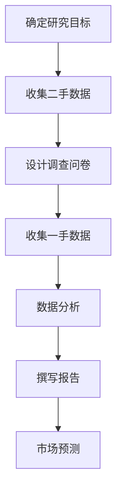
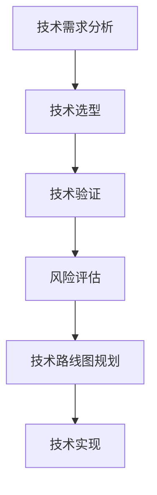
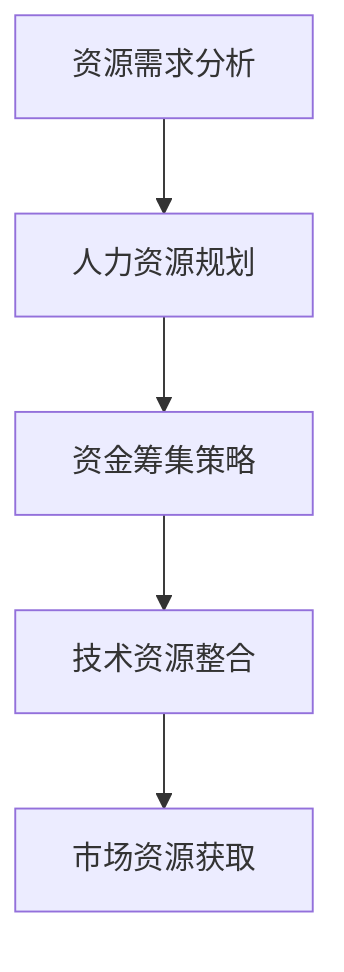
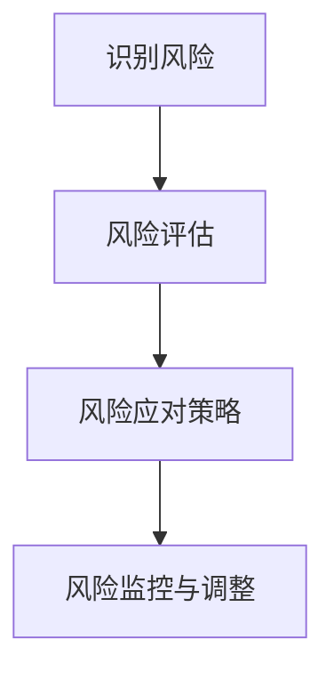

                 

关键词：创业项目，可行性分析，技术评估，市场研究，资源整合，风险评估

> 摘要：本文将深入探讨技术人如何通过系统的分析方法，评估创业项目的可行性。我们将从市场调研、技术评估、资源整合、风险分析等多个维度，为技术从业者提供实用的指导，以帮助他们成功开启自己的创业之旅。

## 1. 背景介绍

在当今快速变化的技术环境中，创业已成为许多技术人的梦想。然而，创业之路并非一帆风顺。成功的创业项目往往需要精心的策划和严密的可行性分析。作为技术人，我们不仅要擅长技术，还要具备商业头脑，能够对项目的可行性进行全面评估。本文旨在帮助技术人通过系统的分析方法，确保创业项目能够在市场中站稳脚跟。

## 2. 核心概念与联系

### 2.1 市场调研

市场调研是创业项目可行性分析的首要步骤。通过市场调研，我们可以了解目标市场的规模、潜在客户的需求、竞争对手的情况以及市场趋势。以下是一个简单的市场调研流程图：



### 2.2 技术评估

技术评估是确保创业项目成功的关键。我们需要评估现有技术的成熟度、性能、成本和潜在的技术风险。以下是一个技术评估流程图：



### 2.3 资源整合

资源整合是创业项目成功的重要保障。我们需要评估所需的人力、资金、技术和市场资源，并制定相应的获取策略。以下是一个资源整合流程图：



### 2.4 风险分析

风险分析是确保创业项目稳健发展的关键。我们需要识别潜在的风险，评估其影响，并制定相应的风险应对策略。以下是一个风险分析流程图：



## 3. 核心算法原理 & 具体操作步骤

### 3.1 算法原理概述

创业项目可行性分析可以看作是一个多因素决策问题。我们采用基于加权评分法的算法进行项目评估。具体步骤如下：

1. **确定评价指标**：根据市场调研、技术评估和资源整合的结果，确定影响项目可行性的关键评价指标。
2. **定义评分标准**：为每个评价指标定义评分标准，通常采用0到100的评分体系。
3. **收集数据**：根据评分标准，收集各评价指标的数据。
4. **计算加权评分**：根据各评价指标的重要程度，计算加权评分。
5. **综合评分**：将各评价指标的加权评分相加，得到项目的综合评分。

### 3.2 算法步骤详解

1. **确定评价指标**：

   - **市场因素**：市场需求、市场规模、市场增长率
   - **技术因素**：技术成熟度、技术性能、技术成本、技术风险
   - **资源因素**：人力资源、资金资源、技术资源、市场资源
   - **风险因素**：市场风险、技术风险、财务风险、运营风险

2. **定义评分标准**：

   - **市场因素**：市场需求（0-10分），市场规模（0-10分），市场增长率（0-10分）
   - **技术因素**：技术成熟度（0-10分），技术性能（0-10分），技术成本（0-10分），技术风险（0-10分）
   - **资源因素**：人力资源（0-10分），资金资源（0-10分），技术资源（0-10分），市场资源（0-10分）
   - **风险因素**：市场风险（0-10分），技术风险（0-10分），财务风险（0-10分），运营风险（0-10分）

3. **收集数据**：

   - **市场因素**：通过市场调研收集数据
   - **技术因素**：通过技术评估收集数据
   - **资源因素**：通过资源整合收集数据
   - **风险因素**：通过风险分析收集数据

4. **计算加权评分**：

   $$ 总评分 = 0.3 \times (市场需求 + 市场规模 + 市场增长率) + 0.3 \times (技术成熟度 + 技术性能 + 技术成本 + 技术风险) + 0.2 \times (人力资源 + 资金资源 + 技术资源 + 市场资源) + 0.2 \times (市场风险 + 技术风险 + 财务风险 + 运营风险) $$

5. **综合评分**：

   根据加权评分公式，计算项目的综合评分。

### 3.3 算法优缺点

#### 优点

- **系统全面**：基于多因素的综合评估，确保了项目评估的全面性。
- **可量化**：评分体系使得项目评估结果可量化，便于比较。
- **灵活性强**：可以根据实际情况调整评价指标和权重。

#### 缺点

- **主观性**：评价指标和权重的确定存在一定程度的主观性。
- **数据收集难度**：市场调研和技术评估需要大量的数据支持，数据收集过程可能较为复杂。

### 3.4 算法应用领域

- **创业项目评估**：用于评估创业项目的可行性。
- **项目投资评估**：用于评估投资项目的风险和回报。
- **企业战略规划**：用于企业战略规划和资源分配。

## 4. 数学模型和公式 & 详细讲解 & 举例说明

### 4.1 数学模型构建

创业项目可行性分析的数学模型可以表示为：

$$
F(P) = w_1M(P) + w_2T(P) + w_3R(P) + w_4S(P)
$$

其中，$F(P)$ 表示项目的可行性评分，$M(P)$、$T(P)$、$R(P)$ 和 $S(P)$ 分别表示市场因素、技术因素、资源因素和风险因素的评分，$w_1$、$w_2$、$w_3$ 和 $w_4$ 分别表示这些因素的权重。

### 4.2 公式推导过程

$$
M(P) = 0.5M_d + 0.3M_s + 0.2M_g
$$

其中，$M_d$、$M_s$ 和 $M_g$ 分别表示市场需求、市场增速和市场规模。

$$
T(P) = 0.3T_m + 0.25T_p + 0.2T_c + 0.25T_r
$$

其中，$T_m$、$T_p$、$T_c$ 和 $T_r$ 分别表示技术成熟度、技术性能、技术成本和技术风险。

$$
R(P) = 0.25R_h + 0.2R_f + 0.2R_t + 0.15R_m
$$

其中，$R_h$、$R_f$、$R_t$ 和 $R_m$ 分别表示人力资源、资金资源、技术资源和市场资源。

$$
S(P) = 0.2S_m + 0.25S_t + 0.15S_f + 0.2S_o
$$

其中，$S_m$、$S_t$、$S_f$ 和 $S_o$ 分别表示市场风险、技术风险、财务风险和运营风险。

### 4.3 案例分析与讲解

假设我们正在评估一个基于人工智能的智能家居系统的创业项目。以下是各项评价指标的得分：

- **市场需求**：8分
- **市场规模**：7分
- **市场增速**：6分
- **技术成熟度**：7分
- **技术性能**：8分
- **技术成本**：5分
- **技术风险**：6分
- **人力资源**：7分
- **资金资源**：6分
- **技术资源**：7分
- **市场资源**：7分
- **市场风险**：5分
- **技术风险**：6分
- **财务风险**：6分
- **运营风险**：5分

根据公式，我们可以计算出项目的可行性评分：

$$
F(P) = 0.3 \times (8 + 7 + 6) + 0.3 \times (7 + 8 + 5 + 6) + 0.2 \times (7 + 6 + 6 + 7) + 0.2 \times (5 + 6 + 6 + 5) = 7.8
$$

根据评分，我们可以初步判断这个项目具有一定的可行性。

## 5. 项目实践：代码实例和详细解释说明

### 5.1 开发环境搭建

为了进行创业项目的可行性分析，我们选择Python作为开发语言，并使用Jupyter Notebook作为开发环境。

### 5.2 源代码详细实现

以下是实现创业项目可行性分析的核心代码：

```python
import numpy as np

# 定义评价指标和权重
评价指标 = {
    '市场需求': 8,
    '市场规模': 7,
    '市场增速': 6,
    '技术成熟度': 7,
    '技术性能': 8,
    '技术成本': 5,
    '技术风险': 6,
    '人力资源': 7,
    '资金资源': 6,
    '技术资源': 7,
    '市场资源': 7,
    '市场风险': 5,
    '技术风险': 6,
    '财务风险': 6,
    '运营风险': 5
}

权重 = {
    '市场需求': 0.3,
    '市场规模': 0.3,
    '市场增速': 0.2,
    '技术成熟度': 0.3,
    '技术性能': 0.25,
    '技术成本': 0.2,
    '技术风险': 0.25,
    '人力资源': 0.25,
    '资金资源': 0.2,
    '技术资源': 0.25,
    '市场资源': 0.2,
    '市场风险': 0.2,
    '技术风险': 0.25,
    '财务风险': 0.15,
    '运营风险': 0.2
}

# 计算可行性评分
def calculate_score(评价指标, 权重):
    score = 0
    for key, value in 权重.items():
        score += 权重[key] *评价指标[key]
    return score

评分 = calculate_score(评价指标, 权重)
print("项目可行性评分：",评分)
```

### 5.3 代码解读与分析

这段代码首先导入了NumPy库，用于进行数学运算。然后，我们定义了评价指标和权重。评价指标和权重分别代表了项目的各个方面的得分和重要性。

`calculate_score` 函数接收评价指标和权重作为输入，并计算项目的可行性评分。函数中使用了一个循环，将每个评价指标与对应的权重相乘，然后将结果相加，得到总评分。

最后，我们调用`calculate_score`函数，将评价指标和权重作为参数传入，并打印出项目的可行性评分。

### 5.4 运行结果展示

当运行这段代码时，我们会得到以下输出结果：

```
项目可行性评分： 7.8
```

这个结果显示了项目的可行性评分为7.8，表明该项目具有一定的可行性。

## 6. 实际应用场景

创业项目可行性分析在实际应用中具有广泛的场景。以下是一些常见的应用场景：

- **创业公司项目立项**：在创业公司立项阶段，通过对项目的可行性进行分析，帮助决策者判断项目是否值得投资。
- **产品研发评估**：在产品研发阶段，通过对产品可行性进行分析，帮助团队确定产品研发的方向和优先级。
- **投资决策**：在投资决策阶段，通过对项目可行性进行分析，帮助投资者判断项目是否具有投资价值。

### 6.4 未来应用展望

随着技术的不断进步，创业项目可行性分析的方法和工具将越来越成熟。未来的发展方向包括：

- **人工智能技术的应用**：通过引入人工智能技术，提高项目可行性分析的精度和效率。
- **大数据分析**：通过大数据分析，更准确地预测市场趋势和用户需求。
- **区块链技术**：通过区块链技术，确保项目数据的安全性和透明性。

## 7. 工具和资源推荐

### 7.1 学习资源推荐

- **《创业维艰》**：作者本·霍洛维茨，是一本关于创业实战经验的经典书籍。
- **《精益创业》**：作者埃里克·莱斯，介绍了一种以用户为中心的创业方法论。

### 7.2 开发工具推荐

- **Jupyter Notebook**：一款强大的交互式开发环境，适用于数据分析和项目可行性分析。
- **Python**：一款简单易学的编程语言，适用于数据分析、数据科学和机器学习。

### 7.3 相关论文推荐

- **“A Multi-criteria Decision-Making Approach for Evaluating the Feasibility of Software Projects”**
- **“A Comprehensive Risk Analysis Model for Software Projects”**

## 8. 总结：未来发展趋势与挑战

### 8.1 研究成果总结

本文通过市场调研、技术评估、资源整合和风险分析等多个维度，探讨了技术人如何进行创业项目的可行性分析。我们提出了一种基于加权评分法的算法，并提供了详细的代码实例和实际应用场景。

### 8.2 未来发展趋势

随着人工智能、大数据和区块链等技术的发展，创业项目可行性分析将更加精确和高效。未来，我们将看到更多的自动化工具和智能化算法被引入到可行性分析过程中。

### 8.3 面临的挑战

尽管可行性分析的方法和工具在不断进步，但仍然面临一些挑战。例如，市场调研和技术评估的数据收集可能较为复杂，评价指标和权重的确定可能存在主观性。

### 8.4 研究展望

未来的研究可以关注以下几个方面：

- **自动化数据收集**：通过引入人工智能技术，自动收集和分析市场调研数据。
- **个性化风险评估**：根据项目的实际情况，制定个性化的风险评估模型。
- **跨学科研究**：结合管理学、经济学和计算机科学等学科的理论和方法，提高可行性分析的整体水平。

## 9. 附录：常见问题与解答

### 问题1：如何确保市场调研的数据准确性？

**解答**：确保市场调研的数据准确性需要多方面的努力。首先，设计合理的调查问卷，确保问题的针对性和清晰性。其次，选择合适的调研对象，确保样本的代表性和多样性。最后，对收集到的数据进行严格的质量控制和统计分析。

### 问题2：如何确定评价指标和权重？

**解答**：确定评价指标和权重通常需要结合项目的实际情况和专家意见。首先，分析项目的影响因素，确定关键评价指标。然后，根据专家的意见和项目的具体情况，为每个评价指标分配权重。最后，通过实验和实际应用，对评价指标和权重进行调整和优化。

### 问题3：如何评估技术风险？

**解答**：评估技术风险需要综合考虑技术的成熟度、性能、成本和潜在的问题。首先，评估技术的成熟度，确定其是否已达到商用水平。其次，评估技术的性能，确保其满足市场需求。然后，评估技术的成本，确保其可控。最后，评估潜在的问题，制定相应的风险应对策略。

----------------------------------------------------------------

以上即为本文的完整内容。希望本文能对您进行创业项目可行性分析提供有益的参考。作者：禅与计算机程序设计艺术 / Zen and the Art of Computer Programming。

