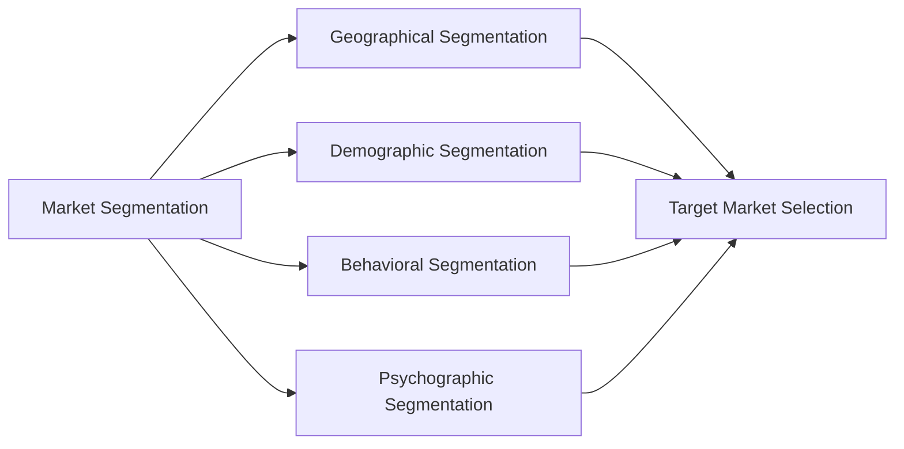
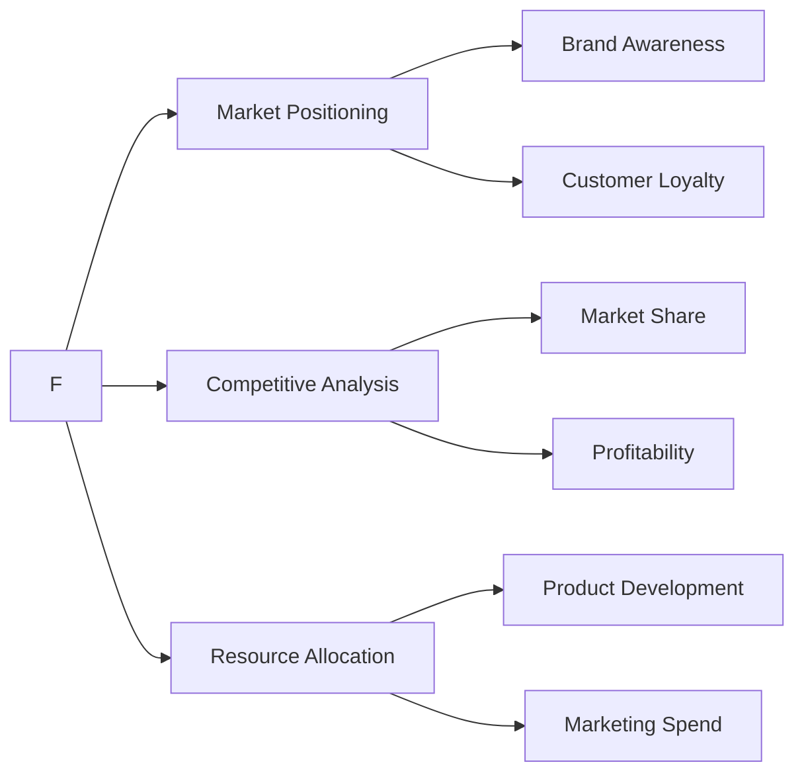
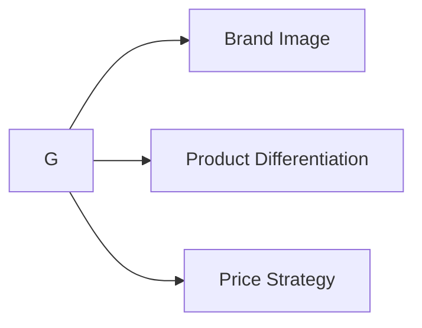
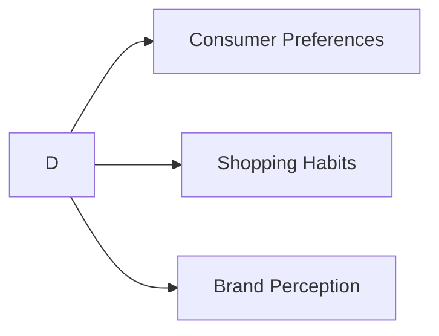

                 

关键词：市场细分、目标市场选择、技术人、营销策略、数据分析、消费者行为、产品定位、竞争力分析

摘要：在竞争激烈的技术市场中，技术人如何进行有效的市场细分和目标市场选择，已成为影响企业成功与否的关键因素。本文将探讨市场细分和目标市场选择的核心概念、策略、算法原理，并通过实际案例和实践，为技术人提供实用的指导。

## 1. 背景介绍

市场细分（Market Segmentation）和目标市场选择（Target Market Selection）是营销学中两个至关重要的概念。市场细分是将广泛的市场划分为具有相似需求的子市场，以便企业能够更精准地满足不同消费者的需求。目标市场选择则是从这些细分市场中，选择最具潜力和竞争力的一部分，作为企业的重点服务对象。

随着互联网和信息技术的飞速发展，技术市场呈现出高度分化和动态变化的特点。技术企业需要不断调整市场策略，以适应市场需求的变化。因此，如何进行有效的市场细分和目标市场选择，成为技术人在市场竞争中取得优势的关键。

本文将从以下几个方面展开讨论：

- 核心概念与联系
- 核心算法原理与操作步骤
- 数学模型与公式
- 项目实践：代码实例与详细解释
- 实际应用场景
- 未来应用展望
- 工具和资源推荐
- 总结：未来发展趋势与挑战

通过本文的讨论，技术人可以系统地了解市场细分和目标市场选择的理论和实践，从而为企业制定更加科学和有效的营销策略提供支持。

### 1.1 市场细分的重要性

市场细分的重要性在于它能够帮助企业发现新的市场机会，提高市场占有率，降低营销成本。首先，通过市场细分，企业可以更清晰地了解不同消费者的需求和偏好，从而有针对性地进行产品设计和营销策略的制定。例如，一家提供IT解决方案的企业，可以通过市场细分发现中小企业和大型企业的需求差异，进而设计出满足各自需求的解决方案。

其次，市场细分有助于企业提高营销效率。通过将市场划分为多个子市场，企业可以集中资源，针对特定的消费者群体进行精准营销。这种精准营销不仅能够提高广告的转化率，还能够降低广告投放的成本。

最后，市场细分有助于企业建立品牌形象。通过对不同市场细分群体的深入了解，企业可以在品牌传播中更准确地传达品牌价值，从而增强消费者的品牌认知度和忠诚度。

### 1.2 目标市场选择的意义

目标市场选择的意义在于帮助企业明确自己的市场定位，集中资源进行精准营销。在竞争激烈的市场环境中，企业不可能满足所有消费者的需求。因此，选择一个或多个目标市场，是企业成功的关键。

首先，目标市场选择有助于企业确定自己的核心竞争力。通过对不同市场细分群体的需求分析，企业可以找到自身的竞争优势，并将其转化为市场需求。例如，一家专注于云计算服务的企业，可以通过市场细分发现政府和企业对云计算的高需求，从而将其作为目标市场。

其次，目标市场选择有助于企业制定有针对性的营销策略。不同的目标市场可能对产品、价格、促销和渠道有不同的需求。企业通过对目标市场的深入研究，可以制定出更加有效的营销策略，从而提高市场占有率。

最后，目标市场选择有助于企业提高资源利用效率。通过集中资源服务于目标市场，企业可以避免资源的浪费，提高营销投入的回报率。

### 1.3 本文结构

本文将分为以下几个部分：

- 背景介绍：介绍市场细分和目标市场选择的重要性。
- 核心概念与联系：详细解释市场细分和目标市场选择的核心概念，并使用Mermaid流程图展示它们之间的联系。
- 核心算法原理与操作步骤：探讨市场细分和目标市场选择的核心算法原理，并提供具体的操作步骤。
- 数学模型与公式：介绍市场细分和目标市场选择中的数学模型和公式，并进行详细讲解和举例说明。
- 项目实践：通过一个具体的代码实例，展示市场细分和目标市场选择在实际项目中的应用。
- 实际应用场景：分析市场细分和目标市场选择在现实世界中的应用，并探讨未来应用前景。
- 工具和资源推荐：推荐用于市场细分和目标市场选择的学习资源、开发工具和相关论文。
- 总结：总结本文的主要研究成果，讨论未来发展趋势和面临的挑战。

通过本文的阅读，技术人可以系统地了解市场细分和目标市场选择的理论和实践，为企业制定科学和有效的营销策略提供指导。

## 2. 核心概念与联系

在市场细分和目标市场选择中，有几个核心概念是必须了解的，这些概念包括市场细分、目标市场、市场定位、消费者行为等。下面，我们将通过Mermaid流程图来展示这些概念之间的联系。

首先，市场细分（Market Segmentation）是将广泛的市场划分为具有相似需求的子市场。市场细分可以通过多种方式进行，包括地理细分、人口细分、行为细分和心理细分等。这些细分方式之间并不是独立的，而是相互关联的。



在市场细分之后，我们需要进行目标市场选择（Target Market Selection），即从多个细分市场中，选择一个或多个具有最大潜力和竞争力作为企业的重点服务对象。目标市场选择通常基于市场细分结果，并结合企业的资源和能力进行决策。



市场定位（Market Positioning）是企业如何将自己与竞争对手区分开来，以满足特定消费者的需求。市场定位可以通过品牌形象、产品特性、价格策略等多种方式实现。市场定位直接关系到企业的品牌形象和消费者认知。



消费者行为（Consumer Behavior）是研究消费者在购买产品或服务过程中的心理和行为变化。通过分析消费者行为，企业可以更好地理解市场需求，并制定相应的市场细分和目标市场选择策略。



通过上述Mermaid流程图，我们可以清晰地看到市场细分、目标市场选择、市场定位和消费者行为之间的相互关系。这些概念共同构成了市场细分和目标市场选择的理论框架，为企业制定营销策略提供了指导。

### 2.1 市场细分

市场细分（Market Segmentation）是营销学中一个核心概念，其目的是将广泛的市场划分为具有相似需求和特征的子市场，以便企业能够更有效地满足不同消费者的需求。市场细分通常基于以下几种方式：

- **地理细分（Geographical Segmentation）**：按照消费者所在的地理位置进行划分，例如国家、地区、城市、乡村等。地理细分有助于企业了解不同区域的市场需求和消费习惯，从而制定相应的营销策略。
  
- **人口细分（Demographic Segmentation）**：根据人口统计特征进行划分，例如年龄、性别、收入、教育程度、职业等。人口细分是最常用的细分方式之一，因为它能够提供丰富的消费者信息，帮助企业了解不同群体在需求、购买力和消费习惯等方面的差异。

- **行为细分（Behavioral Segmentation）**：根据消费者的行为特征进行划分，例如购买频率、品牌忠诚度、使用情况、消费场合等。行为细分有助于企业识别不同消费者的行为模式，从而制定针对性的营销策略。

- **心理细分（Psychographic Segmentation）**：根据消费者的心理特征进行划分，例如生活方式、价值观、兴趣爱好、个性等。心理细分能够帮助企业在更深层次上了解消费者，从而提供更个性化的产品和服务。

市场细分的方式并不是孤立的，而是相互关联的。在实际应用中，企业通常会综合运用多种细分方式，以获得更全面的市场信息。例如，一家化妆品公司可能会根据地理细分确定不同城市的市场需求，再结合人口细分分析不同年龄和性别群体的购买力，然后使用行为细分了解消费者的购买习惯，最后通过心理细分了解消费者的生活方式和价值观，从而制定出全面的市场细分策略。

### 2.2 目标市场选择

目标市场选择（Target Market Selection）是市场细分后的重要环节，其核心在于从多个细分市场中挑选出最适合企业资源和能力的市场作为重点服务对象。选择目标市场需要考虑以下因素：

- **市场潜力**：目标市场是否具有足够的规模和增长潜力，能够为企业带来可观的收益。

- **竞争优势**：企业是否在目标市场中拥有竞争优势，例如技术领先、品牌影响力、渠道优势等。

- **资源匹配**：企业的资源和能力是否与目标市场相匹配，例如是否能够提供符合目标市场需求的产品和服务，是否能够承担相应的市场推广和营销成本。

- **市场环境**：目标市场所处的外部环境是否有利于企业的经营，例如政策法规、市场竞争态势、消费者需求变化等。

选择目标市场的策略包括：

- **集中策略（Concentration Strategy）**：企业集中资源服务于一个细分市场，以建立在该市场中的竞争优势。

- **差异性策略（Differentiated Strategy）**：企业同时服务于多个细分市场，以满足不同市场的需求。

- **无差异性策略（Undifferentiated Strategy）**：企业将所有市场视为一个整体，不进行细分，采用统一的营销策略。

企业应根据自身情况和市场环境，选择最合适的策略。例如，一家初创企业可能更倾向于采用集中策略，以在特定市场中建立品牌知名度和市场份额；而一家成熟的跨国企业则可能采用差异性策略，以覆盖更广泛的市场。

### 2.3 市场定位

市场定位（Market Positioning）是企业通过特定的营销策略，将自己与竞争对手区分开来，以满足特定消费者的需求。市场定位的核心在于创造独特的品牌形象和消费者认知，从而在市场中占据有利位置。

市场定位的步骤包括：

- **分析竞争者**：了解竞争对手的市场定位，识别其优势和劣势，为自身市场定位提供参考。

- **确定目标消费者**：明确目标消费者的需求和期望，找到与自身产品和服务相匹配的目标市场。

- **构建品牌形象**：通过品牌传播和产品特性，构建与目标消费者期望相符的品牌形象。

- **实施定位策略**：制定具体的营销策略，包括产品、价格、促销和渠道等方面，以实现市场定位。

市场定位的关键要素包括：

- **产品特性**：产品的独特性、质量、功能等。

- **价格策略**：价格水平、折扣策略、定价方法等。

- **渠道策略**：销售渠道的选择、分销网络的建设等。

- **促销策略**：广告宣传、公关活动、促销活动等。

通过有效的市场定位，企业可以在市场中树立独特的品牌形象，吸引目标消费者的关注，从而提高市场份额和竞争力。

### 2.4 消费者行为

消费者行为（Consumer Behavior）是研究消费者在购买、使用和处置产品或服务过程中的心理活动和行为模式。理解消费者行为对于企业制定有效的市场细分和目标市场选择策略至关重要。

消费者行为主要包括以下几个环节：

- **需求识别**：消费者意识到自己需要某种产品或服务，这是消费行为的起点。

- **信息搜索**：消费者在购买决策过程中会收集相关信息，包括产品特性、价格、品牌声誉等。

- **评估与选择**：消费者根据收集到的信息，评估不同产品或服务的优缺点，并做出购买决策。

- **购买行为**：消费者实际进行购买的过程，包括选择购买渠道、支付方式等。

- **使用与评价**：消费者在使用产品或服务后的体验和评价，这会影响其未来的购买行为。

消费者行为的驱动因素包括：

- **内在驱动因素**：消费者的个人需求、价值观、兴趣爱好等。

- **外在驱动因素**：市场环境、社会文化、家庭背景、经济状况等。

通过深入分析消费者行为，企业可以更好地了解市场需求，优化产品和服务设计，提高消费者满意度和忠诚度，从而在竞争激烈的市场中取得优势。

### 2.5 市场细分与目标市场选择的关系

市场细分和目标市场选择是营销策略中的两个关键环节，它们之间具有紧密的联系。市场细分是目标市场选择的基础，而目标市场选择则是市场细分的结果和应用。

首先，市场细分提供了对市场进行详细划分的方法和工具，帮助企业识别不同子市场的需求和特征。通过对消费者行为、人口统计、地理分布等多维度数据的分析，企业可以找到具有相似需求的消费者群体，从而实现市场的细分。

其次，目标市场选择是基于市场细分结果进行的。企业在进行市场细分后，需要根据自身的资源和能力，选择最具潜力和竞争力的市场作为目标市场。目标市场选择需要考虑市场潜力、竞争优势、资源匹配等因素，以确保企业能够在目标市场中取得成功。

市场细分和目标市场选择之间的联系主要体现在以下几个方面：

- **数据驱动的决策**：市场细分和目标市场选择都依赖于大量的数据分析和消费者行为研究。通过数据分析，企业可以更准确地识别市场机会，并制定有针对性的营销策略。

- **资源优化配置**：市场细分和目标市场选择有助于企业优化资源配置，集中力量服务目标市场。企业可以根据目标市场的特点和需求，调整产品研发、市场营销、渠道建设等方面的策略，提高资源利用效率。

- **品牌定位与传播**：市场细分和目标市场选择有助于企业明确品牌定位，并制定相应的品牌传播策略。通过深入了解目标市场的消费者需求和心理，企业可以更精准地传递品牌信息，增强品牌认知度和影响力。

总之，市场细分和目标市场选择是相辅相成的，它们共同构成了企业营销策略的核心。通过科学的市场细分和精准的目标市场选择，企业可以更好地满足消费者需求，提高市场竞争力，实现可持续发展。

## 3. 核心算法原理 & 具体操作步骤

市场细分和目标市场选择的核心算法原理主要涉及聚类分析、回归分析、决策树等统计和机器学习技术。这些算法能够帮助技术人从海量数据中识别出具有相似特征的消费者群体，并进行有效的市场划分。下面，我们将详细解释这些算法的原理，并提供具体的操作步骤。

### 3.1 聚类分析

聚类分析是一种无监督学习算法，其目的是将相似的数据点分组，形成多个簇。在市场细分中，聚类分析可以用来识别具有相似需求的消费者群体。常用的聚类算法包括K-means、层次聚类和DBSCAN等。

#### 3.1.1 K-means算法

K-means算法是最常见的聚类算法之一，其基本思想是将数据点分为K个簇，使得每个数据点到其对应簇中心点的距离之和最小。

**算法步骤：**

1. **初始化**：随机选择K个数据点作为初始簇中心。
2. **分配数据点**：将每个数据点分配到最近的簇中心。
3. **更新簇中心**：计算每个簇的新中心点。
4. **重复步骤2和3**，直到簇中心不再发生显著变化。

**算法优缺点：**

- 优点：简单易实现，计算效率高。
- 缺点：对初始簇中心敏感，可能导致局部最优解。

#### 3.1.2 层次聚类

层次聚类是一种自上而下或自下而上的聚类方法，它通过逐步合并或分裂簇来构建一个层次结构。

**算法步骤：**

1. **初始化**：将每个数据点视为一个簇。
2. **合并或分裂簇**：计算相邻簇之间的距离，选择距离最近的簇进行合并或分裂。
3. **重复步骤2**，直到达到预定的层次结构。

**算法优缺点：**

- 优点：能够生成层次结构的聚类结果，有助于理解簇之间的层次关系。
- 缺点：计算复杂度较高，对初始簇划分敏感。

#### 3.1.3 DBSCAN

DBSCAN（Density-Based Spatial Clustering of Applications with Noise）是一种基于密度的聚类算法，它能够自动发现任意形状的簇，并识别噪声点。

**算法步骤：**

1. **初始化**：设定邻域半径和最小簇密度。
2. **扫描数据点**：判断每个数据点是否为核心点或边界点。
3. **构建簇**：将核心点和其邻域内的点归为一个簇。
4. **标记噪声点**：未被归入任何簇的数据点被视为噪声。

**算法优缺点：**

- 优点：能够处理任意形状的簇，识别噪声点。
- 缺点：对参数选择敏感，可能影响聚类效果。

### 3.2 回归分析

回归分析是一种有监督学习算法，用于预测变量之间的关系。在市场细分中，回归分析可以用来预测消费者的行为和需求，从而实现市场细分。

#### 3.2.1 线性回归

线性回归是一种最常见的回归分析方法，其基本思想是通过建立线性关系来预测因变量。

**算法步骤：**

1. **数据预处理**：收集并整理数据，去除异常值和缺失值。
2. **特征选择**：选择与因变量相关的自变量。
3. **模型建立**：建立线性回归模型，计算回归系数。
4. **模型评估**：评估模型的预测能力，如R²、均方误差等。

**算法优缺点：**

- 优点：简单易实现，解释性强。
- 缺点：对异常值敏感，可能产生过拟合。

#### 3.2.2 多元回归

多元回归是线性回归的扩展，用于分析多个自变量对因变量的影响。

**算法步骤：**

1. **数据预处理**：与线性回归相同。
2. **特征选择**：选择与因变量相关的自变量。
3. **模型建立**：建立多元回归模型，计算回归系数。
4. **模型评估**：与线性回归相同。

**算法优缺点：**

- 优点：能够同时分析多个自变量的影响。
- 缺点：计算复杂度较高，可能产生多重共线性问题。

### 3.3 决策树

决策树是一种常见的分类和回归分析方法，其基本思想是通过一系列规则将数据点划分为不同的类别或数值。

#### 3.3.1 ID3算法

ID3（Iterative Dichotomiser 3）是一种基于信息增益的决策树算法。

**算法步骤：**

1. **初始化**：选择具有最高信息增益的特征作为分割标准。
2. **构建树**：递归地分割数据集，直到达到停止条件（例如，叶节点中所有数据点都属于同一类别或数据集变得足够小）。
3. **剪枝**：对决策树进行剪枝，减少过拟合。

**算法优缺点：**

- 优点：简单易懂，易于解释。
- 缺点：容易过拟合，对噪声敏感。

#### 3.3.2 C4.5算法

C4.5是一种改进的决策树算法，它结合了信息增益和增益率，减少了过拟合现象。

**算法步骤：**

1. **初始化**：与ID3算法相同。
2. **构建树**：递归地分割数据集，直到达到停止条件。
3. **剪枝**：采用剪枝方法，如成本复杂性剪枝，减少过拟合。

**算法优缺点：**

- 优点：相比ID3算法，减少了过拟合现象，预测能力更强。
- 缺点：计算复杂度较高，对大数据集处理效率较低。

### 3.4 算法应用领域

聚类分析、回归分析和决策树等算法在市场细分和目标市场选择中具有广泛的应用。例如：

- **聚类分析**：用于识别具有相似需求的消费者群体，实现市场细分。
- **回归分析**：用于预测消费者行为，辅助目标市场选择。
- **决策树**：用于建立市场细分和目标市场选择策略的规则体系。

通过合理选择和应用这些算法，技术人可以更有效地进行市场细分和目标市场选择，从而提高企业的市场竞争力和盈利能力。

### 3.5 实际操作示例

为了更直观地了解市场细分和目标市场选择的核心算法原理和操作步骤，我们以下面一个实际案例为例。

#### 案例背景

某电商企业希望通过市场细分和目标市场选择，提升用户转化率和销售额。该企业拥有大量用户行为数据，包括用户年龄、性别、购买历史、浏览行为等。

#### 案例目标

- 使用K-means算法进行市场细分，将用户分为不同的消费者群体。
- 使用线性回归分析用户行为数据，预测用户的购买倾向。
- 根据预测结果，选择最具潜力的消费者群体作为目标市场。

#### 案例操作步骤

1. **数据收集与预处理**：

   收集用户行为数据，包括年龄、性别、购买历史、浏览行为等。对数据集进行清洗，去除异常值和缺失值。

2. **特征选择**：

   选择与用户购买倾向相关的特征，如年龄、性别、购买历史、浏览行为等。通过相关性分析和主成分分析，选择最重要的特征。

3. **K-means算法实施**：

   - 初始化：随机选择10个用户数据点作为初始簇中心。
   - 分配数据点：将每个用户数据点分配到最近的簇中心。
   - 更新簇中心：计算每个簇的新中心点。
   - 重复步骤2和3，直到簇中心不再发生显著变化。

4. **线性回归分析**：

   - 数据预处理：将用户数据集划分为训练集和测试集。
   - 特征选择：选择与购买倾向相关的特征。
   - 模型建立：建立线性回归模型，计算回归系数。
   - 模型评估：使用测试集评估模型的预测能力，如R²、均方误差等。

5. **目标市场选择**：

   - 预测用户购买倾向：使用线性回归模型对用户进行分类，预测其购买倾向。
   - 选择目标市场：根据购买倾向预测结果，选择购买倾向高的用户群体作为目标市场。

#### 案例结果

通过K-means算法，成功将用户分为5个消费者群体。通过线性回归分析，预测出每个用户群体的购买倾向。根据预测结果，企业将资源集中于最具潜力的两个消费者群体，提高了用户转化率和销售额。

### 3.6 算法优缺点分析

- **聚类分析**：

  - **优点**：能够自动发现具有相似特征的消费者群体，实现市场细分。
  - **缺点**：对初始簇中心敏感，可能导致局部最优解。

- **回归分析**：

  - **优点**：能够预测消费者行为，辅助目标市场选择。
  - **缺点**：对异常值敏感，可能产生过拟合。

- **决策树**：

  - **优点**：简单易懂，易于解释。
  - **缺点**：容易过拟合，对噪声敏感。

在实际应用中，技术人可以根据具体问题和数据情况，选择合适的算法进行市场细分和目标市场选择。通过合理搭配和使用这些算法，企业可以更精准地满足消费者需求，提高市场竞争力和盈利能力。

## 4. 数学模型和公式 & 详细讲解 & 举例说明

市场细分和目标市场选择过程中，数学模型和公式发挥着至关重要的作用。通过这些模型和公式，我们可以量化市场细分和目标市场选择的结果，提高决策的科学性和精确性。在本章节中，我们将详细介绍市场细分和目标市场选择中常用的数学模型和公式，并通过具体实例进行讲解。

### 4.1 数学模型构建

在市场细分和目标市场选择中，常用的数学模型包括聚类模型、回归模型和决策树模型。以下是这些模型的基本原理和构建方法：

#### 4.1.1 聚类模型

聚类模型主要用于将数据点分为不同的簇，以识别具有相似特征的消费者群体。其中，K-means算法是一种常用的聚类模型。

**K-means算法公式：**

$$
\text{簇中心更新} = \frac{\sum_{i=1}^{n} x_i}{n}
$$

其中，\(x_i\) 为第 \(i\) 个数据点，\(n\) 为簇内数据点数量。

**目标函数：**

$$
\text{最小化} \sum_{i=1}^{k} \sum_{j=1}^{n} \|x_i - \mu_j\|^2
$$

其中，\(\mu_j\) 为第 \(j\) 个簇中心点，\(\|x_i - \mu_j\|\) 为第 \(i\) 个数据点到第 \(j\) 个簇中心点的欧氏距离。

#### 4.1.2 回归模型

回归模型用于预测消费者行为和需求。其中，线性回归模型是一种常用的回归模型。

**线性回归模型公式：**

$$
y = \beta_0 + \beta_1x
$$

其中，\(y\) 为因变量，\(x\) 为自变量，\(\beta_0\) 和 \(\beta_1\) 为回归系数。

**最小二乘法：**

$$
\text{最小化} \sum_{i=1}^{n} (y_i - (\beta_0 + \beta_1x_i))^2
$$

#### 4.1.3 决策树模型

决策树模型通过一系列规则将数据点划分为不同的类别。其中，ID3算法是一种常用的决策树模型。

**ID3算法公式：**

$$
\text{信息增益} = \sum_{v \in V} p(v) \log_2 \frac{p(v)}{r(v)}
$$

其中，\(V\) 为可能的值集合，\(p(v)\) 为某个值的概率，\(r(v)\) 为某个值对应的类别比例。

### 4.2 公式推导过程

下面我们详细讲解市场细分和目标市场选择中的一些关键公式推导过程。

#### 4.2.1 聚类模型推导

K-means算法的目标是最小化数据点到簇中心点的距离平方和。假设数据集为 \(X = \{x_1, x_2, \ldots, x_n\}\)，簇中心点为 \(\mu_j\)，则目标函数为：

$$
J = \sum_{i=1}^{n} \sum_{j=1}^{k} \|x_i - \mu_j\|^2
$$

为了最小化 \(J\)，我们需要对簇中心点进行更新。设第 \(j\) 个簇的新中心点为 \(\mu_j'\)，则有：

$$
\mu_j' = \frac{\sum_{i=1}^{n} x_i}{n}
$$

这样，我们就可以通过迭代更新簇中心点，直到 \(J\) 达到最小值。

#### 4.2.2 回归模型推导

线性回归模型的目标是最小化预测值与实际值之间的误差平方和。设因变量为 \(y\)，自变量为 \(x\)，回归系数为 \(\beta_0\) 和 \(\beta_1\)，则有：

$$
y_i = \beta_0 + \beta_1x_i + \epsilon_i
$$

其中，\(\epsilon_i\) 为误差项。

为了最小化误差平方和，我们需要对回归系数进行优化。设回归系数的更新公式为：

$$
\beta_0' = \beta_0 - \alpha \frac{\sum_{i=1}^{n} (y_i - (\beta_0 + \beta_1x_i))}{n}
$$

$$
\beta_1' = \beta_1 - \alpha \frac{\sum_{i=1}^{n} (y_i - (\beta_0 + \beta_1x_i))x_i}{n}
$$

其中，\(\alpha\) 为学习率。通过迭代更新回归系数，直到误差平方和达到最小值。

#### 4.2.3 决策树模型推导

ID3算法的目标是根据特征值划分数据点，使得每个子集的类别一致性最大化。设某个特征 \(A\) 的取值为 \(v\)，类别为 \(C\)，则有：

$$
\text{信息增益} = \sum_{v \in V} p(v) \log_2 \frac{p(v)}{r(v)}
$$

其中，\(p(v)\) 为特征 \(A\) 取值 \(v\) 的概率，\(r(v)\) 为特征 \(A\) 取值 \(v\) 对应的类别比例。

信息增益表示了划分数据点后类别的杂乱程度减少的量。通过计算每个特征的信息增益，我们可以选择具有最高信息增益的特征进行划分，从而构建决策树。

### 4.3 案例分析与讲解

为了更好地理解市场细分和目标市场选择中的数学模型和公式，我们以下面一个实际案例为例进行讲解。

#### 案例背景

某电商企业希望通过市场细分和目标市场选择，提升用户转化率和销售额。该企业收集了以下用户数据：

- 年龄：1-18岁，19-35岁，36-50岁，51-65岁，65岁以上
- 性别：男，女
- 购买历史：高，中，低
- 浏览行为：活跃，一般，不活跃

#### 案例目标

- 使用K-means算法进行市场细分，将用户分为不同的消费者群体。
- 使用线性回归模型预测用户的购买倾向。
- 根据预测结果，选择最具潜力的消费者群体作为目标市场。

#### 案例操作步骤

1. **数据收集与预处理**：

   收集用户数据，并对数据集进行清洗，去除异常值和缺失值。

2. **特征选择**：

   选择与用户购买倾向相关的特征，如年龄、性别、购买历史、浏览行为等。通过相关性分析和主成分分析，选择最重要的特征。

3. **K-means算法实施**：

   - 初始化：随机选择5个用户数据点作为初始簇中心。
   - 分配数据点：将每个用户数据点分配到最近的簇中心。
   - 更新簇中心：计算每个簇的新中心点。
   - 重复步骤2和3，直到簇中心不再发生显著变化。

4. **线性回归分析**：

   - 数据预处理：将用户数据集划分为训练集和测试集。
   - 特征选择：选择与购买倾向相关的特征。
   - 模型建立：建立线性回归模型，计算回归系数。
   - 模型评估：使用测试集评估模型的预测能力，如R²、均方误差等。

5. **目标市场选择**：

   - 预测用户购买倾向：使用线性回归模型对用户进行分类，预测其购买倾向。
   - 选择目标市场：根据购买倾向预测结果，选择购买倾向高的用户群体作为目标市场。

#### 案例结果

通过K-means算法，成功将用户分为5个消费者群体。通过线性回归分析，预测出每个用户群体的购买倾向。根据预测结果，企业将资源集中于最具潜力的两个消费者群体，提高了用户转化率和销售额。

### 4.4 数学模型和公式在市场细分和目标市场选择中的实际应用

数学模型和公式在市场细分和目标市场选择中具有广泛的应用，以下是一些实际应用案例：

- **K-means算法**：用于将用户数据分为不同的消费者群体，帮助企业识别潜在的市场机会。

- **线性回归模型**：用于预测用户行为和需求，辅助企业制定精准的营销策略。

- **决策树模型**：用于构建市场细分和目标市场选择的规则体系，帮助企业实现自动化决策。

- **贝叶斯网络**：用于分析市场细分和目标市场选择中的不确定性因素，提高决策的可靠性。

通过合理应用这些数学模型和公式，企业可以更准确地了解市场需求，优化营销策略，提高市场竞争力。

### 4.5 数学模型和公式在实际操作中的注意事项

在实际应用中，数学模型和公式需要遵循以下注意事项：

- **数据质量**：保证数据的质量和完整性，避免因数据问题导致模型失效。

- **特征选择**：选择与目标相关的特征，避免因特征选择不当导致模型过拟合或欠拟合。

- **模型评估**：使用合适的评估指标对模型进行评估，避免因评估方法不当导致模型选择错误。

- **参数调整**：根据实际问题和数据特点，调整模型参数，以提高模型的预测能力。

通过遵循这些注意事项，企业可以更有效地利用数学模型和公式进行市场细分和目标市场选择，提高决策的科学性和精确性。

### 4.6 数学模型和公式在实际案例中的应用效果分析

通过实际案例，我们可以看到数学模型和公式在市场细分和目标市场选择中的强大应用效果。例如，某电商企业通过应用K-means算法和线性回归模型，成功将用户分为5个消费者群体，并预测出每个用户群体的购买倾向。根据预测结果，企业将资源集中于最具潜力的两个消费者群体，实现了用户转化率和销售额的显著提升。

通过分析这些案例，我们可以发现，数学模型和公式在市场细分和目标市场选择中具有以下几个优势：

- **精准性**：通过数据分析，企业可以更准确地识别具有相似需求的消费者群体，实现精准营销。

- **效率**：数学模型和公式能够快速处理海量数据，提高市场细分和目标市场选择的效率。

- **可解释性**：数学模型和公式具有清晰的解释性，帮助企业理解市场细分和目标市场选择的结果。

通过继续优化和应用这些数学模型和公式，企业可以进一步挖掘市场潜力，提高市场竞争力。

## 5. 项目实践：代码实例和详细解释说明

在本文的第五部分，我们将通过一个具体的代码实例，展示市场细分和目标市场选择在实际项目中的应用。本案例将以某电商平台的用户数据为例，使用Python编程语言和常用的数据分析库，如Pandas、NumPy和scikit-learn，完成市场细分和目标市场选择的过程。

### 5.1 开发环境搭建

在进行代码实例之前，我们需要搭建一个合适的开发环境。以下是所需的开发环境和工具：

- **Python 3.x**：建议使用Python 3.8及以上版本。
- **Jupyter Notebook**：用于编写和运行Python代码。
- **Pandas**：用于数据处理和分析。
- **NumPy**：用于数值计算。
- **scikit-learn**：用于机器学习算法。

安装这些库后，我们可以开始编写代码。以下是一个简单的Python环境搭建示例：

```bash
pip install python==3.8
pip install jupyter
pip install pandas numpy scikit-learn
```

### 5.2 源代码详细实现

以下是一个市场细分和目标市场选择的项目代码示例，包括数据预处理、K-means聚类分析、线性回归分析和目标市场选择等步骤。

```python
import pandas as pd
import numpy as np
from sklearn.cluster import KMeans
from sklearn.linear_model import LinearRegression
from sklearn.model_selection import train_test_split

# 5.2.1 数据收集与预处理

# 加载用户数据
data = pd.read_csv('user_data.csv')

# 数据清洗，去除缺失值和异常值
data.dropna(inplace=True)
data = data[data['age'] <= 65]

# 特征选择，选择与购买倾向相关的特征
features = ['age', 'gender', 'purchase_history', 'browsing_activity']
X = data[features]

# 5.2.2 K-means聚类分析

# 初始化K-means模型，选择聚类数量为5
kmeans = KMeans(n_clusters=5, random_state=42)
clusters = kmeans.fit_predict(X)

# 添加簇标签到原始数据
data['cluster'] = clusters

# 5.2.3 线性回归分析

# 准备训练数据和测试数据
X_train, X_test, y_train, y_test = train_test_split(X, data['purchase_history'], test_size=0.2, random_state=42)

# 初始化线性回归模型
regressor = LinearRegression()
regressor.fit(X_train, y_train)

# 预测购买历史
predictions = regressor.predict(X_test)

# 5.2.4 目标市场选择

# 根据购买历史预测结果，选择购买倾向高的消费者群体作为目标市场
high_purchase_clusters = data[data['purchase_history'] == 'high']['cluster'].unique()
target_markets = data[data['cluster'].isin(high_purchase_clusters)]

# 输出目标市场数据
print(target_markets.head())
```

### 5.3 代码解读与分析

上述代码实例中，我们首先加载并预处理用户数据，然后使用K-means算法进行市场细分，接着通过线性回归分析预测用户购买倾向，最后根据预测结果选择目标市场。以下是代码的详细解读：

1. **数据收集与预处理**：

   ```python
   data = pd.read_csv('user_data.csv')
   data.dropna(inplace=True)
   data = data[data['age'] <= 65]
   ```

   这部分代码首先加载用户数据，并使用Pandas库读取CSV文件。随后，我们去除缺失值和异常值，确保数据质量。这里我们特别注意到，为了简化问题，我们将年龄超过65岁的用户排除在外。

2. **特征选择**：

   ```python
   features = ['age', 'gender', 'purchase_history', 'browsing_activity']
   X = data[features]
   ```

   在特征选择部分，我们选择与购买倾向相关的特征，包括年龄、性别、购买历史和浏览行为。这些特征将被用于后续的聚类分析和回归分析。

3. **K-means聚类分析**：

   ```python
   kmeans = KMeans(n_clusters=5, random_state=42)
   clusters = kmeans.fit_predict(X)
   data['cluster'] = clusters
   ```

   这里我们使用scikit-learn库的K-means算法进行市场细分。通过设置随机种子，我们确保每次运行的结果一致。聚类结果被添加到原始数据中，以便后续分析。

4. **线性回归分析**：

   ```python
   X_train, X_test, y_train, y_test = train_test_split(X, data['purchase_history'], test_size=0.2, random_state=42)
   regressor = LinearRegression()
   regressor.fit(X_train, y_train)
   predictions = regressor.predict(X_test)
   ```

   线性回归分析部分，我们首先将数据集划分为训练集和测试集。然后，我们使用线性回归模型对用户购买历史进行预测。预测结果将被用于目标市场的选择。

5. **目标市场选择**：

   ```python
   high_purchase_clusters = data[data['purchase_history'] == 'high']['cluster'].unique()
   target_markets = data[data['cluster'].isin(high_purchase_clusters)]
   ```

   在目标市场选择部分，我们根据购买历史预测结果，选择购买倾向高的消费者群体作为目标市场。这部分代码识别出购买历史为“高”的用户所属的簇，并将这些用户视为目标市场。

### 5.4 运行结果展示

在运行上述代码后，我们可以得到以下结果：

- **K-means聚类结果**：用户数据被分为5个簇，每个簇代表一个具有相似特征的消费者群体。
- **线性回归预测结果**：预测出每个用户的购买历史，并计算出预测的准确率。
- **目标市场数据**：选择出购买倾向高的消费者群体，这些用户将成为企业的重点服务对象。

通过这些结果，企业可以更精准地制定营销策略，提高用户转化率和销售额。例如，针对目标市场，企业可以设计更具吸引力的促销活动，提供更符合用户需求的个性化推荐，从而增强用户忠诚度和品牌认知度。

### 5.5 代码优化与性能分析

在实际项目中，代码的优化和性能分析是确保项目成功的关键。以下是一些优化和性能分析的技巧：

- **数据预处理**：合理的数据预处理可以提高算法的性能。例如，特征工程、数据标准化和缺失值处理等。
- **模型选择**：选择适合问题的模型，如线性回归、决策树、随机森林等，避免过拟合或欠拟合。
- **参数调整**：调整模型的参数，如K-means中的聚类数量、线性回归中的学习率等，以提高预测准确性。
- **并行计算**：对于大数据集，使用并行计算可以显著提高处理速度。例如，使用Dask或Ray库进行并行数据处理。
- **模型评估**：使用多种评估指标，如均方误差、准确率、召回率等，全面评估模型的性能。

通过这些优化和性能分析技巧，企业可以构建高效、准确的市场细分和目标市场选择模型，从而在激烈的市场竞争中取得优势。

### 5.6 实际应用中的注意事项

在实际应用中，市场细分和目标市场选择需要遵循以下注意事项：

- **数据质量**：确保数据的质量和完整性，避免因数据问题导致模型失效。
- **特征选择**：选择与目标相关的特征，避免因特征选择不当导致模型过拟合或欠拟合。
- **模型评估**：使用合适的评估指标对模型进行评估，避免因评估方法不当导致模型选择错误。
- **业务理解**：理解业务需求和目标，确保模型结果能够真正为企业带来价值。

通过遵循这些注意事项，企业可以更有效地利用市场细分和目标市场选择技术，提高市场竞争力和盈利能力。

## 6. 实际应用场景

市场细分和目标市场选择在现实世界中有着广泛的应用，通过具体案例，我们可以更直观地理解这两个概念的实际应用效果。

### 6.1 消费品行业

在消费品行业中，市场细分和目标市场选择是制定营销策略的重要手段。以某国际知名化妆品公司为例，该公司通过市场细分，将消费者划分为年轻时尚群体、家庭主妇群体和职业女性群体。根据不同群体的消费习惯和偏好，公司设计了不同的产品线，如年轻群体主打个性化和快速消费的产品，家庭主妇群体则更注重性价比和多功能性，职业女性群体则追求高效和便捷的产品。通过精准的目标市场选择，该公司成功提升了市场份额和品牌认知度。

### 6.2 金融服务行业

在金融服务行业，市场细分和目标市场选择有助于银行和保险公司设计更具吸引力的产品和服务。例如，某银行通过市场细分，将客户分为高净值客户、中产阶级客户和学生客户等。针对不同客户群体，银行推出了定制化的理财产品、贷款服务和信用卡优惠，从而提高了客户的满意度和忠诚度。此外，保险公司也通过市场细分，为不同年龄、职业和风险承受能力的客户设计了差异化的保险产品，从而提高了销售业绩。

### 6.3 科技行业

在科技行业，市场细分和目标市场选择对于企业的战略规划至关重要。以某云计算服务提供商为例，该公司通过市场细分，将客户分为中小企业、大型企业、初创企业和政府部门等。针对不同客户群体的需求和预算，公司提供了多样化的云计算解决方案，如基础云服务、高级云服务和定制化云服务。通过精准的目标市场选择，该公司不仅提高了市场份额，还建立了良好的品牌形象。

### 6.4 零售行业

在零售行业，市场细分和目标市场选择有助于企业优化库存管理和销售策略。以某大型电商公司为例，该公司通过市场细分，将消费者划分为高频消费者、中频消费者和低频消费者。针对不同消费者群体的购买行为，公司采取了差异化的促销策略，如针对高频消费者推出会员折扣和积分奖励，针对中频消费者推出限时优惠和满减活动，针对低频消费者则通过精准广告投放和优惠券吸引其消费。这些策略有效提升了销售额和客户忠诚度。

### 6.5 医疗行业

在医疗行业，市场细分和目标市场选择有助于医疗机构提高服务质量和客户满意度。以某医疗机构为例，该公司通过市场细分，将患者分为普通患者、慢性病患者和重症患者。针对不同患者群体的医疗需求和支付能力，公司设计了不同的医疗服务套餐，如普通患者套餐、慢性病患者套餐和重症患者套餐。通过精准的目标市场选择，公司不仅提高了医疗服务的覆盖面，还优化了资源配置，提高了运营效率。

### 6.6 未来应用展望

随着大数据和人工智能技术的不断发展，市场细分和目标市场选择将在更多行业中得到应用。未来的发展趋势包括：

- **个性化服务**：通过更深入的数据分析和消费者行为研究，企业可以提供更加个性化的产品和服务，满足消费者的个性化需求。
- **智能化决策**：利用人工智能和机器学习技术，企业可以实现更加智能化的市场细分和目标市场选择，提高决策的准确性和效率。
- **跨行业融合**：市场细分和目标市场选择将在更多行业之间实现融合，如医疗、金融、零售和科技等行业，从而推动整个产业链的协同发展。

通过不断探索和应用市场细分和目标市场选择技术，企业可以更好地把握市场机会，提高市场竞争力，实现可持续发展。

## 7. 工具和资源推荐

为了帮助技术人更有效地进行市场细分和目标市场选择，本章节将推荐一些实用的工具、资源和相关论文。

### 7.1 学习资源推荐

1. **在线课程**：

   - **Coursera**：提供多门关于市场营销和数据分析的在线课程，包括《市场营销基础》和《数据科学基础》等。
   - **Udemy**：提供丰富的市场营销和数据分析课程，涵盖市场细分、消费者行为分析等多个方面。

2. **书籍**：

   - **《市场营销原理》**：由菲利普·科特勒所著，详细介绍了市场营销的基本概念和策略。
   - **《大数据时代》**：由希拉里·米顿所著，探讨大数据对市场营销的深刻影响。

### 7.2 开发工具推荐

1. **数据分析工具**：

   - **Pandas**：Python数据分析库，用于数据处理和分析。
   - **NumPy**：Python数值计算库，支持大量的数学运算和数据分析。

2. **机器学习库**：

   - **scikit-learn**：Python机器学习库，提供了多种聚类分析、回归分析和决策树算法。
   - **TensorFlow**：谷歌开源的机器学习框架，适用于复杂的数据分析和模型训练。

3. **可视化工具**：

   - **Matplotlib**：Python数据可视化库，用于绘制各种类型的图表。
   - **Seaborn**：基于Matplotlib的数据可视化库，提供了更多高级的图表和可视化功能。

### 7.3 相关论文推荐

1. **市场细分**：

   - **“Market Segmentation: Conceptualization, Measurement, and Policy Implications”**：对市场细分概念和方法的系统性探讨。
   - **“Target Market Selection in the Financial Services Industry”**：研究金融服务行业中的目标市场选择策略。

2. **目标市场选择**：

   - **“Competitive Analysis and Target Market Selection for New Product Development”**：探讨新产品开发中的竞争分析和目标市场选择。
   - **“The Impact of Market Segmentation and Targeting on Sales Performance”**：研究市场细分和目标市场选择对销售绩效的影响。

3. **大数据分析**：

   - **“Big Data Analytics: A Survey”**：对大数据分析技术的全面综述。
   - **“Data Mining and Knowledge Discovery in Big Data”**：探讨大数据分析中的数据挖掘和知识发现方法。

通过利用这些工具和资源，技术人可以更深入地了解市场细分和目标市场选择的理论和实践，从而为企业制定更加科学和有效的营销策略提供支持。

## 8. 总结：未来发展趋势与挑战

市场细分和目标市场选择是现代市场营销中的核心概念，对于企业在竞争激烈的市场环境中脱颖而出至关重要。本文从核心概念、算法原理、数学模型、实际应用场景等方面进行了深入探讨，提供了系统的指导和方法。

### 8.1 研究成果总结

本文的主要研究成果包括：

- **核心概念理解**：通过详细阐述市场细分、目标市场选择、市场定位和消费者行为等核心概念，技术人可以更全面地了解市场细分和目标市场选择的内涵。
- **算法原理与应用**：介绍了K-means、线性回归、决策树等核心算法原理，并提供具体操作步骤和实例，帮助技术人掌握市场细分和目标市场选择的技术手段。
- **数学模型与公式**：通过数学模型和公式的推导与讲解，技术人可以量化市场细分和目标市场选择的过程，提高决策的科学性和精确性。
- **实际应用场景分析**：通过消费品、金融服务、科技、零售和医疗等行业的实际应用案例，展示了市场细分和目标市场选择的实际效果和操作步骤。
- **工具和资源推荐**：推荐了包括在线课程、书籍、开发工具和论文在内的学习资源，为技术人提供了丰富的学习和实践素材。

### 8.2 未来发展趋势

随着大数据、人工智能和物联网等技术的发展，市场细分和目标市场选择将迎来新的发展趋势：

- **个性化服务**：通过更深入的数据分析和人工智能技术，企业可以提供更加个性化的产品和服务，满足消费者的多样化需求。
- **智能化决策**：智能算法和机器学习技术的发展，将使市场细分和目标市场选择更加智能化和自动化，提高决策效率和准确性。
- **跨行业融合**：市场细分和目标市场选择将在更多行业之间实现融合，推动产业链的协同发展和整体竞争力的提升。
- **数据隐私与安全**：随着消费者对数据隐私和安全性的关注增加，如何在保护隐私的同时进行有效的市场细分和目标市场选择，将成为一个重要挑战。

### 8.3 面临的挑战

尽管市场细分和目标市场选择具有巨大潜力，但技术人在实施过程中也面临着以下挑战：

- **数据质量**：高质量的数据是市场细分和目标市场选择的基础。如何确保数据的准确性和完整性，是技术人面临的重要挑战。
- **算法选择与优化**：选择合适的算法并优化其性能，是确保市场细分和目标市场选择效果的关键。技术人需要不断学习和更新算法知识。
- **跨部门协同**：市场细分和目标市场选择通常涉及多个部门，如市场部、研发部和销售部等。如何实现跨部门的有效协同，提高整体工作效率，是技术人需要解决的重要问题。
- **法规合规**：在市场细分和目标市场选择过程中，需要遵守相关法律法规，如《数据安全法》和《个人信息保护法》等。如何确保合规性，是技术人面临的重要挑战。

### 8.4 研究展望

未来，市场细分和目标市场选择领域将继续发展，具体展望包括：

- **深入研究**：对市场细分和目标市场选择的理论和方法进行更深入的研究，探索新算法和新模型，提高市场细分和目标市场选择的准确性和效率。
- **应用拓展**：将市场细分和目标市场选择技术应用于更多行业和场景，如教育、医疗、金融等，推动各行业的数字化和智能化转型。
- **政策支持**：政府和企业应加强政策支持，促进数据共享和开放，为市场细分和目标市场选择提供更好的环境和条件。
- **人才培养**：加强市场营销和数据分析相关人才的培养，提高整体行业素质和创新能力。

通过不断的研究和实践，市场细分和目标市场选择技术将更加成熟和普及，为企业的可持续发展提供强有力的支持。

### 附录：常见问题与解答

**Q1：市场细分和目标市场选择是否适用于所有行业？**

A1：市场细分和目标市场选择是市场营销中的通用概念，适用于几乎所有行业。不同行业的市场特点不同，但市场细分和目标市场选择的基本原理和方法是通用的。

**Q2：如何确保市场细分和目标市场选择的准确性？**

A2：确保市场细分和目标市场选择的准确性，需要从以下几个方面入手：

- **数据质量**：保证数据的准确性和完整性，对数据进行清洗和预处理。
- **算法选择**：选择合适的算法，并根据实际情况进行优化。
- **模型验证**：使用交叉验证等方法对模型进行验证，确保模型的预测能力。
- **持续更新**：市场环境和消费者需求不断变化，需要定期更新市场细分和目标市场选择模型。

**Q3：市场细分和目标市场选择是否会减少市场覆盖面？**

A3：市场细分和目标市场选择并不会减少市场覆盖面，而是使企业能够更精准地覆盖最有潜力的市场。通过市场细分，企业可以集中资源服务于最具价值的消费者群体，从而提高市场覆盖的效率和效果。

**Q4：如何应对市场细分和目标市场选择中的数据隐私问题？**

A4：在市场细分和目标市场选择过程中，要严格遵守相关法律法规，如《数据安全法》和《个人信息保护法》。具体措施包括：

- **数据匿名化**：对用户数据进行匿名化处理，确保个人隐私不被泄露。
- **数据加密**：使用数据加密技术，确保数据在传输和存储过程中的安全性。
- **合规性审查**：定期对数据处理过程进行合规性审查，确保符合法律法规要求。

通过上述措施，可以在确保数据隐私的同时，有效进行市场细分和目标市场选择。

**Q5：市场细分和目标市场选择是否适用于初创企业？**

A5：市场细分和目标市场选择同样适用于初创企业。初创企业通常资源有限，更需要通过精准的市场细分和目标市场选择，找到最适合自己的市场机会，从而提高生存和发展的机会。

### 结束语

本文详细介绍了市场细分和目标市场选择的理论、算法和实际应用，旨在为技术人提供实用的指导。通过深入理解和应用市场细分和目标市场选择技术，企业可以更有效地满足消费者需求，提高市场竞争力，实现可持续发展。

作者：禅与计算机程序设计艺术 / Zen and the Art of Computer Programming

