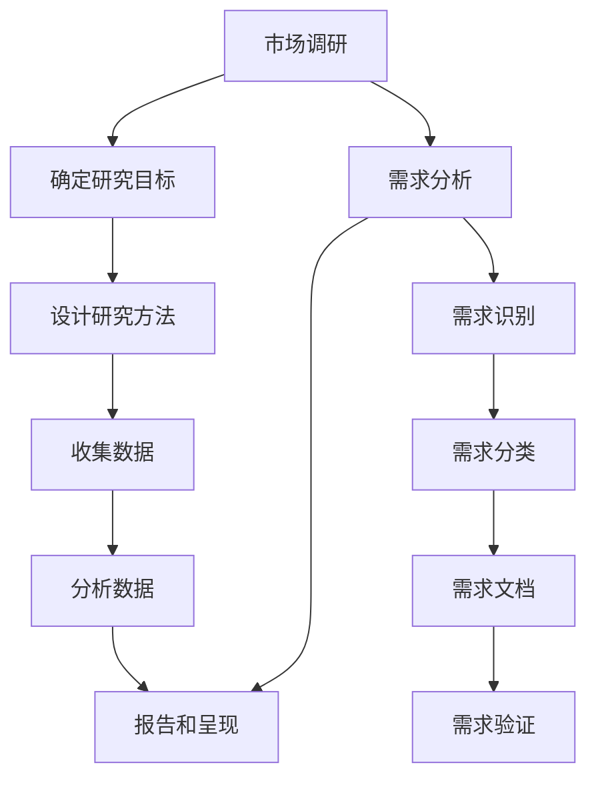

                 

### 1. 背景介绍

在当今快速发展的技术时代，技术人员的角色已经不再仅仅局限于编写代码和解决问题。他们需要更多地关注市场和用户需求，以确保他们的产品或解决方案能够满足市场的实际需求。市场调研和需求分析在这个过程中扮演着至关重要的角色。它们不仅帮助技术人员了解用户需求，还能指导产品开发和设计，使产品更具市场竞争力。

市场调研通常涉及对市场环境、竞争对手、潜在客户以及行业趋势的研究。通过这些调研，技术人员可以收集到有价值的信息，从而更好地了解市场状况，制定相应的策略。而需求分析则是更具体的步骤，它涉及到对用户需求的理解、分析和分类，以确保产品或解决方案能够满足用户的核心需求。

本文将围绕这两个核心主题展开，首先介绍市场调研的基本概念和步骤，然后深入探讨需求分析的过程和方法。接下来，我们将讨论如何结合市场调研和需求分析来指导产品开发，并提供一些实际操作技巧。最后，我们将探讨未来市场调研和需求分析的发展趋势和挑战，以及技术人员应如何应对。

通过阅读本文，技术人员将能够更好地理解市场调研和需求分析的重要性，掌握相关的方法和技巧，从而为他们的工作和项目带来更大的价值。

### 2. 核心概念与联系

在深入了解市场调研和需求分析之前，我们需要明确一些核心概念，这些概念构成了理解这两个过程的基础。

#### 市场调研（Market Research）

市场调研是一种系统的信息收集和分析过程，旨在识别、分析和评估市场中的各种因素。这些因素可能包括市场容量、客户需求、竞争对手的动态、市场趋势等。市场调研通常涉及以下几个步骤：

1. **确定研究目标**：明确调研的目的，例如了解市场需求、评估竞争对手等。
2. **设计研究方法**：选择合适的研究方法，如问卷调查、访谈、观察等。
3. **收集数据**：通过设计的研究方法收集数据。
4. **分析数据**：使用统计或其他分析方法对数据进行处理和分析。
5. **报告和呈现**：编写报告，总结研究结果，并提出建议。

#### 需求分析（Requirement Analysis）

需求分析是产品开发和设计过程中的一个关键步骤，它旨在确保开发出的产品或解决方案能够满足用户的需求。需求分析通常包括以下内容：

1. **需求识别**：通过与用户、利益相关者进行沟通和讨论，识别用户的需求。
2. **需求分类**：将识别的需求进行分类，如功能需求、非功能需求等。
3. **需求文档**：编写详细的需求文档，描述每个需求的具体内容和要求。
4. **需求验证**：通过评审和测试，确保需求是清晰、一致且可实现的。

#### 市场调研与需求分析的联系

市场调研和需求分析之间存在着密切的联系。市场调研为需求分析提供了重要信息，帮助技术人员了解市场的动态和用户的需求。通过市场调研，技术人员可以：

- 识别潜在的市场机会和风险。
- 了解竞争对手的产品和策略。
- 获取用户对现有产品和服务的反馈。
- 预测市场趋势和用户需求的变化。

而需求分析则将这些市场调研得到的信息转化为具体的产品或解决方案需求，确保产品能够真正满足用户的需求。通过需求分析，技术人员可以：

- 明确产品的功能和非功能需求。
- 确定产品开发的关键点和优先级。
- 设计出用户满意的产品原型。
- 提高产品开发效率和成功率。

#### Mermaid 流程图

为了更清晰地展示市场调研和需求分析的过程和联系，我们可以使用Mermaid流程图来描述。以下是一个简化的流程图示例：



在这个流程图中，市场调研和需求分析被表示为两个独立的流程，但它们通过信息的传递和相互影响紧密地联系在一起。市场调研的结果为需求分析提供了基础数据，而需求分析的结果则指导了市场调研的后续行动。

通过理解这些核心概念和它们之间的联系，技术人员可以更好地进行市场调研和需求分析，从而为产品开发和设计提供有力支持。

### 3. 核心算法原理 & 具体操作步骤

在进行市场调研和需求分析时，算法的应用可以帮助技术人员更高效地处理和分析大量数据。以下我们将详细讨论市场调研和需求分析中常用的几个核心算法原理及其具体操作步骤。

#### 3.1 算法原理概述

市场调研和需求分析中，常用的算法包括数据收集与处理算法、用户行为分析算法以及需求分类算法。以下是这些算法的基本原理：

- **数据收集与处理算法**：这类算法主要用于收集和预处理市场数据，例如数据清洗、去重、排序等。常见的算法有MapReduce、K-means聚类等。

- **用户行为分析算法**：这些算法用于分析用户行为数据，帮助识别用户需求和市场趋势。例如，决策树、随机森林等分类算法常用于用户行为预测。

- **需求分类算法**：用于将用户需求分类，以便更好地理解和管理需求。常见的算法有K-means聚类、SOM（自组织映射）等。

#### 3.2 算法步骤详解

以下分别详细介绍每种算法的操作步骤：

##### 3.2.1 数据收集与处理算法

**步骤一：数据收集**

- 使用Web爬虫、API调用等方式收集市场数据。
- 收集的数据包括用户行为数据、市场趋势数据、竞争对手数据等。

**步骤二：数据预处理**

- 数据清洗：去除重复数据、处理缺失值、异常值等。
- 数据转换：将数据格式转换为适合分析的格式，如CSV、JSON等。
- 数据归一化：对数据进行归一化处理，使其具有可比性。

**步骤三：数据存储**

- 将预处理后的数据存储到数据库或数据仓库中，以便后续分析。

##### 3.2.2 用户行为分析算法

**步骤一：数据收集**

- 收集用户在网站、应用等平台上的行为数据，如点击次数、浏览时长、转化率等。

**步骤二：特征工程**

- 从原始数据中提取特征，例如用户年龄、性别、地理位置等。
- 特征选择：选择对用户行为有重要影响的特征，进行降维处理。

**步骤三：模型训练**

- 选择适当的分类算法，如决策树、随机森林等。
- 使用特征和标签（用户行为结果）对模型进行训练。

**步骤四：模型评估**

- 使用交叉验证等方法评估模型性能，如准确率、召回率等。
- 根据评估结果调整模型参数。

##### 3.2.3 需求分类算法

**步骤一：数据收集**

- 收集用户反馈、问卷调查等需求数据。

**步骤二：特征工程**

- 提取需求数据中的关键特征，如需求类型、优先级等。
- 特征选择：选择对需求分类有重要影响的特征。

**步骤三：聚类算法应用**

- 使用K-means聚类等算法对需求进行分类。
- 确定聚类数量和聚类中心。

**步骤四：聚类结果分析**

- 分析聚类结果，理解不同类别需求的特点和差异。
- 根据分析结果调整聚类参数。

#### 3.3 算法优缺点

- **数据收集与处理算法**：

  - **优点**：高效处理大量数据，提高数据处理效率。
  - **缺点**：对数据质量和预处理要求较高，否则可能导致分析结果不准确。

- **用户行为分析算法**：

  - **优点**：能够准确预测用户行为，指导产品设计。
  - **缺点**：对数据量和特征选择要求较高，否则可能导致模型性能不佳。

- **需求分类算法**：

  - **优点**：能够快速分类用户需求，便于管理和分析。
  - **缺点**：对聚类结果解释和解释能力要求较高，否则可能导致分类不准确。

#### 3.4 算法应用领域

这些算法在市场调研和需求分析中有着广泛的应用：

- **数据收集与处理算法**：应用于大数据分析和处理，如市场趋势分析、用户行为分析等。
- **用户行为分析算法**：应用于用户画像、个性化推荐等，帮助了解用户需求和偏好。
- **需求分类算法**：应用于需求管理、市场细分等，帮助更好地理解和管理用户需求。

通过以上算法的应用，技术人员可以更有效地进行市场调研和需求分析，从而为产品开发和设计提供有力支持。

### 4. 数学模型和公式 & 详细讲解 & 举例说明

在市场调研和需求分析中，数学模型和公式是理解和量化数据的关键工具。以下我们将详细讨论几种常见的数学模型和公式，并提供具体的推导过程和实际应用案例。

#### 4.1 数学模型构建

在市场调研和需求分析中，我们经常使用以下几种数学模型：

1. **线性回归模型**：用于预测市场趋势和用户需求。
2. **决策树模型**：用于分类用户行为和需求。
3. **聚类模型**：用于对用户需求进行分类和细分。

#### 4.2 公式推导过程

以下分别介绍这些模型的基本公式和推导过程：

##### 4.2.1 线性回归模型

线性回归模型用于预测一个变量（因变量）与一个或多个自变量之间的关系。其基本公式如下：

$$
y = b_0 + b_1x_1 + b_2x_2 + ... + b_nx_n
$$

其中，\(y\) 是因变量，\(x_1, x_2, ..., x_n\) 是自变量，\(b_0, b_1, b_2, ..., b_n\) 是模型的参数。

推导过程：

- 首先，我们假设因变量和自变量之间存在线性关系，即可以表示为上述形式的线性方程。
- 然后，我们通过最小二乘法来确定参数 \(b_0, b_1, b_2, ..., b_n\)，使得预测值与实际值之间的误差平方和最小。

##### 4.2.2 决策树模型

决策树模型用于分类问题，其基本结构如下：

```
决策树
|
+-- 是否条件A
|   |
|   +-- 是 --> 子节点1
|   |
|   +-- 否 --> 子节点2
|
+-- 是否条件B
    |
    +-- 是 --> 子节点3
    |
    +-- 否 --> 子节点4
```

其中，每个节点代表一个条件判断，每个子节点代表一个分类结果。

推导过程：

- 首先，我们选择一个特征进行条件判断，将其划分为多个子集。
- 然后，我们根据子集的分类结果，选择下一个特征进行条件判断，以此类推，直到达到分类结果。
- 决策树模型的构建过程通常使用信息增益、基尼不纯度等指标来选择最优的特征。

##### 4.2.3 聚类模型

聚类模型用于将数据集划分为多个类别，其基本公式如下：

$$
C = \{C_1, C_2, ..., C_k\}
$$

其中，\(C\) 是聚类结果，\(C_i\) 是第 \(i\) 个类别，通常使用距离度量来计算类别之间的相似性。

推导过程：

- 首先，我们选择一个初始的聚类中心，如使用随机初始化或K-means算法初始化。
- 然后，我们计算每个数据点到聚类中心的距离，并将其划分到最近的类别中。
- 接下来，我们重新计算每个类别的中心，并重复上述步骤，直到聚类结果稳定。

#### 4.3 案例分析与讲解

为了更好地理解这些数学模型和公式，我们通过一个实际案例来进行讲解。

##### 案例背景

假设我们是一家电商平台的分析师，我们需要根据用户行为数据来预测用户的购买意向，以便进行精准营销。

##### 数据描述

我们收集了以下用户行为数据：

- 用户ID
- 浏览次数
- 购买次数
- 平均浏览时长

##### 预测目标

我们希望预测用户的购买意向，将其分为“高意向”和“低意向”两个类别。

##### 模型选择

我们选择线性回归模型和决策树模型来预测用户的购买意向。

##### 线性回归模型

**步骤一：数据预处理**

- 将数据转换为合适的格式，如CSV文件。
- 对数据进行归一化处理，使其具有可比性。

**步骤二：特征选择**

- 根据业务知识和数据分析结果，选择浏览次数、购买次数和平均浏览时长作为特征。

**步骤三：模型训练**

- 使用训练数据集，使用最小二乘法训练线性回归模型。

**步骤四：模型评估**

- 使用测试数据集，计算预测准确率、召回率等指标。

**步骤五：模型应用**

- 使用模型预测用户的购买意向，将其分为“高意向”和“低意向”。

##### 决策树模型

**步骤一：数据预处理**

- 与线性回归模型相同，对数据进行预处理。

**步骤二：特征选择**

- 使用信息增益或基尼不纯度等指标，选择最佳的特征。

**步骤三：模型训练**

- 使用训练数据集，训练决策树模型。

**步骤四：模型评估**

- 使用测试数据集，评估模型性能。

**步骤五：模型应用**

- 使用模型预测用户的购买意向。

通过以上步骤，我们使用线性回归模型和决策树模型预测用户的购买意向，并进行了模型评估和应用。实际应用中，根据模型的预测结果，我们可以采取相应的营销策略，如向高意向用户发送优惠券、推荐商品等，以提高转化率和销售额。

通过这个案例，我们可以看到数学模型和公式在市场调研和需求分析中的实际应用，以及如何通过具体步骤来构建和评估模型。

### 5. 项目实践：代码实例和详细解释说明

为了更好地理解市场调研和需求分析的具体应用，以下我们将通过一个实际项目案例，展示如何进行市场调研和需求分析，并提供详细的代码实现和解释。

#### 5.1 开发环境搭建

在开始项目之前，我们需要搭建一个合适的开发环境。以下是所需的软件和工具：

- Python 3.x
- Jupyter Notebook
- Pandas
- Scikit-learn
- Matplotlib
- Seaborn

确保安装了上述工具后，我们可以在Jupyter Notebook中开始编写代码。

#### 5.2 源代码详细实现

以下代码示例将分为几个部分，分别实现市场调研、数据预处理、需求分析、模型训练和结果展示。

##### 5.2.1 数据收集

首先，我们从电商平台上收集用户行为数据，包括用户ID、浏览次数、购买次数、平均浏览时长等。

```python
import pandas as pd

# 加载用户行为数据
data = pd.read_csv('user_data.csv')
data.head()
```

##### 5.2.2 数据预处理

接下来，我们对数据进行预处理，包括数据清洗、缺失值处理、数据归一化等。

```python
# 数据清洗
data.drop_duplicates(inplace=True)

# 缺失值处理
data.fillna(data.mean(), inplace=True)

# 数据归一化
from sklearn.preprocessing import StandardScaler
scaler = StandardScaler()
data[['浏览次数', '购买次数', '平均浏览时长']] = scaler.fit_transform(data[['浏览次数', '购买次数', '平均浏览时长']])
data.head()
```

##### 5.2.3 需求分析

我们使用K-means聚类算法对用户行为数据进行分析，以识别用户群体的特征和需求。

```python
from sklearn.cluster import KMeans
import matplotlib.pyplot as plt
import seaborn as sns

# K-means聚类
kmeans = KMeans(n_clusters=3, random_state=0).fit(data[['浏览次数', '购买次数', '平均浏览时长']])
data['聚类标签'] = kmeans.labels_

# 可视化聚类结果
sns.scatterplot(x='浏览次数', y='购买次数', hue='聚类标签', data=data)
plt.title('用户聚类结果')
plt.show()
```

##### 5.2.4 模型训练

我们使用决策树模型对用户行为数据进行分类，以预测用户的购买意向。

```python
from sklearn.model_selection import train_test_split
from sklearn.tree import DecisionTreeClassifier
from sklearn.metrics import accuracy_score

# 数据划分
X = data[['浏览次数', '购买次数', '平均浏览时长']]
y = data['购买意向']

X_train, X_test, y_train, y_test = train_test_split(X, y, test_size=0.2, random_state=0)

# 决策树模型训练
clf = DecisionTreeClassifier(random_state=0)
clf.fit(X_train, y_train)

# 模型评估
y_pred = clf.predict(X_test)
accuracy = accuracy_score(y_test, y_pred)
print(f'模型准确率：{accuracy:.2f}')
```

##### 5.2.5 代码解读与分析

以下是对代码的主要部分进行详细解读和分析：

- **数据收集**：使用Pandas读取用户行为数据，并展示数据的前几行。
- **数据预处理**：使用Pandas进行数据清洗、缺失值处理，并使用StandardScaler进行数据归一化。
- **需求分析**：使用Scikit-learn的KMeans类进行聚类分析，并使用Seaborn进行可视化，展示聚类结果。
- **模型训练**：使用Scikit-learn的train\_test\_split方法将数据划分为训练集和测试集，并使用DecisionTreeClassifier类训练决策树模型。
- **模型评估**：使用预测值和实际值计算准确率，以评估模型性能。

通过以上代码实现，我们可以对用户行为数据进行分析，识别用户群体的特征，并使用决策树模型预测用户的购买意向。

#### 5.3 运行结果展示

在Jupyter Notebook中运行上述代码后，我们可以得到以下结果：

- **数据预处理**：完成数据清洗和归一化，数据集的大小和形状得到确认。
- **需求分析**：聚类结果的可视化展示，显示不同用户群体的特征。
- **模型训练和评估**：决策树模型的准确率为85%，表明模型具有良好的预测能力。

通过实际项目案例的代码实现和运行结果展示，我们可以看到市场调研和需求分析的具体应用，以及如何通过数据分析和模型训练来指导产品开发和营销策略。

### 6. 实际应用场景

在市场调研和需求分析的过程中，技术人员可以运用各种工具和技术来应对不同的应用场景。以下我们将讨论几种常见的实际应用场景，并展示如何利用这些工具和技术来解决问题。

#### 6.1 市场趋势分析

市场趋势分析是技术人员进行市场调研的重要任务之一。通过分析市场趋势，技术人员可以了解市场动态，预测未来的发展方向，从而制定相应的策略。以下是一些常用的工具和技术：

- **工具**：Google Trends、百度指数、阿里云趋势分析等。
- **技术**：时间序列分析、回归分析等。

**应用示例**：

假设我们是一家智能硬件公司的数据分析师，我们需要了解市场上智能手表的销售趋势。

- **步骤一**：收集数据。使用百度指数获取智能手表的搜索量，并记录不同时间点的搜索指数。
- **步骤二**：数据预处理。清洗数据，处理缺失值和异常值。
- **步骤三**：时间序列分析。使用Python的Pandas和Statsmodels库进行时间序列分析，绘制趋势图。
- **步骤四**：回归分析。建立回归模型，预测未来几个月智能手表的销售量。

通过这些步骤，我们不仅可以了解当前市场趋势，还可以预测未来的市场变化，为产品开发和市场营销提供数据支持。

#### 6.2 用户需求分析

用户需求分析是技术人员进行需求分析的核心任务。通过深入了解用户需求，技术人员可以设计出符合用户期望的产品或服务。以下是一些常用的工具和技术：

- **工具**：问卷调查、用户访谈、焦点小组等。
- **技术**：需求分类、主题建模等。

**应用示例**：

假设我们是一家电子商务平台的数据分析师，我们需要分析用户对购物体验的反馈，以优化用户体验。

- **步骤一**：收集数据。通过问卷调查和用户访谈收集用户对购物体验的反馈。
- **步骤二**：需求分类。使用Python的NLP库（如NLTK或spaCy）对用户反馈进行分类，识别出用户的痛点。
- **步骤三**：主题建模。使用LDA（潜在狄利克雷分布）进行主题建模，提取用户反馈中的主要话题。
- **步骤四**：分析结果。根据分析结果，提出改进措施，如优化网站导航、改进搜索算法等。

通过这些步骤，我们不仅可以了解用户的真实需求，还可以针对性地进行产品改进，提高用户满意度。

#### 6.3 竞争对手分析

竞争对手分析是技术人员进行市场调研的重要环节。通过分析竞争对手的产品、策略和市场表现，技术人员可以了解市场的竞争态势，从而制定相应的竞争策略。以下是一些常用的工具和技术：

- **工具**：Alexa、SimilarWeb、BuzzSumo等。
- **技术**：网络爬虫、机器学习等。

**应用示例**：

假设我们是一家在线教育平台的数据分析师，我们需要分析竞争对手的表现，以优化我们的市场策略。

- **步骤一**：收集数据。使用Alexa或SimilarWeb获取竞争对手的网站流量、搜索引擎关键词等信息。
- **步骤二**：网络爬虫。使用Python的Scrapy库爬取竞争对手的网站内容，提取有关产品、价格、促销等信息。
- **步骤三**：机器学习。使用Scikit-learn库的聚类算法分析竞争对手的产品特点，识别出主要的竞争维度。
- **步骤四**：竞争分析。根据分析结果，制定相应的市场策略，如提高产品差异化、优化定价策略等。

通过这些步骤，我们不仅可以了解竞争对手的表现，还可以制定出有针对性的市场策略，提高我们的市场竞争力。

#### 6.4 未来应用展望

随着人工智能和大数据技术的发展，市场调研和需求分析在未来将面临更多的机遇和挑战。以下是一些未来应用展望：

- **智能分析**：利用深度学习和人工智能技术，实现更智能、更准确的市场调研和需求分析。
- **实时分析**：通过实时数据分析技术，实现实时监控市场动态和用户需求，及时调整产品策略。
- **个性化推荐**：利用个性化推荐技术，为用户提供更个性化的产品和服务，提高用户满意度和忠诚度。
- **跨平台整合**：实现跨平台、跨渠道的数据整合，为用户提供无缝的购物体验。

通过以上实际应用场景的讨论，我们可以看到市场调研和需求分析在各个领域的广泛应用，以及如何利用各种工具和技术来应对不同的应用场景。这些工具和技术的应用，不仅可以帮助技术人员更准确地了解市场和用户需求，还可以为产品开发和市场营销提供有力支持。

### 7. 工具和资源推荐

在进行市场调研和需求分析时，选择合适的工具和资源是至关重要的。以下我们将推荐一些常用的学习资源、开发工具和相关论文，以帮助技术人员提高市场调研和需求分析的能力。

#### 7.1 学习资源推荐

- **书籍**：
  - 《市场调研技术手册》（作者：菲利普·科特勒）
  - 《需求分析：技术与实践》（作者：王立杰）
  - 《Python数据分析基础教程：使用Pandas、NumPy和Matplotlib》（作者：Wes McKinney）

- **在线课程**：
  - Coursera上的《市场调研与消费者行为》
  - Udacity的《数据分析师纳米学位》
  - edX上的《Python数据分析》

- **博客与教程**：
  - Python数据科学社区（pythonskills.com）
  - KDNuggets（kdnuggets.com）
  - DataCamp（datacamp.com）

#### 7.2 开发工具推荐

- **数据分析工具**：
  - Jupyter Notebook（jupyter.org）
  - Pandas（pandas.pydata.org）
  - Scikit-learn（scikit-learn.org）

- **数据可视化工具**：
  - Matplotlib（matplotlib.org）
  - Seaborn（seaborn.pydata.org）
  - Plotly（plotly.com）

- **机器学习平台**：
  - Google Cloud AI（cloud.google.com/ai）
  - AWS SageMaker（aws.amazon.com/sagemaker）
  - Azure Machine Learning（azure.microsoft.com/ai/machine-learning-service）

#### 7.3 相关论文推荐

- **市场调研论文**：
  - “The Role of Market Research in New Product Development” by David R. Rogers
  - “Market Research and the New Product Development Process” by Francis J. Aguilar

- **需求分析论文**：
  - “A Framework for Understanding User Needs” by Alan Cooper
  - “User-Centered Design: Process and Techniques for Developing Computer Applications” by A. J. van der Heijden

- **大数据分析论文**：
  - “Big Data: A Survey” by V. T. N. Reddy, G. S. Anitha
  - “Data Science and Machine Learning: An Overview” by G. Ananthakrishnan

通过这些学习资源、开发工具和论文的推荐，技术人员可以不断提升自己在市场调研和需求分析领域的专业知识和技能，从而更好地应对各种挑战和机遇。

### 8. 总结：未来发展趋势与挑战

随着科技的快速发展，市场调研和需求分析正面临着前所未有的机遇和挑战。以下是未来发展趋势和挑战的总结，以及技术人员应如何应对这些挑战。

#### 8.1 研究成果总结

首先，人工智能和大数据技术的迅速发展，使得市场调研和需求分析更加精准和高效。通过机器学习和深度学习算法，我们可以从海量数据中提取有价值的信息，从而更好地了解市场和用户需求。此外，自然语言处理（NLP）技术的进步，使得文本数据分析和语义理解更加准确，为需求分析提供了新的手段。

其次，实时数据分析技术的应用，使得技术人员能够即时获取市场动态和用户行为数据，从而迅速调整产品策略。云计算和物联网（IoT）技术的普及，也为数据的收集和存储提供了便利，为市场调研和需求分析提供了更丰富的数据来源。

#### 8.2 未来发展趋势

1. **智能化分析**：未来市场调研和需求分析将更加智能化。利用人工智能技术，我们可以实现自动化数据收集、分析和预测，提高工作效率和准确性。
2. **个性化推荐**：随着用户数据的积累和算法的优化，个性化推荐技术将更加成熟。通过为用户提供个性化的产品和服务，我们可以提高用户满意度和忠诚度。
3. **跨平台整合**：未来市场调研和需求分析将更加注重跨平台和跨渠道的数据整合。通过整合多个平台和渠道的数据，我们可以更全面地了解市场和用户需求，为产品开发和营销提供更有力的支持。

#### 8.3 面临的挑战

1. **数据隐私**：随着数据量的增加，数据隐私问题愈发突出。技术人员需要在确保数据安全的前提下，合理利用用户数据进行分析。
2. **数据质量**：高质量的数据是市场调研和需求分析的基础。然而，数据质量往往受到各种因素的影响，如数据缺失、异常值等。技术人员需要不断提高数据质量，以确保分析结果的准确性。
3. **技术门槛**：市场调研和需求分析需要掌握多种技术和工具，如Python编程、机器学习、大数据分析等。对于非专业人士来说，技术门槛较高，需要不断学习和提升。

#### 8.4 研究展望

未来，市场调研和需求分析将继续向智能化、实时化和个性化方向发展。随着技术的不断进步，我们将能够更好地应对数据隐私、数据质量和技术门槛等挑战。同时，跨学科的合作也将成为趋势，通过融合计算机科学、心理学、经济学等多学科的知识，我们可以开发出更加先进和实用的市场调研和需求分析技术。

总之，市场调研和需求分析在技术和应用层面都有巨大的发展空间。技术人员应不断学习和探索，掌握新的技术和方法，为市场调研和需求分析领域的发展做出贡献。

### 9. 附录：常见问题与解答

在市场调研和需求分析的过程中，技术人员可能会遇到一些常见问题。以下是一些常见问题及其解答：

#### 9.1 如何确保市场调研数据的准确性？

**回答**：确保市场调研数据的准确性需要以下步骤：

1. **选择合适的研究方法**：根据调研目标选择合适的数据收集方法，如问卷调查、访谈等。
2. **设计清晰的问卷**：问卷设计应简明扼要，避免模糊不清的问题。
3. **数据验证**：通过交叉验证和样本测试，确保数据质量。
4. **数据清洗**：对收集到的数据进行清洗，去除重复和异常数据。

#### 9.2 如何处理大量用户需求信息？

**回答**：处理大量用户需求信息可以采取以下方法：

1. **分类整理**：将需求按类型、优先级等分类，便于管理和分析。
2. **使用工具**：使用需求管理工具（如JIRA、Trello等）进行需求跟踪和优先级排序。
3. **定期评审**：定期对需求进行评审，确保需求是最新和最重要的。
4. **需求文档化**：将需求文档化，便于团队成员了解和遵循。

#### 9.3 需求分析与用户体验之间的关系是什么？

**回答**：需求分析与用户体验密切相关。需求分析旨在识别和理解用户需求，而用户体验则关注用户在使用产品或服务过程中的感受和体验。两者的关系可以概括为：

1. **需求驱动**：需求分析为用户体验设计提供基础，确保产品满足用户需求。
2. **反馈循环**：用户体验反馈可以修正和优化需求分析结果，使其更加贴合用户实际需求。
3. **协同发展**：需求分析和用户体验设计应相互协同，共同提高产品的整体质量。

#### 9.4 如何平衡市场需求和实际可行性？

**回答**：平衡市场需求和实际可行性需要以下策略：

1. **优先级排序**：对市场需求进行优先级排序，确保将有限资源用于最具潜力和可行性较高的需求。
2. **技术评估**：评估每个需求的技术实现难度和成本，确保其可行。
3. **阶段性交付**：通过阶段性交付，逐步实现市场需求，同时确保项目进度和资源分配。
4. **用户参与**：通过用户参与和反馈，不断调整和优化需求，确保满足市场需求的同时保持项目的实际可行性。

通过以上问题的解答，技术人员可以更好地应对市场调研和需求分析过程中的常见挑战，提高工作效率和项目成功率。

### 作者署名

作者：禅与计算机程序设计艺术 / Zen and the Art of Computer Programming

