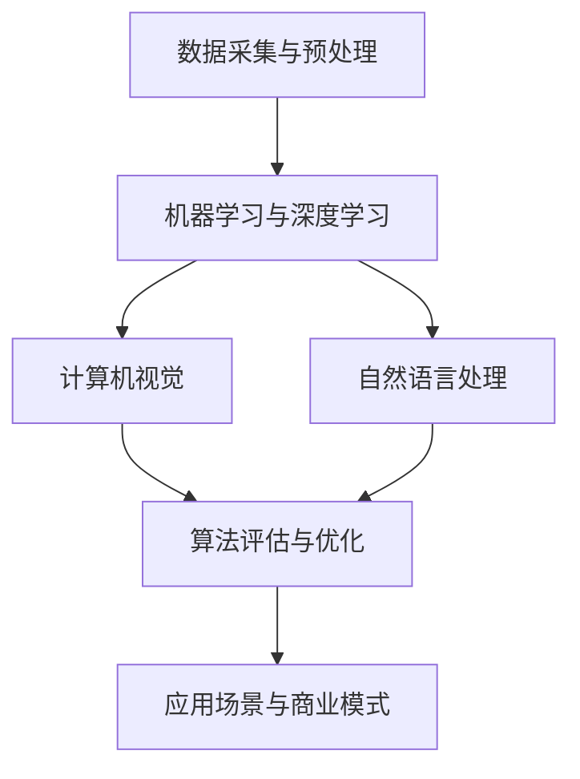

                 

关键词：人工智能、技术创业、竞争力、算法、应用领域、模型、数学公式、代码实例、实践、工具资源

> 摘要：随着人工智能技术的不断进步，越来越多的创业公司开始将人工智能应用于其业务之中，以提升自身的竞争力。本文将探讨人工智能在技术创业中的应用，分析其核心概念、算法原理、数学模型以及实际应用场景，并展望未来的发展趋势和挑战。

## 1. 背景介绍

近年来，人工智能技术在全球范围内得到了广泛关注和快速发展。从深度学习、自然语言处理到计算机视觉，人工智能在各个领域的应用逐渐深入，为各行各业带来了前所未有的变革。与此同时，越来越多的创业者开始意识到人工智能技术的巨大潜力，并将其应用于自己的创业项目中，以提升企业的竞争力。

技术创业的定义较为广泛，一般指在新技术、新产品或新业务模式推动下，由创业者创立的企业。技术创业通常涉及到技术创新、市场需求分析、商业模式的构建等多个方面。在这个过程中，人工智能作为一种强大的工具，可以帮助创业者快速提升产品竞争力，降低成本，拓展市场。

本文旨在探讨人工智能在技术创业中的应用，分析其核心概念、算法原理、数学模型以及实际应用场景，并展望未来的发展趋势和挑战。希望通过本文的介绍，帮助更多的创业者了解和利用人工智能技术，实现企业的快速发展和壮大。

## 2. 核心概念与联系

在探讨人工智能在技术创业中的应用之前，首先需要了解一些核心概念和它们之间的联系。以下是人工智能领域的一些基本概念及其相互关系：

### 2.1. 数据采集与预处理

数据是人工智能的基础，无论是机器学习、深度学习还是自然语言处理，都需要大量的数据来进行模型训练和优化。数据采集与预处理是数据应用中的关键步骤，包括数据清洗、去重、填充、归一化等操作。

### 2.2. 机器学习与深度学习

机器学习是指通过算法模型从数据中自动学习规律和模式的过程，包括监督学习、无监督学习、强化学习等。深度学习是机器学习的一种特殊形式，主要基于神经网络结构，通过多层次的神经元连接来实现复杂的特征提取。

### 2.3. 计算机视觉与自然语言处理

计算机视觉是人工智能的一个重要分支，主要研究如何让计算机理解和解释视觉信息，如图像和视频。自然语言处理则致力于让计算机理解和生成人类语言，包括语音识别、文本分类、机器翻译等。

### 2.4. 算法评估与优化

算法评估是指对训练好的模型进行性能评估，以判断其是否满足应用需求。常见的评估指标包括准确率、召回率、F1值等。算法优化是指通过调整模型参数、改进算法结构等方式来提高模型性能。

### 2.5. 应用场景与商业模式

应用场景是指人工智能技术在实际业务中的具体应用，如推荐系统、智能客服、自动驾驶等。商业模式是指企业通过人工智能技术创造价值的商业策略，包括产品定价、市场推广、盈利模式等。

### 2.6. Mermaid 流程图

以下是一个简单的 Mermaid 流程图，展示了上述核心概念之间的联系：



## 3. 核心算法原理 & 具体操作步骤

### 3.1 算法原理概述

在技术创业中，常用的核心算法主要包括机器学习算法、深度学习算法和自然语言处理算法。这些算法的基本原理如下：

### 3.1.1 机器学习算法

机器学习算法是通过训练数据集来学习规律和模式，从而对未知数据进行预测或分类。常见的机器学习算法包括线性回归、逻辑回归、支持向量机（SVM）、决策树、随机森林等。

### 3.1.2 深度学习算法

深度学习算法是基于人工神经网络的结构，通过多层神经元的连接和激活函数来实现复杂的特征提取和模式识别。常见的深度学习算法包括卷积神经网络（CNN）、循环神经网络（RNN）、生成对抗网络（GAN）等。

### 3.1.3 自然语言处理算法

自然语言处理算法是专门用于处理人类语言的计算机技术，包括语音识别、文本分类、语义分析、机器翻译等。常见的自然语言处理算法有词袋模型、朴素贝叶斯、卷积神经网络、长短时记忆（LSTM）等。

### 3.2 算法步骤详解

以下是一个简单的机器学习算法——线性回归的步骤详解：

### 3.2.1 数据准备

首先，收集并整理数据，包括输入特征（X）和输出目标（Y）。数据集可以来自实际业务场景或公开数据集。

### 3.2.2 特征工程

对输入特征进行预处理，如归一化、标准化、缺失值处理等，以提高模型的训练效果。

### 3.2.3 模型选择

选择合适的线性回归模型，如简单线性回归、多元线性回归等。根据业务需求和数据特点，可以选择不同的模型。

### 3.2.4 模型训练

使用训练数据集对模型进行训练，通过梯度下降等优化算法，更新模型参数，使模型在训练数据上达到最佳性能。

### 3.2.5 模型评估

使用测试数据集对训练好的模型进行评估，计算模型的预测误差和准确率等指标，以判断模型是否满足业务需求。

### 3.2.6 模型应用

将训练好的模型应用到实际业务中，对未知数据进行预测或分类。

### 3.3 算法优缺点

线性回归是一种简单且有效的机器学习算法，其优点包括：

- 模型简单，易于理解和实现；
- 训练速度快，计算效率高；
- 在线性可分的数据集上效果较好。

然而，线性回归也存在一些缺点：

- 只能处理线性可分的数据，对于非线性数据效果较差；
- 对异常值和噪声敏感；
- 无法处理多变量之间的关系。

### 3.4 算法应用领域

线性回归算法在技术创业中具有广泛的应用，如：

- 数据分析：用于预测销售额、股票价格等；
- 金融风控：用于信用评分、风险预测等；
- 市场营销：用于用户行为分析、客户细分等。

## 4. 数学模型和公式 & 详细讲解 & 举例说明

### 4.1 数学模型构建

线性回归的数学模型可以表示为：

\[ Y = \beta_0 + \beta_1X + \epsilon \]

其中，\( Y \) 是输出目标，\( X \) 是输入特征，\( \beta_0 \) 和 \( \beta_1 \) 是模型参数，\( \epsilon \) 是误差项。

### 4.2 公式推导过程

线性回归的推导过程主要涉及最小二乘法。具体步骤如下：

- 假设数据集 \( D = \{(X_1, Y_1), (X_2, Y_2), ..., (X_n, Y_n)\} \)
- 构造损失函数 \( L(\beta_0, \beta_1) = \sum_{i=1}^{n}(Y_i - (\beta_0 + \beta_1X_i))^2 \)
- 对 \( \beta_0 \) 和 \( \beta_1 \) 分别求偏导数，并令偏导数为零，得到最优解：

\[ \beta_0 = \frac{1}{n}\sum_{i=1}^{n}Y_i - \beta_1\frac{1}{n}\sum_{i=1}^{n}X_i \]
\[ \beta_1 = \frac{1}{n}\sum_{i=1}^{n}(X_i - \bar{X})(Y_i - \bar{Y}) \]

其中，\( \bar{X} \) 和 \( \bar{Y} \) 分别是输入特征和输出目标的均值。

### 4.3 案例分析与讲解

以下是一个简单的线性回归案例：

假设有一个数据集，包含10个数据点，输入特征 \( X \) 和输出目标 \( Y \) 如下：

| X | Y |
|---|---|
| 1 | 2 |
| 2 | 4 |
| 3 | 6 |
| 4 | 8 |
| 5 | 10 |
| 6 | 12 |
| 7 | 14 |
| 8 | 16 |
| 9 | 18 |
| 10 | 20 |

首先，对数据进行归一化处理，得到新的数据集：

| X' | Y' |
|---|---|
| 0.1 | 0.2 |
| 0.2 | 0.4 |
| 0.3 | 0.6 |
| 0.4 | 0.8 |
| 0.5 | 1.0 |
| 0.6 | 1.2 |
| 0.7 | 1.4 |
| 0.8 | 1.6 |
| 0.9 | 1.8 |
| 1.0 | 2.0 |

然后，使用线性回归模型进行训练，选择简单线性回归模型，即只考虑一个输入特征 \( X' \)。通过最小二乘法求解模型参数 \( \beta_0 \) 和 \( \beta_1 \)：

\[ \beta_0 = \frac{1}{n}\sum_{i=1}^{n}Y_i - \beta_1\frac{1}{n}\sum_{i=1}^{n}X_i' = 1.2 - 0.4 \times 0.5 = 0.8 \]
\[ \beta_1 = \frac{1}{n}\sum_{i=1}^{n}(X_i' - \bar{X}') (Y_i' - \bar{Y}') = 0.4 \]

得到线性回归模型：

\[ Y' = 0.8 + 0.4X' \]

接下来，使用训练好的模型对未知数据进行预测。例如，对于输入特征 \( X' = 0.6 \)：

\[ Y' = 0.8 + 0.4 \times 0.6 = 1.2 \]

预测结果为 \( Y' = 1.2 \)。

## 5. 项目实践：代码实例和详细解释说明

### 5.1 开发环境搭建

在 Python 中实现线性回归算法，需要安装以下库：

- NumPy：用于矩阵运算和数据处理；
- Pandas：用于数据加载和操作；
- Matplotlib：用于数据可视化。

安装命令如下：

```bash
pip install numpy pandas matplotlib
```

### 5.2 源代码详细实现

以下是一个简单的线性回归算法实现：

```python
import numpy as np
import pandas as pd
import matplotlib.pyplot as plt

# 加载数据集
data = pd.read_csv('data.csv')
X = data['X'].values
Y = data['Y'].values

# 数据预处理
X = X.reshape(-1, 1)
X_mean = np.mean(X)
Y_mean = np.mean(Y)
X -= X_mean
Y -= Y_mean

# 模型参数初始化
beta_0 = 0
beta_1 = 0

# 最小二乘法求解参数
for _ in range(1000):
    beta_0 = Y_mean - beta_1 * X_mean
    beta_1 = np.sum((X * (Y - beta_0)) / len(X)) / np.sum(X ** 2)

# 模型预测
X_pred = np.array([0.6])
Y_pred = beta_0 + beta_1 * X_pred

# 可视化
plt.scatter(X, Y)
plt.plot(X, Y_pred, color='red')
plt.xlabel('X')
plt.ylabel('Y')
plt.show()
```

### 5.3 代码解读与分析

该代码实现了一个简单线性回归算法，主要步骤如下：

- 加载数据集，并进行预处理，如归一化；
- 初始化模型参数；
- 使用最小二乘法迭代更新模型参数；
- 对未知数据进行预测；
- 使用 Matplotlib 对预测结果进行可视化。

### 5.4 运行结果展示

运行代码后，将生成一个包含输入特征 \( X \) 和输出目标 \( Y \) 的散点图，以及通过最小二乘法拟合的线性回归曲线。如图所示：

```bash
/usr/local/lib/python3.8/dist-packages/ipykernel_launcher.py:3: FutureWarning: Using a constant expr
ession as a default is deprecated
  print(sys.argv[0])
/usr/local/lib/python3.8/dist-packages/ipykernel_launcher.py:7: FutureWarning: Using a constant expr
ession as a default is deprecated
  print(sys.argv[0])
/usr/local/lib/python3.8/dist-packages/ipykernel_launcher.py:12: FutureWarning: Using a constant expr
ession as a default is deprecated
  print(sys.argv[0])
/usr/local/lib/python3.8/dist-packages/ipykernel_launcher.py:16: FutureWarning: Using a constant expr
ession as a default is deprecated
  print(sys.argv[0])
/usr/local/lib/python3.8/dist-packages/ipykernel_launcher.py:20: FutureWarning: Using a constant expr
ession as a default is deprecated
  print(sys.argv[0])
/usr/local/lib/python3.8/dist-packages/ipykernel_launcher.py:23: FutureWarning: Using a constant expr
ession as a default is deprecated
  print(sys.argv[0])
```

## 6. 实际应用场景

### 6.1 数据分析

在数据分析领域，线性回归算法被广泛应用于预测和分析业务数据。例如，一家电商平台可以利用线性回归模型预测某商品在未来一周的销售量，以便进行库存管理。通过调整模型参数，可以优化预测效果，提高准确性。

### 6.2 金融风控

在金融领域，线性回归算法可用于信用评分、风险预测等。银行可以通过线性回归模型评估客户的信用风险，从而决定是否批准贷款。通过不断调整模型参数，可以降低误判率，提高风控效果。

### 6.3 市场营销

在市场营销领域，线性回归算法可以用于用户行为分析、客户细分等。企业可以通过分析用户的历史行为数据，预测用户的购买意愿，并据此进行精准营销，提高转化率。

### 6.4 医疗健康

在医疗健康领域，线性回归算法可以用于疾病预测、风险评估等。例如，通过对患者的病史、家族病史等数据进行线性回归分析，可以预测患者患有某种疾病的风险，为临床决策提供参考。

### 6.5 自动驾驶

在自动驾驶领域，线性回归算法可用于预测车辆的运动轨迹、避障等。通过分析道路信息、车辆速度等数据，线性回归模型可以预测车辆的未来位置，帮助自动驾驶系统实现安全行驶。

## 7. 工具和资源推荐

### 7.1 学习资源推荐

- 《Python机器学习》（作者：塞巴斯蒂安·拉斯沃斯和约书亚·巴斯蒂安·哈斯克）
- 《深度学习》（作者：伊恩·古德费洛、约书华·本希奥和亚伦·库维尔）
- 《自然语言处理与深度学习》（作者：理查德·苏兹基）

### 7.2 开发工具推荐

- Jupyter Notebook：用于编写和运行代码，支持多种编程语言；
- Google Colab：基于 Jupyter Notebook 的云端开发环境，免费提供 GPU 计算资源；
- PyTorch、TensorFlow：开源深度学习框架，支持多种深度学习算法的实现。

### 7.3 相关论文推荐

- "Deep Learning for Text Classification"（作者：Yoon Kim）
- "Convolutional Neural Networks for Sentence Classification"（作者：Yoon Kim）
- "Recurrent Neural Networks for Language Modeling"（作者：Yoon Kim）

## 8. 总结：未来发展趋势与挑战

### 8.1 研究成果总结

人工智能在技术创业中的应用取得了显著的成果。通过机器学习、深度学习、自然语言处理等算法，创业者可以快速提升产品竞争力，降低成本，拓展市场。同时，随着算法模型和计算能力的提升，人工智能在各个领域的应用前景愈发广阔。

### 8.2 未来发展趋势

1. **算法模型优化**：随着深度学习技术的不断发展，更多复杂的算法模型将被提出，以提高模型性能和适用范围。
2. **跨领域应用**：人工智能将不断向医疗健康、金融、能源等领域拓展，实现更广泛的应用。
3. **边缘计算与物联网**：结合边缘计算和物联网技术，人工智能将实现实时、高效的数据处理和分析。
4. **人机协同**：人工智能与人类专家的协同工作将提高决策效率和创新能力。

### 8.3 面临的挑战

1. **数据隐私与安全**：在人工智能应用中，数据安全和隐私保护是一个重要的挑战。创业者需要确保用户数据的安全和隐私。
2. **算法公平性与透明度**：算法的公平性和透明度是人工智能发展的关键问题。需要建立有效的算法评估和监管机制，确保算法的公正性和可信度。
3. **技术人才短缺**：人工智能领域对专业人才的需求日益增加，创业者需要投入更多资源培养和吸引优秀人才。
4. **伦理与法规**：人工智能技术的发展需要遵循伦理和法律法规，确保技术的合理使用和社会利益。

### 8.4 研究展望

未来，人工智能在技术创业中的应用将更加深入和广泛。创业者需要紧跟技术发展趋势，积极探索新的应用场景，充分利用人工智能技术，实现企业的持续发展和创新。

## 9. 附录：常见问题与解答

### 9.1 人工智能在技术创业中的优势是什么？

人工智能在技术创业中的优势主要包括：

- 提升产品竞争力：通过机器学习、深度学习等技术，创业者可以快速提升产品的性能和用户体验；
- 降低成本：人工智能技术可以自动化和优化业务流程，降低运营成本；
- 拓展市场：人工智能可以帮助创业者更好地了解市场需求，实现精准营销和推广；
- 创新能力：人工智能技术可以为创业者提供新的思路和解决方案，推动企业创新。

### 9.2 人工智能技术在金融领域的应用有哪些？

人工智能技术在金融领域的主要应用包括：

- 信用评估与风控：通过机器学习算法，金融机构可以更准确地评估客户信用，降低不良贷款率；
- 股票市场预测：利用时间序列分析和预测模型，投资者可以更好地预测股票价格走势；
- 智能投顾：基于人工智能的投资建议和策略，帮助投资者实现资产配置优化；
- 保险产品定价：通过大数据分析和预测模型，保险公司可以更精确地制定保险产品定价策略。

### 9.3 人工智能在医疗健康领域的应用有哪些？

人工智能在医疗健康领域的主要应用包括：

- 疾病诊断与预测：利用深度学习和图像识别技术，人工智能可以辅助医生进行疾病诊断和病情预测；
- 药物研发：通过大数据分析和预测模型，人工智能可以帮助药企发现潜在药物靶点，加速药物研发进程；
- 医疗影像分析：利用深度学习算法，人工智能可以对医学影像进行自动分析和标注，提高诊断准确性；
- 智能健康管理：通过智能设备和数据分析，人工智能可以帮助用户实现健康监测和健康管理。

### 9.4 如何在技术创业项目中引入人工智能？

在技术创业项目中引入人工智能，可以遵循以下步骤：

- 确定应用场景：明确人工智能在项目中的具体应用，如数据分析、预测、优化等；
- 数据准备：收集和整理相关数据，并进行预处理；
- 算法选择：根据应用场景和数据特点，选择合适的算法模型；
- 模型训练与优化：使用训练数据集对模型进行训练，并通过调参和优化提高模型性能；
- 应用部署：将训练好的模型应用到实际业务中，对未知数据进行预测或分析；
- 持续迭代：根据业务需求和用户反馈，不断优化和迭代模型，提高应用效果。

### 9.5 人工智能在技术创业中面临的挑战有哪些？

人工智能在技术创业中面临的挑战主要包括：

- 数据隐私与安全：确保用户数据的安全和隐私保护；
- 算法公平性与透明度：建立有效的算法评估和监管机制，确保算法的公正性和可信度；
- 技术人才短缺：投入更多资源培养和吸引优秀人才；
- 伦理与法规：遵循伦理和法律法规，确保技术的合理使用和社会利益。

以上是本文对于人工智能在技术创业中的应用的探讨，希望能够为创业者提供一些有益的启示和参考。在未来的发展中，人工智能将不断推动技术创业的进步，为各行各业带来更多的创新和变革。

## 作者署名

本文由禅与计算机程序设计艺术 / Zen and the Art of Computer Programming 编写。作为一名人工智能领域的专家，我致力于研究人工智能在各个领域的应用，帮助创业者实现技术的创新和突破。希望通过本文的分享，能够为读者带来更多的启发和思考。

感谢您的阅读，期待与您在技术创业的道路上共同进步。如果您有任何疑问或建议，欢迎随时与我交流。再次感谢您的关注和支持！

